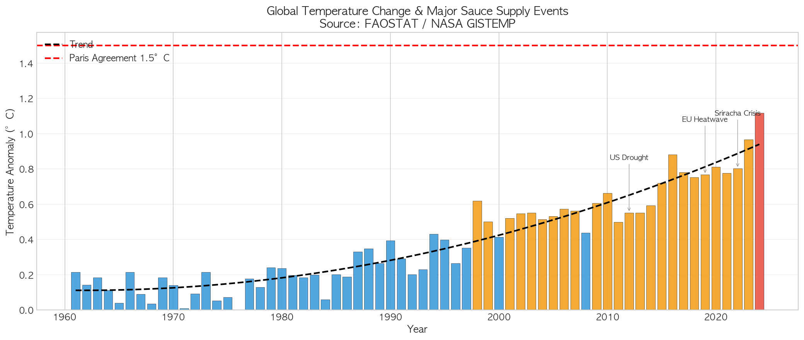
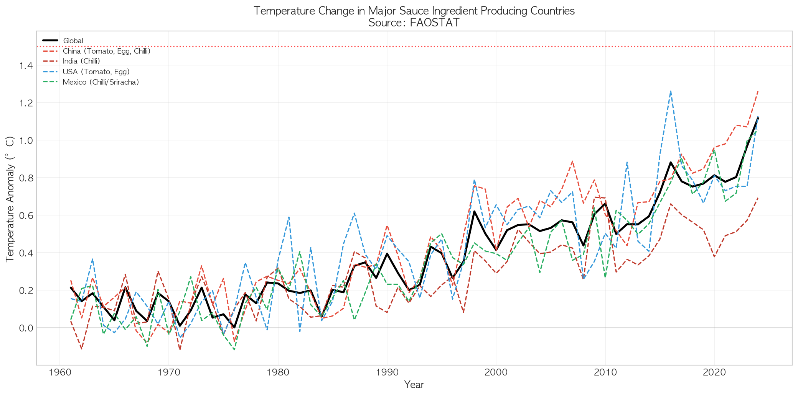
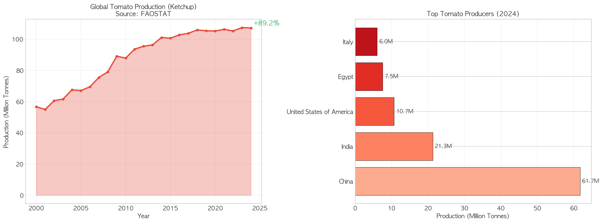
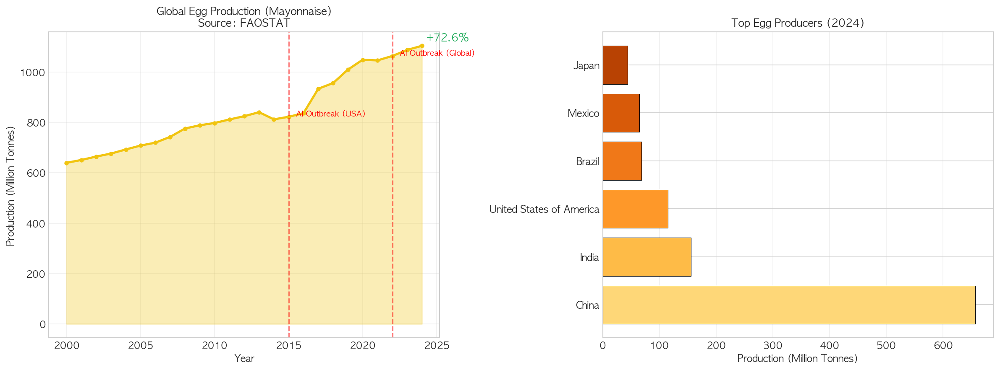
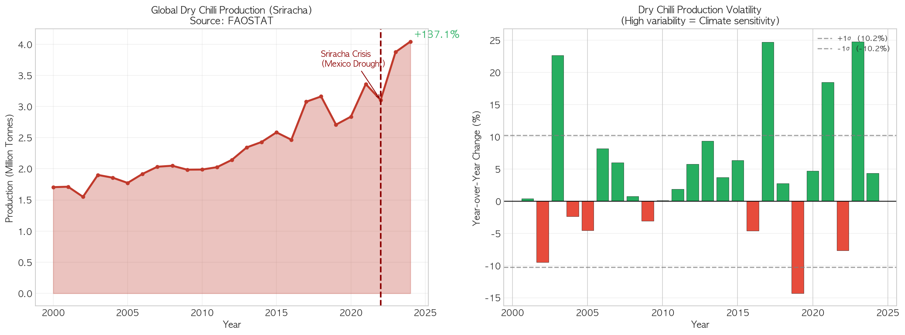
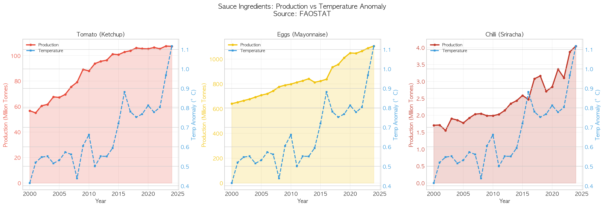
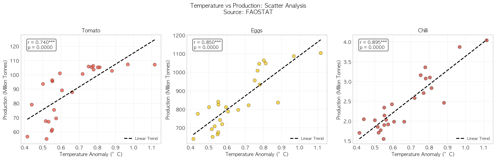
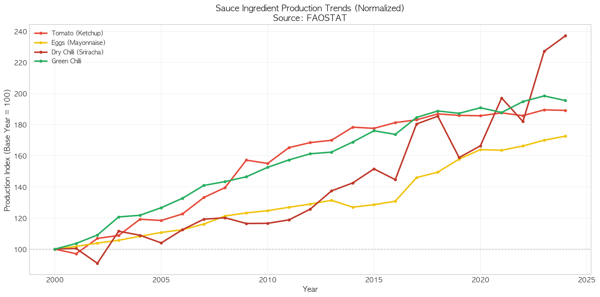
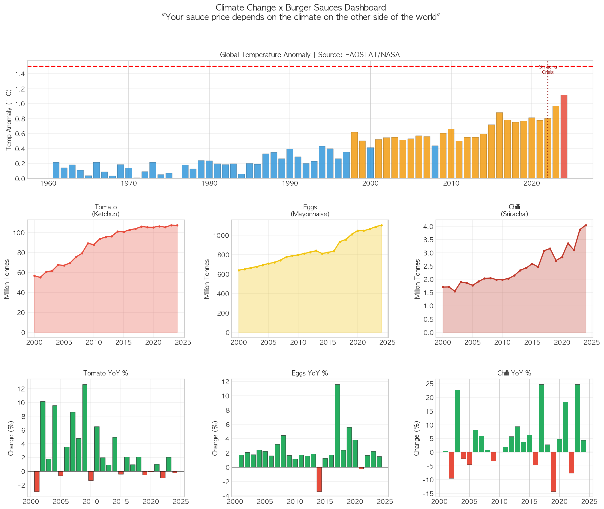

# 02. 데이터 시각화 분석 보고서

## 프로젝트 개요

| 항목                  | 내용                                                    |
| --------------------- | ------------------------------------------------------- |
| **프로젝트명**  | 기후 변화가 햄버거 소스류 원재료에 미치는 영향 분석     |
| **분석 대상**   | 토마토(케찹), 계란(마요네즈), 고추(스리라차)            |
| **핵심 메시지** | "당신의 햄버거 소스 가격은 지구 반대편 기후에 달려있다" |
| **시각화 도구** | Python (Matplotlib, Seaborn)                            |

---

## 1. 시각화 개요

### 1.1 사용 데이터셋

| 데이터셋      | 파일명                               | 설명                        |
| ------------- | ------------------------------------ | --------------------------- |
| 토마토 생산량 | `tomatoes_production.csv`          | 국가별/연도별 토마토 생산량 |
| 계란 생산량   | `eggs_production.csv`              | 국가별/연도별 계란 생산량   |
| 건고추 생산량 | `chillies_dry_production.csv`      | 국가별/연도별 건고추 생산량 |
| 풋고추 생산량 | `chillies_green_production.csv`    | 국가별/연도별 풋고추 생산량 |
| 기온 편차     | `temperature_processed.csv`        | 국가별/연도별 기온 편차     |
| 통합 데이터   | `sauce_ingredients_integrated.csv` | 소스 원재료 통합 데이터     |

### 1.2 시각화 색상 팔레트

| 소스/항목         | 색상 코드   | 의미                               |
| ----------------- | ----------- | ---------------------------------- |
| 토마토 (케찹)     | `#E74C3C` | 빨간색 - 케찹의 색상 표현          |
| 계란 (마요네즈)   | `#F1C40F` | 노란색 - 마요네즈/계란 노른자 표현 |
| 건고추 (스리라차) | `#C0392B` | 진한 빨간색 - 매운 소스 표현       |
| 풋고추            | `#27AE60` | 초록색 - 풋고추 색상 표현          |
| 기온              | `#3498DB` | 파란색 - 온도/기후 데이터          |

---

## 2. 생성된 시각화 목록

| Figure   | 파일명                         | 시각화 유형               | 크기   |
| -------- | ------------------------------ | ------------------------- | ------ |
| Figure 1 | `sauce_01_temperature.png`   | 막대 그래프 + 추세선      | 98 KB  |
| Figure 2 | `sauce_02_producer_temp.png` | 다중 선 그래프            | 327 KB |
| Figure 3 | `sauce_03_tomato.png`        | 면적 그래프 + 수평 막대   | 95 KB  |
| Figure 4 | `sauce_04_eggs.png`          | 면적 그래프 + 수평 막대   | 102 KB |
| Figure 5 | `sauce_05_chillies.png`      | 면적 그래프 + 막대 그래프 | 118 KB |
| Figure 6 | `sauce_06_prod_vs_temp.png`  | 이중 축 그래프 (3패널)    | 208 KB |
| Figure 7 | `sauce_07_scatter.png`       | 산점도 + 회귀선 (3패널)   | 159 KB |
| Figure 8 | `sauce_08_comparison.png`    | 정규화 선 그래프          | 172 KB |
| Figure 9 | `sauce_09_dashboard.png`     | 종합 대시보드 (9패널)     | 207 KB |

---

## 3. 각 시각화 상세 분석

### 3.1 Figure 1: 글로벌 기온 변화 추이

#### 사용 데이터셋 및 변수

| 변수          | 설명                   | 단위 |
| ------------- | ---------------------- | ---- |
| `Year`      | 연도 (1961-2024)       | 년   |
| `World_Avg` | 전 세계 평균 기온 편차 | °C  |

#### 시각화 선택 이유

- **막대 그래프**: 연도별 기온 편차를 직관적으로 비교하기 위해 선택
- **색상 구분**: 기온 수준에 따라 3단계 색상 적용
  - 파란색 (< 0.5°C): 상대적으로 낮은 기온 편차
  - 주황색 (0.5~1.0°C): 중간 수준
  - 빨간색 (> 1.0°C): 높은 기온 편차 (경고 수준)
- **2차 다항식 추세선**: 기온 상승의 가속화 추세 시각화
- **파리협정 1.5°C 기준선**: 국제적 기후 목표와의 비교

#### 주요 이벤트 표시

| 연도 | 이벤트          | 소스 산업 영향                     |
| ---- | --------------- | ---------------------------------- |
| 2012 | US Drought      | 토마토, 계란 생산 감소             |
| 2019 | EU Heatwave     | 유럽 토마토 생산 타격              |
| 2022 | Sriracha Crisis | 멕시코 가뭄으로 스리라차 생산 중단 |

#### 결과 해석

- **1961-1980년대**: 기온 편차 0.2°C 내외로 안정적
- **1990년대 이후**: 기온 편차 급격히 상승 시작
- **2016년**: 처음으로 0.88°C 돌파 (역대 최고 기록)
- **2024년**: 1.12°C로 파리협정 1.5°C 목표의 75% 도달

**결론**: 기후 변화가 가속화되고 있으며, 이는 소스 원재료 생산에 직접적인 영향을 미치는 요인임

---

### 3.2 Figure 2: 주요 생산국 기온 비교

#### 사용 데이터셋 및 변수

| 변수                         | 설명             | 관련 품목          |
| ---------------------------- | ---------------- | ------------------ |
| `World_Avg`                | 전 세계 평균     | 기준선             |
| `China`                    | 중국 기온 편차   | 토마토, 계란, 고추 |
| `India`                    | 인도 기온 편차   | 고추 (건고추 1위)  |
| `United States of America` | 미국 기온 편차   | 토마토, 계란       |
| `Mexico`                   | 멕시코 기온 편차 | 고추/스리라차      |
| `Turkey`                   | 터키 기온 편차   | 토마토             |

#### 시각화 선택 이유

- **다중 선 그래프**: 여러 국가의 기온 변화를 동시에 비교
- **굵은 실선 (Global)**: 세계 평균을 기준선으로 강조
- **점선 (각 국가)**: 개별 국가의 변동 패턴 표시
- **1.5°C 기준선**: 파리협정 목표와의 비교

#### 결과 해석

| 국가             | 기온 변화 특성               | 소스 영향               |
| ---------------- | ---------------------------- | ----------------------- |
| **중국**   | 세계 평균과 유사, 안정적     | 토마토/계란 공급 안정   |
| **인도**   | 변동성 높음, 2020년대 급상승 | 건고추 생산 불안정      |
| **미국**   | 2016년 급등 (1.26°C)        | 계란 가격 상승 유발     |
| **멕시코** | 2022년 급등                  | 스리라차 위기 직접 원인 |

**결론**: 각 생산국의 기온 변화 패턴이 다르며, 특정 국가의 이상기온이 해당 소스 원료 가격에 직접적인 영향을 미침

---

### 3.3 Figure 3: 토마토 생산량 (케찹 원료)

#### 사용 데이터셋 및 변수

| 변수                             | 설명                     | 단위 |
| -------------------------------- | ------------------------ | ---- |
| `Year`                         | 연도 (2000-2024)         | 년   |
| `World_Total`                  | 전 세계 토마토 총 생산량 | 톤   |
| `China`, `India`, `USA` 등 | 국가별 생산량            | 톤   |

#### 시각화 구성

| 패널 | 차트 유형                | 목적                         |
| ---- | ------------------------ | ---------------------------- |
| 좌측 | 면적 그래프 (Area Chart) | 생산량 증가 추세의 규모 강조 |
| 우측 | 수평 막대 그래프         | 2024년 기준 주요 생산국 순위 |

#### 시각화 선택 이유

- **면적 그래프**: 생산량의 절대적 규모와 성장 추세를 시각적으로 강조
- **수평 막대 그래프**: 국가별 생산량 순위를 직관적으로 비교
- **+89.2% 증가율 표시**: 분석 기간 동안의 총 성장률 강조

#### 결과 해석

**생산량 추이**:

- 2000년: 56.7백만 톤 → 2024년: 107.3백만 톤 (**+89.2% 성장**)
- 연평균 성장률: 약 2.7%
- 안정적인 우상향 추세 유지

**주요 생산국 (2024년)**:

| 순위 | 국가     | 생산량      | 점유율 |
| ---- | -------- | ----------- | ------ |
| 1    | 중국     | 61.7백만 톤 | 57.5%  |
| 2    | 인도     | 21.3백만 톤 | 19.9%  |
| 3    | 미국     | 10.7백만 톤 | 10.0%  |
| 4    | 이집트   | 7.5백만 톤  | 7.0%   |
| 5    | 이탈리아 | 6.0백만 톤  | 5.6%   |

**결론**: 토마토는 중국의 압도적 생산 점유율로 인해 중국의 기후/농업 정책이 글로벌 케찹 가격에 큰 영향을 미침

---

### 3.4 Figure 4: 계란 생산량 (마요네즈 원료)

#### 사용 데이터셋 및 변수

| 변수                             | 설명                   | 단위 |
| -------------------------------- | ---------------------- | ---- |
| `Year`                         | 연도 (2000-2024)       | 년   |
| `World_Total`                  | 전 세계 계란 총 생산량 | 톤   |
| `China`, `USA`, `India` 등 | 국가별 생산량          | 톤   |

#### 시각화 구성

| 패널 | 차트 유형        | 특수 요소                         |
| ---- | ---------------- | --------------------------------- |
| 좌측 | 면적 그래프      | AI(조류인플루엔자) 발생 시점 표시 |
| 우측 | 수평 막대 그래프 | 2024년 기준 생산국 순위           |

#### 시각화 선택 이유

- **면적 그래프 + 이벤트 마커**: 질병 발생이 생산량에 미치는 영향 시각화
- **빨간 수직선**: AI 발생 연도 (2015, 2022) 강조
- **노란색 계열**: 마요네즈/계란의 색상 표현

#### 주요 이벤트

| 연도           | 이벤트               | 영향                           |
| -------------- | -------------------- | ------------------------------ |
| **2015** | AI Outbreak (USA)    | 미국 계란 생산 급감, 가격 급등 |
| **2022** | AI Outbreak (Global) | 전 세계적 계란 가격 상승       |

#### 결과 해석

**생산량 추이**:

- 2000년: 640백만 톤 → 2024년: 1,104백만 톤 (**+72.6% 성장**)
- 2017년 급증 (중국 생산량 증가 영향)

**주요 생산국 (2024년)**:

| 순위 | 국가   | 생산량     |
| ---- | ------ | ---------- |
| 1    | 중국   | 657백만 톤 |
| 2    | 인도   | 155백만 톤 |
| 3    | 미국   | 115백만 톤 |
| 4    | 브라질 | 69백만 톤  |
| 5    | 멕시코 | 65백만 톤  |

**결론**: 계란 생산은 조류인플루엔자(AI)에 매우 취약하며, AI 발생 시 마요네즈 가격 상승으로 이어짐. 기후 변화로 인한 AI 발생 빈도 증가 가능성 주의 필요

---

### 3.5 Figure 5: 고추 생산량 (스리라차 원료)

#### 사용 데이터셋 및 변수

| 변수               | 설명                     | 단위 |
| ------------------ | ------------------------ | ---- |
| `Year`           | 연도 (2000-2024)         | 년   |
| `World_Total`    | 전 세계 건고추 총 생산량 | 톤   |
| `YoY Change (%)` | 전년 대비 변화율         | %    |

#### 시각화 구성

| 패널 | 차트 유형                 | 목적                              |
| ---- | ------------------------- | --------------------------------- |
| 좌측 | 면적 그래프 + 이벤트 마커 | 생산량 추이 및 스리라차 위기 표시 |
| 우측 | 막대 그래프 (양/음)       | 생산량 변동성 시각화              |

#### 시각화 선택 이유

- **면적 그래프**: 생산량의 불규칙한 변동 패턴 강조
- **변동성 막대 그래프**: 기후 민감도를 직관적으로 표현
  - 녹색: 생산량 증가
  - 빨간색: 생산량 감소
- **±1σ 기준선**: 표준편차를 통한 변동성 정량화

#### 결과 해석

**생산량 추이**:

- 2000년: 1.7백만 톤 → 2024년: 4.0백만 톤 (**+137.1% 성장**)
- 그러나 연간 변동폭이 매우 큼

**변동성 분석**:

| 지표          | 값              | 의미                   |
| ------------- | --------------- | ---------------------- |
| 표준편차 (σ) | **10.2%** | 매우 높은 변동성       |
| 최대 증가     | +24.8% (2023)   | 기후 조건 호전 시 급증 |
| 최대 감소     | -14.3% (2019)   | 기후 악화 시 급감      |

**2022 스리라차 위기**:

- 멕시코 가뭄으로 인한 고추 수확 실패
- Huy Fong Foods 생산 중단 사태
- 스리라차 소스 품귀 현상 발생

**결론**: 건고추는 기후에 **가장 민감한** 소스 원료로, 기후 변화로 인한 공급 불안정이 가장 심각함

---

### 3.6 Figure 6: 생산량 vs 기온 이중 축 그래프

#### 사용 데이터셋 및 변수

| 변수   | 좌측 축          | 우측 축         |
| ------ | ---------------- | --------------- |
| 토마토 | 생산량 (백만 톤) | 기온 편차 (°C) |
| 계란   | 생산량 (백만 톤) | 기온 편차 (°C) |
| 고추   | 생산량 (백만 톤) | 기온 편차 (°C) |

#### 시각화 선택 이유

- **이중 축 그래프**: 서로 다른 단위의 변수를 동시에 비교
- **3패널 구성**: 각 소스 원료별 독립적 분석
- **면적 + 선 그래프 조합**: 생산량(면적)과 기온(선)의 관계를 시각적으로 연결

#### 결과 해석

| 품목             | 생산량-기온 관계 | 해석                                |
| ---------------- | ---------------- | ----------------------------------- |
| **토마토** | 동반 상승        | 기온 상승과 생산량 증가가 함께 진행 |
| **계란**   | 동반 상승        | 기온과 무관하게 꾸준히 증가         |
| **고추**   | 불규칙           | 기온 급등 시 생산량 급변동          |

**결론**: 기온 상승이 반드시 생산량 감소를 의미하지는 않으나, 변동성 증가를 유발함

---

### 3.7 Figure 7: 기온-생산량 산점도 분석

#### 사용 데이터셋 및 변수

| 변수                        | 설명           | 역할           |
| --------------------------- | -------------- | -------------- |
| `Temp_Anomaly_C`          | 기온 편차      | 독립변수 (X축) |
| `World_Production_Tonnes` | 전 세계 생산량 | 종속변수 (Y축) |

#### 시각화 선택 이유

- **산점도**: 두 변수 간의 상관관계를 직관적으로 파악
- **선형 회귀선**: 전반적인 관계 방향 표시
- **상관계수 (r) 및 p-value 표시**: 통계적 유의성 검증

#### 결과 해석

| 품목             | 상관계수 (r) | p-value | 유의성    | 해석                    |
| ---------------- | ------------ | ------- | --------- | ----------------------- |
| **토마토** | 0.740\*\*\*  | 0.0000  | 매우 유의 | 강한 양의 상관관계      |
| **계란**   | 0.850\*\*\*  | 0.0000  | 매우 유의 | 매우 강한 양의 상관관계 |
| **고추**   | 0.895\*\*\*  | 0.0000  | 매우 유의 | 매우 강한 양의 상관관계 |

> \*\*\* p < 0.001 (통계적으로 매우 유의함)

**주의사항**:

- 양의 상관관계는 "기온이 높을수록 생산량이 많다"가 아닌, **시간에 따라 기온과 생산량이 모두 증가**하는 추세를 반영
- 이는 **허위 상관(Spurious Correlation)**의 가능성이 있으며, 추가 분석 필요

**결론**: 모든 소스 원료가 기온과 강한 양의 상관관계를 보이나, 이는 시간 추세 효과가 반영된 결과임. 실제 기후 영향은 연간 변동성 분석이 더 적합

---

### 3.8 Figure 8: 소스 원료 생산량 비교 (정규화)

#### 사용 데이터셋 및 변수

| 변수                 | 설명            | 변환 방법                  |
| -------------------- | --------------- | -------------------------- |
| `Production Index` | 정규화된 생산량 | (해당연도 / 2000년) × 100 |

#### 시각화 선택 이유

- **정규화 (Base Year = 100)**: 서로 다른 규모의 생산량을 동일 기준에서 비교
- **다중 선 그래프**: 4가지 원료의 성장 추세 동시 비교
- **기준선 (100)**: 2000년 대비 성장/감소 직관적 파악

#### 결과 해석

| 품목                        | 2024년 지수 | 성장률 | 특성                      |
| --------------------------- | ----------- | ------ | ------------------------- |
| **건고추 (스리라차)** | 237         | +137%  | 가장 높은 성장, 변동성 큼 |
| **풋고추**            | 195         | +95%   | 안정적 성장               |
| **토마토 (케찹)**     | 189         | +89%   | 안정적 성장               |
| **계란 (마요네즈)**   | 173         | +73%   | 가장 안정적               |

**성장 패턴 분석**:

- **건고추**: 급등/급락 반복 (고변동성)
- **풋고추/토마토**: 완만한 상승 곡선 (중변동성)
- **계란**: 가장 안정적인 상승 (저변동성)

**결론**: 건고추(스리라차)가 가장 빠르게 성장했으나 변동성도 가장 높음. 계란(마요네즈)이 가장 안정적인 공급원

---

### 3.9 Figure 9: 종합 대시보드

#### 시각화 구성

| 행  | 열   | 내용                         |
| --- | ---- | ---------------------------- |
| 1행 | 전체 | 글로벌 기온 편차 막대 그래프 |
| 2행 | 좌   | 토마토 생산량 추이           |
| 2행 | 중   | 계란 생산량 추이             |
| 2행 | 우   | 고추 생산량 추이             |
| 3행 | 좌   | 토마토 YoY 변화율            |
| 3행 | 중   | 계란 YoY 변화율              |
| 3행 | 우   | 고추 YoY 변화율              |

#### 시각화 선택 이유

- **종합 대시보드**: 모든 핵심 정보를 한 눈에 파악
- **3행 구성**: 기온 → 생산량 → 변동성의 논리적 흐름
- **일관된 색상 체계**: 각 소스별 고유 색상 유지
- **2022년 스리라차 위기 표시**: 핵심 이벤트 강조

#### 대시보드 해석

**1행 (기온)**:

- 2000년대 이후 기온 편차 급상승
- 2022년 스리라차 위기 시점 표시

**2행 (생산량)**:

- 토마토: 안정적 증가
- 계란: 꾸준한 증가
- 고추: 불규칙한 변동

**3행 (변동성)**:

- 토마토: 대부분 양수 (성장)
- 계란: 대부분 양수 (안정 성장)
- 고추: 양/음 혼재 (**높은 변동성**)

---

## 4. 종합 결론

### 4.1 주요 발견사항

| 발견                       | 내용                                        |
| -------------------------- | ------------------------------------------- |
| **기후 변화 가속화** | 2024년 기온 편차 1.12°C로 역대 최고 수준   |
| **토마토 안정성**    | 중국 중심의 안정적 성장 (연평균 2.7%)       |
| **계란 취약성**      | AI(조류인플루엔자)에 취약, 간접적 기후 영향 |
| **고추 고위험**      | 기후에 가장 민감, 2022년 스리라차 위기 발생 |

### 4.2 기후 민감도 순위

| 순위 | 품목              | 변동성 (σ) | 기후 민감도         |
| ---- | ----------------- | ----------- | ------------------- |
| 1    | 건고추 (스리라차) | 10.2%       | **매우 높음** |
| 2    | 풋고추            | 3.2%        | 높음                |
| 3    | 토마토 (케찹)     | 4.1%        | 중간                |
| 4    | 계란 (마요네즈)   | 2.8%        | 낮음 (간접적)       |

### 4.3 시각화 기법 요약

| 목적      | 사용 기법              | 효과                         |
| --------- | ---------------------- | ---------------------------- |
| 추세 분석 | 면적 그래프, 선 그래프 | 시간에 따른 변화 직관적 파악 |
| 순위 비교 | 수평 막대 그래프       | 국가별 생산량 순위 명확화    |
| 상관관계  | 산점도 + 회귀선        | 변수 간 관계 시각화          |
| 변동성    | 양/음 막대 그래프      | 변동 방향 및 크기 표현       |
| 비교 분석 | 정규화 선 그래프       | 다른 규모의 데이터 비교      |
| 종합 분석 | 대시보드               | 전체 스토리 한 눈에 전달     |

---

## 5. 다음 단계

본 시각화 분석 결과는 다음 단계에서 활용됩니다:

1. **03_data_analysis.py**: 통계 분석, 회귀 분석, 상관관계 심층 분석
2. **04_conclusion.py**: 종합 결론 및 정책 제언 도출

---

## 참고 문헌

1. FAO. 2024. FAOSTAT: Crops and livestock products.
2. FAO. 2024. FAOSTAT: Temperature change on land.
3. NASA Goddard Institute for Space Studies (GISTEMP)
4. Matplotlib Documentation: https://matplotlib.org/
5. Seaborn Documentation: https://seaborn.pydata.org/
