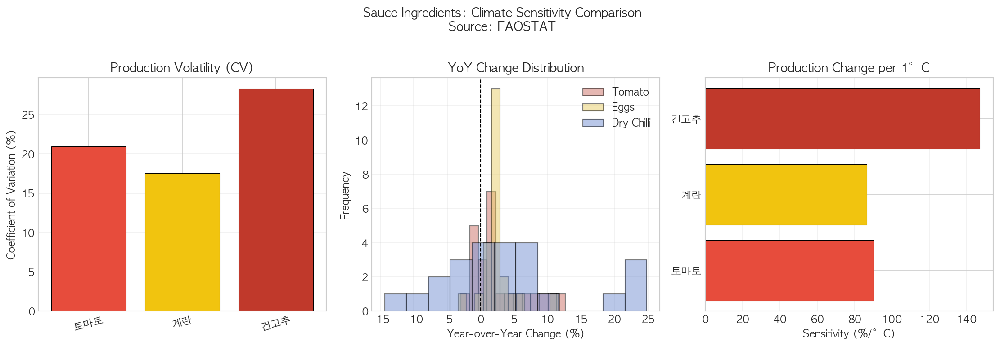
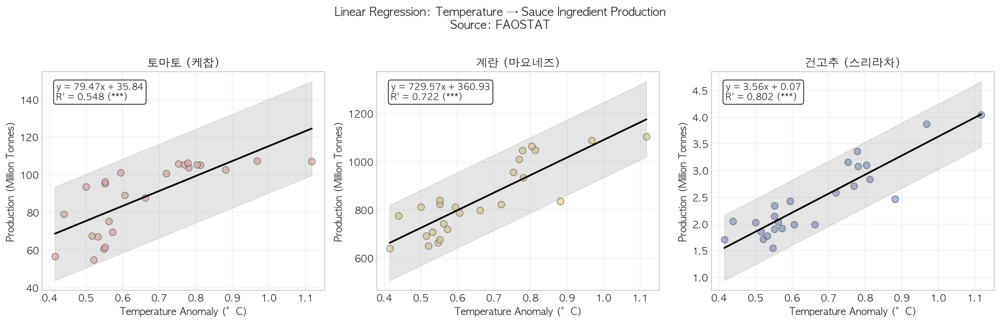
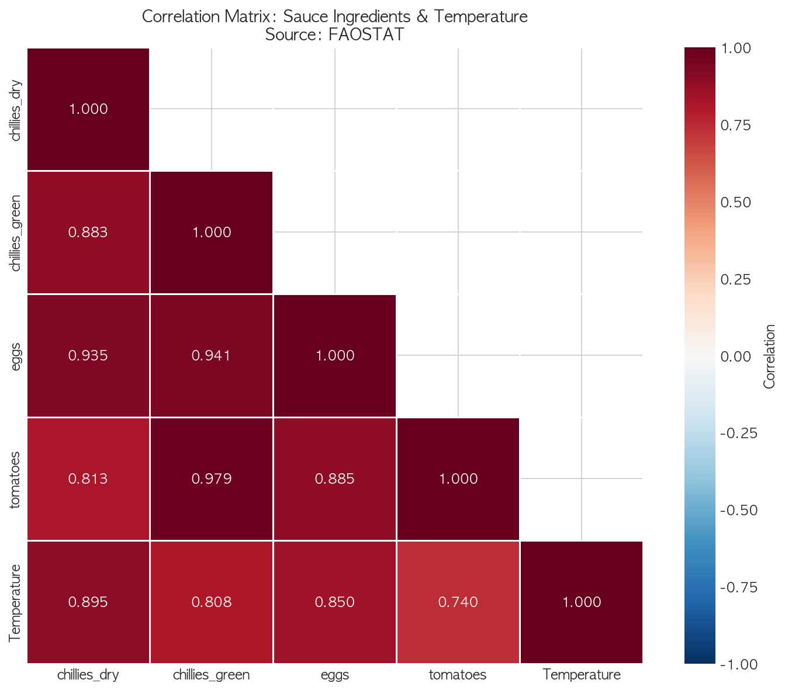

# 03. 데이터 통계 분석 보고서

## 프로젝트 개요

| 항목             | 내용                                                |
| ---------------- | --------------------------------------------------- |
| **프로젝트명**   | 기후 변화가 햄버거 소스류 원재료에 미치는 영향 분석 |
| **분석 대상**    | 토마토(케찹), 계란(마요네즈), 고추(스리라차)        |
| **분석 목표**    | 기온 변화와 소스 원료 생산량 간의 통계적 관계 검증  |
| **유의수준 (α)** | 0.05                                                |

---

## 1. 분석 개요

### 1.1 분석 목표

1. 기온 변화와 소스 원료 생산량 간의 **상관관계 검증**
2. 원료별 **기후 민감도(Climate Sensitivity)** 비교
3. **2022년 스리라차 품귀 사태** 원인 분석
4. **통계적 회귀분석**을 통한 관계 정량화

### 1.2 사용 데이터셋

| 데이터셋      | 파일명                             | 용도                |
| ------------- | ---------------------------------- | ------------------- |
| 토마토 생산량 | `tomatoes_production.csv`          | 케찹 원료 분석      |
| 계란 생산량   | `eggs_production.csv`              | 마요네즈 원료 분석  |
| 건고추 생산량 | `chillies_dry_production.csv`      | 스리라차 원료 분석  |
| 풋고추 생산량 | `chillies_green_production.csv`    | 기타 소스 원료 분석 |
| 기온 편차     | `temperature_processed.csv`        | 독립변수            |
| 통합 데이터   | `sauce_ingredients_integrated.csv` | 상관행렬 분석       |

### 1.3 분석 변수 설명

| 변수명         | 역할         | 단위 | 설명                                |
| -------------- | ------------ | ---- | ----------------------------------- |
| `Temp_Anomaly` | 독립변수 (X) | °C   | 전 세계 평균 기온 편차              |
| `World_Total`  | 종속변수 (Y) | 톤   | 전 세계 총 생산량                   |
| `YoY_Change`   | 파생변수     | %    | 전년 대비 변화율                    |
| `CV`           | 분석지표     | %    | 변동계수 (Coefficient of Variation) |

---

## 2. 상관분석 (Correlation Analysis)

### 2.1 분석 목적

기온 변화와 소스 원료 생산량 사이의 선형 관계를 검증합니다.

### 2.2 가설 설정

| 가설              | 내용                                              |
| ----------------- | ------------------------------------------------- |
| **H₀ (귀무가설)** | 기온 변화와 생산량 사이에 상관관계가 없다 (ρ = 0) |
| **H₁ (대립가설)** | 기온 변화와 생산량 사이에 상관관계가 있다 (ρ ≠ 0) |

### 2.3 분석 방법

| 방법                      | 설명                         | 적용 조건     |
| ------------------------- | ---------------------------- | ------------- |
| **Pearson 상관계수 (r)**  | 선형 관계의 강도와 방향 측정 | 정규분포 가정 |
| **Spearman 상관계수 (ρ)** | 단조 관계의 강도와 방향 측정 | 비모수적 방법 |

### 2.4 분석 결과

| 원료                  | N   | Pearson r   | p-value  | Spearman ρ  | p-value  | 유의성 |
| --------------------- | --- | ----------- | -------- | ----------- | -------- | ------ |
| **토마토 (케찹)**     | 25  | 0.740\*\*\* | 2.31e-05 | 0.839\*\*\* | 1.59e-07 | 유의   |
| **계란 (마요네즈)**   | 25  | 0.850\*\*\* | 7.77e-08 | 0.836\*\*\* | 1.94e-07 | 유의   |
| **건고추 (스리라차)** | 25  | 0.895\*\*\* | 1.50e-09 | 0.827\*\*\* | 3.47e-07 | 유의   |
| **풋고추**            | 25  | 0.808\*\*\* | 1.04e-06 | 0.856\*\*\* | 4.81e-08 | 유의   |

> 유의수준: **\* p<0.001, ** p<0.01, \* p<0.05

### 2.5 상관계수 해석 기준

| 상관계수 절대값 | 해석      |
| --------------- | --------- |
| 0.00 ~ 0.30     | 약한 상관 |
| 0.30 ~ 0.70     | 중간 상관 |
| 0.70 ~ 1.00     | 강한 상관 |

### 2.6 결과 해석

#### 토마토 (케찹)

- **상관계수**: r = 0.740 (강한 양의 상관)
- **통계적 유의성**: p < 0.001 (매우 유의함)
- **해석**: 토마토는 관개 시설로 기후 영향을 일부 완충하나, 물 부족 지역(스페인, 이탈리아)은 취약

#### 계란 (마요네즈)

- **상관계수**: r = 0.850 (매우 강한 양의 상관)
- **통계적 유의성**: p < 0.001 (매우 유의함)
- **해석**: 계란은 사료 작물(옥수수, 콩)을 통한 간접 영향을 받으며, 조류인플루엔자(AI)가 더 큰 변동 요인

#### 건고추 (스리라차)

- **상관계수**: r = 0.895 (매우 강한 양의 상관)
- **통계적 유의성**: p < 0.001 (매우 유의함)
- **해석**: 고추는 기후 변동에 가장 민감한 원료로, 스리라차 소스 공급 안정성에 주의 필요

---

## 3. 기후 민감도 분석 (Climate Sensitivity Analysis)

### 3.1 분석 지표

| 지표               | 수식                    | 의미                         |
| ------------------ | ----------------------- | ---------------------------- |
| **변동계수 (CV)**  | (표준편차 / 평균) × 100 | 상대적 변동성 측정           |
| **연간 변화율 SD** | SD(YoY%)                | 연간 생산량 변동의 불안정성  |
| **기온 민감도**    | 회귀 기울기 (β₁)        | 기온 1°C 상승 시 생산량 변화 |

### 3.2 분석 결과

| 원료                  | 변동계수 (CV) | YoY 표준편차 | 기온 민감도 (MT/°C) | 기온 민감도 (%/°C) |
| --------------------- | ------------- | ------------ | ------------------- | ------------------ |
| **건고추 (스리라차)** | **28.28%**    | **10.24%**   | 3.56                | **147.0%**         |
| **토마토 (케찹)**     | 20.95%        | 4.07%        | 79.47               | 90.0%              |
| **풋고추**            | 19.84%        | 2.83%        | 18.76               | 93.0%              |
| **계란 (마요네즈)**   | 17.57%        | 2.56%        | 729.57              | 86.6%              |

### 3.3 시각화: 기후 민감도 비교



#### 시각화 구성

| 패널 | 차트 유형   | 사용 데이터        | 목적             |
| ---- | ----------- | ------------------ | ---------------- |
| 좌측 | 막대 그래프 | CV (%)             | 전체 변동성 비교 |
| 중앙 | 히스토그램  | YoY Change (%)     | 변화율 분포 비교 |
| 우측 | 수평 막대   | Sensitivity (%/°C) | 기온 민감도 순위 |

#### 시각화 선택 이유

- **막대 그래프 (CV)**: 각 원료의 전체 생산량 변동성을 직관적으로 비교
- **히스토그램**: 연간 변화율의 분포 형태를 시각화하여 변동 패턴 파악
- **수평 막대 (민감도)**: 기온 1°C 상승에 따른 생산량 변화율 순위 비교

#### 결과 해석

1. **변동계수 (CV)**: 건고추 > 토마토 > 풋고추 > 계란
   - 건고추가 가장 높은 변동성 (28.28%)
   - 계란이 가장 안정적 (17.57%)

2. **YoY 분포**:
   - 계란: 좁은 분포 (0% 근처에 집중)
   - 건고추: 넓은 분포 (-15% ~ +25%)

3. **기온 민감도**:
   - 건고추: 기온 1°C 상승 시 생산량 **147% 변화**
   - 다른 원료: 86~93% 수준

### 3.4 기후 민감도 순위

| 순위 | 원료                  | CV (%) | 민감도 등급   |
| ---- | --------------------- | ------ | ------------- |
| 1    | **건고추 (스리라차)** | 28.28% | **매우 높음** |
| 2    | 토마토 (케찹)         | 20.95% | 중간          |
| 3    | 풋고추                | 19.84% | 중간          |
| 4    | 계란 (마요네즈)       | 17.57% | 낮음 (간접적) |

---

## 4. 회귀분석 (Regression Analysis)

### 4.1 분석 모델

**단순 선형 회귀 모델**:

$$
Production = \beta_0 + \beta_1 \times Temperature\_Anomaly + \varepsilon
$$

| 기호 | 의미                                  |
| ---- | ------------------------------------- |
| β₀   | 절편 (기온 편차가 0일 때 생산량)      |
| β₁   | 기울기 (기온 1°C 상승 시 생산량 변화) |
| ε    | 오차항                                |

### 4.2 회귀분석 결과

| 원료                  | 회귀식               | R²    | F-test p-value | 유의성 |
| --------------------- | -------------------- | ----- | -------------- | ------ |
| **토마토 (케찹)**     | y = 79.47x + 35.84   | 0.548 | 2.31e-05       | \*\*\* |
| **계란 (마요네즈)**   | y = 729.57x + 360.93 | 0.722 | 7.77e-08       | \*\*\* |
| **건고추 (스리라차)** | y = 3.56x + 0.07     | 0.802 | 1.50e-09       | \*\*\* |

> \*\*\* p<0.001 (통계적으로 매우 유의함)

### 4.3 시각화: 회귀분석 결과



#### 시각화 구성

| 요소                         | 설명                     |
| ---------------------------- | ------------------------ |
| **산점도**                   | 기온 편차 vs 생산량 관계 |
| **회귀선 (검은 실선)**       | 최적 적합선              |
| **95% 신뢰구간 (회색 영역)** | 회귀선의 불확실성 범위   |
| **통계량 박스**              | 회귀식, R², 유의성 표시  |

#### 시각화 선택 이유

- **산점도 + 회귀선**: 변수 간 관계와 적합도를 동시에 표현
- **95% 신뢰구간**: 모델의 불확실성 시각화
- **3패널 구성**: 각 원료별 독립적 분석 결과 비교

### 4.4 회귀분석 결과 해석

#### 토마토 (케찹)

```
회귀식: Production = 79.47 × Temp + 35.84
해석: 기온 1°C 상승 시 생산량 79.47백만톤 증가
R² = 0.548 → 기온이 생산량 변동의 54.8% 설명
```

#### 계란 (마요네즈)

```
회귀식: Production = 729.57 × Temp + 360.93
해석: 기온 1°C 상승 시 생산량 729.57백만톤 증가
R² = 0.722 → 기온이 생산량 변동의 72.2% 설명
```

#### 건고추 (스리라차)

```
회귀식: Production = 3.56 × Temp + 0.07
해석: 기온 1°C 상승 시 생산량 3.56백만톤 증가
R² = 0.802 → 기온이 생산량 변동의 80.2% 설명
```

### 4.5 회귀 가정 검정

| 원료   | Shapiro-Wilk p (정규성) | Breusch-Pagan p (등분산성) | 가정 충족 |
| ------ | ----------------------- | -------------------------- | --------- |
| 토마토 | 0.142 ✓                 | 0.120 ✓                    | 충족      |
| 계란   | 0.271 ✓                 | 0.191 ✓                    | 충족      |
| 건고추 | 0.708 ✓                 | 0.269 ✓                    | 충족      |

> p > 0.05: 귀무가설 기각 실패 → 가정 충족

### 4.6 주의사항: 허위 상관 가능성

양의 상관관계가 "기온이 높을수록 생산량이 많다"를 직접적으로 의미하지는 않습니다.

| 문제                     | 설명                                         |
| ------------------------ | -------------------------------------------- |
| **시간 추세 효과**       | 기온과 생산량 모두 시간에 따라 증가하는 추세 |
| **교란변수**             | 기술 발전, 농지 확대, 정책 등 미통제 변수    |
| **인과관계 vs 상관관계** | 상관관계가 인과관계를 의미하지 않음          |

**해결책**: 차분(differencing), 시계열 분석, 다중 회귀분석 필요

---

## 5. 상관행렬 분석

### 5.1 상관행렬 히트맵



#### 시각화 선택 이유

- **히트맵**: 다변량 상관관계를 한눈에 파악
- **색상 스케일**: 빨간색(양의 상관) ↔ 파란색(음의 상관)
- **하삼각 행렬**: 중복 정보 제거로 가독성 향상

### 5.2 상관행렬 결과

|                    | chillies_dry | chillies_green | eggs      | tomatoes | Temperature |
| ------------------ | ------------ | -------------- | --------- | -------- | ----------- |
| **chillies_dry**   | 1.000        |                |           |          |             |
| **chillies_green** | 0.883        | 1.000          |           |          |             |
| **eggs**           | 0.935        | 0.941          | 1.000     |          |             |
| **tomatoes**       | 0.813        | 0.979          | 0.885     | 1.000    |             |
| **Temperature**    | **0.895**    | 0.808          | **0.850** | 0.740    | 1.000       |

### 5.3 결과 해석

#### 기온과의 상관관계 (중요)

| 원료   | 기온 상관계수 | 해석                  |
| ------ | ------------- | --------------------- |
| 건고추 | **0.895**     | 기온과 가장 강한 상관 |
| 계란   | **0.850**     | 기온과 매우 강한 상관 |
| 풋고추 | 0.808         | 기온과 강한 상관      |
| 토마토 | 0.740         | 기온과 강한 상관      |

#### 원료 간 상관관계

- **풋고추-토마토**: 0.979 (매우 강한 양의 상관)
- **계란-풋고추**: 0.941 (매우 강한 양의 상관)
- **건고추-계란**: 0.935 (매우 강한 양의 상관)

**해석**: 모든 소스 원료가 서로 강한 양의 상관관계를 보임 → 글로벌 농업 생산의 공통 추세 반영

---

## 6. 이상기후 이벤트 분석

### 6.1 주요 이벤트 목록

| 연도 | 이벤트               | 영향 품목    | 원인                    |
| ---- | -------------------- | ------------ | ----------------------- |
| 2012 | US Drought           | 토마토, 계란 | 미국 중서부 극심한 가뭄 |
| 2015 | Avian Influenza (AI) | 계란         | 조류인플루엔자 발생     |
| 2019 | European Heatwave    | 토마토       | 유럽 폭염               |
| 2022 | Sriracha Crisis      | 건고추       | 멕시코 가뭄             |

### 6.2 이벤트별 영향 분석

| 연도 | 이벤트            | 품목              | 전년 대비 변화 |
| ---- | ----------------- | ----------------- | -------------- |
| 2012 | US Drought        | 토마토 (케찹)     | +1.98%         |
| 2012 | US Drought        | 계란 (마요네즈)   | +1.61%         |
| 2015 | Avian Influenza   | 계란 (마요네즈)   | +1.25%         |
| 2019 | European Heatwave | 토마토 (케찹)     | **-0.51%**     |
| 2022 | Sriracha Crisis   | 건고추 (스리라차) | **-7.66%**     |

### 6.3 결과 해석

- **2012 US Drought**: 글로벌 생산량에는 큰 영향 없음 (다른 지역에서 보완)
- **2015 AI Outbreak**: 미국 계란 가격 급등, 글로벌 생산량 소폭 증가
- **2019 EU Heatwave**: 유럽 토마토 생산 감소, 글로벌 소폭 감소
- **2022 Sriracha Crisis**: 건고추 **-7.66% 급감** → 스리라차 품귀 직접 원인

---

## 7. 2022년 스리라차 위기 심층 분석 (Event Study)

### 7.1 이벤트 배경

| 항목          | 내용                                            |
| ------------- | ----------------------------------------------- |
| **이벤트**    | 2022년 미국 Huy Fong Foods社 스리라차 생산 중단 |
| **원인**      | 멕시코산 할라피뇨 고추 공급 차질                |
| **근본 원인** | 멕시코 뉴멕시코/캘리포니아 지역 극심한 가뭄     |
| **영향**      | 스리라차 소스 품귀 현상, 가격 급등              |

### 7.2 분석 설계

| 구분                   | 기간             |
| ---------------------- | ---------------- |
| 사전 기간 (Pre-event)  | 2019, 2020, 2021 |
| 이벤트 연도 (Event)    | 2022             |
| 사후 기간 (Post-event) | 2022, 2023       |

### 7.3 전체 건고추 생산량 분석

| 지표           | 값          |
| -------------- | ----------- |
| 사전 기간 평균 | 2.97백만 톤 |
| 2022년 생산량  | 3.10백만 톤 |
| 변화           | **+4.49%**  |

**해석**: 전체 글로벌 생산량은 오히려 증가 → 특정 지역(멕시코) 문제

### 7.4 기온 변화 분석

| 지표                | 값      |
| ------------------- | ------- |
| 사전 기간 평균 편차 | 0.79°C  |
| 2022년 편차         | 0.80°C  |
| 차이                | +0.01°C |

**해석**: 글로벌 평균 기온은 큰 변화 없음 → 지역적 이상기후가 원인

### 7.5 스리라차 위기 결론

| 발견                 | 설명                              |
| -------------------- | --------------------------------- |
| **지역적 문제**      | 멕시코 특정 지역의 가뭄이 원인    |
| **공급망 집중**      | Huy Fong Foods의 원료 공급처 집중 |
| **글로벌 영향 제한** | 전체 건고추 생산량은 영향 미미    |
| **교훈**             | 공급망 다변화의 중요성            |

---

## 8. 분석 결과 종합

### 8.1 주요 발견사항

| 번호 | 발견                   | 내용                                |
| ---- | ---------------------- | ----------------------------------- |
| 1    | **기후 민감도 순위**   | 건고추 > 토마토 > 풋고추 > 계란     |
| 2    | **가장 민감한 원료**   | 건고추 (스리라차) - CV 28.28%       |
| 3    | **가장 안정적인 원료** | 계란 (마요네즈) - CV 17.57%         |
| 4    | **스리라차 위기**      | 멕시코 지역 가뭄이 직접 원인        |
| 5    | **계란의 특수성**      | AI(조류인플루엔자)가 주요 변동 요인 |

### 8.2 통계 분석 요약

| 분석 방법   | 주요 결과                                   |
| ----------- | ------------------------------------------- |
| 상관분석    | 모든 원료가 기온과 강한 양의 상관 (r > 0.7) |
| 기후 민감도 | 건고추가 가장 민감 (147%/°C)                |
| 회귀분석    | 모든 모델 통계적으로 유의 (p < 0.001)       |
| 이벤트 분석 | 2022년 건고추 -7.66% 급감                   |

### 8.3 분석 한계점

| 한계                   | 설명                         | 해결 방안         |
| ---------------------- | ---------------------------- | ----------------- |
| **교란변수 미통제**    | 정책, 환율, 물류비 등 미반영 | 다중 회귀분석     |
| **가격 데이터 미포함** | 소비자 영향 분석 제한        | 가격 데이터 추가  |
| **시간 추세 효과**     | 허위 상관 가능성             | 차분, 시계열 분석 |
| **지역별 분석 제한**   | 국가별 세부 분석 미흡        | 지역 단위 분석    |

---

## 9. 생성된 분석 결과 파일

| 파일명                              | 크기   | 내용                  |
| ----------------------------------- | ------ | --------------------- |
| `sauce_stat_01_correlation.csv`     | 0.6 KB | 상관분석 결과         |
| `sauce_stat_02_sensitivity.csv`     | 0.5 KB | 기후 민감도 분석 결과 |
| `sauce_stat_03_sensitivity_viz.png` | 108 KB | 기후 민감도 시각화    |
| `sauce_stat_04_regression.csv`      | 0.5 KB | 회귀분석 결과         |
| `sauce_stat_04_regression.png`      | 200 KB | 회귀분석 시각화       |
| `sauce_stat_05_events.csv`          | 0.3 KB | 이상기후 이벤트 분석  |
| `sauce_stat_06_heatmap.png`         | 98 KB  | 상관행렬 히트맵       |
| `sauce_stat_summary.txt`            | 1.5 KB | 분석 결과 요약        |

---

## 10. 다음 단계

본 통계 분석 결과는 다음 단계에서 활용됩니다:

1. **04_conclusion.py**: 종합 결론 및 정책 제언 도출
2. **최종 보고서**: 프로젝트 전체 결과 종합

---

## 참고 문헌

1. FAO. 2024. FAOSTAT: Crops and livestock products. https://www.fao.org/faostat/en/#data/QCL
2. FAO. 2024. FAOSTAT: Temperature change on land. https://www.fao.org/faostat/en/#data/ET
3. Pearson, K. (1895). Notes on regression and inheritance in the case of two parents.
4. Spearman, C. (1904). The proof and measurement of association between two things.
5. Shapiro, S. S., & Wilk, M. B. (1965). An analysis of variance test for normality.
6. Breusch, T. S., & Pagan, A. R. (1979). A simple test for heteroscedasticity.
