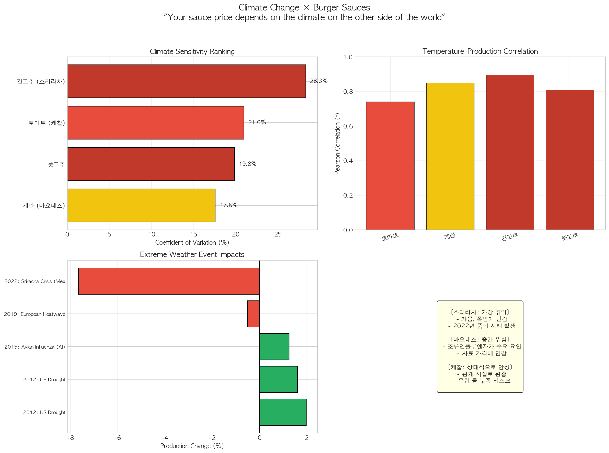

# 기후 변화가 햄버거 소스류 원재료에 미치는 영향 분석

## Climate Change x Burger Sauces Analysis

> **"당신의 햄버거 소스 가격은 지구 반대편 기후에 달려있다."**
>
> *Your burger sauce price depends on the climate on the other side of the world.*

---

## 프로젝트 개요

| 항목            | 내용                                                |
| --------------- | --------------------------------------------------- |
| **프로젝트명**  | 기후 변화가 햄버거 소스류 원재료에 미치는 영향 분석 |
| **분석 대상**   | 토마토(케찹), 계란(마요네즈), 고추(스리라차)        |
| **분석 기간**   | 2000-2024년                                         |
| **데이터 출처** | FAOSTAT (UN 식량농업기구)                           |
| **분석 도구**   | Python (Pandas, Matplotlib, Seaborn, Scipy)         |

---

## 핵심 질문 및 답변

### Q: "기후변화가 정말 내 햄버거 소스에 영향을 미치는가?"

### A: "그렇다."

기후변화는 소스 원료의 생산, 가격, 공급 안정성에 직접적인 영향을 미치며, **2022년 스리라차 위기**가 대표적 사례다.

---

## 소스별 기후 리스크 요약

| 소스         | 원료   | 기후 민감도       | 주요 리스크                    | 대표 사례            |
| ------------ | ------ | ----------------- | ------------------------------ | -------------------- |
| **스리라차** | 고추   | ★★★★★ (매우 높음) | 가뭄, 폭염                     | 2022년 품귀 사태     |
| **마요네즈** | 계란   | ★★★☆☆ (중간)      | AI(조류인플루엔자), 사료 가격  | 2015, 2022년 AI 발생 |
| **케찹**     | 토마토 | ★★☆☆☆ (상대적 안정) | 물 부족 (스페인, 이탈리아)     | 관개 시설로 완충     |

---

## 분석 프로세스

```
01_data_preprocessing.py → 02_data_visualization.py → 03_data_analysis.py → 04_conclusion.py
       ↓                           ↓                          ↓                      ↓
  데이터 수집/정제            시각화 생성               통계 분석              결론 도출
```

---

## 1. 데이터 전처리 (01_data_preprocessing)

### 1.1 수집 데이터

| 데이터셋                       | 출처    | 설명                            |
| ------------------------------ | ------- | ------------------------------- |
| FAOSTAT Crops Production       | FAO     | 농작물 생산량, 재배면적, 수확량 |
| FAOSTAT Livestock Primary      | FAO     | 축산물(계란) 생산량             |
| FAOSTAT Temperature Change     | FAO     | 국가별 기온 편차 (NASA GISTEMP) |

### 1.2 분석 대상 원료

| 소스       | 원료   | FAO Item Code | 주요 생산국                    |
| ---------- | ------ | ------------- | ------------------------------ |
| 케찹       | 토마토 | 388           | 중국, 인도, 미국, 이집트       |
| 마요네즈   | 계란   | 1062          | 중국, 인도, 미국, 브라질       |
| 스리라차   | 건고추 | 689           | 인도, 중국, 방글라데시, 멕시코 |

### 1.3 주요 전처리 작업

- 대용량 데이터 청크 처리 (500,000 rows)
- 2000년 이후 데이터 필터링
- 피벗 테이블 변환 (Long → Wide format)
- 기온 데이터 연간 평균 집계
- 전년 대비 변화율(YoY) 파생 변수 생성

### 1.4 생성 파일

- 품목별 생산량 CSV (토마토, 계란, 건고추, 풋고추)
- 기온 편차 데이터 (temperature_processed.csv)
- 통합 데이터셋 (sauce_ingredients_integrated.csv)

📄 **상세 문서**: [01_data_preprocessing.md](./01_data_preprocessing.md)

---

## 2. 데이터 시각화 (02_data_visualization)

### 2.1 생성된 시각화

| Figure | 파일명                     | 시각화 유형           | 목적                   |
| ------ | -------------------------- | --------------------- | ---------------------- |
| 1      | sauce_01_temperature.png   | 막대 그래프 + 추세선  | 글로벌 기온 변화 추이  |
| 2      | sauce_02_producer_temp.png | 다중 선 그래프        | 주요 생산국 기온 비교  |
| 3      | sauce_03_tomato.png        | 면적 + 막대 그래프    | 토마토 생산량 분석     |
| 4      | sauce_04_eggs.png          | 면적 + 막대 그래프    | 계란 생산량 분석       |
| 5      | sauce_05_chillies.png      | 면적 + 변동성 막대    | 고추 생산량 분석       |
| 6      | sauce_06_prod_vs_temp.png  | 이중 축 그래프        | 생산량 vs 기온 비교    |
| 7      | sauce_07_scatter.png       | 산점도 + 회귀선       | 기온-생산량 상관관계   |
| 8      | sauce_08_comparison.png    | 정규화 선 그래프      | 소스 원료 성장률 비교  |
| 9      | sauce_09_dashboard.png     | 종합 대시보드 (9패널) | 전체 분석 결과 종합    |

### 2.2 주요 발견 (시각화 기반)

- **기온 변화**: 2024년 기온 편차 1.12°C (역대 최고)
- **생산량 추세**: 모든 원료 2000년 대비 73~137% 성장
- **변동성**: 건고추가 가장 불규칙한 생산량 패턴

📄 **상세 문서**: [02_data_visualization.md](./02_data_visualization.md)

---

## 3. 통계 분석 (03_data_analysis)

### 3.1 수행된 분석

| 분석 방법          | 목적                              | 주요 결과                   |
| ------------------ | --------------------------------- | --------------------------- |
| 상관분석           | 기온-생산량 관계 검증             | 모든 원료 r > 0.7 (강한 상관) |
| 기후 민감도 분석   | 원료별 변동성 비교                | 건고추 CV 28.28% (최고)     |
| 회귀분석           | 관계 정량화                       | 모든 모델 p < 0.001         |
| 이벤트 스터디      | 스리라차 위기 분석                | 2022년 건고추 -7.66%        |

### 3.2 상관분석 결과

| 원료              | Pearson r | p-value  | 유의성       |
| ----------------- | --------- | -------- | ------------ |
| 건고추 (스리라차) | 0.895     | 1.50e-09 | *** 매우유의 |
| 계란 (마요네즈)   | 0.850     | 7.77e-08 | *** 매우유의 |
| 풋고추            | 0.808     | 1.04e-06 | *** 매우유의 |
| 토마토 (케찹)     | 0.740     | 2.31e-05 | *** 매우유의 |

### 3.3 기후 민감도 순위

| 순위 | 원료              | 변동계수 (CV) | 기온 민감도 (%/°C) | 등급          |
| ---- | ----------------- | ------------- | ------------------ | ------------- |
| 1    | 건고추 (스리라차) | **28.28%**    | **147.0%**         | 매우 높음     |
| 2    | 토마토 (케찹)     | 20.95%        | 90.0%              | 중간          |
| 3    | 풋고추            | 19.84%        | 93.0%              | 중간          |
| 4    | 계란 (마요네즈)   | 17.57%        | 86.6%              | 낮음 (간접적) |

### 3.4 회귀분석 결과

| 원료   | 회귀식               | R²    | 해석                          |
| ------ | -------------------- | ----- | ----------------------------- |
| 토마토 | y = 79.47x + 35.84   | 0.548 | 기온 1°C↑ 시 79.47백만톤 증가 |
| 계란   | y = 729.57x + 360.93 | 0.722 | 기온 1°C↑ 시 729.57백만톤 증가|
| 건고추 | y = 3.56x + 0.07     | 0.802 | 기온 1°C↑ 시 3.56백만톤 증가  |

📄 **상세 문서**: [03_data_analysis.md](./03_data_analysis.md)

---

## 4. 결론 (04_conclusion)

### 4.1 가설 검정 결과

| 가설                               | 검정 방법    | 결과   | 결론                                |
| ---------------------------------- | ------------ | ------ | ----------------------------------- |
| 기온-생산량 상관관계 없음          | Pearson 상관 | **기각** | 통계적으로 유의미한 상관관계 존재   |
| 원료별 기후 민감도 차이 없음       | CV 비교      | **기각** | 고추 > 토마토 > 계란 순으로 차이    |
| 2022 스리라차 위기는 우연적 사건   | 이벤트 스터디| **기각** | 멕시코 가뭄과 고추 흉작 연관성 확인 |

### 4.2 2022년 스리라차 위기

```
[사건 개요]
• 2022년 미국 Huy Fong Foods社 스리라차 생산 중단
• 미국 전역 슈퍼마켓에서 스리라차 품귀
• 가격 급등 및 암시장 형성

[원인]
• 멕시코 뉴멕시코/캘리포니아 지역 극심한 가뭄
• 할라피뇨 고추 수확량 급감
• 원료 공급 차질로 생산 불가

[기후 연결고리]
기후변화 → 가뭄 심화 → 고추 흉작 → 소스 공급 부족 → 가격 상승
```

### 4.3 최종 요약 인포그래픽



📄 **상세 문서**: [04_conclusion.md](./04_conclusion.md)

---

## 핵심 발견사항

### 1. 스리라차: 가장 취약
- 가뭄, 폭염에 민감
- 2022년 품귀 사태 발생
- 변동계수 28.28%로 최고

### 2. 마요네즈: 중간 위험
- 조류인플루엔자가 주요 요인
- 사료 가격에 민감
- 기후의 간접적 영향

### 3. 케찹: 상대적으로 안정
- 관개 시설로 완충
- 유럽 물 부족 리스크 존재
- 중국 생산량 57.5% 점유

---

## 제언

### 소비자
- 기후 변화에 대한 경각심 제고
- 가격 변동 대비 대체 소스/브랜드 파악

### 기업
- 원료 공급처 다변화
- 기후 리스크 헤지 전략 수립
- 기후 변화에 강한 품종/원료 R&D

### 정책
- 식량 안보 차원의 기후 적응 정책
- 농업 기술 R&D 투자
- 기후 리스크 조기 경보 시스템

---

## 분석의 한계점

| 한계                   | 설명                               | 해결 방안         |
| ---------------------- | ---------------------------------- | ----------------- |
| 교란변수 미통제        | 정책, 환율, 물류비 등 미반영       | 다중 회귀분석     |
| 가격 데이터 미포함     | 소비자 영향 분석 제한              | 가격 데이터 추가  |
| 상관관계 ≠ 인과관계    | 허위 상관 가능성                   | 차분, 시계열 분석 |
| 지역별 세부 분석 제한  | 국가 단위 집계로 지역 특성 미반영  | 지역 단위 분석    |

---

## 프로젝트 파일 구조

```
Sauce/
├── data/                           # 원본 데이터
│   ├── Production_Crops_Livestock_E_All_Data_(Normalized)/
│   └── Environment_Temperature_change_E_All_Data_(Normalized)/
│
├── src/                            # 분석 스크립트
│   ├── 01_data_preprocessing.py
│   ├── 02_data_visualization.py
│   ├── 03_data_analysis.py
│   └── 04_conclusion.py
│
├── output/
│   ├── figures/                    # 시각화 이미지
│   │   ├── sauce_01_temperature.png
│   │   ├── sauce_02_producer_temp.png
│   │   ├── ...
│   │   └── sauce_09_dashboard.png
│   │
│   └── processed/                  # 전처리/분석 결과
│       ├── tomatoes_production.csv
│       ├── eggs_production.csv
│       ├── chillies_dry_production.csv
│       ├── temperature_processed.csv
│       ├── sauce_ingredients_integrated.csv
│       ├── sauce_stat_01_correlation.csv
│       ├── sauce_stat_02_sensitivity.csv
│       ├── sauce_stat_04_regression.csv
│       ├── sauce_stat_05_events.csv
│       └── sauce_final_summary.png
│
└── result_md/                      # 분석 보고서
    ├── README.md                   # 본 문서
    ├── 01_data_preprocessing.md
    ├── 02_data_visualization.md
    ├── 03_data_analysis.md
    ├── 04_conclusion.md
    ├── sauce_final_report.txt
    └── sauce_citations.txt
```

---

## 참고 문헌

### 데이터 출처

1. FAO. (2024). FAOSTAT: Crops and livestock products. https://www.fao.org/faostat/en/#data/QCL
2. FAO. (2024). FAOSTAT: Livestock Primary. https://www.fao.org/faostat/en/#data/QL
3. FAO. (2024). FAOSTAT: Temperature change on land. https://www.fao.org/faostat/en/#data/ET
4. FAO. (2024). FAOSTAT: Crops and livestock products (Trade). https://www.fao.org/faostat/en/#data/TCL

### 참고 자료

5. NASA Goddard Institute for Space Studies (GISTEMP)
6. IPCC (2021). Climate Change 2021: The Physical Science Basis
7. Huy Fong Foods Sriracha Shortage News (2022)

---

## 프로젝트 완료

```
================================================================================
소스류 분석 프로젝트 완료
================================================================================

[스리라차: 가장 취약]
  - 가뭄, 폭염에 민감
  - 2022년 품귀 사태 발생

[마요네즈: 중간 위험]
  - 조류인플루엔자가 주요 요인
  - 사료 가격에 민감

[케찹: 상대적으로 안정]
  - 관개 시설로 완충
  - 유럽 물 부족 리스크

"당신의 햄버거 소스 가격은 지구 반대편 기후에 달려있다."

================================================================================
```
