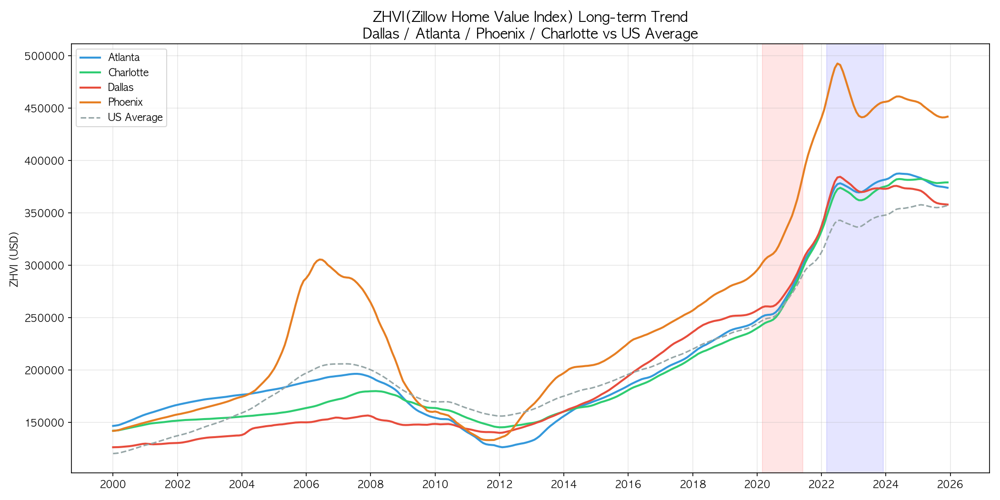
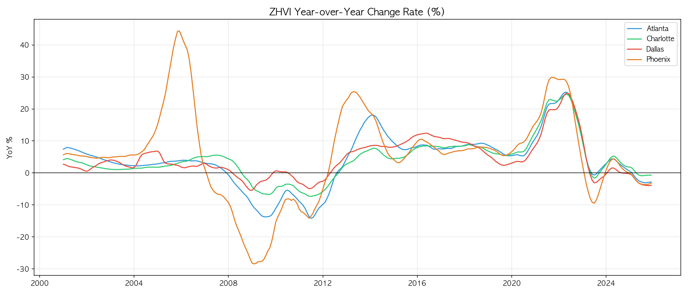
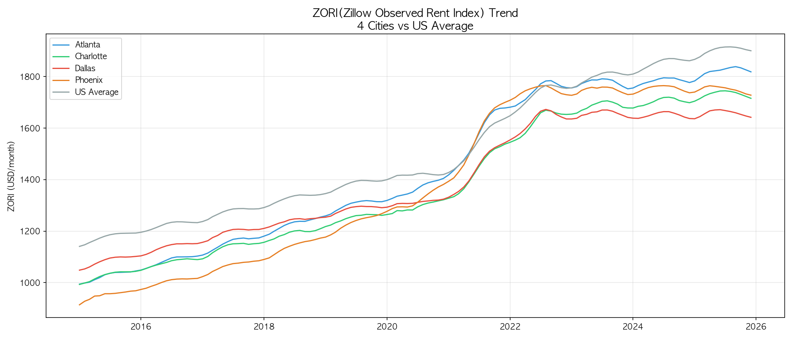
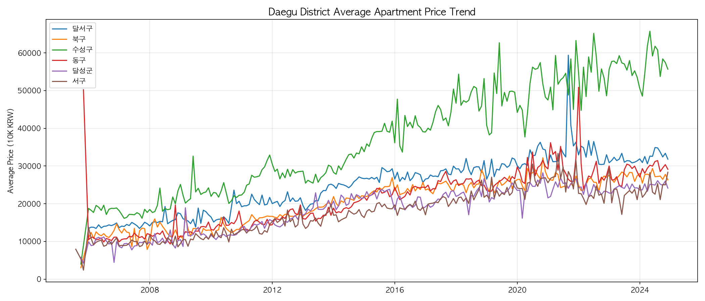
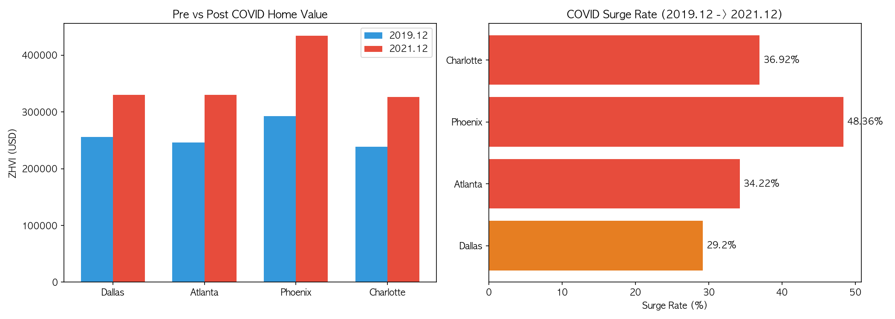
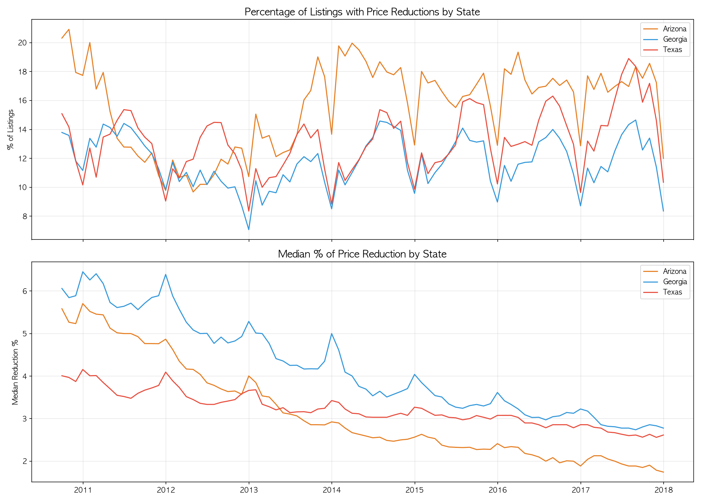

# 소주제 1: 미국 주요 도시 vs 대구 주택시장 비교 분석 보고서

## 1. 프로젝트 개요

### 1.1 분석 목적

대구광역시와 유사한 특성을 가진 미국 4개 도시(Dallas, Atlanta, Phoenix, Charlotte)의 주택시장을 다각도로 비교 분석하여, 글로벌 부동산 시장의 공통 패턴과 지역별 차이를 도출한다.

### 1.2 비교 도시 선정 기준

| 도시          | 국가 | 비교 관점      | 인구      |
| ------------- | ---- | -------------- | --------- |
| 대구          | 한국 | 기준 도시      | 2,385,412 |
| Dallas, TX    | 미국 | 종합 비교      | 1,304,379 |
| Atlanta, GA   | 미국 | 산업구조 유사  | 498,715   |
| Phoenix, AZ   | 미국 | 기후 유사      | 1,608,139 |
| Charlotte, NC | 미국 | 도시 변모 유사 | 879,709   |

### 1.3 데이터 소스

| 데이터셋                | 출처          | 기간      | 적재 건수 |
| ----------------------- | ------------- | --------- | --------- |
| ZHVI (Home Value Index) | Zillow        | 2000~2025 | 1,557행   |
| ZORI (Rent Index)       | Zillow        | 2015~2025 | 660행     |
| ZHVF (Forecast)         | Zillow        | 2025~2026 | 15행      |
| Zillow Economics 시계열 | Zillow        | 2010~2018 | 6,548행   |
| Realtor.com 매물        | Realtor.com   | -         | 447,882행 |
| 대구 아파트 실거래가    | 국토부/Kaggle | 2006~2025 | 947,791행 |
| 대구 월별 집계          | 가공          | 2006~2025 | 2,064행   |

---

## 2. 분석 결과 요약 (CSV 산출물)

### Q1. ZHVI 장기 추이 (1,557행)

- **내용**: 4개 MSA + 전국 평균의 2000년 1월~2025년 12월 월별 ZHVI
- **주요 수치 (2025.12 기준)**:
  - Phoenix, AZ: $446,730 (4개 도시 중 최고)
  - Atlanta, GA: $378,235
  - Charlotte, NC: $380,201
  - Dallas, TX: $363,580
  - 전국 평균: $357,275

### Q2. ZHVI 전년동기 변동률 (1,194행)

- **내용**: 4개 도시의 YoY(전년동기 대비) 변동률
- **핵심 발견**: Phoenix가 변동성 최대 (2005년 +44%, 2009년 -28%, 2021년 +30%)

### Q3. ZORI 임대료 추이 (660행)

- **내용**: 2015~2025년 월별 임대관측지수
- **2025.12 기준**: Atlanta $1,831/월, Phoenix $1,728/월, Charlotte $1,722/월, Dallas $1,643/월

### Q4. Price-to-Rent Ratio (261행)

- **내용**: 주(State) 레벨 매매가 대비 임대료 비율 (2010~2017)
- **해석**: 비율이 높을수록 매매가가 임대료 대비 고평가된 상태

### Q5. 대구 구별 평균가 추이 (2,064행)

- **내용**: 대구 8개 구/군의 월별 평균 거래가, 중위가, 거래건수
- **핵심**: 수성구가 압도적 최고가 (2024년 약 5.5~6.5억), 달서구 2위

### Q6. 대구 vs 미국 4도시 연간 비교 (124행)

- **내용**: 연도별 중위 가격 비교 (USD / KRW 만원 병기)
- **2024년 기준**: Dallas $374,064 / Atlanta $385,903 / Phoenix $458,641 / Charlotte $380,577 / 대구 29,798만원

### Q7. COVID 전후 급등 분석 (4행)

- **핵심 결과**:

| 도시      | 2019.12  | 2021.12  | 급등률      |
| --------- | -------- | -------- | ----------- | --- |
| Phoenix   | $292,646 | $434,157 | **+48.36%** |     |
| Charlotte | $238,427 | $326,460 | +36.92%     |     |
| Atlanta   | $245,907 | $330,062 | +34.22%     |     |
| Dallas    | $255,605 | $330,250 | +29.20%     |     |

### Q8. 가격 인하 매물 비율 (264행)

- **내용**: 3개 주(Arizona, Georgia, Texas)의 가격 인하 매물 비율 (2010~2017)
- **핵심**: Arizona가 15~20%로 가장 높은 가격 인하 비율, 중위 인하 폭은 전 지역 하락 추세

### Q9. Realtor.com 매물 통계 (4행)

- **현재 매물 기본 통계**:

| 도시      | 매물수 | 평균가   | 평균면적(sqft) | sqft당 가격 |
| --------- | ------ | -------- | -------------- | ----------- | --- | --- |
| Phoenix   | 8,138  | $553,149 | 1,780          | $299.81     |     |     |
| Dallas    | 7,477  | $604,863 | 2,094          | $258.29     |     |     |
| Atlanta   | 7,109  | $636,149 | 2,006          | $288.87     |     |     |
| Charlotte | 6,867  | $470,453 | 1,948          | $238.06     |     |     |

### Q10. Zillow 예측 성장률 (15행)

- **2026년 전망 (12개월 누적)**:
  - Charlotte: **+2.6%** (가장 긍정적)
  - 전국 평균: +2.1%
  - Atlanta: +1.9%
  - Phoenix: +1.0%
  - Dallas: **+0.2%** (가장 부진)

---

## 3. 시각화 분석

### 3.1 viz1_zhvi_trend.png - ZHVI 장기 추이 (2000~2025)

#### 시각화 선택 이유

- **라인 차트(Line Chart)**: 25년간의 연속적 시계열 데이터에서 장기 흐름, 구조적 전환점, 도시 간 상대적 위치 변화를 파악하기에 가장 적합한 시각화 유형이다.
- 5개 시계열을 단일 축에 표현하여 직접 비교가 가능하며, 전국 평균은 점선으로 구분하여 벤치마크 역할을 부여했다.
- 배경 음영(COVID Surge: 빨강, Rate Hike: 파랑)으로 거시경제 이벤트와 가격 변동의 인과관계를 시각적으로 연결했다.

#### 해석

1. **2000~2006 (버블 형성기)**: 4개 도시 모두 $120,000~$150,000 수준에서 출발. Phoenix만 유독 급등하여 2006년 $300,000 돌파 (서브프라임 버블의 대표 사례).
2. **2007~2012 (금융위기)**: Phoenix는 정점 대비 -55% 폭락 ($135,000까지 하락). Atlanta도 -32% 하락. 반면 Dallas는 -8% 수준의 경미한 조정으로 가장 안정적이었다.
3. **2013~2019 (회복기)**: 4개 도시 모두 V자 회복. Dallas는 완만하지만 꾸준한 상승, Phoenix는 가파른 반등.
4. **2020~2022 (COVID 급등기)**: 빨간 음영 구간에서 전 도시 수직 상승. Phoenix가 $470,000 이상으로 치솟아 4개 도시 중 압도적 1위.
5. **2023~2025 (금리인상 조정기)**: 파란 음영 구간에서 상승 둔화. Phoenix는 정점 대비 소폭 하락, 나머지 3개 도시는 $360,000~$385,000 구간에서 수렴하는 흥미로운 패턴 출현.

#### 핵심 인사이트

> Phoenix는 미국 부동산 시장의 "카나리아" 역할을 한다. 상승과 하락 모두 가장 먼저, 가장 크게 반응하는 선행지표적 도시이다. Dallas는 반대로 변동성이 가장 낮은 "안전자산" 성격의 시장이다.

---

### 3.2 viz2_zhvi_yoy.png - ZHVI 전년동기 변동률 (%)

#### 시각화 선택 이유

- **라인 차트 + 0% 기준선**: 절대 가격이 아닌 **변화율**을 비교하기 위한 차트. 가격 수준이 다른 도시들의 성장 속도를 동일 스케일로 비교할 수 있다.
- 0% 기준선을 명시하여 상승/하락 국면을 직관적으로 구분한다.

#### 해석

1. **Phoenix의 극단적 변동성**: 2005년 +44% (4배 이상 과열) → 2009년 -28% (폭락) → 2013년 +25% (반등) → 2021년 +30% (코로나 급등). 일관되게 가장 큰 진폭.
2. **Atlanta의 비대칭 사이클**: 금융위기 하락(-14%)보다 회복기 상승(+18%)이 더 가파름. 2013~2014년 강한 반등은 도시 재개발과 IT 산업 유입 효과.
3. **Dallas의 안정성**: 전체 기간 동안 -5%~+13% 범위로 가장 좁은 밴드. 석유·에너지 산업 기반의 견조한 경제 펀더멘털 반영.
4. **2021~2022 동조화**: 4개 도시 모두 +20~30% 범위로 수렴. COVID가 지역별 차이를 압도하는 전국적 현상이었음을 시사.
5. **2024~2025 마이너스 전환**: Phoenix(-9%), Dallas(-3%) 등 다수 도시가 마이너스 전환. 금리인상의 시차 효과.

#### 핵심 인사이트

> 4개 도시 모두 2024~2025년 YoY가 0% 부근 또는 마이너스로 수렴 중이다. 이는 COVID 이후 과열된 시장이 "정상화(Normalization)" 단계에 진입했음을 보여준다.

---

### 3.3 viz3_zori_trend.png - ZORI 임대료 추이 (2015~2025)

#### 시각화 선택 이유

- **라인 차트**: 매매가(ZHVI)와 별도로 임대 시장 동향을 추적. 매매가와 임대료의 디커플링(괴리) 현상을 파악하기 위한 보완적 지표.
- 전국 평균을 함께 표시하여 4개 도시가 전국 대비 저렴한지 비싼지를 판단할 수 있다.

#### 해석

1. **2015~2019 (완만한 상승)**: 전 도시 연평균 3~5% 상승. Atlanta가 $994에서 $1,280으로 가장 빠른 상승.
2. **2020~2022 (임대료 폭등)**: COVID 이후 원격근무 확산 → 선벨트 도시로 인구 유입 → 임대수요 급증. Atlanta와 Phoenix가 $900~$1,100 수준에서 $1,700~$1,800으로 급등 (+60~80%).
3. **2022~2025 (고원기)**: 전 도시 $1,600~$1,900 구간에서 횡보 또는 소폭 하락. 공급 증가와 수요 둔화의 균형점 도달.
4. **도시 순위 변동**: 2015년에는 전국 평균이 가장 높았으나, 2022년 이후 Atlanta가 전국 평균을 추월. 선벨트 도시들의 임대료가 전국 수준으로 수렴하는 추세.

#### 핵심 인사이트

> 매매가(ZHVI)는 2023년부터 조정 중이나, 임대료(ZORI)는 고원 상태를 유지하고 있다. 이는 금리 인상으로 매수 수요가 임대 수요로 전환된 "lock-in effect"를 반영한다.

---

### 3.4 viz4_daegu_district.png - 대구 구별 아파트 평균가 추이

#### 시각화 선택 이유

- **라인 차트 (다중 시계열)**: 대구 내 8개 구/군의 가격 양극화와 지역별 사이클을 비교하기 위해 거래건수 상위 6개 구를 선별하여 표시.
- 단일 도시 내부의 하위 지역 분석으로, 미국 4개 도시와의 메타 비교를 위한 기초 자료.

#### 해석

1. **수성구 독주**: 2006년 약 15,000만원에서 시작하여 2024년 55,000~65,000만원까지 상승 (+300% 이상). 대구 부동산 시장의 최상위 프리미엄 지역.
2. **달서구 2위**: 2006년 13,000만원 → 2021년 55,000만원까지 급등 후 2022년 이후 35,000만원대로 조정. 수성구 대비 변동성이 더 큼.
3. **양극화 심화**: 수성구·달서구와 나머지 구(북구·동구·달성군·서구) 간 가격 격차가 2015년 이후 급격히 확대. 서구는 20,000만원대에서 횡보.
4. **2021년 전국적 급등**: 대구도 미국과 마찬가지로 2020~2021년 급등. 한국판 COVID 부동산 랠리가 대구에도 적용됨을 확인.
5. **2022년 이후 조정**: 달서구의 급격한 하락이 두드러지며, 수성구는 상대적으로 방어력이 높음 (프리미엄 지역의 하방경직성).

#### 핵심 인사이트

> 대구 부동산 시장은 수성구와 나머지 지역 간 "이중구조"를 보인다. 이는 미국에서 Phoenix(고가·고변동)와 Dallas(중가·저변동)의 관계와 유사한 패턴이다.

---

### 3.5 viz5_covid_impact.png - COVID 전후 가격 급등 비교

#### 시각화 선택 이유

- **복합 차트 (막대 + 수평 막대)**: 좌측은 절대 가격의 전후 비교(Grouped Bar), 우측은 급등률 순위(Horizontal Bar)로 구성. 두 가지 관점(금액 vs 비율)을 동시에 전달.
- 색상 코딩: 급등률 30% 초과는 빨강, 20~30%는 주황으로 위험도를 시각적으로 구분.

#### 해석

1. **Phoenix 최대 급등 (+48.36%)**: $292,646 → $434,157. 2년 만에 약 $141,000 상승. 선벨트 도시 중 가장 극단적인 가격 과열.
2. **Charlotte 2위 (+36.92%)**: 가장 저렴했던 도시($238,427)가 두 번째로 높은 급등률. 저가 매력 + 인구 유입 효과.
3. **Atlanta 3위 (+34.22%)**: IT·물류 허브로서의 경제 성장이 주택 수요를 견인.
4. **Dallas 최저 (+29.20%)**: 그럼에도 불구하고 약 30% 급등은 역사적으로 이례적 수준. 텍사스의 넓은 토지와 개발 친화적 규제가 공급 탄력성을 높여 상대적으로 억제.

#### 핵심 인사이트

> COVID 급등률은 공급 탄력성과 역의 상관관계를 보인다. 사막 지형으로 개발 여지가 제한된 Phoenix(+48%)가 최고, 평탄한 지형에 넓은 토지를 가진 Dallas(+29%)가 최저. 이는 "Geography is Destiny"(지리가 곧 운명)라는 부동산 격언을 뒷받침한다.

---

### 3.6 viz6_price_reduction.png - 가격 인하 매물 비율 추이

#### 시각화 선택 이유

- **이중 패널 라인 차트 (Dual Panel)**: 상단은 "가격 인하 매물의 비율(%)", 하단은 "중위 인하 폭(%)"을 분리하여 표시. 두 지표는 서로 다른 의미를 가지므로 축을 분리했다.
  - 상단 = 시장에서 가격 인하를 시도하는 **빈도** (시장 약세 신호)
  - 하단 = 인하할 때의 **강도** (셀러의 절박함 수준)

#### 해석

**상단 (가격 인하 매물 비율)**:

1. **Arizona 최고**: 전 기간 동안 15~20% 범위로 가장 높은 가격 인하 비율. 매물 경쟁이 치열하고 셀러가 가격 조정을 자주 시도하는 시장.
2. **Georgia 하락 추세**: 2010년 14%에서 2017년 8%로 지속 하락. 시장이 셀러 우위로 전환되었음을 의미.
3. **Texas 안정**: 10~16% 범위에서 비교적 안정적 추이. 수급 균형이 잘 유지된 시장.

**하단 (중위 가격 인하 폭)**:

1. **전 주 하향 수렴**: 2010년 Georgia 6.8%, Arizona 5.5%, Texas 4.0%에서 2017년 모두 1.5~2.8%로 수렴.
2. **Arizona의 급격한 하락**: 5.5% → 1.5%로 가장 큰 폭의 하락. 시장 회복과 함께 셀러의 가격 인하 필요성이 급감.
3. **해석**: 인하 빈도(상단)는 Arizona가 여전히 높지만, 인하 강도(하단)는 최저. 즉, 소폭 인하로도 매물이 소진되는 "얕은 인하" 시장으로 전환.

#### 핵심 인사이트

> 가격 인하 비율과 인하 폭의 조합은 시장 온도를 정확히 진단하는 도구다. 2010~2017년 데이터는 금융위기 이후 회복기의 패턴을 보여주며, 현재(2023~2025) 금리 인상기에도 유사한 패턴이 반복될 가능성이 높다.

---

## 4. 종합 결론

### 4.1 핵심 발견 5가지

**1. COVID-19는 글로벌 주택시장의 구조적 전환점이다**

- 미국 4개 도시 모두 2020~2021년 29~48% 급등. 대구도 동일 시기 급등.
- 이는 단순한 가격 상승이 아닌, 원격근무·인구 이동·유동성 과잉이 결합된 **구조적 변화**.

**2. 도시별 변동성은 지리적 공급 탄력성에 비례한다**

- Phoenix(사막, 용수 제한) → 최대 변동성 (+44%, -28%, +48%)
- Dallas(평원, 개발 용이) → 최소 변동성 (전체 범위 -5%~+13%)
- 공급이 제한된 도시일수록 수요 변동이 가격에 즉시 반영됨

**3. 선벨트 도시의 임대료가 전국 수준으로 수렴 중이다**

- 2015년에는 4개 도시 모두 전국 평균 이하였으나, 2022년 이후 Atlanta가 전국 평균 추월
- 매매가 조정에도 불구하고 임대료는 고원 유지 → "lock-in effect"

**4. 대구 부동산 시장은 미국 선벨트 도시와 동조화 경향이 있다**

- COVID 전후 급등 패턴, 2022년 이후 조정 패턴이 미국과 유사
- 수성구-달서구 양극화는 미국의 Phoenix-Dallas 관계와 구조적으로 유사

**5. 2026년 전망은 완만한 회복이나 도시별 차별화가 심화된다**

- Charlotte(+2.6%)과 Dallas(+0.2%) 간 전망 격차가 13배
- 전국 평균(+2.1%) 대비 Dallas만 유일하게 부진한 전망

### 4.2 대구 시사점

| 관점        | 미국 사례                                           | 대구 적용                                        |
| ----------- | --------------------------------------------------- | ------------------------------------------------ |
| 가격 회복   | 금융위기 후 5~7년에 걸쳐 회복                       | 2022년 조정 후 2027~2029년 회복 예상             |
| 지역 양극화 | Phoenix 내에서도 Scottsdale vs 외곽 격차 심화       | 수성구 vs 외곽 격차는 구조적이며 축소되기 어려움 |
| 임대시장    | 매매 조정기에 임대료는 견조 유지                    | 전세→월세 전환기에 임대료 하방경직성 예상        |
| 공급 탄력성 | Dallas(평원)은 가격 안정, Phoenix(사막)은 가격 변동 | 대구는 택지지구 공급 가능 → Dallas형 안정 가능성 |

### 4.3 분석 한계 및 향후 과제

1. **통화 직접 비교 불가**: 대구(KRW 만원)와 미국(USD)은 환율·물가수준 차이로 절대 금액 비교가 어려움. PPP(구매력평가) 기반 보정이 필요.
2. **Q8 데이터 기간 제한**: 가격 인하 매물 비율 데이터가 2017년까지만 존재하여, 2020년 이후 COVID/금리 시기 분석이 불가.
3. **대구 임대 데이터 부재**: 대구 전·월세 데이터가 포함되지 않아, 미국 ZORI와의 임대시장 직접 비교가 제한적.
4. **인구 이동 데이터 미반영**: 선벨트 도시 가격 급등의 핵심 동인인 인구 유입 데이터를 추가 분석할 필요.

---

## 5. 산출물 목록

### CSV 파일 (10개)

| 파일명                  | 행수  | 설명                             |
| ----------------------- | ----- | -------------------------------- |
| Q1_ZHVI_TREND.csv       | 1,557 | ZHVI 장기 추이 (2000~2025)       |
| Q2_ZHVI_YOY.csv         | 1,194 | ZHVI 전년동기 변동률             |
| Q3_ZORI_TREND.csv       | 660   | ZORI 임대료 추이 (2015~2025)     |
| Q4_PRICE_TO_RENT.csv    | 261   | Price-to-Rent Ratio (State 레벨) |
| Q5_DAEGU_DISTRICT.csv   | 2,064 | 대구 구별 월간 집계              |
| Q6_CROSS_COMPARISON.csv | 124   | 대구 vs 미국 연간 비교           |
| Q7_COVID_IMPACT.csv     | 4     | COVID 전후 급등률                |
| Q8_PRICE_REDUCTION.csv  | 264   | 가격 인하 매물 비율              |
| Q9_REALTOR_STATS.csv    | 4     | Realtor.com 매물 통계            |
| Q10_FORECAST.csv        | 15    | 2026년 예측 성장률               |

### 시각화 파일 (6개)

| 파일명                   | 차트 유형          | 설명                         |
| ------------------------ | ------------------ | ---------------------------- |
| viz1_zhvi_trend.png      | 라인 차트          | ZHVI 장기 추이 + 이벤트 음영 |
| viz2_zhvi_yoy.png        | 라인 차트 + 기준선 | YoY 변동률 비교              |
| viz3_zori_trend.png      | 라인 차트          | 임대료 추이 비교             |
| viz4_daegu_district.png  | 다중 라인 차트     | 대구 구별 아파트 평균가      |
| viz5_covid_impact.png    | 복합 막대 차트     | COVID 전후 절대가/급등률     |
| viz6_price_reduction.png | 이중 패널 라인     | 가격 인하 빈도/강도 추이     |
