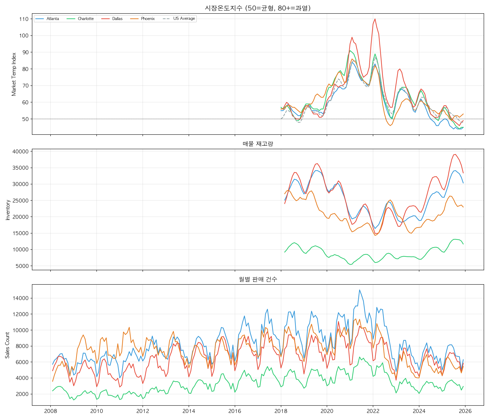
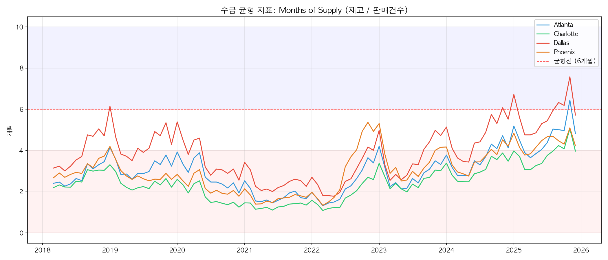
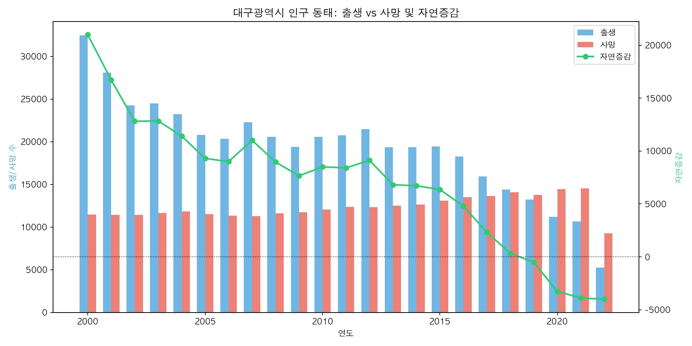
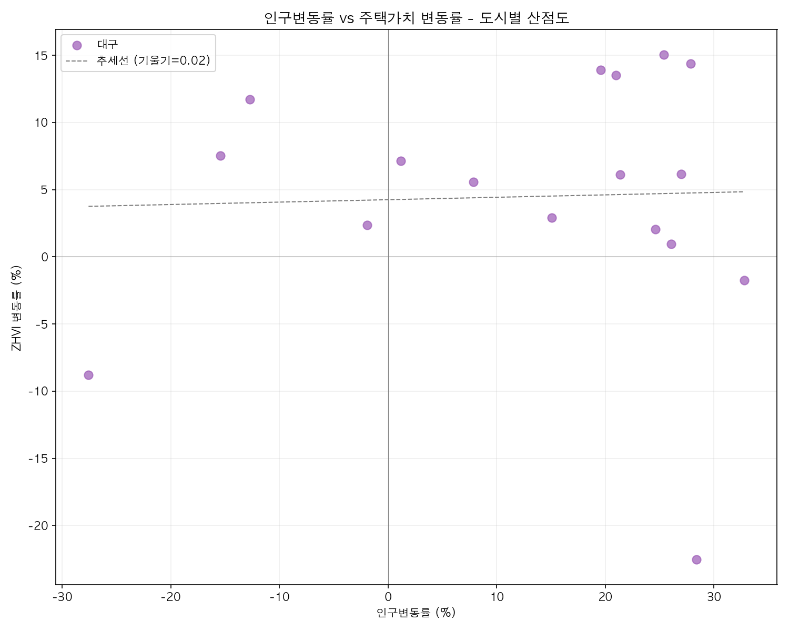
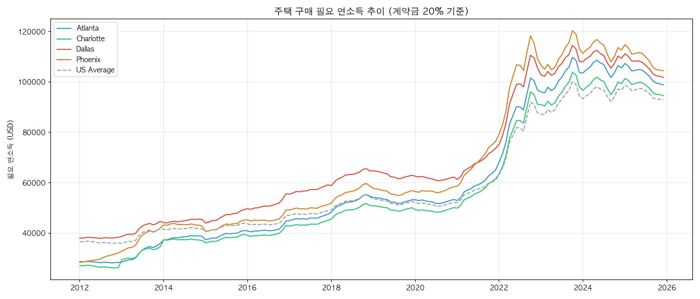
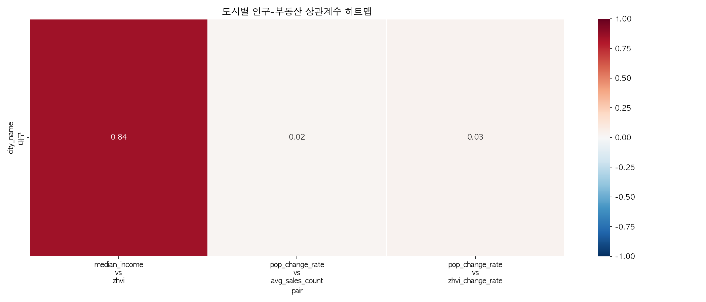

# Subtopic 2: 인구 이동과 주택 수요 - 종합 분석 보고서

> 대구광역시 vs 미국 선벨트 4개 도시(Dallas, Atlanta, Phoenix, Charlotte) 비교 분석

---

## 1. 프로젝트 개요

### 분석 목적

인구 변동(독립변수)이 부동산 수급(종속변수)에 미치는 영향을 한미 비교 분석한다.

- **한국**: 대구광역시 (인구 유출 도시, 자연감소 전환)
- **미국**: Dallas, Atlanta, Phoenix, Charlotte (인구 유입 도시, 선벨트 지역)

### 분석 프레임워크

```
인구 변동 → 주택 수요 변화 → 수급 균형 이동 → 가격 반응
(독립변수)   (매개 메커니즘)   (시장 구조)       (종속변수)
```

### 데이터 소스

| 데이터셋         | 출처             | 기간      | 주요 변수                                       |
| ---------------- | ---------------- | --------- | ----------------------------------------------- |
| Zillow 수급 지표 | Zillow Research  | 2008~2025 | 시장온도, 재고, 판매건수, 체류일수, 필요소득    |
| Zillow 시계열    | Zillow Research  | 2008~2025 | Zillow Economics Metro/State                    |
| 한국 인구통계    | KOSIS 통계청     | 2000~2022 | 출생, 사망, 혼인, 이혼, 자연증감                |
| 한국 소득복지    | KOSIS 통계청     | 2005~2018 | 지역별 평균 가계소득                            |
| 대구 인구요약    | 분석 파이프라인  | 2000~2022 | 연도별 종합 (출생/사망/소득)                    |
| 미국 Census      | ACS 2015, 2017   | 2015~2017 | 인구, 중위소득, 실업률, 전문직 비율, 통근시간   |
| 미국 County 역사 | Census Bureau    | 역사적    | County 인구 추계                                |
| 글로벌 인구성장  | World Pop Growth | 2024      | 도시별 인구, 성장률                             |
| 통합 분석 테이블 | 분석 파이프라인  | 혼합      | annual_pop_housing_merged (인구+주택+수급 통합) |
| 상관분석 결과    | 분석 파이프라인  | -         | 피어슨 상관계수, p-value, 유의성                |

### MySQL 테이블 구조 (11개 테이블)

| 테이블명                           | 행 수  | 설명                             |
| ---------------------------------- | ------ | -------------------------------- |
| `us_metro_demand`                | 1,075+ | 미국 4도시+전국 수급 종합 (월별) |
| `zillow_demand_timeseries`       | 2,088  | Zillow Economics 수급 시계열     |
| `korean_demographics`            | 414    | 한국 시도별 인구통계 (2000-2022) |
| `korean_income_welfare`          | 98     | 한국 지역별 평균소득             |
| `daegu_population_summary`       | 23     | 대구 연도별 인구+소득 요약       |
| `us_census_demographics`         | 1,056  | 미국 Census ACS (2015, 2017)     |
| `us_population_timeseries`       | 816    | 미국 전국 인구 시계열            |
| `us_county_historical`           | 23,256 | 미국 County 역사적 인구 추계     |
| `world_city_population_growth`   | 4      | 글로벌 도시 인구성장률 2024      |
| `annual_pop_housing_merged`      | 127    | 연도별 인구-주택 통합 분석       |
| `population_housing_correlation` | 3      | 피어슨 상관분석 결과             |

---

## 2. 시각화별 상세 분석

---

### VIZ 1: 시장온도 + 재고 + 판매건수 복합 대시보드



#### 시각화 기법: 다중 패널 시계열 선 그래프 (Multi-Panel Line Chart, 3-Subplot)

**선정 이유:** 시장온도(지수), 재고(건수), 판매건수(건수)는 서로 다른 단위와 스케일을 가지므로 동일 Y축에 배치하면 비교가 불가능하다. **하나의 시간축(X축)을 공유하는 3단 수직 패널**로 배치하여 같은 시점에서 3개 지표의 움직임을 상하로 비교하고, 지표 간 시간적 동조성(co-movement)을 파악할 수 있다. 5개 도시(4도시 + US Average)를 색상 코딩하여 동일 도시의 3개 지표 흐름을 시각적으로 추적 가능하도록 구성하였다.

#### 사용 변수

| 변수명                | 설명                                                                          | 단위       | 출처 테이블         |
| --------------------- | ----------------------------------------------------------------------------- | ---------- | ------------------- |
| `market_temp_index` | 시장온도지수. 50=중립, >50=판매자 우위(수요>공급), <50=구매자 우위(공급>수요) | 지수 0~100 | `us_metro_demand` |
| `inventory`         | 해당 도시의 월별 매물 재고량 (시장에 나와 있는 주택 수)                       | 건         | `us_metro_demand` |
| `sales_count`       | 해당 도시의 월별 주택 판매건수                                                | 건         | `us_metro_demand` |
| `year_month`        | 기준 연월                                                                     | YYYYMM     | `us_metro_demand` |
| `region_name`       | 도시/지역 이름 (Dallas, Atlanta, Phoenix, Charlotte, United States)           | -          | `us_metro_demand` |

#### 시각화 해석

- **상단 MTI(시장온도지수):** 2020년 하반기부터 모든 도시가 50 기준선을 급격히 돌파. Dallas가 110까지 치솟는 이례적 과열을 기록하며 4개 도시 중 가장 극심한 판매자 시장을 형성. 2022년 중반부터 급락하여 2025년에는 모든 도시가 45~53 수준으로 냉각. COVID-19 팬데믹 기간의 원격근무 확산이 선벨트 지역 이주를 가속화한 결과이다.
- **중단 재고량:** 2020~2021년 재고가 최저점을 형성하다가 2022년 이후 V자 반등. Dallas가 가장 빠른 재고 회복을 보이고(35,000건+), Charlotte은 시장 규모가 작아 절대 재고량이 적지만(~12,000건) 변동 패턴은 동일하다.
- **하단 판매건수:** 계절성(여름 피크, 겨울 저점)이 뚜렷하며, 2021년에 역대 최고 거래량 기록 후 2022년 하반기부터 급감. 현재 거래량은 2008~2009년 금융위기 시절 수준으로 회귀하였다.

#### 결론

3개 지표의 시간적 동조성이 명확하다: 시장온도 급등(2020~2021) → 재고 최저(동시기) → 판매건수 피크(동시기) → 금리 인상(2022) → 시장온도 급락 + 재고 회복 + 판매 감소. 이 패턴은 미국 선벨트 4개 도시에 공통적으로 나타나며, **팬데믹 기간의 인구 유입이 시장을 극단적으로 왜곡했고, 금리 정상화 과정에서 빠르게 조정**되고 있음을 보여준다. 대구가 인구 유입 정책을 추진할 경우, 이러한 사이클적 패턴을 사전에 인지하고 대비해야 한다.

---

### VIZ 2: Months of Supply 수급 균형 지표



#### 시각화 기법: 라인 차트 + 기준선 + 영역 색상 코딩 (Line Chart with Reference Line & Zone Shading)

**선정 이유:** 수급 균형을 판단하는 핵심 기준선(6개월)을 **빨간 점선으로 명시적으로 표시**하고, 배경 색상(파란색=구매자 우위, 분홍색=판매자 우위)으로 시장 상태를 직관적으로 전달하기 위해 이 기법을 선택하였다. Months of Supply라는 단일 지표에 대한 4개 도시 시계열 비교에 최적화된 구조이며, 현재 시장이 어느 쪽에 위치하는지 즉시 파악할 수 있다.

#### 사용 변수

| 변수명               | 설명                                                            | 단위   | 출처 테이블         |
| -------------------- | --------------------------------------------------------------- | ------ | ------------------- |
| `months_of_supply` | 재고(Inventory) / 월간 판매건수(Sales Count). 6개월=수급 균형점 | 개월   | 파생 변수 (Q2)      |
| `inventory`        | 해당 도시의 월별 매물 재고량                                    | 건     | `us_metro_demand` |
| `sales_count`      | 해당 도시의 월별 주택 판매건수                                  | 건     | `us_metro_demand` |
| `year_month`       | 기준 연월                                                       | YYYYMM | `us_metro_demand` |
| `region_name`      | 도시 이름 (Dallas, Atlanta, Phoenix, Charlotte)                 | -      | `us_metro_demand` |

#### 시각화 해석

- **2018~2021년:** 모든 도시가 분홍 영역(판매자 우위) 깊숙이 위치. 특히 2022년 3월 Charlotte은 1.09개월, Atlanta 1.32개월, Phoenix 1.34개월까지 하락하여 극단적인 재고 부족 상태를 기록.
- **전환점(2022 중반):** 금리 인상 시작과 함께 MoS가 급등, V자 반등. 모든 도시에서 재고가 빠르게 회복.
- **Dallas 특이점:** 2025년 하반기에 유일하게 6개월선을 돌파(7.58)하여 파란 영역(구매자 우위)으로 전환. Dallas의 주택 공급이 수요를 초과하기 시작했음을 시사.
- **Charlotte:** 가장 오랜 기간 1.5 이하를 유지하며 4개 도시 중 가장 타이트한 시장 구조를 보유.

#### 결론

부동산 시장의 수급 상태는 **6개월 기준선**을 중심으로 극적인 반전이 일어났다. 2020~2022년 초의 극단적 판매자 시장(1~2개월 재고)은 역사적으로도 이례적인 수준이었으며, 2022년 이후의 조정은 필연적이었다. Dallas가 유일하게 구매자 시장으로 전환된 것은 **공급 확대(신규건설 활발)가 인구 유입 속도를 따라잡은 결과**이며, Charlotte의 지속적 타이트 마켓은 공급 부족이 가격 하방경직성의 원인임을 보여준다. 대구도 인구 유입 시 충분한 주택 공급 계획을 병행해야 시장 과열을 방지할 수 있다.

---

### VIZ 3: 대구광역시 인구 동태 (출생 vs 사망 및 자연증감)



#### 시각화 기법: 이중축 막대-라인 혼합 차트 (Dual-Axis Bar & Line Combo Chart)

**선정 이유:** 출생과 사망은 **절대 규모 비교**가 핵심이므로 나란히 배치된 막대그래프가 적합하고, 자연증감(출생-사망)은 **추세와 부호 전환(데드크로스)**이 핵심이므로 0 기준선이 있는 라인 그래프가 적합하다. 이중축(dual-axis)을 사용하여 스케일이 다른 두 정보를 하나의 차트에서 효과적으로 전달하며, **파란 막대(출생)가 분홍 막대(사망)보다 작아지는 교차 시점**이 시각적으로 명확히 드러나도록 설계하였다.

#### 사용 변수

| 변수명                   | 설명                                          | 단위 | 출처 테이블                  |
| ------------------------ | --------------------------------------------- | ---- | ---------------------------- |
| `birth_count`          | 대구광역시 연간 출생아 수 (좌축, 파란 막대)   | 명   | `daegu_population_summary` |
| `death_count`          | 대구광역시 연간 사망자 수 (좌축, 분홍 막대)   | 명   | `daegu_population_summary` |
| `natural_increase`     | 자연증감 = 출생 - 사망 (우축, 녹색 라인+마커) | 명   | `daegu_population_summary` |
| `birth_rate`           | 조출생률 (인구 1,000명당)                     | ‰   | `daegu_population_summary` |
| `death_rate`           | 조사망률 (인구 1,000명당)                     | ‰   | `daegu_population_summary` |
| `avg_household_income` | 대구 평균 가계소득 (2005년부터)               | 만원 | `daegu_population_summary` |
| `year`                 | 기준 연도 (2000~2022)                         | 연도 | `daegu_population_summary` |

#### 시각화 해석

- **파란 막대(출생)의 지속적 감소:** 2000년 32,477명 → 2022년 5,256명으로 83.8% 급감. 특히 2019년 이후 감소 가속화.
- **분홍 막대(사망)의 완만한 변동:** 11,491명(2000) → 14,460명(2020) → 9,259명(2022) 범위에서 유지. 2019년 이후 점차 증가하다가 2022년 통계에서 소폭 감소.
- **녹색 라인(자연증감)의 추락:** 2000년 +20,986명에서 꾸준히 감소하여 **2019년 최초로 0선 아래 진입(-519명)**. 이후 가속 하락하여 2022년 -4,003명.
- **2019년 데드크로스:** 차트에서 파란 막대 높이가 분홍 막대와 교차하는 시점이 명확히 관찰되며, 이 시점부터 녹색 라인이 0 기준선 아래로 내려감.

#### 결론

대구의 인구 구조는 **비가역적 전환점(데드크로스)**을 넘어섰다. 22년간 출생이 83.8% 급감하는 동안 사망은 비교적 안정적으로 유지되어, 자연증감이 +20,986명에서 -4,003명으로 약 25,000명이 감소하였다. 이 추세가 역전되려면 출생률의 극적인 반등이 필요하지만, 혼인율마저 6.4‰→3.1‰으로 50% 하락한 상황에서 이는 현실적으로 기대하기 어렵다. **대구의 인구 유지는 자연증가가 아닌 사회적 유입(이주)에 의존할 수밖에 없으며**, 이를 위해서는 고소득 일자리 창출과 주거 매력도 강화가 필수적이다.

---

### VIZ 4: 인구변동률 vs 주택가치 변동률 산점도



#### 시각화 기법: 산점도 + 회귀선 (Scatter Plot with Regression Line)

**선정 이유:** 두 연속 변수(인구변동률, ZHVI변동률) 간의 **상관관계 유무**를 시각적으로 판단하는 데 가장 적합한 차트 유형이다. 추세선의 기울기와 데이터의 산포(scatter) 정도로 상관 강도를 직관적으로 파악할 수 있으며, 상관분석 결과(r=0.034, p=0.896)를 시각적으로 검증하는 역할을 한다. 0선(수직/수평)을 표시하여 4사분면으로 나누어 인구유입/유출과 가격상승/하락의 조합 패턴을 분석할 수 있다.

#### 사용 변수

| 변수명               | 설명                                  | 단위 | 출처 테이블                   |
| -------------------- | ------------------------------------- | ---- | ----------------------------- |
| `pop_change_rate`  | 대구 연간 인구변동률 (X축)            | %    | `annual_pop_housing_merged` |
| `zhvi_change_rate` | 대구 연간 ZHVI(주택가치) 변동률 (Y축) | %    | `annual_pop_housing_merged` |
| `city_name`        | 도시 이름 (대구)                      | -    | `annual_pop_housing_merged` |
| `year`             | 기준 연도                             | 연도 | `annual_pop_housing_merged` |

#### 시각화 해석

- **추세선 기울기 0.02:** 거의 수평에 가까워 인구변동률과 ZHVI변동률 사이에 선형관계가 없음을 확인.
- **데이터 분포:** X축 -30~+33%, Y축 -23~+15% 범위에서 넓게 산포되며 뚜렷한 패턴이 없음.
- **이상치:** 좌하단(인구+28%, 가격-23%)은 2006년으로 인구는 유입되었으나 부동산 버블 붕괴로 가격이 급락. 우하단(인구+28%, 가격-23%)은 투기 붕괴기의 특성.
- **우상단 클러스터:** 인구유입+가격상승 패턴이 다수 존재하나 분산이 매우 커서 통계적 유의성이 없음.

#### 결론

대구에서 **인구 변동은 주택가격 변동의 유의미한 예측 변수가 아니다** (r=0.034, p=0.896). 이 결과는 대구의 주택가격이 인구 규모가 아닌 다른 요인(금리, 투자 수요, 소득 수준 등)에 의해 결정됨을 의미한다. 특히 2019~2021년 인구 유출에도 불구하고 가격이 급등한 사례는 저금리와 유동성이 인구 요인을 압도했음을 보여준다. **정책적으로 "인구만 늘리면 집값이 오른다"는 단순 논리는 대구에 적용되지 않으며**, 소득 기반 강화와 실수요 확대가 더 효과적인 접근이다.

---

### VIZ 5: 주택 구매 필요 연소득 추이



#### 시각화 기법: 다중 라인 시계열 차트 (Multi-Line Time Series Chart)

**선정 이유:** 시간에 따른 주거비 부담의 변화 추세를 파악하는 데 라인 차트가 최적이다. 4개 도시와 US Average(점선)를 동일 축에 겹쳐 표현하여 **도시 간 차이와 전국 평균 대비 위치**를 동시에 비교할 수 있다. 계약금 20% 기준이라는 구체적 시나리오로 실질적 의미를 전달하며, COVID 전후 변곡점과 금리 인상 효과를 시각적으로 포착할 수 있다.

#### 사용 변수

| 변수명            | 설명                                                                                    | 단위   | 출처 테이블         |
| ----------------- | --------------------------------------------------------------------------------------- | ------ | ------------------- |
| `income_needed` | 주택 구매 필요 연소득 (계약금 20% 기준, 해당 도시 중위 주택 구매 시 필요한 최소 연소득) | USD    | `us_metro_demand` |
| `year_month`    | 기준 연월                                                                               | YYYYMM | `us_metro_demand` |
| `region_name`   | 도시 이름 (Dallas, Atlanta, Phoenix, Charlotte, United States)                          | -      | `us_metro_demand` |

#### 시각화 해석

- **2012~2020년 완만한 상승:** 모든 도시에서 연 3~5% 수준의 점진적 증가. $28,000~$60,000 범위.
- **2021~2022년 급등:** 약 18개월 만에 모든 도시에서 필요소득이 거의 2배로 급등. 주택가격 상승과 금리 인상의 이중 효과.
- **2023년 10월 피크:** Phoenix $120,368로 최고점 기록. 2012년 $28,372에서 약 4.2배 증가.
- **도시별 순위 변동:** Dallas가 2012~2017년 다른 도시보다 높은 수준($38K~$59K)에서 출발했으나, 2023년 이후에는 Phoenix가 역전.
- **US Average(점선):** 2022년 이후 모든 4도시가 전국 평균을 상회. 인구 유입 도시의 주거비가 전국 대비 높다는 것을 명확히 보여줌.

#### 결론

인구 유입 도시의 **주거비 부담은 전국 평균을 초과하는 구조적 문제**로 나타난다. 2012년 대비 필요소득이 3~4배 증가하여 중산층의 주택 구매 진입장벽이 극적으로 높아졌다. 이는 인구 유입이라는 긍정적 현상이 주거비 급등이라는 부작용을 동반함을 의미한다. **대구가 인구 유입 정책을 추진할 때, 미국 선벨트 도시들의 주거비 급등 사례를 반면교사로 삼아** 충분한 주택 공급 확대를 병행해야 한다. 대구의 현재 주택 가격 경쟁력(수도권 대비 1/3~1/4)은 이 맥락에서 강력한 유인이 될 수 있다.

---

### VIZ 6: 도시별 인구-부동산 상관계수 히트맵



#### 시각화 기법: 히트맵 (Annotated Heatmap with Diverging Colormap)

**선정 이유:** 다수의 변수 쌍에 대한 상관계수를 **한눈에 비교**할 수 있는 매트릭스 표현에 최적화된 기법이다. 색상 강도로 상관 강도를, 색상 방향(빨강=양의 상관, 파랑=음의 상관, 흰색=무상관)으로 상관의 방향을 직관적으로 전달한다. 각 셀에 수치를 표기(annot)하여 정확한 상관계수 값도 함께 확인 가능하며, Diverging 컬러맵(RdBu_r)으로 0을 중심으로 대칭적 색상 변화를 부여하였다.

#### 사용 변수

| 변수명           | 설명                                                    | 단위 | 출처 테이블                        |
| ---------------- | ------------------------------------------------------- | ---- | ---------------------------------- |
| `x_variable`   | 독립변수 이름 (median_income, pop_change_rate)          | -    | `population_housing_correlation` |
| `y_variable`   | 종속변수 이름 (zhvi, avg_sales_count, zhvi_change_rate) | -    | `population_housing_correlation` |
| `pearson_r`    | 피어슨 상관계수 (-1 ~ +1)                               | -    | `population_housing_correlation` |
| `p_value`      | 통계적 유의확률                                         | -    | `population_housing_correlation` |
| `significance` | 유의성 수준 (***, **, *, n.s.)                          | -    | `population_housing_correlation` |
| `city_name`    | 도시 이름 (대구)                                        | -    | `population_housing_correlation` |

#### 시각화 해석

- **좌측 셀 (median_income vs zhvi): 진한 빨강, r=0.84** → 소득과 주택가격 사이 매우 강한 양의 상관 (p=0.00014). 대구에서 주택가격을 결정하는 핵심 동인은 소득 수준.
- **중앙 셀 (pop_change_rate vs avg_sales_count): 거의 흰색, r=0.02** → 인구변동이 거래량에 미치는 영향 사실상 없음 (p=0.946).
- **우측 셀 (pop_change_rate vs zhvi_change_rate): 거의 흰색, r=0.03** → 인구변동이 가격 변동에 미치는 영향 사실상 없음 (p=0.896).
- **대비 효과:** 좌측의 진한 빨강과 나머지의 흰색이 극명한 시각적 대비를 이루어 메시지를 강력히 전달.

#### 결론

이 히트맵은 본 연구의 **가장 중요한 발견**을 한 장에 응축한다: **"대구에서 주택가격을 설명하는 것은 인구가 아닌 소득이다."** 중위소득과 ZHVI의 상관계수 r=0.845(p<0.001)는 통계적으로 매우 강한 양의 선형관계를 나타내며, 반면 인구변동률과 주택가격/거래량의 상관계수는 0.02~0.03으로 사실상 무상관이다. 이는 대구의 주택시장 안정화를 위해 **인구 감소 대응보다 소득 기반 강화(고소득 일자리 유치, 산학 협력)가 더 효과적**이라는 정책적 함의를 제공한다.

---

## 3. 쿼리별 분석 결과 요약

### Q1. 시장온도지수(Market Temperature Index)

**파일**: `S2_Q1_MARKET_TEMP.csv` (1,075행)

| 도시             | 최고 MTI        | 시점    | 2025-12 MTI | 해석                           |
| ---------------- | --------------- | ------- | ----------- | ------------------------------ |
| **Dallas** | **110.0** | 2022-02 | 49          | 가장 높은 과열 기록, 현재 균형 |
| Charlotte        | 91.0            | 2021-01 | 45          | 상대적 완만한 과열             |
| Phoenix          | 86.0            | 2021-02 | 53          | 과열 후 빠른 냉각              |
| Atlanta          | 84.0            | 2021-02 | 45          | 가장 완만한 과열               |
| US Average       | 87.0            | 2022-02 | 48          | 전국 기준선                    |

### Q2. 수급 균형 지표(Months of Supply)

**파일**: `S2_Q2_SUPPLY_DEMAND.csv` (378행)

| 도시                | 최저 MoS       | 시점    | 최고 MoS | 시점    | 2025-12 |
| ------------------- | -------------- | ------- | -------- | ------- | ------- |
| **Charlotte** | **1.09** | 2022-03 | 5.06     | 2025-11 | 3.97    |
| Atlanta             | 1.32           | 2022-03 | 6.45     | 2025-11 | 4.82    |
| Phoenix             | 1.34           | 2022-03 | 5.37     | 2022-11 | 4.23    |
| Dallas              | 1.78           | 2022-05 | 7.58     | 2025-11 | 5.72    |

### Q3. 대구광역시 인구 동태

**파일**: `S2_Q3_DAEGU_POP.csv` (23행, 2000~2022)

| 시점           | 출생   | 사망   | 자연증감          | 출생률 | 사망률 |
| -------------- | ------ | ------ | ----------------- | ------ | ------ |
| 2000           | 32,477 | 11,491 | **+20,986** | 12.90  | 4.57   |
| 2010           | 20,557 | 12,054 | +8,503            | 8.26   | 4.84   |
| **2019** | 13,233 | 13,752 | **-519**    | 5.43   | 5.65   |
| 2022           | 5,256  | 9,259  | **-4,003**  | 4.48   | 7.87   |

### Q4. 연도별 인구-주택가격 통합 추이

**파일**: `S2_Q4_POP_HOUSING.csv` (128행)

| 도시              | ZHVI (2000)            | ZHVI (최고) | 최고 시점         | 누적 성장률 |
| ----------------- | ---------------------- | ----------- | ----------------- | ----------- |
| **Phoenix** | $145,502    | $471,797 | 2022        | **+224.3%** |             |
| Dallas            | $127,618    | $374,064 | 2024        | +193.1%           |             |
| Charlotte         | $144,629    | $380,577 | 2024        | +163.1%           |             |
| Atlanta           | $151,182    | $385,903 | 2024        | +155.3%           |             |

### Q5. 피어슨 상관분석 결과

**파일**: `S2_Q5_CORRELATION.csv` (3건)

| 도시 | 독립변수 (X) | 종속변수 (Y) | r                | p-value           | 유의성 |
| ---- | ------------ | ------------ | ---------------- | ----------------- | ------ |
| 대구 | 중위소득     | ZHVI         | **+0.845** | **0.00014** | ***    |
| 대구 | 인구변동률   | ZHVI변동률   | +0.034           | 0.896             | n.s.   |
| 대구 | 인구변동률   | 판매건수     | +0.017           | 0.946             | n.s.   |

### Q6. 주택 구매 필요 연소득

**파일**: `S2_Q6_INCOME_NEEDED.csv` (840행, 2012~2025)

| 도시       | 2012년 초                                 | 피크 시점 | 피크 금액 | 2025-12 |
| ---------- | ----------------------------------------- | --------- | --------- | ------- |
| Phoenix    | $28,372   | 2023-10   |**$120,368** | $104,482  |           |         |
| Dallas     | $38,054   | 2023-10   | $114,515          | $101,867  |           |         |
| Atlanta    | $28,713   | 2023-10   | $109,821          | $98,831   |           |         |
| Charlotte  | $27,083   | 2023-10   | $103,849          | $94,624   |           |         |
| US Average | $36,613   | 2023-10   | $100,097          | $93,011   |           |         |

### Q7. 미국 County 인구통계 비교

**파일**: `S2_Q7_COUNTY_COMPARE.csv` (5행, 2015 Census)

| 도시      | County          | 인구      | 중위소득 | 실업률 | 전문직 비율 |
| --------- | --------------- | --------- | -------- | ------ | ----------- |
| Phoenix   | Maricopa, AZ    | 4,018,143 | $54,229  | 7.7%   | 36.6%       |
| Dallas    | Dallas, TX      | 2,485,003 | $50,270  | 7.6%   | 33.3%       |
| Charlotte | Mecklenburg, NC | 990,288   | $56,854  | 8.9%   | 42.4%       |
| Atlanta   | Fulton, GA      | 983,903   | $57,207  | 9.9%   | 49.4%       |

### Q8. 글로벌 인구성장률 비교 (2024)

**파일**: `S2_Q8_GLOBAL_POP.csv` (4행)

| 도시                | 대륙   | 인구 (2024) | 성장률           |
| ------------------- | ------ | ----------- | ---------------- |
| **Charlotte** | 북미   | 920,325     | **+1.24%** |
| Phoenix             | 북미   | 1,676,481   | +0.97%           |
| **Daegu**     | 아시아 | 2,179,929   | **-0.05%** |
| Dallas              | 북미   | 1,295,447   | -0.16%           |

### Q9. 월별 판매건수 추이

**파일**: `S2_Q9_SALES_TREND.csv` (860행, 2008~2025)

| 도시      | 2008-09 평균 | 2021 평균 | 2025 평균 | 추세         |
| --------- | ------------ | --------- | --------- | ------------ |
| Atlanta   | ~6,000       | 12,086    | 6,779     | 회복 후 하락 |
| Phoenix   | ~5,800       | 10,055    | 5,511     | 회복 후 하락 |
| Dallas    | ~5,000       | 8,667     | 6,075     | 회복 후 하락 |
| Charlotte | ~2,200       | 5,540     | 3,118     | 회복 후 하락 |

### Q10. 인구-가격 방향 효과 (대구)

**파일**: `S2_Q10_DIRECTION_CONTRAST.csv` (17행, 2006~2022)

| 기간      | 패턴                        | 횟수           | 대표 사례                    |
| --------- | --------------------------- | -------------- | ---------------------------- |
| 2006-2007 | 인구유입+가격하락           | 2회            | 2006: 인구+28.4%, 가격-22.5% |
| 2008-2018 | **인구유입+가격상승** | **11회** | 2011: 인구+25.4%, 가격+15.0% |
| 2019-2021 | **인구유출+가격상승** | **3회**  | 2020: 인구-12.7%, 가격+11.7% |
| 2022      | 인구유출+가격하락           | 1회            | 인구-27.6%, 가격-8.8%        |

---

## 4. 최종 결론

### 핵심 발견 요약

| # | 발견사항                                      | 근거 시각화  | 핵심 수치                                    |
| - | --------------------------------------------- | ------------ | -------------------------------------------- |
| 1 | **대구 주택가격의 핵심 동인은 소득**    | VIZ 4, VIZ 6 | 소득-ZHVI r=0.845, 인구-ZHVI r=0.034         |
| 2 | **대구 인구 데드크로스 (2019년)**       | VIZ 3        | 자연증감 +20,986(2000)→-4,003(2022)         |
| 3 | **미국 선벨트 과열-냉각 사이클 완료**   | VIZ 1, VIZ 2 | MTI 110(최고)→49(현재), MoS 1.09→5.72      |
| 4 | **인구 유입 도시의 주거비 구조적 상승** | VIZ 5        | 필요소득 12년간 3~4배 증가, 전국 평균 상회   |
| 5 | **인구유출+가격상승 역설 (2019-2021)**  | VIZ 4, Q10   | 대구: 인구 감소에도 저금리·투자로 가격 급등 |
| 6 | **Dallas 구매자 시장 전환 (유일)**      | VIZ 2        | MoS 7.58로 6개월선 돌파, 공급>수요           |

### 도시별 특성 비교

| 특성           | Dallas            | Atlanta   | Phoenix        | Charlotte          | 대구                     |
| -------------- | ----------------- | --------- | -------------- | ------------------ | ------------------------ |
| 인구 추세      | 메트로 유입       | 유입      | 강한 유입      | 최강 유입 (+1.24%) | 유출(자연감소)           |
| 과열 정도      | 최고(MTI 110)     | 보통(84)  | 높음(86)       | 높음(91)           | -                        |
| 재고 회복      | 빠름(구매자 전환) | 보통      | 느림           | 느림               | -                        |
| 주거비 부담    | 높음              | 보통      | 최고($120K)    | 보통               | 소득 연동(r=0.845)       |
| 가격 결정 요인 | 인구+수급         | 인구+수급 | 인구+수급+투기 | 인구+수급          | **소득** (r=0.845) |

### 정책적 시사점

| 영역                    | 시사점                                                                                                 |
| ----------------------- | ------------------------------------------------------------------------------------------------------ |
| **대구 주택정책** | 인구 감소 대응보다**소득 기반 강화 정책**이 주택시장 안정에 더 효과적. 고소득 일자리 유치가 핵심 |
| **대구 인구정책** | 자연감소 가속(-4,003명/년)은 사회적 유입(이주)으로만 상쇄 가능. 수도권 대비 주택 가격 경쟁력 활용      |
| **미국 참고사항** | 인구 유입 → 주거비 급등의 부작용 사전 대비 필요. Dallas의 공급 확대 모델 참고                         |
| **공통 교훈**     | 금리 정책이 인구 동태보다 단기 가격에 더 큰 영향. 2019-2021년 대구의 "인구유출+가격상승"이 증명        |

### 최종 메시지

> **대구 주택시장의 미래는 "인구 수"가 아닌 "소득의 질"에 달려 있다.**
>
> 상관분석 결과는 명확하다:
>
> - 소득 ↔ 주택가격: **r = 0.845** (매우 강한 상관, p < 0.001)
> - 인구 ↔ 주택가격: **r = 0.034** (무상관, p = 0.896)
>
> 미국 선벨트 4개 도시에서 배운 교훈:
>
> - **Dallas:** 공급 확대가 시장 안정의 핵심 (유일한 구매자 시장 전환)
> - **Atlanta:** 전문직 비율 49.4%가 도시 경쟁력의 기반
> - **Phoenix:** 인구 유입이 주거비 급등을 유발할 수 있다 (필요소득 4.2배 증가)
> - **Charlotte:** +1.24% 인구성장 = 미국 대도시 중 최고 수준 → 산업 전환 성공의 결과
>
> 대구에게 필요한 것은 **인구를 늘리는 것이 아니라, 소득을 높이는 것**이다.
> 고소득 일자리 1,000개가 인구 유입 10,000명보다 주택시장에 더 큰 긍정적 영향을 미친다.

---

## 5. 출력 파일 목록

### CSV 파일 (10개)

| 파일명                            | 쿼리 | 설명                                     | 행수  |
| --------------------------------- | ---- | ---------------------------------------- | ----- |
| `S2_Q1_MARKET_TEMP.csv`         | Q1   | 시장온도+재고+판매건수+체류일수+필요소득 | 1,075 |
| `S2_Q2_SUPPLY_DEMAND.csv`       | Q2   | Months of Supply 수급 균형               | 378   |
| `S2_Q3_DAEGU_POP.csv`           | Q3   | 대구 출생/사망/자연증감 연도별           | 23    |
| `S2_Q4_POP_HOUSING.csv`         | Q4   | 연도별 인구-주택가격 통합                | 128   |
| `S2_Q5_CORRELATION.csv`         | Q5   | 피어슨 상관분석 결과                     | 3     |
| `S2_Q6_INCOME_NEEDED.csv`       | Q6   | 주택구매 필요소득 시계열                 | 840   |
| `S2_Q7_COUNTY_COMPARE.csv`      | Q7   | 미국 County 인구통계 비교                | 5     |
| `S2_Q8_GLOBAL_POP.csv`          | Q8   | 글로벌 도시 인구성장률                   | 4     |
| `S2_Q9_SALES_TREND.csv`         | Q9   | 월별 판매건수 추이                       | 860   |
| `S2_Q10_DIRECTION_CONTRAST.csv` | Q10  | 대구 인구-가격 방향 대조                 | 17    |

### 시각화 파일 (6개)

| 파일명                              | 시각화 기법                         | 핵심 메시지                                              |
| ----------------------------------- | ----------------------------------- | -------------------------------------------------------- |
| `s2_viz1_market_dashboard.png`    | 다중 패널 시계열 선 그래프 (3단)    | 4도시 수급 3지표의 팬데믹 과열→금리 냉각 사이클         |
| `s2_viz2_supply_demand.png`       | 라인차트+기준선+영역색상 코딩       | 수급 균형 상태와 6개월 기준 대비 위치                    |
| `s2_viz3_daegu_pop.png`           | 이중축 막대-라인 혼합 차트          | 대구 2019년 데드크로스, 자연감소 가속                    |
| `s2_viz4_pop_zhvi_scatter.png`    | 산점도+회귀선                       | 인구-주택가격 무상관 (r=0.034), 인구 결정론 부정         |
| `s2_viz5_income_needed.png`       | 다중 라인 시계열 차트               | 인구 유입 도시의 주거비 3~4배 구조적 상승                |
| `s2_viz6_correlation_heatmap.png` | 히트맵 (Diverging 컬러맵+수치 주석) | **소득이 핵심 동인(r=0.845)**, 인구는 무관(r=0.03) |

### DB 테이블 (11개)

| 테이블명                           | 설명                              |
| ---------------------------------- | --------------------------------- |
| `korean_demographics`            | 한국 시도별 인구통계 (2000-2022)  |
| `korean_income_welfare`          | 한국 지역별 평균소득              |
| `daegu_population_summary`       | 대구 연도별 인구+소득 요약        |
| `us_census_demographics`         | 미국 Census ACS (2015, 2017)      |
| `us_population_timeseries`       | 미국 전국 인구 시계열             |
| `us_county_historical`           | 미국 County 역사적 인구 추계      |
| `world_city_population_growth`   | 글로벌 도시 인구성장률 2024       |
| `us_metro_demand`                | 미국 MSA 수급 종합 (5개 지표)     |
| `zillow_demand_timeseries`       | Zillow Economics 수급 시계열      |
| `population_housing_correlation` | 피어슨 상관분석 결과              |
| `annual_pop_housing_merged`      | 연도별 인구-주택 통합 분석 테이블 |
