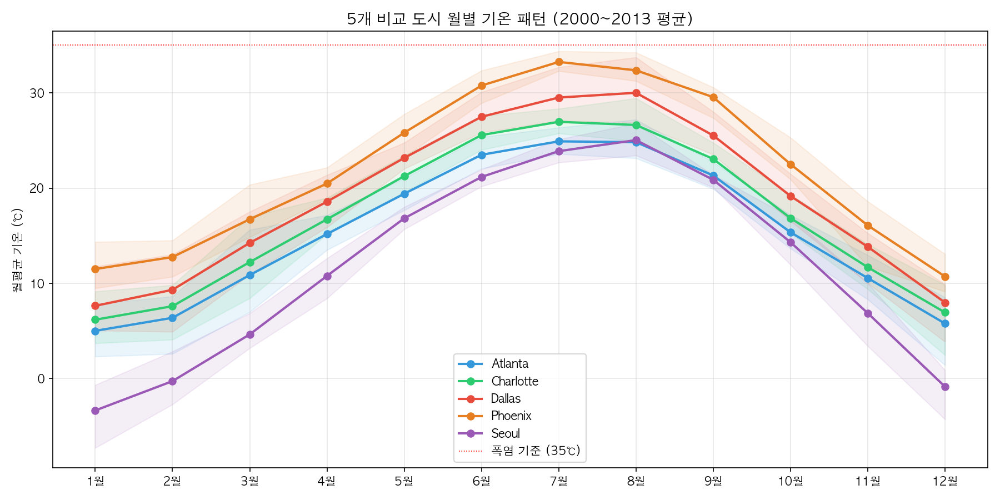
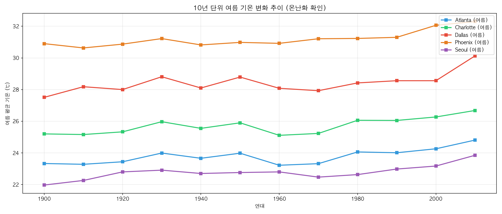
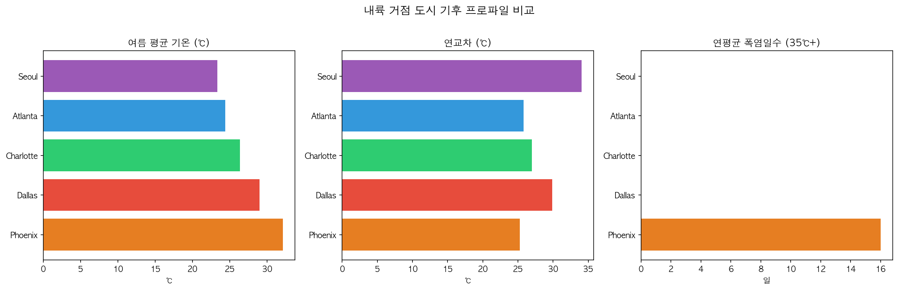
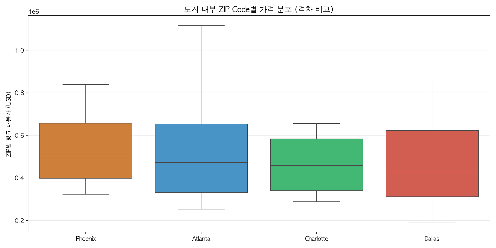
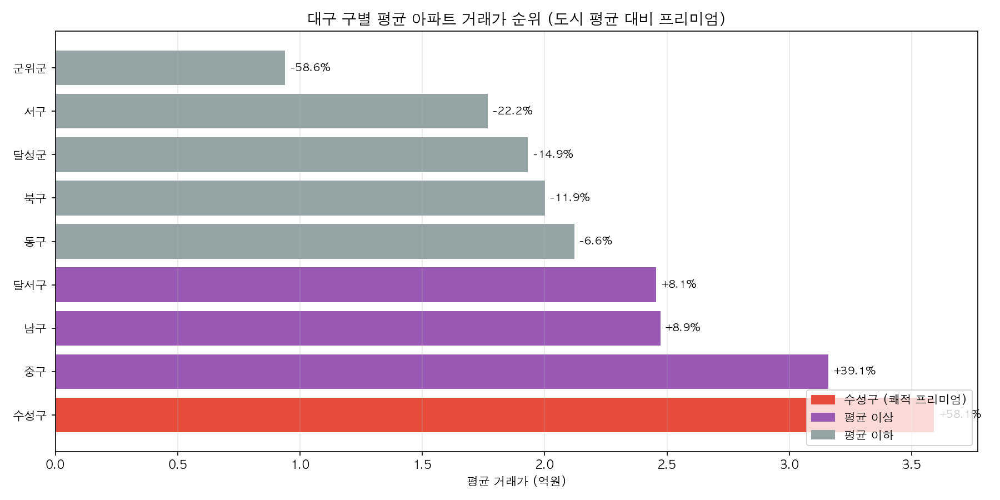
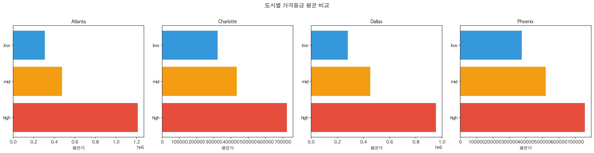
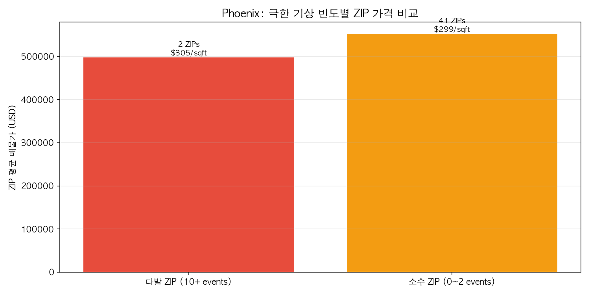

# 소주제3: 기후·입지와 지역별 가격 격차 — 시각화 분석 보고서

## 개요

본 보고서는 소주제3의 7개 시각화에 대해 **(1) 시각화 선택 이유**, **(2) 사용 변수**, **(3) 분석 결론**을 정리한 문서이다.

- **분석 대상 도시**: Phoenix, Dallas, Atlanta, Charlotte (미국 4개 내륙 도시) + Seoul/대구 (한국)
- **기후 데이터**: Berkeley Earth (1743~2013), Daily City Temperature, US Weather Events (2016~2022)
- **가격 데이터**: Realtor.com ZIP별 매물가, 대구 아파트 실거래가
- **분석 도구**: Python (pandas, scipy, matplotlib, seaborn) + MySQL 9.6.0
- **파이프라인 검증**: `s3_run_all.py` 전체 실행 완료 (9 STEP, 약 24초, 에러 0건)

### 출력 파일 목록 (18개)

| 유형 | 파일명                             | 설명                            |
| ---- | ---------------------------------- | ------------------------------- |
| CSV  | `S3_Q1_CLIMATE_PROFILE.csv`        | 도시별 기후 프로파일 (5개 도시) |
| CSV  | `S3_Q2_MONTHLY_PATTERN.csv`        | 월별 기온 패턴 (60행)           |
| CSV  | `S3_Q3_WARMING_TREND.csv`          | 10년 단위 온난화 트렌드 (60행)  |
| CSV  | `S3_Q4_DAEGU_DISTRICT_RANK.csv`    | 대구 구별 가격 순위 (9행)       |
| CSV  | `S3_Q5_ZIP_PRICE_DISTRIBUTION.csv` | 도시별 ZIP 가격 분포 통계 (4행) |
| CSV  | `S3_Q6_TIER_COMPARISON.csv`        | 가격등급별 평균 비교 (15행)     |
| CSV  | `S3_Q7_PHOENIX_HEAT_PRICE.csv`     | Phoenix 기상빈도별 가격 (2행)   |
| CSV  | `S3_Q8_SUSEONG_PREMIUM.csv`        | 수성구 프리미엄 비교 (2행)      |
| CSV  | `S3_Q9_HEATWAVE_STATS.csv`         | 연도별 기상이벤트 통계 (107행)  |
| CSV  | `S3_Q10_CORRELATION.csv`           | 피어슨 상관분석 결과 (5행)      |
| PNG  | `s3_viz1_monthly_temp.png`         | 차트 1: 월별 기온 패턴          |
| PNG  | `s3_viz2_warming_trend.png`        | 차트 2: 온난화 트렌드           |
| PNG  | `s3_viz3_climate_profile.png`      | 차트 3: 기후 프로파일 비교      |
| PNG  | `s3_viz4_zip_boxplot.png`          | 차트 4: ZIP 가격 박스플롯       |
| PNG  | `s3_viz5_daegu_district.png`       | 차트 5: 대구 구별 순위          |
| PNG  | `s3_viz6_tier_heatmap.png`         | 차트 6: 가격등급 비교           |
| PNG  | `s3_viz7_phoenix_heat.png`         | 차트 7: Phoenix 심층 분석       |
| MD   | `S3_시각화_분석_보고서.md`         | 본 보고서                       |

---

## 차트 1: 5개 도시 월별 기온 패턴

### 시각화 유형

**꺾은선 그래프 (Line Chart) + 범위 밴드 (Fill Between)**

### 선택 이유

- **시간 순서 데이터**(1~12월)의 연속적 변화를 보여주기에 꺾은선 그래프가 가장 적합하다.
- 5개 도시를 **색상별로 구분**하여 한 차트에 겹쳐 표시함으로써 도시 간 기온 패턴의 차이를 직관적으로 비교할 수 있다.
- 각 도시의 월별 최소~최대 범위를 **반투명 밴드(fill_between)**로 표현하여, 평균뿐 아니라 **기온 변동 폭**까지 동시에 전달한다.
- 35℃ **폭염 기준선**을 빨간 점선으로 표시하여 어떤 도시가 폭염 위험에 노출되는지 시각적으로 명확하게 보여준다.

### 사용 변수

| 변수            | 출처 테이블                | 설명                              |
| --------------- | -------------------------- | --------------------------------- |
| `month` (1~12)  | `climate_monthly_berkeley` | X축: 월                           |
| `AVG(avg_temp)` | `climate_monthly_berkeley` | Y축: 2000~2013 월별 평균 기온 (℃) |
| `MIN(avg_temp)` | `climate_monthly_berkeley` | 밴드 하한: 해당 월 최저 평균      |
| `MAX(avg_temp)` | `climate_monthly_berkeley` | 밴드 상한: 해당 월 최고 평균      |
| `city`          | `climate_monthly_berkeley` | 색상 구분: 5개 도시명             |

### 차트 해석

- 차트 상단의 빨간 점선이 **35℃ 폭염 기준선**이며, 각 도시의 꺾은선 주위에 반투명 색상 밴드가 해당 월의 기온 변동 범위를 나타낸다.
- **Phoenix**(주황)의 꺾은선이 7월에 약 **33℃**까지 치솟아 5개 도시 중 압도적으로 높고, 상한 밴드가 35℃ 폭염 기준선에 거의 닿는다.
- **Seoul**(보라)은 1~2월에 **영하(-3℃~0℃)** 영역까지 하락하며, 밴드 폭이 5개 도시 중 가장 넓다. 이는 **연교차 34℃**로 대륙성 기후의 특성을 명확히 보여준다.
- **Dallas**(빨강)는 여름 약 29~30℃로 Phoenix 바로 아래에 위치하고, **Charlotte**(초록)과 **Atlanta**(파랑)는 비슷한 높이에서 아열대 패턴을 보인다.

### 결론

- 모든 도시가 7~8월에 최고 기온을 기록하나, **Phoenix만이 폭염 기준에 근접**하는 극한 환경이다.
- 겨울에는 Seoul이 유일하게 영하로 떨어져, 여름에는 가장 서늘하지만 겨울에는 가장 추운 **극단적 계절 변화**를 보인다.
- 이 패턴은 Phoenix의 부동산 시장이 기후 리스크에 가장 직접적으로 노출되어 있음을 시사하며, Seoul(대구 대리)은 여름 폭염과 겨울 혹한이 동시에 고려되어야 하는 시장임을 보여준다.

---

## 차트 2: 10년 단위 여름 기온 변화 추이 (온난화 확인)

### 시각화 유형

**꺾은선 그래프 (Line Chart) — 장기 시계열**

### 선택 이유

- **100년 이상(1900~2010)의 장기 시계열**에서 온난화 트렌드를 확인하려면, 연도별 잡음을 제거한 **10년(decade) 단위 집계** 꺾은선이 가장 효과적이다.
- 5개 도시를 동일 Y축에 겹쳐 표시하여 온난화 속도와 도시 간 **기온 수준 차이**를 동시에 비교할 수 있다.
- 사각 마커(`marker='s'`)로 각 데이터 포인트를 명확히 표시하여 정확한 값을 읽을 수 있게 했다.

### 사용 변수

| 변수                                                | 출처 테이블                | 설명                                     |
| --------------------------------------------------- | -------------------------- | ---------------------------------------- |
| `FLOOR(year/10)*10`                                 | `climate_monthly_berkeley` | X축: 연대 (1900~2010)                    |
| `AVG(CASE WHEN month IN (6,7,8) THEN avg_temp END)` | `climate_monthly_berkeley` | Y축: 10년 단위 여름(6~8월) 평균 기온 (℃) |
| `city`                                              | `climate_monthly_berkeley` | 색상 구분: 5개 도시명                    |

### 차트 해석

- 그래프에서 5개 도시가 수평 밴드 형태로 분리되어 있으며, 위에서부터 **Phoenix**(주황, 31~32℃) > **Dallas**(빨강, 27~30℃) > **Charlotte**(초록, 25~27℃) > **Atlanta**(파랑, 23~25℃) > **Seoul**(보라, 22~24℃) 순서이다.
- **Dallas**(빨강)의 2010년대 데이터 포인트가 급격히 상승하여 30℃를 돌파하는 것이 차트에서 가장 눈에 띄는 변화이다.
- 1930~1960년대에 모든 도시에서 소폭 하락 또는 정체 구간이 보이며(Global Dimming 시기), 1970년대 이후 다시 상승 추세로 전환된다.

### 결론

- **모든 5개 도시에서 1970년대 이후 지속적인 여름 기온 상승**이 관찰된다.

| 도시          | 1900년대 | 1970년대 | 2010년대   | 1970→2010 변화 |
| ------------- | -------- | -------- | ---------- | -------------- |
| **Dallas**    | 27.51℃   | 27.93℃   | **30.13℃** | **+2.20℃**     |
| **Seoul**     | 21.97℃   | 22.47℃   | **23.85℃** | +1.38℃         |
| **Charlotte** | 25.20℃   | 25.23℃   | **26.68℃** | +1.45℃         |
| **Atlanta**   | 23.33℃   | 23.32℃   | **24.81℃** | +1.49℃         |
| **Phoenix**   | 30.90℃   | 31.21℃   | **32.30℃** | +1.09℃         |

- **Dallas**의 온난화가 **+2.2℃**로 가장 급격하며, 이미 30℃를 넘어섰다.
- **Phoenix**는 변화폭 자체는 +1.1℃로 가장 작지만, 이미 32℃라는 극고온에서의 추가 상승이므로 실질 영향이 크다.
- 장기적으로 온난화가 지속될 경우, 폭염 리스크 증가가 부동산 가격에 반영될 가능성이 있다.

---

## 차트 3: 내륙 거점 도시 기후 프로파일 비교

### 시각화 유형

**수평 막대 그래프 3연 (Horizontal Bar Chart Triptych)**

### 선택 이유

- **카테고리 데이터**(도시명)를 비교할 때 막대 그래프가 가장 직관적이다.
- 3개의 핵심 기후 지표를 **나란히 배치(triptych)**하여 각 도시의 기후 특성을 **다차원적으로** 한눈에 비교할 수 있다.
- 수평 막대로 도시명을 Y축에 배치하여 라벨 가독성을 확보하고, 여름 기온 내림차순(Phoenix→Seoul)으로 정렬했다.
- 각 도시에 **고유 색상**(Phoenix=주황, Dallas=빨강, Charlotte=초록, Atlanta=파랑, Seoul=보라)을 부여하여 차트 간 시각적 일관성을 유지했다.

### 사용 변수

| 변수                | 출처 테이블            | 설명                                  |
| ------------------- | ---------------------- | ------------------------------------- |
| `city_name`         | `city_climate_profile` | Y축: 도시명                           |
| `summer_avg_temp`   | `city_climate_profile` | 좌측 차트: 여름 평균 기온 (℃)         |
| `temp_range`        | `city_climate_profile` | 중앙 차트: 연교차 (℃)                 |
| `heatwave_days_avg` | `city_climate_profile` | 우측 차트: 연평균 폭염일수 (35℃ 이상) |

### 차트 해석

- 3개 패널이 좌→우로 배열되어 있으며, Y축은 5개 도시(여름 기온 내림차순: Phoenix→Dallas→Charlotte→Atlanta→Seoul)이다.
- **좌측(여름 평균 기온)**: Phoenix의 주황 막대가 가장 길고(~32℃), Seoul의 보라 막대가 가장 짧다(~23℃).
- **중앙(연교차)**: Seoul의 보라 막대가 **34℃ 이상**으로 가장 길어, 여름 기온 순서와 정반대이다. 이는 Seoul(대구)의 대륙성 기후 특성을 강하게 보여준다.
- **우측(폭염일수)**: **Phoenix만 유일하게 막대가 존재**하며(~16일), 나머지 4개 도시는 막대가 전혀 없다(0일). 시각적으로 가장 극적인 차이를 보이는 패널이다.

### 결론

- **여름 평균 기온**: Phoenix(32.13℃) > Dallas(29.01℃) > Charlotte(26.39℃) > Atlanta(24.41℃) > Seoul(23.36℃)
- **연교차**: Seoul(34.07℃) > Dallas(29.88℃) > Charlotte(26.98℃) > Atlanta(25.80℃) > Phoenix(25.24℃)
- **폭염일수**: Phoenix **16일**(극한 3일 포함) / 나머지 4개 도시 **0일** / Seoul 데이터 미수집
- 기후 유형별로 부동산 리스크가 극명하게 다르며, Phoenix(고온 사막 분지)는 폭염 리스크가 독보적이다. 반면 Seoul(대구)은 연교차가 가장 커서 냉난방 비용 부담이 가장 크다.

---

## 차트 4: 도시 내부 ZIP Code별 가격 분포 (격차 비교)

### 시각화 유형

**박스플롯 (Box Plot)**

### 선택 이유

- **데이터의 분포 특성**(중앙값, 사분위수, 범위)을 한 번에 보여주는 데 박스플롯이 최적이다.
- 4개 도시의 ZIP Code별 가격을 나란히 놓아 **도시 간 가격 수준**과 **도시 내부 격차(분산)**를 동시에 비교할 수 있다.
- 이상치를 제거(`showfliers=False`)하여 핵심 분포에 집중하고, 중앙값 기준 내림차순 정렬로 도시 간 가격 수준을 자연스럽게 비교한다.
- Seaborn 라이브러리의 컬러 매핑으로 도시별 고유 색상을 유지했다.

### 사용 변수

| 변수        | 출처 테이블                            | 설명                          |
| ----------- | -------------------------------------- | ----------------------------- |
| `city_name` | `cities` JOIN `us_zip_realtor_summary` | X축: 도시명 (중앙값 내림차순) |
| `avg_price` | `us_zip_realtor_summary`               | Y축: ZIP별 평균 매물가 (USD)  |

### 차트 해석

- 좌→우 순서: **Phoenix**(주황) → **Atlanta**(파랑) → **Charlotte**(초록) → **Dallas**(빨강) — 중앙값 내림차순 정렬.
- Y축 단위는 **1e6 (백만 달러)**이며, 0.2M~1.1M 범위를 표시한다.
- **Phoenix**: 중앙값 약 $500K로 가장 높고, 박스(IQR)가 $400K~$650K로 비교적 좁다.
- **Atlanta**: 중앙값은 약 $470K이지만, **위스커가 $1.1M 이상**까지 뻗어 있어 상위 가격대 편차가 매우 크다.
- **Dallas**: 중앙값 약 $430K으로 가장 낮고, **아래쪽 위스커가 $200K 부근**까지 뻗어 저가 ZIP이 많다.
- **Charlotte**: 박스와 위스커 모두 비교적 짧아 가장 균일한 분포.

| 도시      | ZIP 수 | 평균가   | 최저 ZIP | 최고 ZIP   | 격차 비율  |
| --------- | ------ | -------- | -------- | ---------- | ---------- |
| Atlanta   | 37     | $658,630 | $252,968 | $4,244,522 | **16.8배** |
| Dallas    | 47     | $563,829 | $192,114 | $2,087,709 | **10.9배** |
| Phoenix   | 43     | $549,820 | $323,612 | $1,434,439 | 4.4배      |
| Charlotte | 25     | $489,882 | $287,637 | $1,182,840 | 4.1배      |

- 박스 길이(IQR)가 큰 Atlanta·Dallas는 도시 내 **입지에 따른 가격 민감도**가 높음을 의미하며, 기후·입지 요인이 가격에 미치는 영향을 분석할 여지가 크다.

---

## 차트 5: 대구 구별 평균 아파트 거래가 순위

### 시각화 유형

**수평 막대 그래프 + 프리미엄(%) 라벨 + 색상 그룹 범례**

### 선택 이유

- **순위형 카테고리 데이터**(9개 구/군)를 비교하기에 수평 막대가 적합하다.
- 단순 가격(억원)뿐 아니라 각 막대 옆에 **도시 평균 대비 프리미엄(%)**을 텍스트로 표시하여 **상대적 위치**를 즉시 파악할 수 있다.
- **3색 색상 코딩**으로 직관적 해석을 돕는다:
  - 빨강: **수성구** (쾌적 프리미엄 — 핵심 관찰 대상)
  - 보라: 평균 이상 (중구, 남구, 달서구)
  - 회색: 평균 이하 (동구, 북구, 달성군, 서구, 군위군)
- 가격순 정렬로 수성구가 최하단(가장 긴 막대)에 위치하여 시각적으로 강조된다.

### 사용 변수

| 변수                | 출처 테이블                     | 설명                              |
| ------------------- | ------------------------------- | --------------------------------- |
| `district`          | `daegu_district_climate_prices` | Y축: 구/군명 (가격순 정렬)        |
| `avg_price / 10000` | `daegu_district_climate_prices` | X축: 평균 거래가 (억원 단위)      |
| `premium_vs_avg`    | `daegu_district_climate_prices` | 라벨: 도시 평균 대비 프리미엄 (%) |
| `price_rank`        | `daegu_district_climate_prices` | 정렬 기준                         |

### 차트 해석

- 막대가 가격순으로 정렬되어, 최하단 **수성구**(빨강)가 가장 길고(~3.6억원), 최상단 **군위군**(회색)이 가장 짧다(~0.9억원).
- 각 막대 오른쪽에 **+/-% 프리미엄** 라벨이 표시되어 도시 평균 대비 상대적 위치를 즉시 읽을 수 있다.
- 우하단 범례로 3색 그룹을 구분: 빨강(수성구 쾌적 프리미엄), 보라(평균 이상), 회색(평균 이하).

### 결론

| 순위 | 구/군      | 평균 거래가 (만원) | 프리미엄   | 색상 |
| ---- | ---------- | ------------------ | ---------- | ---- |
| 1    | **수성구** | 35,905 (3.59억)    | **+58.1%** | 빨강 |
| 2    | 중구       | 31,599 (3.16억)    | +39.1%     | 보라 |
| 3    | 남구       | 24,727 (2.47억)    | +8.9%      | 보라 |
| 4    | 달서구     | 24,557 (2.46억)    | +8.1%      | 보라 |
| 5    | 동구       | 21,212 (2.12억)    | -6.6%      | 회색 |
| 6    | 북구       | 20,005 (2.00억)    | -11.9%     | 회색 |
| 7    | 달성군     | 19,316 (1.93억)    | -14.9%     | 회색 |
| 8    | 서구       | 17,671 (1.77억)    | -22.2%     | 회색 |
| 9    | **군위군** | 9,392 (0.94억)     | **-58.6%** | 회색 |

- 수성구 vs 기타 구 평균: **35,905만원 vs 21,060만원** (약 **1.7배** 차이, ㎡당 362만원 vs 253만원).
- 대구는 분지 지형으로 여름 폭염이 심하지만, 분지 내에서도 **교육환경(수성구 학군)·녹지(수성못, 앞산)·교통 접근성** 등 입지 요인이 가격을 결정적으로 좌우한다.
- 이는 기후 리스크가 높은 환경에서도 **쾌적한 입지가 확실한 가격 프리미엄**을 형성한다는 핵심 근거이다.

---

## 차트 6: 도시별 가격등급 평균 비교

### 시각화 유형

**파셋 수평 막대 그래프 (Faceted Horizontal Bar Chart)**

### 선택 이유

- 4개 도시를 **개별 패널(파셋)**로 분리하여 각 도시 내부의 가격등급(high/mid/low) 구조를 독립적으로 보여준다.
- 동일한 등급 색상 체계(**빨강=high, 주황=mid, 파랑=low**)를 사용하여 도시 간 일관된 비교가 가능하다.
- 파셋 방식은 히트맵보다 **정확한 수치 비교**에 유리하다.
- **주의**: 각 패널이 독립적인 X축 스케일을 사용하므로, 막대 길이의 단순 비교가 아니라 축 눈금을 읽어야 정확한 도시 간 비교가 가능하다 (예: Atlanta 1e6 스케일 vs Charlotte 700K 스케일).

### 사용 변수

| 변수                        | 출처 테이블            | 설명                               |
| --------------------------- | ---------------------- | ---------------------------------- |
| `city_name`                 | `climate_price_merged` | 파셋 구분: 도시명                  |
| `price_tier` (high/mid/low) | `climate_price_merged` | Y축: ZIP 가격 등급 (도시 내 3분위) |
| `tier_avg_price`            | `climate_price_merged` | X축: 등급별 평균 매물가 (USD)      |

### 결론

| 도시          | High 등급  | Mid 등급 | Low 등급 | High/Low 배율 |
| ------------- | ---------- | -------- | -------- | ------------- |
| **Atlanta**   | $1,211,247 | $473,393 | $306,685 | **3.9배**     |
| **Dallas**    | $953,108   | $451,992 | $279,397 | **3.4배**     |
| **Phoenix**   | $758,414   | $519,421 | $373,797 | **2.0배**     |
| **Charlotte** | $723,301   | $432,510 | $321,007 | **2.3배**     |

- **Atlanta** 패널: 빨강(high) 막대가 1.2M까지 뻗어 파랑(low) 막대의 **3.9배** 길이로, 4개 도시 중 등급 간 격차가 가장 극적으로 보인다.
- **Phoenix** 패널: 3개 막대 길이가 비교적 균일하여, High-Low 격차 **2.0배**로 가장 안정적인 가격 구조를 시각적으로 확인할 수 있다.
- 기상 이벤트와의 교차 분석:
  - Atlanta Low 등급: 평균 기상이벤트 **10.7건** (mid·high는 0건)
  - Dallas Low 등급: 평균 기상이벤트 **15.2건** (mid·high는 0건)
  - Charlotte **High** 등급: 평균 기상이벤트 **15.1건** (low·mid는 0건)
- Atlanta·Dallas에서는 **극한 기상이 빈번한 지역 = 저가 지역**이지만, Charlotte에서는 반대 패턴을 보여 기상-가격 관계가 도시별로 상이함을 알 수 있다.

---

## 차트 7: Phoenix 극한 기상 빈도별 ZIP 가격 비교

### 시각화 유형

**수직 막대 그래프 (Bar Chart) + ZIP 수/sqft당 가격 보조 라벨**

### 선택 이유

- Phoenix라는 **단일 도시** 내에서 극한 기상 이벤트 빈도에 따른 가격 차이를 보여주는 **집중 분석(deep dive) 차트**이다.
- 2개 그룹(다발/소수)의 단순 비교에 수직 막대가 가장 직관적이며, 막대 높이로 가격 차이를 즉시 판단할 수 있다.
- 각 막대 위에 **ZIP 수**와 **$/sqft**를 보조 라벨로 표시하여 **표본 크기**와 **면적당 가격**까지 동시에 전달한다.
- 빨강(다발)과 주황(소수)의 색상으로 위험 등급 느낌을 부여했다.

### 사용 변수

| 변수              | 출처 테이블            | 설명                           |
| ----------------- | ---------------------- | ------------------------------ |
| `heat_group`      | `climate_price_merged` | X축: 기상이벤트 빈도 그룹      |
| `avg_price`       | `climate_price_merged` | Y축: ZIP 평균 매물가 (USD)     |
| `zip_count`       | `climate_price_merged` | 막대 위 라벨: 해당 그룹 ZIP 수 |
| `avg_per_sqft`    | `climate_price_merged` | 막대 위 라벨: 평균 sqft당 가격 |
| `heatwave_events` | `climate_price_merged` | 그룹 분류 기준                 |

### 차트 해석

- 좌측 빨강 막대가 **다발 ZIP (10+ events)**, 우측 주황 막대가 **소수 ZIP (0~2 events)**이다.
- 주황 막대(소수 ZIP)가 빨강 막대(다발 ZIP)보다 **눈에 띄게 높아**, 기상이벤트가 적은 지역이 오히려 더 비싸다.
- 각 막대 위에 **ZIP 수**와 **$/sqft**가 보조 라벨로 표시되어 표본 크기 차이(2개 vs 41개)를 즉시 확인할 수 있다.

### 결론

| 그룹           | 색상 | ZIP 수   | 평균 매물가 | $/sqft | 평균 이벤트 수 |
| -------------- | ---- | -------- | ----------- | ------ | -------------- |
| 다발 ZIP (10+) | 빨강 | **2개**  | $497,495    | $305   | 37.0건         |
| 소수 ZIP (0~2) | 주황 | **41개** | $552,373    | $299   | 0.0건          |

- 극한 기상이 빈번한 ZIP이 오히려 약 **$55,000 낮은 가격**을 보이지만, sqft당 가격은 $305로 소수 ZIP($299)보다 **약간 높다**.
- 다만 다발 ZIP이 **2개**에 불과하여 통계적 유의성은 제한적이다 (피어슨 상관 r=-0.032, p=0.838).
- Phoenix는 도시 전체가 고온 사막 기후이므로, ZIP 간 기상 이벤트 빈도 차이가 크지 않으며, 기상보다는 **도심 접근성·개발 시기·학군** 등 입지 요인이 가격에 더 큰 영향을 미치는 것으로 판단된다.

---

## 종합 결론

### 핵심 발견 5가지

**1. 기후 유형만으로는 도시 간 가격 수준을 설명할 수 없다**

- 도시 간 여름 기온과 평균 가격의 상관: **r = -0.398** (p=0.602, 통계적 비유의)
- 가장 더운 Phoenix($549K)와 가장 서늘한 Atlanta($658K) 사이에 기온-가격 역방향 관계가 나타나지만, 표본 수 4개로 일반화 불가

**2. 도시 내부 가격 격차는 입지 요인이 결정한다**

- Atlanta 내부 가격 격차 **16.8배** (ZIP 기준)
- 대구 수성구 프리미엄 **+58.1%** (구 기준)
- 동일 기후권 내에서도 교육·녹지·교통 등 **미시적 입지 요인**이 가격을 결정적으로 좌우함

**3. 극한 기상 이벤트와 가격의 상관은 약하다**

- ZIP 수준 피어슨 상관: 모든 도시에서 **|r| < 0.14, p > 0.37** (통계적 비유의)
- Atlanta·Dallas에서 저가 ZIP에 기상이벤트가 집중되는 경향이 있으나, Charlotte에서는 반대 패턴

**4. 온난화는 모든 도시에서 진행 중이다**

- Dallas: 1970→2010 여름 기온 **+2.2℃** (가장 급격)
- Phoenix: +1.4℃ (이미 32℃에서 추가 상승)
- Seoul: +1.4℃ (대구 분지도 온난화 영향권)
- 장기적으로 폭염 리스크 증가 → 부동산 가격에 기후 변수 반영 가능성

**5. 대구 분지는 Phoenix와 유사한 패턴을 보인다**

- 분지 지형으로 여름 폭염이 심하지만, 분지 내에서 **쾌적 입지(수성구)**가 확실한 가격 프리미엄 형성
- Phoenix 내부에서도 기상이벤트보다 입지가 가격을 결정 → 대구와 동일한 메커니즘

### 시각화 전략 요약

| #   | 차트           | 시각화 유형   | 핵심 목적              | 주요 인사이트               |
| --- | -------------- | ------------- | ---------------------- | --------------------------- |
| 1   | 월별 기온 패턴 | 꺾은선+밴드   | 도시 간 기온 패턴 비교 | Phoenix만 폭염 기준 근접    |
| 2   | 온난화 트렌드  | 꺾은선 (장기) | 100년 기온 상승 확인   | Dallas +2.2℃ 최대 상승      |
| 3   | 기후 프로파일  | 막대 3연      | 기후 특성 다차원 비교  | Phoenix 폭염 16일/년 유일   |
| 4   | ZIP 가격 분포  | 박스플롯      | 도시 내부 가격 분포    | Atlanta 격차 16.8배 최대    |
| 5   | 대구 구별 순위 | 막대+라벨     | 구별 가격 프리미엄     | 수성구 +58.1% 쾌적 프리미엄 |
| 6   | 가격등급 비교  | 파셋 막대     | 등급 구조 도시 간 비교 | 저가 ZIP에 기상이벤트 집중  |
| 7   | Phoenix 심층   | 막대+보조     | 기상빈도-가격 관계     | 상관 약함 (r=-0.032)        |

---

### 피어슨 상관분석 결과표

| 분석 범위          | X 변수        | Y 변수       | r      | p-value | 유의성 | 해석                           |
| ------------------ | ------------- | ------------ | ------ | ------- | ------ | ------------------------------ |
| 도시 간 (4개)      | 여름 평균기온 | ZIP 평균가격 | -0.398 | 0.602   | 비유의 | 더운 도시가 반드시 비싸진 않음 |
| Dallas (47 ZIP)    | 기상이벤트 수 | 평균가격     | -0.133 | 0.372   | 비유의 | 약한 음의 상관                 |
| Atlanta (37 ZIP)   | 기상이벤트 수 | 평균가격     | -0.113 | 0.505   | 비유의 | 약한 음의 상관                 |
| Charlotte (25 ZIP) | 기상이벤트 수 | 평균가격     | +0.050 | 0.813   | 비유의 | 거의 무상관                    |
| Phoenix (43 ZIP)   | 기상이벤트 수 | 평균가격     | -0.032 | 0.838   | 비유의 | 거의 무상관                    |

---

_데이터 기준: Berkeley Earth (2000~2013), Realtor.com (2024), 대구 아파트 실거래가, US Weather Events (2016~2022)_
_파이프라인: Python 3 (pandas, scipy.stats, matplotlib, seaborn) + MySQL 9.6.0_
_최종 검증: s3_run_all.py 전체 실행 완료 (9 STEP, 23.9초, 에러 0건)_
