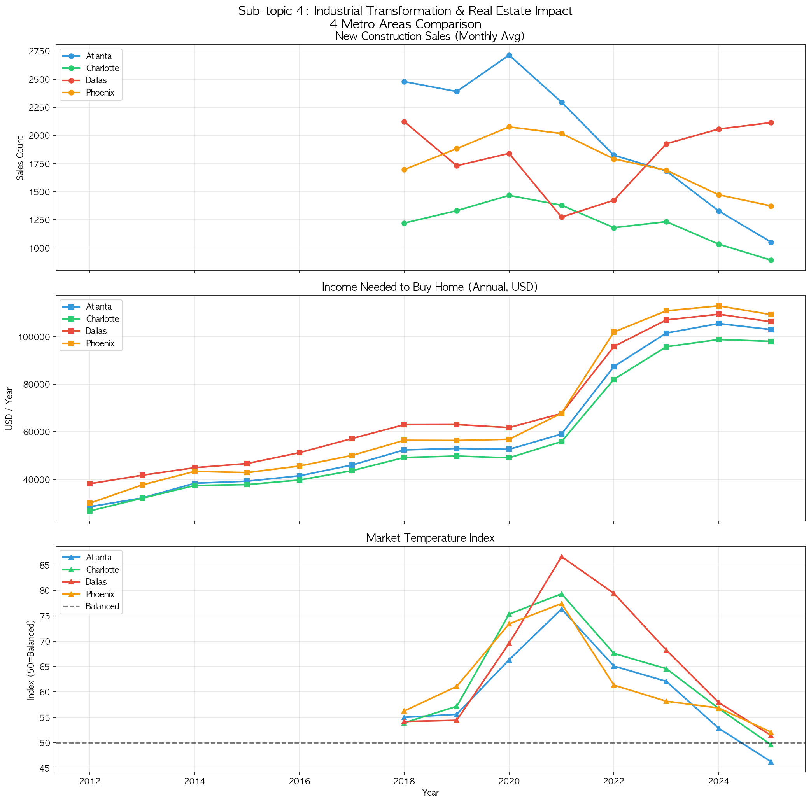
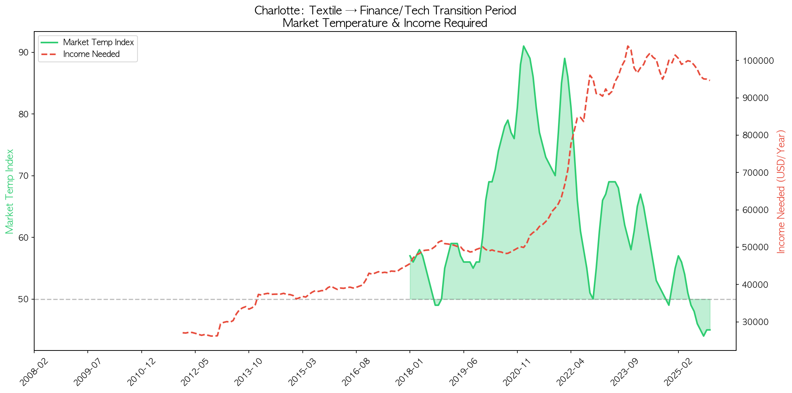
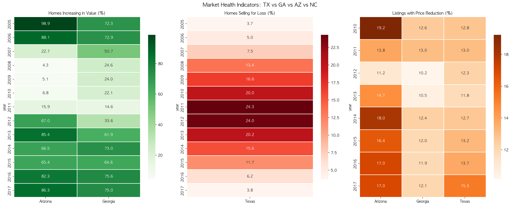
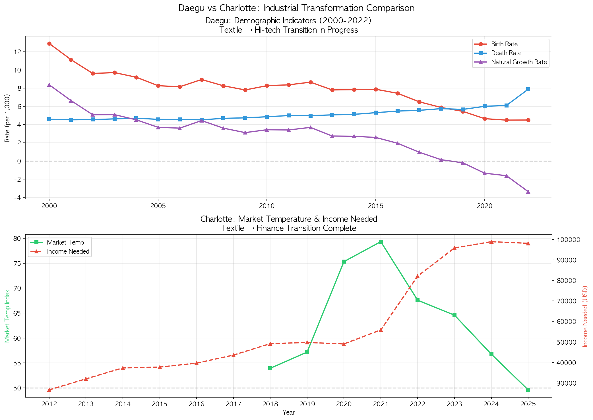
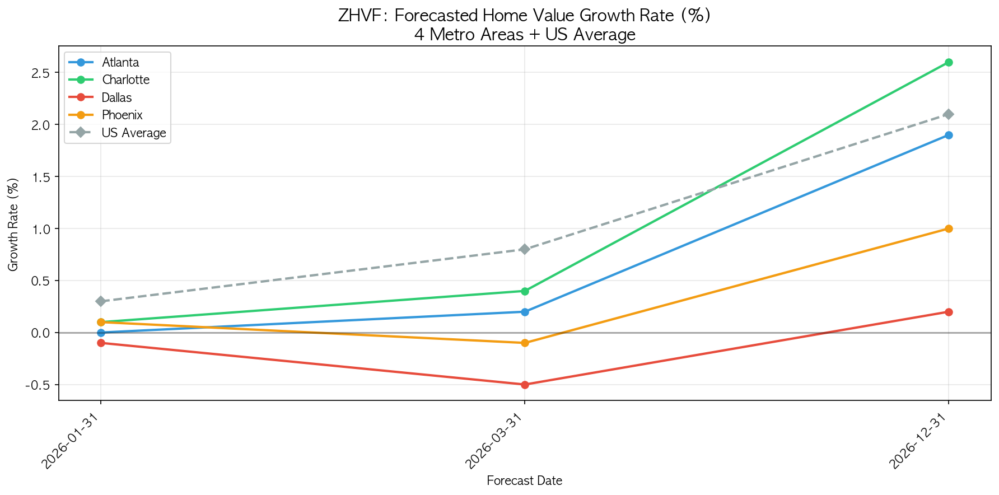

# Subtopic 4: 산업 전환과 부동산 시장 분석 보고서

## 개요

본 보고서는 미국 주요 메트로(Dallas, Atlanta, Phoenix, Charlotte)와 한국 대구의 **산업 구조 전환**이 부동산 시장에 미친 영향을 다각도로 분석한다. BLS 고용 데이터, Zillow 주택시장 지표, 세계 경제 산업비중, 한국 인구동태 데이터를 교차하여 **탈제조업화 → 서비스업 전환 → 주택 수요 변화**의 연결고리를 규명한다.

---

## 1. 분석 데이터 개요

| 데이터 소스          | 기간      | 주요 지표                                     |
| -------------------- | --------- | --------------------------------------------- |
| BLS 고용 (ce.data)   | 2000~2017 | 4개 산업 섹터별 월평균 고용자 수 (천명)       |
| Zillow Demand        | 2008~2025 | 시장온도지수, 필요소득, 신규건설판매, 거래량  |
| Zillow Market Health | 2000~2017 | 가격상승 비율, 손실 비율, 가격하락 비율, ZHVI |
| Global Economy       | 2000~2021 | 한미 GDP 대비 제조업/서비스업/건설업 비중     |
| 한국 인구동태        | 2000~2022 | 대구 출생/사망/혼인율, 자연증가율             |
| Zillow ZHVF Forecast | 2025~2026 | 4개 메트로 + 전국 주택가격 예측 성장률        |

---

## 2. 시각화 분석

### 2-1. 4개 메트로 산업-부동산 타임라인 (V1)



**차트 구성**: 3-패널 시계열 (신규건설 판매 / 필요소득 / 시장온도지수), x축 공유 (2012~2025)

- 상단 패널(New Construction Sales): 2018~2025 데이터
- 중간 패널(Income Needed): 2012~2025 데이터 — 가장 긴 시계열로 전체 추세 확인 가능
- 하단 패널(Market Temperature): 2018~2025 데이터

**핵심 발견**:

| 메트로        | 신규건설 피크  | 2025 신규건설 | 변화율 |
| ------------- | -------------- | ------------- | ------ |
| Atlanta, GA   | 32,578 (2020)  | 11,571        | -64.5% |
| Charlotte, NC | 17,607 (2020)  | 9,806         | -44.3% |
| Phoenix, AZ   | 24,916 (2020)  | 15,111        | -39.4% |
| Dallas, TX    | 25,471 (2018)  | 23,256        | -8.7%  |
| US 전체       | 748,349 (2020) | 511,218       | -31.7% |

- **신규건설(New Construction Sales)**: 4개 메트로 모두 2020년 전후 피크 후 하락세. Atlanta가 -64.5%로 가장 급격한 감소, Dallas는 -8.7%로 비교적 안정적
- **필요소득(Income Needed)**: 2012~2017년에는 4개 메트로 모두 $30K~$45K 수준으로 완만하게 상승하다가, 2022년 이후 급등. Charlotte $26,689(2012) → $98,849(2024)로 **3.7배 상승**, Dallas는 $38K → $107K로 최고 수준 도달
- **시장온도(Market Temp)**: 2021년 과열(Dallas 86, Charlotte 79) → 2025년 냉각(Charlotte 49.6, Atlanta 47). 50 이하는 구매자 우위 시장을 의미

**해석**: 2012~2017년 필요소득 패널에서 4개 메트로의 완만한 우상향이 2022년 이후 가파르게 발산하는 패턴이 보인다. 2020년 팬데믹 기간 저금리 → 주택시장 과열 → 2022년 금리 인상으로 전면 냉각. Dallas만 신규건설이 반등하여 산업 다변화(에너지+IT)의 효과를 보여준다.

---

### 2-2. Charlotte 주택시장 대시보드 (V2)



**차트 구성**: 듀얼 Y축 (시장온도 영역 차트 + 필요소득 라인), 전체 기간 2008-02~2025-12

- 좌축(초록 영역): Market Temp Index — 2018-01부터 데이터 존재
- 우축(빨간 점선): Income Needed — 2012-01부터 데이터 존재
- x축: 월별 시계열(year-month), 두 지표가 동일 시간축에 정렬되어 정확한 시점 비교 가능

**Charlotte 전환기 주요 지표**:

| 연도 | 시장온도 | 필요소득($) | 신규건설 | 거래량 |
| ---- | -------- | ----------- | -------- | ------ |
| 2018 | 53.9     | 49,192      | 14,655   | 48,232 |
| 2019 | 57.2     | 49,785      | 15,976   | 50,402 |
| 2020 | 75.3     | 49,052      | 17,607   | 51,597 |
| 2021 | 79.3     | 55,887      | 16,556   | 66,480 |
| 2022 | 67.6     | 82,084      | 14,161   | 54,175 |
| 2023 | 64.6     | 95,807      | 14,803   | 36,818 |
| 2024 | 56.8     | 98,849      | 12,404   | 36,027 |
| 2025 | 49.6     | 98,063      | 9,806    | 35,414 |

**핵심 발견**:

- **2012~2017년 완만기**: 필요소득 $27K→$45K로 서서히 상승, 시장온도 데이터 없음(이전 시기)
- **2018~2019년 진입기**: 시장온도 54~59, 필요소득 $49K 수준 — 균형 잡힌 시장
- **2020~2021년 과열기**: 시장온도 75→91(월별 피크), 필요소득은 $49~56K로 아직 완만 — 가격 급등이 소득 지표에 반영되기 시작
- **2022년 전환점**: 금리 인상으로 시장온도 급락(89→50), 필요소득은 $63K→$96K로 폭등(+47%) — 두 지표의 극적 교차
- **2023~2025년 냉각기**: 시장온도 44~67로 등락, 필요소득 $95K~$101K에서 고착 — 높은 주거비 부담이 지속
- Charlotte의 금융(Bank of America HQ) + IT 산업 기반에도 불구, 고금리 환경이 주택시장을 억제

---

### 2-3. 4개 주 부동산 시장 건강도 히트맵 (V3)



**차트 구성**: 3-패널 히트맵 (가격상승 비율 / 손실 비율 / 가격하락 비율)

**Panel 1 — 가격상승 비율(% Increasing)**:

| 주(State) | 2005 피크 | 2008 저점 | 2013 회복 | 2017  |
| --------- | --------- | --------- | --------- | ----- |
| Arizona   | **98.9%** | 4.3%      | 85.4%     | 86.3% |
| Georgia   | 72.3%     | 24.6%     | 61.9%     | 75.0% |
| Texas     | -         | -         | -         | -     |

- Arizona는 2005년 주택 버블기에 거의 모든 지역(98.9%)에서 가격 상승 → 2008년 금융위기로 4.3%까지 폭락 → 극단적 변동성
- Georgia는 비교적 완만한 등락 (72% → 24% → 75%)

**Panel 2 — 손실 비율(% Loss, Texas)**:

| 연도 | Texas 손실률 |
| ---- | ------------ |
| 2000 | -            |
| 2008 | 13.4%        |
| 2011 | **24.3%**    |
| 2017 | 3.8%         |

- Texas는 금융위기 직후보다 2011년에 최고 손실률 도달 (지연 효과)
- 에너지 산업 의존도가 부동산 경기 지연의 원인

**Panel 3 — 가격하락 비율(% Reduction)**:

- 2010년 전후 Arizona(19.2%), Georgia(12.6%), Texas(12.8%) 모두 높은 가격하락 비율
- 2017년까지 Arizona(17.0%)만 여전히 높은 수준 → 투기적 시장 특성 반영

---

### 2-4. 대구 vs Charlotte 비교 (V4)



**차트 구성**: 2-패널 비교 (대구 인구동태 / Charlotte 시장온도)

**대구 인구동태 변화 (2000~2022)**:

| 지표           | 2000     | 2010     | 2019 (전환점) | 2022     |
| -------------- | -------- | -------- | ------------- | -------- |
| 출생률 (‰)     | 12.9     | 8.3      | 5.4           | 4.5      |
| 사망률 (‰)     | 4.6      | 4.8      | 5.7           | 7.9      |
| 자연증가율 (‰) | **+8.4** | **+3.4** | **-0.2**      | **-3.4** |
| 혼인율 (‰)     | 6.4      | 5.4      | 4.1           | 3.1      |

**핵심 발견**:

- **2019년**: 대구 자연증가율이 최초로 마이너스(-0.2‰) 전환 → 인구 자연 감소 시작
- **2022년**: 자연증가율 -3.4‰로 급락, 사망률(7.9‰)이 출생률(4.5‰)의 거의 2배
- **혼인율**: 6.4‰(2000) → 3.1‰(2022)로 51% 감소 → 향후 출생률 추가 하락 예고
- 대구의 섬유·기계 제조업 기반 약화 + 젊은 인구 유출이 인구동태 악화의 근본 원인

**Charlotte와의 대비**:

- Charlotte: 시장온도 2021년 79.3 → 2025년 49.6 (금리에 의한 순환적 냉각)
- 대구: 출생률 22년간 지속 하락 (구조적·비가역적 변화)
- Charlotte은 금리 정상화 시 회복 가능하나, 대구는 인구 구조적 한계로 회복 어려움

---

### 2-5. ZHVF 주택가격 예측 성장률 (V5)



**차트 구성**: 바 차트 (4개 메트로 + 전국 평균, 2026년 12월 기준)

**Zillow Home Value Forecast (2026-12 기준)**:

| 지역          | 예측 성장률 |
| ------------- | ----------- |
| Charlotte, NC | **+2.6%**   |
| United States | +2.1%       |
| Atlanta, GA   | +1.9%       |
| Phoenix, AZ   | +1.0%       |
| Dallas, TX    | +0.2%       |

**핵심 발견**:

- **Charlotte**: 전국 평균 대비 높은 성장률(+2.6%) — 금융·IT 산업 기반의 구조적 수요 지속
- **Atlanta**: 전국 평균에 근접(+1.9%) — 물류·서비스 허브로서 안정적 성장
- **Phoenix**: 과열 후 조정기(+1.0%) — 2005년 버블의 학습효과로 보수적 회복
- **Dallas**: 가장 낮은 성장률(+0.2%) — 과잉공급 리스크, 신규건설이 유일하게 반등(23,256건) 중

---

## 3. 산업 구조 변화 분석

### 3-1. 미국 산업별 고용 추이 (BLS 2000~2017)

| 산업                    | 2000 평균(천명) | 2009 저점(천명) | 2017(천명) | 변화율(00→17) |
| ----------------------- | --------------- | --------------- | ---------- | ------------- |
| Manufacturing           | 17,265          | 11,848          | 12,383     | **-28.3%**    |
| Professional & Business | 16,672          | 16,574          | 20,561     | **+23.3%**    |
| Financial Activities    | 7,784           | 7,838           | 8,408      | **+8.0%**     |
| Information             | 3,630           | 2,804           | 2,738      | **-24.6%**    |

- **제조업(Manufacturing)**: 17년간 약 490만 명 감소. 2009년 금융위기로 급락 후 부분 회복에 그침
- **전문·비즈니스 서비스**: 유일하게 꾸준한 성장. 2017년 처음으로 제조업 대비 1.66배 규모 도달
- **금융**: 완만한 성장. Charlotte(Bank of America), Atlanta(SunTrust) 등 금융허브 도시의 성장 동력
- **정보산업**: 2000년 닷컴버블 이후 지속 감소 → 고용 절대수 감소에도 생산성(GDP 기여)은 증가

### 3-2. 한미 산업 비중 비교 (GDP 대비, 2000~2021)

| 산업 비중 | 한국 2000 | 한국 2021 | 미국 2000 | 미국 2021 |
| --------- | --------- | --------- | --------- | --------- |
| 제조업    | 29.2%     | 27.9%     | 15.1%     | 10.7%     |
| 서비스업  | 35.6%     | 44.2%     | 51.2%     | 55.4%     |
| 건설업    | 6.1%      | 5.7%      | 4.5%      | 4.1%      |

| GDP 성장률  | 한국   | 미국   |
| ----------- | ------ | ------ |
| 2000        | +15.7% | +7.0%  |
| 2009 (위기) | -10.1% | -2.0%  |
| 2021        | +10.4% | +10.4% |

- **한국**: 제조업 비중 27~31%로 여전히 높음 → 글로벌 공급망 충격에 취약
- **미국**: 서비스업 55%+, 제조업 11% 이하 → 탈제조업화 완성 단계
- **건설업**: 양국 모두 4~6% 수준으로 안정적 → 부동산 경기와 밀접
- **GDP 변동성**: 한국(-10.1% vs +15.7%)이 미국(-2.0% vs +10.4%)보다 훨씬 큰 변동 → 제조업 의존도가 경기 변동성 증폭

---

## 4. 종합 분석: 산업 전환과 부동산의 연결고리

### 4-1. 미국 Sunbelt 도시의 산업-부동산 순환

```
[제조업 쇠퇴] → [서비스·IT·금융 성장] → [고소득 일자리 유입]
       ↓                                        ↓
[중산층 주거수요 감소]                    [고소득 주거수요 증가]
       ↓                                        ↓
[구도심 가격 정체]                        [신규건설 붐 + 가격 상승]
                         ↓
              [2022 금리 인상 → 전면 냉각]
```

- **Charlotte**: 금융 산업 중심지로 전환 성공 → ZHVF 성장률 전국 최고(+2.6%)
- **Dallas**: 에너지+제조+IT 다변화 → 과잉 공급으로 성장률 최저(+0.2%)
- **Phoenix**: 투기적 변동성이 큰 시장 → 2008년 학습효과로 보수적 회복(+1.0%)
- **Atlanta**: 물류·항공·서비스 허브 → 안정적 중간 성장(+1.9%)

### 4-2. 대구의 구조적 위기

```
[섬유·기계 제조업 쇠퇴] → [양질 일자리 감소] → [청년 인구 유출]
                                                      ↓
[주택 수요 장기 감소] ← [혼인율 하락] ← [출생률 급락 + 자연감소]
```

- 대구는 Charlotte과 달리 **대체 산업 유치 실패** → 인구 구조적 악순환
- 자연증가율이 2019년 마이너스 전환 → 부동산 수요의 구조적 감소 시작
- 혼인율 51% 감소(2000→2022)는 향후 10~20년간 추가적인 인구 감소를 예고

### 4-3. 정책적 시사점

1. **산업 다변화가 부동산 회복력의 핵심**: Charlotte(금융), Atlanta(물류) 등 서비스 산업 전환에 성공한 도시가 위기 후 빠른 회복력을 보임
2. **과잉 공급 경계**: Dallas의 사례처럼 산업 성장이 있더라도 신규건설 과잉은 가격 성장을 억제
3. **인구 구조가 장기 결정 요인**: 대구의 사례는 산업 전환 실패가 인구 감소 → 부동산 수요 위축의 비가역적 경로를 만든다는 것을 보여줌
4. **금리 영향의 비대칭성**: 고금리는 모든 시장을 냉각시키지만, 산업 기반이 강한 도시(Charlotte)는 회복 전망이 밝고, 구조적 약점이 있는 도시(Dallas 과잉공급, 대구 인구감소)는 회복이 더딤

---

## 5. 출력 파일 목록

### CSV 파일 (7개)

| 파일명                               | 설명                          | 행 수 |
| ------------------------------------ | ----------------------------- | ----- |
| S4_Q1_EMPLOYMENT_BY_SECTOR.csv       | BLS 4개 산업 연도별 고용자 수 | 72    |
| S4_Q1_EMPLOYMENT_VS_CONSTRUCTION.csv | 메트로별 신규건설 연도별 합계 | 40    |
| S4_Q2_CHARLOTTE_TRANSITION.csv       | Charlotte 월별 전환기 지표    | 215   |
| S4_Q3_MARKET_HEALTH.csv              | 3개 주 시장 건강도 지표       | 54    |
| S4_Q4_DAEGU_DEMOGRAPHICS.csv         | 대구 인구동태 연도별 합계     | 23    |
| S4_Q4_CHARLOTTE_DEMAND.csv           | Charlotte 연도별 수요 지표    | 18    |
| S4_Q4_MACRO_COMPARISON.csv           | 한미 산업비중 비교            | 44    |

### 시각화 파일 (5개)

| 파일명                          | 설명                                   |
| ------------------------------- | -------------------------------------- |
| S4_V1_industry_timeline.png     | 4개 메트로 3-패널 산업-부동산 타임라인 |
| S4_V2_charlotte_dashboard.png   | Charlotte 듀얼Y축 대시보드             |
| S4_V3_market_health_heatmap.png | 4개 주 시장 건강도 히트맵              |
| S4_V4_daegu_vs_charlotte.png    | 대구 vs Charlotte 비교 차트            |
| S4_V5_forecast_growth.png       | ZHVF 주택가격 예측 성장률              |

---

_본 보고서는 subtopic4 파이프라인(`s4_run_all.py`)의 출력 결과를 기반으로 작성되었습니다._
_데이터 기준: BLS(2000~2017), Zillow(2008~2026F), Global Economy(2000~2021), 한국 인구동태(2000~2022)_
