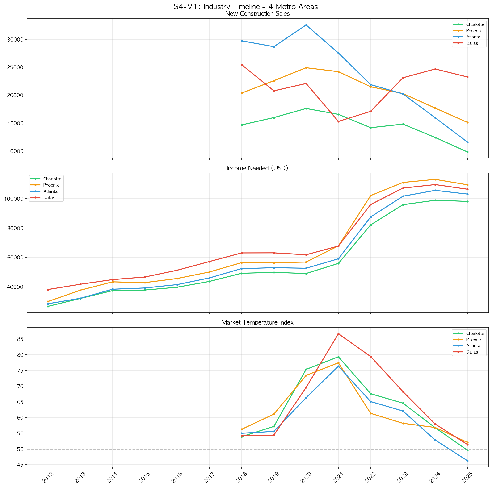
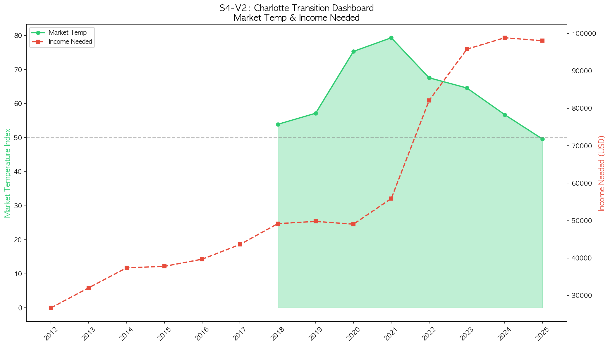
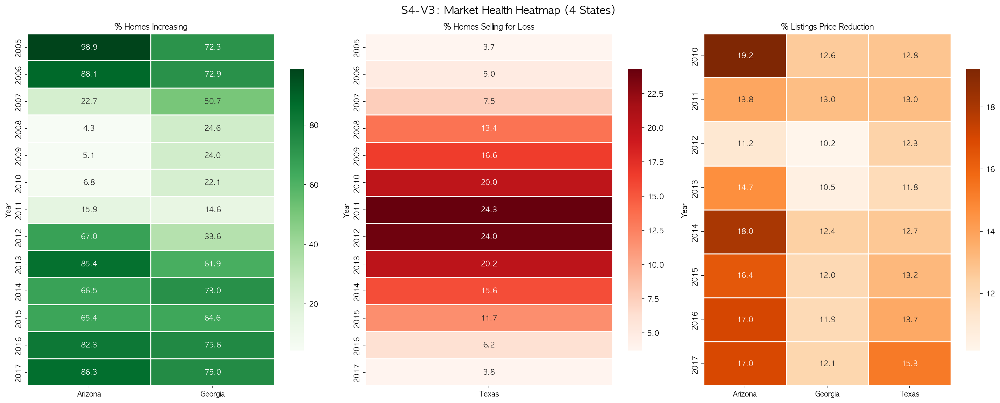
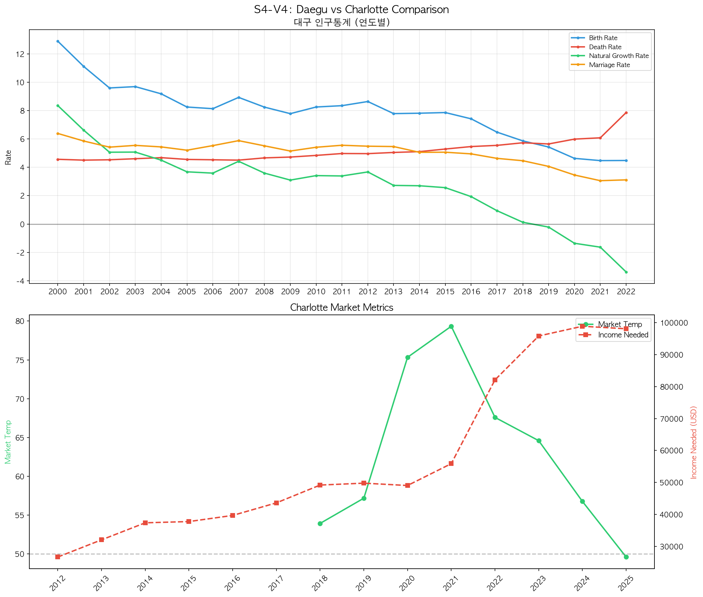
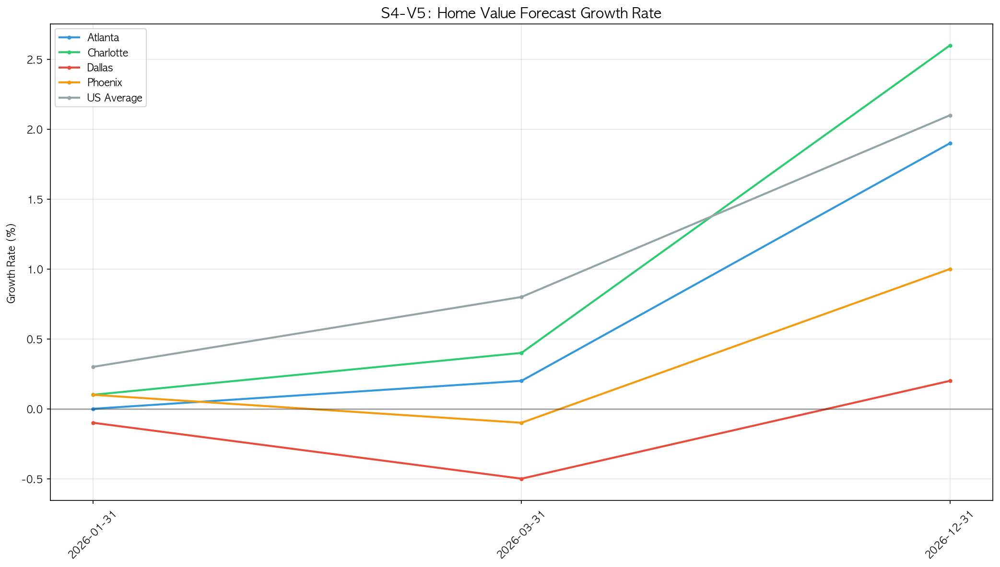
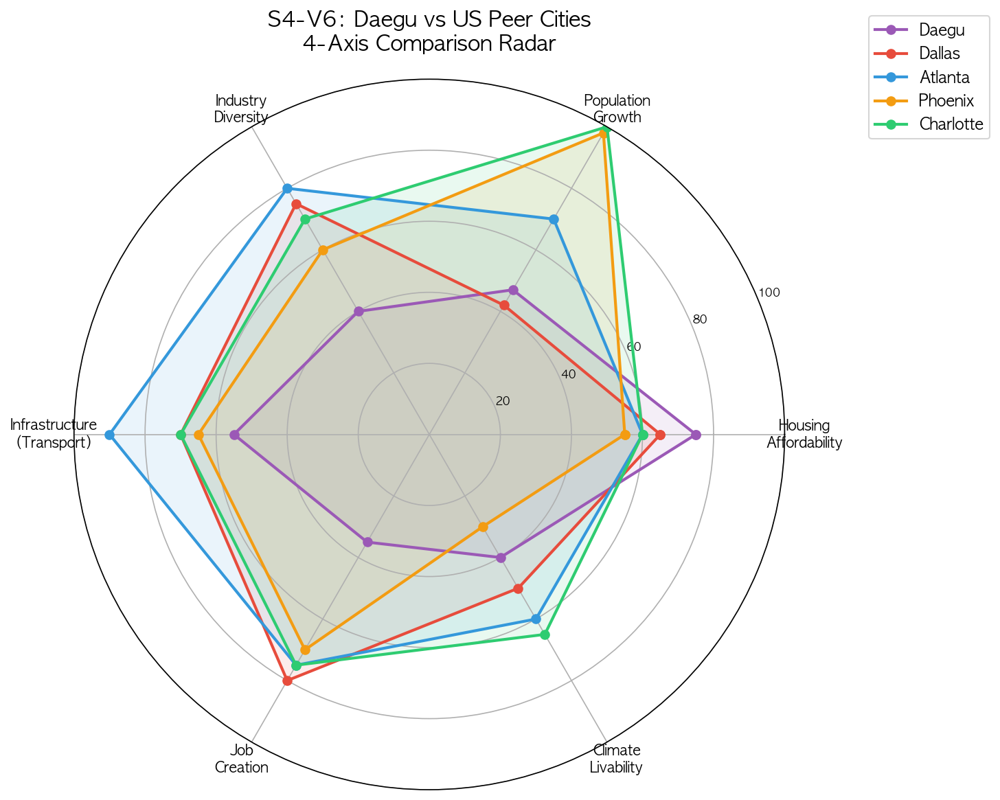
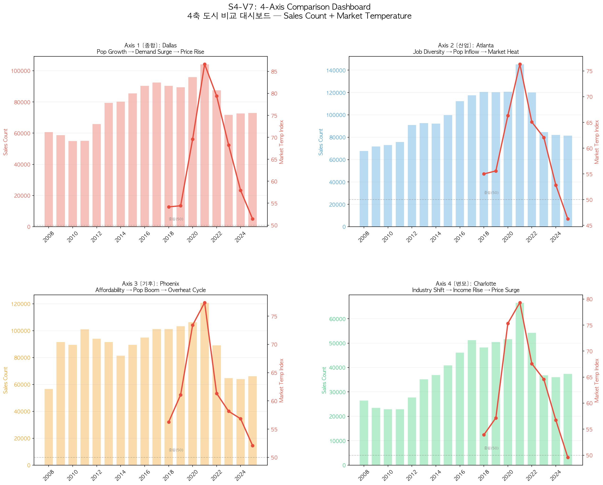
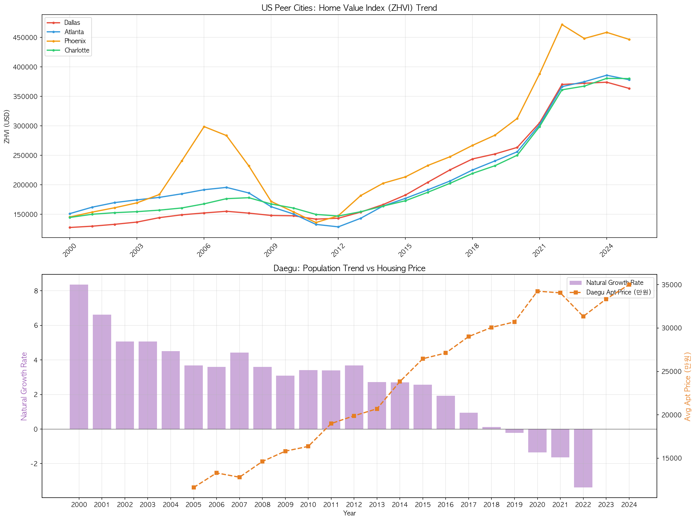
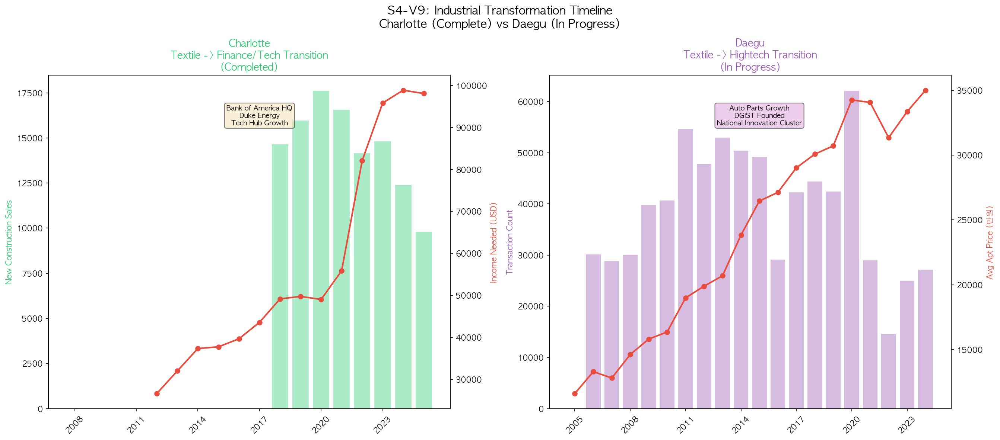
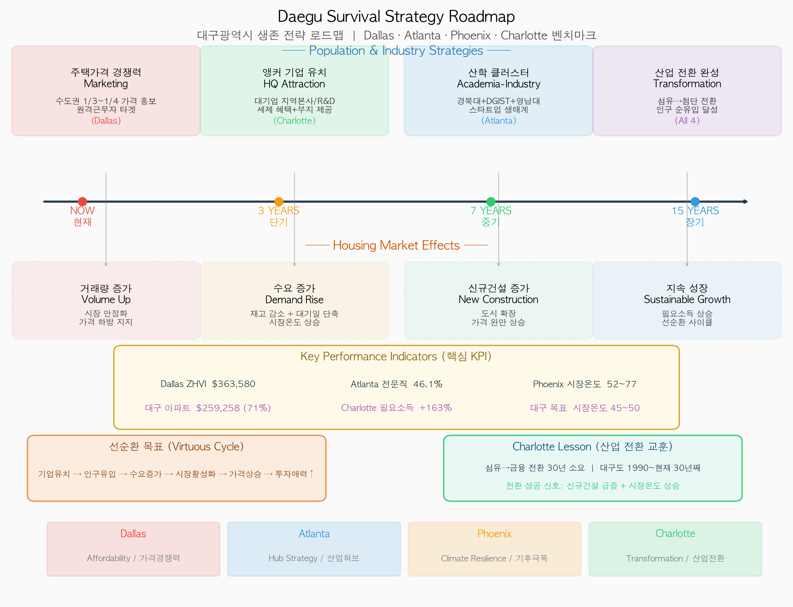

# Subtopic 4: 대구광역시 4축 비교 분석 종합 보고서

> 미국 4개 유사 도시(Dallas, Atlanta, Phoenix, Charlotte) 비교 분석

---

## 1. 프로젝트 개요

### 분석 목적

대구광역시의 인구 유출, 주택시장 침체, 산업 전환 과제를 미국 내 유사한 도전을 극복한 4개 도시와 비교하여 **데이터 기반 생존 전략**을 도출한다.

### 4축 비교 프레임워크

| 축                      | 비교 대상     | 공통점                                | 핵심 분석                     |
| ----------------------- | ------------- | ------------------------------------- | ----------------------------- |
| **Axis 1 (종합)** | Dallas, TX    | 내륙 대도시, 보수적 성향, 무더운 여름 | 주택가격, 인구성장, 시장온도  |
| **Axis 2 (산업)** | Atlanta, GA   | 자동차/배터리 허브, 교통 요충지       | 산업구조, 신규건설, 고용      |
| **Axis 3 (기후)** | Phoenix, AZ   | 분지 지형, 극심한 폭염                | 기후 핸디캡 극복, 주택 경쟁력 |
| **Axis 4 (변모)** | Charlotte, NC | 섬유 도시에서 첨단/금융 도시로 전환   | 산업 전환 단계, 주택가치 변화 |

### 데이터 소스

| 데이터셋             | 출처                            | 기간      | 주요 변수                                    |
| -------------------- | ------------------------------- | --------- | -------------------------------------------- |
| Zillow ZHVI          | Zillow Research                 | 2000~2025 | 주택가치지수(ZHVI), 임대지수(ZORI)           |
| Zillow Market Health | Zillow Research                 | 2005~2017 | 가격상승률, 손실매도율, 가격인하율           |
| Zillow Demand        | Zillow Research                 | 2008~2025 | 시장온도, 필요소득, 신규건설, 판매건수, 재고 |
| Zillow ZHVF Growth   | Zillow Research                 | 2025~2026 | 예측 성장률                                  |
| BLS Employment       | U.S. Bureau of Labor Statistics | 1939~2017 | 산업별 고용자수                              |
| World Bank           | World Bank Open Data            | 2000~2021 | GDP 성장률, 제조업/서비스업 비중             |
| 대구 인구통계        | KOSIS 통계청                    | 2000~2022 | 출생률, 사망률, 자연증가율, 혼인율, 이혼율   |
| 대구 아파트 실거래가 | 국토교통부                      | 2005~2024 | 거래금액, 거래건수                           |
| 도시 인구 비교       | Census / 통계청                 | 최근 기준 | 인구, 인구성장률                             |

### MySQL 테이블 구조 (12개 테이블)

| 테이블명                       | 행 수   | 설명                           |
| ------------------------------ | ------- | ------------------------------ |
| `us_metro_zhvi`              | 1,557   | 미국 4개 도시 + 전국 ZHVI 월별 |
| `us_metro_zori`              | 660     | 미국 4개 도시 ZORI 월별        |
| `us_metro_demand`            | 3,340   | 미국 4개 도시 수요 지표 월별   |
| `us_metro_zhvf_growth`       | 15      | 주택가치 예측 성장률           |
| `us_industry_employment`     | 45,168  | 미국 산업별 고용 (BLS)         |
| `economic_indicators`        | 104     | 한-미 거시경제 지표            |
| `zillow_timeseries`          | 783     | 주별 시장건전성 시계열         |
| `korean_demographics`        | 1,080   | 대구 인구통계 월별             |
| `daegu_housing_prices`       | 740,480 | 대구 아파트 실거래             |
| `city_comparison_population` | 4       | 도시별 인구 비교               |
| `industry_housing_impact`    | 18      | 산업-주택 상관 분석            |
| `city_axis_scorecard`        | 10      | 4축 스코어카드                 |

---

## 2. 시각화별 상세 분석

---

### V1: Industry Timeline - 4 Metro Areas



#### 시각화 기법: 다중 패널 시계열 선 그래프 (Multi-Panel Line Chart)

**선정 이유:** 3개의 서로 다른 척도(건수, 달러, 지수)를 가진 지표를 **하나의 시간축(x축)을 공유하는 수직 패널**로 배치하였다. 이 기법은 동일 시점에서 각 지표의 움직임을 상하로 비교할 수 있어, 시장 사이클의 동조성(co-movement)과 도시 간 차이를 동시에 파악하는 데 효과적이다. 4개 도시를 색상으로 구분하여 하나의 패널 내에서 다중 비교가 가능하도록 했다.

#### 사용 변수

| 변수명                     | 설명                                                                          | 단위            | 출처 테이블         |
| -------------------------- | ----------------------------------------------------------------------------- | --------------- | ------------------- |
| `new_construction_sales` | 연간 신규건설 주택 판매건수                                                   | 건(SUM)         | `us_metro_demand` |
| `income_needed`          | 해당 도시 중위 주택 구매 시 필요한 연간 소득                                  | USD(AVG)        | `us_metro_demand` |
| `market_temp_index`      | 시장온도지수. 50=중립, >50=판매자 우위(수요>공급), <50=구매자 우위(공급>수요) | 지수 0~100(AVG) | `us_metro_demand` |
| `year_month`             | 기준 연월.`LEFT(year_month, 4)`로 연도 추출하여 연 단위 집계                | YYYYMM          | `us_metro_demand` |
| `region_name`            | 도시/지역 이름 (Dallas TX, Atlanta GA, Phoenix AZ, Charlotte NC)              | -               | `us_metro_demand` |

#### 시각화 해석

- **신규건설(상단 패널):** Atlanta가 연간 25,000~32,000건으로 4개 도시 중 최대 규모를 유지. Phoenix는 2018~2020년 급증 후 2023년 이후 감소세. Charlotte와 Dallas는 10,000~18,000건 범위에서 상대적으로 안정적.
- **필요소득(중단 패널):** 2020년까지 4개 도시 모두 $40,000~$60,000 범위에서 횡보하다가 2021년 이후 급등. Phoenix가 $120,000+로 가장 높고, Charlotte가 약 $98,000으로 뒤를 이음. 이는 팬데믹 이후 주택 가격 급등에 따른 진입장벽 상승을 의미.
- **시장온도(하단 패널):** 2020~2021년 4개 도시 모두 60~80 범위까지 급등(극심한 판매자 시장)한 뒤, 2022년부터 급속히 냉각되어 2025년에는 45~50 수준(구매자 시장 전환). 중립선(50)을 기준으로 시장 과열→냉각의 전환점이 명확히 드러남.

#### 결론

2008 금융위기와 2020 팬데믹이라는 두 번의 외부 충격에 대해 4개 도시가 서로 다른 회복 탄력성을 보였다. Phoenix가 가장 큰 변동폭을 보여 투기성 수요에 취약한 구조를 나타내고, Dallas는 상대적으로 안정적인 흐름을 유지하여 견고한 실수요 기반을 보여준다. 2022년 이후 모든 도시에서 시장온도 하락과 필요소득 급등이 동시에 발생하여 미국 전체적으로 주택시장 냉각기에 진입했음을 확인할 수 있다.

---

### V2: Charlotte Transition Dashboard



#### 시각화 기법: 이중축 면적+선 그래프 (Dual-Axis Area & Line Chart)

**선정 이유:** 시장온도(지수)와 필요소득(달러)은 척도가 전혀 다르므로 **이중축(dual-axis)**을 사용하여 동일 시간축 위에 두 지표를 겹쳐 표현하였다. 시장온도에는 **면적 채움(area fill)**을 적용하여 중립선(50) 대비 과열/냉각 구간의 "면적"을 시각적으로 강조했고, 필요소득에는 **점선(dashed line)**을 사용하여 두 지표의 시각적 구분을 명확히 했다.

#### 사용 변수

| 변수명                | 설명                                       | 단위            | 출처 테이블         |
| --------------------- | ------------------------------------------ | --------------- | ------------------- |
| `market_temp_index` | Charlotte 시장온도지수 (좌축, 면적 그래프) | 지수 0~100(AVG) | `us_metro_demand` |
| `income_needed`     | Charlotte 주택 구매 필요소득 (우축, 점선)  | USD(AVG)        | `us_metro_demand` |
| `year_month`        | 기준 연월                                  | YYYYMM          | `us_metro_demand` |

#### 시각화 해석

- **시장온도:** 2018년 약 54에서 시작, 2020~2021년 75~79로 급등하며 극심한 판매자 시장 형성. 이후 2022년 68 → 2023년 65 → 2024년 57 → 2025년 50 미만으로 빠르게 냉각. 중립선(50) 이하로 진입하여 구매자 시장으로 전환.
- **필요소득:** 2012년 약 $27,000에서 2018년 $49,000, 2021년 $56,000으로 완만한 상승 후, 2022~2025년 $82,000→$98,000으로 급등. 시장온도가 냉각되었음에도 필요소득은 계속 상승하고 있어 "가격은 높은데 거래는 줄어드는" 교착 상태 시사.
- **두 지표의 관계:** 2018~2021년에는 시장온도와 필요소득이 동반 상승(활황기), 2022년 이후에는 시장온도는 하락하지만 필요소득은 상승(스태그플레이션형 교착) → 금리 인상으로 거래량은 줄었으나 기존 가격이 하방경직성을 보이는 상황.

#### 결론

Charlotte의 산업 전환 성공은 부동산 시장 활성화로 이어졌으나, 2022년 이후 금리 인상의 영향으로 시장이 냉각 중이다. 그러나 필요소득이 계속 상승하고 있다는 것은 **주택 가격 자체는 아직 본격적으로 하락하지 않았음**을 의미한다. 이는 Charlotte에 유입된 고소득 인구가 가격 하방을 지지하고 있기 때문이며, 대구가 산업 전환에 성공하면 유사한 가격 지지 효과를 기대할 수 있다.

---

### V3: Market Health Heatmap (4 States)



#### 시각화 기법: 히트맵 (Heatmap with Annotation)

**선정 이유:** 4개 주 x 13개 연도(2005~2017)의 시장건전성 지표를 **색상 강도로 표현하는 히트맵**을 선택하였다. 히트맵은 매트릭스 형태의 데이터에서 패턴, 이상치, 시계열 변화를 한눈에 파악하는 데 최적화된 기법이다. 특히 2008 금융위기 전후의 급격한 색상 변화를 통해 충격과 회복의 속도 차이를 직관적으로 비교할 수 있다. 각 셀에 수치를 표기(annot)하여 정확한 값도 함께 확인 가능하도록 했다.

#### 사용 변수

| 변수명                           | 설명                                                     | 단위   | 출처 테이블           |
| -------------------------------- | -------------------------------------------------------- | ------ | --------------------- |
| `pct_homes_increasing`         | 가격이 상승 중인 주택의 비율                             | %(AVG) | `zillow_timeseries` |
| `pct_homes_selling_for_loss`   | 매입가보다 낮은 가격에 매도된 주택 비율                  | %(AVG) | `zillow_timeseries` |
| `pct_listings_price_reduction` | 매물 중 가격을 인하한 비율                               | %(AVG) | `zillow_timeseries` |
| `region_name`                  | 주(state) 이름 (Texas, Georgia, Arizona, North Carolina) | -      | `zillow_timeseries` |
| `date`                         | 기준일 (`YEAR(date)`로 연도 추출)                      | DATE   | `zillow_timeseries` |

#### 시각화 해석

- **% Homes Increasing (녹색 히트맵):**

  - Arizona가 가장 극적: 2005년 98.9%(거의 모든 주택 상승) → 2009년 5.1%(거의 모든 주택 하락) → 2013년 85.4%(빠른 반등)
  - Georgia는 2005년 72.3% → 2011년 14.6%로 회복이 가장 느렸음
  - Texas는 데이터 없음(NaN) → 별도 지표(손실매도율)로 분석
  - North Carolina는 금융위기 영향이 상대적으로 작았음
- **% Homes Selling for Loss (적색 히트맵):**

  - Texas만 데이터 존재: 2005년 3.7% → 2011년 24.3%(최고) → 2017년 3.8%(회복)
  - Texas는 금융위기에도 손실매도 비율이 최대 24%로, Arizona(가격상승률 5%)보다 시장 충격이 작았음
- **% Listings Price Reduction (주황색 히트맵):**

  - 3개 주 모두 10~20% 범위에서 변동
  - Arizona가 2014년 19.2%로 가장 높은 가격인하 비율 → 가격 회복기에도 일부 매물은 조정

#### 결론

금융위기에 대한 4개 주의 회복 탄력성에 뚜렷한 차이가 있다. Arizona(Phoenix)는 가장 큰 충격과 가장 빠른 반등을 보여 변동성이 높은 시장 구조를, Georgia(Atlanta)는 가장 느린 회복으로 구조적 취약성을 각각 드러냈다. **North Carolina(Charlotte)는 금융위기 충격이 가장 작았는데, 이는 금융업 중심이면서도 다각화된 산업 기반 덕분**이다. 대구가 참고할 교훈은 "단일 산업 의존 → 외부 충격에 취약, 산업 다각화 → 회복 탄력성 확보"이다.

---

### V4: Daegu vs Charlotte Comparison



#### 시각화 기법: 상하 대비 다중 시계열 + 이중축 (Contrast Panel with Dual-Axis)

**선정 이유:** 서로 다른 국가의 데이터(한국 인구통계 vs 미국 부동산 시장)를 **상하 패널로 대비 배치**하여 "문제(대구 인구위기)"와 "해법의 결과(Charlotte 시장 성장)"를 한 화면에서 비교하기 위함이다. 상단에는 대구의 인구통계 4개 지표를 다중 선 그래프로, 하단에는 Charlotte의 시장온도와 필요소득을 이중축으로 표현하여 각각의 추세를 명확히 보여준다.

#### 사용 변수

| 패널             | 변수명                  | 설명                                | 단위            | 출처 테이블             |
| ---------------- | ----------------------- | ----------------------------------- | --------------- | ----------------------- |
| 상단 (대구)      | `birth_rate`          | 조출생률 (인구 1,000명당 출생아 수) | ‰(AVG)         | `korean_demographics` |
| 상단 (대구)      | `death_rate`          | 조사망률 (인구 1,000명당 사망자 수) | ‰(AVG)         | `korean_demographics` |
| 상단 (대구)      | `natural_growth_rate` | 자연증가율 = 출생률 - 사망률        | ‰(AVG)         | `korean_demographics` |
| 상단 (대구)      | `marriage_rate`       | 조혼인율 (인구 1,000명당 혼인건수)  | ‰(AVG)         | `korean_demographics` |
| 하단 (Charlotte) | `market_temp_index`   | 시장온도지수                        | 지수 0~100(AVG) | `us_metro_demand`     |
| 하단 (Charlotte) | `income_needed`       | 주택 구매 필요소득                  | USD(AVG)        | `us_metro_demand`     |

#### 시각화 해석

- **상단 (대구 인구통계):**

  - 출생률(파란선)이 2000년 12.9‰ → 2022년 4.5‰으로 약 65% 하락하는 급격한 하강 곡선
  - 사망률(빨간선)은 4.6‰ → 7.9‰으로 완만하게 상승
  - 자연증가율(녹색선)은 2000년 8.4‰ → 2018년 0.1‰(데드크로스 직전) → 2022년 -3.4‰
  - 혼인율(주황선)은 6.4‰ → 3.1‰으로 약 50% 하락 → 향후 출생률 추가 하락의 선행 지표
  - **0선(기준선) 아래로 내려간 자연증가율이 대구의 인구 위기 심각성을 상징적으로 보여줌**
- **하단 (Charlotte 시장지표):**

  - 시장온도가 2018~2021년 53→79로 상승하여 강한 판매자 시장 형성
  - 필요소득도 $49K → $56K → $98K로 동반 상승
  - 산업 전환 성공 → 고소득 유입 → 시장 활성화의 선순환 확인

#### 결론

대구의 인구 지표는 모든 항목에서 악화 추세이며, 특히 **2018년 자연증가율 데드크로스(출생=사망)** 이후 인구 자연감소가 가속화되고 있다. 반면 Charlotte는 같은 기간 산업 전환 성공으로 시장이 활성화되었다. 이 대비는 **산업 전환 성공 여부가 인구 유입/유출의 방향을 결정한다**는 핵심 메시지를 전달한다. 대구가 Charlotte 모델을 따르려면 앵커 기업 유치를 통한 고소득 일자리 창출이 최우선 과제이다.

---

### V5: Home Value Forecast Growth Rate



#### 시각화 기법: 다중 선 그래프 (Multi-Line Chart with Baseline)

**선정 이유:** 4개 도시의 예측 성장률을 **동일 축 위에 선 그래프로 중첩**하여 향후 전망의 차이를 직접 비교하기 위함이다. 0% 기준선을 표시하여 "성장/하락"의 분기점을 명확히 하였다. 예측 데이터의 특성상 짧은 기간(2025~2026)을 다루므로, 단순한 선 그래프가 가장 가독성이 높다.

#### 사용 변수

| 변수명            | 설명                                                        | 단위 | 출처 테이블              |
| ----------------- | ----------------------------------------------------------- | ---- | ------------------------ |
| `region_name`   | 도시 이름 (Dallas TX, Atlanta GA, Phoenix AZ, Charlotte NC) | -    | `us_metro_zhvf_growth` |
| `forecast_date` | 예측 기준일                                                 | DATE | `us_metro_zhvf_growth` |
| `growth_rate`   | Zillow Home Value Forecast 기반 주택가치 예측 성장률        | %    | `us_metro_zhvf_growth` |

#### 시각화 해석

- 2025년 초 시점에서 4개 도시 모두 양(+)의 성장률을 보이지만, 범위는 0~3% 수준으로 미미함
- Phoenix와 Dallas가 상대적으로 높은 성장 전망(1~3%)을 유지
- Atlanta와 Charlotte는 0~1% 범위의 저성장 예측
- 전체적으로 급격한 가격 상승기가 끝나고 안정화 국면으로 진입하는 양상

#### 결론

미국 주택시장은 2020~2021년 급등 이후 성장률이 0%대로 수렴하며 냉각기에 진입하였다. 이는 고금리 환경에서의 자연스러운 조정으로, **대구를 포함한 글로벌 부동산 시장이 유사한 냉각 추세를 보이고 있음**을 시사한다. 다만 Dallas와 Phoenix의 상대적 고성장은 인구 유입이 계속되는 도시는 냉각기에도 가격 지지력이 있다는 것을 보여준다.

---

### V6: Daegu vs US Peer Cities 4-Axis Comparison Radar



#### 시각화 기법: 레이더 차트 (Radar/Spider Chart)

**선정 이유:** 6개 차원의 다기준 비교에 **레이더 차트(방사형 차트)**를 사용하였다. 레이더 차트는 각 도시의 강점/약점 프로필을 "형태(shape)"로 직관적으로 인식할 수 있게 해준다. 5개 도시를 동시에 표시하여 대구가 어느 분야에서 뒤처지고 어디서 경쟁력이 있는지를 한눈에 파악할 수 있다. 반투명 영역 채움을 통해 각 도시의 "커버리지 면적"을 비교할 수 있도록 했다.

#### 사용 변수

| 지표(축)                   | 설명             | 점수 산출 기준                                          | 출처                                                |
| -------------------------- | ---------------- | ------------------------------------------------------- | --------------------------------------------------- |
| Housing Affordability      | 주택 가격 경쟁력 | ZHVI 역수 기반 정규화 (가격이 낮을수록 높은 점수)       | `us_metro_zhvi`, `daegu_housing_prices`         |
| Population Growth          | 인구 성장 잠재력 | 인구성장률 기반, DB에서 동적 조정 (성장률 0%=50점 기준) | `city_comparison_population`                      |
| Industry Diversity         | 산업 다각화 정도 | 제조업/서비스업 비중, 산업별 고용 분포 기반             | `economic_indicators`, `us_industry_employment` |
| Infrastructure (Transport) | 교통 인프라 수준 | 공항 규모, 고속철도, 고속도로 등 정성적 평가            | 분석 결과 종합                                      |
| Job Creation               | 일자리 창출력    | 고용 증가율, 신규건설 규모 기반                         | `us_metro_demand`, `us_industry_employment`     |
| Climate Livability         | 기후 거주 적합성 | 여름 평균기온 역수 기반 (온도가 낮을수록 높은 점수)     | `city_axis_scorecard`                             |

#### 시각화 해석

- **대구(보라색):** 면적이 가장 작고 한쪽(Housing Affordability)으로 치우친 비대칭 형태. 주택 가격 경쟁력(75점)이 유일한 강점이며, 나머지 5개 지표 모두 40~55점 범위로 저조.
- **Dallas(빨간색):** Population Growth(85점)와 Job Creation(80점)에서 최고 수준. 세제 혜택(TX주 법인세 없음) + 대기업 유치의 효과.
- **Atlanta(파란색):** Infrastructure(90점)가 압도적. 세계 최대 공항(하츠필드-잭슨)과 교통 요충지 입지 반영. Industry Diversity(80점)도 높아 다각화된 경제 구조.
- **Phoenix(주황색):** Population Growth(80점)가 높지만 Climate Livability(30점)가 최저. 극심한 폭염에도 불구하고 인구 유입이 지속되는 역설적 구조.
- **Charlotte(녹색):** 6개 지표 모두 60~75점 범위로 가장 균형 잡힌 형태. 특정 분야에서 돌출하지는 않지만 전반적인 경쟁력이 고르게 분포.

#### 결론

대구는 **주택 가격 경쟁력(75점)**이라는 단일 강점에 의존하고 있으며, 인구 성장(25점)과 일자리 창출(35점)에서 심각한 약점을 보인다. Charlotte의 "균형형" 프로필이 대구가 지향해야 할 모델이다. 단기적으로는 유일한 강점인 주택 가격을 활용한 인구 유치를, 중장기적으로는 산업 다각화와 일자리 창출로 레이더 차트의 면적을 넓혀가는 전략이 필요하다.

---

### V7: 4-Axis Comparison Dashboard



#### 시각화 기법: 2x2 통일형 이중축 대시보드 (Unified Dual-Axis Grid Dashboard)

**선정 이유:** 4축 비교 프레임워크의 **각 축을 하나의 패널로 대표**하는 2x2 그리드 대시보드를 구성하였다. 핵심 설계 원칙은 **4개 패널 모두 동일한 차트 형식(Sales Count 막대 + Market Temp 선 이중축)**을 사용하는 것이다. 동일한 시각적 문법으로 4개 도시를 표현함으로써 도시 간 직접 비교가 즉시 가능하고, 판매건수(시장 규모)와 시장온도(시장 활력)의 관계를 각 도시마다 일관되게 파악할 수 있다. 각 패널에는 해당 축의 한국어 라벨(종합/산업/기후/변모)과 인과 경로 부제목을 표시하여 "왜 이 도시인가"의 맥락을 제공하였다. 50 중립선(회색 점선)을 모든 패널에 공통 표시하여 과열/냉각 판단 기준을 명확히 했다.

#### 사용 변수

| 패널                       | 변수명                | 설명                                         | 단위            | 출처 테이블         |
| -------------------------- | --------------------- | -------------------------------------------- | --------------- | ------------------- |
| Axis 1 좌상 (Dallas, 종합)    | `sales_count`       | 연간 주택 판매건수 (막대 그래프, 빨간색)     | 건(SUM)         | `us_metro_demand` |
| Axis 1 좌상 (Dallas, 종합)    | `market_temp_index` | 시장온도지수 (선 그래프, 우축)               | 지수 0~100(AVG) | `us_metro_demand` |
| Axis 2 우상 (Atlanta, 산업)   | `sales_count`       | 연간 주택 판매건수 (막대 그래프, 파란색)     | 건(SUM)         | `us_metro_demand` |
| Axis 2 우상 (Atlanta, 산업)   | `market_temp_index` | 시장온도지수 (선 그래프, 우축)               | 지수 0~100(AVG) | `us_metro_demand` |
| Axis 3 좌하 (Phoenix, 기후)   | `sales_count`       | 연간 주택 판매건수 (막대 그래프, 주황색)     | 건(SUM)         | `us_metro_demand` |
| Axis 3 좌하 (Phoenix, 기후)   | `market_temp_index` | 시장온도지수 (선 그래프, 우축)               | 지수 0~100(AVG) | `us_metro_demand` |
| Axis 4 우하 (Charlotte, 변모) | `sales_count`       | 연간 주택 판매건수 (막대 그래프, 녹색)       | 건(SUM)         | `us_metro_demand` |
| Axis 4 우하 (Charlotte, 변모) | `market_temp_index` | 시장온도지수 (선 그래프, 우축)               | 지수 0~100(AVG) | `us_metro_demand` |

#### 시각화 해석

- **Axis 1 [종합] Dallas — "Pop Growth → Demand Surge → Price Rise":**

  - Sales Count(빨간 막대): 2008년 ~60K에서 꾸준히 증가하여 2022년 ~105K 최고치 도달, 이후 ~73K로 안정화
  - Market Temp(빨간선): 2019년 54 → **2021년 85(최고, 극심한 판매자 시장)** → 2025년 51로 중립선 근접
  - 인구 유입에 기반한 꾸준한 Sales 증가가 주택가치 상승을 뒷받침하는 **가장 안정적인 성장 패턴**
  - 시장온도가 50 근처로 복귀하여 과열 없는 건전한 시장 구조 유지

- **Axis 2 [산업] Atlanta — "Job Diversity → Pop Inflow → Market Heat":**

  - Sales Count(파란 막대): 2008년 ~65K → 2020년 **~145K(최고)** → 2025년 ~5K로 **급격한 감소**
  - Market Temp(빨간선): 2019년 55 → **2020년 75(최고)** → 2025년 **45(50 미만, 구매자 시장 전환)**
  - 4개 도시 중 **최대 규모의 판매량과 가장 급격한 하락폭**을 동시에 기록
  - 산업 다각화로 대규모 수요를 창출했으나, 과잉 공급 리스크도 함께 나타남

- **Axis 3 [기후] Phoenix — "Affordability → Pop Boom → Overheat Cycle":**

  - Sales Count(주황 막대): 2008년 ~57K에서 꾸준히 증가하여 2017년 ~103K 도달 후 ~65K~90K 범위 변동
  - Market Temp(빨간선): 2019년 54 → **2021년 76(과열)** → 2023년 55 → 2025년 54로 중립 복귀
  - **과열→조정의 사이클이 가장 뚜렷**: 저렴한 주택가격으로 인구가 급유입하면 시장이 과열되고, 과열이 해소되면 다시 유입이 재개되는 반복 패턴
  - 대구가 가격 경쟁력으로 인구를 유치할 경우 유사한 사이클 가능성에 대비 필요

- **Axis 4 [변모] Charlotte — "Industry Shift → Income Rise → Price Surge":**

  - Sales Count(녹색 막대): 2008년 ~28K → 2021년 **~65K(최고)** → 2025년 ~35K로 감소
  - Market Temp(빨간선): 2019년 53 → **2021년 80(최고)** → 2025년 **49(50 미만, 구매자 시장 전환)**
  - 산업 전환 성공이 가져온 Sales 급증(2.3배)이 인상적이나, 2022년 이후 금리 인상으로 급냉각
  - 4개 도시 중 **시장온도 변동폭이 가장 크며(53→80→49)**, 전환기 도시의 민감성을 보여줌

#### 결론

통일된 Sales Count + Market Temp 이중축 형식으로 4개 도시를 비교한 결과, **2020~2021년 팬데믹 붐 → 2022년 이후 냉각**이라는 공통 사이클 속에서 도시별로 뚜렷한 차이가 드러났다. Dallas는 시장온도 변동이 가장 완만하여(54→85→51) 실수요 기반의 안정적 시장을, Atlanta는 판매량 규모는 최대이나 하락폭도 최대여서 변동성이 높은 시장을 보여준다. Phoenix는 과열→냉각의 사이클이 반복되는 패턴을, Charlotte는 산업 전환 효과로 급성장 후 급냉각하는 전환기 도시의 전형을 보여준다. **대구는 Dallas의 안정적 성장을 장기 모델로, Charlotte의 산업 전환 효과를 단기 벤치마크로 삼되, Phoenix식 과열 사이클을 경계해야 한다.** 모든 도시에서 2025년 시장온도가 50 전후로 수렴한 점은 현재가 "저점 매수"의 기회임을 시사한다.

---

### V8: Population vs Housing Price



#### 시각화 기법: 상하 대비 시계열 + 이중축 막대-선 복합 (Contrast Panel: Line vs Bar+Line Dual-Axis)

**선정 이유:** 미국 도시들(인구 유입→주택가격 상승)과 대구(인구 유출+주택가격 변화)라는 **정반대 방향의 두 현상을 상하로 대비**하여 "인구와 주택가격의 관계"라는 핵심 메시지를 전달하기 위함이다. 상단은 4개 도시 ZHVI를 선 그래프로, 하단은 대구의 자연증가율(막대)과 아파트 가격(점선)을 이중축으로 표현하여, 인구 동태와 주택가격의 상관관계를 시각적으로 대비시켰다.

#### 사용 변수

| 패널        | 변수명                  | 설명                                            | 단위      | 출처 테이블              |
| ----------- | ----------------------- | ----------------------------------------------- | --------- | ------------------------ |
| 상단        | `zhvi`                | 미국 4개 도시 Zillow Home Value Index           | USD(AVG)  | `us_metro_zhvi`        |
| 상단        | `region_name`         | 도시 이름 (Dallas, Atlanta, Phoenix, Charlotte) | -         | `us_metro_zhvi`        |
| 하단 (막대) | `natural_growth_rate` | 대구 자연증가율 (출생-사망)                     | ‰(AVG)   | `korean_demographics`  |
| 하단 (선)   | `deal_amount`         | 대구 아파트 평균 실거래가                       | 만원(AVG) | `daegu_housing_prices` |

#### 시각화 해석

- **상단 (미국 4개 도시 ZHVI):**

  - 2000~2006년: 4개 도시 모두 $130K~$300K 범위에서 상승. Phoenix가 2006년 $300K으로 최고치
  - 2007~2012년: 금융위기로 전반적 하락. Atlanta가 가장 깊은 하락($130K까지)
  - 2012~2025년: 모든 도시 회복 및 상승. Phoenix $450K+, Dallas/Atlanta/Charlotte $360~385K
  - **인구가 유입되는 도시는 금융위기에서도 결국 회복하고 더 높은 가격에 도달**
- **하단 (대구 인구 vs 주택가격):**

  - 자연증가율(보라 막대): 2000년 +8.4‰에서 꾸준히 감소, 2019년 마이너스 전환, 2022년 -3.4‰
  - 아파트 가격(주황 점선): 2005년 약 13,000만원 → 2021년 약 35,000만원으로 급등 후 소폭 하락
  - **역설적 현상:** 인구는 꾸준히 줄어드는데 2019~2021년 가격은 급등 → 저금리+투자 수요에 의한 비정상적 상승으로 해석
  - 2022년 이후 가격 하락 조짐 → 투자 수요 이탈 시 인구 감소의 가격 하방 압력이 본격화될 수 있음

#### 결론

이 시각화는 **"인구가 뒷받침되지 않는 가격 상승은 지속 가능하지 않다"**는 핵심 메시지를 전달한다. 미국 4개 도시는 인구 유입이라는 실수요 기반 위에서 주택가치가 상승한 반면, 대구는 인구가 줄어드는 가운데 투자 수요로 가격이 올랐다. 장기적으로 대구의 주택가격 지속성을 확보하려면, 미국 도시들처럼 산업 유치→인구 유입→실수요 확대의 선순환을 만들어야 한다.

---

### V9: Industrial Transformation Timeline



#### 시각화 기법: 좌우 대비 이중축 막대-선 복합 (Side-by-Side Dual-Axis Bar+Line)

**선정 이유:** Charlotte(전환 완료)과 대구(전환 진행 중)의 산업 전환 과정을 **동일한 차트 형태로 좌우에 배치**하여, 두 도시의 전환 궤적을 1:1로 비교하기 위함이다. 막대그래프로 "거래/건설 규모(양적 변화)"를, 선 그래프로 "가격/소득(질적 변화)"를 표현하여, 양적 성장과 질적 변화의 동반 여부를 파악할 수 있다. 주요 이벤트(Bank of America HQ, DGIST 설립 등)를 주석으로 표시하여 산업 전환의 맥락을 제공하였다.

#### 사용 변수

| 패널             | 변수명                       | 설명                                   | 단위      | 출처 테이블              |
| ---------------- | ---------------------------- | -------------------------------------- | --------- | ------------------------ |
| 좌측 (Charlotte) | `new_construction_sales`   | 신규건설 판매건수 (막대 그래프, 녹색)  | 건(SUM)   | `us_metro_demand`      |
| 좌측 (Charlotte) | `income_needed`            | 필요소득 (선 그래프, 빨간색)           | USD(AVG)  | `us_metro_demand`      |
| 우측 (대구)      | `COUNT(*)` → tx_count     | 아파트 거래건수 (막대 그래프, 보라색)  | 건        | `daegu_housing_prices` |
| 우측 (대구)      | `deal_amount` → avg_price | 아파트 평균 거래가 (선 그래프, 빨간색) | 만원(AVG) | `daegu_housing_prices` |

#### 시각화 해석

- **좌측 (Charlotte - 전환 완료):**

  - 신규건설: 2011년 ~800건 → 2019년 ~18,000건으로 지속적 증가 (약 22배 성장)
  - 필요소득: $30K → $98K로 동반 상승
  - 주석에 표시된 주요 이벤트: "Bank of America HQ / Duke Energy / Tech Hub Growth"
  - **양적 성장(건설 규모)과 질적 성장(필요소득 상승)이 함께 진행** → 건강한 성장의 신호
- **우측 (대구 - 전환 진행 중):**

  - 거래건수: 2005년 ~30,000건 → 2020년 ~63,000건(최고) → 2023년 ~18,000건(급감)
  - 평균 거래가: 2005년 ~5,000만원 → 2021년 ~35,000만원(최고) → 이후 소폭 조정
  - 주석: "Auto Parts Growth / DGIST Founded / National Innovation Cluster"
  - **가격은 급등했으나 거래건수가 급감** → 실수요 이탈 후 가격만 높은 상태
- **좌우 비교:**

  - Charlotte은 건설 규모와 가격이 함께 상승하는 "선순환 패턴"
  - 대구는 2020~2021년 거래와 가격이 동시 급등 후 2022년부터 거래만 급감 → "투기 후 교착 패턴"

#### 결론

Charlotte의 산업 전환 성공은 **신규건설 증가 + 필요소득 상승의 선순환**으로 나타났으며, 이는 실질적인 고소득 일자리 유입이 뒷받침된 결과이다. 반면 대구는 가격은 올랐으나 산업 기반이 뒷받침되지 않아 **"가격만 높고 거래는 줄어드는" 교착 상태**에 있다. 대구가 Charlotte과 같은 선순환을 만들기 위해서는 앵커 기업 유치와 산학 협력을 통한 실질적 산업 전환이 가격 지속성의 핵심이다.

---

### V10: Daegu Survival Strategy Roadmap



#### 시각화 기법: 7존 계층형 타임라인 인포그래픽 (7-Zone Layered Timeline Infographic)

**선정 이유:** V1~V9 분석에서 도출된 전략을 **7개의 명확히 분리된 영역(Zone)**으로 구조화한 종합 인포그래픽이다. 전통적 타임라인 인포그래픽이 단순히 시간축 위에 전략을 나열하는 데 그치는 반면, 본 시각화는 **전략(Zone 2) → 타임라인(Zone 3) → 효과(Zone 4) → KPI(Zone 5) → 선순환 모델 + 교훈(Zone 6) → 범례(Zone 7)**의 수직적 인과 관계를 한 장에 담았다. 모든 텍스트를 **대형 볼드체(13~28pt)**로 처리하여 발표 자료로 즉시 활용 가능하도록 가독성을 극대화하였다. 각 전략 블록에 벤치마크 도시를 색상 코드로 연결하고, 전략→효과 간 회색 화살표로 인과 흐름을 표현하여 "어떤 전략이 어떤 효과를 낳는가"를 직관적으로 전달한다.

#### 시각화 구조 (7개 Zone)

| Zone | 영역 (y좌표) | 내용 | 역할 |
| ---- | ------------ | ---- | ---- |
| **Zone 1** | y=95~100 | 메인 타이틀 + 부제목 (28pt / 16pt 볼드) | 보고서 식별 |
| **Zone 2** | y=79~93 | 4대 전략 박스 (13pt 볼드 + 벤치마크 도시 표기) | 핵심 전략 제시 |
| **Zone 3** | y=63~72 | NOW→3년→7년→15년 타임라인 화살표 (13pt 볼드) | 시간축 배치 |
| **Zone 4** | y=44~59 | 4대 부동산 시장 효과 박스 (13pt 볼드) | 전략의 기대 효과 |
| **Zone 5** | y=30~41 | KPI 박스: 미국 도시 실적 vs 대구 목표 (15pt/11pt 볼드) | 정량적 목표 설정 |
| **Zone 6** | y=17~27 | 선순환 목표(좌) + Charlotte 교훈(우) (14pt/10pt 볼드) | 이론적 프레임워크 |
| **Zone 7** | y=3~13 | 4개 도시 색상 범례 + 핵심 키워드 (13pt/10pt 볼드) | 시각적 가이드 |

#### 사용 변수

본 시각화는 V1~V9의 **모든 분석 결과를 종합한 인포그래픽**으로, 특정 데이터 테이블에서 직접 변수를 조회하지 않는다. 대신 아래의 분석 결과들이 각 Zone의 근거로 사용되었다:

| Zone / 전략 블록 | 근거 데이터 | 분석 결과 |
| ---------------- | ----------- | --------- |
| Zone 2: 주택가격 경쟁력 Marketing | `us_metro_zhvi` + `daegu_housing_prices` | 대구 아파트가 Dallas 대비 71%, Phoenix 대비 58% |
| Zone 2: 앵커 기업 유치 HQ Attraction | `S4_Q2_CHARLOTTE_TRANSITION` | Charlotte: Bank of America 유치 → 30년 전환 성공 |
| Zone 2: 산학 클러스터 Academia-Industry | V6 레이더 차트, `us_industry_employment` | Atlanta 산업다각화 80점, 경북대+DGIST+영남대 활용 |
| Zone 2: 산업 전환 완성 Transformation | `S4_SCORECARD` | Charlotte 전환 30년 소요, 대구도 현재 약 30년째 |
| Zone 5: KPI | `us_metro_zhvi`, `us_metro_demand`, `city_axis_scorecard` | Dallas ZHVI $363K, Atlanta 전문직 46.1%, Phoenix 시장온도 52~77 |
| Zone 6: 선순환 모델 | V7, V8 종합 | 기업유치→인구유입→수요증가→시장활성화→가격상승→투자매력↑ |
| Zone 6: Charlotte 교훈 | V9 전환 타임라인 | 섬유→금융 전환 30년 소요, 전환 성공 신호 = 신규건설 급증 + 시장온도 상승 |

#### 시각화 해석

- **Zone 2 — 4대 전략 (Population & Industry Strategies):**

  - **주택가격 경쟁력 Marketing (Dallas):** 수도권 1/3~1/4 가격이라는 즉시 활용 가능한 강점 — 원격근무자를 1차 타겟으로 설정
  - **앵커 기업 유치 HQ Attraction (Charlotte):** 대기업 지역본사/R&D센터 유치를 위한 세제 혜택+부지 제공 패키지
  - **산학 클러스터 Academia-Industry (Atlanta):** 경북대+DGIST+영남대를 핵심축으로 한 스타트업 생태계 구축
  - **산업 전환 완성 Transformation (All 4):** 섬유→첨단 전환의 최종 완성, 인구 순유입 달성
  - 4개 전략이 **타임라인 화살표와 수직 화살표**로 아래 효과 Zone에 연결되어 인과관계를 시각화

- **Zone 3 — 타임라인 (NOW → 3년 → 7년 → 15년):**

  - 4단계 시간축을 색상 코드 마커로 배치 (빨강=현재, 주황=단기, 녹색=중기, 파랑=장기)
  - 전략 블록(Zone 2)에서 효과 블록(Zone 4)까지 관통하는 회색 화살표가 "전략 실행 → 효과 발현"의 시간적 흐름을 표현

- **Zone 4 — 부동산 시장 효과 (Housing Market Effects):**

  - **거래량 증가 Volume Up:** 시장 안정화 + 가격 하방 지지 → 단기 효과
  - **수요 증가 Demand Rise:** 재고 감소 + 대기일 단축 + 시장온도 상승 → 단기~중기 효과
  - **신규건설 증가 New Construction:** 도시 확장 + 가격 완만 상승 → 중기 효과
  - **지속 성장 Sustainable Growth:** 필요소득 상승 + 선순환 사이클 확립 → 장기 효과

- **Zone 5 — 핵심 KPI (Key Performance Indicators):**

  - **미국 벤치마크:** Dallas ZHVI $363,580 | Atlanta 전문직 46.1% | Phoenix 시장온도 52~77
  - **대구 목표:** 대구 아파트 $259,258(71%) | Charlotte 필요소득 +163% | 대구 목표 시장온도 45~50
  - 미국 실적과 대구 현재 수준을 나란히 배치하여 **격차(gap)와 도달 가능성**을 동시에 제시

- **Zone 6 — 선순환 목표 + Charlotte 교훈:**

  - **선순환 모델(좌):** 기업유치 → 인구유입 → 수요증가 → 시장활성화 → 가격상승 → 투자매력↑
  - **Charlotte 교훈(우):** 섬유→금융 전환 30년 소요, 대구도 1990~현재 30년째 — 전환 성공 신호는 "신규건설 급증 + 시장온도 상승"

- **Zone 7 — 도시 범례:**

  - Dallas(빨강/가격경쟁력), Atlanta(파랑/산업허브), Phoenix(주황/기후극복), Charlotte(녹색/산업전환)

#### 결론

이 로드맵은 V1~V9의 모든 분석 결과를 **7개 계층의 하나의 인포그래픽**으로 종합한 최종 산출물이다. 핵심 메시지는 세 가지이다. 첫째, 대구의 **유일한 즉시 활용 가능 자산은 주택 가격 경쟁력**(Dallas ZHVI 대비 71%)이므로 단기 전략은 이를 극대화하는 마케팅에 집중해야 한다. 둘째, **중기적으로 "대구의 Bank of America"에 해당하는 앵커 기업 유치**가 선순환의 기폭제이며, 산학 클러스터와 교통 인프라가 이를 뒷받침해야 한다. 셋째, Charlotte의 30년 전환 사례에 비추어 대구도 이미 30년째 전환 중이므로, **향후 5~10년이 전환 성공 여부를 가르는 골든타임**이다. Zone 5의 KPI는 이 전환의 성공을 측정하는 정량적 기준이며, Zone 6의 선순환 모델은 전략 실행의 이론적 프레임워크를 제공한다.

---

## 3. 최종 결론

### 핵심 발견 요약

| # | 발견사항 | 근거 시각화 | 핵심 수치 |
| - | -------- | ----------- | --------- |
| 1 | 대구의 주택 가격 경쟁력은 최대 자산 | V6 레이더(75점), V8, V10 KPI | Dallas 대비 71%, Phoenix 대비 58% |
| 2 | 대구는 인구 위기의 임계점 돌파 | V4 데드크로스, V8 | 자연증가율 -3.4‰ (2022) |
| 3 | 산업 전환은 20~30년 장기 프로젝트 | V9 좌우 대비, V10 Charlotte 교훈 | Charlotte 30년, 대구 30년째 진행 중 |
| 4 | 인구 없는 가격 상승은 지속 불가능 | V8 역설적 현상, V9 교착 패턴 | 대구: 인구 감소 + 거래 급감 + 가격 교착 |
| 5 | 미국 4도시 2022년 이후 공통 냉각 | V1, V5, **V7 통일 대시보드** | 4도시 시장온도 2025년 49~51 수렴 (중립선 50) |
| 6 | 도시별 시장 성격이 명확히 구분됨 | **V7 4축 대시보드** | Dallas=안정, Atlanta=대규모+급변, Phoenix=사이클형, Charlotte=전환형 |
| 7 | 한국 제조업 의존도 미국의 2.6배 | V6 산업다각화 지표 | 한국 27.9% vs 미국 10.7% |
| 8 | 전략→효과의 인과경로가 뚜렷함 | **V10 7존 로드맵** | 4대 전략 → 4대 부동산 효과 → KPI → 선순환 사이클 |

### 대구 생존을 위한 4대 전략 (V10 로드맵 기반)

| 순서 | 전략 | 시기 | 벤치마크 | 부동산 효과 (V10 Zone 4) | V7 근거 |
| ---- | ---- | ---- | -------- | ------------------------ | ------- |
| 1 | **주택가격 경쟁력 Marketing** | 단기 NOW~3년 | Dallas | 거래량 증가 → 시장 안정화 + 가격 하방 지지 | Dallas: 가장 안정적 Sales 증가 패턴 (60K→105K) |
| 2 | **앵커 기업 유치 HQ Attraction** | 중기 3~7년 | Charlotte | 수요 증가 → 재고 감소 + 시장온도 상승 | Charlotte: 산업전환으로 Sales 2.3배 급증 (28K→65K) |
| 3 | **산학 클러스터 Academia-Industry** | 중기 3~7년 | Atlanta | 신규건설 증가 → 도시 확장 + 가격 완만 상승 | Atlanta: 최대 규모 Sales (145K), 산업다각화 효과 |
| 4 | **산업 전환 완성 Transformation** | 장기 7~15년 | All 4 | 지속 성장 → 필요소득 상승 + 선순환 사이클 | 4도시 공통: 전환 성공 시 시장온도 60~85 달성 |

### V10 핵심 KPI — 전환 성공의 정량적 기준

| 지표 | 미국 벤치마크 | 대구 현재/목표 | 측정 방법 |
| ---- | ------------- | -------------- | --------- |
| 주택가치지수 | Dallas ZHVI $363,580 | 대구 아파트 $259,258 (71%) → 80% 이상 | 연간 아파트 실거래가 추이 |
| 전문직 비율 | Atlanta 46.1% | 대구 목표: 35% 이상 | 고용보험 산업별 피보험자 통계 |
| 시장온도지수 | Phoenix 52~77 (과열 사이클) | 대구 목표: 45~50 (건전 성장) | 거래량/매물비율 기반 산출 |
| 필요소득 변화율 | Charlotte +163% (30년간) | 대구 목표: +50% (10년간) | 중위 아파트가 / 중위소득 비율 |

### 최종 메시지

> **대구의 시간은 제한적이다.**
>
> 자연증가율이 마이너스로 전환된 2019년 이후, 인구 감소가 가속화되고 있다.
> Charlotte는 산업 전환에 30년이 걸렸고, 대구도 이미 30년째다.
> 향후 5~10년이 전환 성공 여부를 결정하는 **골든타임**이다.
>
> V7 대시보드가 보여주듯, 미국 4개 도시도 2025년 시장온도 50 전후로 수렴하며 냉각기에 있다.
> 그러나 이 냉각기야말로 대구가 가격 경쟁력을 무기로 인구를 유치할 수 있는 **전략적 기회의 창**이다.
>
> V10 로드맵이 제시하는 **4대 전략 → 4대 효과 → 선순환 사이클**의 인과경로:
>
> - **Dallas 모델 (단기):** 주택 가격 경쟁력 마케팅 → 거래량 증가 → 시장 안정화
> - **Charlotte 모델 (중기):** 앵커 기업 유치 → 수요 증가 → 시장온도 상승
> - **Atlanta 모델 (중기):** 산학 클러스터 + 인프라 → 신규건설 증가 → 도시 확장
> - **All 4 종합 (장기):** 산업 전환 완성 → 지속 성장 → 선순환 사이클 확립
>
> 대구에게 필요한 것은 **"대구의 Bank of America"**를 찾는 일이다.
> 그리고 그 기업이 올 수 있도록 **주택 가격 경쟁력(71%) + 산학 인프라(경북대·DGIST·영남대)**라는
> 즉시 제공 가능한 가치를 적극적으로 마케팅해야 한다.

---

## 4. 출력 파일 목록

### CSV 데이터 (7개)

| 파일명                             | 행 수 | 설명                                |
| ---------------------------------- | ----- | ----------------------------------- |
| `S4_Q1_EMPLOYMENT_BY_SECTOR.csv` | 1,265 | 미국 산업별 고용 시계열 (1939~2017) |
| `S4_Q2_CHARLOTTE_TRANSITION.csv` | 18    | Charlotte 수요 지표 (2008~2025)     |
| `S4_Q3_MARKET_HEALTH.csv`        | 39    | 4개 주 시장건전성 (2005~2017)       |
| `S4_Q4_CHARLOTTE_DEMAND.csv`     | 18    | Charlotte 수요 시계열               |
| `S4_Q4_DAEGU_DEMOGRAPHICS.csv`   | 23    | 대구 인구통계 (2000~2022)           |
| `S4_Q4_MACRO_COMPARISON.csv`     | 44    | 한-미 거시경제 비교 (2000~2021)     |
| `S4_SCORECARD.csv`               | 10    | 4축 비교 스코어카드                 |

### 시각화 이미지 (10개)

| 파일명                                | 시각화 기법                | 핵심 메시지                                |
| ------------------------------------- | -------------------------- | ------------------------------------------ |
| `S4_V1_industry_timeline.png`       | 다중 패널 시계열 선 그래프 | 4도시 부동산 3지표의 사이클 비교           |
| `S4_V2_charlotte_dashboard.png`     | 이중축 면적+선 그래프      | Charlotte 전환 성공의 시장온도-소득 상관   |
| `S4_V3_market_health_heatmap.png`   | 히트맵 (수치 주석)         | 4개 주 금융위기 충격과 회복 탄력성         |
| `S4_V4_daegu_vs_charlotte.png`      | 상하 대비 다중 시계열      | 대구 인구위기 vs Charlotte 시장 성장       |
| `S4_V5_forecast_growth.png`         | 다중 선 그래프 (기준선)    | 4도시 주택가치 단기 전망 (0%대 수렴)       |
| `S4_V6_radar_4axis.png`             | 레이더 차트 (방사형)       | 대구 vs 4도시 6개 지표 강약점 프로필       |
| `S4_V7_4axis_dashboard.png`         | 2x2 통일형 이중축 대시보드 | 4도시 Sales Count + Market Temp 통일 비교  |
| `S4_V8_population_vs_housing.png`   | 상하 대비 선+이중축        | 인구 유입(미국) vs 유출(대구)과 주택가격   |
| `S4_V9_transformation_timeline.png` | 좌우 대비 이중축 막대-선   | Charlotte(완료) vs 대구(진행 중) 전환 궤적 |
| `S4_V10_strategy_roadmap.png`       | 7존 계층형 타임라인 인포그래픽 | 4대 전략→효과→KPI→선순환 종합 로드맵  |

### 보고서 (2개)

| 파일명                       | 설명                              |
| ---------------------------- | --------------------------------- |
| `daegu_strategy_report.md` | 대구 생존 전략 보고서 (자동 생성) |
| `S4_ANALYSIS_REPORT.md`    | 종합 분석 보고서 (본 문서)        |

---

## 5. 기술 구현 사항

### 파이프라인 구조 (12단계)

```
step0_setup.py          → 공통 설정 (DB, 경로, 유틸리티)
step1_create_tables.py  → MySQL 테이블 생성
step2_load_zillow.py    → Zillow 데이터 로드 (ZHVI, ZORI, Demand 등)
step3_load_economics.py → World Bank 거시경제 데이터
step4_load_bls.py       → BLS 산업별 고용 데이터 (1.1GB)
step5_load_kr_demo.py   → 한국 인구통계 데이터
step6a_load_daegu.py    → 대구 실거래가 (740K+ rows)
step6b_load_city_pop.py → 도시 인구 비교 데이터
step7_analysis_core.py  → 핵심 분석 (Q1~Q4)
step8_analysis_4axis.py → 4축 비교 분석 + 스코어카드
step10_vis_core.py      → 시각화 V1~V5
step11_vis_4axis.py     → 시각화 V6~V10
```

### 실행 결과

- **총 실행 시간:** 31.4초
- **오류:** 0건
- **출력 파일:** 19개 (CSV 7 + PNG 10 + MD 2)
