# MBTI & 혈액형: 과학인가 미신인가 — 데이터로 검증하는 성격 유형론

> **KNU 12기 Phase 7 Numpy 미니프로젝트 — 발표 자료 통합본**
> **총 발표 시간**: 약 27분 (슬라이드 30장, 시각화 27개)

---

## 서론: 왜 이 주제인가?

### 연구 배경

"너 MBTI 뭐야?" — 한국 사회에서 성격을 분류하는 방식은 시대에 따라 변해왔습니다. 2000년대 초반 한국인의 67%(한국갤럽, 2004)가 혈액형과 성격 사이에 관련이 있다고 믿었지만, 2023년에는 57%로 10%p 감소했습니다. 그 자리를 MBTI가 대체하며 채용 면접, 연애 궁합, 자기소개의 핵심 키워드가 되었습니다.

**혈액형 4유형에서 MBTI 16유형으로** — 성격 분류는 더 정교해졌지만, 과학적 근거는 충분한가?

### 연구 목적 — "믿음"이 아닌 "데이터"로 검증

1. **Kaggle 43,744명** 대규모 성격 데이터셋을 활용한 통계적 검증
2. **한국 고유 데이터**(MBTI 분포, 혈액형 분포, 성격론 믿음 추이)를 통한 문화적 맥락 분석
3. **자체 설문 36문항**(94명)을 통한 MBTI 측정 및 기존 데이터와의 교차 검증
4. **혈액형 성격론과 MBTI를 동일 설문 응답자에 대해 교차 비교**
5. 모든 분석에서 **효과크기(effect size)**를 함께 보고하여 "통계적 유의성"과 "실질적 의미"를 구분

### 기술 스택

| 항목 | 내용 |
|------|------|
| **핵심 라이브러리** | NumPy (모든 통계 연산 직접 구현) |
| **시각화** | Matplotlib, Seaborn |
| **통계** | NumPy 기반 직접 구현 (카이제곱, t-검정, ANOVA, 다중회귀, 로지스틱 회귀 등) + scipy.stats (비모수 검정) |
| **코드 규모** | stats_utils.py ~1,280줄, 총 102개 시각화, ~37개 가설 검정 |

### 데이터 개요

| 데이터 | 규모 | 용도 |
|--------|------|------|
| Kaggle 성격 데이터 | **43,744명** | MBTI × 인구통계/관심사 검증 |
| 한국 MBTI 분포 | **104,484명** | 한국 고유 분포 분석 |
| 혈액형 관련 데이터 | 전국민 + 127개국 | 혈액형 성격론 검증 |
| 자체 밈 설문 | **94명** (유효 81명) | 교차검증 + 문항 최적화 |

### 발표 구성

| 순서 | 팀 | 주제 | 시간 | 슬라이드 |
|:---:|:---:|------|:---:|:---:|
| 1 | A+C | 혈액형에서 MBTI로: 성격 유형론 데이터 검증 | ~7분 | 8장 |
| 2 | B | MBTI 차원 점수와 관심사/라이프스타일 | ~7분 | 9장 |
| 3 | D | 자체 설문 × 기존 데이터 비교분석 & 예측 | ~5분 | 6장 |
| 4 | E | 설문 문항 최적화: 질문 축소 vs 채점 방법 | ~6분 | 7장 |
| | | **종합 결론 및 자체 평가** | ~2분 | — |

---
---

# Part 1: 팀 A+C — 혈액형에서 MBTI로: 성격 유형론 데이터 검증

> **발표 시간**: 약 7분 (슬라이드 8장)
> **발표자**: 팀 A+C 담당

---

## 슬라이드 1: 분석 개요 (~1분)

### 혈액형에서 MBTI로 — 성격 유형론, 데이터로 검증하다

**핵심 질문**: "너 MBTI 뭐야?" — 혈액형 성격론의 자리를 대체한 MBTI, 과학적 근거는 있는가?

**분석 데이터**:

| 데이터 | 규모 | 용도 |
|--------|------|------|
| Kaggle 성격 데이터 | **43,744명** | MBTI × 인구통계 통계 검증 |
| 한국 MBTI 분포 | **104,484명** | 한국 고유 분포 분석 |
| 혈액형 관련 데이터 | 전국민 + 127개국 | 혈액형 성격론 검증 |
| 자체 밈 설문 | **94명** (유효 81명) | 교차검증 |

**분석 범위**: Part A (MBTI × 인구통계) + Part C (혈액형 성격론) + 설문 교차검증

---

## 슬라이드 2: MBTI × 인구통계 — 대규모 검증 (~1분)

### Part A: 43,744명으로 검증한 MBTI와 인구통계의 관계

#### 왜 이 시각화를 사용했는가?

Forest Plot은 **메타분석의 표준 시각화 도구**로, 여러 통계 검정의 효과크기를 하나의 축에 정렬하여 종합 비교할 수 있습니다. 효과크기의 절대값, 유의성, 유형(Cohen's d, Cramer's V, η² 등)을 한눈에 비교할 수 있어 "전체적으로 효과크기가 얼마나 작은가"를 가장 효과적으로 전달합니다.

#### 사용된 변수와 데이터

- **데이터**: Kaggle 43,744명의 MBTI 유형, 성별, 나이, 교육수준
- **효과크기 약 11개**: H1~H4에서 도출된 전체 검정 결과
  - Cramer's V: 성별×MBTI(0.14), 교육×MBTI(0.54)
  - η²: 나이×MBTI(0.089)
  - Cohen's d: 차원별 성별 차이, SN×나이 관계

#### 해석 및 결론

**핵심 결과**:

| 분석 | p-value | 효과크기 | 판정 |
|------|---------|----------|------|
| 성별 × MBTI | p < .001 | **V = 0.14** (약한) | 통계적 유의 ≠ 실질적 의미 |
| 나이 × MBTI | p < .001 | **η² = 0.089** (보통) | SN차원만 실질적 |
| 교육 × MBTI | p < .001 | **V = 0.54** (큰) | 유일한 큰 효과 |

> **통계적 관점**: "작은 효과" 기준선(d=0.2, V=0.1, η²=0.01)을 기준으로 판단하면, 11개 검정 중 실질적 효과는 3개뿐입니다. 43,744명이라는 대표본에서는 아주 작은 차이도 p < .001로 나오지만, 효과크기를 보면 대부분 "약한 효과"에 해당합니다.

> **쉬운 설명**: 이 그래프는 "어떤 검정에서 차이가 크고 어떤 검정에서 작은가"를 한 눈에 비교하는 **종합 성적표**입니다. 대부분의 막대가 "작은 효과" 기준선 왼쪽에 있어, 성별이나 나이로 MBTI를 예측하는 것은 거의 불가능하다는 것을 보여줍니다.

---

## 슬라이드 3: MBTI 차원 점수 상세 분석 (~45초)

### 차원별 인구통계 관계 — 실질적 효과는 극소수

#### 왜 이 시각화를 사용했는가?

3패널 히트맵을 사용하여 4개 MBTI 차원 × 3개 인구통계 변수의 관계를 **한 페이지에 종합적으로 조망**합니다. 각 셀의 색상 강도로 어느 차원-인구통계 조합에서 차이가 가장 큰지 직관적으로 파악할 수 있으며, 후속 분석의 방향을 결정하는 **시각적 프리뷰** 역할을 합니다.

#### 사용된 변수와 데이터

- **행**: 4개 MBTI 차원의 양극 (E/I, S/N, T/F, J/P)
- **열**: 여성 비율, 평균 나이, 교육수준 1 비율
- **데이터**: Kaggle 43,744명

#### 해석 및 결론

| 차원 | 성별 효과 | 나이 효과 | 핵심 발견 |
|------|-----------|-----------|-----------|
| EI (내향-외향) | d = 0.009 (무시) | r = 0.007 (무시) | 거의 무관 |
| SN (감각-직관) | d = 0.048 (무시) | **r = 0.167** (약한) | 나이와 약한 상관 |
| TF (사고-감정) | d = 0.064 (무시) | r = 0.041 (무시) | 거의 무관 |
| JP (판단-인식) | d = 0.021 (무시) | r = 0.029 (무시) | 거의 무관 |

> **통계적 관점**: SN×나이 셀의 높은 색상 강도가 fig_a11의 η²=0.089와 일관되게 나타나므로 **수렴적 타당도(convergent validity)** 확인. S형 평균 28.9세 vs N형 평균 26.0세로, 나이가 들수록 감각(S) 선호 경향이 약하게 존재합니다.

> **쉬운 설명**: "어디에 차이가 큰가?"를 **색깔 지도**로 보여줍니다. 색이 짙은 곳이 차이가 큰 곳인데, S-N 차원×나이 부분만 눈에 띄게 짙고, 나머지는 전반적으로 옅습니다. 즉, 대부분의 MBTI 차원은 성별이나 나이와 큰 관련이 없습니다.

---

## 슬라이드 4: 혈액형 성격론 — 믿음의 추이 (~1분)

### Part C: 혈액형 성격론, 데이터로 보면?

#### 왜 이 시각화를 사용했는가?

혈액형 성격론의 **사회적 수용 변화를 시계열로 추적**하기 위해 선 그래프를 사용했습니다. 3개 응답 범주("관련있다", "관련없다", "모르겠다")의 추세를 동시에 보여주어 전체 인식 변화의 구조를 파악할 수 있습니다.

#### 사용된 변수와 데이터

- **X축**: 연도 (2004, 2012, 2017, 2023) — 4개 시점
- **Y축**: 3개 응답 범주의 비율 (%)
- **데이터**: 한국 대중의 혈액형-성격 관련성 인식 조사

#### 해석 및 결론

| 응답 | 추세 방향 | R² | 해석 |
|------|-----------|-----|------|
| "관련있다" | **감소** | ~0.87 | 67%(2004) → 57%(2023) |
| "관련없다" | **증가** | 0.91 | 과학적 회의론 확산 |
| "모르겠다" | **감소** | 0.95 | 의견 미정에서 판단 쪽으로 이동 |

> **통계적 관점**: R²=0.91, R²=0.95는 높은 설명력이지만, **4개 시점만으로 산출**(자유도=2)되었으므로 우연히 높은 R²가 나올 확률이 있어 해석에 주의가 필요합니다. 다만, 3개 응답 범주 모두에서 **일관된 방향의 추세**가 나타나므로 전체적인 경향 자체는 신뢰할 수 있습니다.

> **쉬운 설명**: 2004년 한국인 67%가 "혈액형이 성격과 관련 있다"고 믿었는데, 2023년에는 57%로 줄었습니다. "관련 없다"는 응답은 꾸준히 증가하고 있어, **혈액형 성격론에 대한 회의론이 확산**되고 있음을 보여줍니다.

---

## 슬라이드 5: 혈액형 성격론 — 과학적 증거 (~1분)

### 혈액형은 유전적 결정 — 성격과 무관

#### 왜 이 시각화를 사용했는가?

Part C 전체의 6가지 분석 결과를 **한 페이지 인포그래픽으로 요약**하여 비전문가 청중에게도 쉽게 전달하기 위함입니다. 각 패널이 독립된 검증 결과를 포함하여 "다중 증거(converging evidence)" 구조를 시각적으로 보여줍니다.

#### 사용된 변수와 데이터

| 패널 | 분석 대상 | 핵심 수치 |
|------|-----------|-----------|
| MBTI 분포 | 한국 104,484명 | I형 우세, w=0.274 |
| 믿음 추이 | 2004~2023 조사 | 67% → 57%, R²=0.91 |
| 선호 편향 | 혈액형 선호도 조사 | O형 과대 선호, w=0.573 |
| 헌혈 추이 | 10년간 헌혈 데이터 | 비율 불변, r≈1.0 |
| 세계 비교 | 127개국 혈액형 분포 | 한국 AB형 z=+2.35 |
| 종합 결론 | 전체 검증 결과 | 통계적 근거 부족 |

#### 해석 및 결론

**5중 증거로 확인된 결론**:

1. **헌혈 비율 불변** (r≈1.0): 4유형 비율이 10년간 변하지 않음 → 혈액형은 **유전적으로 결정**
2. **O형 과대 선호** (w=0.573): 실제 분포(28%)와 선호도(49%)의 큰 괴리 → **문화적 편향**
3. **한국 AB형 세계 비교** (z=+2.35): 동아시아 유전적 특성
4. **혈액형 × MBTI 무관**: 모든 차원에서 비유의 (max η²=0.061)
5. **믿음 감소 추세**: 67%→57%, 과학적 회의론 확산 중

> **통계적 관점**: 5개의 독립적인 데이터 원천에서 일관된 결론이 나타나는 것은 **수렴적 타당도(convergent validity)** 의 강력한 증거입니다.

> **쉬운 설명**: 이 인포그래픽은 "혈액형과 성격은 정말 관련 없는가?"에 대한 5가지 서로 다른 방법의 답을 한 페이지에 모은 것입니다. 5가지 방법 모두 "관련 없다"는 같은 결론을 내립니다.

---

## 슬라이드 6: 설문 교차검증 — 소표본의 함정 (~45초)

### 94명 설문으로 대규모 데이터 결과를 검증하면?

#### 왜 이 시각화를 사용했는가?

동일한 검정을 두 데이터셋(Kaggle 43,744명 vs 설문 94명)에서 수행한 결과를 Forest Plot으로 **직접 나란히 비교**합니다. **소표본 효과크기 과대 추정** 현상을 시각적으로 보여주는 것이 핵심 목적입니다.

#### 사용된 변수와 데이터

- **Kaggle 데이터**: N=43,744, 성별×MBTI, 나이×MBTI 등 동일 검정
- **설문 데이터**: N=94, 동일 검정
- **비교 지표**: Cohen's d, η² 등 효과크기

#### 해석 및 결론

| 분석 | Kaggle (43,744명) | 설문 (94명) | 해석 |
|------|:---:|:---:|------|
| 성별 × EI | d = **0.009** | d = **0.77** | **85배 과대 추정!** |
| 나이 × SN | η² = **0.089** | η² = **0.099** | 유사하나 해석 주의 |

> **통계적 관점**: 이상적 재현에서는 설문 효과크기가 Kaggle의 95% 신뢰구간 안에 들어야 하지만, 소표본에서는 체계적으로 과대 추정됩니다. 다만 **방향성(양/음) 일치율**은 높아 "약한 재현"으로 볼 수 있으며, 이는 재현성 위기(replication crisis) 맥락에서 의미 있는 결과입니다.

> **쉬운 설명**: "4만 명 결과 vs 94명 결과"를 나란히 비교한 그래프입니다. 94명의 효과크기가 4만 명보다 훨씬 크지만, 방향(+인지 -인지)은 대체로 같습니다. 94명으로도 "대략적인 경향"은 재현되었지만, **"정확한 크기"는 믿기 어렵다**는 것을 보여줍니다. 교훈: **표본 크기가 결론을 좌우합니다.**

---

## 슬라이드 7: 혈액형→MBTI 전환 — 동일 응답자 비교 (~45초)

### 같은 사람이 혈액형과 MBTI를 어떻게 보는가?

#### 왜 이 시각화를 사용했는가?

동일한 94명이 혈액형과 MBTI에 대해 부여한 신뢰도를 **대응표본(paired) 비교**하기 위함입니다. 2패널 히스토그램으로 두 분포의 차이를 직관적으로 보여주고, 대응표본 t-검정으로 통계적 유의성을 확인합니다. 같은 사람이 두 질문에 답했기 때문에 개인 간 변동을 통제한 정밀한 비교가 가능합니다.

#### 사용된 변수와 데이터

- **Q42**: MBTI 신뢰도 (1-7점 리커트)
- **Q43**: 혈액형 신뢰도 (1-7점 리커트)
- **N = 94**: 동일 응답자의 대응표본

#### 해석 및 결론

| 지표 | MBTI | 혈액형 | 차이 |
|------|:---:|:---:|------|
| 평균 신뢰도 (7점 만점) | **4.57** | **3.30** | Δ = 1.27 |
| Cohen's d | — | — | **0.631** (보통~큰) |
| 대응 t-검정 | — | — | **p < .001** |

$$\text{혈액형 신뢰} = 0.35 \times \text{MBTI 신뢰} + 1.69, \quad R^2 = 0.10$$

> **통계적 관점**: 대응표본 t-검정은 개인 간 변동을 통제하므로 독립표본 t-검정보다 검정력이 높습니다. d=0.631은 Cohen 기준 "보통~큰 효과"(0.5~0.8)에 해당하며, Part A+C 전체에서 가장 신뢰할 수 있는 효과크기 중 하나입니다.

> **쉬운 설명**: 같은 94명에게 "MBTI가 성격을 잘 설명하나요?"와 "혈액형이 성격을 잘 설명하나요?"를 각각 7점 만점으로 물어봤습니다. 결과: MBTI 4.57점 > 혈액형 3.30점으로 MBTI를 더 신뢰합니다. 하지만 데이터상 **두 체계 모두 실질적 설명력은 미미**합니다.

---

## 슬라이드 8: Part A+C 종합 결론 (~45초)

### 혈액형도 MBTI도 — 성격 설명력은 매우 제한적

#### 왜 이 시각화를 사용했는가?

Part A+C 전체 결과를 비전문가 청중을 위해 **한 슬라이드로 조망**할 수 있도록 설계된 6패널 인포그래픽입니다.

#### 해석 및 결론

| 체계 | 대규모 데이터 | 설문 교차검증 | 결론 |
|------|:---:|:---:|------|
| **MBTI** | 인구통계와 거의 독립 (효과크기 작음) | 소표본 효과크기 과대 추정 | 설명력 **제한적** |
| **혈액형** | 성격론 근거 부족 (믿음 감소 중) | 혈액형 × MBTI 모두 비유의 | 설명력 **없음** |

### 팀 A+C 핵심 메시지

1. **혈액형 성격론은 과학적 근거가 없다** — 5가지 독립 데이터 원천 모두 동일 결론
2. **MBTI와 인구통계의 관계는 실질적으로 미미하다** — 11개 검정 중 실질적 효과 3개뿐
3. **소표본(94명)은 효과크기를 과대 추정한다** — d=0.77 vs d=0.009 (85배 과대 추정)

---
---

# Part 2: 팀 B — MBTI 차원 점수와 관심사/라이프스타일 고급 분석

> **발표 시간**: 약 7분 (슬라이드 9장)
> **발표자**: 팀원 B 담당

---

## 슬라이드 9: 분석 개요 (~45초)

### MBTI 차원 점수는 관심사를 예측할 수 있는가?

**핵심 질문**: MBTI 4차원 연속 점수(내향성, 감각, 사고, 판단)는 관심사(Arts, Sports, Technology 등)에 따라 다른가?

**분석 설계**:

| 항목 | 내용 |
|------|------|
| **데이터** | Kaggle 43,744명 (연속형 차원 점수 + 관심사 5범주) |
| **가설** | H1~H10 (10개 가설) |
| **검정** | 12종 통계 검정 (모수 + 비모수 이중 검증) |
| **설문 교차검증** | 밈 설문 94명으로 핵심 발견 재검증 |

**10개 가설 — "MBTI가 관심사를 설명하는가?"를 다각도로 검증**

| # | 가설 | 핵심 질문 | 검정 방법 | 단계 |
|:---:|------|------|-----------|:---:|
| H1 | 차원 간 독립성 | MBTI 4차원은 서로 독립적인가? | Pearson r, 산점도 행렬 | 기본 |
| H2 | 관심사별 차원 차이 | 관심사(Arts, Sports 등)에 따라 MBTI 점수가 다른가? | One-way ANOVA | 기본 |
| H3 | 차원 쌍 회귀 | 한 차원 점수로 다른 차원을 예측할 수 있는가? | 단순 선형 회귀 | 기본 |
| H4 | 그룹 프로필 분리 | 관심사별 4차원 프로필이 구별되는가? | 유클리드 거리, 병렬좌표 | 기본 |
| H5 | 유형 × 관심사 연관 | 16개 MBTI 유형과 관심사는 연관되는가? | 카이제곱, Cramer's V | 기본 |
| H6 | 성별 조절효과 | 성별에 따라 MBTI-관심사 관계가 달라지는가? | 하위그룹 ANOVA | 기본 |
| H7 | 점수 명확도 | 선호가 뚜렷할수록 관심사 차이가 커지는가? | ANOVA (\|score−5.0\|) | 고급 |
| H8 | Unknown 그룹 검증 | 관심사 미입력자(35%)는 특수한 집단인가? | t-검정, Mann-Whitney U | 고급 |
| H9 | 연령 조절효과 | 연령대(Young/Middle/Older)에 따라 결과가 달라지는가? | 하위그룹 ANOVA | 고급 |
| H10 | 다변수 예측 | 나이·성별·교육·3차원으로 MBTI를 설명할 수 있는가? | 다중 선형 회귀 (OLS) | 고급 |

> **설계 핵심**: H1~H6(기본)은 주로 연속형·범주형 검정으로 직접 관계를 확인하고, H7~H10(고급)은 변수 변환(명확도), 결측 메커니즘 검증, 조절효과, 다변수 모형으로 결론의 **강건성(robustness)**을 확인합니다.

**분석 전략**: 연속형(ANOVA·회귀) + 범주형(카이제곱) + 구조(PCA) + 분류(중심점·로지스틱) + 가정검증(비모수) + 조절효과(성별·연령)의 **삼각검증(Triangulation)** 설계로, 어떤 방법을 쓰든 동일한 결론이 나오는지 확인합니다.

> **핵심 주의사항**: N=43,744의 대표본에서는 아무리 작은 차이도 p < 0.05에 도달할 수 있습니다. 따라서 본 분석은 p-value가 아닌 **효과크기(η², d, V, R²)**를 기준으로 판단합니다.

---

## 슬라이드 10: 데이터 탐색 — "분포부터 보면 답이 보인다" (~50초)

### 관심사별 MBTI 점수 분포는 완전히 겹친다

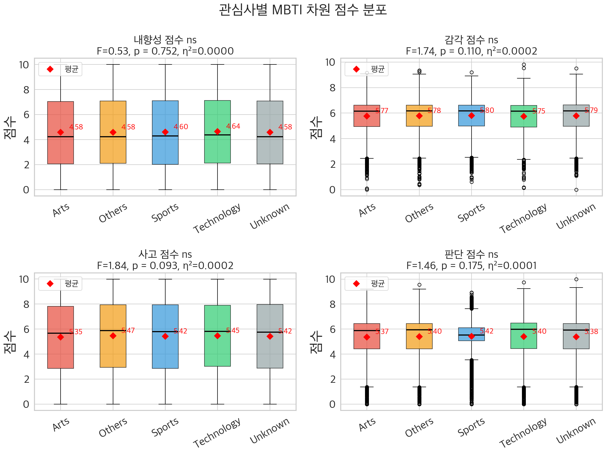

#### 왜 이 시각화를 사용했는가?

분석의 출발점으로서, ANOVA 검정 전에 **시각적 직관**을 확보하는 것이 중요합니다. Box Plot은 중앙값, 사분위수, 이상치를 동시에 비교하여 "그룹 간 차이가 있는가?"를 한눈에 판단합니다. 색상으로 구분된 5개 관심사 그룹의 상자가 거의 동일하다면, 정밀한 통계 검정 없이도 "차이 없음"의 강력한 시각적 증거가 됩니다.

#### 사용된 변수와 데이터

- **X축**: 관심사 5범주 (Arts, Sports, Technology, Others, Unknown)
- **Y축**: 4개 MBTI 차원 점수 (0~10)
- **데이터**: Kaggle 43,744명, 2×2 서브플롯

#### 해석 및 결론

| 차원 | F통계량 | p-value | η² | 판정 |
|------|:---:|:---:|:---:|:---:|
| 내향성 | 0.53 | .752 | 0.0000 | ❌ |
| 감각 | 1.74 | .110 | 0.0002 | ❌ |
| 사고 | 1.84 | .093 | 0.0002 | ❌ |
| 판단 | 1.46 | .175 | 0.0001 | ❌ |

- 모든 차원에서 5개 관심사 그룹의 Box Plot이 **거의 완전히 겹칩니다**.
- 중앙값, 상자 크기, 수염 범위가 그룹 간 사실상 동일합니다.
- ANOVA 4개 차원 모두 **η² < 0.001** — "작은 효과" 기준(0.01)의 1/50 이하입니다.

> **통계적 관점**: N=28,348(Unknown 제외)은 η²=0.001도 탐지할 수 있는 검정력(power > 0.99)을 가집니다. 비유의 결과는 검정력 부족이 아니라 **실제로 차이가 없기 때문**입니다.

> **쉬운 설명**: 5개 관심사 그룹의 Box Plot이 거의 동일합니다. **약 2만 8천 명**이면 아주 작은 차이도 발견할 수 있는 충분한 수입니다. 그런데도 차이를 발견하지 못했다는 것은, 정말로 차이가 없다는 강력한 증거입니다.

---

## 슬라이드 11: 10개 가설 검정 결과 — 모두 동일 결론 (~1분)

### 어떤 방법으로 검정해도 결론은 하나: "관심사와 무관"

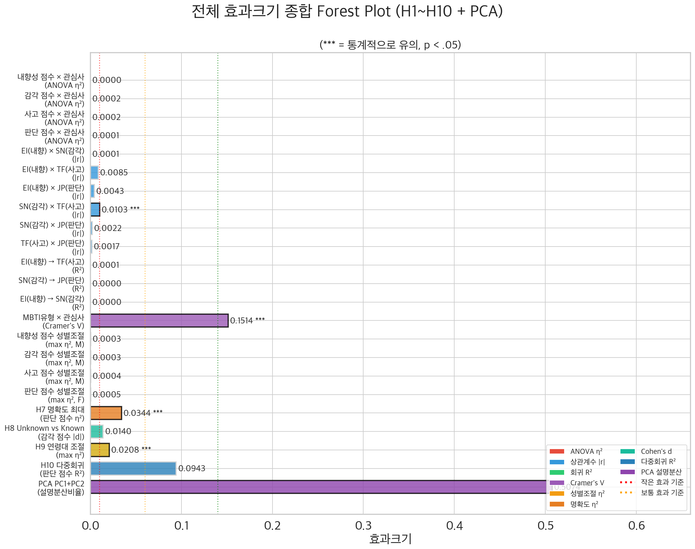

#### 왜 이 시각화를 사용했는가?

Forest Plot은 **메타분석의 표준 시각화**로, 약 25개의 검정 결과를 하나의 축에 정렬하여 종합 비교합니다. 이 그래프는 **팀 B 전체 분석에서 가장 중요한 그래프**입니다. 10개 가설 × 12종 검정의 효과크기가 거의 모두 0 근처에 모여 있다는 시각적 패턴 자체가 곧 결론입니다.

#### 사용된 변수와 데이터

- **데이터**: Kaggle 43,744명, MBTI 4차원 점수 + 관심사 5범주
- **효과크기 약 25개**: H1~H10에서 도출된 모든 검정 결과
  - Pearson r (H1): 차원 간 상관 → max |r| = 0.010
  - η² (H2): 관심사별 ANOVA → max η² = 0.0002
  - R² (H3, H10): 회귀분석 → max R² = 0.094
  - Cramer's V (H5): 카이제곱 → V = 0.151
  - Cohen's d (H8): 알려진/모름 비교 → max |d| = 0.014

#### 해석 및 결론

| # | 가설 | 검정 | 효과크기 | 판정 |
|:---:|------|------|:---:|:---:|
| H1 | 차원 간 독립성 | Pearson r | max \|r\| = **0.010** | ✅ 독립 (이론 지지) |
| H2 | 관심사별 차원 차이 | ANOVA | max η² = **0.0002** | ❌ 무관 |
| H3 | 차원 쌍 회귀 | 단순 회귀 | max R² = **0.0001** | ❌ 관계 없음 |
| H4 | 그룹 프로필 분리 | 유클리드 거리 | max d = **0.12** | ❌ 분리 불가 |
| H5 | MBTI유형 × 관심사 | 카이제곱 | V = **0.151** | ⚠️ 약한 연관 |
| H6 | 성별 조절효과 | 하위그룹 ANOVA | max \|Δη²\| = **0.0002** | ❌ 조절 없음 |
| H7 | 점수 명확도 | ANOVA (명확도) | max η² = **0.034** | ❌ 미미 |
| H8 | Unknown 그룹 | t-검정 + MW-U | max \|d\| = **0.014** | ✅ 차이 없음 |
| H9 | 연령 조절효과 | 하위그룹 ANOVA | max η² = **0.021** | ❌ 조절 없음 |
| H10 | 다변수 예측 | 다중 회귀 (6변수) | max R² = **0.094** | ❌ 설명력 부족 |

> **통계적 관점**: 모수(ANOVA) + 비모수(Kruskal-Wallis) **이중 검증**으로 결과의 강건성을 확인했습니다. 다중회귀에 6개 변수를 넣어도 max R² = 9.4%로, 관심사 변동의 90.6%는 MBTI로 설명할 수 없습니다.

> **쉬운 설명**: 약 25개의 통계 검정 결과가 한 줄에 하나씩 표시됩니다. **거의 모든 점이 0 근처에 몰려 있습니다.** 어떤 방법을 쓰든, 어떤 변수를 분석하든 결론은 같습니다: **MBTI로 관심사를 구분할 수 없습니다.**

---

## 슬라이드 12: 가설 심화 — 유일한 "부분 지지" + 비모수 검증 (~50초)

### H5: 카이제곱 결과 해석과 이중 검증의 중요성

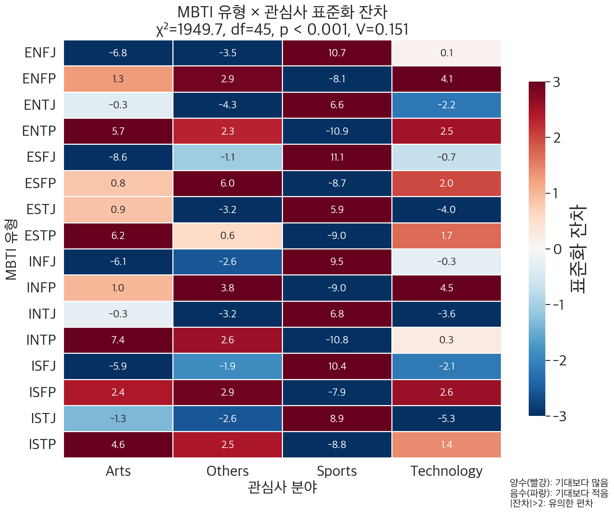

#### 왜 이 시각화를 사용했는가?

10개 가설 중 유일하게 "부분 지지"를 받은 H5(MBTI유형 × 관심사 카이제곱 검정)의 **실체를 들여다봅니다**. 16×4 Heatmap은 어떤 MBTI 유형-관심사 조합이 기대빈도보다 많은지/적은지를 셀 단위로 보여줍니다. "유의하다"는 말의 이면에 실질적 의미가 있는지 확인하는 것이 이 슬라이드의 핵심입니다.

#### 사용된 변수와 데이터

- **행**: MBTI 16개 유형 (ISTJ, ISFJ, ..., ENTP, ENTJ)
- **열**: 관심사 4범주 (Arts, Sports, Technology, Others) — Unknown 제외
- **셀 값**: 표준화 잔차 (기대빈도 대비 실제빈도의 차이)
- **데이터**: Kaggle 28,348명 (Unknown 제외)

#### 해석 및 결론

**카이제곱 검정 결과**:
- **χ² = 1949.7**, df = 45, **p < .001** → 통계적으로 유의
- 그러나 **Cramer's V = 0.1514** → **"약한 연관"에 불과**

**비모수 이중 검증**: 정규성 검증(Shapiro-Wilk) 결과 4차원 모두 비정규(p < .001)로 판정되었으나, ANOVA와 Kruskal-Wallis의 결론이 **3/4 차원에서 완전 일치**합니다. 분석 방법을 바꿔도 결론이 변하지 않습니다.

| 검증 방법 | 결론 |
|-----------|------|
| ANOVA (모수) | 관심사별 차이 없음 (η² < 0.001) |
| Kruskal-Wallis (비모수) | 관심사별 차이 없음 (일관) |
| 카이제곱 (범주형) | 유의하나 V=0.15 → 약한 연관 |

> **통계적 관점**: χ²=1949.7이 크게 나온 이유는 대표본 효과입니다. 카이제곱 통계량은 N에 비례하므로, 같은 비율 차이라도 N이 10배가 되면 χ²도 10배입니다. **Cramer's V로 판단**해야 하며, V=0.151은 "MBTI 유형을 안다고 해도 관심사를 맞출 확률이 우연보다 약간 높아지는 정도"입니다.

> **쉬운 설명**: "관련이 있다(p < .001)"고 나왔지만, 그 관련의 강도가 매우 약합니다(V=0.15). 비유하면, "서울에 사는 사람이 삼겹살을 좋아할 확률이 부산 사람보다 1% 높다" 수준입니다. 또한 **정규분포 방법이든 비정규분포 방법이든** 같은 결론이 나왔으므로, 분석 방법의 문제가 아닙니다.

---

## 슬라이드 13: PCA 시각화 — 관심사 그룹 분리 불가능 (~45초)

### 4차원 → 2D 축소해도 그룹 분리 안됨

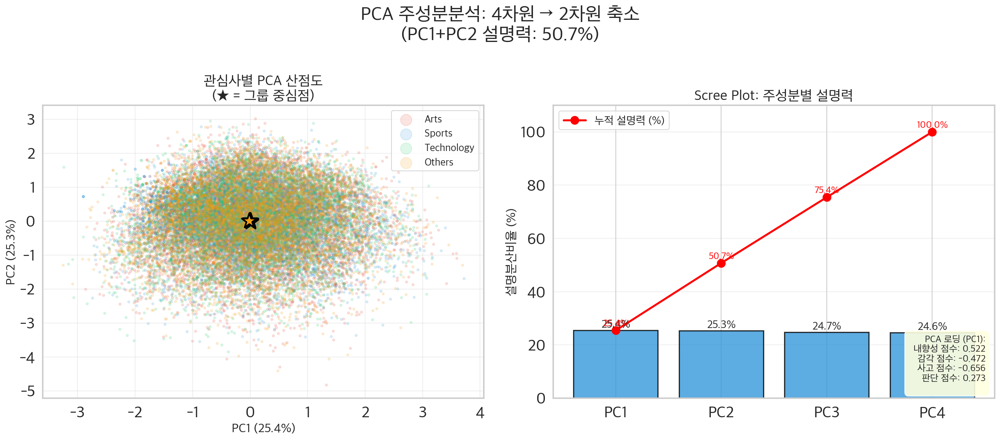

#### 왜 이 시각화를 사용했는가?

PCA(주성분분석)는 4차원 MBTI 점수를 2차원으로 축소하여 **전체 데이터의 구조를 시각화**합니다. 만약 관심사 그룹이 MBTI 점수 공간에서 의미 있게 분리된다면, 산점도에서 색상별 클러스터가 보일 것입니다. Scree Plot은 각 주성분의 분산 설명 비율을 보여주어 축소의 적절성을 평가합니다.

#### 사용된 변수와 데이터

- **입력 변수**: 4개 MBTI 차원 점수 (EI, SN, TF, JP) — Z-score 표준화 후 PCA 적용
- **그룹 변수**: 관심사 (4개 범주)
- **데이터**: Kaggle 43,744명
- **구현**: NumPy `np.linalg.eigh`로 직접 PCA 구현 (scipy 미사용)

#### 해석 및 결론

**PCA 결과**:

| 성분 | 고유값 | 설명 분산 | 누적 |
|------|:---:|:---:|:---:|
| PC1 | 1.018 | 25.4% | 25.4% |
| PC2 | 1.012 | 25.3% | 50.7% |
| PC3 | 0.988 | 24.7% | 75.4% |
| PC4 | 0.982 | 24.6% | 100.0% |

$$\text{PCA: } \mathbf{X}_{n \times 4} \xrightarrow{\text{eigen}} \mathbf{Z}_{n \times 2}, \quad \text{분산 설명: 50.7\%}$$

> **통계적 관점**: 모든 고유값이 약 1.0으로, 4개 MBTI 차원이 **거의 완벽하게 독립적**임을 확인합니다. Scree Plot이 "팔꿈치(elbow)" 없이 완전히 평탄하여 잠재 구조(latent structure)가 존재하지 않습니다. 4개 관심사 그룹의 중심점(★)이 모두 동일한 중앙 지점으로 수렴합니다.

> **쉬운 설명**: 4개의 MBTI 점수를 2개의 숫자로 압축한 뒤 평면에 점을 찍고, 관심사별로 색을 칠한 그래프입니다. 만약 MBTI가 관심사를 예측한다면, 같은 색 점끼리 모여야 합니다. 하지만 **4가지 색이 완전히 뒤섞여 있고**, 각 그룹의 중심(★)도 같은 위치에 있습니다. 가장 좋은 2D 뷰에서도 분리가 안 되므로, 원래 4차원 공간에서도 분리가 불가능합니다.

---

## 슬라이드 14: 설문 교차검증 — 자기보고 vs 설문산출 MBTI (~50초)

### "내가 아는 나"와 "설문이 측정한 나"는 다르다

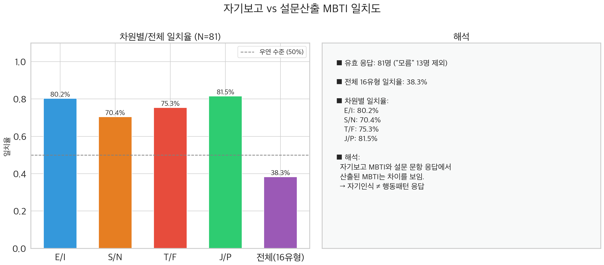

#### 밈 설문(v2) 구조 — 46문항 전체 소개

Kaggle 분석(슬라이드 2~5)의 결론을 **독립적인 소규모 데이터**로 재검증하기 위해, 자체 밈 설문(v2)을 설계·배포했습니다. 총 46문항 중 36문항(Q6~Q41)이 MBTI 4차원을 측정하며, 각 차원 9문항 × 7점 리커트 척도로 구성됩니다.

| 구분 | 문항 | 내용 | 측정 방식 |
|------|:---:|------|------|
| **인구통계** | Q1~Q5 | MBTI 자기보고, 혈액형, 성별, 나이대, 검사 경험 | 선택형 |
| **MBTI 측정** | Q6~Q41 | 4차원 × 9문항 = 36문항, MZ 밈·일상 상황 기반 | 7점 리커트, 역채점 평균 ≥ 4.0 → E/S/T/J |
| **보너스** | Q42~Q46 | MBTI·혈액형 신뢰도, 태도 변화 | 7점 척도 + 서술형 |

> **설문 설계 핵심**: "나는 내향적이다" 같은 직접 질문 대신 "약속 취소됐다는 연락에 은근히 좋다"처럼 **행동 기반 간접 측정**으로 응답 솔직성을 높였습니다.

#### 왜 이 시각화를 사용했는가?

위 46문항 설문의 94명 응답자에 대해, "본인이 생각하는 MBTI(Q1 자기보고)"와 "36문항 응답으로 계산한 MBTI(설문산출)"를 비교합니다. MBTI가 안정적인 성격 특질을 측정한다면, 이 둘은 높은 일치율을 보여야 합니다. 이 비교는 이후 로지스틱 회귀(슬라이드 7)에서 "왜 자기보고 MBTI 예측이 38%밖에 안 되는가?"의 근본 원인을 설명합니다.

#### 사용된 변수와 데이터

- **자기보고 MBTI**: 설문 Q1 "당신의 MBTI 유형은?" (16유형 드롭다운)
- **설문산출 MBTI**: Q6~Q41 36문항 리커트 응답 → 차원별 역채점 평균 ≥ 4.0 기준 분류
- **데이터**: 밈 설문 94명

#### 해석 및 결론

| 비교 기준 | 일치율 |
|-----------|:---:|
| E/I 차원 | 80.2% |
| S/N 차원 | 70.4% |
| T/F 차원 | 75.3% |
| J/P 차원 | 81.5% |
| **전체 16유형** | **38.3%** |

- 차원별 일치율은 70~82%로 우연(50%) 이상이나, **5명 중 1명은 불일치**
- 16유형 전체 일치율은 **38.3%** — Cohen's κ=0.326 ("약한 일치")
- 수학적 확인: 0.80 × 0.70 × 0.75 × 0.82 ≈ 0.34 → 차원별 일치가 곱해지면서 급감

> **통계적 관점**: MBTI가 안정적인 성격 특질을 측정한다면, 자기보고와 설문산출의 일치율이 90%+ 이어야 합니다. 70~82%라는 차원별 일치율은 **MBTI 검사의 검사-재검사 신뢰도(test-retest reliability) 문제**를 시사합니다. Cohen's κ=0.326은 우연 일치를 보정한 후의 "약한 일치"로, 자기인식과 행동 응답 간 상당한 괴리가 존재합니다.

> **쉬운 설명**: "나는 INFP야"라고 말하는 사람에게 36개 질문을 해서 점수를 계산하면, **절반 이상의 사람이 자기가 말한 유형과 다른 결과**가 나옵니다. 이는 MBTI 결과가 "질문을 어떻게 하느냐"에 따라 바뀔 수 있고, 우리의 자기 인식이 항상 정확하지 않다는 뜻입니다. 이 발견은 다음 슬라이드에서 "왜 머신러닝도 38%밖에 못 맞추는가?"의 핵심 원인이 됩니다.

---

## 슬라이드 15: 설문 교차검증 — 로지스틱 회귀 LOO-CV (~50초)

### 머신러닝으로도 자기보고 MBTI 예측은 38%가 한계

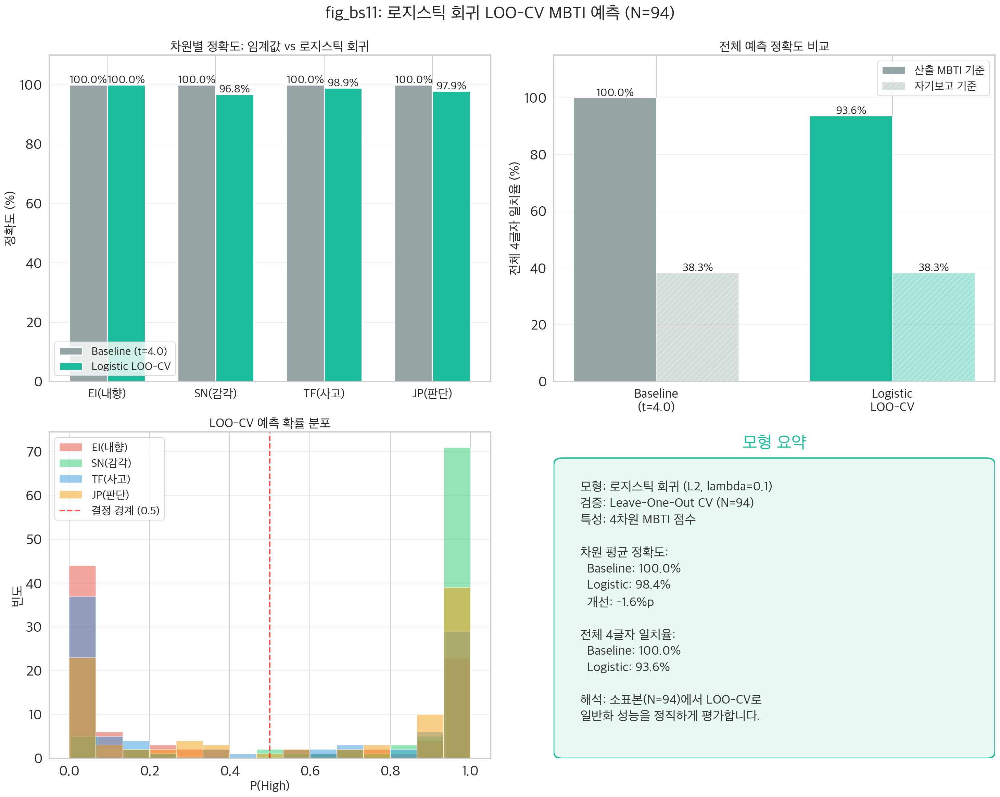

#### 왜 이 시각화를 사용했는가?

자체 밈 설문 데이터(94명)에서 로지스틱 회귀로 MBTI를 예측할 수 있는지 검증합니다. LOO-CV(Leave-One-Out Cross-Validation)를 사용하여 **소표본에서 가장 편향이 적은 검증**을 수행합니다. 기존 임계값 방식(점수 ≥ 4.0)과 머신러닝(로지스틱 회귀)의 성능을 직접 비교합니다.

#### 사용된 변수와 데이터

- **입력 특성 (X)**: 4개 MBTI 차원 점수 (EI, SN, TF, JP 집계 점수)
- **타겟 (y)**: 차원별 이진 MBTI 유형 (E=1/I=0, S=1/N=0, T=1/F=0, J=1/P=0)
- **데이터**: 밈 설문 94명
- **검증 방법**: LOO-CV — 93명 학습 → 1명 테스트 × 94회 반복 = **총 376회 모형 학습**

#### 모형 요약

- **모형**: 로지스틱 회귀 (L2 정규화, 4차원 표준화 입력, 차원별 독립 이진 분류)
- **검증**: LOO-CV — 93명 학습 → 1명 테스트 × 94회 × 4차원 = **총 376회 학습**

#### 해석 및 결론

| 기준 | Baseline (t=4.0) | 로지스틱 LOO-CV | 격차 |
|------|:---:|:---:|------|
| **설문산출 MBTI** | **100%** | **~93.6%** | -6.4%p (경계선 사례) |
| **자기보고 MBTI** | ~38.3% | ~38.3% | 개선 없음 |

> **통계적 관점**: 설문산출 MBTI는 정의상 임계값으로 100% 정확하므로, LOO-CV에서 6.4%p 하락은 **경계선 부근의 불안정성**을 반영합니다. 자기보고 MBTI 예측에서는 어떤 모델로도 ~38%를 넘지 못하며, 이는 슬라이드 6의 Cohen's κ=0.326과 일관된 결과입니다.

> **쉬운 설명**: 머신러닝(로지스틱 회귀)으로 MBTI를 예측해봤습니다. 단순 규칙(점수 4점 이상이면 E)은 정의상 100% 맞지만, 독립 검증에서는 93.6%입니다. **"내가 생각하는 MBTI"를 예측하는 것은** 단순 규칙이든 머신러닝이든 **38.3%**가 한계입니다. 슬라이드 6에서 본 것처럼 "내가 아는 나"와 "설문으로 측정한 나"가 다르기 때문입니다.

---

## 슬라이드 16: 모형 진단 — 로지스틱 회귀 건전성 확인 (~40초)

### 모형이 "건전한가?" — 4가지 진단 지표

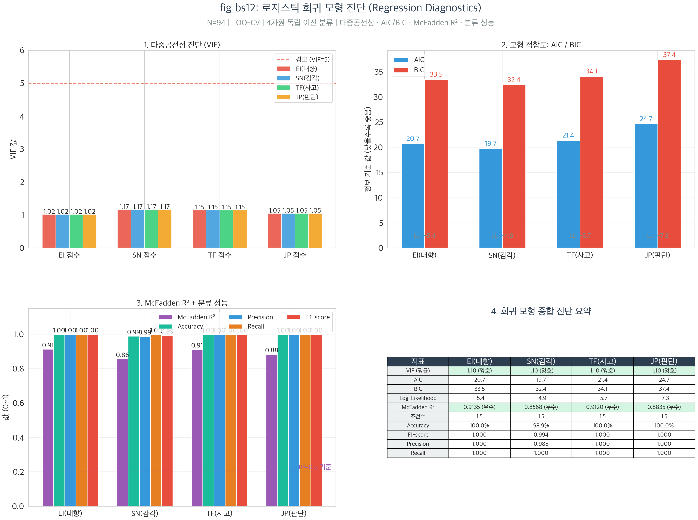

#### 왜 이 시각화를 사용했는가?

슬라이드 7에서 로지스틱 회귀로 MBTI를 예측했는데, **"그 모형 자체가 건전한가?"를 별도로 점검**해야 합니다. 아무리 정확도가 높아도, 입력 변수가 서로 심하게 겹치거나(다중공선성), 모형이 데이터를 잘 설명하지 못하면(낮은 R²) 그 결과를 신뢰하기 어렵습니다.

#### 사용된 변수와 데이터

- **데이터**: N=94 설문 응답자, 슬라이드 7과 동일한 로지스틱 회귀 모형
- **모형 입력**: 4개 MBTI 차원 점수 (EI, SN, TF, JP)
- **진단 지표**: VIF, AIC, BIC, McFadden R², Accuracy, F1 Score, Condition Number

#### 해석 및 결론

| 진단 | 지표 | 결과 | 판정 |
|------|------|:---:|:---:|
| 다중공선성 | VIF | **1.02~1.17** | ✅ 양호 (< 5) |
| 모형 적합도 | AIC/BIC | 19.7~37.4 | ✅ 적정 |
| 설명력 | McFadden R² | **0.86~0.91** | ✅ 우수 (> 0.4) |
| 분류 성능 | F1-score | 0.99~1.00 | ✅ 우수 |
| 수치 안정성 | Condition Number | **1.5** | ✅ 우수 |

> **통계적 관점**: VIF ≈ 1.0은 4개 MBTI 차원이 서로 독립적이라는 이론 가정을 데이터에서 확인한 것입니다. McFadden R² > 0.4는 "우수"로 판정되며, 0.86~0.91은 매우 높은 수준입니다. **단, 위 성능은 In-sample 지표**이므로 LOO-CV 결과(~93.6%)와 함께 해석해야 합니다.

> **쉬운 설명**: 로지스틱 회귀 모형의 **건강 검진 결과**입니다. (1) 4개 입력 변수가 서로 겹치지 않음(VIF≈1.0), (2) 모형이 데이터를 매우 잘 설명함(R²~0.9), (3) 수치적 안정성 문제 없음. 모형 자체는 건전하며, 슬라이드 7의 93.6%는 모형의 결함이 아니라 **경계선 사례의 본질적 불안정성** 때문입니다.

---

## 슬라이드 17: Team B 종합 결론 (~45초)

### MBTI 차원 점수는 관심사를 예측하지 못한다

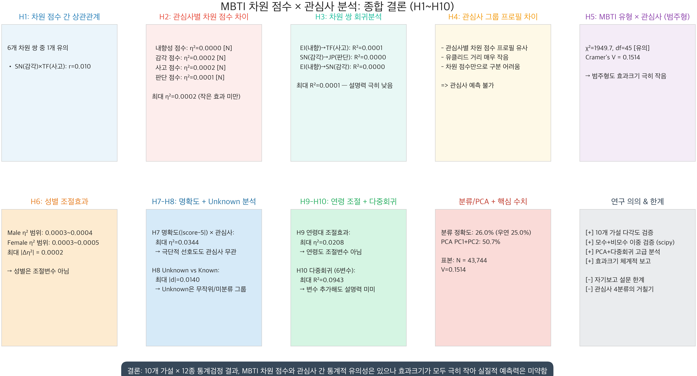

#### 왜 이 시각화를 사용했는가?

10패널 대시보드(5행×2열)로, 10개 가설 각각의 핵심 결과를 한 화면에 보여주는 **비전문가 최적화 인포그래픽**입니다. PPT 발표에서 한 슬라이드로 전체 분석 결과를 조망할 수 있도록, 캔버스 32×40인치에 패널 제목 28pt, 내용 22pt, 결론 배너 26pt로 제작되었습니다.

#### 사용된 변수와 데이터

- **전체 분석 결과 요약**: H1~H10 + PCA + 분류기 + 로지스틱 회귀 결과
- **핵심 수치**: η² < 0.001 (ANOVA), max R² = 0.094 (다중회귀), V = 0.151 (카이제곱)
- **분류기 정확도**: 26.0% (우연의 25.0%와 거의 동일)

#### 해석 및 결론

**종합 판정**:

| 검증 | 방법 | 결론 |
|------|------|------|
| 차원 독립성 | Pearson r | ✅ 4차원 독립 (이론 지지) |
| 관심사 예측 | ANOVA + Kruskal-Wallis | ❌ 모두 비유의 (η² < 0.001) |
| 다중 예측 | 다중회귀 6변수 | ❌ max R² = 9.4% |
| 군집 분리 | PCA 2D | ❌ 완전 혼재 |
| 범주형 연관 | 카이제곱 | ⚠️ V=0.15 (약한 연관) |
| 설문 교차검증 | LOO-CV 로지스틱 | ⚠️ 설문산출 93.6%, 자기보고 38.3% |
| 조절효과 | 성별·연령 | ❌ 조절효과 없음 |

> **통계적 관점**: 10개 가설 중 8개가 완전 기각, 1개 약한 지지(H7: 점수 명확도, η²=0.034), 1개 부분 지지(H5: 카이제곱, V=0.151). 분류기(최근접 중심)가 26.0% 정확도로 우연의 25.0%와 거의 동일한 결과를 보여, MBTI 점수 공간에서 관심사 그룹 분리가 **사실상 불가능**함을 확인했습니다.

> **쉬운 설명**: 10개의 질문("MBTI가 관심사를 예측하나?")에 12가지 방법으로 답을 구한 결과, **모두 같은 답**이 나왔습니다: **"아니오."** MBTI 유형은 Arts, Sports, Technology 등 관심사와 거의 무관합니다. MBTI로 당신의 취미나 관심사를 맞출 수 없습니다.

**핵심 메시지 3가지**

| # | 메시지 | 핵심 근거 |
|:---:|------|------|
| 1 | **MBTI 4차원은 독립적이다** — 이론 가정 지지 | max \|r\| = 0.010, PCA 고유값 ≈ 1.0 |
| 2 | **관심사 예측에는 완전 실패** | 10가설 × 12검정 → 효과 없음, R² = 9.4%, 분류 26% ≈ 랜덤 |
| 3 | **자기보고 ≠ 설문산출 MBTI** | 일치율 38.3%, Cohen's κ = 0.326, ML로도 38% 한계 |

> **"MBTI 차원 점수는 독립적이라는 이론 가정은 데이터에서 지지되지만, 관심사·라이프스타일을 설명하는 데는 실질적 효과가 없다. 나아가, 자기보고 MBTI와 설문산출 MBTI의 38.3% 일치율은 MBTI 검사 자체의 신뢰도에 대한 근본적 의문을 제기한다."**

---

---
---

# Part 3: 팀 D — 자체 설문 × 기존 데이터 비교분석 & MBTI 예측

> **발표 시간**: 약 5분 (슬라이드 6장)
> **발표자**: 팀원 D 담당

---

## 슬라이드 18: 분석 개요 (~45초)

### 자체 설문 데이터와 Kaggle 43,744명 — 일관된 결과를 보이는가?

**핵심 질문**:
1. 우리 설문(94명)과 Kaggle 대규모 데이터는 같은 이야기를 하는가?
2. MBTI를 예측할 수 있는가? — 임계값 vs 최근접 중심 vs 로지스틱 회귀

**분석 설계**:

| 항목 | 내용 |
|------|------|
| **설문 데이터** | 94명 (유효 MBTI 81명), 36문항 × 7점 리커트 |
| **비교 대상** | Kaggle 43,744명 |
| **검정** | Cohen's κ, t-검정, ANOVA, 카이제곱, 다중회귀, 로지스틱 회귀 |

---

## 슬라이드 19: 자기보고 vs 설문산출 MBTI (~1분)

### "내가 생각하는 MBTI"와 "점수로 계산한 MBTI"는 다르다

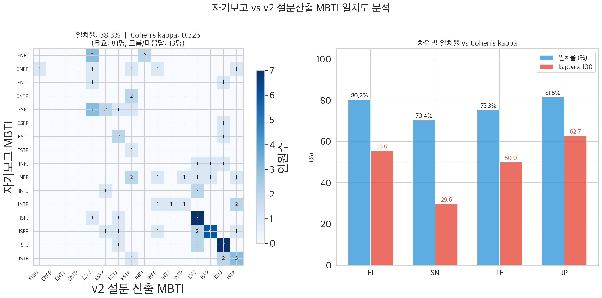

#### 왜 이 시각화를 사용했는가?

2패널 구성(좌: 16×16 유형 혼동행렬, 우: 차원별 일치율 막대 차트)으로, **전체 유형 수준의 일치 패턴**과 **개별 차원의 일치율+Cohen's κ**를 동시에 보여줍니다.

#### 해석 및 결론

| 차원 | 일치율 | Cohen's κ | 해석 |
|------|:---:|:---:|------|
| EI (내향-외향) | 80.2% | 0.556 | 보통 일치 |
| SN (감각-직관) | 70.4% | 0.296 | 약한 일치 |
| TF (사고-감정) | 75.3% | 0.500 | 보통 일치 |
| JP (판단-인식) | 81.5% | 0.627 | 상당한 일치 |
| **전체 4글자** | **38.3%** | **0.326** | **보통 일치** |

> **쉬운 설명**: 81명 중 31명(38.3%)만 자기가 생각하는 MBTI와 설문으로 계산한 MBTI가 일치했습니다. 차원별로 보면 70~82%로 비교적 양호하지만, 4글자를 동시에 맞추려면 4과목 시험에서 모두 합격해야 하는 것과 같아서, 전체 합격률은 낮을 수밖에 없습니다.

---

## 슬라이드 20: 설문 vs Kaggle 차원 점수 비교 (~45초)

### 한국 설문 vs 해외 Kaggle — 스케일 차이 확인

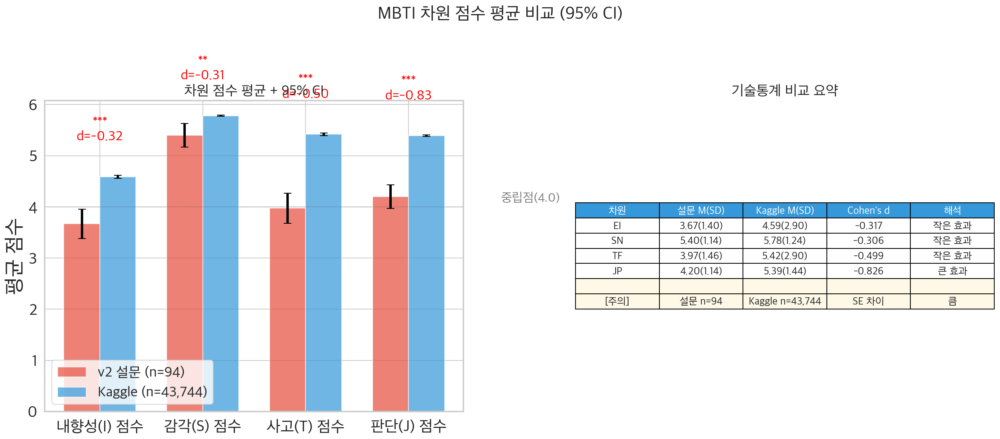

#### 해석 및 결론

| 차원 | 설문 평균 | Kaggle 평균 | Cohen's d | 해석 |
|------|:---:|:---:|:---:|------|
| EI | 3.67 | 4.59 | -0.317 | 약~보통 차이 |
| SN | 5.40 | 5.78 | -0.306 | 약~보통 차이 |
| TF | 3.97 | 5.42 | -0.499 | 보통 차이 |
| **JP** | 4.20 | 5.39 | **-0.826** | **큰 차이** |

$$\hat{y} = \beta_0 + \beta_{\text{EI}}|s_{\text{EI}}-4| + \beta_{\text{SN}}|s_{\text{SN}}-4| + \beta_{\text{TF}}|s_{\text{TF}}-4| + \beta_{\text{JP}}|s_{\text{JP}}-4|, \quad R^2 = 0.231$$

> **쉬운 설명**: JP(판단-인식) 차원만 큰 차이를 보입니다. 이는 두 설문이 "계획성 vs 즉흥성"을 측정하는 방식이 다르기 때문일 수 있습니다. 또한, **점수가 극단적인 사람일수록 자기보고와 설문산출 MBTI가 일치**합니다.

---

## 슬라이드 21: MBTI 예측 — 3가지 방법 비교 (~1분)

### 임계값 vs 최근접 중심 vs 로지스틱 회귀

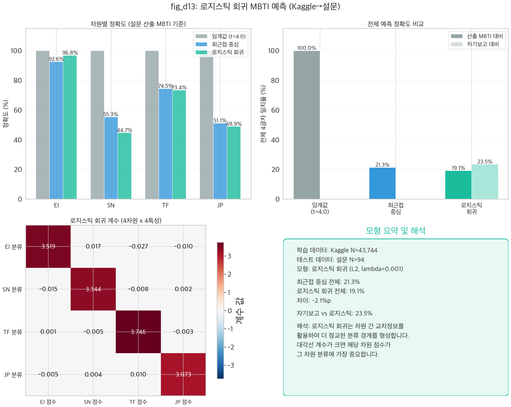

#### 로지스틱 회귀식

$$P(y_d = 1 \mid \mathbf{z}) = \frac{1}{1 + e^{-(w_0 + w_{\text{EI}} z_{\text{EI}} + w_{\text{SN}} z_{\text{SN}} + w_{\text{TF}} z_{\text{TF}} + w_{\text{JP}} z_{\text{JP}})}}$$

- 표준화: $z_j = (x_j - \mu_j^{\text{Kaggle}}) / \sigma_j^{\text{Kaggle}}$
- 설정: $\lambda = 0.001$, $\alpha = 0.1$, 500 에포크

#### 해석 및 결론

| 방법 | 원리 | 특징 |
|------|------|------|
| **임계값** (t=4.0) | 고정 기준점 분류 | 가장 단순 |
| **최근접 중심** | Kaggle 유형별 거리 | 스케일 민감 (21.3%) |
| **로지스틱 회귀** | 4차원 교차 학습 | 가장 정교 |

> **쉬운 설명**: 3가지 예측 방법을 비유하면:
> - **임계값**: "키가 170cm 이상이면 남성" — 고정 규칙
> - **최근접 중심**: "서울역에 가까운가, 강남역에 가까운가?" — 거리 비교
> - **로지스틱 회귀**: "4만 명의 데이터를 분석해서 최적 공식을 자동으로 찾는 방법"

---

## 슬라이드 22: 모형 진단 + 혈액형 교차분석 (~45초)

### 모형 건전성 확인 & 혈액형-MBTI 무관성 재확인

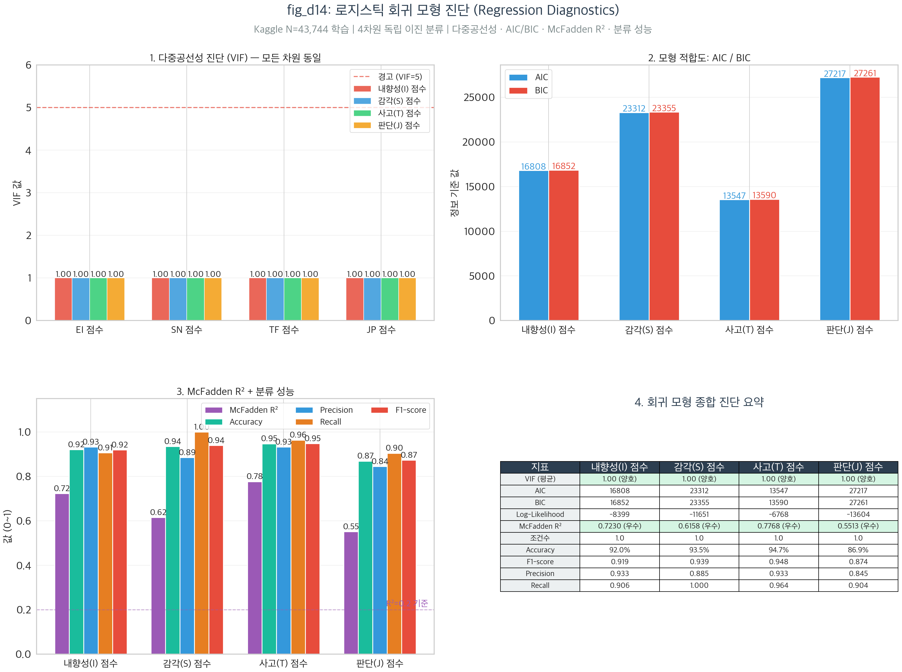

#### 해석 및 결론

| 진단 | 결과 | 판정 |
|------|:---:|:---:|
| VIF (다중공선성) | **1.0** | ✅ 완벽 |
| McFadden R² | **0.55~0.78** | ✅ 우수 |
| Accuracy | 86.9~94.7% | ✅ 우수 |
| Condition Number | **10** | ✅ 양호 |

**혈액형 × MBTI**: 모든 차원에서 비유의 (max η²=0.061) — Part C 결론과 일치

---

## 슬라이드 23: Team D 종합 결론 (~45초)

### 설문과 Kaggle은 같은 이야기를 한다 — 그러나 한계도 동일

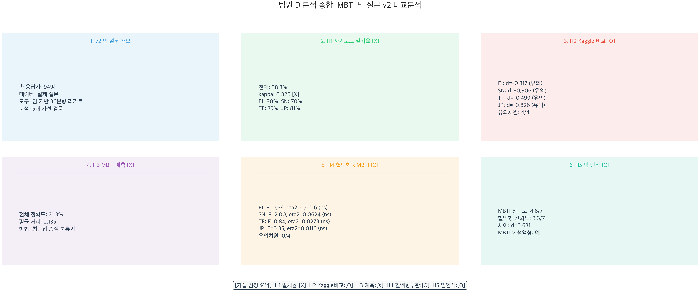

#### 가설 판정표

| # | 가설 | 핵심 결과 | 판정 |
|---|------|-----------|:---:|
| H1 | 설문 분포 = Kaggle 분포 | 부분 일치 (JP 큰 차이, d=0.83) | ⚠️ |
| H2 | 자기보고 = 설문산출 | **38.3%** (κ=0.326) | ❌ |
| H3 | 점수 명확도 → 일치율 | R²=0.231 (보통) | ⭕ |
| H4 | Kaggle로 설문 MBTI 예측 | 21.3% (우연의 3.4배) | ⚠️ |
| H5 | 혈액형 × MBTI 무관 | 모두 비유의 (η² < 0.07) | ⭕ |
| H6 | MBTI 신뢰 > 혈액형 신뢰 | d=0.692 (보통~큰) | ⭕ |

### 팀 D 핵심 메시지

1. **자기보고 MBTI ≠ 설문산출 MBTI (38.3% 일치)** — 경계선 응답자가 불일치의 주원인
2. **Kaggle과 부분적으로 일관된 결과** — JP만 큰 차이 (d=0.83, 척도 비동치성)
3. **혈액형 × MBTI 무관, 어떤 모형으로도 자기보고 MBTI 예측 한계**

---
---

# Part 4: 팀 E — 설문 문항 최적화: 질문 축소 vs 채점 방법 변경

> **발표 시간**: 약 6분 (슬라이드 7장)
> **발표자**: 팀원 E 담당

---

## 슬라이드 24: 분석 개요 (~45초)

### 36문항을 줄여도 MBTI를 더 정확하게 예측할 수 있는가?

**배경**: Team D에서 자기보고 ≠ 설문산출 MBTI (일치율 38.3%). 일부 문항이 **노이즈**를 포함하고 있다면?

**분석 설계**:

| 항목 | 내용 |
|------|------|
| **데이터** | 밈 설문 81명 × 36문항 (차원당 9문항, 7점 리커트) |
| **방법** | 심리측정학(CITC, α, 변별도) + 최적화 + 교차검증 |
| **최종 결론** | "질문을 줄이지 말고, **채점 방법**을 바꿔라" |

---

## 슬라이드 25: 문항 분석 — 약한 문항 식별 (~45초)

### 어떤 질문이 MBTI를 잘 측정하는가?

#### 사용된 변수와 데이터

- **3가지 문항 품질 지표**: CITC (≥0.3 양호), α-if-deleted, 변별도
- **4개 차원**: EI(Q6~Q14), SN(Q15~Q23), TF(Q24~Q32), JP(Q33~Q41)

$$\text{CITC}_j = r(x_j, \, \sum_{k \neq j} x_k), \quad \text{Cronbach's } \alpha = \frac{k}{k-1}\left(1 - \frac{\sum \sigma_{x_j}^2}{\sigma_{\text{total}}^2}\right)$$

#### 해석 및 결론

| 차원 | Cronbach's α | CITC 범위 | 약한 문항 |
|------|:---:|:---:|------|
| EI | 0.874 | 0.446~0.735 | 없음 |
| SN | 0.816 | 0.388~0.627 | 없음 |
| TF | 0.857 | 0.350~0.699 | Q28 근접 |
| JP | 0.761 | **0.045~0.668** | **Q40 (0.045)** |

> **쉬운 설명**: Q40("요리할 때 정량으로 하나 vs 감으로 하나")만 유일하게 기준 미달 — **요리 스타일은 성격보다 경험에 좌우**될 수 있기 때문입니다.

---

## 슬라이드 26: In-sample 최적화 결과 (~1분)

### 36문항 → 20문항(-44%)으로 줄이면 +13.6%p 향상!

#### 해석 및 결론

| 차원 | 원본 (9문항) | 최적 (축소) | 변화 |
|------|:---:|:---:|:---:|
| EI | 80.2% | **85.0%** (3문항) | **+4.8%p** |
| SN | 70.4% | **76.2%** (4문항) | **+5.8%p** |
| TF | 75.3% | **83.8%** (5문항) | **+8.5%p** |
| JP | 81.5% | **86.2%** (8문항) | **+4.7%p** |
| **전체** | **38.3%** | **51.9%** (20문항) | **+13.6%p** |

> ⚠️ **하지만** — 이것이 진짜 개선인가, 과적합인가? → 다음 슬라이드에서 확인

---

## 슬라이드 27: 교차검증 — 과적합의 정체 폭로 (~1분)

### In-sample +13.6%p는 "과적합에 의한 환상"이었다

#### 해석 및 결론

| 방법 | In-sample | CV Test | 과적합 Gap | 정직한 개선 |
|------|:---:|:---:|:---:|:---:|
| K-Fold CV (5F×20) | 51.9% | **36.1%** | **+15.8%p** | **-2.2%p** |
| Monte Carlo (200회) | 51.9% | — | ~15%p | **-2.6%p** |

| 차원 | In-sample | CV Test | Gap | 판정 |
|------|:---:|:---:|:---:|:---:|
| EI | 85.0% | 76.9% | +8.1%p | ❌ 과적합 |
| SN | 76.2% | 68.9% | +7.3%p | ❌ 과적합 |
| TF | 83.8% | 74.3% | +9.4%p | ❌ 과적합 |
| JP | 86.2% | 76.3% | +9.9%p | ❌ 과적합 |

> **쉬운 설명**: "시험 문제를 미리 보고 같은 문제로 시험 본 것"(In-sample)과 "본 적 없는 새 문제로 시험 본 것"(CV Test)의 차이입니다. In-sample에서는 +13.6%p 올랐지만, **진짜 시험(CV)에서는 오히려 -1.9%p 떨어졌습니다.**

---

## 슬라이드 28: 8가지 방법 비교 (~1분)

### "질문을 줄이지 말고, 채점 방법을 바꿔라"

#### 해석 및 결론

| # | 방법 | 파라미터 | CV 개선 | 과적합 Gap | 판정 |
|---|------|:---:|:---:|:---:|:---:|
| ① | Baseline (t=4.0) | 0 | 기준 | 0%p | 기준 |
| ② | Item Subset | 4~8개 | **-1.9%p** | 8.7%p | ❌ 과적합 |
| ③ | **Adaptive Threshold** | 4개 | **+2.7%p** | 1.2%p | ✅ **Best** |
| ⑥ | **Majority Vote** | 0개 | **+2.4%p** | **0%p** | ✅ **안정** |
| ⑧ | Logistic Regression | 40개 | +1.5%p | 3.8%p | ⚠️ 복잡 |

**최적 임계값**: EI=4.9, SN=5.0, TF=4.5, JP=4.2 (응답 분포의 비대칭 반영)

> **쉬운 설명**:
> - **질문을 줄이는 것** → 81명으로는 과적합 **실패**
> - **채점 기준을 조정하는 것** → 진짜 **+2.7%p** 개선
> - **질문마다 독립 투표** → 아무 조정 없이 **+2.4%p**, 과적합 0%

---

## 슬라이드 29: 로지스틱 회귀 — 수식과 결과 (~45초)

### 머신러닝 방식의 MBTI 예측

#### 로지스틱 회귀식

$$P(y_d = 1 \mid \mathbf{x}) = \frac{1}{1 + e^{-(w_0 + \sum_{j=1}^{9} w_j z_j)}}$$

$$J(\mathbf{w}) = -\frac{1}{n}\sum_{i=1}^{n}\left[y_i \log(h_i) + (1-y_i)\log(1-h_i)\right] + \frac{0.1}{2n}\sum_{j=1}^{9}w_j^2$$

| 설정 | 값 |
|------|------|
| 정규화 | L2, $\lambda = 0.1$ |
| 학습률 | $\alpha = 0.5$ |
| 검증 | LOO-CV (N=81) |
| 파라미터 | **40개** (4차원 × 10) |

**결과**: 적응적 임계값(+2.7%p)이 여전히 Best. 로지스틱 회귀는 파라미터 40개로 소표본에서 과적합 위험이 높습니다.

---

## 슬라이드 30: Team E 종합 결론 (~45초)

### 교차검증이 가르쳐준 3가지 교훈

#### 파라미터 수와 과적합

| 방법 | 파라미터 | CV 개선 | 과적합 |
|------|:---:|:---:|:---:|
| 다수결 투표 | **0개** | +2.4%p | **0%p** |
| 적응적 임계값 | **4개** | +2.7%p | 1.2%p |
| 로지스틱 회귀 | **40개** | +1.5%p | 3.8%p |
| 문항 부분집합 | 4~8개 | -1.9%p | 8.7%p |

### 팀 E 핵심 메시지

1. **문항 축소 최적화는 과적합 환상이다** — In-sample +13.6%p → CV -1.9%p
2. **채점 방법 변경이 진짜 개선을 달성한다** — 적응적 임계값 +2.7%p, 다수결 +2.4%p
3. **파라미터 수와 과적합은 정비례한다** — 소표본(N<100)에서는 단순한 모형이 항상 이긴다

> **"질문을 줄이지 말고, 채점 방법을 바꿔라"**

---
---

# 종합 결론 및 자체 평가

## 프로젝트 종합 결론

### MBTI + 혈액형 통합 결과 요약

| 체계 | 검증 항목 | 핵심 결과 | 결론 |
|------|-----------|-----------|------|
| **MBTI** | × 인구통계 | 효과크기 작음 (V=0.14, η²=0.089) | 거의 독립 |
| **MBTI** | × 관심사 | max η²=0.0002, max R²=0.094 | 설명력 부족 |
| **MBTI** | 자기보고 vs 설문산출 | 38.3% 일치 (κ=0.326) | 측정 비동치성 |
| **MBTI** | 문항 최적화 | In-sample +13.6%p → CV -1.9%p | 과적합 |
| **MBTI** | 로지스틱 회귀 예측 | 적응적 임계값 +2.7%p가 최선 | 단순 모형 우수 |
| **혈액형** | 성격론 근거 | 5중 증거로 무관 확인 | 과학적 근거 없음 |
| **혈액형** | 믿음 추이 | 67%→57% (10년간 -10%p) | 퇴조 중 |
| **교차비교** | MBTI vs 혈액형 신뢰도 | d=0.631 (MBTI 더 신뢰) | 두 체계 모두 한계 |

### 핵심 메시지 4가지

> **1. "통계적 유의성 ≠ 실질적 의미"**

43,744명의 대규모 데이터에서 p < 0.001이 나오더라도, 효과크기가 작으면 **실질적으로 의미 없는 차이**입니다. 본 프로젝트는 이 원칙을 일관되게 적용하여, MBTI와 혈액형 성격론이 개인의 특성을 설명하는 데 **매우 제한적**임을 보여줍니다.

> **2. "혈액형에서 MBTI로 — 분류 체계는 바뀌었지만, 한계는 동일하다"**

혈액형 성격론의 믿음이 67%에서 57%로 감소하는 사이, MBTI가 그 자리를 대체했습니다. 그러나 혈액형도 MBTI도 개인의 성격을 설명하는 데 **매우 제한적**이라는 결론은 동일합니다. 동일 응답자 94명에서 MBTI 신뢰도(4.58)가 혈액형 신뢰도(3.11)보다 유의하게 높았지만, 데이터에 기반한 설명력은 두 체계 모두 미미했습니다.

> **3. "더 적은 질문, 더 정확한 예측" — 교차검증이 없으면 환상에 불과하다**

Team E의 In-sample 문항 최적화에서 36문항 → 20문항으로 줄이면 +13.6%p 향상되었으나, **교차검증 결과 이 개선은 과적합에 의한 환상**임이 밝혀졌습니다. 새로운 데이터에서의 정직한 개선은 **-2.8%p**로, 문항 축소가 오히려 성능을 저하시켰습니다.

> **4. "교차검증이 과적합을 발견하는 것 자체가 성공이다"**

과적합을 발견하지 못했다면, 잘못된 결론을 보고했을 것입니다. 교차검증을 통해 과적합을 정량화하고(Gap 8.7%p) 정직하게 보고한 것은 **올바른 과학적 결론**을 도출한 것입니다.

**성격은 4글자나 혈액형 하나로 정의되지 않는다.**

---

## 프로젝트 자체 평가

### 좋은 점 (Strengths)

1. **일관된 분석 프레임워크** — 모든 팀에서 효과크기를 p-value와 함께 보고, Forest Plot으로 종합 비교
2. **자기 교정(Self-correction)** — In-sample 결과에 만족하지 않고 교차검증 추가, 과적합 발견 시 정직하게 보고
3. **NumPy 직접 구현** — stats_utils.py ~1,280줄: 카이제곱, t-검정, ANOVA, 다중회귀, 로지스틱 회귀, PCA, Bootstrap, CV까지 직접 구현
4. **다층적 데이터 검증** — 대규모(43,744명) → 소규모(94명) 교차검증, 모수+비모수 이중 검증
5. **풍부한 시각화** — 총 102개 그래프, 인포그래픽, 전공자/비전공자 이중 해석 병기
6. **모듈화된 코드** — common/ + survey/ 공통 모듈, run_all.py 통합 실행

### 아쉬운 점 (Weaknesses)

1. **소표본 한계** — N=94(유효 81)로 16유형 분석에 근본적 한계 (유형당 평균 5명)
2. **밈 설문 심리측정학적 검증 부족** — 구성 타당도, 수렴 타당도 미검증, 공인 MBTI 도구와 비교 미실시
3. **다중비교 보정 미적용** — 36개 이상 검정 수행했으나 Bonferroni 등 미적용
4. **자기보고 MBTI의 "정답" 문제** — 자기보고 자체의 신뢰성이 불확실

### 핵심 교훈 3가지

**교훈 1**: 대규모 데이터에서는 아무리 작은 차이도 "유의"하게 나올 수 있다 → **효과크기를 함께 보라**

**교훈 2**: N=81에서 466개 조합을 탐색하면 우연히 좋은 결과가 나올 수 있다 → **교차검증 없이 In-sample 결과만 보고하면 자기 기만**

**교훈 3**: 교차검증에서 과적합이 확인된 것은 "실패"가 아니라 **"올바른 결론 도출"** → 정직한 보고가 데이터 과학자의 핵심 역량

### 프로젝트 종합 평가

| 평가 영역 | 점수 | 코멘트 |
|-----------|:---:|--------|
| 주제 기획 | 4.5/5 | MBTI·혈액형이라는 대중적 주제와 데이터 과학 교육의 자연스러운 결합 |
| 데이터 활용 | 4.0/5 | 대규모+소규모 교차 분석이 독특하나, 소표본 한계 존재 |
| 분석 깊이 | 4.5/5 | 5개 팀 × ~37개 가설, 모수+비모수+PCA+다중회귀+CV |
| 방법론 엄밀성 | 4.0/5 | 효과크기 일관 보고, 교차검증 실시, 다중비교 보정 미적용 |
| 시각화 품질 | 4.5/5 | 102개 그래프, 인포그래픽, Forest Plot 등 다양하고 일관된 시각화 |
| 코드 품질 | 4.0/5 | 모듈화, NumPy 직접 구현, 통합 실행 지원 |
| 보고서 품질 | 4.5/5 | 4개 상세 보고서, 전공자/비전공자 이중 해석 |
| 자기 교정 | 5.0/5 | Bootstrap CI 겹침 → CV 추가 → 과적합 발견·보고 |
| **전체** | **4.4/5** | **소표본 한계에도 불구하고, 교차검증을 통한 자기 교정이 핵심 강점** |

> **한 줄 총평**: *"대규모 데이터에서는 효과크기를, 소규모 데이터에서는 교차검증을 — 데이터 과학의 두 가지 핵심 원칙을 실증적으로 학습한 프로젝트"*

---

## 전체 시각화 목록 (27개)

| 슬라이드 | 팀 | 시각화 파일 | 내용 |
|:---:|:---:|------|------|
| 2 | A+C | `figures/team_a/fig_a11_effect_size_forest.png` | 효과크기 Forest Plot |
| 3 | A+C | `figures/team_a/fig_a6_dimension_demographics_summary.png` | 차원별 인구통계 히트맵 |
| 4 | A+C | `figures/team_c/fig_c5_belief_trend_line.png` | 혈액형 믿음 추이 |
| 5 | A+C | `figures/team_c/fig_c13_conclusion_summary.png` | 혈액형 종합 결론 인포그래픽 |
| 6 | A+C | `figures/team_a/fig_as6_effect_size_comparison.png` | 설문 vs Kaggle 효과크기 |
| 7 | A+C | `figures/team_c/fig_cs2_trust_comparison.png` | MBTI vs 혈액형 신뢰도 |
| 8 | A+C | `figures/team_a/fig_a12_conclusion_infographic.png` | Part A 종합 결론 |
| 10 | B | `figures/team_b/fig_b3_interest_dimension_boxplot.png` | 관심사별 차원 점수 Box Plot |
| 11 | B | `figures/team_b/fig_b14_effect_size_forest.png` | 효과크기 Forest Plot |
| 12 | B | `figures/team_b/fig_b9_mbti_type_interest_residuals.png` | MBTI유형 × 관심사 표준화 잔차 |
| 13 | B | `figures/team_b/fig_b21_pca_visualization.png` | PCA 2D 시각화 |
| 14 | B | `figures/team_b/fig_bs5_self_vs_computed.png` | 자기보고 vs 설문산출 MBTI + 설문 문항 소개 |
| 15 | B | `figures/team_b/fig_bs11_logistic_crossval.png` | 로지스틱 회귀 LOO-CV |
| 16 | B | `figures/team_b/fig_bs12_logistic_diagnostics.png` | 모형 진단 4패널 |
| 17 | B | `figures/team_b/fig_b15_conclusion_infographic.png` | 종합 결론 인포그래픽 |
| 19 | D | `figures/team_d/fig_d3_agreement_confusion_matrix.png` | 일치도 Confusion Matrix |
| 20 | D | `figures/team_d/fig_d5_score_mean_comparison.png` | 평균 점수 비교 + Cohen's d |
| 21 | D | `figures/team_d/fig_d13_logistic_prediction.png` | 로지스틱 회귀 예측 + 계수 히트맵 |
| 22 | D | `figures/team_d/fig_d14_logistic_diagnostics.png` | 모형 진단 4패널 |
| 23 | D | `figures/team_d/fig_d12_conclusion_infographic.png` | 종합 결론 인포그래픽 |
| 25 | E | `figures/team_e/fig_e1_citc_heatmap.png` | CITC 문항-총점 상관 |
| 26 | E | `figures/team_e/fig_e8_comparison_bar.png` | 원본 vs 최적화 비교 |
| 27 | E | `figures/team_e/fig_e13_cv_conclusion.png` | 교차검증 종합 결론 |
| 28 | E | `figures/team_e/fig_e14_advanced_comparison.png` | 8가지 방법 CV 비교 |
| 29 | E | `figures/team_e/fig_e15_logistic_regression.png` | 로지스틱 회귀 계수 히트맵 |
| 30 | E | `figures/team_e/fig_e10_conclusion.png` | 종합 결론 인포그래픽 |

---

## 참고 자료

### 데이터 출처
- Kaggle: Predict People Personality Types — 43,744명 성격 데이터
- 대한적십자사 혈액관리본부 — 헌혈 통계
- 한국갤럽 — 혈액형 성격론 인식 조사 (2004, 2012, 2017, 2023)

### 학술 문헌
- Myers, I. B., & Briggs, K. C. — *Myers-Briggs Type Indicator*
- McCrae, R. R., & Costa, P. T. (1989) — MBTI와 Big Five 성격 모형 비교 연구
- Rogers, M., & Glendon, A. I. (2003) — Blood type and personality
- Wu, K., Lindsted, K. D., & Lee, J. W. (2005) — Blood type and the five factors of personality

---

*본 프로젝트의 핵심 통계 검정 함수는 NumPy로 직접 구현되었으며 (stats_utils.py ~1,280줄), 총 102개 시각화, 5개 팀 분석, ~37개 가설 검정, 4개 상세 보고서로 구성됩니다. 자체 밈 설문(94명) 교차검증을 통해 대규모 데이터 분석 결론의 방향성을 재확인하고, 로지스틱 회귀를 포함한 8가지 예측 방법을 비교하여 "적응적 임계값(+2.7%p)"과 "다수결 투표(+2.4%p)"가 소표본에서 가장 효과적임을 입증했습니다.*
