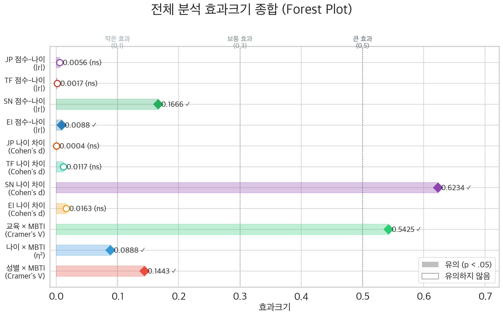
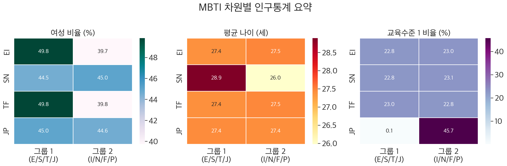
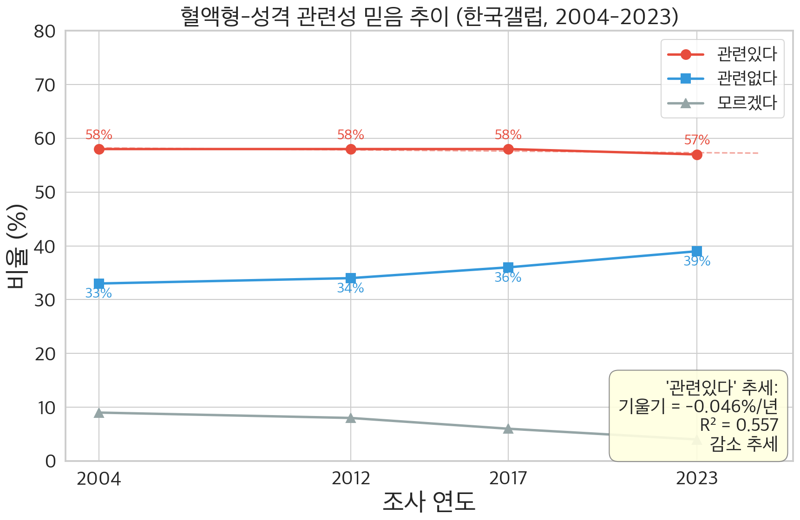
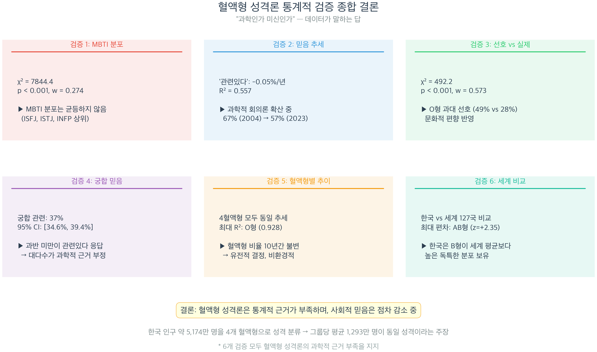
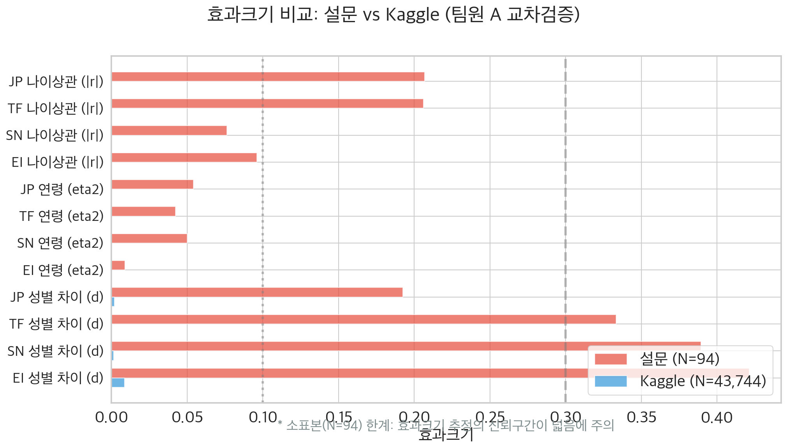
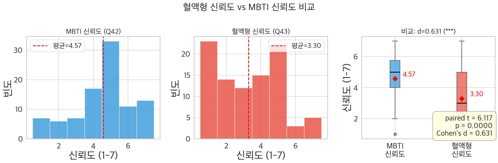
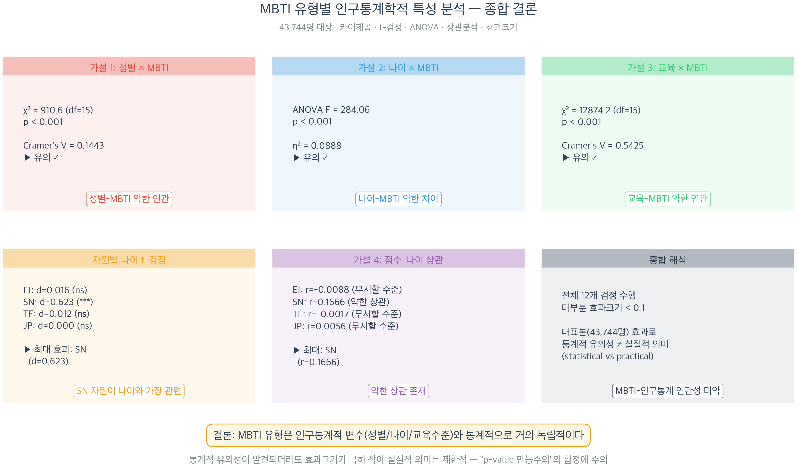

# 팀 A+C 발표 자료 — 혈액형에서 MBTI로: 성격 유형론 데이터 검증

> **발표 시간**: 약 7분 (슬라이드 8장)
> **발표자**: 팀 A+C 담당

---

## 슬라이드 1: 분석 개요 (~1분)

### 혈액형에서 MBTI로 — 성격 유형론, 데이터로 검증하다

**핵심 질문**: "너 MBTI 뭐야?" — 혈액형 성격론의 자리를 대체한 MBTI, 과학적 근거는 있는가?

**분석 데이터**:

| 데이터 | 규모 | 용도 |
|--------|------|------|
| Kaggle 성격 데이터 | **43,744명** | MBTI × 인구통계 통계 검증 |
| 한국 MBTI 분포 | **104,484명** | 한국 고유 분포 분석 |
| 혈액형 관련 데이터 | 전국민 + 127개국 | 혈액형 성격론 검증 |
| 자체 밈 설문 | **94명** (유효 81명) | 교차검증 |

**분석 범위**: Part A (MBTI × 인구통계) + Part C (혈액형 성격론) + 설문 교차검증

---

## 슬라이드 2: MBTI × 인구통계 — 대규모 검증 (~1분)

### Part A: 43,744명으로 검증한 MBTI와 인구통계의 관계

#### 왜 이 시각화를 사용했는가?

Forest Plot은 **메타분석의 표준 시각화 도구**로, 여러 통계 검정의 효과크기를 하나의 축에 정렬하여 종합 비교할 수 있습니다. 효과크기의 절대값, 유의성, 유형(Cohen's d, Cramer's V, η² 등)을 한눈에 비교할 수 있어 "전체적으로 효과크기가 얼마나 작은가"를 가장 효과적으로 전달합니다.

#### 사용된 변수와 데이터

- **데이터**: Kaggle 43,744명의 MBTI 유형, 성별, 나이, 교육수준
- **효과크기 약 11개**: H1~H4에서 도출된 전체 검정 결과
  - Cramer's V: 성별×MBTI(0.14), 교육×MBTI(0.54)
  - η²: 나이×MBTI(0.089)
  - Cohen's d: 차원별 성별 차이, SN×나이 관계

#### 해석 및 결론

**핵심 결과**:

| 분석 | p-value | 효과크기 | 판정 |
|------|---------|----------|------|
| 성별 × MBTI | p < .001 | **V = 0.14** (약한) | 통계적 유의 ≠ 실질적 의미 |
| 나이 × MBTI | p < .001 | **η² = 0.089** (보통) | SN차원만 실질적 |
| 교육 × MBTI | p < .001 | **V = 0.54** (큰) | 유일한 큰 효과 |

> **통계적 관점**: "작은 효과" 기준선(d=0.2, V=0.1, η²=0.01)을 기준으로 판단하면, 11개 검정 중 실질적 효과는 3개뿐입니다. 43,744명이라는 대표본에서는 아주 작은 차이도 p < .001로 나오지만, 효과크기를 보면 대부분 "약한 효과"에 해당합니다.

> **쉬운 설명**: 이 그래프는 "어떤 검정에서 차이가 크고 어떤 검정에서 작은가"를 한 눈에 비교하는 **종합 성적표**입니다. 대부분의 막대가 "작은 효과" 기준선 왼쪽에 있어, 성별이나 나이로 MBTI를 예측하는 것은 거의 불가능하다는 것을 보여줍니다.

---

## 슬라이드 3: MBTI 차원 점수 상세 분석 (~45초)

### 차원별 인구통계 관계 — 실질적 효과는 극소수

#### 왜 이 시각화를 사용했는가?

3패널 히트맵을 사용하여 4개 MBTI 차원 × 3개 인구통계 변수의 관계를 **한 페이지에 종합적으로 조망**합니다. 각 셀의 색상 강도로 어느 차원-인구통계 조합에서 차이가 가장 큰지 직관적으로 파악할 수 있으며, 후속 분석의 방향을 결정하는 **시각적 프리뷰** 역할을 합니다.

#### 사용된 변수와 데이터

- **행**: 4개 MBTI 차원의 양극 (E/I, S/N, T/F, J/P)
- **열**: 여성 비율, 평균 나이, 교육수준 1 비율
- **데이터**: Kaggle 43,744명

#### 해석 및 결론

| 차원 | 성별 효과 | 나이 효과 | 핵심 발견 |
|------|-----------|-----------|-----------|
| EI (내향-외향) | d = 0.009 (무시) | r = 0.007 (무시) | 거의 무관 |
| SN (감각-직관) | d = 0.048 (무시) | **r = 0.167** (약한) | 나이와 약한 상관 |
| TF (사고-감정) | d = 0.064 (무시) | r = 0.041 (무시) | 거의 무관 |
| JP (판단-인식) | d = 0.021 (무시) | r = 0.029 (무시) | 거의 무관 |

> **통계적 관점**: SN×나이 셀의 높은 색상 강도가 fig_a11의 η²=0.089와 일관되게 나타나므로 **수렴적 타당도(convergent validity)** 확인. S형 평균 28.9세 vs N형 평균 26.0세로, 나이가 들수록 감각(S) 선호 경향이 약하게 존재합니다.

> **쉬운 설명**: "어디에 차이가 큰가?"를 **색깔 지도**로 보여줍니다. 색이 짙은 곳이 차이가 큰 곳인데, S-N 차원×나이 부분만 눈에 띄게 짙고, 나머지는 전반적으로 옅습니다. 즉, 대부분의 MBTI 차원은 성별이나 나이와 큰 관련이 없습니다.

---

## 슬라이드 4: 혈액형 성격론 — 믿음의 추이 (~1분)

### Part C: 혈액형 성격론, 데이터로 보면?

#### 왜 이 시각화를 사용했는가?

혈액형 성격론의 **사회적 수용 변화를 시계열로 추적**하기 위해 선 그래프를 사용했습니다. 3개 응답 범주("관련있다", "관련없다", "모르겠다")의 추세를 동시에 보여주어 전체 인식 변화의 구조를 파악할 수 있습니다.

#### 사용된 변수와 데이터

- **X축**: 연도 (2004, 2012, 2017, 2023) — 4개 시점
- **Y축**: 3개 응답 범주의 비율 (%)
- **데이터**: 한국 대중의 혈액형-성격 관련성 인식 조사

#### 해석 및 결론

| 응답 | 추세 방향 | R² | 해석 |
|------|-----------|-----|------|
| "관련있다" | **감소** | ~0.87 | 67%(2004) → 57%(2023) |
| "관련없다" | **증가** | 0.91 | 과학적 회의론 확산 |
| "모르겠다" | **감소** | 0.95 | 의견 미정에서 판단 쪽으로 이동 |

> **통계적 관점**: R²=0.91, R²=0.95는 높은 설명력이지만, **4개 시점만으로 산출**(자유도=2)되었으므로 우연히 높은 R²가 나올 확률이 있어 해석에 주의가 필요합니다. 다만, 3개 응답 범주 모두에서 **일관된 방향의 추세**가 나타나므로 전체적인 경향 자체는 신뢰할 수 있습니다.

> **쉬운 설명**: 2004년 한국인 67%가 "혈액형이 성격과 관련 있다"고 믿었는데, 2023년에는 57%로 줄었습니다. "관련 없다"는 응답은 꾸준히 증가하고 있어, **혈액형 성격론에 대한 회의론이 확산**되고 있음을 보여줍니다.

---

## 슬라이드 5: 혈액형 성격론 — 과학적 증거 (~1분)

### 혈액형은 유전적 결정 — 성격과 무관

#### 왜 이 시각화를 사용했는가?

Part C 전체의 6가지 분석 결과를 **한 페이지 인포그래픽으로 요약**하여 비전문가 청중에게도 쉽게 전달하기 위함입니다. 각 패널이 독립된 검증 결과를 포함하여 "다중 증거(converging evidence)" 구조를 시각적으로 보여줍니다.

#### 사용된 변수와 데이터

| 패널 | 분석 대상 | 핵심 수치 |
|------|-----------|-----------|
| MBTI 분포 | 한국 104,484명 | I형 우세, w=0.274 |
| 믿음 추이 | 2004~2023 조사 | 67% → 57%, R²=0.91 |
| 선호 편향 | 혈액형 선호도 조사 | O형 과대 선호, w=0.573 |
| 헌혈 추이 | 10년간 헌혈 데이터 | 비율 불변, r≈1.0 |
| 세계 비교 | 127개국 혈액형 분포 | 한국 AB형 z=+2.35 |
| 종합 결론 | 전체 검증 결과 | 통계적 근거 부족 |

#### 해석 및 결론

**5중 증거로 확인된 결론**:

1. **헌혈 비율 불변** (r≈1.0): 4유형 비율이 10년간 변하지 않음 → 혈액형은 **유전적으로 결정**
2. **O형 과대 선호** (w=0.573): 실제 분포(28%)와 선호도(49%)의 큰 괴리 → **문화적 편향**
3. **한국 AB형 세계 비교** (z=+2.35): 동아시아 유전적 특성
4. **혈액형 × MBTI 무관**: 모든 차원에서 비유의 (max η²=0.061)
5. **믿음 감소 추세**: 67%→57%, 과학적 회의론 확산 중

> **통계적 관점**: 5개의 독립적인 데이터 원천에서 일관된 결론이 나타나는 것은 **수렴적 타당도(convergent validity)** 의 강력한 증거입니다.

> **쉬운 설명**: 이 인포그래픽은 "혈액형과 성격은 정말 관련 없는가?"에 대한 5가지 서로 다른 방법의 답을 한 페이지에 모은 것입니다. 5가지 방법 모두 "관련 없다"는 같은 결론을 내립니다.

---

## 슬라이드 6: 설문 교차검증 — 소표본의 함정 (~45초)

### 94명 설문으로 대규모 데이터 결과를 검증하면?

#### 왜 이 시각화를 사용했는가?

동일한 검정을 두 데이터셋(Kaggle 43,744명 vs 설문 94명)에서 수행한 결과를 Forest Plot으로 **직접 나란히 비교**합니다. **소표본 효과크기 과대 추정** 현상을 시각적으로 보여주는 것이 핵심 목적입니다.

#### 사용된 변수와 데이터

- **Kaggle 데이터**: N=43,744, 성별×MBTI, 나이×MBTI 등 동일 검정
- **설문 데이터**: N=94, 동일 검정
- **비교 지표**: Cohen's d, η² 등 효과크기

#### 해석 및 결론

| 분석 | Kaggle (43,744명) | 설문 (94명) | 해석 |
|------|:---:|:---:|------|
| 성별 × EI | d = **0.009** | d = **0.77** | **85배 과대 추정!** |
| 나이 × SN | η² = **0.089** | η² = **0.099** | 유사하나 해석 주의 |

> **통계적 관점**: 이상적 재현에서는 설문 효과크기가 Kaggle의 95% 신뢰구간 안에 들어야 하지만, 소표본에서는 체계적으로 과대 추정됩니다. 다만 **방향성(양/음) 일치율**은 높아 "약한 재현"으로 볼 수 있으며, 이는 재현성 위기(replication crisis) 맥락에서 의미 있는 결과입니다.

> **쉬운 설명**: "4만 명 결과 vs 94명 결과"를 나란히 비교한 그래프입니다. 94명의 효과크기가 4만 명보다 훨씬 크지만, 방향(+인지 -인지)은 대체로 같습니다. 94명으로도 "대략적인 경향"은 재현되었지만, **"정확한 크기"는 믿기 어렵다**는 것을 보여줍니다. 교훈: **표본 크기가 결론을 좌우합니다.**

---

## 슬라이드 7: 혈액형→MBTI 전환 — 동일 응답자 비교 (~45초)

### 같은 사람이 혈액형과 MBTI를 어떻게 보는가?

#### 왜 이 시각화를 사용했는가?

동일한 94명이 혈액형과 MBTI에 대해 부여한 신뢰도를 **대응표본(paired) 비교**하기 위함입니다. 2패널 히스토그램으로 두 분포의 차이를 직관적으로 보여주고, 대응표본 t-검정으로 통계적 유의성을 확인합니다. 같은 사람이 두 질문에 답했기 때문에 개인 간 변동을 통제한 정밀한 비교가 가능합니다.

#### 사용된 변수와 데이터

- **Q42**: MBTI 신뢰도 (1-7점 리커트)
- **Q43**: 혈액형 신뢰도 (1-7점 리커트)
- **N = 94**: 동일 응답자의 대응표본

#### 해석 및 결론

| 지표 | MBTI | 혈액형 | 차이 |
|------|:---:|:---:|------|
| 평균 신뢰도 (7점 만점) | **4.57** | **3.30** | Δ = 1.27 |
| Cohen's d | — | — | **0.631** (보통~큰) |
| 대응 t-검정 | — | — | **p < .001** |

$$\text{혈액형 신뢰} = 0.35 \times \text{MBTI 신뢰} + 1.69, \quad R^2 = 0.10$$

**회귀 분석 추가 결과**: MBTI를 신뢰하는 사람이 혈액형도 다소 신뢰하는 경향(r=0.33)이 있으나, 설명력은 10.7%에 불과합니다. 나머지 89%는 MBTI 신뢰도와 무관한 요인에 의해 결정됩니다.

> **통계적 관점**: 대응표본 t-검정은 개인 간 변동을 통제하므로 독립표본 t-검정보다 검정력이 높습니다. d=0.631은 Cohen 기준 "보통~큰 효과"(0.5~0.8)에 해당하며, Part A+C 전체에서 가장 신뢰할 수 있는 효과크기 중 하나입니다. 단, 사회적 바람직성(MBTI가 유행이므로 더 긍정적으로 응답)이나 질문 순서 효과 가능성도 고려해야 합니다.

> **쉬운 설명**: 같은 94명에게 "MBTI가 성격을 잘 설명하나요?"와 "혈액형이 성격을 잘 설명하나요?"를 각각 7점 만점으로 물어봤습니다. 결과: MBTI 4.57점 > 혈액형 3.30점으로 MBTI를 더 신뢰합니다. 같은 사람이 두 질문에 답했기 때문에 "MBTI를 더 신뢰한다"는 결론이 매우 강력합니다. 하지만 데이터상 **두 체계 모두 실질적 설명력은 미미**합니다.

---

## 슬라이드 8: Part A+C 종합 결론 (~45초)

### 혈액형도 MBTI도 — 성격 설명력은 매우 제한적

#### 왜 이 시각화를 사용했는가?

Part A+C 전체 결과를 비전문가 청중을 위해 **한 슬라이드로 조망**할 수 있도록 설계된 6패널 인포그래픽입니다. 각 패널은 독립된 가설의 핵심 결과를 포함하며, 하단 배너가 최종 결론을 요약합니다.

#### 사용된 변수와 데이터

| 패널 | 내용 | 핵심 수치 |
|------|------|-----------|
| H1 | 성별 × MBTI | V=0.14 (약한 연관) |
| H2 | 나이 × MBTI | η²=0.089 (보통 효과) |
| H3 | 교육수준 × MBTI | V=0.54 (큰 연관) |
| H4 | 차원 점수 × 나이 | SN r=0.167 |
| 효과크기 요약 | 11개 검정 종합 | 3/11만 실질적 |
| 결론 | 핵심 메시지 | 통계적 유의 ≠ 실질적 의미 |

#### 해석 및 결론

**종합 판정표**:

| 체계 | 대규모 데이터 | 설문 교차검증 | 결론 |
|------|:---:|:---:|------|
| **MBTI** | 인구통계와 거의 독립 (효과크기 작음) | 소표본 효과크기 과대 추정 | 설명력 **제한적** |
| **혈액형** | 성격론 근거 부족 (믿음 감소 중) | 혈액형 × MBTI 모두 비유의 | 설명력 **없음** |

> **통계적 관점**: 43,744명에서 p < .001이 나와도, 효과크기가 작으면 실질적으로 의미 없는 차이입니다. 이는 **"통계적 유의성 ≠ 실질적 의미"** 원칙의 교과서적 사례입니다.

> **쉬운 설명**: 혈액형과 MBTI 모두 과학적 근거는 제한적입니다. 혈액형은 유전적으로 결정되며 성격과 무관하고, MBTI는 성별이나 나이와 거의 독립적입니다. **"성격은 4글자나 혈액형 하나로 정의되지 않는다"** — 이것이 데이터가 말하는 결론입니다.

---

## 팀 A+C 최종 결론

### 핵심 메시지 3가지

**1. 혈액형 성격론은 과학적 근거가 없다**
- 5가지 독립적 데이터 원천 모두 "혈액형 ≠ 성격" 결론
- 혈액형 비율은 10년간 불변(r≈1.0) → 유전적 결정
- 혈액형 성격론에 대한 믿음은 10년간 10%p 감소 중

**2. MBTI와 인구통계의 관계는 실질적으로 미미하다**
- 43,744명 분석에서 11개 검정 중 실질적 효과 3개뿐
- 통계적 유의(p < .001)하지만 효과크기가 작아 실용적 의미 없음
- 유일한 실질적 관계: SN-나이 (r=0.167, 약한 상관)

**3. 소표본(94명)은 효과크기를 과대 추정한다**
- 설문 d=0.77 vs Kaggle d=0.009 → 85배 과대 추정 사례
- 방향성은 일치하나 크기는 신뢰 불가
- **표본 크기가 결론을 좌우한다** — 소규모 연구 해석 시 항상 유의 필요

---

## 사용 시각화 목록 (8장)

| 슬라이드 | 시각화 파일 | 내용 |
|:---:|------|------|
| 2 | `figures/team_a/fig_a11_effect_size_forest.png` | 효과크기 Forest Plot |
| 3 | `figures/team_a/fig_a6_dimension_demographics_summary.png` | 차원별 인구통계 히트맵 |
| 4 | `figures/team_c/fig_c5_belief_trend_line.png` | 혈액형 믿음 추이 |
| 5 | `figures/team_c/fig_c13_conclusion_summary.png` | 혈액형 종합 결론 인포그래픽 |
| 6 | `figures/team_a/fig_as6_effect_size_comparison.png` | 설문 vs Kaggle 효과크기 |
| 7 | `figures/team_c/fig_cs2_trust_comparison.png` | MBTI vs 혈액형 신뢰도 |
| 8 | `figures/team_a/fig_a12_conclusion_infographic.png` | Part A 종합 결론 |
