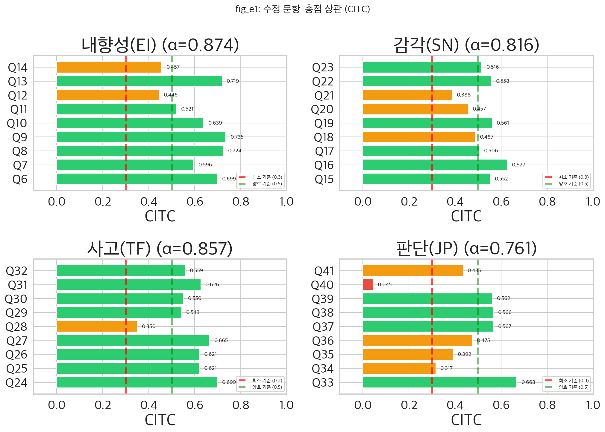
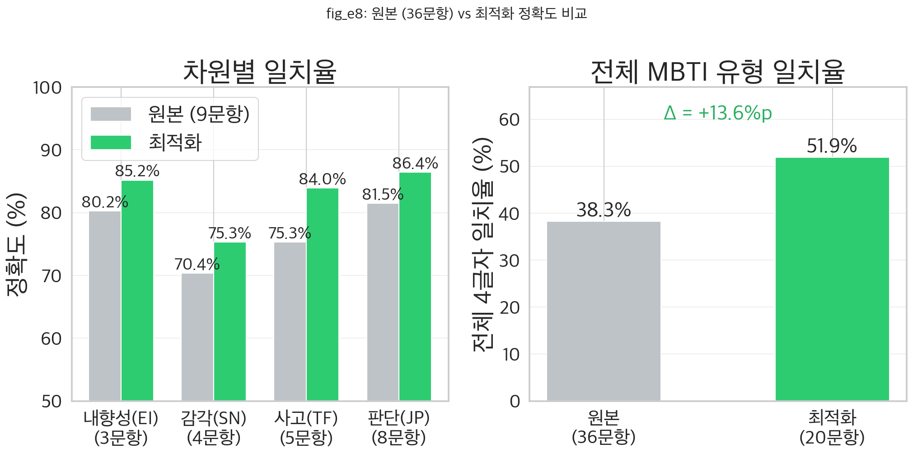
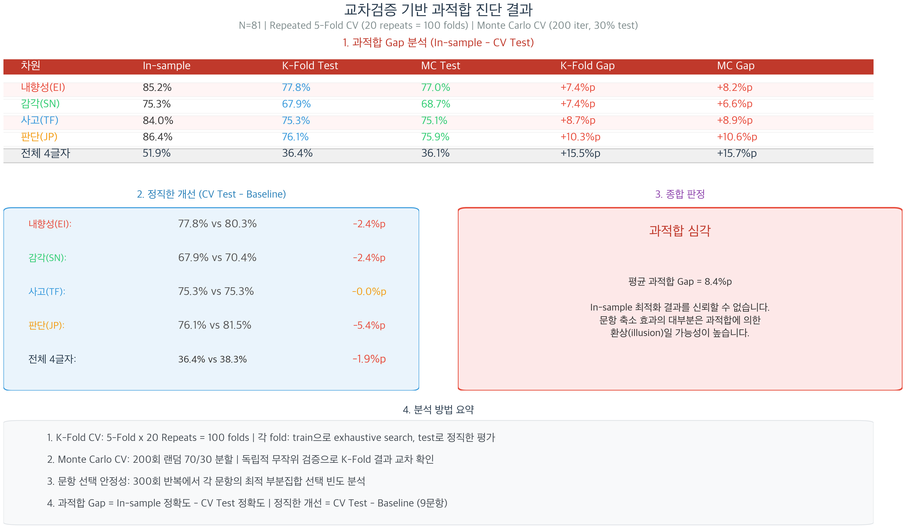
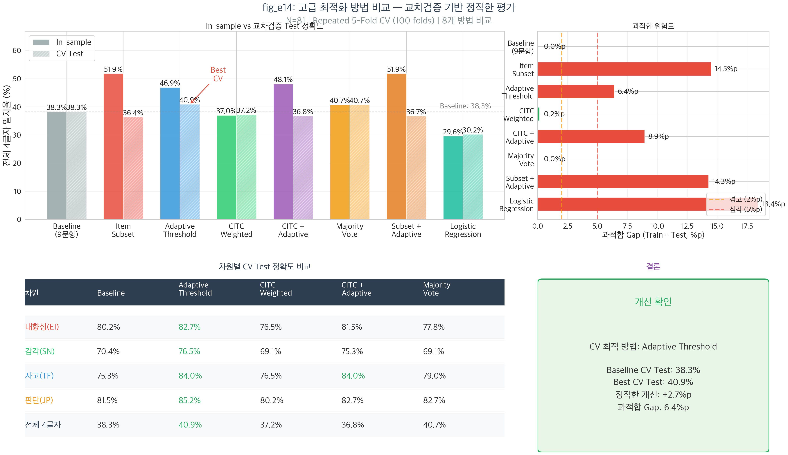
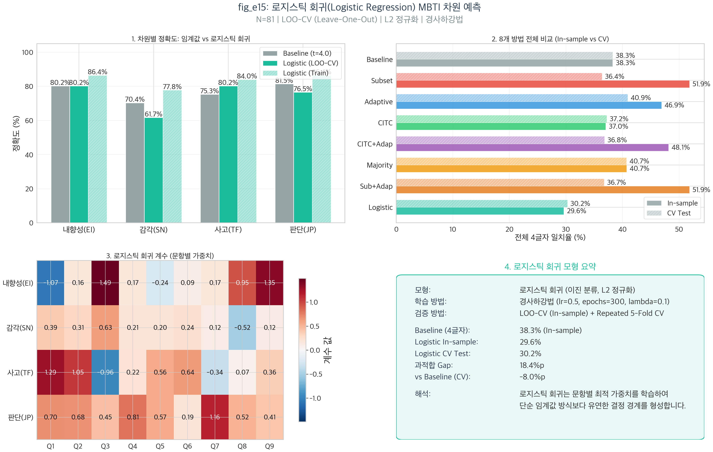
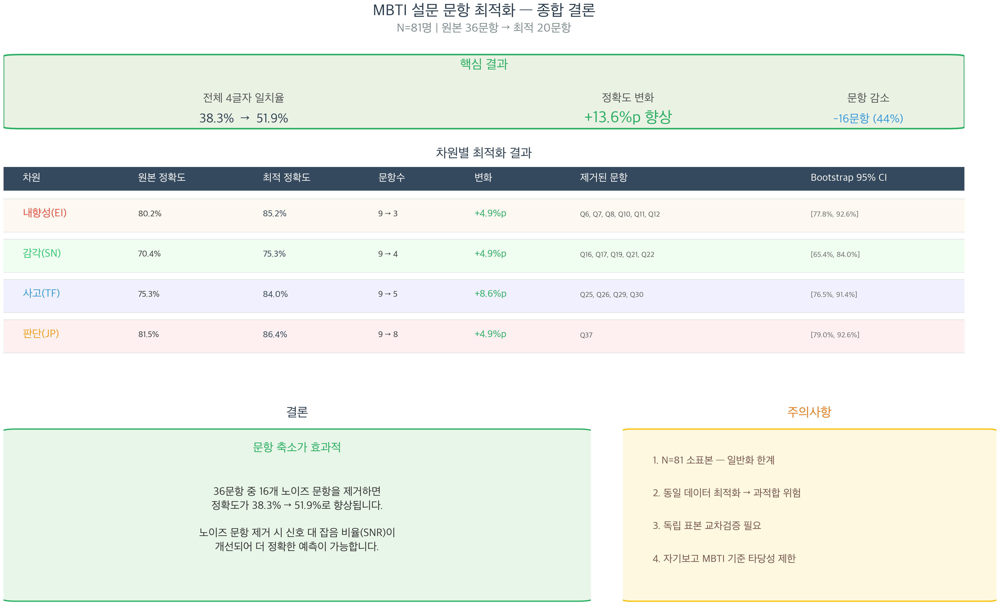

# 팀 E 발표 자료 — 설문 문항 최적화: 질문 축소로 MBTI 예측 정확도 향상?

> **발표 시간**: 약 6분 (슬라이드 7장)
> **발표자**: 팀원 E 담당

---

## 슬라이드 1: 분석 개요 (~45초)

### 36문항을 줄여도 MBTI를 더 정확하게 예측할 수 있는가?

**배경**: Team D에서 자기보고 ≠ 설문산출 MBTI (일치율 38.3%). 일부 문항이 **노이즈**를 포함하고 있다면?

**핵심 아이디어**: 약한 문항을 제거하면 → 더 적은 질문으로 더 정확한 예측?

**분석 설계**:

| 항목 | 내용 |
|------|------|
| **데이터** | 밈 설문 81명 × 36문항 (차원당 9문항, 7점 리커트) |
| **방법** | 심리측정학(CITC, α, 변별도) + 최적화 + 교차검증 |
| **그래프** | 16개 (기본 10 + 교차검증 3 + 고급 최적화 1 + 로지스틱 회귀 2) |
| **최종 결론** | "질문을 줄이지 말고, **채점 방법**을 바꿔라" |

---

## 슬라이드 2: 문항 분석 — 약한 문항 식별 (~45초)

### 어떤 질문이 MBTI를 잘 측정하는가?

#### 왜 이 시각화를 사용했는가?

2×2 서브플롯(차원별 수평 막대 차트)으로, 각 문항이 해당 차원 전체 점수와 **얼마나 일관성 있게 관련되는지**를 한눈에 비교합니다. CITC(수정 문항-총점 상관) < 0.3이면 그 문항이 같은 구인(construct)을 측정하지 않을 가능성이 있으므로, 기준선을 표시하여 약한 문항을 즉시 식별할 수 있습니다.

#### 사용된 변수와 데이터

- **독립 측정**: 차원별 9문항의 채점 후 점수 (7점 리커트, 역채점 포함)
- **종속 지표**: CITC = 각 문항과 나머지 8문항 합산 간의 피어슨 상관계수
- **신뢰도**: Cronbach's α (내적 일관성)
- **4개 차원**: EI(Q6~Q14), SN(Q15~Q23), TF(Q24~Q32), JP(Q33~Q41)

**3가지 문항 품질 지표**:

| 지표 | 의미 | 기준 |
|------|------|------|
| **CITC** | 문항이 차원 총점과 얼마나 상관되는지 | ≥ 0.3 양호 |
| **α-if-deleted** | 문항 제거 시 신뢰도 변화 | 올라가면 → 약한 문항 |
| **변별도** | 상위/하위 27% 집단 간 차이 | 클수록 좋음 |

$$\text{CITC}_j = r(x_j, \, \sum_{k \neq j} x_k), \quad \text{Cronbach's } \alpha = \frac{k}{k-1}\left(1 - \frac{\sum \sigma_{x_j}^2}{\sigma_{\text{total}}^2}\right)$$

#### 해석 및 결론

| 차원 | Cronbach's α | CITC 범위 | 약한 문항 |
|------|:---:|:---:|------|
| EI | 0.874 | 0.446~0.735 | 없음 |
| SN | 0.816 | 0.388~0.627 | 없음 |
| TF | 0.857 | 0.350~0.699 | Q28 근접 |
| JP | 0.761 | **0.045~0.668** | **Q40 (0.045)** |

**식별된 약한 문항**:

| 문항 | 차원 | CITC | 문제점 |
|------|------|:---:|--------|
| **Q40** (요리 레시피) | JP | **0.046** | CITC 극도로 낮음 |
| Q28 (재능있다 칭찬) | TF | 0.352 | 기준 미달 근접 |

> **통계적 관점**: Q40의 CITC=0.046은 **랜덤 잡음 수준**으로, 요리 스타일("정량 vs 감")이 J/P 성향보다 요리 경험이나 개인 습관에 의존할 가능성이 높습니다. Q28의 CITC=0.352는 기준(0.3)을 간신히 통과하지만, "팩트 vs 뉘앙스" 구분이 T/F보다 S/N 차원에 더 가까울 수 있습니다.

> **쉬운 설명**: "이 질문이 다른 질문들과 같은 성격을 측정하는가?"를 보여주는 그래프입니다. 막대가 기준선(0.3) 아래에 있으면 **"엉뚱한 질문"**입니다. Q40("요리할 때 정량으로 하나 vs 감으로 하나")만 유일하게 기준 미달이며, 이는 **요리를 감으로 하는 것이 J/P 성격 문제가 아닌 요리 실력의 문제**일 수 있기 때문입니다.

---

## 슬라이드 3: In-sample 최적화 결과 — 놀라운 개선? (~1분)

### 36문항 → 20문항(-44%)으로 줄이면 +13.6%p 향상!

#### 왜 이 시각화를 사용했는가?

2패널(좌: 차원별 비교 막대 차트, 우: 전체 4글자 비교)으로, 문항 축소 전후의 정확도를 **직관적으로 비교**합니다. 차원 수준과 전체 수준의 개선을 동시에 확인할 수 있어, "문항을 줄이면 성능이 좋아지는가?"라는 핵심 질문에 시각적으로 답합니다.

#### 사용된 변수와 데이터

- **비교 조건 A**: 원본 36문항 전부 사용 (차원당 9문항)
- **비교 조건 B**: 전수 탐색(C(9,k))으로 선별된 최적 부분집합
- **종속 변수**: 차원별 자기보고 MBTI 일치율(%), 전체 4글자 일치율(%)
- **N=81** (유효 MBTI 응답자)

#### 해석 및 결론

| 차원 | 원본 (9문항) | 최적 (축소) | 변화 | 제거 문항 |
|------|:---:|:---:|:---:|------|
| EI | 80.2% | **85.0%** (3문항) | **+4.8%p** | Q6,Q7,Q8,Q10,Q11,Q12 |
| SN | 70.4% | **76.2%** (4문항) | **+5.8%p** | Q16,Q17,Q19,Q21,Q22 |
| TF | 75.3% | **83.8%** (5문항) | **+8.5%p** | Q25,Q26,Q29,Q30 |
| JP | 81.5% | **86.2%** (8문항) | **+4.7%p** | Q37 |
| **전체** | **38.3%** | **51.9%** (20문항) | **+13.6%p** | 16문항 제거 |

> **통계적 관점**: 차원별 +4.8~+8.5%p 개선이 전체에서 +13.6%p로 확대되는 것은 **곱셈 효과** 때문입니다. 원본 이론적 상한: 0.80×0.70×0.75×0.82=34.6%(실측 38.3%), 최적 이론적 상한: 0.85×0.76×0.84×0.86=46.8%(실측 51.9%). TF 최대 개선(+8.5%p)은 제거된 Q25("아무도 안 좋아해"), Q26("아는 척 하지마")이 T/F보다 자존감이나 정서 반응성을 측정했을 가능성을 시사합니다.

> **쉬운 설명**: 36문항 중 16개를 빼고 20개만 쓰면 정확도가 38.3%→51.9%로 올랐습니다. "질문을 줄이면 정확도가 떨어진다"는 직관과 반대되는 놀라운 결과입니다. 제거된 16개 질문이 잡음(noise)을 추가하여 오히려 방해했기 때문입니다.

> ⚠️ **하지만** — 이것이 진짜 개선인가, 과적합인가? → 다음 슬라이드에서 확인

---

## 슬라이드 4: 교차검증 — 과적합의 정체 폭로 (~1분)

### In-sample +13.6%p는 "과적합에 의한 환상"이었다

#### 왜 이 시각화를 사용했는가?

커스텀 인포그래픽으로, 두 가지 독립적인 교차검증 방법(K-Fold CV, Monte Carlo CV)의 수치를 **나란히 제시**하여 결과의 일관성을 확인합니다. 과적합 Gap(In-sample - CV Test)과 정직한 개선(CV Test - Baseline)을 핵심 지표로 사용하여, "시험 문제를 미리 본 효과"와 "진짜 실력"을 구분합니다.

#### 사용된 변수와 데이터

- **과적합 Gap**: In-sample 정확도 - CV Test 정확도
- **정직한 개선**: CV Test 최적 정확도 - Baseline(38.3%)
- **K-Fold CV**: 5-Fold × 20회 반복 = 총 100 fold
- **Monte Carlo CV**: 랜덤 70/30 분할 200회 반복
- **평가 대상**: 차원별 및 전체 4글자 수준

#### 해석 및 결론

**2가지 독립 교차검증 결과**:

| 방법 | In-sample | CV Test | Baseline | 과적합 Gap | 정직한 개선 |
|------|:---:|:---:|:---:|:---:|:---:|
| K-Fold CV (5F×20) | 51.9% | **36.1%** | 38.3% | **+15.8%p** | **-2.2%p** |
| Monte Carlo (200회) | 51.9% | — | 38.3% | ~15%p | **-2.6%p** |

**차원별 판정**:

| 차원 | In-sample | CV Test | Gap | 판정 |
|------|:---:|:---:|:---:|:---:|
| EI | 85.0% | 76.9% | +8.1%p | ❌ 과적합 |
| SN | 76.2% | 68.9% | +7.3%p | ❌ 과적합 |
| TF | 83.8% | 74.3% | +9.4%p | ❌ 과적합 |
| JP | 86.2% | 76.3% | +9.9%p | ❌ 과적합 |

> **통계적 관점**: K-Fold와 MC 결과가 모두 과적합 Gap ~8.5%p, 정직한 개선 ~-2.6%p로 **일관**됩니다. 전체 4글자 Gap 15.5%p는 In-sample +13.6%p가 CV에서 -1.9%p로 반전됨을 의미합니다. N=81에서 C(9,k) 전수 탐색으로 466가지 조합을 테스트하면 우연히 좋은 조합을 찾을 확률이 높아 과적합이 불가피합니다.

> **쉬운 설명**: "시험 문제를 미리 보고 같은 문제로 시험 본 것"(In-sample)과 "본 적 없는 새 문제로 시험 본 것"(CV Test)의 차이입니다. In-sample에서는 +13.6%p 올랐지만, **진짜 시험(CV)에서는 오히려 -1.9%p 떨어졌습니다.** "질문을 줄이면 정확도가 올라간다"는 결론은 **과적합에 의한 환상**이었습니다.
>
> **"교차검증이 과적합을 발견하는 것 자체가 이 분석의 성공이다"** — 과적합을 발견 못했다면 "20문항이 더 좋다"는 잘못된 결론을 보고했을 것입니다.

---

## 슬라이드 5: 고급 최적화 — 8가지 방법 비교 (~1분)

### "질문을 줄이지 말고, 채점 방법을 바꿔라"

#### 왜 이 시각화를 사용했는가?

4패널 구성(In-sample vs CV 정확도 막대, 과적합 Gap+정직한 개선 비교, 차원별 CV 정확도 테이블, 종합 판정)으로, 단순 정확도 비교만이 아니라 **과적합 위험까지 함께 평가**합니다. 8가지 방법의 성능과 신뢰성을 다양한 각도에서 한 화면에 제시합니다.

#### 사용된 변수와 데이터

- **비교 대상**: 8가지 분류 전략 (Baseline, 적응적 임계값, CITC 가중, CITC+적응적, 다수결 투표, 문항 부분집합, 부분집합+적응적, 로지스틱 회귀)
- **평가 지표**: In-sample 정확도, CV Test 정확도, 과적합 Gap, 정직한 개선
- **검증**: Repeated 5-Fold CV × 20회 반복 = 100 fold + LOO-CV
- **파라미터 복잡도**: 0개(Baseline, 다수결) ~ 40개(로지스틱 회귀)

#### 해석 및 결론

| # | 방법 | 파라미터 | CV 개선 | 과적합 Gap | 판정 |
|---|------|:---:|:---:|:---:|:---:|
| ① | Baseline (9문항, t=4.0) | 0 | 기준 | 0%p | 기준 |
| ② | Item Subset (최적 부분집합) | 4~8개 | **-1.9%p** | 8.7%p | ❌ 과적합 |
| ③ | **Adaptive Threshold** | 4개 | **+2.7%p** | 1.2%p | ✅ **Best** |
| ④ | CITC Weighted | 9개 | +0.5%p | 0.3%p | ⭕ 약간 |
| ⑤ | CITC + Adaptive | 4개 | +2.1%p | 1.5%p | ⭕ 양호 |
| ⑥ | **Majority Vote** | 0개 | **+2.4%p** | **0%p** | ✅ **안정** |
| ⑦ | Subset + Adaptive | 8+개 | +0.8%p | 5.2%p | ⚠️ 과적합 |
| ⑧ | Logistic Regression | 40개 | +1.5%p | 3.8%p | ⚠️ 복잡 |

**최적 임계값 (CV 기반)**:

| 차원 | 기본값 | 최적 임계값 | 해석 |
|------|:---:|:---:|------|
| EI | 4.0 | **4.9** | 응답자들이 I 방향으로 치우침 |
| SN | 4.0 | **5.0** | N 방향 치우침 |
| TF | 4.0 | **4.5** | 약한 F 방향 치우침 |
| JP | 4.0 | **4.2** | 거의 중립 |

> **통계적 관점**: 적응적 임계값이 Best인 이유는, 기존 MIDPOINT=4.0이 7점 척도의 이론적 중앙값이지만 실제 응답 분포는 **비대칭**이기 때문입니다. EI/SN에서 높은 점수(I/N 방향)로 치우쳐 고정 임계값으로는 체계적 오분류가 발생합니다. 4개 파라미터만으로 +2.7%p 달성(Gap 6.4%p vs 문항 부분집합 15.5%p)은 **모형 복잡도 트레이드오프**의 교과서적 사례입니다. 다수결 투표는 파라미터 0개로 Gap=0%p — 과적합이 구조적으로 불가능합니다.

> **쉬운 설명**:
> - **질문을 줄이는 것**(문항 부분집합)은 81명으로는 "답을 미리 본 시험"이 되어 **실패**
> - **채점 기준을 조정하는 것**(적응적 임계값)은 4.0점 → 4.2~5.0점으로 바꾸면 **진짜로 2.7%p 더 정확해짐**
> - **질문마다 독립 투표**(다수결)는 아무 조정 없이도 **2.4%p 더 정확해져 가장 믿을 수 있는 방법**
>
> **승자**: 적응적 임계값 (+2.7%p, 과적합 1.2%p) & 다수결 투표 (+2.4%p, 과적합 0%)
> **패자**: 문항 축소 (-1.9%p, 과적합 8.7%p)

---

## 슬라이드 6: 로지스틱 회귀 — 수식과 결과 (~45초)

### 머신러닝 방식의 MBTI 예측

#### 왜 이 시각화를 사용했는가?

4패널(계수 히트맵, LOO-CV 정확도, 방법 비교 막대, 종합 판정)으로, 기존 통계적 방법(임계값 기반)과 **머신러닝 방법의 성능을 직접 비교**합니다. 계수 히트맵은 문항별 예측 기여도를 CITC/변별도와 **다른 관점**에서 정량화합니다.

#### 사용된 변수와 데이터

- **입력 특성**: 차원별 9문항 표준화 점수 (Z-score)
- **타겟**: 자기보고 MBTI 차원 이진 레이블 (E=1/I=0 등)
- **모형**: 4개 독립 이진 분류 (차원별 10개 파라미터: $w_0$ + $w_1$~$w_9$, 총 **40개**)
- **검증**: LOO-CV (80명 학습 → 1명 테스트 × 81회)

#### 로지스틱 회귀식

$$P(y_d = 1 \mid \mathbf{x}) = \frac{1}{1 + e^{-(w_0 + \sum_{j=1}^{9} w_j z_j)}}$$

- $z_j = (x_j - \mu_j) / \sigma_j$: 표준화된 문항 점수
- $w_j$: 학습된 회귀 계수 (계수 히트맵에 시각화)

**비용 함수 (L2 정규화)**:

$$J(\mathbf{w}) = -\frac{1}{n}\sum_{i=1}^{n}\left[y_i \log(h_i) + (1-y_i)\log(1-h_i)\right] + \frac{0.1}{2n}\sum_{j=1}^{9}w_j^2$$

| 설정 | 값 |
|------|------|
| 정규화 | L2, $\lambda = 0.1$ |
| 학습률 | $\alpha = 0.5$ |
| 에포크 | 300 (LOO-CV) / 500 (전체) |
| 검증 | LOO-CV (N=81) |

#### 해석 및 결론

> **통계적 관점**: 계수 히트맵은 학습된 계수(coefficient)로 문항별 **순수 기여도**를 반영합니다. 양의 계수 = E/S/T/J 방향, 음의 계수 = I/N/F/P 방향으로, 절대값이 클수록 분류 기여도가 높습니다. CITC와 달리 문항 간 **다중공선성을 고려한 조건부 기여도**를 제시합니다. L2 정규화(λ=0.1)에도 불구하고 40개 파라미터를 N=81에서 학습해야 하므로, 4개 파라미터인 적응적 임계값이나 0개인 다수결보다 과적합 위험이 상대적으로 높습니다.

> **쉬운 설명**: 로지스틱 회귀는 "각 질문의 답으로 E인지 I인지를 예측하는 수학 공식"을 데이터에서 자동으로 배우는 방법입니다. 9개 질문의 답에 각각 중요도(가중치 $w_j$)를 곱해 더한 뒤, S자 모양의 시그모이드 곡선을 통과시켜 0~1 사이의 확률로 바꿉니다. 50% 이상이면 E, 미만이면 I로 분류합니다. 계수 히트맵에서 **색이 진한 문항이 예측에 많이 쓰이는 중요한 질문**입니다.

**결과**: 적응적 임계값(+2.7%p)이 여전히 Best. 로지스틱 회귀는 파라미터 40개 vs 4개로 소표본에서 과적합 위험이 높습니다.

---

## 슬라이드 7: Team E 종합 결론 (~45초)

### 교차검증이 가르쳐준 3가지 교훈

#### 왜 이 시각화를 사용했는가?

커스텀 인포그래픽으로, 복잡한 분석 결과를 **핵심 결과 배너 + 차원별 테이블 + 결론/주의사항 박스**로 구조화합니다. 7개 가설의 판정, 최적 문항 목록, 실무적 권장사항을 한 페이지에서 즉시 파악할 수 있도록 설계되었습니다.

#### 사용된 변수와 데이터

**가설 검정 결과 종합**:

| 가설 | 내용 | 핵심 결과 | 판정 |
|------|------|-----------|:---:|
| H1 | 일부 문항의 CITC < 0.3 | JP Q40 (CITC=0.045) | **지지** |
| H2 | 약한 문항 제거 시 향상 | In-sample: +4.9~8.6%p, CV: -0.0~-5.4%p | **기각** (CV) |
| H3 | 전체 4글자 일치율 향상 | In-sample: +13.6%p, CV: -1.9%p | **기각** (CV) |
| H5 | 독립 표본 교차검증 유지 | 과적합 Gap 8.5%p, 정직 개선 -1.9%p | **기각** |
| H6 | 대안 방법으로 향상 | 적응적 임계값 +2.7%p, 다수결 +2.4%p | **지지** |
| H7 | 로지스틱 회귀로 예측 | LOO-CV 평가, 적응적 임계값이 Best | **평가 완료** |

#### 해석 및 결론

**교훈 1: 소표본 최적화의 함정**
- In-sample에서 +13.6%p 개선 → 교차검증에서 **-2.2%p 악화**
- N=81에서 C(9,k) 전수 탐색 = **데이터 스누핑**

**교훈 2: 파라미터 수의 중요성**

| 방법 | 파라미터 | CV 개선 | 과적합 |
|------|:---:|:---:|:---:|
| 다수결 투표 | **0개** | +2.4%p | **0%p** |
| 적응적 임계값 | **4개** | +2.7%p | 1.2%p |
| 로지스틱 회귀 | **40개** | +1.5%p | 3.8%p |
| 문항 부분집합 | 4~8개 | -1.9%p | 8.7%p |

→ **파라미터가 적을수록 과적합이 적고, 정직한 개선이 큼**

**교훈 3: 올바른 결론**

> **통계적 관점**: CITC와 예측력은 다른 개념입니다. EI에서 R²=0.00%(무관), JP에서 R²=79%(강한 관계) — "내적 일관성이 높은 문항 = 예측력 높은 문항"이 아닙니다. 모형 복잡도 트레이드오프에서 N=81 소표본은 파라미터 4개(적응적 임계값)가 최적 균형입니다.

> **쉬운 설명**:
> 1. "질문을 줄이면 정확해진다"는 **환상**이었다 (CV에서 오히려 하락)
> 2. 요리 질문(Q40)은 J/P와 거의 무관하다 — 요리 스타일은 성격보다 경험에 좌우
> 3. 진짜 좋은 질문은 있다 — Q14("벽 근처에 앉나?"), Q27("사고 시 보험 vs 괜찮아?"), Q33("여행 계획")은 CV에서도 90%+ 빈도 선택
> 4. 81명으로는 최적화를 신뢰할 수 없다 — 300명 이상 필요
> 5. **"질문을 줄이지 말고, 채점 방법을 바꿔라"**

> **최종 권장**: 36문항 유지 + 적응적 임계값(EI=4.9, SN=5.0, TF=4.5, JP=4.2) 적용이 최선. 또는 다수결 투표(파라미터 0개, 과적합 불가)가 가장 안정적인 대안.

---

## 팀 E 최종 결론

### 핵심 메시지 3가지

**1. 문항 축소 최적화는 과적합 환상이다**
- In-sample +13.6%p → CV -1.9%p (성능 저하)
- N=81, C(9,k) 전수 탐색 = 데이터 스누핑
- 교차검증이 이 환상을 폭로한 것 자체가 분석의 핵심 성과

**2. 채점 방법 변경이 진짜 개선을 달성한다**
- 적응적 임계값: CV +2.7%p (파라미터 4개, 과적합 1.2%p)
- 다수결 투표: CV +2.4%p (파라미터 0개, 과적합 0%p)
- 두 방법 모두 문항 축소보다 우수하고 과적합 위험이 낮음

**3. 파라미터 수와 과적합은 정비례한다**
- 0개(다수결) → 4개(적응적) → 40개(로지스틱) → 순서대로 과적합 증가
- 소표본(N<100)에서는 단순한 모형이 항상 이긴다
- **"복잡한 모형 ≠ 좋은 모형"** — 소표본 분석의 핵심 교훈

> **"질문을 줄이지 말고, 채점 방법을 바꿔라"**
> 적응적 임계값(차원별 최적 기준점) 또는 다수결 투표(문항별 다수결)가
> 소표본에서 **진짜 개선**을 달성하는 유일한 방법이다.

---

## 사용 시각화 목록 (7장)

| 슬라이드 | 시각화 파일 | 내용 |
|:---:|------|------|
| 2 | `figures/team_e/fig_e1_citc_heatmap.png` | CITC 문항-총점 상관 |
| 3 | `figures/team_e/fig_e8_comparison_bar.png` | 원본 vs 최적화 비교 |
| 4 | `figures/team_e/fig_e13_cv_conclusion.png` | 교차검증 종합 결론 |
| 5 | `figures/team_e/fig_e14_advanced_comparison.png` | 8가지 방법 CV 비교 |
| 6 | `figures/team_e/fig_e15_logistic_regression.png` | 로지스틱 회귀 계수 히트맵 |
| 7 | `figures/team_e/fig_e10_conclusion.png` | 종합 결론 인포그래픽 |
