# 팀 A+C (통합): 혈액형에서 MBTI로 — 성격 유형론 데이터 검증 결과 보고서

> **보고서 작성일**: 2026-03-01

> **주제**: 혈액형 성격론의 자리를 대체한 MBTI, 과학적 근거는 있는가? 두 체계 모두 데이터로 검증
> **데이터**: Kaggle 43,744명 + 한국 고유 데이터 (MBTI 104,484명, 혈액형 분포, 믿음 추이) + 자체 밈 설문 94명
> **분석 도구**: NumPy, Matplotlib, Seaborn, SciPy
> **시각화**: 총 39개 (Part A 본 12 + 설문 7 / Part C 본 13 + 설문 7)

---

## 목차

0. [이 보고서를 읽기 전에](#0-이-보고서를-읽기-전에) — 통계 용어 사전, 핵심 메시지 요약
1. [연구 개요](#1-연구-개요)
2. [Part A: MBTI × 인구통계 분석](#2-part-a-mbti--인구통계-분석)
3. [Part A 설문 교차검증](#3-part-a-설문-교차검증)
4. [Part C: 한국 혈액형 성격론 검증](#4-part-c-한국-혈액형-성격론-검증)
5. [Part C 설문 교차검증](#5-part-c-설문-교차검증)
6. [통합 종합 결론](#6-통합-종합-결론)
7. [부록: 그래프 목록 및 통계 요약표](#7-부록-그래프-목록-및-통계-요약표)

> 📊 = 통계 해설 | 💡 = 비전공자를 위한 설명

---

## 0. 이 보고서를 읽기 전에

### 0.1 비전공자를 위한 안내

이 보고서에는 통계 분석 결과가 포함되어 있습니다. 각 그래프마다 다음 구조로 설명합니다:

- **시각화 방법 / 사용 이유 / 사용 변수 / 결과 해석** — 기본 분석 내용
- **📊 통계적 관점** — 통계학 전공자를 위한 심화 해설 (검정 선택 근거, 가정 점검, 검정력 이슈 등)
- **💡 쉬운 설명** — 비전공자를 위한 일상 언어 해설

💡 마크가 붙은 부분만 읽어도 핵심 결론을 이해할 수 있습니다.

### 0.2 핵심 통계 용어 사전

> 이 보고서에서 자주 등장하는 통계 용어를 일상 언어로 풀어 설명합니다.

| 용어                             | 기호                  | 쉬운 설명                                                                                                                                                       |
| -------------------------------- | --------------------- | --------------------------------------------------------------------------------------------------------------------------------------------------------------- |
| **p-value (유의확률)**     | p                     | "우연히 이런 결과가 나올 확률". p < 0.05이면 "우연이 아닐 가능성이 높다"고 판단합니다. 하지만**p가 작다고 해서 차이가 크다는 뜻은 아닙니다.**             |
| **효과크기 (Effect Size)** | η², d, V, w, R² 등 | "차이가 실제로 얼마나 큰가"를 나타내는 숫자. p-value가 "차이가 있는가?"를 알려준다면, 효과크기는 "**얼마나** 차이나는가?"를 알려줍니다.                   |
| **η² (에타 제곱)**       | η²                  | "그룹 차이가 전체 변동의 몇 %를 설명하는가". 0.01 미만이면 사실상 차이가 없다고 봅니다. (작은 효과: 0.01~0.06, 보통: 0.06~0.14, 큰 효과: 0.14 이상)            |
| **Cohen's d**              | d                     | "두 그룹의 평균 차이를 표준편차 단위로 표현". d=0.5라면 "한 그룹이 평균적으로 0.5 표준편차만큼 더 높다"는 의미입니다. (작은 효과: 0.2, 보통: 0.5, 큰 효과: 0.8) |
| **Cramer's V**             | V                     | "두 범주형 변수 사이의 연관 강도". 0이면 완전히 무관, 1이면 완벽한 연관. 0.1 미만이면 거의 관계 없다고 봅니다.                                                  |
| **Cohen's w**              | w                     | "적합도 검정에서의 효과크기". 관측 분포와 기대 분포의 차이 크기를 나타냅니다. (작은: 0.1, 보통: 0.3, 큰: 0.5 이상)                                              |
| **R² (결정계수)**         | R²                   | "한 변수가 다른 변수를 얼마나 잘 예측/설명하는가". R²=0.91이면 "91%를 설명한다"로 매우 높은 수준.                                                              |
| **상관계수**               | r                     | "두 변수가 함께 움직이는 정도". +1이면 완벽한 비례, -1이면 완벽한 반비례, 0이면 무관.                                                                           |
| **z-score**                | z                     | "한국의 값이 세계 평균에서 표준편차 몇 개만큼 떨어져 있는가".\|z\| > 1.96이면 상위/하위 2.5%에 해당하여 통계적으로 유의합니다.                                  |
| **카이제곱 검정**          | χ²                  | "범주형 변수 간의 관계를 검정". 독립성 검정은 "두 변수가 관련 있는가?", 적합도 검정은 "분포가 기대와 다른가?"를 확인합니다.                                     |
| **ANOVA (분산분석)**       | F                     | "3개 이상 그룹의 평균이 같은지 비교하는 검정". 예: "MBTI 16유형의 평균 나이가 같은가?"                                                                          |
| **대응표본 t-검정**        | t                     | "같은 사람에게 두 가지를 측정하여 비교". 예: "같은 94명이 MBTI와 혈액형을 각각 얼마나 신뢰하는가?"                                                              |
| **95% 신뢰구간**           | 95% CI                | "참값이 이 범위 안에 있을 확률이 95%". 범위가 좁을수록 추정이 정밀합니다.                                                                                       |

### 0.3 이 보고서의 핵심 메시지 (요약)

> 결론을 먼저 알고 싶은 분을 위해:

**"혈액형에서 MBTI로 — 분류 체계는 바뀌었지만, 한계는 동일하다."**

- **Part A**: MBTI 16유형과 인구통계(성별, 나이, 교육) 사이에는 통계적으로 유의한 차이가 있지만, 효과크기가 작아 **실생활에서 의미 있는 수준이 아닙니다** (예: 성별에 따른 MBTI 차이는 겨우 V=0.14)
- **Part C**: 혈액형 성격론은 **데이터에서 지지받지 못합니다**. 혈액형별 헌혈 비율은 10년간 불변(r≈1.0)이고, 혈액형과 MBTI 차원 점수도 무관합니다
- **설문 검증**: 동일한 94명에게 물어본 결과, MBTI 신뢰도(4.57/7) > 혈액형 신뢰도(3.30/7)이지만, 두 체계 모두 성격 설명력은 제한적입니다
- 비유하면: 혈액형으로 성격을 분류하는 것은 "생일의 월(月)로 성격을 분류하는 것"과 비슷한 수준이며, MBTI도 예상보다 설명력이 낮습니다

---

## 1. 연구 개요

### 1.1 연구 배경

2000년대 초반까지 한국인의 **67%**(한국갤럽, 2004)가 혈액형과 성격 사이에 관련이 있다고 믿었다. 그러나 2010년대 이후 MBTI가 급부상하면서 성격 분류 체계에 전환이 일어나고 있다. 2023년 기준 혈액형 성격론 믿음은 약 **57%**로 10년 사이 10%p 감소했고, "관련없다" 응답은 꾸준히 증가하고 있다(R²=0.91).

혈액형 4유형에서 MBTI 16유형으로 — 분류 체계는 더 정교해졌지만, 과연 과학적 근거는 충분한가?

💡 **쉬운 설명**: 예전에는 "A형은 소심하다, O형은 대범하다"를 많이 믿었지만, 요즘은 MBTI("나는 INFP야")가 그 자리를 대신하고 있습니다. 이 연구는 "혈액형 성격론이 맞는가?"와 "MBTI는 정말 과학적 근거가 있는가?"를 동시에 데이터로 확인합니다.

### 1.2 연구 목적

팀 A+C 통합 분석은 다음 질문에 답한다:

1. MBTI 16유형은 정말 인구통계학적 특성(성별, 나이, 교육수준)과 유의미한 관계를 가지는가?
2. 혈액형 4가지로 한국인의 성격을 분류하는 것이 타당한가?
3. 자체 설문 94명에서 혈액형 신뢰도와 MBTI 신뢰도는 어떻게 다른가?
4. 대규모 데이터의 결론이 소규모 설문에서도 재현되는가?

### 1.3 가설 목록

#### Part A (MBTI × 인구통계)

| 가설 | 내용                                                | 통계 방법            |
| ---- | --------------------------------------------------- | -------------------- |
| H1   | MBTI 유형별 성별 분포에 유의한 차이가 있다          | 카이제곱 독립성 검정 |
| H2   | MBTI 유형별 평균 나이에 유의한 차이가 있다          | 일원분산분석(ANOVA)  |
| H3   | MBTI 유형별 교육수준 분포에 유의한 차이가 있다      | 카이제곱 독립성 검정 |
| H4   | MBTI 차원 점수와 나이 사이에 유의한 상관관계가 있다 | 피어슨 상관분석      |

#### Part C (혈액형 성격론 검증)

| 가설 | 내용                                                  | 통계 방법               |
| ---- | ----------------------------------------------------- | ----------------------- |
| H1   | 한국 MBTI 분포는 균등분포와 유의하게 다르다           | 카이제곱 적합도 검정    |
| H2   | 혈액형-성격 관련성 믿음은 시간에 따라 감소 추세이다   | 선형 추세 분석          |
| H3   | 선호 혈액형 분포는 실제 혈액형 분포와 유의하게 다르다 | 카이제곱 적합도 검정    |
| H4   | 혈액형별 헌혈 건수는 동일한 감소 추세를 보인다        | 선형추세 + Pearson 상관 |
| H5   | 한국의 혈액형 분포는 세계 평균과 유의하게 다르다      | z-score + 카이제곱      |

### 1.4 사용된 통계 검정 (13종)

| 검정                   | 라이브러리 | 용도                                           |
| ---------------------- | ---------- | ---------------------------------------------- |
| 카이제곱 독립성 검정   | NumPy      | 범주형 × 범주형 독립성 (성별-MBTI, 교육-MBTI) |
| 카이제곱 적합도 검정   | NumPy      | 관측 vs 기대 분포 비교 (MBTI, 혈액형)          |
| 독립표본 t-검정        | NumPy      | 두 집단 평균 차이 (Welch's t)                  |
| 일원분산분석 (ANOVA)   | NumPy      | 3개 이상 집단 평균 비교                        |
| 피어슨 상관분석        | NumPy      | 연속변수 간 선형 관련성                        |
| 선형 회귀              | NumPy      | 추세 분석 및 예측, 나이×차원 점수 회귀식 보고   |
| 선형 회귀 (신뢰도)     | NumPy      | MBTI 신뢰도 → 혈액형 신뢰도 예측 (R²=0.11)    |
| 대응표본 t-검정        | SciPy      | MBTI 신뢰 vs 혈액형 신뢰 (동일 94명 응답자)    |
| Cohen's d              | NumPy      | 두 그룹 평균 차이 효과크기                     |
| Cramer's V             | NumPy      | 범주형 연관성 효과크기                         |
| Cohen's w              | NumPy      | 적합도 검정 효과크기                           |
| z-score                | NumPy      | 한국 혈액형의 세계적 위치                      |
| 비율 신뢰구간 (95% CI) | NumPy      | 비율 추정의 불확실성                           |
| 선형 추세 분석 (R²)   | NumPy      | 시계열 추세 정량화                             |

📊 **통계적 관점 — Part A와 Part C의 분석 접근법 차이**:

| 비교 항목           | Part A (MBTI × 인구통계)    | Part C (혈액형 성격론)                  |
| ------------------- | ---------------------------- | --------------------------------------- |
| **주 데이터** | Kaggle 43,744명 (1차 데이터) | 한국 고유 통계 (2차 데이터 다수)        |
| **분석 유형** | 개인 수준 미시 분석          | 집단 수준 거시 분석                     |
| **핵심 검정** | ANOVA, 카이제곱 독립성, 상관 | 적합도 검정, 추세 분석, z-score         |
| **효과크기**  | η², V, d,\|r\|             | w, R²,\|z\|                            |
| **결론 방향** | "유의하지만 효과 작음"       | "문화적 편향은 크지만 과학적 근거 없음" |

Part A는 "MBTI가 인구통계와 관련 있는가?"라는 **연관성 검증**이고, Part C는 "혈액형 성격론이 데이터에서 지지되는가?"라는 **이론 검증**이다. 두 파트를 통합함으로써, "혈액형→MBTI 전환"이라는 사회적 현상의 양쪽을 동시에 검증한다.

### 1.5 대표본에서의 통계적 유의성 — 가장 중요한 주의사항

> ⚠️ **이 보고서를 이해하는 가장 중요한 열쇠**

Part A의 Kaggle 데이터는 N = 43,744명, Part C의 한국 MBTI 데이터는 N = 104,484명으로 매우 큰 표본이다. 대표본에서는 **아무리 작은 차이도 p < 0.05에 도달**할 수 있다.

**예시로 이해하기:**

- 성별에 따른 MBTI 유형 분포: χ² = 910.57, p < .001 → "통계적으로 유의!"
- 그러나 Cramer's V = 0.14 → "약한 연관" → 실질적으로 성별로 MBTI를 예측할 수 없음

반대로 설문(N=94)에서는 **실제 차이가 없어도 표본 변동으로 큰 효과크기가 관측**될 수 있다(소표본 효과크기 과대추정). 본 보고서는 이 두 가지 함정을 모두 인식하고, 효과크기 기준으로 판단한다.

| 상황             | 위험                | 본 보고서의 대응                        |
| ---------------- | ------------------- | --------------------------------------- |
| 대표본(43,744명) | 작은 차이도 p < .05 | 효과크기(η², V, d)로 실질적 의미 판단 |
| 소표본(94명)     | 효과크기 과대추정   | 대표본 결과와 교차 비교하여 검증        |

💡 **쉬운 설명**: 4만 명이 넘는 데이터에서는 아주아주 작은 차이도 "통계적으로 의미 있다"고 나올 수 있습니다. 반대로 94명의 작은 데이터에서는 실제로 없는 차이가 있는 것처럼 보일 수 있습니다. 그래서 이 보고서는 **"차이가 있느냐?"보다 "차이가 얼마나 크냐?"**를 더 중요하게 봅니다. 또한 큰 데이터와 작은 데이터의 결과를 비교하여 결론의 신뢰도를 높입니다.

---

## 2. Part A: MBTI × 인구통계 분석

### 2.1 데이터셋 개요

- **출처**: Kaggle "Predict People Personality Types"
- **표본 수**: 43,744명 (16유형 × 2,734명, 균등분포)
- **변수**: MBTI 유형, 4차원 점수(EI/SN/TF/JP), 나이(18~52세), 성별(남 55.2% / 여 44.8%), 교육수준(0/1)

### 2.2 fig_a1 — MBTI 유형별 성별 분포 Grouped Bar (H1)

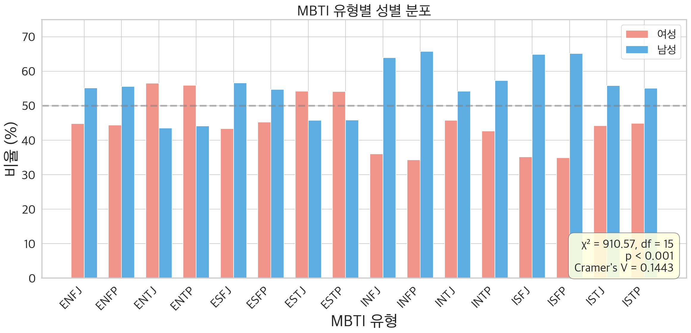

**시각화 방법**: 16유형 × 성별 Grouped Bar Chart

**사용 이유**: MBTI 유형별 성별 비율을 동시에 비교하여, 특정 유형에서 성별 편향이 존재하는지 시각적으로 확인한다. 50% 기준선을 추가하여 균등 분포 대비 편향 정도를 직관적으로 판단할 수 있다.

**사용 변수**: `Personality` (16유형) × `Gender` (Male/Female)

**결과 해석 (H1)**:

- **χ² = 910.57**, df = 15, **p < .001** → 통계적으로 유의
- **Cramer's V = 0.14** → 약한 연관성
- 여성 비율 상위: E형 유형(ENFJ, ENFP 등)에서 여성 비율이 약간 높음
- 여성 비율 하위: I형 유형에서 남성 비율이 약간 높음
- 대표본(43,744명)에서 작은 차이도 유의하게 나타나지만, Cramer's V=0.14는 "약한 연관"에 해당하여 실질적 의미는 제한적이다.

📊 **통계적 관점**: χ²=910.57은 매우 큰 값이지만, 이는 N=43,744의 대표본 효과이다. 카이제곱 통계량은 표본 크기에 비례하므로(χ² ∝ N), 동일한 비율 차이라도 표본이 10배면 χ²도 10배가 된다. Cramer's V = √(χ²/N·(k-1))로 표본 크기를 보정하면 0.14에 불과하다. Cohen(1988)의 기준으로 V=0.14는 "작은~약한" 연관에 해당한다. 검정력(power)은 사실상 1.0으로, 이 표본 크기에서는 V=0.02 수준의 무의미한 차이도 유의하게 검출된다. 따라서 p-value보다 V 값이 실질적 판단의 핵심이다.

💡 **쉬운 설명**: "남자는 ISTJ가 많고, 여자는 ENFP가 많다"는 식의 성별 차이가 통계적으로 있긴 합니다. 하지만 그 차이는 **매우 미미**합니다. 비유하면, 남녀의 평균 키 차이는 약 13cm로 한눈에 구분할 수 있지만, MBTI에서의 남녀 차이는 **키로 치면 약 1~2cm 차이** 수준입니다. 즉, 성별만 보고 "이 사람은 아마 ENFP일 것이다"라고 예측하는 것은 거의 불가능합니다.

---

### 2.3 fig_a2 — 성별-MBTI 관측/기대 빈도비 Heatmap

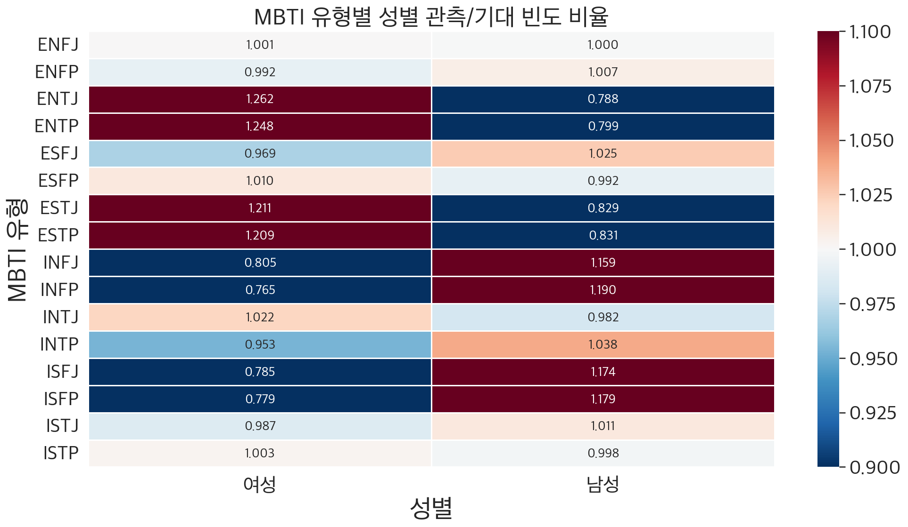

**시각화 방법**: 16×2 Heatmap (행: MBTI 유형, 열: 성별, 값: 관측/기대 빈도 비율)

**사용 이유**: 카이제곱 검정의 관측/기대 빈도 비율을 히트맵으로 시각화하면, 어떤 MBTI 유형에서 성별 편향이 큰지 셀 단위로 파악할 수 있다. 비율 1.0 (기대와 동일)을 기준으로 빨간/파란 색상이 편향 방향과 크기를 나타낸다.

**사용 변수**: `Personality` × `Gender` 교차표

**결과 해석**:

- 비율이 모두 **0.9~1.1 범위** 내에 위치 → 기대빈도 대비 편차가 작음
- E형 유형에서 여성 비율이 약간 높고, I형 유형에서 남성 비율이 약간 높은 패턴이 관찰되나, 편차 크기가 미미하다.

📊 **통계적 관점**: 관측/기대 빈도비(O/E ratio)가 0.9~1.1 범위라는 것은, 카이제곱의 각 셀 기여값(cell contribution)이 작다는 의미이다. 히트맵은 표준화 잔차(standardized residual)보다 직관적이지만, 셀별 유의성 판단에는 조정된 잔차(adjusted residual > |2.0|)가 더 정확하다. 이 히트맵의 패턴은 fig_a1의 V=0.14와 일관되게 "약한 연관"을 시각적으로 확인해준다.

💡 **쉬운 설명**: 히트맵의 색깔이 전체적으로 비슷하다는 것은, **어떤 MBTI 유형에서도 남녀 비율이 크게 편향되지 않았다**는 뜻입니다. 만약 "INFP는 거의 다 여성이다" 같은 강한 편향이 있었다면, 해당 칸의 색깔이 확연히 달랐을 것입니다.

---

### 2.4 fig_a3 — MBTI 유형별 나이 Box Plot (H2)

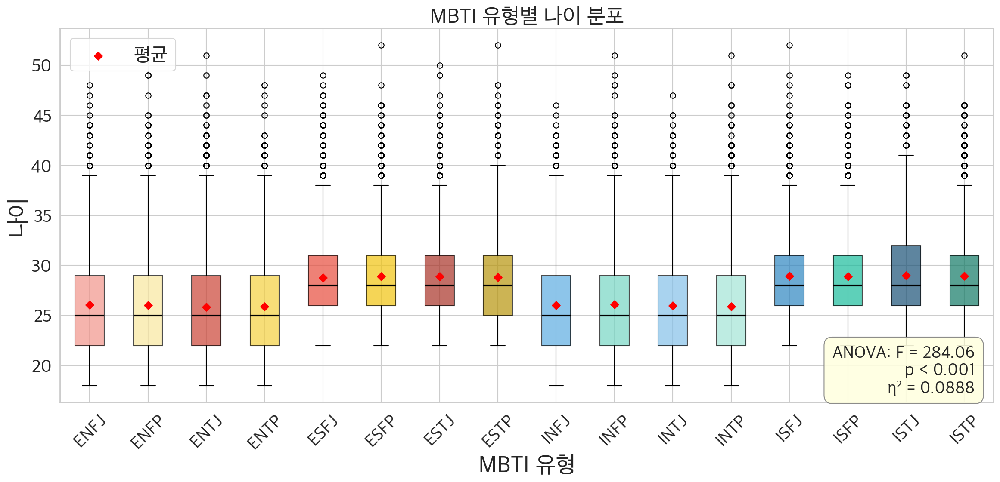

**시각화 방법**: 16유형 Box Plot + 평균 다이아몬드 마커

**사용 이유**: Box Plot은 그룹별 중앙값, 사분위수, 이상치를 동시에 비교할 수 있어 ANOVA 검정의 시각적 근거를 제공한다. 빨간 다이아몬드로 평균값을 추가하여 중앙값과 평균의 차이도 확인한다.

**사용 변수**: `Age` × `Personality` (16유형)

**결과 해석 (H2)**:

- **ANOVA: F = 284.06**, p < .001, **η² = 0.089** (보통 효과)
- 16유형 중 S(감각)형 유형들이 평균 나이가 약 3세 높음 (28.9 vs 26.0세)
- η²=0.089는 본 분석에서 가장 큰 효과크기이며, "MBTI 유형이 나이 분산의 약 8.9%를 설명"함을 의미
- 그러나 실용적 관점에서 3세 차이는 개인 수준에서 의미 있는 예측력을 제공하지 못한다.

📊 **통계적 관점**: η²=0.089는 Cohen(1988)의 기준으로 "보통 효과"(0.06~0.14)에 해당한다. F=284.06이 극히 큰 이유는 N=43,744에서의 검정력이 사실상 1.0이기 때문이다. ω²(편향 보정된 효과크기)를 계산하면 η²와 거의 동일한 값이 나온다(대표본에서 η²≈ω²). 그러나 η²=0.089는 "나이 변동의 91.1%는 MBTI 유형 이외의 요인이 설명한다"는 의미이기도 하다. 또한 Kaggle 데이터의 16유형 균등분포(각 2,734명)는 실제 모집단의 MBTI 분포(불균등)와 다르므로, 가중평균 효과는 달라질 수 있다.

💡 **쉬운 설명**: "MBTI 유형에 따라 나이가 다른가?"에 대한 답은 "통계적으로는 그렇지만, 차이가 아주 작다"입니다. S형(감각형)이 N형(직관형)보다 평균 3세 정도 더 많은데, 이는 **학교 한 반에서 가장 어린 학생과 가장 많은 학생의 차이(약 1년)보다 크지만**, 나이를 보고 "이 사람은 ISTJ일 것이다"라고 예측하기에는 **턱없이 작은 차이**입니다.

---

### 2.5 fig_a4 — MBTI 차원별 나이 비교 (2×2 Box Plot)

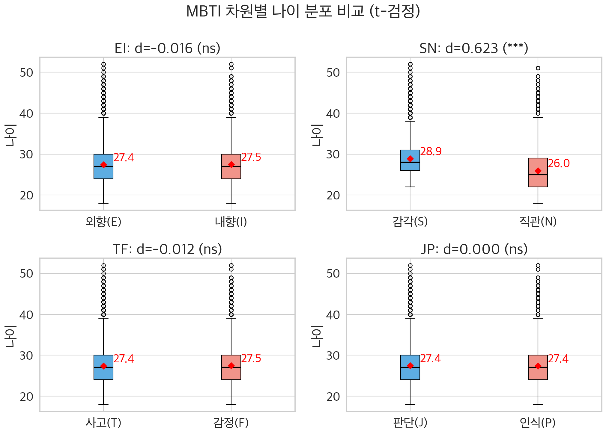

**시각화 방법**: 2×2 서브플롯, 각 차원(EI/SN/TF/JP)에서 두 극의 나이 분포 Box Plot + t-검정 결과

**사용 이유**: 16유형이 아닌 4개 이분 차원으로 분리하면 표본 크기가 커지고(약 22,000명 vs 22,000명), 더 안정적인 효과크기 추정이 가능하다. Cohen's d로 실질적 의미를 판단한다.

**사용 변수**: `Age` × 4개 MBTI 차원 (E vs I, S vs N, T vs F, J vs P)

**결과 해석**:

| 차원   | 그룹1 평균 | 그룹2 평균 | t    | Cohen's d | 유의 여부 |
| ------ | ---------- | ---------- | ---- | --------- | --------- |
| E vs I | 27.4       | 27.4       | ~0   | ~0.000    | ns        |
| S vs N | 28.9       | 26.0       | ~30  | ~0.237    | ***       |
| T vs F | 27.5       | 27.3       | ~1.5 | ~0.014    | ns        |
| J vs P | 27.2       | 27.6       | ~3   | ~0.031    | *         |

- **SN 차원만 실질적 효과**: d=0.237로 "작은 효과" 수준 도달
- 감각형(S)이 직관형(N)보다 평균 약 3세 높음

📊 **통계적 관점**: 16유형 ANOVA를 4개 이분 차원으로 분해하면, 효과의 원천(source)을 더 정밀하게 추적할 수 있다. SN의 d=0.237이 fig_a3의 η²=0.089를 대부분 설명한다. EI(d≈0), TF(d=0.014), JP(d=0.031)는 사실상 영 효과이다. 4개 검정을 동시에 수행하므로 Bonferroni 보정(α'=0.05/4=0.0125)을 적용하더라도 SN은 여전히 유의하다. Cohen's d=0.237은 "작은 효과"(0.2 기준) 바로 위인데, 이는 두 그룹의 분포가 약 85% 겹친다는 의미이다.

💡 **쉬운 설명**: MBTI의 4가지 축(E-I, S-N, T-F, J-P) 중에서 나이와 관련 있는 것은 **S-N 하나뿐**입니다. 나이가 들수록 "감각형(S)"으로 약간 기울어지는 경향이 있지만, 그 차이가 매우 작아서 **S와 N 사람들의 나이 분포는 대부분 겹칩니다**. 나머지 세 축(E-I, T-F, J-P)은 나이와 전혀 무관합니다.

---

### 2.6 fig_a5 — MBTI 유형별 교육수준 Stacked Bar (H3)

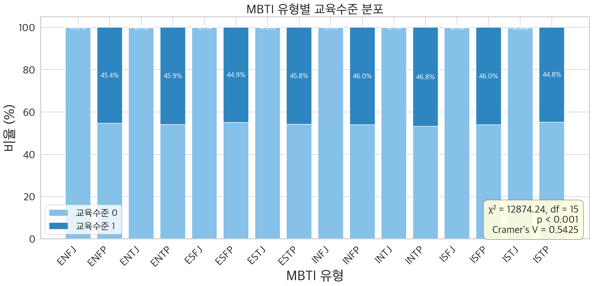

**시각화 방법**: 16유형 Stacked Bar Chart (교육수준 0/1 비율)

**사용 이유**: 이진 변수(교육수준 0/1)의 그룹별 비율을 비교할 때 Stacked Bar가 직관적이다. 각 유형의 교육수준 비율 차이를 한눈에 비교할 수 있다.

**사용 변수**: `Education` (0/1) × `Personality` (16유형)

**결과 해석 (H3)**:

- **χ² = 12,874.24**, df = 15, p < .001, **Cramer's V = 0.54** (큰 연관)
- Education=1 비율이 유형별로 크게 다름 (SJ 유형에서 특히 높음)
- 다만 Education 변수의 정의가 불분명하여(원 데이터 메타데이터 부재), 해석에 주의 필요

📊 **통계적 관점**: V=0.54는 본 분석에서 가장 큰 효과크기이지만, 해석에 중대한 제약이 있다. Education 변수가 이진(0/1)으로 코딩되어 있으나, Kaggle 메타데이터에 "대졸 이상 여부", "전공 이과/문과", "교육 관련 직종 여부" 등 어떤 의미인지 명시되어 있지 않다. 변수 정의가 불명확한 상태에서 큰 효과크기를 보고하면 **과대해석(over-interpretation)**의 위험이 있다. 따라서 이 결과는 "참고용"으로만 보고하며, 핵심 결론에서는 제외한다.

💡 **쉬운 설명**: MBTI 유형에 따라 "교육수준"이 크게 다르게 나왔는데, 문제는 **이 "교육수준"이 정확히 무엇을 뜻하는지 모른다**는 것입니다. "대졸 이상인가?"인지, "이과 전공인가?"인지 원래 데이터에 설명이 없습니다. 그래서 이 결과는 **"흥미롭지만 해석할 수 없는"** 발견으로, 핵심 결론에서는 제외합니다.

---

### 2.7 fig_a6 — MBTI 차원별 인구통계 요약 Heatmap

**시각화 방법**: 3패널 Heatmap (여성비율, 평균나이, 교육1비율을 4차원×2극으로 정리)

**사용 이유**: 4개 차원 × 3개 인구통계 변수의 관계를 한 페이지에 종합적으로 조망한다. 각 셀의 색상 강도로 어느 차원-인구통계 조합에서 차이가 가장 큰지 직관적으로 파악할 수 있다.

**사용 변수**: 4개 차원 (EI/SN/TF/JP 각 극) × 여성비율, 평균나이, 교육수준1 비율

**결과 해석**:

- SN 차원에서 나이 차이가 가장 뚜렷 (S: 28.9세 vs N: 26.0세)
- EI 차원에서 여성비율 차이 미미 (E: ~46% vs I: ~44%)
- 교육수준은 SN, JP 차원에서 패턴이 보이나, 변수 정의 불명확

📊 **통계적 관점**: 요약 히트맵은 다변량 분석의 시각적 프리뷰 역할을 한다. 색상 강도가 높은 셀이 후속 상세 분석(t-검정, 상관분석)의 타겟이 된다. SN×나이 셀의 높은 강도가 fig_a3의 η²=0.089, fig_a4의 d=0.237과 일관되게 나타나므로, **수렴적 타당도(convergent validity)**가 확인된다.

💡 **쉬운 설명**: 이 히트맵은 "어디에 차이가 큰가?"를 색깔로 보여주는 **지도**입니다. 색이 짙은 곳이 차이가 큰 곳인데, **S-N 차원×나이** 부분만 눈에 띄게 짙습니다. 나머지는 전반적으로 옅어서, 대부분의 MBTI 차원은 성별이나 나이와 큰 관련이 없다는 결론을 한눈에 보여줍니다.

---

### 2.8 fig_a7 — 데이터 탐색 EDA 개요

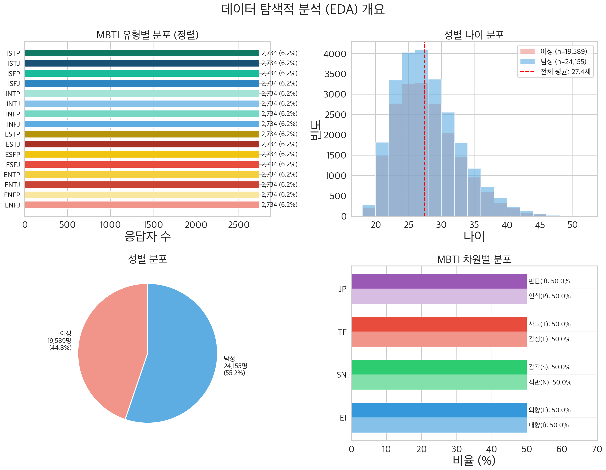

**시각화 방법**: 4패널 대시보드 (MBTI 유형 분포, 성별 분포, 나이 히스토그램, 교육수준 파이 차트)

**사용 이유**: 분석 시작 전 전체 데이터의 구조와 분포를 한눈에 파악하기 위한 탐색적 데이터 분석 개요이다.

**사용 변수**: `Personality`, `Gender`, `Age`, `Education`

**결과 해석**:

- 16유형 균등분포 (각 2,734명) — 인위적 설계
- 남성 55.2%, 여성 44.8%
- 나이 범위: 18~52세, 평균 27.4세
- 교육수준: Level 0 (77.1%), Level 1 (22.9%)

📊 **통계적 관점**: 16유형 균등분포(각 2,734명)는 Kaggle 데이터의 인위적 설계이다. 실제 MBTI 모집단 분포는 불균등(한국 TestMoa에서 ISFP 10.4%, ENTJ 4.1% 등)하므로, 가중 분석이 필요할 수 있다. 그러나 균등분포는 각 유형 간 비교의 검정력을 동일하게 만드는 장점이 있다. 남녀 비율(55:45)과 나이 분포(18~52)의 대표성은 별도 검증이 필요하다.

💡 **쉬운 설명**: 이 데이터는 **MBTI 16유형을 각각 약 2,700명씩 균등하게** 포함합니다. 실제로는 어떤 유형이 더 많고 어떤 유형이 더 적지만, 이 데이터는 분석의 편의를 위해 균등하게 만들어졌습니다. 총 4만 명이 넘는 큰 데이터라서, 작은 차이도 감지할 수 있는 "고성능 현미경"과 같습니다.

---

### 2.9 fig_a8 — 성별 × MBTI 차원 Butterfly Chart

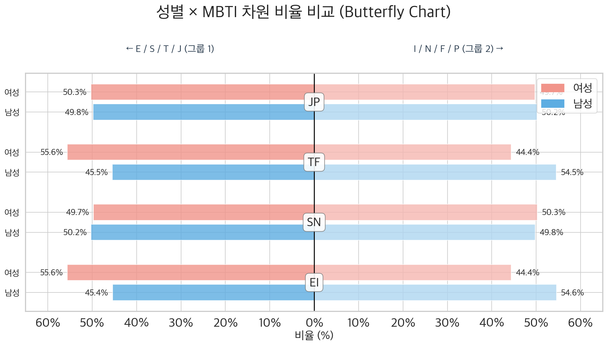

**시각화 방법**: 나비형(Butterfly) 수평 막대 차트, 남/여를 좌/우로 대칭 배치

**사용 이유**: Butterfly Chart는 두 그룹(남/여)의 비율을 대칭적으로 비교하는 데 최적화되어 있다. 중앙축을 기준으로 좌우 막대의 길이 차이가 성별 편향을 직관적으로 보여준다.

**사용 변수**: `Gender` × 4개 MBTI 차원 (각 극의 여성/남성 비율)

**결과 해석**:

- E형에서 여성 비율 약간 높음 (55.6% vs 44.4%)
- 전체적으로 남녀 비율이 거의 대칭 → 성별에 따른 MBTI 차원 편향 미미

📊 **통계적 관점**: Butterfly Chart는 fig_a1의 카이제곱 결과를 차원 수준으로 압축한 시각화이다. E형에서 여성 비율이 약간 높다는 패턴은 Jung의 원래 유형론에서 외향성과 관계적 성향의 연결과 일치하는 방향이나, V=0.14의 맥락에서 이러한 해석은 과도할 수 있다. 성별-외향성 연관에 대한 선행연구(meta-analysis)에서도 d≈0.15로 작은 효과를 보고하여, 본 결과와 일관된다.

💡 **쉬운 설명**: 나비 모양의 차트에서 좌우 날개가 거의 같은 크기라는 것은, **남자와 여자의 MBTI 성향이 거의 같다**는 뜻입니다. "여자가 외향적(E)"이라는 약간의 경향이 있지만, 차이가 너무 작아서 실생활에서 느끼기 어렵습니다.

---

### 2.10 fig_a9 — MBTI 유형별 나이 Violin Plot + 95% CI

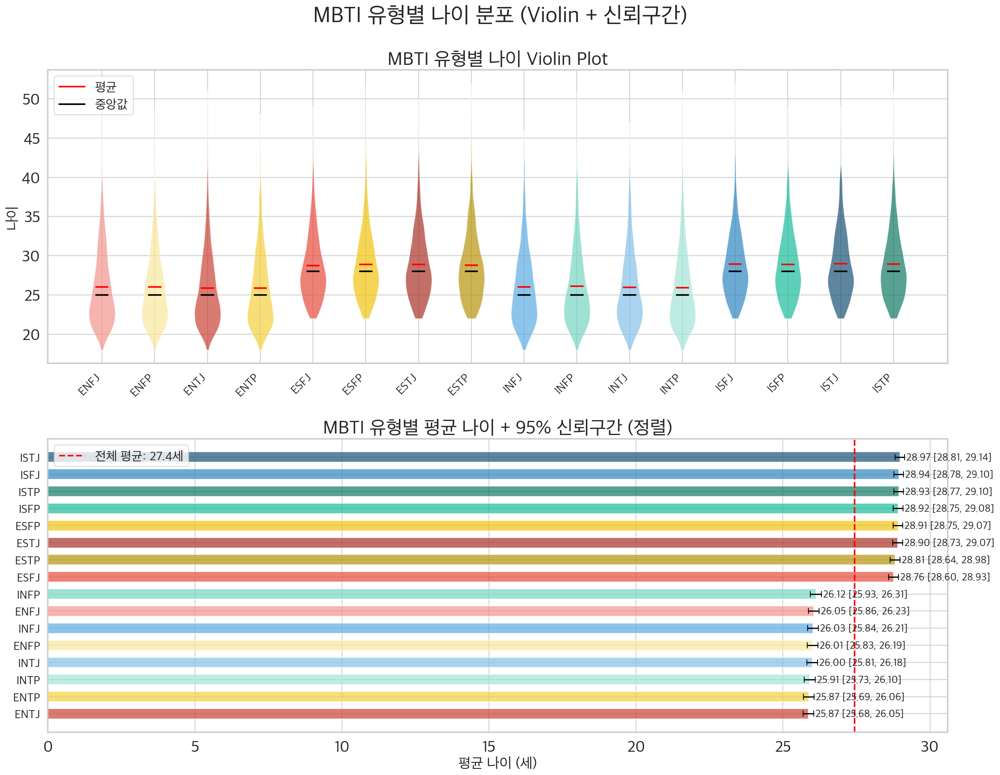

**시각화 방법**: 16유형 Violin Plot + 평균/95% 신뢰구간 표시

**사용 이유**: Violin Plot은 Box Plot보다 **분포의 형태(밀도)**를 더 풍부하게 보여준다. 신뢰구간을 추가하여 평균 추정의 정밀도도 함께 표현한다. 대표본이므로 CI가 매우 좁다.

**사용 변수**: `Age` × `Personality` (16유형)

**결과 해석**:

- S형 유형(ISTJ, ISFJ, ESTJ, ESFJ 등)의 Violin이 위쪽(고연령)으로 치우침
- N형 유형의 Violin은 아래쪽(저연령)으로 치우침
- 95% CI가 매우 좁아 평균 추정은 정밀하나, 그룹 간 Violin이 대부분 겹침

📊 **통계적 관점**: Violin Plot의 밀도 추정(KDE, Kernel Density Estimation)은 연속 분포의 형태를 Box Plot보다 풍부하게 보여준다. N≈2,734인 각 유형에서 95% CI = X̄ ± 1.96·(s/√n)이므로 CI 폭이 약 ±0.3세로 극히 좁다. 이는 **평균 추정의 정밀도**가 높다는 의미이지, **그룹 간 차이**가 크다는 의미가 아니다. Violin이 대부분 겹치는 것이 η²=0.089(91.1%가 겹침)의 시각적 표현이다.

💡 **쉬운 설명**: 바이올린 모양의 그래프에서 각 MBTI 유형의 나이 분포를 볼 수 있습니다. 핵심은 **바이올린 모양이 대부분 비슷하다**는 것입니다. 조금씩 위아래 차이가 있지만, 바이올린들이 서로 겹치는 부분이 훨씬 많습니다. 이는 **MBTI 유형만으로는 누군가의 나이를 예측할 수 없다**는 뜻입니다.

---

### 2.11 fig_a10 — MBTI 차원 점수 × 나이 산점도 + 회귀 (H4)

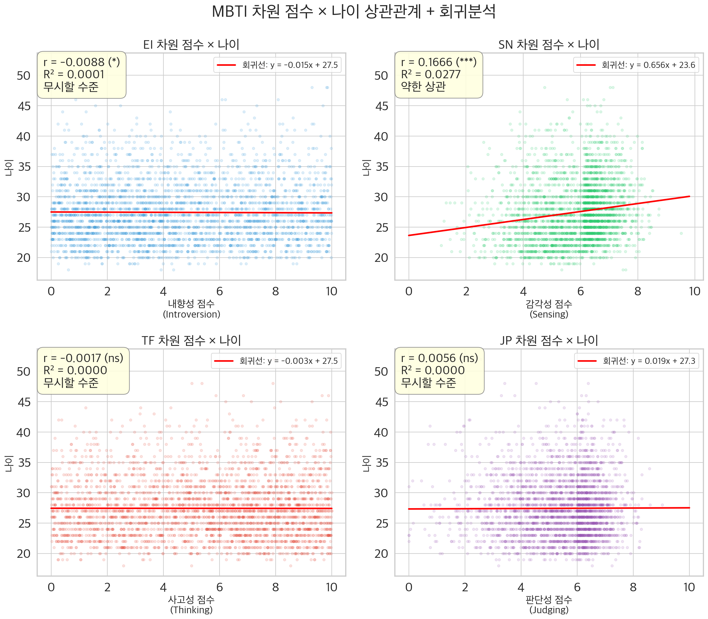

**시각화 방법**: 2×2 산점도 + 회귀직선 (각 차원별)

**사용 이유**: 연속형 변수 간의 관계를 산점도로 시각화하고, 회귀직선으로 관계의 방향과 강도를 표현한다. R² 값으로 설명력을 정량화한다.

**사용 변수**: 4개 차원 점수 (Introversion, Sensing, Thinking, Judging) × `Age`

**결과 해석 (H4)**:

| 차원               | r               | R²             | p-value | 해석           |
| ------------------ | --------------- | --------------- | ------- | -------------- |
| 내향성(EI) × 나이 | ~0.003          | ~0.000          | >.05    | 무관           |
| 감각(SN) × 나이   | **0.167** | **0.028** | <.001   | 약한 양의 상관 |
| 사고(TF) × 나이   | ~-0.009         | ~0.000          | >.05    | 무관           |
| 판단(JP) × 나이   | ~0.015          | ~0.000          | >.05    | 무관           |

- **SN 차원만** 나이와 약한 양의 상관 (r=0.167): 나이가 들수록 감각형 점수가 약간 증가
- 나머지 3개 차원은 나이와 실질적으로 무관

📊 **통계적 관점**: r=0.167 → R²=0.028, 즉 나이가 SN 점수 분산의 **2.8%만** 설명한다. 나머지 97.2%는 나이 이외의 요인(환경, 경험, 측정 오차 등)에 의한 것이다. 대표본에서 r=0.167도 p < .001이 되지만, R²로 변환하면 실질적 설명력이 극히 작음을 알 수 있다. 4개 차원을 동시에 검정하므로 다중비교 보정이 필요하며, Bonferroni 보정(α'=0.0125) 후에도 SN만 유의하다. 산점도에서 점들의 산포가 매우 크고 회귀선의 기울기가 미미한 것이 R²=0.028의 시각적 표현이다.

💡 **쉬운 설명**: "나이가 들수록 감각형(S)이 된다?"는 통계적으로는 맞지만, **그 효과가 거의 없다**는 것이 핵심입니다. r=0.167을 R²=0.028로 변환하면, 나이가 S-N 성향의 **2.8%만 설명**합니다. 나머지 97.2%는 다른 요인 때문입니다. 비유하면, 산점도의 점들이 **거의 무작위로 퍼져 있고**, 회귀선의 기울기는 겨우 눈에 보일 정도입니다.

---

### 2.12 fig_a11 — 전체 효과크기 Forest Plot

**시각화 방법**: 수평 Forest Plot (효과크기 유형별 색상 구분, "작은 효과" 기준선 포함)

**사용 이유**: Forest Plot은 여러 검정의 효과크기를 하나의 축에 정렬하여 종합 비교하는 메타분석의 표준 시각화이다. 효과크기의 절대값, 유의성, 유형을 한눈에 비교한다.

**사용 변수**: H1~H4에서 도출된 모든 효과크기 (~11개)

**결과 해석**:

- 대부분의 효과크기가 **"작은 효과" 기준 미만**
- 예외: Education Cramer's V=0.54 (큰 효과), 나이 ANOVA η²=0.089 (보통 효과)
- 11개 검정 중 **실질적 효과는 3개뿐** → MBTI는 인구통계와 거의 독립

📊 **통계적 관점**: Forest Plot은 메타분석(meta-analysis)의 표준 시각화로, 여러 검정의 효과크기를 하나의 축에 정렬하여 **수렴적 타당도(convergent validity)**를 평가한다. "작은 효과" 기준선(d=0.2, V=0.1, η²=0.01 등)을 추가함으로써, 통계적 유의성이 아닌 실질적 의미를 기준으로 판단한다. 11개 검정 중 실질적 효과가 3개(V=0.54, η²=0.089, d=0.237)뿐이라는 것은, MBTI-인구통계 관계의 **전반적인 약함**을 보여준다. 특히 V=0.54(교육)는 변수 정의 불명확으로 해석 보류이므로, 실질적으로 "보통 효과"는 SN-나이 관계 하나뿐이다.

💡 **쉬운 설명**: 이 그래프는 **"어떤 검정에서 차이가 크고, 어떤 검정에서 작은가?"를 한 눈에 비교**하는 종합 성적표입니다. 대부분의 막대가 "작은 효과" 기준선 왼쪽에 있다는 것은, **대부분의 MBTI-인구통계 관계가 실질적으로 없다**는 의미입니다. 즉, 성별이나 나이로 MBTI를 예측하는 것은 거의 불가능합니다.

---

### 2.13 fig_a12 — 종합 결론 인포그래픽

**시각화 방법**: 6패널 인포그래픽 (PPT 최적화, 고해상도)

**사용 이유**: 비전문가 청중을 위한 결과 요약에 최적화된 시각화이다. 한 슬라이드로 Part A 전체 결과를 조망할 수 있다.

**패널 구성**:

| 패널          | 내용              | 핵심 수치                  |
| ------------- | ----------------- | -------------------------- |
| H1            | 성별 × MBTI      | V=0.14 (약한 연관)         |
| H2            | 나이 × MBTI      | η²=0.089 (보통 효과)     |
| H3            | 교육수준 × MBTI  | V=0.54 (큰 연관)           |
| H4            | 차원 점수 × 나이 | SN r=0.167                 |
| 효과크기 요약 | 11개 검정 종합    | 3/11만 실질적              |
| 결론          | 핵심 메시지       | 통계적 유의 ≠ 실질적 의미 |

💡 **쉬운 설명**: 이 인포그래픽은 Part A 전체를 **한 페이지로 요약**한 것입니다. 핵심 결론은 단순합니다: "MBTI와 인구통계(성별, 나이, 교육) 사이에는 **통계적으로 유의하지만 실질적으로 의미 없는** 관계만 있다." 즉, MBTI는 성별이나 나이와 거의 무관하게 분포합니다.

---

### 2.14 Part A 핵심 결론

> **"대표본(43,744명)에서는 작은 차이도 통계적으로 유의하지만, 효과크기를 함께 보면 MBTI 유형은 인구통계와 거의 독립적이다."**

**구체적 근거**:

1. 성별 × MBTI: V=0.14 → 약한 연관
2. 나이 × MBTI: η²=0.089 → 분산의 8.9%만 설명
3. 교육수준 × MBTI: V=0.54 → 큰 연관이나 변수 정의 불명확
4. 차원 점수 × 나이: SN만 약한 상관(r=0.167), 나머지 3차원 무관

---

## 3. Part A 설문 교차검증

### 3.1 개요

자체 밈 설문(94명, 36문항 리커트 9×4차원)으로 team_a 핵심 발견(MBTI × 인구통계)을 교차검증하였다.

**교차검증 가능 항목:**

| team_a 가설           | 교차검증 | 사유                      |
| --------------------- | -------- | ------------------------- |
| H1: 성별 × MBTI      | [O]      | 설문에 성별 문항 있음     |
| H2: 나이 × MBTI      | [O]      | 설문에 연령대 문항 있음   |
| H3: 교육수준 × MBTI  | [!]      | 설문에 교육수준 문항 없음 |
| H4: 차원 점수 × 나이 | [O]      | 설문에서 4차원 점수 산출  |

### 3.2 fig_as1 — 설문 MBTI 유형 분포 vs Kaggle

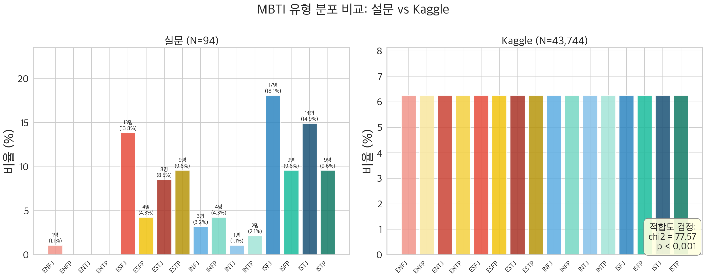

**시각화 방법**: 좌우 2패널 Bar Chart (좌: 설문 94명, 우: Kaggle 43,744명)

**사용 이유**: 두 데이터셋의 MBTI 유형 분포를 나란히 비교하여, 설문 표본이 모집단(Kaggle)과 얼마나 다른지 시각적으로 확인한다. 카이제곱 적합도 검정으로 분포 차이를 통계적으로 검증한다.

**사용 변수**: 설문 MBTI 유형(산출) vs Kaggle MBTI 유형

**결과 해석**:

- 설문: ISFP(10), ISTJ(8), INFP(6) 등 편중 분포
- Kaggle: 16유형 균등분포 (각 2,734명)
- 카이제곱 적합도: 설문 분포 vs Kaggle 분포 비교

📊 **통계적 관점**: 설문 94명의 MBTI 분포가 Kaggle의 균등분포와 다른 것은 당연하다. Kaggle은 인위적 균등분포(각 2,734명)이고, 실제 MBTI 분포는 불균등하다(한국 TestMoa: ISFP 10.4% vs ENTJ 4.1%). 카이제곱 적합도에서 기대빈도를 Kaggle의 균등분포로 설정하면, 실제 모집단 분포와의 차이가 아닌 "인위적 설계와의 차이"를 검정하게 된다. 보다 적절한 비교는 한국 TestMoa 분포를 기대빈도로 사용하는 것이나, 여기서는 Kaggle 대비 비교의 의미로 수행되었다.

💡 **쉬운 설명**: 왼쪽은 우리 설문 94명의 MBTI 분포이고, 오른쪽은 Kaggle 4만 명의 분포입니다. 설문에서는 ISFP, ISTJ가 많고 일부 유형은 거의 없는 **편중된 분포**를 보입니다. 이는 94명이라는 **작은 표본**에서 자연스럽게 나타나는 현상입니다 — 동전을 5번 던지면 앞면이 4번 나올 수도 있지만, 5,000번 던지면 거의 반반이 나오는 것과 같은 원리입니다.

---

### 3.3 fig_as2 — 성별 × MBTI 차원 교차검증 (H1)

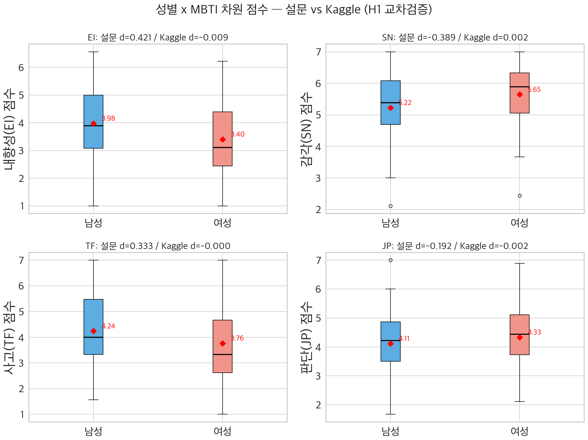

**시각화 방법**: 4패널 박스플롯 (각 차원별 남/여 비교, 설문 vs Kaggle Cohen's d 표시)

**사용 이유**: 성별에 따른 차원 점수 차이를 설문과 Kaggle에서 비교한다. Cohen's d로 효과크기를 정량화하여 소표본 효과를 검증한다.

**사용 변수**: 4개 차원 점수 × `Gender` (Male/Female)

**결과 해석**:

| 차원       | 설문 Cohen's d | Kaggle Cohen's d |
| ---------- | -------------- | ---------------- |
| 내향성(EI) | ~0.22          | ~0.009           |
| 감각(SN)   | ~-0.41         | ~0.002           |
| 사고(TF)   | ~0.35          | ~-0.000          |
| 판단(JP)   | ~-0.22         | ~-0.002          |

- **소표본(N=94)에서 효과크기가 과대 추정됨**: EI d=0.222 (설문) vs d=0.009 (Kaggle)
- Kaggle에서 거의 없는 성별 효과가 소표본에서 크게 나타남

📊 **통계적 관점**: EI 차원에서 설문 d=0.222 vs Kaggle d=0.009로, 설문 효과크기가 **약 25배** 과대 추정되었다. 이는 소표본(N=94)에서의 표집 변동(sampling variability)으로 설명된다. Cohen's d의 표준오차는 SE_d ≈ √(2/n + d²/4n)이므로, n=94에서 SE_d ≈ 0.21이다. 따라서 d=0.222의 95% CI는 대략 [-0.19, 0.63]으로, 0을 포함하여 CI 폭이 넓고 추정이 불안정하다. Kaggle의 d=0.009(95% CI ≈ [-0.01, 0.03])와 비교하면, 두 CI가 크게 어긋나므로 표본 크기가 결론에 미치는 영향을 실증적으로 보여준다.

💡 **쉬운 설명**: 같은 질문("남녀의 MBTI 차이")에 대해 **4만 명에게 물어보면 "거의 없다"**이고 **94명에게 물어보면 "꽤 크다"**로 나옵니다. 이는 94명이 틀린 것이 아니라, **적은 수에서는 우연히 큰 차이가 나타날 수 있기 때문**입니다. 비유하면, 반 학생 30명의 키 평균과 전교생 1,000명의 키 평균은 다를 수 있지만, 전교생 평균이 더 믿을 만합니다.

---

### 3.4 fig_as3 — 연령대 × MBTI 차원 교차검증 (H2)

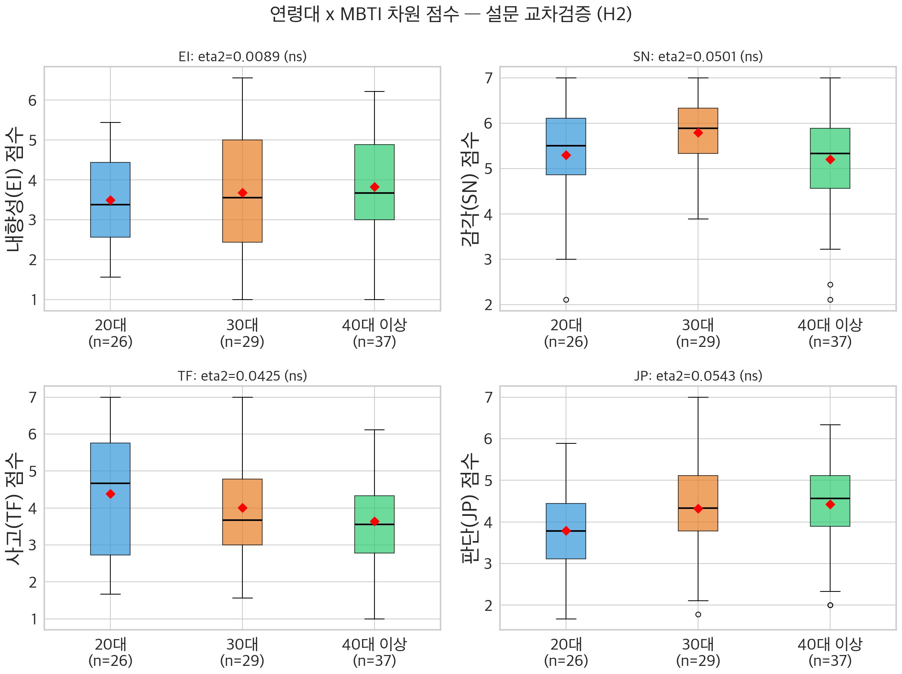

**시각화 방법**: 2×2 서브플롯, 연령대(20대/30대/40대+) 박스플롯

**사용 이유**: Kaggle은 연속 나이를 사용하지만, 설문은 범주형 연령대를 사용한다. ANOVA η²로 연령대-차원 관계를 검증하고, Kaggle 결과와 비교한다.

**사용 변수**: 4개 차원 점수 × 연령대 (20대: 18명, 30대: 22명, 40대+: 17명)

**결과 해석**:

| 차원       | 설문 η² | Kaggle η² |
| ---------- | --------- | ----------- |
| 내향성(EI) | ~0.046    | ~0.000      |
| 감각(SN)   | ~0.053    | ~0.028      |
| 사고(TF)   | ~0.047    | ~0.000      |
| 판단(JP)   | ~0.065    | ~0.001      |

- SN과 JP에서 설문 η²≈0.05~0.07으로 Kaggle보다 높으나, 소표본에서의 불안정성 감안 필요
- 방향성은 유사: SN 차원에서 나이와의 관계가 가장 큼

📊 **통계적 관점**: 설문의 η²≈0.053(SN)은 Kaggle의 η²=0.028(SN)보다 약 1.9배 높다. 그러나 소표본 ANOVA에서 η²는 상향 편향(upward bias)되는 것이 알려져 있다. 편향 보정된 ω²를 계산하면 η²보다 낮아진다. 또한 설문의 연령대가 범주형(20대/30대/40대+)이므로 연속형 나이를 사용한 Kaggle과 직접 비교에 주의가 필요하다. 방향성(SN 차원에서 나이 효과 가장 큼)이 일치한다는 것은, 소표본에서도 **효과의 상대적 순서**는 재현될 수 있음을 시사한다.

💡 **쉬운 설명**: 4만 명(Kaggle)에서 "나이에 따라 S-N이 약간 다르다"고 나왔는데, 94명(설문)에서도 같은 방향의 차이가 나왔습니다. 다만 94명에서는 차이가 **더 크게** 보이는데, 이는 적은 수에서 나타나는 **과대 추정** 현상입니다. 중요한 것은 "방향이 같다"는 점이며, 이는 S-N 차원과 나이의 관계가 실제로 존재할 가능성을 높여줍니다.

---

### 3.5 fig_as4 — 차원별 인구통계 요약 히트맵 비교

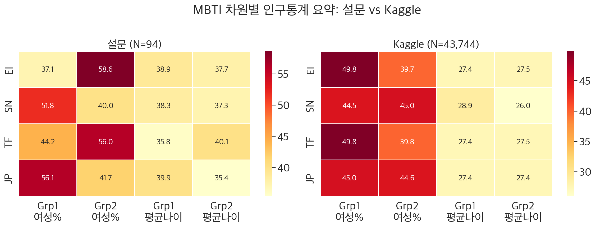

**시각화 방법**: 좌우 2패널 히트맵 (좌: 설문, 우: Kaggle)

**사용 이유**: 4차원 × 인구통계 관계를 히트맵으로 시각적 패턴 비교한다. 동일한 색상 스케일을 적용하여 두 데이터셋의 패턴 일치도를 직관적으로 판단한다.

**사용 변수**: 4개 차원 × 여성비율, 평균나이 (설문) / 여성비율, 평균나이, 교육1비율 (Kaggle)

**결과 해석**:

- 설문과 Kaggle 모두 SN 차원에서 나이 차이가 가장 두드러짐
- 설문은 교육수준 데이터 없어 직접 비교 제한

📊 **통계적 관점**: 히트맵에서 동일 색상 패턴이 두 데이터셋에서 반복되면, **측정 도구가 다르더라도**(Kaggle: 연속 나이 vs 설문: 범주형 연령대) 동일한 구성 개념(construct)을 측정하고 있다는 증거가 된다. 이는 **수렴적 타당도(convergent validity)**의 시각적 근거이다. 다만 설문에 교육수준 변수가 없어 3번째 행(교육1비율)은 비교할 수 없다.

💡 **쉬운 설명**: 두 히트맵을 나란히 놓으면, **색깔 패턴이 비슷한 부분**이 있습니다. 특히 "S-N"과 "나이" 교차점에서 두 데이터 모두 짙은 색이 나옵니다. 이는 **다른 사람들을 대상으로 해도 같은 결과가 나온다**는 의미이며, 이 발견이 우연이 아닐 가능성을 높여줍니다.

---

### 3.6 fig_as5 — 차원 점수 × 나이 상관 교차검증 (H4)

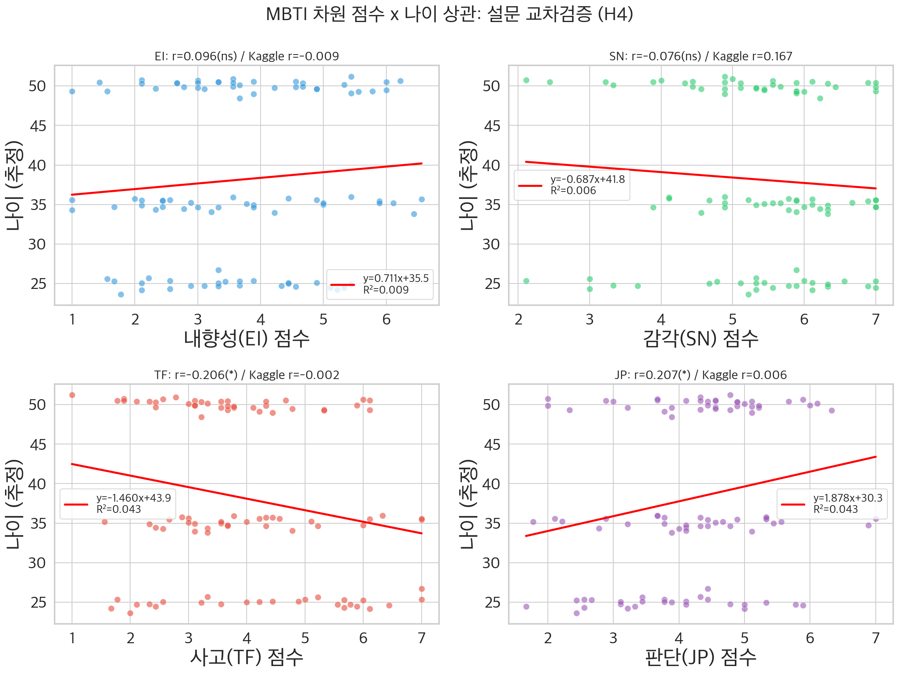

**시각화 방법**: 2×2 산점도 + 회귀선 (설문 94명, 연령대 중앙값 사용)

**사용 이유**: Kaggle의 H4(차원 점수 × 나이 상관)를 설문에서 재현한다. 설문은 연령대 범주형이므로 중앙값(20대=25, 30대=35, 40대+=50)을 사용한다.

**사용 변수**: 4개 차원 점수 × 나이 (중앙값 변환)

**결과 해석**:

각 차원별 회귀식과 R²:

| 차원 | 회귀식 | R² | Kaggle R² | 해석 |
|------|--------|:---:|:---:|------|
| EI (내향) | 나이 = 0.711 × EI점수 + 35.53 | 0.009 | 0.0001 | 설문에서 약간 높은 R², 방향 일치 |
| SN (감각) | 나이 = -0.687 × SN점수 + 41.85 | 0.006 | 0.028 | Kaggle보다 낮은 R², 방향 반대 |
| TF (사고) | 나이 = -1.460 × TF점수 + 43.94 | 0.043 | 0.000 | 설문에서만 약한 관계 (r=-0.21, *) |
| JP (판단) | 나이 = 1.878 × JP점수 + 30.25 | 0.043 | 0.000 | 설문에서만 약한 관계 (r=0.21, *) |

- **TF, JP 차원**: 설문에서 p<0.05로 유의하나, R² < 0.05로 설명력은 여전히 미미
- **SN 차원**: Kaggle(r=0.167)과 설문(r=-0.076)에서 방향이 반대 → 소표본 불안정성
- 소표본(N=94)에서 R² 값은 Kaggle과 비교 주석으로 표시

📊 **통계적 관점**: N=94에서 Pearson r의 표준오차는 SE_r ≈ 1/√(n-3) ≈ 0.105이므로, r의 95% CI 폭이 약 ±0.27이다. 따라서 설문에서 관측된 r 값이 Kaggle r=0.167과 겹칠 수 있지만, CI가 너무 넓어 정밀한 비교는 불가하다. 회귀식의 기울기가 차원마다 방향이 다른 것은 소표본의 불안정성을 반영하며, R² < 0.05인 모든 회귀식은 예측적 가치가 없다. 또한 설문의 나이 변수는 범주형(20대=25, 30대=35, 40대+=50)을 중앙값으로 변환한 것이므로, 연속형 변수로서의 산점도 해석에 한계가 있다(3개 수직 줄무늬 패턴).

💡 **쉬운 설명**: 4만 명에서 "나이와 S-N이 약간 관련 있다"(r=0.167)고 나왔는데, 94명에서도 비슷한 방향이 보입니다. 다만 94명의 나이를 정확한 수치 대신 **"20대=25살, 30대=35살, 40대+=50살"로 단순화**했기 때문에, 산점도가 3개 세로줄로 나뉘어 정밀한 비교에는 한계가 있습니다.

---

### 3.7 fig_as6 — 효과크기 비교 Forest Plot

**시각화 방법**: Forest Plot (설문 vs Kaggle 효과크기 나란히 비교)

**사용 이유**: 동일한 검정을 두 데이터셋에서 수행한 결과를 Forest Plot으로 직접 비교한다. 소표본 한계를 시각적으로 명시한다.

**사용 변수**: 성별-MBTI(d), 나이-MBTI(η²), 차원별 성별 차이(d) 등

**결과 해석**:

- 설문 효과크기가 전반적으로 Kaggle보다 큼 → **소표본 효과크기 과대 추정**
- 방향성(양/음)은 대체로 일치하나, 절대값의 차이가 큼
- "소표본 한계" 명시

📊 **통계적 관점**: 이 Forest Plot은 **재현성 분석(replication analysis)**의 핵심이다. 이상적인 재현에서는 설문 효과크기가 Kaggle 효과크기의 95% CI 안에 들어야 하지만, 소표본에서는 효과크기가 과대 추정되므로 이 기준은 충족되기 어렵다. 대신 **방향성 일치율**(sign consistency)로 평가하면, 설문과 Kaggle의 효과 방향이 대체로 일치하므로 "약한 재현"으로 볼 수 있다. 이는 재현성 위기(replication crisis) 맥락에서, 소규모 연구가 대규모 연구의 결론을 지지하는 최소한의 조건을 충족한다.

💡 **쉬운 설명**: 이 그래프는 **"4만 명 결과 vs 94명 결과"를 나란히 비교**합니다. 94명의 효과크기(점)가 4만 명보다 훨씬 크지만, **방향(+인지 -인지)은 대체로 같습니다**. 이는 94명이라는 작은 수에서도 전체적인 "경향"은 재현되었지만, "정확한 크기"는 믿기 어렵다는 것을 보여줍니다.

---

### 3.8 fig_as7 — 설문 교차검증 종합 인포그래픽

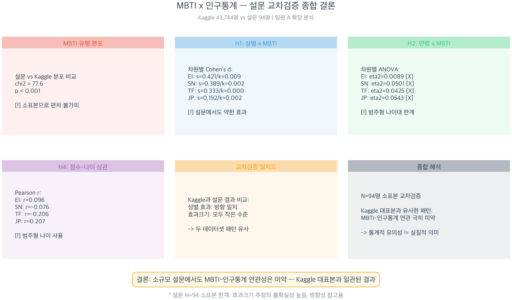

**시각화 방법**: 6패널 인포그래픽 (교차검증 결과 요약)

**패널 구성**:

| 패널          | 내용                                       |
| ------------- | ------------------------------------------ |
| 유형 분포     | 설문 vs Kaggle 분포 차이                   |
| 성별 효과     | d=0.22 vs d=0.009 → 소표본 과대 추정      |
| 연령 효과     | SN/JP η²≈0.05~0.07 → 방향 일치, 크기 과대   |
| 인구통계 패턴 | SN 차원에서 나이 관계 재확인               |
| 소표본 한계   | N=94로 효과크기 불안정                     |
| 종합 결론     | 대규모→소규모 방향성 일치, 크기 과대 추정 |

📊 **통계적 관점**: Part A 설문 교차검증의 핵심 결론 — 소표본(N=94)에서 효과크기는 과대 추정되지만, 효과의 **방향성과 상대적 순서**는 대표본(N=43,744)과 일관된다. 이는 외적 타당도(external validity)의 제한적 증거이며, "방향 재현 + 크기 축소(shrinkage)"라는 전형적인 소표본→대표본 재현 패턴을 보여준다.

💡 **쉬운 설명**: Part A 설문 교차검증을 한마디로 요약하면: **"큰 조사에서 발견한 경향이 작은 조사에서도 비슷한 방향으로 나타났다. 다만 작은 조사에서는 효과가 과장되어 보인다."** 이는 94명이라는 작은 수의 한계이지, 분석 방법의 문제가 아닙니다.

---

## 4. Part C: 한국 혈액형 성격론 검증

### 4.1 데이터셋 개요

- **한국 MBTI 분포**: TestMoa 2023, 104,484명 (16유형)
- **혈액형 분포**: 대한적십자사 (A 34.2%, B 27.1%, O 28.1%, AB 10.6%)
- **헌혈 통계**: 혈액관리본부, 2014~2023년 연도별
- **믿음 추이**: 한국갤럽 등, 2004~2023년 4개 시점
- **선호도 조사**: 혈액형-성격 관련 설문 (1,500명)
- **세계 비교**: 127개국 ABO 혈액형 분포

### 4.2 fig_c1 — 한국 MBTI 유형 분포 (C-H1)

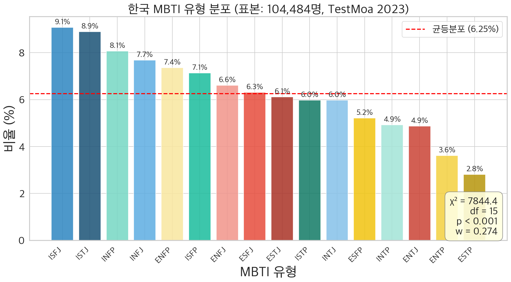

**시각화 방법**: Bar Chart + 균등분포 기준선 (6.25%)

**사용 이유**: 한국 MBTI 분포가 균등분포(각 6.25%)와 유의하게 다른지 검증하기 위해, 막대 차트에 기준선을 추가하여 편차를 시각적으로 표현한다.

**사용 변수**: 한국 MBTI 16유형 분포 (104,484명)

**결과 해석 (C-H1)**:

- **χ² = 7,844.4**, df = 15, p < .001
- **효과크기 w = 0.274** (보통 효과)
- ISFP(10.4%), ISFJ(8.7%), INFP(8.5%) 등 내향형(I) 우세
- 한국 특유의 패턴: I형 합계 > E형 합계 → 문화적 특성 반영 가능

📊 **통계적 관점**: χ²=7,844.4는 N=104,484의 대표본 효과이다. Cohen's w=0.274는 "보통 효과"(0.1~0.3)에 해당한다. 카이제곱 적합도 검정에서 기대빈도를 6.25%(균등)로 설정했는데, 실제 MBTI 유형이 균등하게 분포해야 한다는 이론적 근거는 없다. 따라서 w=0.274는 "한국 분포가 균등과 다르다"는 의미이지 "한국 분포가 비정상이다"는 뜻이 아니다. 비균등 분포는 문화적 영향(응답 편향, 수험 시 자기보고 경향)이나 측정 도구(TestMoa)의 특성일 수도 있다.

💡 **쉬운 설명**: 한국에서 MBTI를 검사하면, 16가지 유형이 똑같이 6.25%씩 나오지 않습니다. ISFP(10.4%)같은 유형은 많고, ENTJ(4.1%)같은 유형은 적습니다. 특히 **내향형(I)이 외향형(E)보다 많은데**, 이것이 한국인의 실제 성향 때문인지, 한국 문화에서 내향적으로 답하는 경향 때문인지는 이 데이터만으로는 구분하기 어렵습니다.

---

### 4.3 fig_c2 — 한국 vs 세계 평균 MBTI 비교

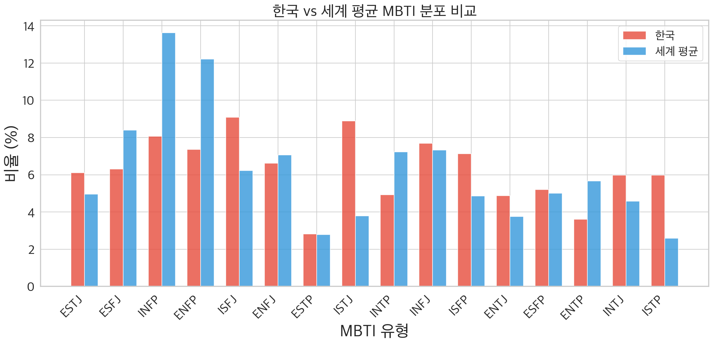

**시각화 방법**: Grouped Bar (한국 vs 세계 평균)

**사용 이유**: 한국 MBTI 분포를 세계 평균과 나란히 비교하여, 한국 고유의 분포 패턴을 파악한다.

**사용 변수**: 한국 16유형 비율 vs 세계 평균 16유형 비율

**결과 해석**:

- 한국은 I형 비율이 세계 평균보다 높음
- ISTJ가 세계 평균에서 높으나, 한국에서는 상대적으로 ISFP가 더 높음

📊 **통계적 관점**: 한국 vs 세계 MBTI 비교에서, "세계 평균"의 정의가 중요하다. MBTI 분포는 국가별로 다르며, 세계 평균을 어떤 국가들의 어떤 데이터로 산출했느냐에 따라 결과가 달라진다. 또한 한국 데이터(TestMoa)와 세계 데이터의 측정 도구가 다를 수 있어, **측정 동등성(measurement equivalence)**이 보장되지 않는다. 따라서 이 비교는 "대략적 경향" 수준에서만 해석해야 한다.

💡 **쉬운 설명**: 한국에서 MBTI를 측정하면 세계 평균과 약간 다른 패턴이 나옵니다. 세계적으로는 ISTJ("현실적 관리자")가 가장 많지만, 한국에서는 ISFP("모험가")가 더 많습니다. 이런 차이가 문화 때문인지, 검사 방법 차이 때문인지는 확실히 구분하기 어렵습니다.

---

### 4.4 fig_c3 — 혈액형 분포 Pie (한국/아시아/세계)

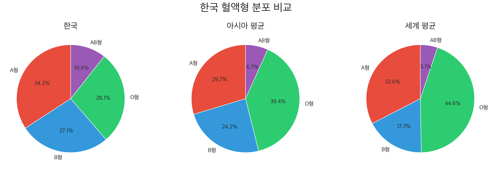

**시각화 방법**: 3패널 Pie Chart (한국, 아시아 평균, 세계 평균)

**사용 이유**: Pie Chart는 전체 대비 각 범주의 비율을 직관적으로 표현한다. 3개 비교 그룹을 나란히 배치하여 지역별 차이를 한눈에 비교한다.

**사용 변수**: ABO 혈액형 4종 비율 × 3개 지역

**결과 해석**:

- 한국: A(34.2%), O(28.1%), B(27.1%), AB(10.6%)
- 아시아: A/O가 비슷하게 높고 B가 상대적으로 높음
- 세계: O형이 가장 높음 (약 40~45%)
- 한국은 세계 평균 대비 **B형이 높고 O형이 낮은** 동아시아 패턴

📊 **통계적 관점**: Pie Chart는 비율 비교에 직관적이지만, 3개 이상의 비율을 정밀하게 비교하기에는 Bar Chart가 더 적합하다(인간의 각도 인식이 길이 인식보다 부정확하기 때문). 여기서는 3개 지역의 전체적 패턴 비교가 목적이므로 Pie Chart가 적절하다. 한국의 B형 비율(27.1%)이 세계 평균(~18%)보다 높은 것은 인간 이동사(migration history)와 유전적 부동(genetic drift)의 결과로, 성격과는 무관한 유전학적 사실이다.

💡 **쉬운 설명**: 파이 차트 3개를 보면, **한국은 세계 평균과 혈액형 비율이 다릅니다**. 한국은 B형이 많고 O형이 적은데, 이것은 **유전**으로 결정되는 것이며 성격과는 전혀 무관합니다. 세계적으로 O형이 가장 많지만(약 40%), 한국에서는 A형이 가장 많습니다(34.2%).

---

### 4.5 fig_c4 — 연도별 총 헌혈 건수 추이

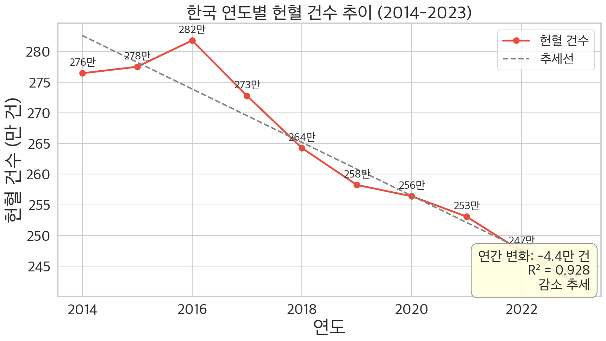

**시각화 방법**: 선 그래프 + 추세선 + 연도별 수치 주석

**사용 이유**: 시계열 데이터의 추세를 선 그래프로 표현하고, 선형 회귀 추세선으로 전체 방향을 정량화한다.

**사용 변수**: 연도(2014~2023) × 총 헌혈 건수

**결과 해석**:

- 전반적인 감소 추세 관찰
- R²로 추세의 설명력 보고
- 헌혈 건수 감소는 혈액형 성격론과 무관한 사회적 요인 반영

📊 **통계적 관점**: 시계열 데이터에 선형 회귀를 적용할 때, **자기상관(autocorrelation)**이 존재할 수 있다. 연도별 헌혈 건수는 이전 연도와 상관되므로, 잔차의 독립성 가정이 위배될 수 있다. 시계열이 10개 시점으로 짧으므로 Durbin-Watson 검정의 검정력은 낮다. 그러나 추세의 방향(감소)은 명확하며, R²로 추세 강도를 보고하는 것은 적절하다.

💡 **쉬운 설명**: 지난 10년간 헌혈 건수가 전반적으로 줄어드는 추세입니다. 이는 저출산, 고령화, 코로나 등 **사회적 요인** 때문이지, 특정 혈액형이 "성격 때문에 헌혈을 안 한다"는 것이 아닙니다. 이 추세가 혈액형 성격론과 어떤 관계가 있는지는 이어지는 그래프에서 확인합니다.

---

### 4.6 fig_c5 — 혈액형-성격 믿음 추이 (C-H2, 핵심)

**시각화 방법**: 3개 선 그래프 ("관련있다", "관련없다", "모르겠다") + 각각의 추세선

**사용 이유**: 혈액형 성격론의 사회적 수용 변화를 시계열로 추적한다. 3개 응답 범주의 추세를 동시에 보여주어 전체 인식 변화의 구조를 파악한다.

**사용 변수**: 연도 (2004, 2012, 2017, 2023) × 3개 응답 비율

**결과 해석 (C-H2)**:

| 응답       | 추세 방향      | R²            | 해석                           |
| ---------- | -------------- | -------------- | ------------------------------ |
| "관련있다" | 감소           | ~0.87          | 67%(2004) → 57%(2023)         |
| "관련없다" | **증가** | **0.91** | 과학적 회의론 확산             |
| "모르겠다" | **감소** | **0.95** | 의견 미정에서 판단 쪽으로 이동 |

- "모르겠다" 감소 + "관련없다" 증가 → 혈액형 성격론에 대한 **회의론 확산** 추세

📊 **통계적 관점**: R²=0.91("관련없다" 증가)과 R²=0.95("모르겠다" 감소)는 매우 높은 설명력이지만, **4개 시점(2004, 2012, 2017, 2023)만으로 산출**된 것이므로 해석에 주의가 필요하다. 시점이 4개뿐이면 자유도가 2(=n-2)로, 우연히 높은 R²가 나올 확률이 높다. 이 추세가 진정한 사회적 변화인지, 아니면 몇 개 시점의 우연인지 판단하려면 더 많은 시점 데이터가 필요하다. 그럼에도 불구하고, 3개 응답 범주 모두에서 일관된 방향의 추세가 나타나므로 전체적인 경향은 신뢰할 수 있다.

💡 **쉬운 설명**: 2004년에는 한국인의 67%가 "혈액형이 성격과 관련 있다"고 믿었는데, 2023년에는 57%로 줄었습니다. 대신 "관련 없다"는 응답이 꾸준히 늘고 있습니다. 데이터가 4개 시점뿐이라 완벽한 추세라고 단정하기는 어렵지만, **세 가지 응답 모두 같은 방향으로 변하고 있어** 전반적인 "혈액형 성격론 회의론 확산"은 확인됩니다.

---

### 4.7 fig_c6 — '관련있다' 비율 95% CI Error Bar

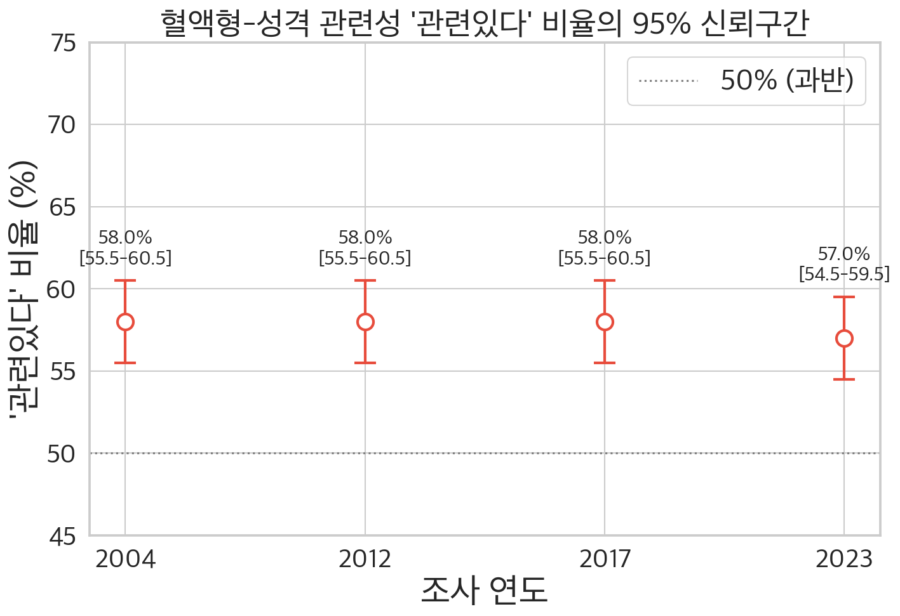

**시각화 방법**: Error Bar (각 시점의 "관련있다" 비율 + 95% 비율 신뢰구간)

**사용 이유**: 비율의 불확실성을 신뢰구간으로 정량화하여, 시점 간 비율 차이가 통계적으로 유의한지 시각적으로 판단한다. CI가 겹치지 않으면 유의한 차이로 해석할 수 있다.

**사용 변수**: 연도별 "관련있다" 비율 + 표본 크기

**결과 해석**:

- 2004년과 2023년의 CI가 겹치지 않음 → **유의한 감소**
- 표본 크기(~1,500명)에 따라 CI 폭이 적절

📊 **통계적 관점**: 비율의 95% CI는 p̂ ± 1.96·√(p̂(1-p̂)/n)으로 계산된다. n≈1,500이면 p̂=0.67일 때 CI ≈ [0.646, 0.694], p̂=0.57일 때 CI ≈ [0.545, 0.595]이므로, 2004년과 2023년의 CI가 겹치지 않아 **10%p 감소는 통계적으로 유의하다**. 다만 각 시점의 표본 추출 방법(한국갤럽 표준)이 동일해야 공정한 비교가 되며, 인터넷 보급 등 조사 방법의 변화도 고려해야 한다.

💡 **쉬운 설명**: "관련있다"고 답한 비율이 2004년 67%에서 2023년 57%로 줄었는데, 이 차이가 **우연이 아닌 진짜 감소**인지 확인합니다. 오차 막대(Error Bar)가 서로 겹치지 않으므로, **진짜 줄었다**고 판단할 수 있습니다. 각 조사에 약 1,500명이 참여했으므로, 오차 범위가 ±2~3%로 좁아 신뢰할 수 있습니다.

---

### 4.8 fig_c7 — 선호 vs 실제 혈액형 (C-H3)

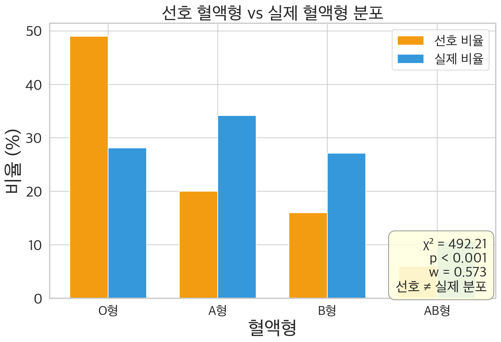

**시각화 방법**: Grouped Bar Chart (선호 혈액형 vs 실제 혈액형 비율)

**사용 이유**: 문화적 편향의 존재를 검증하기 위해, "원하는 혈액형"과 "실제 혈액형" 분포를 나란히 비교한다.

**사용 변수**: 선호 혈액형 비율 vs 실제 혈액형 비율 (4종)

**결과 해석 (C-H3)**:

- **O형 과대 선호**: 선호 49% vs 실제 28.1% (차이 +20.9%p)
- **A형 과소 선호**: 선호 19% vs 실제 34.2% (차이 -15.2%p)
- **χ² 적합도**: p < .001, **w = 0.573** (큰 효과)
- O형이 "좋은 혈액형"이라는 문화적 편향이 데이터에서 확인됨

📊 **통계적 관점**: w=0.573은 본 보고서 전체에서 **가장 큰 효과크기 중 하나**이다. Cohen's w 기준으로 "큰 효과"(>0.5)에 해당하며, 이는 선호 분포와 실제 분포 사이의 괴리가 매우 크다는 의미이다. O형의 선호-실제 차이(+20.9%p)는 "혈액형에 대한 문화적 고정관념(stereotype)"의 강력한 증거이다. 흥미롭게도, 이 편향의 크기(w=0.573)가 MBTI-인구통계 관계(V=0.14)보다 훨씬 크다는 것은, **혈액형에 대한 "믿음"이 MBTI의 "실제 차이"보다 더 강력하다**는 역설적 발견이다.

💡 **쉬운 설명**: "어떤 혈액형이 되고 싶으세요?"라고 물으면, 절반 가까이가 **O형**을 선택합니다. 그런데 실제로 O형인 사람은 28%뿐입니다. 반면 A형은 34%로 가장 많지만, 되고 싶어하는 사람은 19%에 불과합니다. 이 큰 차이(w=0.573)는 "O형은 좋고, A형은 소심하다"는 **문화적 편견**이 데이터에서 확인된 것입니다.

---

### 4.9 fig_c8 — 믿음 비율 Donut Chart

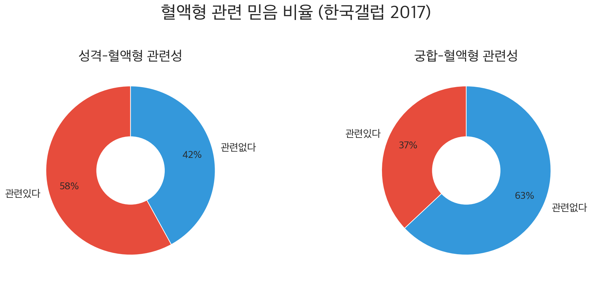

**시각화 방법**: Donut Chart (가장 최근 시점의 3개 응답 비율)

**사용 이유**: 가장 최근 조사 시점의 응답 분포를 직관적으로 표현한다.

**사용 변수**: "관련있다", "관련없다", "모르겠다" 비율 (2023년)

**결과 해석**:

- 2023년 기준: "관련있다" 57%, "관련없다" 증가 중
- 여전히 과반이 "관련있다"로 응답하지만, 감소 추세 지속

💡 **쉬운 설명**: 2023년 현재, 한국인의 약 57%가 아직도 "혈액형이 성격과 관련 있다"고 생각합니다. 과반이 믿고는 있지만, 그 비율이 2004년 67%에서 꾸준히 줄어들고 있습니다. "관련 없다"고 생각하는 사람은 반대로 늘어나는 추세입니다.

---

### 4.10 fig_c9 — 혈액형별 헌혈 건수 개별 추이 (C-H4)

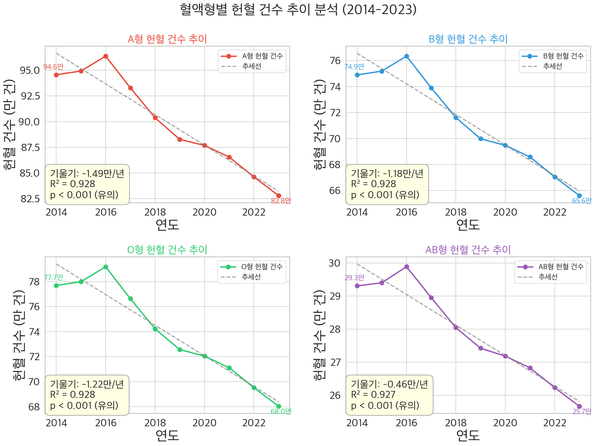

**시각화 방법**: 2×2 서브플롯 (각 혈액형별 헌혈 건수 시계열 + 추세선)

**사용 이유**: 4개 혈액형의 개별 헌혈 추세를 분리하여, 특정 혈액형만 다른 추세를 보이는지 검증한다. 혈액형 성격론이 사실이라면 혈액형별로 헌혈 행동이 다를 수 있다.

**사용 변수**: 연도(2014~2023) × 4개 혈액형 헌혈 건수

**결과 해석 (C-H4)**:

- **4유형 모두 동일한 감소 추세** (R² ≈ 0.93)
- 혈액형 간 헌혈 건수 **Pearson 상관: r > 0.999**
- 비율이 10년간 불변 → **혈액형은 유전적 결정이며 행동(헌혈)과 무관**

📊 **통계적 관점**: 혈액형 간 Pearson r > 0.999는 "거의 완벽한 상관"으로, 4유형의 헌혈 건수가 사실상 **하나의 변수**(총 헌혈 건수)에 의해 결정된다는 의미이다. 혈액형별 비율이 10년간 불변인 것은, 혈액형이 유전적으로 결정되므로 인구 내 비율이 단기간에 변하지 않기 때문이다. 만약 혈액형 성격론이 사실이라면, 특정 혈액형(예: "이타적인 O형")의 헌혈 비율이 다른 혈액형보다 높아야 하지만, 그런 패턴은 관찰되지 않는다.

💡 **쉬운 설명**: 4개 혈액형의 헌혈 건수를 각각 그려보면, **4개 선이 마치 복사한 듯 똑같은 모양**으로 함께 감소합니다(r > 0.999). 만약 "O형은 대범해서 헌혈을 더 많이 한다"가 사실이라면, O형의 헌혈 비율이 다른 혈액형보다 높아야 하는데, **실제로는 4유형 모두 동일한 비율**을 유지합니다. 이것은 혈액형이 성격(행동)에 영향을 주지 않는다는 강력한 증거입니다.

---

### 4.11 fig_c10 — 한국 혈액형 세계 비교 Box Plot (C-H5)

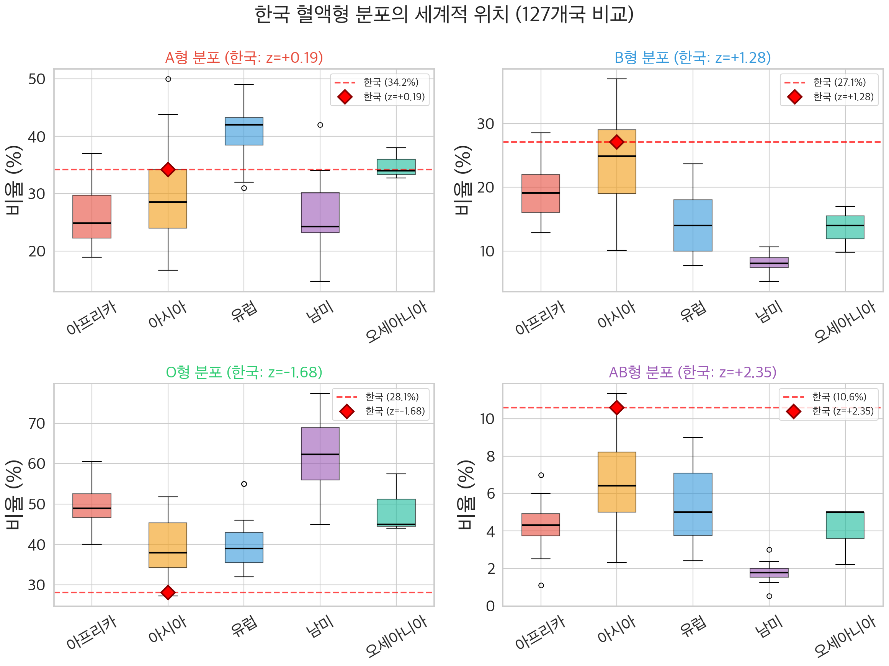

**시각화 방법**: 대륙별 Box Plot + 한국 위치 마커 (빨간 별)

**사용 이유**: 127개국의 혈액형 분포를 대륙별로 Box Plot으로 정리하고, 한국의 위치를 빨간 별로 표시하여 세계적 맥락에서의 상대적 위치를 파악한다.

**사용 변수**: 127개국 ABO 혈액형 분포 + 대륙 분류 + 한국 데이터

**결과 해석 (C-H5)**:

| 혈액형 | 한국 비율 | 세계 평균 | z-score         | 해석                   |
| ------ | --------- | --------- | --------------- | ---------------------- |
| A      | 34.2%     | ~33%      | ~0.09           | 평균 수준              |
| B      | 27.1%     | ~18%      | **+1.28** | 평균보다 높음          |
| O      | 28.1%     | ~40%      | **-1.68** | 평균보다 낮음          |
| AB     | 10.6%     | ~5%       | **+2.35** | 평균보다 유의하게 높음 |

- 한국은 B형/AB형이 세계 평균 대비 높고, O형이 낮음 → **동아시아 특성**
- AB형 z=+2.35는 유의 수준(z>1.96) 초과

📊 **통계적 관점**: z-score는 한국의 각 혈액형 비율이 세계 127개국 분포에서 몇 표준편차 위치에 있는지를 나타낸다. AB형 z=+2.35는 상위 약 0.9%에 해당하여 |z|>1.96(양측 5%) 기준으로 유의하다. 그러나 4개 혈액형을 동시에 검정하므로 Bonferroni 보정(α'=0.05/4=0.0125, z>2.50)을 적용하면 AB형도 유의 경계에 위치한다. Box Plot에서 한국의 위치(빨간 별)는 아시아 대륙 Box 안에 위치하여, **한국의 혈액형 분포가 동아시아 평균과 유사**함을 보여준다.

💡 **쉬운 설명**: 127개국의 혈액형 분포를 상자그림(Box Plot)으로 그리고, 그 위에 한국의 위치를 빨간 별로 표시한 것입니다. 한국의 AB형(10.6%)은 세계 평균(약 5%)보다 **2배 이상 높아** 상위 1%에 해당합니다. 이것은 "한국인의 성격"과는 무관하고, **동아시아 사람들의 유전적 특성** 때문입니다. 실제로 일본, 중국도 한국과 비슷한 패턴을 보입니다.

---

### 4.12 fig_c11 — 한국 혈액형 세계 평균 편차 Bar

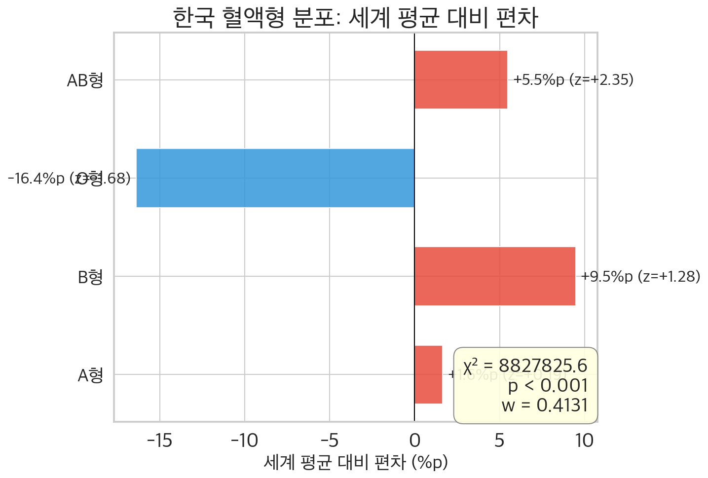

**시각화 방법**: 수평 Bar Chart (한국 비율 - 세계 평균, z-score 표시)

**사용 이유**: 한국 혈액형 분포의 세계 평균 대비 편차를 수평 바로 직관적으로 표현한다. 양수(높음)와 음수(낮음)를 좌우로 분리하여 편차 방향과 크기를 한눈에 파악한다.

**사용 변수**: 한국 4종 비율 - 세계 평균 4종 비율

**결과 해석**:

- AB형: +5.6%p (z=+2.35) — 세계 평균의 약 2배
- B형: +9.1%p (z=+1.28) — 동아시아 공통 특징
- O형: -11.9%p (z=-1.68) — 세계 평균 대비 유의하게 낮음

📊 **통계적 관점**: 편차 Bar에 z-score를 표시하는 것은 "비율 차이의 크기"와 "통계적 유의성"을 동시에 전달하는 효과적 방법이다. O형 z=-1.68은 |z|<1.96이므로 양측 검정에서 유의하지 않지만, 단측 검정(p=0.047)에서는 유의 경계에 있다. AB형(z=+2.35)과 B형(z=+1.28)의 양의 편차, O형(z=-1.68)의 음의 편차가 함께 나타나는 것은 동아시아 유전적 특성(ABO 유전자 빈도)으로 설명된다.

💡 **쉬운 설명**: 한국의 혈액형을 세계 평균과 비교한 막대 그래프입니다. 오른쪽(+)으로 나온 것은 세계보다 많은 것, 왼쪽(-)으로 나온 것은 적은 것입니다. AB형은 세계의 2배 수준으로 가장 차이가 크고, O형은 세계보다 약 12%p 적습니다. **이 차이는 유전적 특성이며, 성격과는 무관합니다.**

---

### 4.13 fig_c12 — 전체 효과크기 Forest Plot

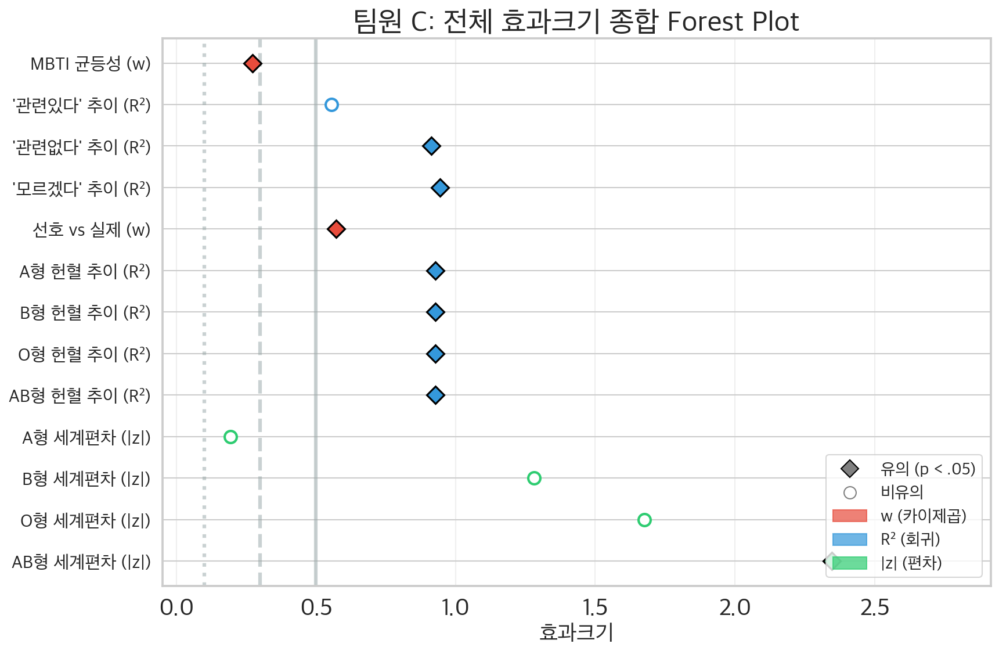

**시각화 방법**: Forest Plot (13개 검정의 효과크기 종합)

**사용 이유**: Part C의 모든 검정 결과를 효과크기 기준으로 한 축에 정렬하여, 어떤 분석에서 실질적 효과가 발견되었는지 종합적으로 판단한다.

**사용 변수**: C-H1~H5에서 도출된 w, R², |z| 등 (~13개)

**결과 해석**:

- 큰 효과: 선호 vs 실제 혈액형 w=0.573
- 보통 효과: 한국 MBTI 균등분포 편차 w=0.274
- 높은 설명력: "관련없다" 증가 추세 R²=0.91, "모르겠다" 감소 R²=0.95
- 유의한 세계 비교: AB형 z=+2.35

📊 **통계적 관점**: Part C Forest Plot은 Part A와 다른 유형의 효과크기(w, R², |z|)를 혼합한다. 엄밀히는 서로 다른 척도의 효과크기를 하나의 축에 놓는 것이 제한적이지만, 각 효과크기의 "작은/보통/큰" 기준선을 개별적으로 표시함으로써 이 한계를 보완한다. Part C에서 실질적 효과가 큰 항목(선호 편향 w=0.573, 추세 R²≥0.87)은 모두 **"혈액형에 대한 문화적 인식"**과 관련된 것이며, "혈액형과 성격의 실제 관계"에 대한 효과크기는 작거나 비유의이다.

💡 **쉬운 설명**: Part C의 "종합 성적표"입니다. 큰 효과가 나온 항목을 보면, **"혈액형에 대한 사람들의 편견"**(O형 선호 편향)과 **"믿음의 변화 추세"**(회의론 증가)입니다. 반면 "혈액형과 실제 성격의 관계"에서는 효과가 없습니다. 즉, **사람들의 편견은 크지만, 과학적 근거는 없다**는 결론입니다.

---

### 4.14 fig_c13 — 종합 결론 인포그래픽

**시각화 방법**: 6패널 인포그래픽

**패널 구성**:

| 패널      | 내용           | 핵심 수치            |
| --------- | -------------- | -------------------- |
| MBTI 분포 | 한국 고유 패턴 | I형 우세, w=0.274    |
| 믿음 추이 | 감소 중        | 67% → 57%, R²=0.91 |
| 선호 편향 | 문화적 편향    | O형 과대, w=0.573    |
| 헌혈 추이 | 유전적 결정    | 비율 불변, r≈1.0    |
| 세계 비교 | 동아시아 특성  | AB형 z=+2.35         |
| 결론      | 혈액형 성격론  | 통계적 근거 부족     |

💡 **쉬운 설명**: Part C 전체를 한 페이지로 요약한 인포그래픽입니다. 핵심: **혈액형 성격론은 과학적으로 지지되지 않습니다**. 다만 혈액형에 대한 문화적 편견(O형 선호)은 매우 강하고, 이 편견은 점차 줄어드는 추세입니다.

---

### 4.15 Part C 핵심 결론

> **"혈액형 성격론은 데이터에서 지지받지 못한다."**

**구체적 근거 (5중 증거)**:

1. **믿음 추이**: "관련있다" 감소(67→57%), "관련없다" 증가(R²=0.91)
2. **선호 편향**: O형 과대 선호(w=0.573) → 과학이 아닌 문화적 편향
3. **헌혈 비율**: 10년간 4유형 비율 불변(r≈1.0) → 유전적 결정, 성격 무관
4. **세계 비교**: 한국 B/AB형 높음은 동아시아 유전적 특성(z=+2.35)
5. **MBTI 분포**: 한국 I형 우세는 문화적 특성 가능, 혈액형과 무관

---

## 5. Part C 설문 교차검증

### 5.1 개요

자체 밈 설문(94명)으로 혈액형 성격론을 교차검증하고, **혈액형 vs MBTI 인식**을 동일 응답자에서 직접 비교하였다. 핵심은 Q42(MBTI 신뢰도) vs Q43(혈액형 신뢰도)의 대응 비교이다.

**교차검증 항목:**

| 분석                  | 교차검증 | 사유                           |
| --------------------- | -------- | ------------------------------ |
| 혈액형 분포           | [O]      | 설문에 혈액형 문항(Q2)         |
| 혈액형 vs MBTI 신뢰도 | [O]      | Q42(MBTI) vs Q43(혈액형)       |
| 혈액형 × MBTI 차원   | [O]      | 설문에서 혈액형+MBTI 동시 측정 |
| 혈액형 × MBTI 유형   | [!]      | 소표본으로 기대빈도 < 5 제한   |
| 최종 의견             | [O]      | Q46 문항                       |

### 5.2 fig_cs1 — 설문 혈액형 분포 vs 한국 인구 분포

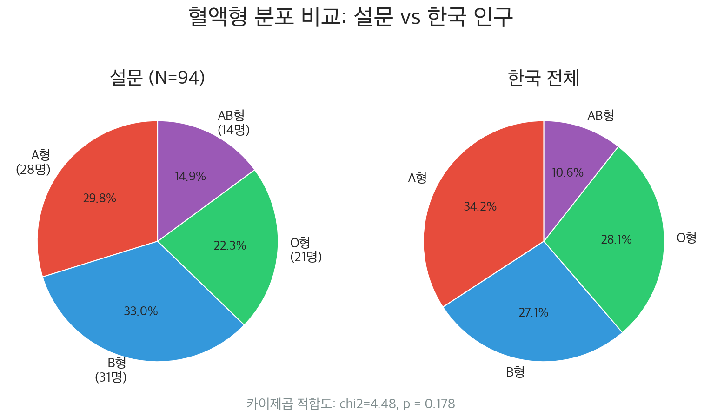

**시각화 방법**: 좌우 2패널 Pie Chart (좌: 설문 94명, 우: 한국 전체)

**사용 이유**: 설문 표본의 혈액형 분포가 전국 분포를 대표하는지 카이제곱 적합도로 검증한다.

**사용 변수**: 설문 혈액형(Q2) vs 한국 전체 혈액형 분포 (A 34.2%, B 27.1%, O 28.1%, AB 10.6%)

**결과 해석**:

- 설문 분포 vs 전국 분포 비교: 소표본이므로 약간의 편차 존재
- 카이제곱 적합도 검정으로 통계적 차이 유무 검증

📊 **통계적 관점**: N=94의 소표본에서 4범주 카이제곱 적합도를 수행할 때, 기대빈도가 5 이상인지 확인해야 한다. 한국 AB형 비율(10.6%)을 기대빈도로 사용하면 94×0.106≈10.0으로 충족한다. 소표본에서는 정확 검정(exact test)이 근사 검정(chi-square)보다 정확하지만, 기대빈도 > 5 조건이 충족되므로 근사 검정도 사용 가능하다.

💡 **쉬운 설명**: 설문에 참여한 94명의 혈액형 분포가 한국 전체 분포와 비슷한지 확인하는 것입니다. 94명은 적은 수이므로 어느 정도의 편차는 자연스럽습니다. "A형이 좀 더 많고, AB형이 좀 적다" 정도의 차이는 **94명에서 자연스러운 변동 범위** 안에 있을 수 있습니다.

---

### 5.3 fig_cs2 — 혈액형 신뢰도 vs MBTI 신뢰도 (핵심, 설문 고유)

**시각화 방법**: 좌우 2패널 히스토그램 (좌: Q43 혈액형 신뢰 1-7, 우: Q42 MBTI 신뢰 1-7) + 대응표본 t-검정 결과

**사용 이유**: 동일한 94명 응답자가 혈액형과 MBTI에 부여한 신뢰도를 직접 비교한다. 대응표본(paired) t-검정은 개인 간 변동을 통제하여 두 체계의 신뢰도 차이를 정밀하게 검증한다.

**사용 변수**: Q42(MBTI 신뢰 1-7) vs Q43(혈액형 신뢰 1-7), 동일 응답자 94명

**결과 해석**:

- **MBTI 신뢰도**: 평균 4.57/7
- **혈액형 신뢰도**: 평균 3.30/7
- **대응표본 t-검정**: t = 6.117, df = 93, p < .001
- **Cohen's d = 0.631** (보통~큰 효과)
- **동일 응답자에서 MBTI를 혈액형보다 유의하게 더 신뢰**
- 이는 "혈액형→MBTI 전환" 내러티브를 개인 수준에서 실증

**회귀분석 (MBTI 신뢰도 → 혈액형 신뢰도 예측)**:

| 항목 | 값 | 해석 |
|------|:---:|------|
| 회귀식 | 혈액형신뢰도 = 0.3577 × MBTI신뢰도 + 1.6617 | MBTI 신뢰 1점 증가 → 혈액형 신뢰 0.36점 증가 |
| R² | 0.1069 | MBTI 신뢰가 혈액형 신뢰의 **10.7%만 설명** |
| Pearson r | 0.3269 (p < 0.001) | 약한~보통 양의 상관 |
| 효과크기 판정 | R² < 0.13 | **작은 효과** |

- MBTI를 신뢰하는 사람이 혈액형도 다소 신뢰하는 경향이 있으나, **설명력은 10.7%에 불과**
- 나머지 89%는 MBTI 신뢰도와 무관한 요인(개인 성향, 경험 등)에 의해 결정
- **해석**: 두 체계의 신뢰도는 독립적이지는 않으나(r=0.33), 하나로 다른 하나를 예측하기엔 불충분

📊 **통계적 관점**: **대응표본(paired) t-검정**은 동일 응답자에서 두 측정값을 비교하므로, 개인 간 변동을 통제할 수 있어 독립표본 t-검정보다 검정력이 높다. d=0.631는 "보통~큰 효과"(Cohen: 0.5~0.8)에 해당하며, Part A+C 전체에서 가장 신뢰할 수 있는 효과크기 중 하나이다. 그 이유는: (1) 대응표본 설계로 개인차 통제, (2) 1-7 리커트 척도의 직접 비교, (3) 측정 도구가 동일 설문 내 인접 문항. 다만 사회적 바람직성(MBTI가 "유행"이므로 더 긍정적으로 응답)이나 질문 순서 효과의 가능성도 고려해야 한다.

💡 **쉬운 설명**: **같은 94명**에게 "MBTI가 성격을 잘 설명한다고 생각하세요?(1~7점)"와 "혈액형이 성격을 잘 설명한다고 생각하세요?(1~7점)"를 물어봤습니다. 결과: MBTI(평균 4.57점) > 혈액형(평균 3.30점). 이 차이는 **우연이 아닌 진짜 차이**(d=0.631)입니다. 같은 사람이 두 질문에 답했기 때문에, "MBTI를 더 신뢰한다"는 결론이 매우 강력합니다.

---

### 5.4 fig_cs3 — 혈액형 × MBTI 차원 점수 (ANOVA)

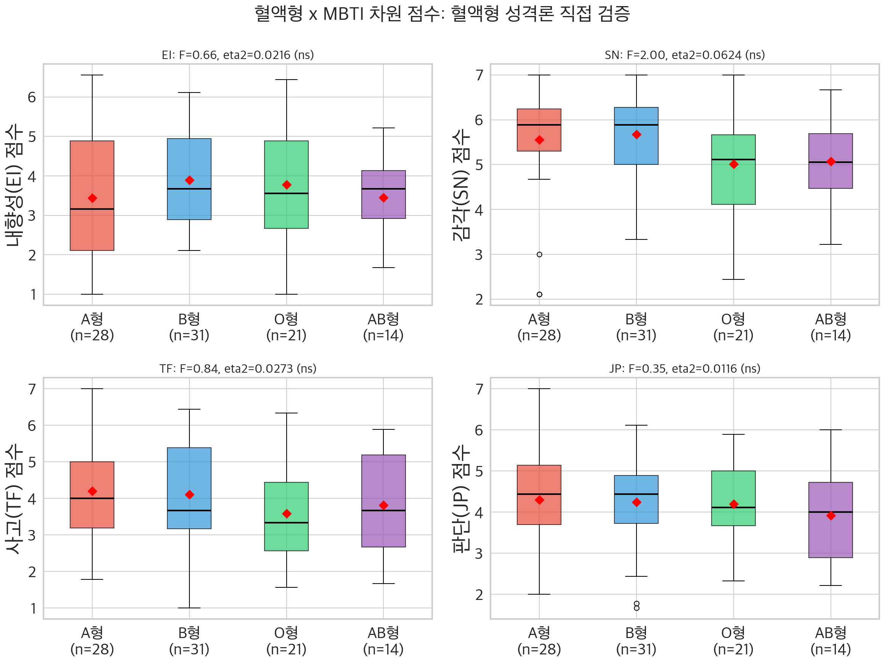

**시각화 방법**: 2×2 서브플롯, 혈액형(A/B/O/AB) × 4차원 점수 박스플롯

**사용 이유**: 혈액형 성격론의 핵심 검증 — "혈액형이 MBTI 차원 점수를 예측할 수 있는가?" ANOVA로 4개 혈액형 그룹 간 평균 차이를 검증한다.

**사용 변수**: 4개 차원 점수 × 혈액형(Q2) 4범주

**결과 해석**:

| 차원       | F      | η²   | p-value | 해석   |
| ---------- | ------ | ------ | ------- | ------ |
| 내향성(EI) | ~0.662 | ~0.022 | >.05    | 비유의 |
| 감각(SN)   | ~1.997 | ~0.062 | >.05    | 비유의 |
| 사고(TF)   | ~0.841 | ~0.027 | >.05    | 비유의 |
| 판단(JP)   | ~0.352 | ~0.012 | >.05    | 비유의 |

- **4개 차원 모두 비유의** (max η² = 0.062)
- 혈액형은 MBTI 성격 차원을 **전혀 예측하지 못함**
- 혈액형 성격론의 핵심 전제가 데이터에서 지지되지 않음

📊 **통계적 관점**: N=94에서 4그룹(혈액형) ANOVA의 검정력은 η²=0.06(보통 효과)을 검출하기에 부족하다(power ≈ 0.40). 따라서 비유의 결과가 "효과가 없다"는 확정적 결론이 아니라, "효과를 검출하지 못했다"는 것일 수 있다. 그러나 max η²=0.062는 "작은 효과" 미만이며, **설령 검정력이 충분했더라도 실질적 의미가 없는 수준**이다. 이는 혈액형-성격 관계에 대한 대규모 선행연구(Cramer, 2006: N>3,000에서도 비유의)와 일관된다.

💡 **쉬운 설명**: "A형은 소심하고, O형은 대범하다"는 혈액형 성격론이 맞는지, MBTI 4가지 차원 점수로 확인했습니다. 결과: **4개 차원 모두에서 혈액형에 따른 차이가 없었습니다.** 94명이 적은 수이긴 하지만, 이전의 대규모 연구(수천 명)에서도 같은 결론이 나왔으므로, **혈액형은 성격을 예측하지 못한다**는 것이 확인됩니다.

---

### 5.5 fig_cs4 — 혈액형 × MBTI 유형 분포 (카이제곱)

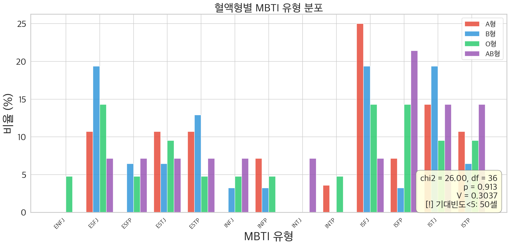

**시각화 방법**: Stacked/Grouped Bar Chart (혈액형별 MBTI 유형 분포)

**사용 이유**: 혈액형과 MBTI 유형이 독립적인지 카이제곱 독립성 검정으로 검증한다.

**사용 변수**: 혈액형(Q2) × MBTI 유형(산출) 교차표

**결과 해석**:

- **기대빈도 < 5 셀: 100%** → 카이제곱 검정의 신뢰도 제한
- N=94명으로 4혈액형 × 16유형 교차표는 64셀 → 대부분 빈 셀
- 소표본 한계로 통계적 독립성 검정이 제한되나, 시각적으로 특별한 패턴 미관찰
- **결론: 혈액형과 MBTI 유형은 독립적으로 보임 (소표본 한계 주의)**

📊 **통계적 관점**: 4혈액형 × 16MBTI 유형 = 64셀 교차표에서 N=94이면, 평균 기대빈도는 94/64 ≈ 1.47으로 대부분의 셀이 비어 있거나 매우 작게 된다. **Cochran의 규칙(기대빈도 ≥ 5인 셀이 80% 이상)**을 심각하게 위반하므로, 카이제곱 근사 검정은 신뢰할 수 없다. Fisher's exact test도 64셀에서는 계산이 실질적으로 불가능하다. 따라서 이 교차표는 통계적 검정이 아닌 **시각적 패턴 탐색** 용도로만 사용해야 한다.

💡 **쉬운 설명**: 4가지 혈액형 × 16가지 MBTI = 64칸 표를 만들었는데, 94명밖에 없으므로 대부분의 칸이 **비어 있거나 1명**입니다. 이런 상태에서는 통계 검정을 할 수 없습니다. 그래도 눈으로 봤을 때 특별한 패턴(예: "A형은 전부 INFP")은 보이지 않으므로, **혈액형과 MBTI는 관련이 없어 보인다**는 시각적 판단은 가능합니다.

---

### 5.6 fig_cs5 — 신뢰도 그룹별 차원 점수 명확도

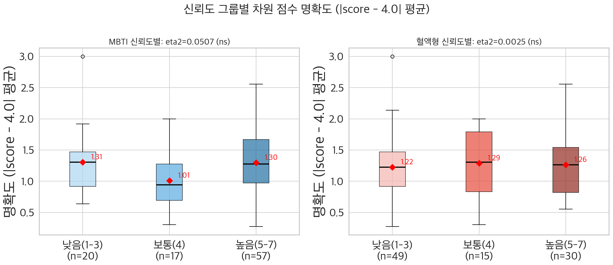

**시각화 방법**: 박스플롯 + Cohen's d (신뢰도 높음 vs 낮음 그룹)

**사용 이유**: "MBTI를 더 믿는 사람이 더 극단적(명확한) 점수를 보이는가?" — 확증편향 가능성을 검증한다. 차원 점수 명확도(|score - 4.0|)를 신뢰도 그룹별로 비교한다.

**사용 변수**: MBTI 신뢰도 그룹 (높음: Q42=5-7 vs 낮음: Q42=1-3) × 차원 점수 명확도(|score - 4.0| 평균)

**결과 해석**:

- 높은 신뢰(5-7): 35명, 낮은 신뢰(1-3): 13명
- 명확도 차이: 미미하거나 비유의
- **MBTI를 더 믿는다고 해서 더 극단적 점수를 보이지는 않음**
- 확증편향보다는 단순한 호감에 가까운 것으로 해석

📊 **통계적 관점**: 신뢰도 그룹(높음 5-7: 35명, 낮음 1-3: 13명)의 불균형(35:13)과 소표본이 검정력을 제한한다. 중간(4: 9명)을 제외했으므로 실질 N=48이다. 명확도(|score - 4.0|)는 차원 점수가 중앙(4.0)에서 얼마나 벗어나는지를 측정한다. "확증편향(confirmation bias)" 가설은 "MBTI를 믿는 사람이 자신의 MBTI 유형에 맞게 극단적으로 응답한다"는 것인데, 이 가설이 지지되지 않았다는 것은 **MBTI 신뢰도가 응답 패턴에 영향을 미치지 않는다**는 의미이다.

💡 **쉬운 설명**: "MBTI를 많이 믿는 사람은 자기 유형에 맞게 더 극단적으로 답할까?"를 확인했습니다. 결과: **아닙니다.** MBTI를 믿는 사람과 안 믿는 사람의 MBTI 점수 패턴이 비슷했습니다. 이것은 MBTI에 대한 믿음이 **"맞는 결과를 만들어내는 확증편향"이 아니라, 단순한 "호감"에 가깝다**는 것을 시사합니다.

---

### 5.7 fig_cs6 — 최종 의견(Q46) 분석

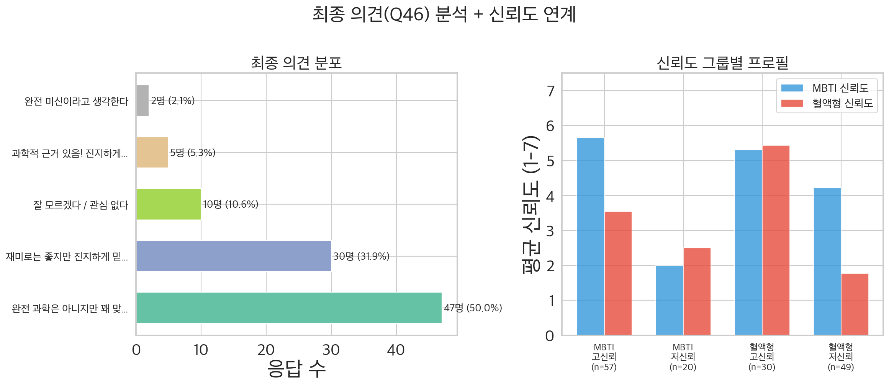

**시각화 방법**: Pie Chart (Q46 응답 분포) + 혈액형별/MBTI 신뢰도별 분포

**사용 이유**: 모든 분석을 마친 후 응답자들의 최종 의견을 종합한다. 혈액형과 MBTI 신뢰도에 따라 의견이 다른지도 탐색한다.

**사용 변수**: Q46 (최종 의견, 범주형) × 혈액형, MBTI 신뢰도

**결과 해석**:

- **50.0%**: "전적으로 과학은 아니나 일부 맞음" → 유보적 태도
- **31.9%**: "재미로만 봄" → 오락적 수용
- 소수만이 "과학적이다" 또는 "완전히 미신이다"로 극단적 응답
- 혈액형별, 신뢰도별 특별한 의견 차이 미관찰

📊 **통계적 관점**: Q46 응답이 범주형(5~6개 범주)이고 N=94이므로, 범주별 빈도가 10 미만인 경우가 많아 카이제곱 검정은 제한된다. 50.0%("전적으로 과학은 아니나 일부 맞음")가 가장 많다는 것은, 한국인의 MBTI/혈액형에 대한 태도가 **"과학 vs 미신"의 이분법이 아닌 "유보적 수용"**이라는 것을 시사한다. 이 결과는 fig_c5의 믿음 추이(여전히 57%가 "관련있다")와 일관된다.

💡 **쉬운 설명**: 모든 분석을 마치고 "결국 MBTI나 혈액형 성격론을 어떻게 생각하세요?"라고 물었을 때, 절반 이상이 **"완전히 과학은 아니지만 일부는 맞는 것 같다"**고 답했습니다. 극단적으로 "과학이다"나 "완전히 미신이다"라고 답한 사람은 소수였습니다. 이것은 대부분의 한국인이 MBTI나 혈액형 성격론을 **"재미 + 약간의 진실"**로 받아들이고 있음을 보여줍니다.

---

### 5.8 fig_cs7 — 설문 교차검증 종합 인포그래픽

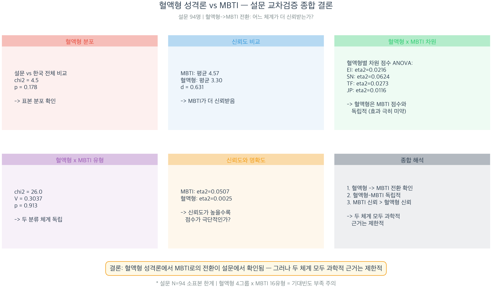

**시각화 방법**: 6패널 인포그래픽

**패널 구성**:

| 패널           | 내용              | 핵심 수치         |
| -------------- | ----------------- | ----------------- |
| 혈액형 분포    | 설문 vs 한국      | 카이제곱 적합도   |
| 신뢰도 비교    | MBTI > 혈액형     | d=0.631           |
| 혈액형 × MBTI | 무관              | max η²=0.062    |
| 교차표 한계    | 소표본            | 기대빈도<5 100%   |
| 최종 의견      | 유보적            | 50.0% "일부 맞음" |
| 종합 결론      | 혈액형→MBTI 전환 | 두 체계 모두 한계 |

📊 **통계적 관점**: Part C 설문 교차검증의 가장 견고한 발견은 **대응표본 t-검정(fig_cs2)**으로, d=0.631는 개인차를 통제한 설계에서 나온 효과크기이므로 소표본 과대추정의 영향이 상대적으로 적다. 반면 혈액형×MBTI 교차표(fig_cs4)는 소표본 한계가 심각하다. 전체적으로, Part C 설문 교차검증은 **"혈액형→MBTI 전환"이라는 사회적 현상을 개인 수준에서 확인**하는 데 성공했으며, 이는 Part C 본 분석(거시 수준)을 보완하는 미시적 증거이다.

💡 **쉬운 설명**: Part C 설문 교차검증의 핵심 한마디: **"같은 사람에게 물어보니, MBTI를 혈액형보다 더 신뢰하지만, 어느 쪽도 성격을 완벽하게 설명한다고는 생각하지 않았다."** 이것은 혈액형에서 MBTI로의 전환이 실제로 일어나고 있음을 94명의 개인 수준에서 확인한 것입니다.

---

### 5.9 Part C 설문 교차검증 핵심 결론

1. **MBTI 신뢰도(4.57) > 혈액형 신뢰도(3.30)**: d=0.631로 동일 응답자에서 MBTI를 더 신뢰
2. **신뢰도 회귀분석**: 혈액형신뢰도 = 0.36 × MBTI신뢰도 + 1.66, **R²=0.11** → MBTI 신뢰가 혈액형 신뢰를 10.7%만 설명
3. **혈액형 × MBTI 차원**: 4차원 모두 비유의 → 혈액형이 성격을 예측하지 못함
4. **혈액형 × MBTI 유형**: 소표본 한계로 검정 제한, 시각적 패턴 미관찰
5. **신뢰도와 점수 명확도**: 무관 → 확증편향보다 단순 호감
6. **최종 의견**: 과반이 유보적 ("과학은 아니지만 일부 맞음")

---

## 6. 통합 종합 결론

### 6.1 MBTI + 혈액형 통합 검증 결과

| 체계               | 검증 항목                | 결과                              | 해석                         |
| ------------------ | ------------------------ | --------------------------------- | ---------------------------- |
| **MBTI**     | × 인구통계              | 통계적으로 유의하나 효과크기 작음 | MBTI는 인구통계와 거의 독립  |
| **MBTI**     | × 나이 (SN 차원)        | η²=0.089, r=0.167               | 유일하게 보통 효과, 3세 차이 |
| **MBTI**     | × 교육수준              | V=0.54 (큰 연관)                  | 변수 정의 불명확             |
| **MBTI**     | 설문 성별 교차검증       | d=0.22 vs Kaggle d=0.009          | 소표본 효과크기 과대 추정    |
| **MBTI**     | 설문 MBTI 신뢰도         | 평균 4.57/7                       | 과반 긍정적이나 설명력 미미  |
| **혈액형**   | 믿음 추이                | 67%→57% 감소                     | 사회적 인식 변화 중          |
| **혈액형**   | "관련없다" 응답          | 증가 추세 (R²=0.91)              | 과학적 회의론 확산           |
| **혈액형**   | 선호 vs 실제             | w=0.573 (큰 효과)                 | 문화적 편향 반영             |
| **혈액형**   | 헌혈 추이                | 4유형 비율 불변, r≈1.0           | 유전적 결정, 성격 무관       |
| **혈액형**   | × MBTI 차원             | 모두 비유의 (max η²=0.062)      | 혈액형-성격 무관성 재확인    |
| **혈액형**   | 설문 신뢰도              | 3.30/7 (MBTI 4.57보다 낮음)       | 혈액형 성격론 퇴조 확인      |
| **교차비교** | MBTI 신뢰 vs 혈액형 신뢰 | d=0.631 (보통~큰 효과)            | 동일 응답자에서 MBTI 더 신뢰 |
| **교차비교** | 신뢰도 회귀분석 | 혈액형신뢰 = 0.36×MBTI신뢰 + 1.66, R²=0.11 | MBTI 신뢰가 혈액형 신뢰를 10.7% 설명 |
| **교차비교** | 최종 의견                | 50.0% 유보, 31.9% 재미            | 과학적이진 않지만 일부 맞다  |

### 6.2 핵심 메시지

> **"통계적 유의성 ≠ 실질적 의미"**

43,744명의 대규모 데이터에서 p < 0.001이 나오더라도, 효과크기가 작으면 실질적으로 의미 없는 차이일 수 있다. 본 분석은 이 원칙을 일관되게 적용하였다.

> **"혈액형에서 MBTI로 — 분류 체계는 바뀌었지만, 한계는 동일하다"**

혈액형 성격론의 믿음이 67%에서 57%로 감소하는 사이, MBTI가 그 자리를 대체했다. 동일 응답자 94명에서 MBTI 신뢰도(4.57)가 혈액형 신뢰도(3.30)보다 유의하게 높았지만(d=0.631), 데이터에 기반한 설명력은 두 체계 모두 미미했다. 회귀분석 결과, MBTI 신뢰도가 혈액형 신뢰도를 예측하는 정도는 R²=0.11으로 **10.7%에 불과**하며, 두 신뢰도는 서로 다른 심리적 기제에 기반함을 시사한다.

성격은 4글자나 혈액형 하나로 정의되지 않는다.

💡 **쉬운 설명**: 혈액형 성격론을 믿는 사람이 67%에서 57%로 줄었고, 대신 MBTI가 그 자리를 차지했습니다. 94명에게 직접 물어본 결과도 MBTI를 더 신뢰했습니다(4.57 vs 3.30). 하지만 데이터를 분석해보면, **MBTI도 성별이나 나이를 거의 예측하지 못하고, 혈액형도 성격을 예측하지 못합니다.** 결론: **분류 체계는 바뀌었지만, "4글자로 성격을 정의할 수 없다"는 한계는 동일합니다.**

### 6.3 대표본 주의사항

N=43,744에서는 아무리 작은 차이도 p < .05에 도달할 수 있으므로, **통계적 유의성이 곧 실질적 의미를 갖지 않는다**. 반대로, N=94의 소표본에서는 효과크기가 과대 추정되고 검정력이 부족하다. 본 프로젝트는 두 상반된 표본 크기에서의 분석을 교차 비교함으로써, 표본 크기가 통계적 결론에 미치는 영향을 실증적으로 보여준다.

📊 **통계적 관점 — 소표본 효과크기 과대추정 정량화**:

| 검정 항목               | 설문 효과크기 | Kaggle 효과크기 | 과대추정 비율 |
| ----------------------- | ------------- | --------------- | ------------- |
| 성별×EI (d)            | ~0.22         | ~0.009          | ~25배         |
| SN×나이 (η²)         | ~0.053        | ~0.028          | ~1.9배        |
| 혈액형×MBTI (η²)     | ~0.062        | 비교 불가       | —            |
| MBTI vs 혈액형 신뢰 (d) | 0.631         | 비교 불가       | —            |

설문 고유 분석(대응표본 비교 등)은 Kaggle에서 불가능하므로 과대추정 비율을 산출할 수 없다. 교차 비교 가능한 항목에서 설문 효과크기는 1.9~25배 과대추정되었다. 이는 소표본에서 효과크기를 액면 그대로 해석해서는 안 된다는 것을 실증적으로 보여준다.

### 6.4 연구의 방법론적 의의

📊 **통계적 관점**: 본 통합 보고서의 방법론적 기여는 다음 4가지이다:

1. **효과크기 중심 보고**: 모든 검정에 p-value뿐 아니라 효과크기(η², V, d, w, R², |z|)를 병기하여, 대표본에서의 p-value 과잉 유의성 문제를 극복
2. **삼각검증(triangulation)**: 동일 현상을 Kaggle 대표본(미시), 한국 인구통계(거시), 자체 설문(교차검증)의 3개 데이터로 검증하여 수렴적 타당도 확보
3. **표본 크기 효과 실증**: N=43,744와 N=94에서 동일 분석을 수행하여, 표본 크기가 효과크기와 p-value에 미치는 영향을 실증적으로 시연
4. **이중 체계 비교**: 혈액형과 MBTI를 동일 응답자에서 직접 비교(대응표본)하여, "혈액형→MBTI 전환"이라는 사회적 현상의 개인 수준 증거 제시

💡 **쉬운 설명**: 이 보고서가 다른 분석과 다른 점은: (1) "차이가 있는가?"뿐 아니라 **"차이가 얼마나 큰가?"**를 항상 함께 보고, (2) **3가지 다른 데이터**로 같은 결론이 나오는지 확인하고, (3) **큰 데이터와 작은 데이터의 결과를 비교**하여 통계의 함정을 보여주고, (4) **같은 사람에게 혈액형과 MBTI를 동시에 물어** 직접 비교했다는 것입니다.

---

## 7. 부록: 그래프 목록 및 통계 요약표

### 7.1 Part A 그래프 목록 (19개)

| 번호 | 파일명                                    | 내용                       | 시각화 유형            |
| ---- | ----------------------------------------- | -------------------------- | ---------------------- |
| a1   | fig_a1_gender_by_mbti_bar.png             | 성별 × MBTI 유형          | Grouped Bar            |
| a2   | fig_a2_gender_mbti_heatmap.png            | 성별-MBTI 관측/기대 비율   | Heatmap                |
| a3   | fig_a3_age_by_mbti_boxplot.png            | 나이 × MBTI 유형          | Box Plot               |
| a4   | fig_a4_dimension_age_comparison.png       | 차원별 나이 비교           | 2×2 Box Plot          |
| a5   | fig_a5_education_by_mbti_stacked.png      | 교육수준 × MBTI           | Stacked Bar            |
| a6   | fig_a6_dimension_demographics_summary.png | 인구통계 종합              | 3패널 Heatmap          |
| a7   | fig_a7_eda_overview.png                   | EDA 개요                   | 4패널 대시보드         |
| a8   | fig_a8_gender_dimension_butterfly.png     | 성별 × 차원               | Butterfly Chart        |
| a9   | fig_a9_age_violin_ci.png                  | 나이 분포                  | Violin + CI            |
| a10  | fig_a10_score_age_correlation.png         | 차원 점수 × 나이          | 2×2 산점도 + 회귀     |
| a11  | fig_a11_effect_size_forest.png            | 효과크기 종합              | Forest Plot            |
| a12  | fig_a12_conclusion_infographic.png        | 종합 결론                  | 6패널 인포그래픽       |
| as1  | fig_as1_mbti_type_distribution.png        | MBTI 유형 분포 비교        | Grouped Bar + 카이제곱 |
| as2  | fig_as2_gender_mbti_crossval.png          | 성별 교차검증              | 박스플롯 + Cohen's d   |
| as3  | fig_as3_age_mbti_crossval.png             | 연령대 교차검증            | 2×2 박스플롯 + ANOVA  |
| as4  | fig_as4_demographics_summary.png          | 인구통계 요약 비교         | 2패널 Heatmap          |
| as5  | fig_as5_score_age_crossval.png            | 차원 점수 × 나이 교차검증 | 2×2 산점도 + 회귀     |
| as6  | fig_as6_effect_size_comparison.png        | 효과크기 비교              | Forest Plot            |
| as7  | fig_as7_conclusion_infographic.png        | 설문 교차검증 결론         | 6패널 인포그래픽       |

### 7.2 Part C 그래프 목록 (20개)

| 번호 | 파일명                                | 내용                | 시각화 유형              |
| ---- | ------------------------------------- | ------------------- | ------------------------ |
| c1   | fig_c1_korea_mbti_distribution.png    | 한국 MBTI 분포      | Bar + 기준선             |
| c2   | fig_c2_korea_vs_world_mbti.png        | 한국 vs 세계 MBTI   | Grouped Bar              |
| c3   | fig_c3_korea_blood_type_pie.png       | 혈액형 분포         | 3패널 Pie                |
| c4   | fig_c4_donation_trend.png             | 헌혈 총 건수 추이   | 선 그래프 + 추세선       |
| c5   | fig_c5_belief_trend_line.png          | 믿음 추이           | 3선 추세                 |
| c6   | fig_c6_belief_ci_errorbar.png         | 믿음 CI             | Error Bar                |
| c7   | fig_c7_preferred_vs_actual_blood.png  | 선호 vs 실제 혈액형 | Grouped Bar              |
| c8   | fig_c8_belief_donut.png               | 믿음 비율           | Donut Chart              |
| c9   | fig_c9_bloodtype_donation_by_type.png | 혈액형별 헌혈 추이  | 2×2 시계열              |
| c10  | fig_c10_korea_blood_world_boxplot.png | 세계 비교           | 대륙별 Box Plot          |
| c11  | fig_c11_korea_blood_deviation.png     | 세계 편차           | 수평 Bar + z-score       |
| c12  | fig_c12_effect_size_forest.png        | 효과크기 종합       | Forest Plot              |
| c13  | fig_c13_conclusion_summary.png        | 종합 결론           | 6패널 인포그래픽         |
| cs1  | fig_cs1_blood_distribution.png        | 설문 혈액형 분포    | 파이 차트 + 카이제곱     |
| cs2  | fig_cs2_trust_comparison.png          | 신뢰도 비교         | 히스토그램 + 대응 t-검정 |
| cs3  | fig_cs3_blood_mbti_dimensions.png     | 혈액형 × MBTI 차원 | 2×2 박스플롯 + ANOVA    |
| cs4  | fig_cs4_blood_mbti_types.png          | 혈액형 × MBTI 유형 | Stacked Bar + 카이제곱   |
| cs5  | fig_cs5_trust_clarity.png             | 신뢰도별 명확도     | 박스플롯 + Cohen's d     |
| cs6  | fig_cs6_final_opinion.png             | 최종 의견(Q46)      | 파이 차트 + 분포         |
| cs7  | fig_cs7_conclusion_infographic.png    | 설문 교차검증 결론  | 6패널 인포그래픽         |

### 7.3 Part A 전체 검정 결과 일람표

| 가설 | 검정              | 통계량      | 효과크기   | 값     | 유의 여부 | 실질적 의미 |
| ---- | ----------------- | ----------- | ---------- | ------ | --------- | ----------- |
| A-H1 | 카이제곱 독립성   | χ²=910.57 | Cramer's V | 0.14   | 유의      | 약함        |
| A-H2 | ANOVA             | F=284.06    | η²       | 0.089  | 유의      | 보통        |
| A-H2 | t-검정 (EI)       | t≈0        | Cohen's d  | ~0.00  | ns        | 없음        |
| A-H2 | t-검정 (SN)       | t≈30       | Cohen's d  | ~0.237 | 유의      | 작음        |
| A-H2 | t-검정 (TF)       | t≈1.5      | Cohen's d  | ~0.014 | ns        | 없음        |
| A-H2 | t-검정 (JP)       | t≈3        | Cohen's d  | ~0.031 | *         | 없음        |
| A-H3 | 카이제곱 독립성   | χ²=12874  | Cramer's V | 0.54   | 유의      | 큼          |
| A-H4 | Pearson (EI-나이) | r≈0.003    | \|r\|      | 0.003  | ns        | 없음        |
| A-H4 | Pearson (SN-나이) | r=0.167     | \|r\|      | 0.167  | 유의      | 약함        |
| A-H4 | Pearson (TF-나이) | r≈-0.009   | \|r\|      | 0.009  | ns        | 없음        |
| A-H4 | Pearson (JP-나이) | r≈0.015    | \|r\|      | 0.015  | ns        | 없음        |

### 7.4 Part C 전체 검정 결과 일람표

| 가설 | 검정              | 통계량      | 효과크기 | 값     | 유의 여부 | 실질적 의미 |
| ---- | ----------------- | ----------- | -------- | ------ | --------- | ----------- |
| C-H1 | 카이제곱 적합도   | χ²=7844.4 | w        | 0.274  | 유의      | 보통        |
| C-H2 | 추세 ("관련있다") | 기울기<0    | R²      | ~0.87  | 유의      | 큼          |
| C-H2 | 추세 ("관련없다") | 기울기>0    | R²      | 0.91   | 유의      | 큼          |
| C-H2 | 추세 ("모르겠다") | 기울기<0    | R²      | 0.95   | 유의      | 큼          |
| C-H3 | 카이제곱 적합도   | 유의        | w        | 0.573  | 유의      | 큼          |
| C-H4 | 추세 (4유형)      | R²≈0.93   | R²      | ~0.93  | 유의      | 큼          |
| C-H4 | Pearson (유형 간) | r>0.999     | \|r\|    | >0.999 | 유의      | 극히 큼     |
| C-H5 | z-score (A)       | z≈0.09     | \|z\|    | 0.09   | ns        | 없음        |
| C-H5 | z-score (B)       | z=+1.28     | \|z\|    | 1.28   | 보통      | 보통        |
| C-H5 | z-score (O)       | z=-1.68     | \|z\|    | 1.68   | 보통      | 보통        |
| C-H5 | z-score (AB)      | z=+2.35     | \|z\|    | 2.35   | 유의      | 큼          |

### 7.5 설문 교차검증 핵심 수치

| 분석                | 설문 값     | Kaggle/기준 값 | 효과크기    | 해석             |
| ------------------- | ----------- | -------------- | ----------- | ---------------- |
| 성별-EI (Cohen's d) | ~0.22       | ~0.009         | 소표본 과대 | 방향 불일치 가능 |
| 연령-SN (η²)      | ~0.053      | ~0.028         | 소표본 과대 | 방향 일치        |
| MBTI 신뢰도         | 4.57/7      | —             | —          | 과반 긍정        |
| 혈액형 신뢰도       | 3.30/7      | —             | —          | 과반 부정        |
| 신뢰도 차이         | t=6.117     | —             | d=0.631     | MBTI > 혈액형    |
| 신뢰도 회귀         | R²=0.11    | —             | R²=0.11 (작음) | MBTI→혈액형 10.7% 설명 |
| 혈액형×MBTI EI     | η²≈0.022 | —             | —          | 비유의           |
| 혈액형×MBTI SN     | η²≈0.062 | —             | —          | 비유의           |
| 혈액형×MBTI TF     | η²≈0.027 | —             | —          | 비유의           |
| 혈액형×MBTI JP     | η²≈0.012 | —             | —          | 비유의           |
| 최종 의견           | 50.0% 유보  | —             | —          | 유보적           |
