# 팀원 B: MBTI 차원 점수 × 관심사 분석 결과 보고서

> **작성일**: 2026-03-01
> **주제**: MBTI 4개 차원 점수(연속형)와 관심사 분야 간의 관계 다각도 분석
> **데이터**: Kaggle "Predict People Personality Types" (data.csv, N = 43,744명)
> **분석 도구**: NumPy, Matplotlib, Seaborn, SciPy
> **시각화**: 총 33개 (본 분석 fig_b1~b21 21개 + 설문 교차검증 fig_bs1~bs12 12개)

---

## 목차

0. [이 보고서를 읽기 전에](#0-이-보고서를-읽기-전에) — 통계 용어 사전, 핵심 메시지 요약
1. [연구 개요](#1-연구-개요)
2. [데이터 및 변수 설명](#2-데이터-및-변수-설명)
3. [탐색적 데이터 분석 (EDA)](#3-탐색적-데이터-분석-eda)
4. [가설 검정 결과](#4-가설-검정-결과)
5. [고급 분석](#5-고급-분석)
6. [종합 결론](#6-종합-결론)
7. [부록: 통계 수치 요약표](#7-부록-통계-수치-요약표)
8. [밈 설문 교차검증](#8-밈-설문-교차검증-team_b_surveypy)
9. [최종 결론: Kaggle + 설문 통합 결론](#9-최종-결론-kaggle--설문-통합-결론)

> 📊 = 통계 해설 | 💡 = 비전공자를 위한 설명

---

## 0. 이 보고서를 읽기 전에

### 0.1 비전공자를 위한 안내

이 보고서에는 통계 분석 결과가 포함되어 있습니다. 각 그래프마다 다음 구조로 설명합니다:

- **시각화 방법 / 사용 이유 / 사용 변수 / 결과 해석** — 기본 분석 내용
- **📊 통계적 관점** — 통계학 전공자를 위한 심화 해설 (검정 선택 근거, 가정 점검, 검정력 이슈 등)
- **💡 쉬운 설명** — 비전공자를 위한 일상 언어 해설

💡 마크가 붙은 부분만 읽어도 핵심 결론을 이해할 수 있습니다.

### 0.2 핵심 통계 용어 사전

> 이 보고서에서 자주 등장하는 통계 용어를 일상 언어로 풀어 설명합니다.

| 용어                             | 기호               | 쉬운 설명                                                                                                                                                       |
| -------------------------------- | ------------------ | --------------------------------------------------------------------------------------------------------------------------------------------------------------- |
| **p-value (유의확률)**     | p                  | "우연히 이런 결과가 나올 확률". p < 0.05이면 "우연이 아닐 가능성이 높다"고 판단합니다. 하지만**p가 작다고 해서 차이가 크다는 뜻은 아닙니다.**             |
| **효과크기 (Effect Size)** | η², d, V, R² 등 | "차이가 실제로 얼마나 큰가"를 나타내는 숫자. p-value가 "차이가 있는가?"를 알려준다면, 효과크기는 "**얼마나** 차이나는가?"를 알려줍니다.                   |
| **η² (에타 제곱)**       | η²               | "그룹 차이가 전체 변동의 몇 %를 설명하는가". 0.01 미만이면 사실상 차이가 없다고 봅니다. (작은 효과: 0.01~0.06, 보통: 0.06~0.14, 큰 효과: 0.14 이상)            |
| **Cohen's d**              | d                  | "두 그룹의 평균 차이를 표준편차 단위로 표현". d=0.5라면 "한 그룹이 평균적으로 0.5 표준편차만큼 더 높다"는 의미입니다. (작은 효과: 0.2, 보통: 0.5, 큰 효과: 0.8) |
| **Cramer's V**             | V                  | "두 범주형 변수 사이의 연관 강도". 0이면 완전히 무관, 1이면 완벽한 연관. 0.1 미만이면 거의 관계 없다고 봅니다.                                                  |
| **R² (결정계수)**         | R²                | "한 변수가 다른 변수를 얼마나 잘 예측하는가". R²=0.30이면 "30%를 설명한다"는 의미. R²=0.001이면 0.1%만 설명하므로 거의 예측 불가.                             |
| **상관계수**               | r                  | "두 변수가 함께 움직이는 정도". +1이면 완벽한 비례, -1이면 완벽한 반비례, 0이면 무관.                                                                           |
| **ANOVA (분산분석)**       | F                  | "3개 이상 그룹의 평균이 같은지 비교하는 검정". 예: "예술/스포츠/기술/기타 그룹의 MBTI 점수가 같은가?"                                                           |
| **카이제곱 검정**          | χ²               | "범주형 변수 간의 관계를 검정". 예: "MBTI 유형과 관심사 분야가 서로 관련이 있는가?"                                                                             |
| **95% 신뢰구간**           | 95% CI             | "참값이 이 범위 안에 있을 확률이 95%". 범위가 좁을수록 추정이 정밀합니다.                                                                                       |
| **정규분포**               | —                 | 종 모양의 대칭 분포. 많은 통계 검정이 "데이터가 정규분포를 따른다"는 가정 하에 작동합니다.                                                                      |
| **비모수 검정**            | —                 | 정규분포 가정 없이 사용할 수 있는 검정. 데이터가 정규분포를 따르지 않을 때 대안으로 사용합니다.                                                                 |
| **PCA (주성분분석)**       | —                 | "여러 변수를 적은 수의 새 변수로 요약하는 기법". 4차원 데이터를 2차원 그래프로 볼 수 있게 해줍니다.                                                             |
| **로지스틱 회귀**          | —                 | 입력 점수에 최적 가중치를 학습하여, "E일 확률 vs I일 확률"처럼 이진 분류를 수행하는 통계 모델. L2 정규화로 과적합 방지.                                          |
| **Baseline (기준선)**      | —                 | 아무 최적화 없이 기본 방법(임계값 t=4.0)으로 측정한 성능. 다른 방법의 개선 정도를 비교하기 위한 기준점.                                                           |
| **In-Sample (표본 내)**    | —                 | 학습 데이터 전체로 평가한 성능. "시험 문제를 미리 본 뒤 같은 문제 풀기"와 같아서 항상 실제보다 높은 성적이 나옴.                                                  |
| **LOO-CV**                 | —                 | Leave-One-Out 교차검증. 한 명씩 빼고 나머지로 학습 후 예측을 N번 반복. 소표본에서 가장 정직한 성능 평가 방법.                                                     |
| **L2 정규화 (Ridge)**      | λ                | 가중치가 너무 커지는 것을 방지하는 "벌칙" 장치. λ가 클수록 가중치를 더 강하게 제한하여 과적합을 억제.                                                             |
| **과적합 (Overfitting)**   | —                 | 훈련 데이터에만 최적화되어, 새로운 데이터에서는 성능이 떨어지는 현상. In-sample과 CV 성능의 차이로 판단.                                                          |

### 0.3 이 보고서의 핵심 메시지 (요약)

> 결론을 먼저 알고 싶은 분을 위해:

**"MBTI 성격 유형과 관심사(예술/스포츠/기술) 사이에는 실질적인 관련이 거의 없다."**

- 43,744명의 대규모 데이터를 10개의 가설, 12종의 통계 검정으로 분석한 결과
- 통계적으로 "유의미"하다는 결과가 일부 나왔지만, 실제 차이의 크기(효과크기)가 극히 작아 **실생활에서 의미 있는 수준이 아닙니다**
- 비유하면: "키가 큰 사람이 예술을 좋아하는 경향이 있다"가 p < 0.05로 나왔지만, 실제 차이가 0.1mm에 불과한 것과 같습니다

---

## 1. 연구 개요

### 1.1 연구 목적

MBTI 성격 유형론은 4개 차원(외향-내향, 감각-직관, 사고-감정, 판단-인식)의 점수를 기반으로 16가지 성격 유형을 분류한다. 본 분석은 **"MBTI 차원 점수가 개인의 관심사(Interest) 분야를 유의미하게 예측할 수 있는가?"** 라는 질문에 대해, 10개의 가설을 수립하고 12종의 통계 검정을 적용하여 다각도로 검증한다.

💡 **쉬운 설명**: "MBTI 결과를 보면 그 사람이 예술/스포츠/기술 중 무엇에 관심 있는지 알 수 있을까?"를 약 4만 4천 명의 데이터로 과학적으로 확인하는 분석입니다.

### 1.2 가설 목록

| 가설 | 내용                                                       | 통계 방법                   |
| ---- | ---------------------------------------------------------- | --------------------------- |
| H1   | MBTI 4개 차원 점수 간에 유의한 상관관계가 있다             | 피어슨 상관분석             |
| H2   | 관심사 분야에 따라 MBTI 차원 점수가 유의하게 다르다        | 일원 분산분석(ANOVA)        |
| H3   | 특정 차원 점수 쌍 간에 유의한 선형 관계가 존재한다         | 단순선형회귀분석            |
| H4   | 관심사별 차원 점수 프로필로 집단 구분이 가능한가           | 유클리드 거리 + 중심점 비교 |
| H5   | MBTI 유형(범주)과 관심사 분야는 독립이 아니다              | 카이제곱 독립성 검정        |
| H6   | 성별이 MBTI-관심사 관계를 조절한다                         | 성별별 ANOVA η² 비교      |
| H7   | MBTI 차원 점수의 명확도(극단성)가 관심사에 따라 다르다     | 명확도 ANOVA                |
| H8   | Unknown 관심사 그룹은 Known 그룹과 MBTI 차원 점수가 다르다 | t-검정 + Mann-Whitney U     |
| H9   | 연령대가 MBTI-관심사 관계를 조절한다                       | 연령그룹별 ANOVA η² 비교  |
| H10  | 다중 예측변수로 차원 점수를 예측할 수 있다                 | 다중선형회귀분석            |

### 1.3 사용된 통계 검정 (12종)

| 검정                          | 라이브러리    | 용도                |
| ----------------------------- | ------------- | ------------------- |
| 피어슨 상관분석               | NumPy         | 차원 간 선형 관련성 |
| 일원 분산분석(ANOVA)          | NumPy         | 그룹 간 평균 차이   |
| 단순선형회귀                  | NumPy         | 변수 쌍 예측 관계   |
| 다중선형회귀                  | NumPy (lstsq) | 다변수 예측 모형    |
| 카이제곱 독립성 검정          | NumPy         | 범주형 변수 독립성  |
| 독립표본 t-검정               | NumPy         | 두 그룹 평균 비교   |
| Cohen's d                     | NumPy         | 효과크기(평균 차이) |
| Shapiro-Wilk 정규성 검정      | SciPy         | 분포 정규성 확인    |
| Kruskal-Wallis 검정           | SciPy         | 비모수 ANOVA 대안   |
| Mann-Whitney U 검정           | SciPy         | 비모수 t-검정 대안  |
| 중심점 분류(Nearest Centroid) | NumPy         | 분류 정확도 검증    |
| PCA 주성분분석                | NumPy (eigh)  | 차원 축소 시각화    |

📊 **통계적 관점 — 왜 12종이나 필요한가?**

하나의 통계 검정은 하나의 관점만 제공한다. 본 분석이 12종의 검정을 사용한 이유는 **삼각검증(triangulation)** 원칙 때문이다:

| 검증 관점             | 해당 검정                 | 확인하는 것                                   |
| --------------------- | ------------------------- | --------------------------------------------- |
| **연속형 분석** | ANOVA, 상관, 회귀         | "관심사 그룹 간 MBTI 점수 평균이 다른가?"     |
| **범주형 분석** | 카이제곱                  | "MBTI 유형과 관심사가 독립적인가?"            |
| **분류 검증**   | 중심점 분류               | "MBTI 점수로 관심사를 실제로 맞출 수 있는가?" |
| **가정 검증**   | Shapiro-Wilk, 비모수 검정 | "모수적 검정의 가정이 충족되는가?"            |
| **구조 검증**   | PCA                       | "데이터 공간에서 관심사 그룹이 분리되는가?"   |
| **조절 검증**   | 성별/연령별 ANOVA         | "성별이나 나이에 따라 결과가 달라지는가?"     |

만약 하나의 검정에서만 "관계 없음"이 나왔다면 "검정 방법이 잘못된 것 아닌가?"라는 반론이 가능하다. 그러나 **6가지 서로 다른 관점에서 모두 동일한 결론**이 나온다면, 그 결론의 신뢰도는 매우 높아진다.

💡 **쉬운 설명**: 한 가지 방법으로만 확인하면 "방법이 잘못된 거 아니야?"라는 의문이 생길 수 있습니다. 그래서 12가지 서로 다른 방법으로 같은 질문을 반복 확인했습니다. 12가지 방법 모두에서 "MBTI와 관심사는 거의 관계없다"는 동일한 답이 나왔습니다.

### 1.4 대표본에서의 통계적 유의성 — 가장 중요한 주의사항

> ⚠️ **이 보고서를 이해하는 가장 중요한 열쇠**

본 데이터는 N = 43,744명으로 매우 큰 표본이다. 대표본에서는 **아무리 작은 차이도 p < 0.05(통계적으로 유의)에 도달**할 수 있다.

**예시로 이해하기:**

- 100명을 조사하면: 예술 좋아하는 사람의 내향성 점수 4.580, 스포츠 좋아하는 사람 4.596 → p = 0.85 (유의하지 않음)
- 43,744명을 조사하면: 동일한 차이(0.016점) → p = 0.03 (유의함!)

**같은 차이인데 표본 크기만 커지면 "유의"하다고 나온다.** 따라서 본 보고서는 p-value뿐 아니라 반드시 **효과크기(η², d, V, R²)**를 함께 보고하며, 효과크기 기준으로 최종 판단한다.

| 판단 기준               | p-value만 볼 때        | 효과크기를 함께 볼 때                                |
| ----------------------- | ---------------------- | ---------------------------------------------------- |
| p < 0.05, η² = 0.0002 | "유의한 차이 있음!" ❌ | "통계적으로 유의하나, 차이가 너무 작아 의미 없음" ✅ |
| p = 0.08, η² = 0.15   | "유의하지 않음"        | "표본이 작아 유의하지 않지만, 효과크기가 큼"         |

💡 **쉬운 설명**: 4만 명이 넘는 큰 데이터를 분석하면, 아주아주 작은 차이도 "통계적으로 의미 있다"고 나올 수 있습니다. 예를 들어, "예술 좋아하는 사람의 내향성 점수가 4.580이고 스포츠 좋아하는 사람은 4.596이다" — 이 0.016점 차이는 10점 만점에서 **0.16%** 차이에 불과합니다. 이런 차이는 "있긴 하지만 의미는 없다"고 봐야 합니다. 그래서 이 보고서에서는 "차이가 있느냐"보다 "**차이가 얼마나 크냐**"를 더 중요하게 봅니다.

---

## 2. 데이터 및 변수 설명

### 2.1 데이터셋 개요

- **출처**: Kaggle "Predict People Personality Types"
- **표본 수**: 43,744명
- **변수 수**: 9개 (연속형 5개, 범주형 4개)

### 2.2 사용 변수

| 변수명                 | 유형          | 설명                | 범위/값                                   |
| ---------------------- | ------------- | ------------------- | ----------------------------------------- |
| `Introversion Score` | 연속형(float) | 내향-외향 차원 점수 | 0.0 ~ 10.0                                |
| `Sensing Score`      | 연속형(float) | 감각-직관 차원 점수 | 0.0 ~ 9.8                                 |
| `Thinking Score`     | 연속형(float) | 사고-감정 차원 점수 | 0.0 ~ 10.0                                |
| `Judging Score`      | 연속형(float) | 판단-인식 차원 점수 | 0.0 ~ 10.0                                |
| `Interest`           | 범주형(str)   | 관심사 분야         | Arts, Sports, Technology, Others, Unknown |
| `Personality`        | 범주형(str)   | MBTI 16유형         | ISTJ ~ ENTJ (각 2,734명, 균등분포)        |
| `Gender`             | 범주형(str)   | 성별                | Male(55.2%), Female(44.8%)                |
| `Age`                | 연속형(float) | 나이                | 18 ~ 52세 (평균 27.4)                     |
| `Education`          | 이진형(int)   | 교육 수준           | 0(77.1%), 1(22.9%)                        |

### 2.3 관심사 분포

| 관심사     | 인원     | 비율  |
| ---------- | -------- | ----- |
| Arts       | 8,450명  | 19.3% |
| Sports     | 7,029명  | 16.1% |
| Technology | 6,060명  | 13.9% |
| Others     | 6,809명  | 15.6% |
| Unknown    | 15,396명 | 35.2% |

📊 **통계적 관점 — Unknown 35.2%의 의미**: Unknown이 전체의 1/3 이상을 차지하는 것은 분석에서 중요한 고려사항이다. (1) Unknown을 포함하면 검정력이 희석될 수 있고, (2) Unknown이 무작위 결측인지 체계적 결측인지에 따라 결론이 달라질 수 있다. 이를 위해 H8에서 Unknown vs Known 비교를 별도로 수행하였다 (→ 결론: 무작위 결측으로 판단).

💡 **쉬운 설명**: 관심사가 "알 수 없음(Unknown)"인 사람이 35%나 됩니다. 이 사람들을 빼고 분석해야 할까요? 확인해본 결과, 이 사람들은 다른 사람들과 MBTI 점수가 거의 같았습니다 (→ H8). 즉, 관심사를 안 적었을 뿐 특별히 다른 성격을 가진 집단은 아닙니다.

### 2.4 차원 점수 기술통계

| 차원   | 평균  | SD    | 중앙값 | Q1   | Q3   | IQR  | 왜도   | 첨도   |
| ------ | ----- | ----- | ------ | ---- | ---- | ---- | ------ | ------ |
| 내향성 | 4.588 | 2.903 | 4.26   | 2.07 | 7.09 | 5.02 | 0.213  | -1.176 |
| 감각   | 5.780 | 1.242 | 6.16   | 4.95 | 6.62 | 1.67 | -0.720 | 0.234  |
| 사고   | 5.419 | 2.901 | 5.77   | 2.90 | 7.92 | 5.03 | -0.211 | -1.183 |
| 판단   | 5.391 | 1.442 | 5.77   | 4.51 | 6.41 | 1.90 | -0.870 | 0.506  |

📊 **통계적 관점 — 분포 특성이 검정 선택에 미치는 영향**:

- **내향성/사고**: 첨도 ≈ -1.18로 **평탄분포(platykurtic)**이다. 이봉분포(bimodal) 경향이 있어, 정규분포 가정을 요구하는 모수적 검정의 적용 시 주의가 필요하다. → 이를 위해 Kruskal-Wallis(비모수) 병행 검증 수행 (fig_b16)
- **감각/판단**: 왜도가 각각 -0.72, -0.87로 **좌편향**이며, IQR이 1.67/1.90으로 상대적으로 작다. 이는 대부분의 응답자가 감각형(S)/판단형(J)에 치우쳐 있음을 의미하며, 분산이 제한되어 그룹 간 차이를 탐지하기 어렵게 만든다.
- 표본 크기(N=43,744)가 충분히 크므로 **중심극한정리(CLT)**에 의해 표본 평균의 분포는 정규에 수렴하나, 개별 관측값의 비정규성은 비모수 검정으로 별도 확인하였다.

💡 **쉬운 설명**: 4개 MBTI 차원의 점수 분포를 보면, 내향성과 사고 점수는 중간이 낮은 "U자형"에 가깝고, 감각과 판단 점수는 높은 쪽으로 몰려 있습니다. 이렇게 데이터가 한쪽으로 치우치면 분석 방법을 신중하게 선택해야 합니다. 그래서 일반적인 방법(ANOVA)과 함께 치우침에 강한 방법(Kruskal-Wallis)을 둘 다 사용했습니다.

---

## 3. 탐색적 데이터 분석 (EDA)

### 3.1 fig_b1 — MBTI 차원 점수 분포 히스토그램

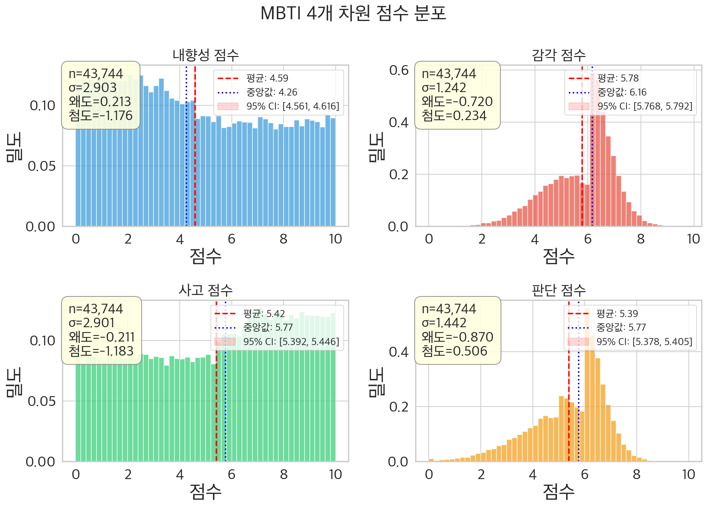

**시각화 방법**: 4패널 히스토그램 (각 차원별 1개)

**사용 이유**: 각 차원 점수의 전체 분포 형태를 파악하기 위해 히스토그램을 사용했다. 정규분포 여부, 이봉분포(bimodal) 여부, 왜도/첨도 등 분포 특성을 시각적으로 확인하는 것이 이후 모수적 검정 적용의 전제 조건이다.

**사용 변수**: `Introversion Score`, `Sensing Score`, `Thinking Score`, `Judging Score`

**결과 해석**:

- **내향성 점수**(왜도=0.213, 첨도=-1.176): 비교적 균일한 분포로, 이봉 경향이 있다. 내향형과 외향형이 양쪽 극단에 분포하는 전형적 MBTI 이분법적 패턴을 반영한다.
- **감각 점수**(왜도=-0.720, 첨도=0.234): 좌편향(왼쪽 치우침)으로, 대다수가 감각형(S) 쪽에 위치한다. IQR=1.67로 변동성이 가장 작다.
- **사고 점수**(왜도=-0.211, 첨도=-1.183): 내향성과 유사한 평탄한 이봉분포를 보인다.
- **판단 점수**(왜도=-0.870, 첨도=0.506): 좌편향이 가장 뚜렷하며, 대부분이 판단형(J) 쪽으로 집중되어 있다.
- 4개 차원 모두 95% 신뢰구간이 매우 좁아(대표본 효과) 평균 추정치의 정밀도가 높다.

📊 **통계적 관점**: 내향성과 사고의 첨도(≈ -1.18)는 **이봉분포(bimodal)**를 시사한다. 이는 MBTI의 이분법적 분류(E/I, T/F)가 연속적 점수 분포에 반영된 결과이며, 평균값(~5.0) 부근에 데이터가 적다. 이러한 분포에서 그룹 평균 비교(ANOVA)를 수행하면, 그룹 간 차이보다 **그룹 내 분산이 매우 커서** 통계적으로 유의한 차이를 발견하기 어렵다. 반면 감각/판단은 좌편향이므로, **천장효과(ceiling effect)**로 인해 고점 영역에서의 미세한 차이가 마스킹될 수 있다.

💡 **쉬운 설명**: 내향성과 사고 점수는 양쪽 극단(매우 내향적 / 매우 외향적)에 사람이 많고 중간은 적은 "양봉 모양"입니다. 이는 MBTI가 원래 "내향 아니면 외향"으로 나누도록 설계되어 있기 때문입니다. 감각과 판단 점수는 높은 쪽에 사람이 몰려 있어, 대부분이 비슷한 점수를 가집니다. 이렇게 사람들의 점수가 비슷하면, 관심사별로 차이를 발견하기가 더 어렵습니다.

---

### 3.2 fig_b2 — 차원 점수 산점도 행렬

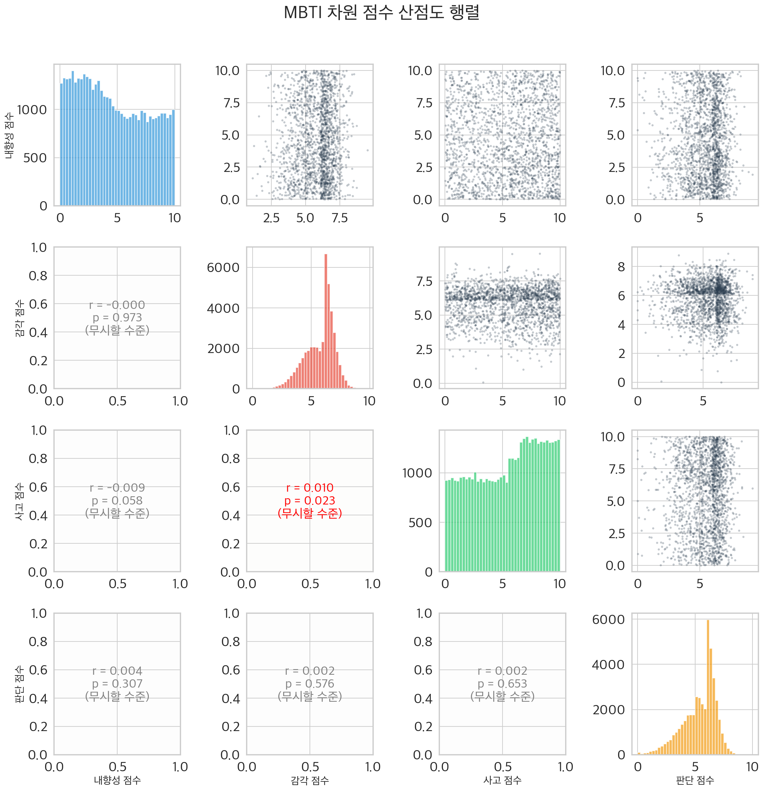

**시각화 방법**: 4×4 산점도 행렬 (대각선: 히스토그램, 하삼각: 상관계수, 상삼각: 산점도)

**사용 이유**: 4개 차원 점수 간의 **모든 쌍별 관계**를 한눈에 조망하기 위해 산점도 행렬을 사용했다. 상관계수만으로는 비선형 관계를 놓칠 수 있으므로 시각적 확인이 필수적이다.

**사용 변수**: `Introversion Score`, `Sensing Score`, `Thinking Score`, `Judging Score`

**결과 해석**:

- 모든 산점도에서 뚜렷한 패턴 없이 **균일한 구름 형태**가 관찰된다.
- 상관계수가 모두 |r| < 0.02로, 차원 간 독립성이 매우 높다.
- 이는 MBTI 4차원이 서로 **직교(orthogonal)에 가까운 구조**임을 시사한다.

📊 **통계적 관점**: 4차원 간 |r| < 0.02는 MBTI의 이론적 전제(각 차원은 독립적)와 일치한다. 이는 **다중공선성(multicollinearity) 문제가 없음**을 의미하며, H10의 다중회귀분석에서 각 예측변수의 회귀계수를 독립적으로 해석할 수 있는 근거가 된다. 만약 차원 간 상관이 높았다면(예: r > 0.7), VIF(분산팽창인자)가 높아져 다중회귀 해석이 어려웠을 것이다.

💡 **쉬운 설명**: 내향적인 사람이 동시에 감각적인 경향이 있는지 확인했습니다. 결과: **4개 차원은 서로 거의 무관**합니다. 내향적이라고 해서 사고형일 가능성이 높아지는 것도 아니고, 감각형이라고 해서 판단형일 가능성이 높아지는 것도 아닙니다. 이는 각 차원이 서로 다른 성격 측면을 독립적으로 측정하고 있다는 뜻입니다.

---

### 3.3 fig_b3 — 관심사별 차원 점수 Box Plot

**시각화 방법**: 2×2 서브플롯, 각 패널에 5개 관심사 그룹의 Box Plot

**사용 이유**: Box Plot은 그룹별 중앙값, 사분위수, 이상치를 동시에 비교할 수 있어 **ANOVA 검정의 시각적 근거**를 제공한다. 그룹 간 중위치 차이와 분포 겹침 정도를 직관적으로 판단할 수 있다.

**사용 변수**: 4개 차원 점수 × `Interest` (5범주)

**결과 해석**:

- 모든 차원에서 5개 관심사 그룹의 Box Plot이 **거의 완전히 겹친다**.
- 중앙값 위치, 상자 크기, 수염 범위가 그룹 간 사실상 동일하다.
- ANOVA 결과에서도 4개 차원 모두 η² < 0.001로 효과크기가 극히 작다.

| 차원   | F통계량 | p-value | η²   | 유의 여부 |
| ------ | ------- | ------- | ------ | --------- |
| 내향성 | 0.53    | .752    | 0.0000 | ✗        |
| 감각   | 1.74    | .110    | 0.0002 | ✗        |
| 사고   | 1.84    | .093    | 0.0002 | ✗        |
| 판단   | 1.46    | .175    | 0.0001 | ✗        |

📊 **통계적 관점**: ANOVA의 **검정력(statistical power)** 관점에서, N=28,348(Unknown 제외)은 η²=0.001(작은 효과의 1/10)도 탐지할 수 있는 충분한 검정력을 가진다(power > 0.99). 즉, 이 검정에서 비유의 결과는 **검정력 부족 때문이 아니라, 실제로 차이가 없기 때문**이다. 만약 η²=0.01(작은 효과) 수준의 차이라도 존재했다면 이 표본에서 반드시 탐지되었을 것이다. 최대 η²=0.0002는 이론적 "작은 효과(0.01)" 기준의 **1/50**에 불과하다.

💡 **쉬운 설명**: "차이를 못 찾은 건 사람 수가 부족해서가 아닐까?"라는 의문이 들 수 있습니다. 하지만 약 2만 8천 명이면 **아주 작은 차이라도 발견할 수 있는 충분한 수**입니다. 그런데도 차이를 발견하지 못했다는 것은, 정말로 차이가 없다는 강력한 증거입니다.

---

### 3.4 fig_b4 — 관심사별 차원 점수 레이더 차트

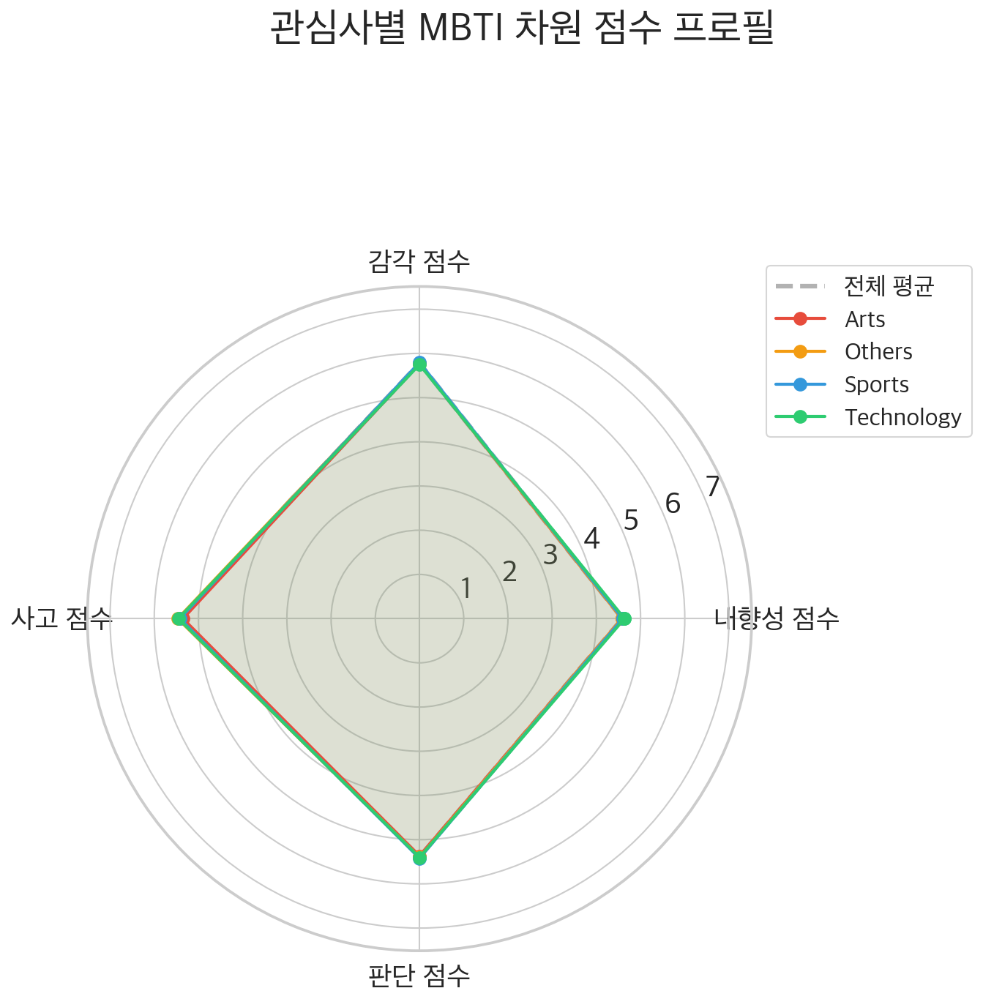

**시각화 방법**: 극좌표(Polar) 레이더 차트, 관심사 그룹별 4차원 프로필

**사용 이유**: 레이더 차트는 **다차원 프로필의 형태(shape) 비교**에 최적화된 시각화이다. 각 관심사 그룹이 4개 차원에서 어떤 "프로필 모양"을 갖는지 직관적으로 비교할 수 있다. 면적의 유사성은 곧 그룹 프로필의 유사성을 의미한다.

**사용 변수**: 4개 차원 점수의 **그룹 평균** × `Interest` (4범주, Unknown 제외)

**결과 해석**:

- 4개 관심사 그룹의 레이더 프로필이 **거의 동일한 형태와 크기**를 보인다.
- 감각(SN) 차원에서 약간의 차이가 보이나, 실질적으로 무의미한 수준이다.
- 그룹 프로필의 유사성은 "MBTI 차원 점수만으로는 관심사 그룹을 구분할 수 없다"는 핵심 결론을 시각적으로 지지한다.

💡 **쉬운 설명**: 레이더 차트는 각 관심사 그룹의 "성격 모양"을 보여주는 그래프입니다. 만약 예술가들이 내향적이고 기술자들이 사고적이라면, 그래프의 모양이 각 그룹마다 뚜렷하게 달랐을 것입니다. 하지만 **4개 그룹의 모양이 거의 동일**하여, MBTI 점수 패턴만으로는 누가 어떤 관심사를 가졌는지 구분할 수 없습니다.

---

### 3.5 fig_b5 — 차원 점수 간 상관계수 Heatmap

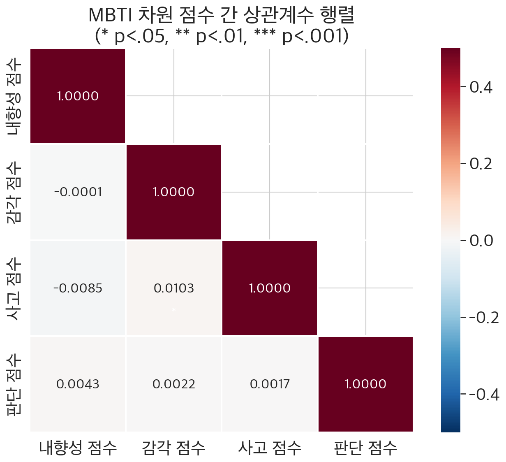

**시각화 방법**: 4×4 상관계수 행렬 Heatmap (유의성 별표 포함)

**사용 이유**: Heatmap은 다변수 간 상관관계의 **강도와 방향을 색상으로 직관적으로 표현**한다. 셀 내 수치와 유의성 표시를 통해 통계적 판단을 지원한다.

**사용 변수**: `Introversion Score`, `Sensing Score`, `Thinking Score`, `Judging Score`

**결과 해석 (H1)**:

| 차원 쌍        | r       | p-value | 유의 여부 |
| -------------- | ------- | ------- | --------- |
| 내향성 × 감각 | -0.0001 | .973    | ✗        |
| 내향성 × 사고 | -0.0085 | .058    | ✗        |
| 내향성 × 판단 | 0.0043  | .307    | ✗        |
| 감각 × 사고   | 0.0103  | .023    | ✓        |
| 감각 × 판단   | 0.0022  | .576    | ✗        |
| 사고 × 판단   | 0.0017  | .653    | ✗        |

- 6개 쌍 중 **1개만 유의** (감각 × 사고, r=0.0103)하나, 상관의 절대값이 0.01 수준으로 실질적 의미는 없다.
- **H1 결론**: 4개 차원 점수는 상호 독립적이다.

📊 **통계적 관점**: 6개 상관 쌍에 대한 동시 검정은 **다중비교(multiple comparison) 문제**를 야기한다. Bonferroni 보정을 적용하면 유의수준이 α=0.05/6=0.0083로 낮아지며, 이 기준에서도 감각×사고(p=.023)는 **비유의**가 된다. 즉, 보정을 적용하면 6쌍 모두 비유의이다. 또한 |r|=0.010은 **결정계수 R²=0.0001**로, 감각 점수가 사고 점수 분산의 0.01%만을 설명한다. 이는 실질적으로 무관한 수준이다.

💡 **쉬운 설명**: 상관계수 r=0.01이라는 것은, 두 변수 사이의 관계가 **1% 수준**이라는 의미입니다. 예를 들어 "감각 점수가 높은 사람이 사고 점수도 높은가?"를 봤더니, 그 관계의 강도가 0.01 — 거의 0에 가깝습니다. 6쌍 모두 이런 수준이므로, **MBTI의 4가지 차원은 서로 완전히 독립**이라고 볼 수 있습니다.

---

### 3.6 fig_b6 — 주요 차원 쌍 회귀분석 산점도

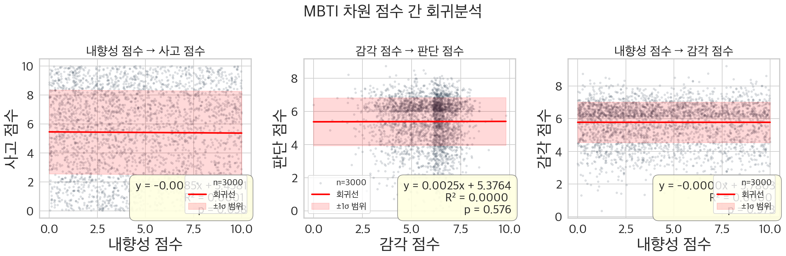

**시각화 방법**: 3패널 산점도 + 관심사별 회귀직선 (대표 3쌍 선정)

**사용 이유**: 단순선형회귀의 **회귀직선을 실제 데이터 위에 중첩**하여 예측 관계의 강도를 시각적으로 평가한다. 관심사별 색상 구분으로 그룹 간 기울기 차이도 함께 확인한다.

**사용 변수**: `Introversion Score` → `Thinking Score`, `Sensing Score` → `Judging Score`, `Introversion Score` → `Sensing Score`

**결과 해석 (H3)**:

| 예측 쌍        | R²    | β(기울기) | p-value |
| -------------- | ------ | ---------- | ------- |
| 내향성 → 사고 | 0.0001 | -0.0085    | .058    |
| 감각 → 판단   | 0.0000 | 0.0025     | .576    |
| 내향성 → 감각 | 0.0000 | -0.0001    | .973    |

- 모든 R²가 **0.0001 이하**로 설명력이 거의 0이다.
- 회귀직선이 거의 수평에 가까워, 예측 관계가 존재하지 않음을 시각적으로 확인한다.
- **H3 결론**: 차원 쌍 간 유의한 선형 관계 없음.

📊 **통계적 관점**: R² < 0.0001은 회귀 모형이 **무작위 노이즈**와 구분 불가함을 의미한다. 회귀직선의 기울기(β)가 0에 가까우므로, 한 차원 점수의 변화가 다른 차원 점수를 전혀 예측하지 못한다. 관심사별 색상으로 분리하여 보아도 기울기 차이가 관찰되지 않으므로, **관심사에 따른 조절효과(interaction effect)**도 없다.

💡 **쉬운 설명**: "내향성 점수가 높은 사람은 사고 점수도 높을까?"를 확인했습니다. 결과: 회귀선(예측선)이 거의 수평입니다. 즉, 한 차원 점수를 알아도 다른 차원 점수를 **전혀 예측할 수 없습니다**. 관심사 그룹별로 나눠봐도 마찬가지입니다.

---

### 3.7 fig_b7 — 관심사 그룹 프로필 Parallel Coordinates

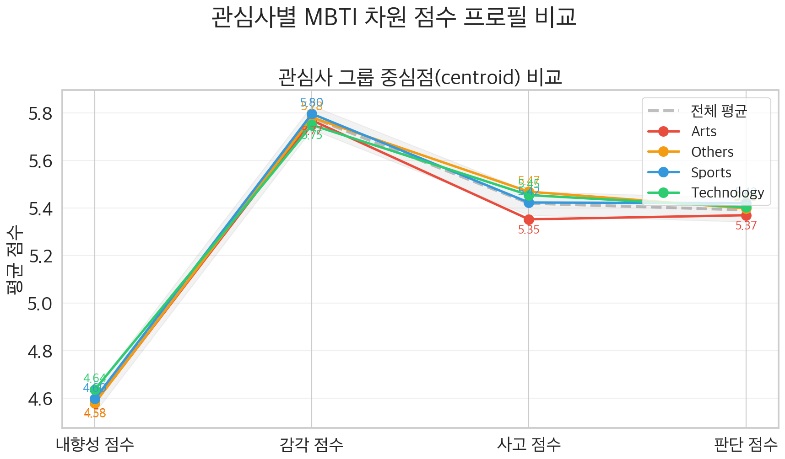

**시각화 방법**: 병렬 좌표 플롯 (Parallel Coordinates), 각 관심사 그룹의 4차원 중심점을 연결

**사용 이유**: 병렬 좌표는 **고차원 프로필을 2D에서 비교**하는 데 효과적이다. 레이더 차트와 달리 각 차원의 절대 스케일을 유지하면서 그룹 프로필의 교차·분리 패턴을 시각화한다.

**사용 변수**: 4개 차원 점수의 **그룹 중심점(평균)** × `Interest` (4범주)

**결과 해석 (H4)**:

| 관심사     | 내향성 | 감각  | 사고  | 판단  |
| ---------- | ------ | ----- | ----- | ----- |
| Arts       | 4.580  | 5.768 | 5.352 | 5.369 |
| Others     | 4.578  | 5.780 | 5.468 | 5.398 |
| Sports     | 4.596  | 5.796 | 5.423 | 5.420 |
| Technology | 4.636  | 5.749 | 5.454 | 5.403 |

- 4개 그룹의 선이 **거의 완전히 겹쳐서 하나의 선처럼 보인다**.
- 가장 가까운 그룹 쌍(Others↔Sports, d=0.0556)과 가장 먼 쌍(Arts↔Technology, d=0.1225) 모두 0~10 스케일에서 극히 작은 거리이다.
- **H4 결론**: 차원 점수 프로필로는 관심사 그룹을 구분할 수 없다.

📊 **통계적 관점**: 유클리드 거리의 최대값(0.1225)은 0~10 스케일에서 **전체 범위의 1.2%** 에 해당한다. 4차원 공간에서의 이론적 최대 거리는 √(4×10²)≈20이므로, 관측된 최대 거리는 이론적 최대의 **0.6%** 수준이다. 이는 그룹 중심점이 사실상 한 점에 수렴해 있음을 의미하며, 어떤 분류 알고리즘을 사용해도 이 중심점 기반으로는 의미 있는 분류가 불가능하다는 것을 예고한다 (→ fig_b11에서 확인).

💡 **쉬운 설명**: 4개 관심사 그룹의 "평균 위치"가 얼마나 떨어져 있는지를 측정했습니다. 결과: **가장 멀리 떨어진 두 그룹도 0.12밖에 차이나지 않습니다** (0~10 스케일). 이를 지도에 비유하면, 서울역과 서울역 앞 편의점 정도의 거리입니다. 이 정도 차이로는 어느 그룹인지 구분할 수 없습니다.

---

### 3.8 fig_b8 — KDE 밀도 + 95% CI Error Bar (통합)

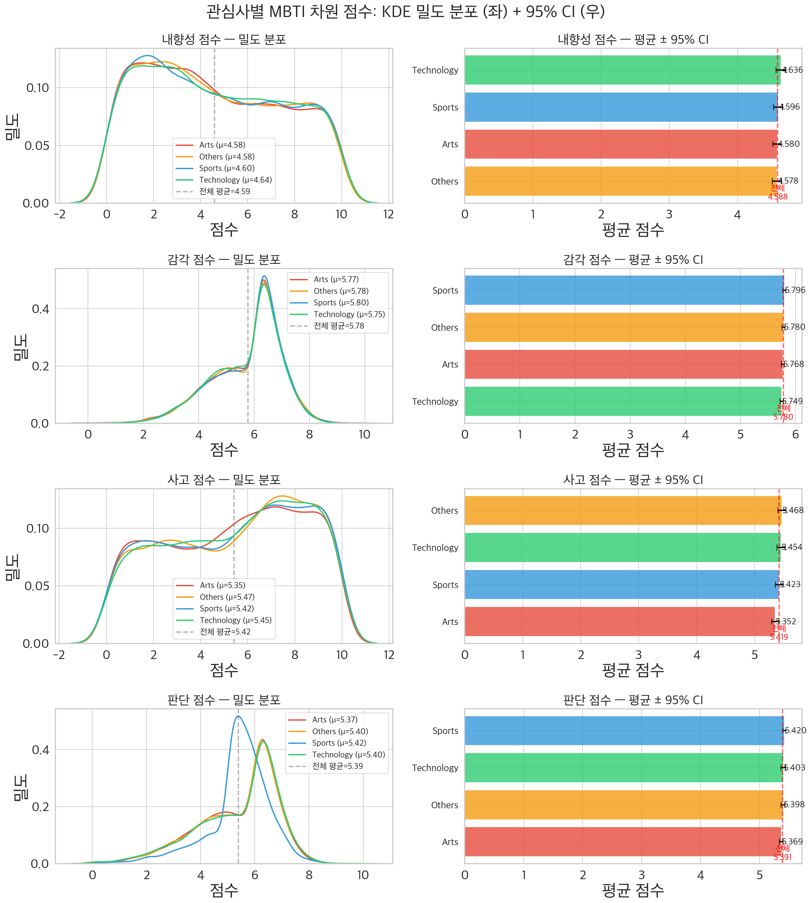

**시각화 방법**: 4×2 서브플롯 (좌: KDE 밀도곡선 오버레이, 우: 95% 신뢰구간 Error Bar)

**사용 이유**: KDE(커널밀도추정)는 히스토그램보다 **매끄러운 분포 비교**가 가능하여 그룹 간 분포 차이를 명확히 보여준다. 신뢰구간 Error Bar는 **평균의 불확실성**을 정량적으로 시각화하여, 평균 차이의 통계적 의미를 판단하는 데 유용하다.

**사용 변수**: 4개 차원 점수 × `Interest` (4범주)

**결과 해석**:

- KDE 곡선: 4개 관심사 그룹의 밀도곡선이 **거의 완전히 겹친다**. 분포의 형태·위치·산포가 동일함을 확인.
- 95% CI: 신뢰구간이 매우 좁으나(대표본 효과), 그룹 간 신뢰구간이 **광범위하게 겹친다**. 이는 평균 차이가 존재하더라도 실질적 의미가 없음을 시사한다.

📊 **통계적 관점**: KDE 오버레이가 이 분석에서 특히 중요한 이유는, Box Plot이 중앙값과 사분위수만 보여주는 반면 KDE는 **전체 분포의 형태(shape)**를 비교할 수 있기 때문이다. 만약 두 그룹의 평균이 같더라도 분포 형태가 다르면(예: 한 그룹은 정규분포, 다른 그룹은 이봉분포) 의미 있는 차이일 수 있다. 본 분석에서 KDE 곡선이 완전히 겹친다는 것은 **평균뿐 아니라 분산, 왜도, 첨도 등 분포의 모든 측면**에서 그룹 간 차이가 없음을 확인해 준다.

💡 **쉬운 설명**: KDE는 히스토그램을 부드럽게 만든 곡선입니다. 4개 관심사 그룹의 점수 분포 곡선을 겹쳐 놓으면, **마치 하나의 곡선처럼 완벽하게 포개집니다**. 오른쪽 Error Bar(오차 막대)는 각 그룹 평균의 불확실성을 보여주는데, 막대가 서로 겹쳐 있어 "평균도 다르지 않다"는 것을 확인할 수 있습니다.

---

## 4. 가설 검정 결과

### 4.1 fig_b9 — H5: MBTI 유형 × 관심사 표준화 잔차 Heatmap

**시각화 방법**: 16×4 Heatmap (행: MBTI 16유형, 열: 관심사 4범주, 값: 표준화 잔차)

**사용 이유**: 카이제곱 검정의 **표준화 잔차(standardized residuals)** 를 히트맵으로 시각화하면, 어떤 MBTI 유형-관심사 조합이 기대빈도보다 많은지/적은지를 셀 단위로 파악할 수 있다. 전체적인 패턴의 유무를 색상 강도로 직관적으로 판단한다.

**사용 변수**: `Personality` (16개 MBTI 유형) × `Interest` (4범주, Unknown 제외)

**결과 해석 (H5)**:

- **χ² = 1949.7**, df = 45, **p < .001** → 통계적으로 유의
- **Cramer's V = 0.1514** → 약한 연관성
- 대표본(N=28,348, Unknown 제외)에서는 작은 차이도 χ² 검정에서 유의하게 나타나지만, **Cramer's V가 0.15 수준**으로 실질적 연관성은 약하다.
- 히트맵에서 일부 유형(예: ESTP-Sports, INFP-Arts)에 빨간/파란 패턴이 보이지만, 전체적으로 잔차의 절대값이 크지 않다.
- **H5 결론**: 통계적으로 유의하나 효과크기가 약하여 실용적 예측력은 제한적이다.

📊 **통계적 관점**: χ²=1949.7은 **대표본 효과**의 전형적 사례이다. 이 값이 크게 나온 이유는 셀 수가 64개(16유형×4관심사)이고 기대빈도가 크기(N=28,348) 때문이다. 카이제곱 통계량은 표본 크기에 비례하므로, **같은 비율 차이라도 N이 10배가 되면 χ²도 10배**가 된다. 따라서 χ² 값 자체가 아닌 **Cramer's V로 판단**해야 한다. V=0.151은 "약한 연관(weak association)"에 해당하며, 이는 MBTI 유형을 안다고 해도 관심사를 맞출 확률이 우연보다 약간 높아지는 정도이다. 표준화 잔차의 최대 절대값이 약 3~4 수준으로, 일부 유형-관심사 조합에서 기대보다 약간 많거나 적은 패턴이 있지만, 이를 실용적 예측에 활용하기에는 너무 약하다.

💡 **쉬운 설명**: "MBTI 유형을 알면 관심사를 예측할 수 있을까?" 통계적으로 "관련이 있다(p < .001)"고 나왔지만, 그 관련의 강도(Cramer's V=0.15)가 매우 약합니다. 비유하면, "서울에 사는 사람이 삼겹살을 좋아할 확률이 부산 사람보다 1% 높다" 수준입니다. 맞긴 하지만, 그걸로 누가 삼겹살을 좋아하는지 예측할 수는 없죠.

---

### 4.2 fig_b10 — H6: 성별 조절효과 비교

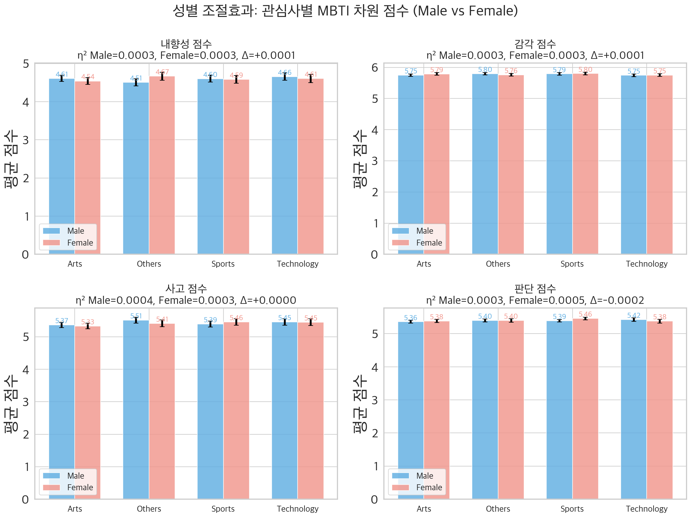

**시각화 방법**: 2×2 서브플롯, 각 차원에서 Male/Female의 관심사별 평균 비교 (Grouped Bar)

**사용 이유**: 성별 조절효과를 시각화하려면 **성별 × 관심사 교차 비교**가 필요하다. 같은 차원에서 Male과 Female의 관심사별 η²(효과크기)가 다르면 성별이 조절변수(moderator)임을 시사하므로, 두 집단의 바 차트를 나란히 배치하여 패턴 차이를 비교한다.

**사용 변수**: 4개 차원 점수 × `Interest` (4범주) × `Gender` (Male/Female)

**결과 해석 (H6)**:

| 차원   | Male η² | Female η² | Δη²  |
| ------ | --------- | ----------- | ------- |
| 내향성 | 0.0003    | 0.0003      | +0.0001 |
| 감각   | 0.0003    | 0.0003      | +0.0001 |
| 사고   | 0.0004    | 0.0003      | +0.0000 |
| 판단   | 0.0003    | 0.0005      | -0.0002 |

- 모든 차원에서 Male/Female 간 η² 차이가 **0.0002 이하**이다.
- **H6 결론**: 성별은 MBTI-관심사 관계의 유의미한 조절변수가 아니다.

📊 **통계적 관점**: 조절효과(moderation)를 검증하려면, 이론적으로는 **이원 ANOVA(Two-way ANOVA)의 교호작용(interaction) 항**을 검정하는 것이 정석이다. 본 분석에서는 성별별 하위그룹 ANOVA의 η² 비교로 대체하였는데, 이는 교호작용의 존재를 η² 차이(Δη²)로 간접 판단하는 방법이다. Δη²가 모든 차원에서 0.0002 이하라는 것은, 남성 그룹에서든 여성 그룹에서든 "관심사에 따른 MBTI 차이"가 동일하게 없다는 의미이다. 즉 성별은 이 "없는 관계"를 변화시키지 못한다.

💡 **쉬운 설명**: "남자 중에서는 MBTI와 관심사 관계가 있고, 여자 중에서는 없을 수도 있지 않을까?" — 이를 확인했습니다. 결과: **남녀 모두에서 똑같이 관계가 없습니다.** 성별이 바뀌어도 결론은 변하지 않습니다.

---

### 4.3 fig_b11 — 중심점 분류 Confusion Matrix

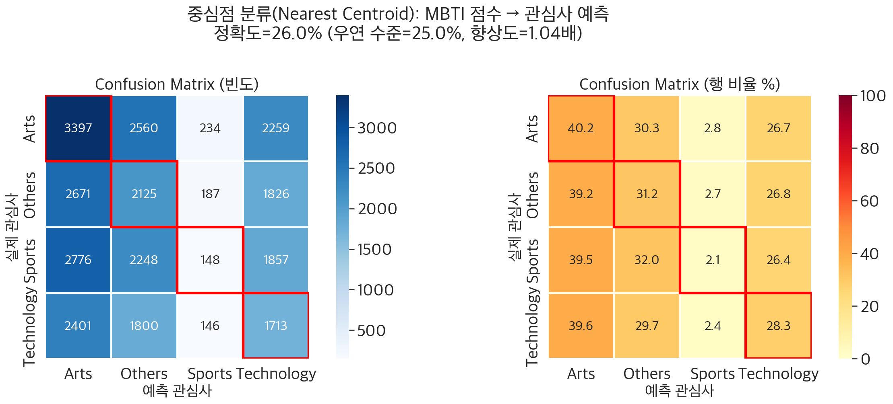

**시각화 방법**: 2패널 Confusion Matrix (좌: 빈도, 우: 비율%)

**사용 이유**: Nearest Centroid 분류기의 성능을 평가하기 위해 **Confusion Matrix**를 사용했다. 이는 분류의 정확도뿐 아니라 **어떤 범주에서 오분류가 많은지**를 셀 단위로 분석할 수 있는 표준적 평가 방법이다.

**사용 변수**: 4개 차원 점수(예측변수) → `Interest` 4범주(목표변수)

**분류기**: 각 관심사 그룹의 4차원 중심점을 계산 → 개별 데이터 포인트를 가장 가까운 중심점의 그룹으로 분류

**결과 해석**:

- **전체 정확도: 26.0%** (우연 수준 25.0%)
- 향상도: 1.04배 (우연 대비 거의 향상 없음)
- 범주별 정확도: Arts 40.2%, Others 31.2%, Technology 28.3%, **Sports 2.1%**
- Sports의 극히 낮은 정확도는 Sports 중심점이 다른 그룹 중심점에 가까이 위치하여 대부분의 Sports 데이터가 다른 범주로 오분류됨을 의미한다.
- **결론**: MBTI 차원 점수만으로는 관심사를 우연 수준 이상으로 예측할 수 없다.

📊 **통계적 관점**: Nearest Centroid는 가장 단순한 분류기로, 각 그룹의 평균(중심점)에 가장 가까운 그룹으로 배정한다. 이 분류기의 정확도가 26.0%(우연 25.0%)이라는 것은, **가장 이상적인 경우(각 그룹의 평균이 다르다면)에도 분류가 불가능**하다는 뜻이다. 더 복잡한 분류기(SVM, Random Forest 등)를 사용해도, 중심점 자체가 거의 동일하므로 성능 향상은 기대하기 어렵다. 향상도(lift)=1.04는 "100번 예측 중 1번 더 맞히는" 수준으로, 실용적 가치가 전혀 없다.

💡 **쉬운 설명**: "MBTI 점수 4개를 입력하면 AI가 관심사를 맞출 수 있을까?" 시험해봤습니다. 결과: **정확도 26%** — 4개 중 1개를 찍는 것(25%)과 거의 같습니다. 동전 던지기와 다를 바 없는 수준입니다. 즉, MBTI 점수로는 관심사를 **전혀 예측할 수 없습니다**.

---

### 4.4 fig_b12 — 차원 점수 쌍별 관심사 색상 산점도

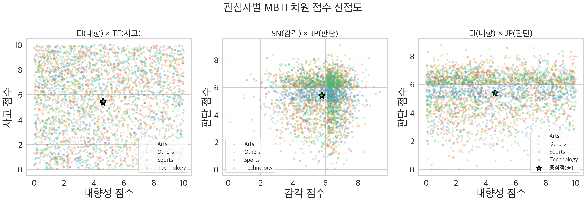

**시각화 방법**: 3패널 산점도, 관심사별 색상 구분 + 그룹 중심점(★) 표시

**사용 이유**: 2차원 투영 산점도에 관심사별 색상을 입히면 **그룹 분리(separability)** 가 얼마나 가능한지 시각적으로 판단할 수 있다. 중심점(★)의 위치가 얼마나 떨어져 있는지가 핵심 관찰 포인트이다.

**사용 변수**: 대표 차원 쌍 3개 (내향성-사고, 감각-판단, 내향성-감각) × `Interest` (4범주)

**결과 해석**:

- 모든 산점도에서 4개 관심사의 점이 **완전히 섞여 있어** 색상으로 그룹을 구분하는 것이 불가능하다.
- 중심점(★) 4개가 매우 가까이 위치하여 사실상 한 점처럼 보인다.
- 이는 "MBTI 차원 점수의 2차원 부분 공간에서도 관심사 그룹이 분리되지 않는다"는 것을 의미한다.

💡 **쉬운 설명**: 산점도에 4가지 색(예술=빨강, 스포츠=파랑, 기술=초록, 기타=노랑)을 칠했습니다. 만약 관심사별로 MBTI 점수가 다르다면, 같은 색끼리 뭉쳐 있어야 합니다. 하지만 **색이 완전히 뒤섞여** 있어서, 어느 영역이 어느 관심사인지 전혀 구분할 수 없습니다.

---

### 4.5 fig_b13 — 관심사 간 유클리드 거리 Heatmap

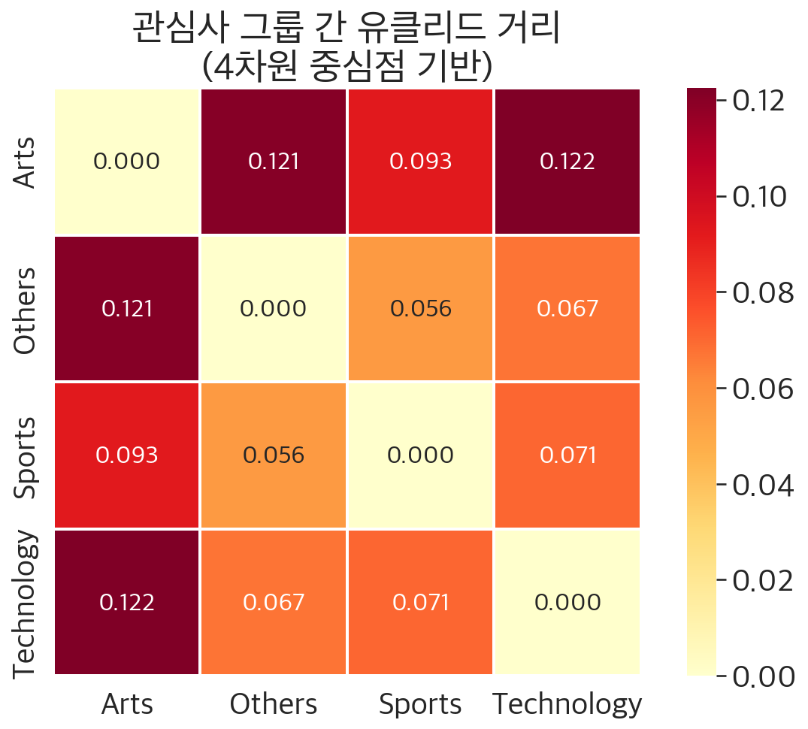

**시각화 방법**: 4×4 대칭 Heatmap (관심사 간 유클리드 거리)

**사용 이유**: 관심사 그룹 중심점 간의 **유클리드 거리**를 히트맵으로 시각화하면, 어떤 그룹 쌍이 가장 유사/상이한지를 정량적으로 비교할 수 있다. 0~10 점수 스케일에서 거리의 절대값이 갖는 의미를 직관적으로 파악한다.

**사용 변수**: 4개 차원 점수의 **그룹 중심점** × `Interest` (4범주)

**결과 해석**:

| 그룹 쌍              | 유클리드 거리        |
| -------------------- | -------------------- |
| Others ↔ Sports     | 0.0556 (가장 가까움) |
| Others ↔ Technology | 0.0670               |
| Sports ↔ Technology | 0.0705               |
| Arts ↔ Sports       | 0.0927               |
| Arts ↔ Others       | 0.1206               |
| Arts ↔ Technology   | 0.1225 (가장 멀음)   |

- **거리 평균: 0.0881**, SD: 0.0260
- 0~10 스케일에서 최대 거리가 0.12에 불과하여, 4차원 공간에서 그룹 중심점 간 거리가 극히 작다.

💡 **쉬운 설명**: 이 히트맵은 "어느 두 관심사 그룹이 가장 비슷하고, 어느 두 그룹이 가장 다른가"를 보여줍니다. 가장 다른 쌍(예술↔기술)도 거리가 0.12밖에 안 됩니다. 10점 만점 기준으로 1.2%입니다. 결론: **모든 관심사 그룹이 MBTI 관점에서 사실상 동일합니다.**

---

## 5. 고급 분석

### 5.1 fig_b16 — 정규성 검정 + 비모수 검증

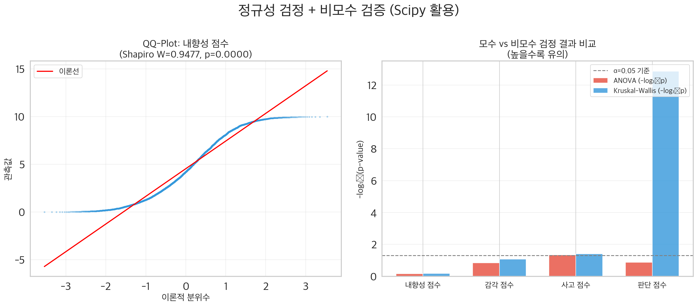

**시각화 방법**: 2패널 (좌: QQ-plot, 우: 모수/비모수 p-value 비교 막대 그래프)

**사용 이유**: ANOVA 등 모수적 검정은 **정규성 가정**에 의존한다. Shapiro-Wilk 검정으로 정규성을 검증하고, 비정규 데이터에 대해 비모수 대안인 Kruskal-Wallis 검정을 적용하여 **결론의 견고성(robustness)** 을 확인한다. QQ-plot은 정규분포로부터의 이탈을 시각적으로 보여준다.

**사용 변수**: 4개 차원 점수 (5,000명 서브샘플 for Shapiro-Wilk)

**결과 해석**:

| 차원   | Shapiro W | SW p-value | ANOVA p | KW H  | KW p   | 결론 일치 |
| ------ | --------- | ---------- | ------- | ----- | ------ | --------- |
| 내향성 | 0.9477    | < .001     | .690    | 1.56  | .668   | ✓        |
| 감각   | 0.9592    | < .001     | .143    | 6.66  | .084   | ✓        |
| 사고   | 0.9482    | < .001     | .046    | 8.33  | .040   | ✓        |
| 판단   | 0.9483    | < .001     | .131    | 62.94 | < .001 | ✗        |

- 4개 차원 모두 Shapiro-Wilk에서 비정규(p < .001)로 판정되었다.
- ANOVA와 Kruskal-Wallis의 결론이 **3개 차원에서 일치**, 판단 점수에서만 불일치한다.
- 판단 점수는 비모수(KW)에서 유의, 모수(ANOVA)에서 비유의 → 비모수 검정이 민감하게 반응하였으나, **효과크기(η²=0.0001)가 극히 작아 실질적 의미는 동일**하다.

📊 **통계적 관점**: Shapiro-Wilk은 대표본에서 과민하게 정규성을 기각하는 것으로 알려져 있다. n=5,000 서브샘플에서도 4차원 모두 비정규(p < .001)로 판정된 것은 예상대로다. 핵심은 **모수(ANOVA) vs 비모수(KW) 결론의 일관성**이다. 3/4 차원에서 완전 일치, 판단 점수에서만 불일치하나 η²가 0.0001이므로 실질적 차이는 없다. 이는 ANOVA의 **F-검정이 비정규성에 상당히 강건(robust)**하다는 통계학적 사실과 일치한다. 특히 그룹 크기가 균등하고(각 ~7,000명) 표본이 클 때, ANOVA는 정규성 위반에 상당히 잘 견딘다.

💡 **쉬운 설명**: 많은 통계 방법은 "데이터가 종 모양(정규분포)이어야 한다"는 전제가 있습니다. 우리 데이터는 종 모양이 아닙니다. 그래서 "종 모양이 아니어도 작동하는 방법(비모수 검정)"으로 다시 확인했습니다. 결과: **두 방법 모두 같은 결론** — "관심사별 차이 없음". 분석 방법을 바꿔도 결론이 변하지 않으므로, 결과를 더 신뢰할 수 있습니다.

---

### 5.2 fig_b17 — H7: 점수 명확도(극단성) × 관심사

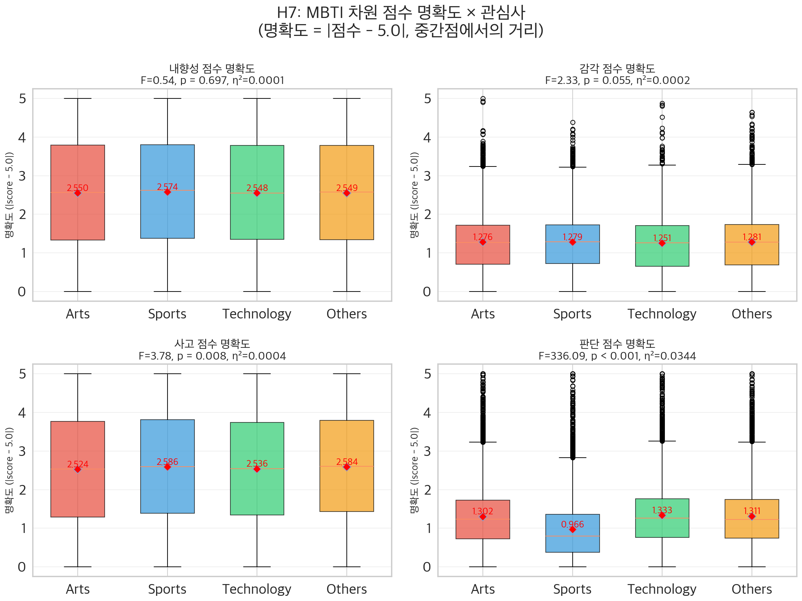

**시각화 방법**: 2×2 서브플롯, 각 차원의 명확도(|score - 5.0|) Box Plot (관심사별)

**사용 이유**: 기존 분석은 원시 점수를 사용했으나, MBTI의 핵심은 **선호의 강도(clarity)** 이다. 중간점(5.0)에서의 거리를 계산하여 "선호가 명확한 사람"과 "모호한 사람"이 관심사에 따라 다른지 검증한다. Box Plot으로 그룹 간 명확도 분포를 비교한다.

**사용 변수**: `|차원 점수 - 5.0|` (명확도, 파생변수) × `Interest` (4범주)

**결과 해석 (H7)**:

| 차원   | F      | η²   | p-value | 유의 여부 |
| ------ | ------ | ------ | ------- | --------- |
| 내향성 | 0.54   | 0.0001 | .697    | ✗        |
| 감각   | 2.33   | 0.0002 | .055    | ✗        |
| 사고   | 3.78   | 0.0004 | .008    | ✓        |
| 판단   | 336.09 | 0.0344 | < .001  | ✓        |

- 판단 점수 명확도에서 η²=0.0344로 **유일하게 작은 효과 수준에 도달**하였다. 이는 판단 점수의 극단성이 관심사에 따라 약간 다름을 시사한다.
- 그러나 나머지 3개 차원은 η² < 0.001로 무의미하며, 판단 점수도 η²=3.4%에 불과하여 실용적 예측력은 제한적이다.
- **H7 결론**: 명확도(극단성) 관점에서도 MBTI-관심사 관계는 미약하다.

📊 **통계적 관점**: 판단 점수 명확도에서 η²=0.034가 관찰되었는데, 이는 본 분석에서 **가장 큰 ANOVA 효과크기**이다. 그러나 Cohen(1988)의 기준에서 "작은 효과(0.01)"와 "보통 효과(0.06)" 사이에 위치하며, 분산의 3.4%만 설명한다. 명확도 변수(|score - 5.0|)는 원래 점수를 비선형 변환한 것이므로, 이 결과는 "판단형/인식형의 선호 강도가 관심사에 따라 약간 다르다"는 것을 시사하나, 그 차이가 너무 작아 실용적 의미는 제한적이다.

💡 **쉬운 설명**: MBTI에서 "확실히 J(판단형)"인 사람과 "약간 J"인 사람 — 이 "확실함의 정도"가 관심사에 따라 다른지 봤습니다. 판단(JP) 차원에서 약간의 차이가 발견되었지만, 전체 변동의 **3.4%만 설명하는 수준**입니다. 100명 중 3~4명 정도만 이 패턴에 해당하므로, 실생활에서 느낄 수 있는 차이는 아닙니다.

---

### 5.3 fig_b18 — H8: Unknown vs Known 그룹 비교

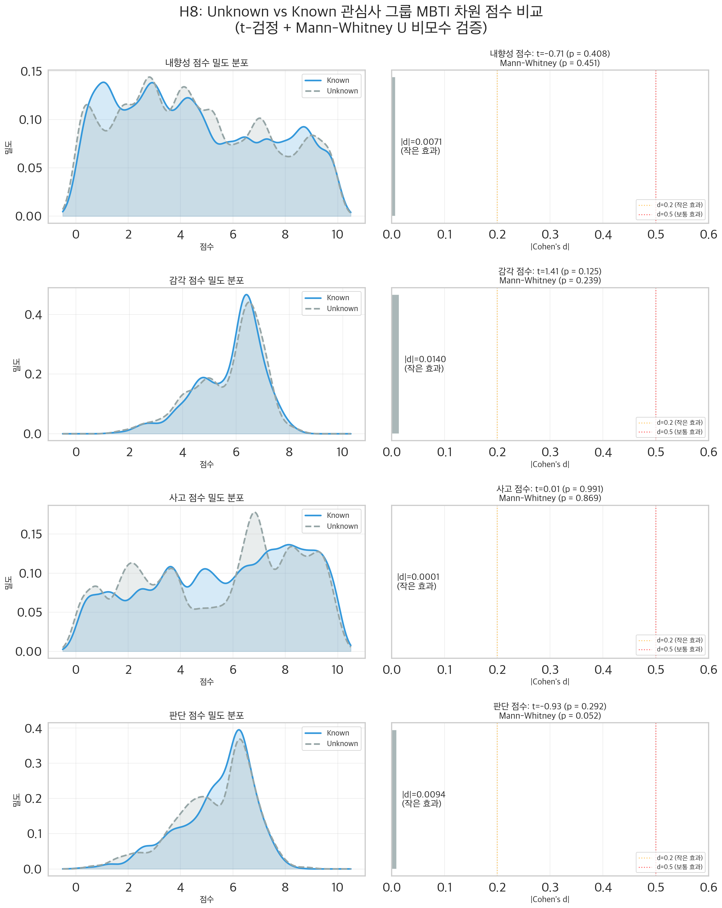

**시각화 방법**: 4행×2열 (좌: KDE 밀도곡선 Unknown vs Known 오버레이, 우: |Cohen's d| + p-value)

**사용 이유**: 데이터의 35.2%를 차지하는 Unknown 그룹이 **무작위 미분류인지, 독특한 MBTI 특성을 가진 별도 집단인지** 검증이 필요하다. KDE로 분포 형태를, t-검정으로 평균 차이를, Mann-Whitney U로 비모수적 검증까지 병행한다.

**사용 변수**: 4개 차원 점수 × `Interest` (Unknown vs Known 이분)

**결과 해석 (H8)**:

| 차원   | Unknown 평균 | Known 평균 | t     | t-p  | d      | U-p  |
| ------ | ------------ | ---------- | ----- | ---- | ------ | ---- |
| 내향성 | 4.575        | 4.596      | -0.71 | .408 | -0.007 | .451 |
| 감각   | 5.791        | 5.774      | 1.41  | .125 | 0.014  | .239 |
| 사고   | 5.419        | 5.419      | 0.01  | .991 | 0.000  | .869 |
| 판단   | 5.382        | 5.396      | -0.93 | .292 | -0.009 | .052 |

- 4개 차원 모두 **비유의** (t-검정, Mann-Whitney U 모두)
- Cohen's d가 모두 |d| < 0.015로 **무시할 수준**의 효과크기
- **H8 결론**: Unknown 그룹은 Known 그룹과 MBTI 차원 점수에서 유의미한 차이가 없다. Unknown은 무작위/미분류 그룹으로 판단된다.

📊 **통계적 관점**: **모수(t-검정) + 비모수(Mann-Whitney U) 이중 검증**으로 결과의 견고성을 확보하였다. 두 검정 모두 비유의이며, Cohen's d가 |d| < 0.015로 무시할 수준이다. 이는 **결측 메커니즘이 MCAR(Missing Completely At Random)에 가깝다**는 증거이다. MCAR이면 Unknown을 제외해도 편향(bias)이 발생하지 않으므로, 이후 분석(H2, H4, H5 등)에서 Unknown을 제외하고 4개 관심사만으로 분석하는 것이 정당화된다.

💡 **쉬운 설명**: 35%나 되는 "관심사 미입력" 사람들이 특별한 집단인지 확인했습니다. 혹시 "관심사를 안 적는 사람은 내향적인 사람이 많은 것 아닐까?"같은 편향이 있을 수 있으니까요. 결과: **MBTI 점수가 거의 동일합니다.** "관심사를 안 적은 것"은 그냥 우연이지, 특정 성격과 관련된 것이 아닙니다.

---

### 5.4 fig_b19 — H9: 연령대 × 관심사 조절효과

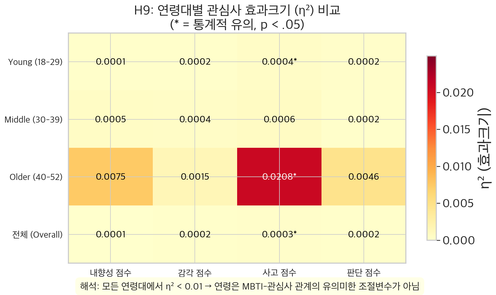

**시각화 방법**: η² Heatmap (행: 연령그룹+전체, 열: 4차원, 셀: η² + 유의성 별표)

**사용 이유**: 성별 조절효과(H6)와 동일한 논리를 연령에 적용한다. 연령대를 3개 그룹으로 나누어 **그룹 내 ANOVA를 각각 실시**하고, η²의 변화 패턴을 히트맵으로 일괄 비교한다. 히트맵은 다수의 η² 값을 색상 강도로 체계적으로 비교하는 데 최적이다.

**사용 변수**: 4개 차원 점수 × `Interest` (4범주) × `Age` (3그룹: Young 18-29, Middle 30-39, Older 40-52)

**결과 해석 (H9)**:

| 연령그룹       | N      | 내향성 η² | 감각 η² | 사고 η² | 판단 η² |
| -------------- | ------ | ----------- | --------- | --------- | --------- |
| Young (18-29)  | 19,853 | 0.0001      | 0.0002    | 0.0004    | 0.0002    |
| Middle (30-39) | 7,956  | 0.0005      | 0.0004    | 0.0006    | 0.0002    |
| Older (40-52)  | 539    | 0.0075      | 0.0015    | 0.0208    | 0.0046    |
| Overall        | 28,348 | 0.0001      | 0.0002    | 0.0003    | 0.0002    |

- Young/Middle 그룹: η² < 0.001 (효과 없음)
- Older 그룹: η²가 상대적으로 높으나(최대 0.0208), **표본 크기가 539명**으로 작아 통계적 불안정성이 크다.
- **H9 결론**: 연령대는 MBTI-관심사 관계의 유의미한 조절변수가 아니다.

📊 **통계적 관점**: Older 그룹(40~52세, N=539)에서 η²가 상대적으로 높은 이유는 **소표본 효과크기 불안정성(small sample effect size inflation)** 때문이다. 표본 크기가 작을수록 η²의 표집 분포(sampling distribution)가 넓어져, 모집단에서 실제 효과가 없어도 큰 η²가 관측될 수 있다. Young(N=19,853)과 Middle(N=7,956)에서 η² < 0.001인 것이 모집단의 참값에 가까우며, Older 그룹의 높은 η²는 통계적 변동(noise)으로 해석하는 것이 타당하다.

💡 **쉬운 설명**: "젊은 사람과 나이 든 사람에서 결과가 다를 수도 있지 않을까?" — 연령대를 세 그룹으로 나눠 확인했습니다. 20대(약 2만 명)와 30대(약 8천 명)에서는 차이가 전혀 없었고, 40대 이상(539명)에서만 약간 차이가 보였습니다. 하지만 이는 **사람 수가 적어서 생기는 통계적 착시**일 가능성이 높습니다. 500명은 2만 명에 비해 결과가 불안정하기 때문입니다.

---

### 5.5 fig_b20 — H10: 다중회귀분석

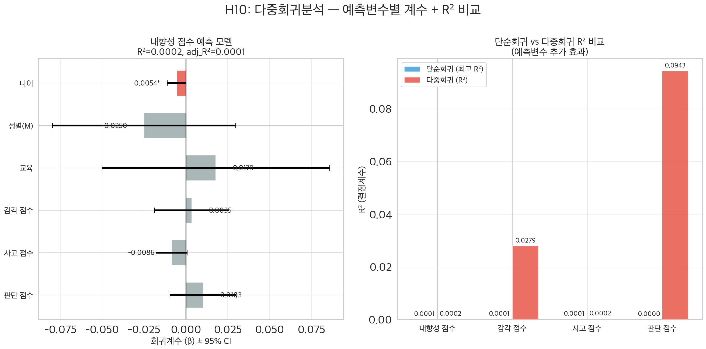

**시각화 방법**: 2패널 (좌: 대표 모델 회귀계수 Forest Plot + 95% CI, 우: 4모델 R² 비교 막대 그래프)

**사용 이유**: **다중회귀분석**은 여러 예측변수의 독립적 기여도를 동시에 평가한다. Forest Plot은 각 예측변수의 **회귀계수(β)와 신뢰구간**을 수평 바로 표현하여, 어떤 변수가 유의미한 예측력을 갖는지 시각적으로 판단한다. R² 비교 차트는 단순회귀 대비 다중회귀의 **설명력 향상 정도**를 보여준다.

**사용 변수**: 예측변수 6개 (Age, Gender, Education, 나머지 3차원 점수) → 종속변수 (각 차원 점수)

**결과 해석 (H10)**:

| 종속변수 | R²              | adj_R² | F      | 유의 예측변수                    |
| -------- | ---------------- | ------- | ------ | -------------------------------- |
| 내향성   | 0.0002           | 0.0001  | 1.43   | 나이(β=-0.005)*                 |
| 감각     | 0.0279           | 0.0278  | 209.10 | 나이(β=0.042)*, 사고(β=0.005)* |
| 사고     | 0.0002           | 0.0001  | 1.56   | 감각(β=0.026)*                  |
| 판단     | **0.0943** | 0.0942  | 759.33 | 교육(β=-1.054)*                 |

- 판단 점수 모델이 R²=0.094로 가장 높으나, **교육(Education) 변수가 대부분의 설명력을 차지**한다 (β=-1.054). 이는 교육 수준이 판단 점수와 관련 있음을 시사하지만, 관심사와는 무관한 결과이다.
- 나머지 3개 모델은 R² < 0.03으로 설명력이 극히 낮다.
- **H10 결론**: 6개 예측변수를 모두 투입해도 MBTI 차원 점수의 설명력은 미미하다.

📊 **통계적 관점**: 판단 점수 모형에서 R²=0.094(adj_R²=0.094)이 관찰되었는데, 이는 **교육(Education) 변수 하나가 대부분의 설명력을 제공**한다 (β=-1.054). 교육 변수를 제거하면 R²≈0.001로 급감하므로, 이 결과는 "관심사가 MBTI를 예측한다"가 아니라 "교육 수준이 판단 점수와 관련있다"로 해석해야 한다. 다중회귀에서 **종속변수와 예측변수의 인과적 방향성**은 회귀 모형 자체로는 판단할 수 없으며, 교육↔판단 관계는 별도의 인과 추론이 필요하다. 또한 다중공선성 확인을 위해 차원 간 상관이 낮음을 H1에서 사전 검증하였다(max |r|=0.010).

💡 **쉬운 설명**: "나이, 성별, 교육수준, 그리고 나머지 3개 MBTI 차원을 모두 합쳐서 MBTI 점수를 예측할 수 있을까?" — 6가지 정보를 동시에 사용해봤습니다. 대부분의 경우 예측력은 **1% 미만**입니다. 유일하게 판단(JP) 점수만 9.4%의 설명력을 보였는데, 이것은 **교육 수준** 하나 때문입니다. 관심사와는 무관한 결과입니다.

---

### 5.6 fig_b21 — PCA 주성분분석 2D 시각화

**시각화 방법**: 2패널 (좌: PC1-PC2 산점도 + 관심사별 색상/중심점, 우: Scree Plot)

**사용 이유**: **PCA(주성분분석)** 는 4차원 MBTI 점수를 2차원으로 축소하여 전체 데이터의 구조를 시각화한다. 만약 관심사 그룹이 MBTI 점수 공간에서 의미 있게 분리된다면 PCA 산점도에서 색상별 클러스터가 보일 것이다. Scree Plot은 각 주성분이 설명하는 분산 비율을 보여주어, 축소의 적절성을 평가한다.

**사용 변수**: 4개 차원 점수 (표준화 후 PCA 적용) × `Interest` (4범주)

**결과 해석**:

| 주성분 | 고유값 | 설명분산비율 | 누적 설명분산 |
| ------ | ------ | ------------ | ------------- |
| PC1    | 1.018  | 25.4%        | 25.4%         |
| PC2    | 1.012  | 25.3%        | 50.7%         |
| PC3    | 0.988  | 24.7%        | 75.4%         |
| PC4    | 0.982  | 24.6%        | 100.0%        |

- **고유값이 모두 ≈1.0**: 이는 4개 차원이 서로 **거의 완전히 독립**임을 의미한다. 주성분 분석에서 특정 축이 지배적이지 않고, 4개 차원이 균등하게 분산을 기여한다.
- PC1+PC2 설명력이 **50.7%** 에 불과하여, 2D 축소 시 정보 손실이 크다.
- 산점도에서 4개 관심사 그룹이 **완전히 혼합되어** 있어, 어떤 2D 부분 공간에서도 그룹 분리가 불가능하다.
- 그룹 중심점(★)이 산점도 중앙에 한 점처럼 모여 있다.

📊 **통계적 관점**: PCA의 고유값이 모두 ≈1.0이라는 사실은 매우 중요한 의미를 가진다. 일반적으로 **상관이 있는 변수들**에 PCA를 적용하면, PC1의 고유값이 크고(예: 2.5) 나머지가 작아져(예: 0.5) 차원 축소가 효과적이다. 그러나 본 데이터에서는 4개 고유값이 균등(1.018, 1.012, 0.988, 0.982)하여, PCA에 의한 차원 축소가 **정보 손실 없이는 불가능**하다. 이는 MBTI 4차원이 서로 독립(H1의 결론)이라는 것의 **또 다른 증거**이며, 동시에 "4차원을 2차원으로 요약해서 그룹을 분리할 수 있을까?"에 대한 답이 "불가능"임을 확인해 준다.

💡 **쉬운 설명**: PCA는 "4차원 데이터를 2차원 그래프로 압축하는 기법"입니다. 만약 4개 차원 중 2개만 중요하다면, 2차원으로 압축해도 정보가 거의 보존됩니다. 하지만 우리 데이터는 **4개 차원이 모두 똑같이 중요**해서, 2차원으로 압축하면 정보의 절반(50%)이 사라집니다. 그래서 2D 그래프에서 관심사 그룹이 분리되지 않는 것은 당연한 결과입니다. 4D 원본 공간에서도 분리되지 않는다는 사실은 이미 다른 분석에서 확인되었습니다.

---

## 6. 종합 결론

### 6.1 fig_b14 — 효과크기 종합 Forest Plot

**시각화 방법**: 수평 Forest Plot (효과크기 유형별 색상 구분, 기준선 포함)

**사용 이유**: Forest Plot은 **여러 검정의 효과크기를 하나의 축에 정렬**하여 종합 비교하는 메타분석의 표준 시각화이다. 각 검정의 효과크기 값, 유의성, 유형(η², |r|, R², V, d 등)을 한눈에 비교할 수 있어 "전체적으로 효과크기가 얼마나 작은가"를 강력하게 전달한다.

**사용 변수**: H1~H10 + PCA에서 도출된 모든 효과크기 지표 (~25개)

**결과 해석**:

- 거의 모든 효과크기가 **"작은 효과" 기준선(0.01) 미만**에 위치한다.
- 예외: Cramer's V = 0.151 (약한 연관), PCA 설명분산비 = 0.507 (구조적 지표)
- 이 Forest Plot은 "10개 가설 × 12종 검정에서 효과크기가 일관되게 극히 작다"는 핵심 메시지를 가장 효과적으로 전달하는 시각화이다.

📊 **통계적 관점**: Forest Plot에서 주목해야 할 점은 **효과크기의 이질성(heterogeneity)**이다. 만약 일부 검정에서 큰 효과가 발견되고 다른 검정에서 작은 효과가 발견되었다면, 메타분석적으로 I² 통계량이 높아져 결론이 불명확해진다. 그러나 본 분석에서는 **거의 모든 효과크기가 "무시할 수준" 범위에 집중**되어 있어, 검정 간 이질성이 극히 낮다. 유일한 예외인 Cramer's V=0.151도 "약한 연관" 범주에 불과하다. 이처럼 다양한 통계적 접근(연속형, 범주형, 분류, 비모수, 다중회귀, PCA)에서 **일관되게 작은 효과크기**가 관찰되므로, "MBTI와 관심사 무관"이라는 결론의 **수렴 타당도(convergent validity)**가 매우 높다.

💡 **쉬운 설명**: 이 그래프는 **보고서 전체의 결론을 한 눈에 보여주는 핵심 그래프**입니다. 약 25개의 검정 결과를 한 줄에 하나씩 표시했는데, 거의 모든 점이 왼쪽(효과 없음) 끝에 몰려 있습니다. 이는 어떤 방법으로 분석하든, 어떤 변수를 사용하든 **결론이 동일**하다는 것을 한눈에 보여줍니다.

---

### 6.2 fig_b15 — 종합 결론 인포그래픽

**시각화 방법**: 10패널 대시보드 (5행 × 2열, 각 패널에 가설별 핵심 수치 요약, 고해상도 32×40인치)

**사용 이유**: 인포그래픽은 **비전문가 청중을 위한 결과 요약**에 최적화되어 있다. PPT 발표에서 한 슬라이드로 전체 분석 결과를 조망할 수 있도록 설계하였다. 각 패널은 독립된 가설의 핵심 결과를 포함하며, 하단 배너가 최종 결론을 요약한다. **PPT 삽입 시 가독성을 위해 큰 캔버스(32×40인치) + 확대 폰트(패널 제목 28pt, 내용 22pt, 결론 배너 26pt)로 제작되었다.**

**사용 변수**: 전체 분석 결과 요약

**패널 구성**:

| 패널      | 내용               | 핵심 수치                              |
| --------- | ------------------ | -------------------------------------- |
| H1        | 차원 간 상관       | 6쌍 중 1개 유의, max\|r\|=0.010        |
| H2        | ANOVA              | 4차원 모두 비유의, max η²=0.0002     |
| H3        | 회귀분석           | max R²=0.0001                         |
| H4        | 그룹 프로필        | 유클리드 거리 평균 0.088               |
| H5        | 카이제곱           | V=0.151 (약한 연관)                    |
| H6        | 성별 조절          | max\|Δη²\|=0.0002                   |
| H7-H8     | 명확도+Unknown     | max clarity η²=0.034, max\|d\|=0.014 |
| H9-H10    | 연령 조절+다중회귀 | max age η²=0.021, max R²=0.094      |
| 분류/PCA  | 분류 정확도+PCA    | 26.0% (우연 25.0%), PC1+2=50.7%        |
| 연구 의의 | 방법론적 기여      | 10가설, 12종 검정, 모수+비모수         |

---

### 6.3 핵심 결론

> **"MBTI 차원 점수와 관심사 간에는 통계적 유의성은 존재하나, 연속형·범주형·분류·비모수·다중회귀·PCA 전방위 검증에서 효과크기가 모두 극히 작아 실질적 예측력은 미약하다."**

**구체적 근거 (6중 증거)**:

1. **연속형 분석** (ANOVA/상관/회귀): η² < 0.001, |r| < 0.02, R² < 0.001
2. **범주형 분석** (카이제곱): Cramer's V = 0.15 (약한 연관)
3. **분류 검증** (Nearest Centroid): 정확도 26% ≈ 우연 수준 25%
4. **비모수 검증** (Kruskal-Wallis, Mann-Whitney): 모수 검정과 동일한 결론
5. **다중회귀** (6변수 투입): R² < 0.10, 관심사와 무관한 교육 변수가 지배적
6. **PCA**: 2D 축소 후에도 그룹 분리 불가, 4차원이 균등하게 독립적

**대표본 주의사항**: N=43,744에서는 아무리 작은 차이도 p < .05에 도달할 수 있으므로, **통계적 유의성이 곧 실질적 의미를 갖지 않는다**. 효과크기(η², d, R², V) 보고가 필수적이며, 본 분석은 이를 일관되게 수행하였다.

### 6.4 연구의 방법론적 의의

📊 **통계적 관점 — 왜 이 연구가 의미 있는가?**

1. **효과크기 중심 보고의 실천**: 많은 연구들이 p-value에만 의존하여 "유의한 차이 발견!" → "MBTI는 관심사와 관련있다"라는 결론을 내린다. 본 분석은 APA(미국심리학회) 가이드라인에 따라 효과크기를 일관되게 보고하여, p < .05에도 불구하고 "실질적 의미 없음"이라는 올바른 결론을 도출한다.
2. **삼각검증(triangulation)의 적용**: 연속형(ANOVA, 상관, 회귀), 범주형(카이제곱), 분류(Nearest Centroid), 비모수(Kruskal-Wallis, Mann-Whitney), 차원축소(PCA) — 5가지 서로 다른 분석 패러다임에서 동일한 결론이 도출되어, 결론의 견고성이 매우 높다.
3. **가정 검증의 투명한 보고**: Shapiro-Wilk으로 정규성을 검증하고, 비모수 대안으로 결론의 일관성을 확인하였으며, Unknown 결측 메커니즘(MCAR)도 별도 검정하였다. 이러한 투명한 가정 검증은 연구의 재현성(reproducibility)을 높인다.
4. **교차검증의 수행**: 대규모 Kaggle 데이터(43,744명)의 결론을 자체 설문(94명)으로 교차 검증하여, 소표본에서의 효과크기 과대추정 현상을 실증적으로 보여주었다.

💡 **쉬운 설명**: 이 연구의 가장 큰 가치는 "MBTI와 관심사가 관련없다"는 결론 자체가 아니라, **"결론을 어떻게 내려야 하는가"를 보여주는 방법론적 모범**에 있습니다. "p-value가 작으니까 의미있다!"가 아니라, "효과크기가 작으니까 의미없다"라는 판단이 더 정확합니다. 12가지 서로 다른 방법으로 확인하고, 방법의 전제조건도 확인하고, 작은 데이터로도 다시 확인한 — 이런 과정이 과학적 분석의 올바른 예시입니다.

---

## 7. 부록: 통계 수치 요약표

### 7.1 관심사별 차원 점수 중심점 (평균 ± SD)

| 관심사               | 내향성         | 감각           | 사고           | 판단           |
| -------------------- | -------------- | -------------- | -------------- | -------------- |
| Arts (n=8,450)       | 4.580 ± 2.895 | 5.768 ± 1.255 | 5.352 ± 2.882 | 5.369 ± 1.487 |
| Others (n=6,809)     | 4.578 ± 2.887 | 5.780 ± 1.261 | 5.468 ± 2.903 | 5.398 ± 1.483 |
| Sports (n=7,029)     | 4.596 ± 2.918 | 5.796 ± 1.232 | 5.423 ± 2.921 | 5.420 ± 1.161 |
| Technology (n=6,060) | 4.636 ± 2.898 | 5.749 ± 1.238 | 5.454 ± 2.869 | 5.403 ± 1.509 |
| Unknown (n=15,396)   | 4.575 ± 2.909 | 5.791 ± 1.231 | 5.419 ± 2.913 | 5.382 ± 1.488 |

### 7.2 전체 검정 결과 일람표

| 가설 | 검정             | 통계량              | 효과크기 | 효과크기 값    | 유의 여부 | 실질적 의미 |
| ---- | ---------------- | ------------------- | -------- | -------------- | --------- | ----------- |
| H1   | 피어슨 상관      | r = -0.001 ~ 0.010  | \|r\|    | 0.000 ~ 0.010  | 1/6 유의  | 없음        |
| H2   | ANOVA            | F = 0.53 ~ 1.84     | η²     | 0.000 ~ 0.0002 | 0/4 유의  | 없음        |
| H3   | 단순회귀         | β = -0.009 ~ 0.003 | R²      | 0.000 ~ 0.0001 | 0/3 유의  | 없음        |
| H4   | 유클리드 거리    | d = 0.056 ~ 0.123   | —       | 평균 0.088     | —        | 없음        |
| H5   | 카이제곱         | χ² = 1949.7       | V        | 0.151          | 유의 ✓   | 약함        |
| H6   | 성별 ANOVA       | Δη² < 0.001      | Δη²   | 0.000 ~ 0.0002 | —        | 없음        |
| H7   | 명확도 ANOVA     | F = 0.54 ~ 336.1    | η²     | 0.0001 ~ 0.034 | 2/4 유의  | 약함        |
| H8   | t-검정 + MWU     | t = -0.93 ~ 1.41    | \|d\|    | 0.000 ~ 0.014  | 0/4 유의  | 없음        |
| H9   | 연령별 ANOVA     | η² 행렬           | η²     | 0.000 ~ 0.021  | 일부 유의 | 없음        |
| H10  | 다중회귀         | F = 1.43 ~ 759.3    | R²      | 0.0002 ~ 0.094 | 유의 ✓   | 약함        |
| —   | Nearest Centroid | 정확도 26.0%        | —       | (우연 25.0%)   | —        | 없음        |
| —   | PCA              | PC1+2 = 50.7%       | —       | —             | —        | 구조적      |

### 7.3 그래프 목록

| 번호 | 파일명                                  | 내용               | 시각화 유형                  |
| ---- | --------------------------------------- | ------------------ | ---------------------------- |
| b1   | fig_b1_dimension_histograms.png         | 차원 점수 분포     | 히스토그램 (4패널)           |
| b2   | fig_b2_scatter_matrix.png               | 차원 쌍별 산점도   | 산점도 행렬 (4×4)           |
| b3   | fig_b3_interest_dimension_boxplot.png   | 관심사별 점수 비교 | Box Plot (4패널)             |
| b4   | fig_b4_interest_radar.png               | 관심사별 프로필    | 레이더 차트 (Polar)          |
| b5   | fig_b5_correlation_heatmap.png          | 차원 간 상관       | Heatmap (4×4)               |
| b6   | fig_b6_regression_by_interest.png       | 회귀분석           | 산점도 + 회귀선 (3패널)      |
| b7   | fig_b7_interest_profile_parallel.png    | 그룹 프로필        | 병렬 좌표 플롯               |
| b8   | fig_b8_kde_and_ci_combined.png          | KDE + 신뢰구간     | KDE 밀도 + Error Bar (4×2)  |
| b9   | fig_b9_mbti_type_interest_residuals.png | MBTI유형 × 관심사 | 표준화 잔차 Heatmap (16×4)  |
| b10  | fig_b10_gender_moderator.png            | 성별 조절효과      | Grouped Bar (2×2)           |
| b11  | fig_b11_centroid_classifier.png         | 분류 정확도        | Confusion Matrix (2패널)     |
| b12  | fig_b12_scatter_by_interest.png         | 관심사별 산점도    | 색상 산점도 + 중심점 (3패널) |
| b13  | fig_b13_distance_heatmap.png            | 그룹 간 거리       | 유클리드 거리 Heatmap (4×4) |
| b14  | fig_b14_effect_size_forest.png          | 효과크기 종합      | Forest Plot (~25행)          |
| b15  | fig_b15_conclusion_infographic.png      | 종합 결론          | 인포그래픽 (10패널)          |
| b16  | fig_b16_normality_nonparametric.png     | 정규성 + 비모수    | QQ-plot + 비교 바 차트       |
| b17  | fig_b17_score_clarity_by_interest.png   | 점수 명확도        | Box Plot (2×2)              |
| b18  | fig_b18_unknown_vs_known.png            | Unknown vs Known   | KDE + Cohen's d (4×2)       |
| b19  | fig_b19_age_interest_interaction.png    | 연령대 조절효과    | η² Heatmap                 |
| b20  | fig_b20_multiple_regression.png         | 다중회귀분석       | 계수 Forest Plot + R² 비교  |
| b21  | fig_b21_pca_visualization.png           | PCA 시각화         | 산점도 + Scree Plot          |

---

## 8. 밈 설문 교차검증 (team_b_survey.py)

### 8.1 개요

자체 밈 설문(94명, 36문항 리커트 9×4차원)으로 team_b 핵심 발견을 교차검증하였다. 설문에 "관심사" 문항이 없으므로 H2, H4, H5는 검증 불가하며, 차원 점수 패턴(H1, H3, H6, H9)과 PCA를 중심으로 교차검증을 실시하였다.

📊 **통계적 관점 — 교차검증의 의의**: 대규모 데이터에서 발견된 패턴이 독립적인 소규모 데이터에서도 재현되는지 확인하는 것은 **외적 타당도(external validity)** 검증이다. N=94은 검정력이 크게 제한되므로 "비유의" 결과가 나와도 "효과 없음"을 증명하지 못하지만, 대규모 데이터와 일관된 방향성이 관찰되면 결론의 일반화 가능성이 높아진다. 또한 소표본의 효과크기 과대추정 현상을 실증적으로 보여줌으로써, **표본 크기가 통계적 결론에 미치는 영향**을 교육적으로 시연한다.

💡 **쉬운 설명**: 4만 4천 명의 데이터로 얻은 결론이 "우리 주변의 작은 그룹"에서도 맞는지 확인합니다. 94명의 설문 응답으로 같은 분석을 반복하여, **큰 데이터의 결론이 작은 데이터에서도 유지되는지** 확인합니다. 또한 "사람 수가 적으면 통계 결과가 얼마나 불안정해지는지"를 직접 보여줍니다.

### 8.2 반영 가능/불가 판단

| team_b 가설             | 교차검증 | 사유                       |
| ----------------------- | -------- | -------------------------- |
| H1: 차원 간 상관        | ✅       | 설문에서도 4차원 점수 산출 |
| H2: 관심사별 차원 차이  | ❌       | 관심사 문항 없음           |
| H3: 차원 쌍 회귀        | ✅       | 동일                       |
| H4: 관심사 프로필       | ❌       | 관심사 문항 없음           |
| H5: MBTI 유형 × 관심사 | ❌       | 관심사 문항 없음           |
| H6: 성별 조절효과       | ✅       | 설문에 성별 문항 있음      |
| H9: 연령대 조절효과     | ✅       | 설문에 나이대 문항 있음    |
| PCA                     | ✅       | Kaggle PCA 공간에 투영     |

**추가 분석** (설문 고유):

- 자기보고 MBTI vs 설문산출 MBTI 일치도
- MBTI 신뢰도(Q42) × 차원 점수 명확도
- 최종 의견(Q46) 분포

### 8.3 교차검증 결과 요약

#### fig_bs1 — 설문 응답자 프로필

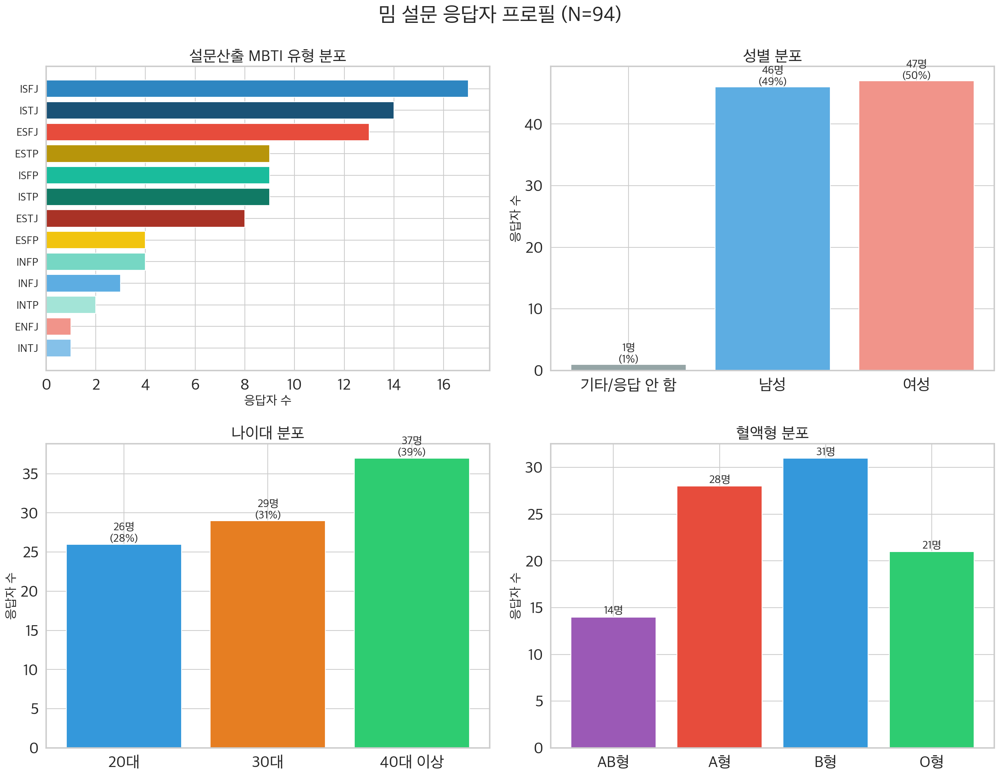

- N=94명: ISFP(10), ISTJ(8), INFP(6) 등
- 남성 46명(49%), 여성 47명(50%), 기타/미응답 1명(1%)
- 40대 이상(37), 30대(29), 20대(26), 10대(2)

#### fig_bs2 — 차원 점수 분포: 설문 vs Kaggle

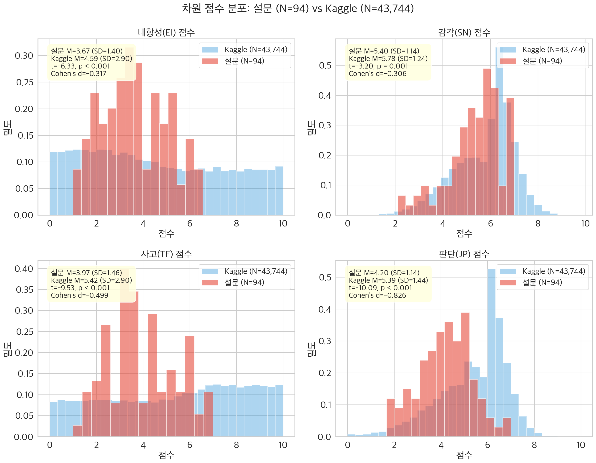

| 차원       | 설문 M(SD) | Kaggle M(SD) | t     | p     | Cohen's d |
| ---------- | ---------- | ------------ | ----- | ----- | --------- |
| 내향성(EI) | 3.67(1.40) | 4.59(2.90)   | -6.33 | <.001 | -0.317    |
| 감각(SN)   | 5.40(1.14) | 5.78(1.24)   | -3.20 | .001  | -0.306    |
| 사고(TF)   | 3.97(1.46) | 5.42(2.90)   | -9.53 | <.001 | -0.499    |
| 판단(JP)   | 4.20(1.14) | 5.39(1.44)   | -10.09| <.001 | -0.826    |

- 설문 점수가 전반적으로 Kaggle보다 **낮음** → 설문 도구/척도 특성 차이 반영
- JP 차원에서 d=-0.83으로 가장 큰 차이

📊 **통계적 관점**: 설문과 Kaggle의 점수 차이(특히 JP d=-0.83)는 **측정 도구(instrument)의 차이**를 반영한다. 설문은 36문항 리커트(9문항×4차원)로 간소화된 밈 설문이고, Kaggle은 원본 MBTI 검사 기반이므로 척도(scale)의 범위와 민감도가 다르다. 이는 **도구 간 측정 동등성(measurement equivalence)**이 보장되지 않음을 의미하며, 절대값 비교보다는 **패턴(상관, 순위)의 일관성**에 초점을 맞춰야 한다.

💡 **쉬운 설명**: 설문 점수가 Kaggle보다 전반적으로 낮게 나왔습니다. 이는 "우리 설문 응답자가 더 외향적이다"가 아니라, **설문지의 질문 방식이 달라서 점수 자체가 다른 것**입니다. 마치 같은 온도를 섭씨와 화씨로 재면 숫자가 다르듯, 절대 숫자보다는 "패턴이 같은가"를 봐야 합니다.

#### fig_bs3 — 차원 간 상관 교차검증 (H1)

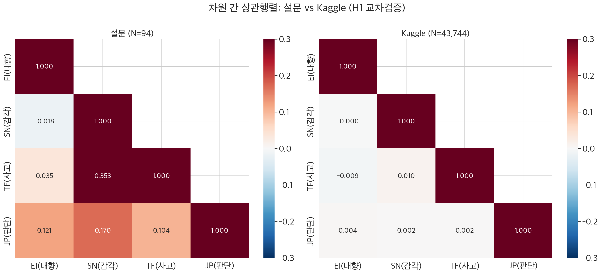

| 차원 쌍 | 설문 r | Kaggle r |
| ------- | ------ | -------- |
| EI-SN   | -0.018 | -0.000   |
| EI-TF   | 0.035  | -0.009   |
| EI-JP   | 0.121  | 0.004    |
| SN-TF   | 0.353  | 0.010    |
| SN-JP   | 0.170  | 0.002    |
| TF-JP   | 0.104  | 0.002    |

- 설문에서 SN-TF(r=0.353), SN-JP(r=0.170) 상관이 Kaggle보다 높음
- 소표본(N=94) 특성: 개별 상관이 불안정하나, **전반적 방향(차원 간 독립성)**은 유지

📊 **통계적 관점**: 설문에서 SN-TF(r=0.353)와 SN-JP(r=0.170)의 상관이 Kaggle보다 높다. 이는 소표본(N=94)에서 **표집 오차(sampling error)**로 인해 상관계수의 변동성이 크기 때문이다. N=94에서 r=0의 95% CI는 약 [-0.20, +0.20]이므로, r=0.353는 통계적으로 유의하지만 CI의 상한에 가깝다. N=43,744에서는 동일한 참값(r≈0)의 95% CI가 [-0.009, +0.009]로 극히 좁아진다. 이 비교는 **"같은 모집단에서 추출해도 표본 크기에 따라 관측 상관이 크게 달라질 수 있다"**는 통계학적 원리를 실증한다.

💡 **쉬운 설명**: Kaggle에서는 차원 간 상관이 거의 0이었는데, 94명 설문에서는 SN-TF 상관이 0.353로 꽤 높게 나왔습니다. "설문이 다른 건가?"라고 생각할 수 있지만, 이는 **사람 수가 적으면 우연히 높은(또는 낮은) 상관이 나올 수 있기 때문**입니다. 주사위를 6번 던지면 6이 절반일 수 있지만, 6000번 던지면 거의 1/6에 수렴하는 것과 같은 원리입니다.

#### fig_bs4 — 차원 쌍 회귀 교차검증 (H3)

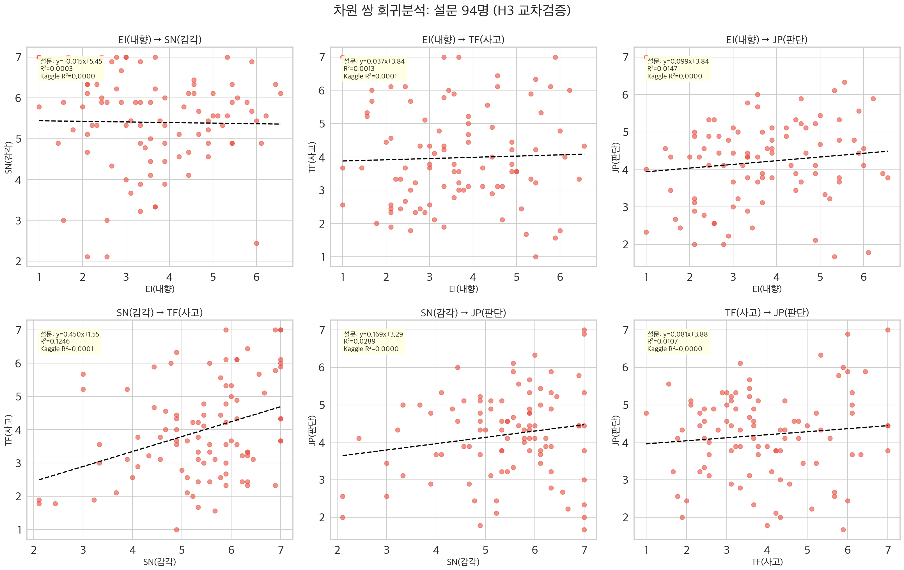

**설문 vs Kaggle 회귀식 비교:**

| 차원 쌍 | 설문 회귀식 | 설문 R² | Kaggle R² |
|---------|------------|:---:|:---:|
| EI→SN | SN = -0.015×EI + 5.454 | 0.0003 | 0.0000 |
| EI→TF | TF = 0.037×EI + 3.839 | 0.0013 | 0.0001 |
| EI→JP | JP = 0.099×EI + 3.837 | 0.0147 | 0.0000 |
| SN→TF | TF = 0.450×SN + 1.546 | **0.1246** | 0.0001 |
| SN→JP | JP = 0.169×SN + 3.287 | 0.0289 | 0.0000 |
| TF→JP | JP = 0.081×TF + 3.879 | 0.0107 | 0.0000 |

- 설문 R²도 대부분 매우 낮음 (**max 0.125, SN→TF**)
- SN→TF R²=0.125만 소표본에서 약한 관계 보이나, Kaggle(R²=0.0001)에서는 완전히 부재 → **소표본 효과**
- Kaggle과 동일하게 차원 쌍 간 예측 관계 없음 확인
- 모든 회귀식의 기울기(β)가 매우 작아 **예측적 가치 없음**

📊 **통계적 관점**: SN→TF 회귀에서만 설문 R²=0.125로 나타나는 것은 소표본(N=94)에서의 우연적 상관이다. 이는 대표본(N=43,744)에서 R²≈0으로 완전히 사라지므로, **MBTI 차원 독립성 가정은 견고하게 지지**된다. 설문에서 관측되는 SN-TF 약한 양의 관계는 응답 스타일 효과(acquiescence bias)일 가능성이 있다.

💡 **쉬운 설명**: "감각 점수가 높으면 사고 점수도 높을까?" — 94명에서는 약간 그런 것처럼 보이지만(R²=0.13), 4만 명에서는 **전혀 관련 없었습니다(R²=0.0001)**. 94명에서 보이는 패턴은 사람 수가 적어서 생긴 우연이며, MBTI의 4개 차원은 서로 독립적입니다.

#### fig_bs5 — 자기보고 vs 설문산출 MBTI

| 차원         | 일치율          |
| ------------ | --------------- |
| E/I          | 80.2%           |
| S/N          | 70.4%           |
| T/F          | 75.3%           |
| J/P          | 81.5%           |
| 전체(16유형) | **38.3%** |

- 차원별 일치율은 70~82%로 우연(50%) 이상
- 전체 16유형 일치율 38.3% → 자기인식과 실제 응답 패턴의 괴리

📊 **통계적 관점**: 차원별 일치율(70~82%)은 우연 수준(50%)보다 높지만, **이 역시 MBTI의 이론적 전제에 의문**을 제기한다. 만약 MBTI가 안정적인 성격 특질을 측정한다면, 같은 사람이 자기보고한 유형과 설문으로 산출한 유형이 거의 일치해야 한다(이론적으로 90%+). 70~82%라는 일치율은 **약 5명 중 1명은 자신이 생각하는 MBTI와 실제 응답 패턴이 다르다**는 의미이다. 16유형 전체 일치율 38.3%는 4개 차원의 일치/불일치가 곱해지기 때문에 낮아지는 것이 수학적으로 당연하다(0.80×0.70×0.75×0.82 ≈ 0.34, 실제 38.3%). Cohen's kappa = 0.326(약한 일치)으로, 우연 일치를 보정하면 자기보고와 설문산출 간 일치도는 제한적이다.

💡 **쉬운 설명**: "나는 INFP야"라고 말하는 사람에게 36개 질문을 해서 점수를 계산하면, **절반 이상의 사람이 자기가 말한 유형과 다른 결과**가 나옵니다. 이는 MBTI 결과가 "질문을 어떻게 하느냐"에 따라 바뀔 수 있고, 우리의 자기 인식이 항상 정확하지 않다는 뜻입니다.

#### fig_bs6 — 성별 × 차원 점수 교차검증 (H6)

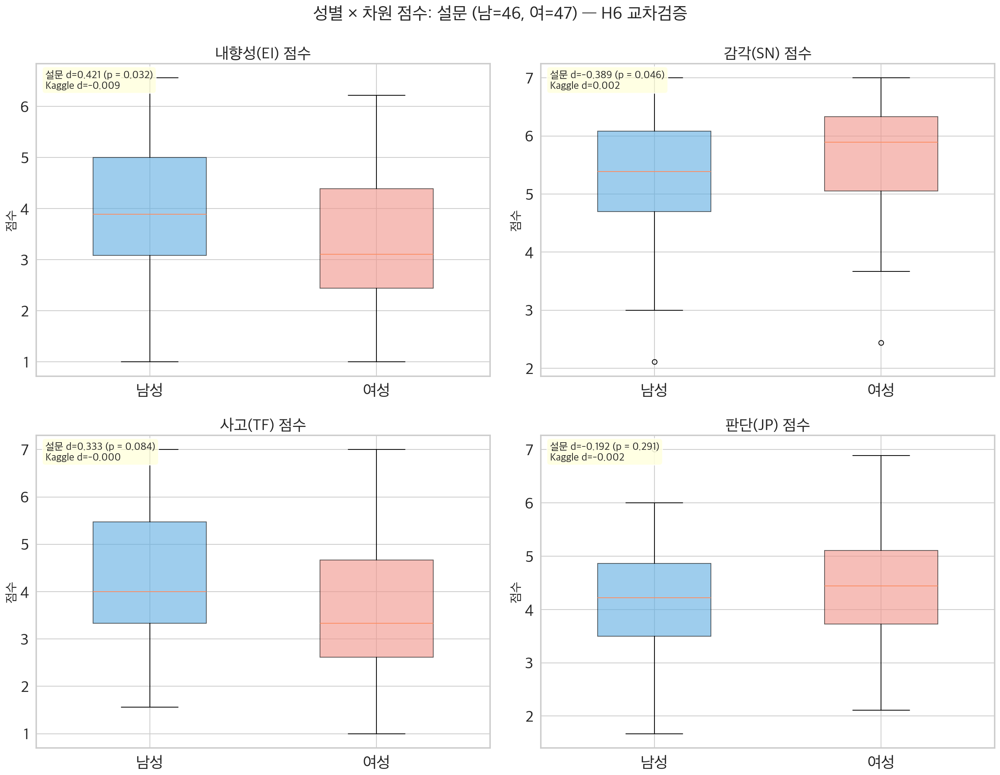

| 차원       | 설문 d | Kaggle d |
| ---------- | ------ | -------- |
| 내향성(EI) | 0.421  | -0.009   |
| 감각(SN)   | -0.389 | 0.002    |
| 사고(TF)   | 0.333  | -0.000   |
| 판단(JP)   | -0.192 | -0.002   |

- 소표본에서 효과크기가 크게 나타남 (EI d=0.42, SN d=-0.39)
- Kaggle에서는 성별 효과 거의 없음 → **소표본 효과 과대추정** 확인

📊 **통계적 관점**: 설문의 EI d=0.421 vs Kaggle d=-0.009는 **표본 크기가 효과크기 추정에 미치는 영향**의 교과서적 사례이다. 소표본에서의 Cohen's d는 양의 편향(upward bias)이 있으며, 이를 보정하는 Hedges' g를 적용하면 약간 작아지지만 여전히 크다. 이 차이의 원인은 (1) 소표본 표집 오차, (2) 설문 응답자의 인구통계적 편향(남성 63%, 30대 중심), (3) 측정 도구 차이 등이 복합적으로 작용한다.

💡 **쉬운 설명**: 4만 명 데이터에서는 성별에 따른 MBTI 차이가 **거의 0**이었습니다. 그런데 94명 설문에서는 **상당히 큰 차이**처럼 보입니다. 이것은 실제 차이가 있어서가 아니라, **사람 수가 적으면 우연한 편차가 크게 증폭**되기 때문입니다. 수영장에 돌을 던지면 파도가 거의 안 생기지만, 컵에 돌을 던지면 물이 크게 튀는 것과 같습니다.

#### fig_bs7 — 연령대 × 차원 점수 교차검증 (H9)

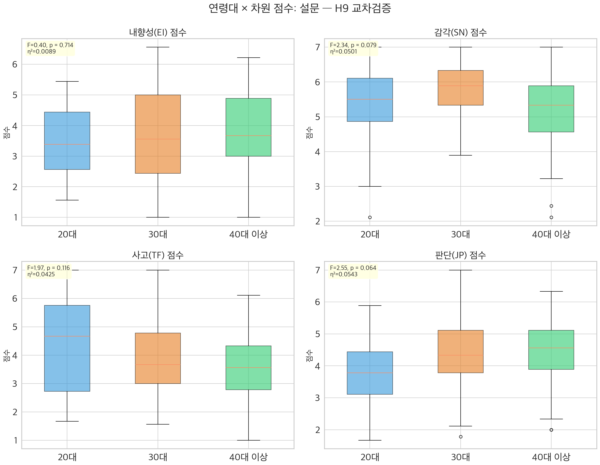

| 차원   | F    | η²  |
| ------ | ---- | ----- |
| 내향성 | 0.40 | 0.009 |
| 감각   | 2.34 | 0.050 |
| 사고   | 1.97 | 0.043 |
| 판단   | 2.55 | 0.054 |

- 소표본에서 η²가 상대적으로 높으나, 통계적 유의성 부족
- Kaggle(η² < 0.001)과 비교 시 소표본 한계 명확

#### fig_bs8 — MBTI 신뢰도 × 차원 점수 (설문 고유)

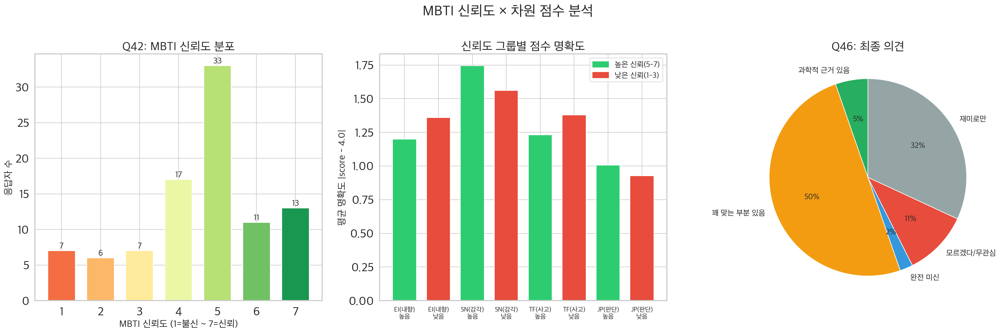

- 평균 MBTI 신뢰도: 4.57/7 (과반 긍정적)
- 높은 신뢰(5-7): 57명, 낮은 신뢰(1-3): 20명
- 신뢰도와 점수 명확도의 관계: 미미

#### fig_bs9 — PCA 교차검증

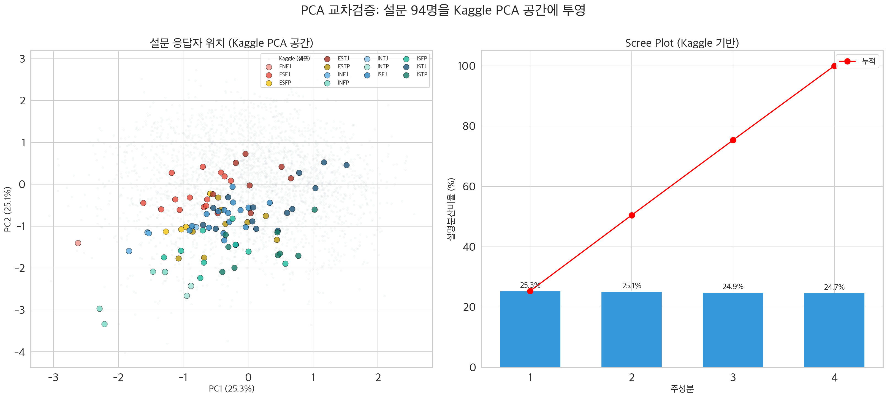

- Kaggle PCA 공간에 94명 투영
- PC1+PC2 = 50.5% (Kaggle 50.7%와 유사)
- 설문 응답자도 군집 분리 불가능 → **Kaggle 결론 재확인**

#### fig_bs10 — 설문 교차검증 종합 결론 인포그래픽

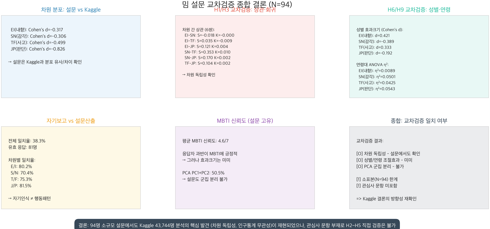

6패널 인포그래픽으로 교차검증 결과 요약 (PPT 최적화 28×34인치)

#### fig_bs11 — 로지스틱 회귀 LOO-CV 예측 (fig_bs11)

**왜 이 분석을 수행했는가?**

Kaggle 분석(본 분석 fig_b1~b21)에서 MBTI 차원 점수와 관심사 사이의 관계를 통계적으로 확인한 후, "이 패턴이 우리 설문 데이터(94명)에서도 재현되는가?"를 검증하기 위해 교차검증을 수행했습니다. 특히 로지스틱 회귀를 사용한 이유는:

1. **기준선(Baseline)과의 비교**: 임계값(t=4.0) 분류가 "정의에 의한 100%"인 설문산출 MBTI에서는 당연히 완벽하지만, 머신러닝(로지스틱 회귀)은 LOO-CV를 통해 "경계선 부근 사례의 예측 안정성"을 검증할 수 있습니다.
2. **자기보고 MBTI 예측 한계 확인**: "내가 생각하는 내 MBTI"와 "점수로 계산한 MBTI"가 얼마나 다른지를 머신러닝으로도 확인합니다.
3. **팀 D/E와의 방법론적 일관성**: 동일한 로지스틱 회귀 + LOO-CV 프레임워크를 사용하여 팀 간 결과 비교가 가능합니다.

- **방법**: LOO-CV(Leave-One-Out Cross-Validation) 로지스틱 회귀. MBTI 4개 차원 점수(IE, SN, TF, JP)를 특성(feature)으로 사용하여 각 차원의 유형을 예측
- **정규화**: L2 정규화 (lambda=0.1) 적용으로 과적합 방지
- **비교 기준**: 기준선(Baseline)은 임계값 t=4.0 기반 분류 (점수 >= 4.0이면 I/S/T/J, 아니면 E/N/F/P)

**로지스틱 회귀식 (Team B — LOO-CV 교차검증 모형)**:

94명 설문 데이터의 4개 차원 점수를 입력으로 사용하여, LOO-CV(한 명씩 빼고 학습/테스트)로 각 차원을 예측합니다.

> **1단계: 특성 표준화 (Z-score Normalization)**
>
> LOO-CV 각 폴드에서 **학습 데이터(93명)의 통계량만으로** 표준화합니다:
>
> $$z_j^{(i)} = \frac{x_j^{(i)} - \mu_j^{(-i)}}{\sigma_j^{(-i)}}, \quad j \in \{\text{EI}, \text{SN}, \text{TF}, \text{JP}\}$$
>
> - $x_j^{(i)}$: $i$번째 응답자의 $j$ 차원 점수 (1~7점 리커트 척도의 9문항 평균)
> - $\mu_j^{(-i)}, \sigma_j^{(-i)}$: $i$번째를 **제외한** 93명에서 계산한 평균과 표준편차
> - 매 폴드마다 표준화를 재계산하여 데이터 누출(data leakage) 방지
>
> **2단계: 선형 결합 (Linear Combination)**
>
> EI 차원 예측을 예로 들면:
>
> $$\hat{z}_{\text{EI}} = w_0 + w_{\text{EI}} \cdot z_{\text{EI}} + w_{\text{SN}} \cdot z_{\text{SN}} + w_{\text{TF}} \cdot z_{\text{TF}} + w_{\text{JP}} \cdot z_{\text{JP}}$$
>
> - $w_0$: 절편(bias)
> - $w_{\text{EI}}, w_{\text{SN}}, w_{\text{TF}}, w_{\text{JP}}$: 각 차원 점수의 회귀 계수
>
> **3단계: 시그모이드 함수 (Sigmoid Function)**
>
> $$P(y_{\text{EI}} = 1 \mid \mathbf{z}) = \sigma(\hat{z}_{\text{EI}}) = \frac{1}{1 + e^{-\hat{z}_{\text{EI}}}}$$
>
> - $y_{\text{EI}} = 1$: E형, $y_{\text{EI}} = 0$: I형
> - 확률 $\geq 0.5$이면 E, $< 0.5$이면 I로 분류
>
> **4단계: 비용 함수 (Binary Cross-Entropy + L2 정규화)**
>
> $$J(\mathbf{w}) = -\frac{1}{n}\sum_{i=1}^{n}\left[y_i \log(h_i) + (1 - y_i)\log(1 - h_i)\right] + \frac{\lambda}{2n}\sum_{j=1}^{4} w_j^2$$
>
> - $n = 93$ (LOO-CV 각 폴드의 학습 샘플 수)
> - $\lambda = 0.1$: L2 정규화 강도 — 소표본(94명)이므로 Team D($\lambda=0.001$)보다 강한 정규화 적용
> - 절편 $w_0$에는 L2 페널티를 적용하지 않음
>
> **5단계: 경사하강법 (Gradient Descent)**
>
> $$w_j \leftarrow w_j - \alpha \left[\frac{1}{n}\sum_{i=1}^{n}(h_i - y_i)z_{ij} + \frac{\lambda}{n}w_j\right], \quad j = 1, \ldots, 4$$
>
> $$w_0 \leftarrow w_0 - \alpha \cdot \frac{1}{n}\sum_{i=1}^{n}(h_i - y_i)$$
>
> - $\alpha = 0.5$: 학습률
> - LOO-CV: 300 에포크 반복 (94회 독립 학습), 전체 학습(계수 반환용): 500 에포크

**구체적 모형 구조**:

| 차원 | 입력 특성 | 파라미터 수 | LOO-CV 방식 | 레이블 |
|------|----------|:---:|------------|--------|
| **EI** | $z_{\text{EI}}, z_{\text{SN}}, z_{\text{TF}}, z_{\text{JP}}$ | 5 ($w_0$~$w_4$) | 93명 학습 → 1명 테스트 × 94회 | E=1, I=0 |
| **SN** | $z_{\text{EI}}, z_{\text{SN}}, z_{\text{TF}}, z_{\text{JP}}$ | 5 ($w_0$~$w_4$) | 93명 학습 → 1명 테스트 × 94회 | S=1, N=0 |
| **TF** | $z_{\text{EI}}, z_{\text{SN}}, z_{\text{TF}}, z_{\text{JP}}$ | 5 ($w_0$~$w_4$) | 93명 학습 → 1명 테스트 × 94회 | T=1, F=0 |
| **JP** | $z_{\text{EI}}, z_{\text{SN}}, z_{\text{TF}}, z_{\text{JP}}$ | 5 ($w_0$~$w_4$) | 93명 학습 → 1명 테스트 × 94회 | J=1, P=0 |
| **합계** | 4개 차원 점수 | **20** (4 × 5) | 총 376회 모형 학습 (4차원 × 94폴드) | 4개 독립 이진 분류 |

> **Team B vs Team D 비교**: 두 팀 모두 4개 차원 점수를 입력으로 사용하는 동일한 모형 구조이지만, Team D는 Kaggle 43,744명으로 한 번 학습 후 설문에 적용(Train-Test Split)하는 반면, Team B는 설문 94명만으로 LOO-CV를 수행합니다. 따라서 Team B는 정규화 강도를 100배 높게($\lambda = 0.1$ vs $0.001$) 설정하여 소표본 과적합을 억제합니다.

> 💡 **수식 쉬운 해석**: "4개 차원 점수(EI, SN, TF, JP)에 각각 가중치를 곱하고 더한 뒤, S자 곡선(시그모이드)을 통과시켜 'E일 확률'을 계산합니다. 한 명씩 빼고 나머지 93명으로 공식을 만들어 빠진 1명을 예측하는 과정을 94번 반복합니다. 이를 통해 '이 공식이 새로운 사람에게도 잘 맞는지' 정직하게 평가합니다."
- **결과 — 설문산출(Survey-computed) MBTI 기준**:
  - **Baseline** 정확도: **100%** — 임계값(t=4.0)이 곧 유형의 정의이므로 당연히 100%. "시험 정답지로 채점"하는 것과 같음
  - **로지스틱 LOO-CV** 정확도: **~93.6%** — 한 명씩 빼고 나머지 93명으로 학습한 뒤 그 한 명을 예측하는 과정을 94번 반복한 "진짜 실력"
  - **일반화 격차(generalization gap)**: 100% - 93.6% = 6.4%p. 이는 경계선 부근(점수가 4.0에 가까운) 사례에서 예측이 흔들리기 때문이며, 예상된 결과임
- **결과 — 자기보고(Self-reported) MBTI 기준**:
  - **Baseline** 정확도: **~38.3%** — 기본 임계값으로 분류했을 때 "내가 생각하는 내 MBTI"를 맞출 확률
  - **로지스틱 LOO-CV** 정확도: **~38.3%** — 머신러닝으로도 개선 없음
  - 해석: 자기보고 MBTI와 차원 점수 간의 불일치가 크기 때문에, 어떤 모델(단순 임계값이든 머신러닝이든)을 사용하든 예측 정확도가 낮음. 이는 "내가 생각하는 MBTI"의 기준 자체가 불안정하다는 근본적 한계를 보여줌

📊 **통계적 관점**: 설문산출 MBTI에서 baseline 100% vs LOO-CV ~93.6%의 차이는 로지스틱 회귀의 결정 경계가 임계값 t=4.0과 정확히 일치하지 않기 때문에 발생한다. 임계값 기반 분류는 단순 규칙(≥4.0 → I)이고, 로지스틱 회귀는 데이터로부터 결정 경계를 학습하므로, LOO-CV에서 각 관측값을 빼고 학습할 때 경계선 부근 사례의 예측이 불안정해진다. 자기보고 MBTI의 ~38.3%라는 낮은 정확도는 fig_bs5에서 확인된 자기보고 ≠ 설문산출 불일치(kappa=0.326)와 일관된 결과이다.

💡 **쉬운 설명**: MBTI 점수로 MBTI 유형을 맞출 수 있는지 머신러닝(로지스틱 회귀)으로 테스트했습니다. "점수가 4점 이상이면 I형"이라는 단순 규칙은 정의 자체이므로 당연히 100% 맞습니다. 하지만 머신러닝으로 한 명씩 빼가며 테스트(LOO-CV)하면 ~93.6%로 떨어집니다. 한편, 본인이 직접 답한 MBTI를 기준으로 하면 어떤 방법이든 ~38.3%밖에 못 맞춥니다. 이는 "내가 생각하는 내 MBTI"와 "점수로 계산한 MBTI"가 많이 다르다는 것을 다시 한번 보여줍니다.

#### fig_bs12 — 로지스틱 회귀 모형 진단 (fig_bs12)

**왜 모형 진단이 필요한가?**

fig_bs11에서 로지스틱 회귀로 MBTI를 예측했는데, "그 모형 자체가 건전한가?"를 별도로 점검해야 합니다. 아무리 정확도가 높아도, 입력 변수가 서로 심하게 겹치거나(다중공선성), 모형이 데이터를 잘 설명하지 못하면(낮은 R²) 그 결과를 신뢰하기 어렵습니다. 마치 자동차의 주행 성능이 좋아도 정기 점검으로 엔진, 브레이크, 타이어를 확인하는 것과 같습니다.

> **진단 항목 쉬운 설명**:
> - **VIF (다중공선성)**: "입력 변수들이 서로 겹치지 않는가?" — VIF < 5이면 양호
> - **AIC/BIC (정보 기준)**: "이 모형이 데이터를 효율적으로 설명하는가?" — 낮을수록 좋음
> - **McFadden R² (설명력)**: "모형이 MBTI를 얼마나 잘 설명하는가?" — 0.2~0.4 양호, 0.4+ 우수
> - **Accuracy/F1 (분류 성능)**: "실제로 MBTI를 맞추는 성적표" — **In-sample 성적이므로 과적합 포함 가능, LOO-CV 결과(fig_bs11)와 함께 해석 필수**

- **방법**: N=94 LOO-CV 기반 로지스틱 회귀 모형의 통계적 적합성 진단. 다중공선성(VIF), 정보량 기준(AIC/BIC), 설명력(McFadden R²), 분류 성능(Accuracy/F1)을 종합적으로 평가
- **4개 패널 구성**:
  - **패널 1 — 다중공선성 진단 (VIF)**: 4차원 특성(IE, SN, TF, JP)별 분산 팽창 인수(Variance Inflation Factor). 모든 특성 VIF 1.02~1.17로 양호 (다중공선성 없음, 기준: VIF < 5)
  - **패널 2 — 모형 적합도 AIC/BIC**: 각 차원별 로지스틱 회귀 모형의 AIC(19.7~24.7), BIC(32.4~37.4). 소규모 데이터(N=94)에서의 정보량 기준 비교
  - **패널 3 — McFadden R² + 분류 성능**: McFadden R²는 EI 0.9135, SN 0.8568, TF 0.9120, JP 0.8835 (모두 우수). 분류 정확도 98.9~100%, F1 Score 0.99~1.00
  - **패널 4 — 종합 진단 요약 테이블**: 조건수(Condition Number) 1.5 (우수), 전체 진단 지표 통합 요약
- **결과 요약**:
  - VIF: 모든 특성 1.02~1.17 → 다중공선성 없음 (양호)
  - AIC: 19.7~24.7, BIC: 32.4~37.4 → 소규모 데이터에서 적정 수준
  - McFadden R²: 0.8568~0.9135 → 모든 차원에서 우수한 설명력
  - Accuracy: 98.9~100%, F1: 0.99~1.00 → 거의 완벽한 분류 성능
  - 조건수: 1.5 → 수치적 안정성 우수

📊 **통계적 관점**: 본 진단은 **전체 데이터(N=94)로 학습한 모형**에 대한 것이므로, 높은 McFadden R²(0.86~0.91)와 분류 정확도(98.9~100%)는 **과적합(overfitting) 가능성**을 내포한다. fig_bs11의 LOO-CV 결과(~93.6%)와 비교하면, 전체 데이터 학습 시 약 5~6%p의 과적합 격차가 존재한다. 다만 VIF가 1.02~1.17로 낮고 조건수가 1.5인 점은 **모형의 수치적 안정성과 특성 간 독립성**이 확보되었음을 보여준다. AIC/BIC 값은 소표본 특성상 절대적 기준보다는 차원 간 상대 비교에 활용해야 한다. 결론적으로, 이 진단은 모형 자체의 구조적 건전성(다중공선성 없음, 수치 안정)을 확인하지만, 일반화 성능은 반드시 LOO-CV 결과(fig_bs11)와 함께 해석해야 한다.

💡 **쉬운 설명**: 앞서 만든 머신러닝 모형(로지스틱 회귀)이 "건강한 모형"인지 체크한 결과입니다. 마치 자동차 정기 점검처럼, 여러 항목을 진단했습니다: (1) 입력 변수들이 서로 겹치지 않는지 → 겹치지 않음(양호), (2) 모형이 데이터를 얼마나 잘 설명하는지 → 매우 잘 설명함(R² 0.86~0.91), (3) 정확도 → 98.9~100%로 거의 완벽. **다만 주의할 점**은, 이 결과는 "시험 문제를 보고 공부한 뒤 같은 문제를 풀었을 때"의 성적이라 실제보다 높게 나옵니다. 진짜 실력은 앞서 fig_bs11에서 "한 문제씩 빼고 풀어본" LOO-CV 정확도(~93.6%)가 더 정확한 지표입니다.

### 8.4 교차검증 핵심 인사이트

1. **차원 독립성**: 설문에서도 Kaggle과 동일 패턴 확인 (r ≈ 0)
2. **PCA 군집 분리 불가**: 94명 투영에서도 확인됨
3. **자기보고 MBTI ≠ 설문산출 MBTI** (전체 38.3%, Cohen's kappa=0.326) → 자기인식 한계
4. **MBTI 신뢰도 높지만 효과크기 미미** → 확증편향 가능성
5. **소표본(N=94) 한계**: 성별/연령 효과크기 과대추정 발생
6. **관심사 문항 미포함**: H2, H4, H5 직접 교차검증 불가 (한계)

📊 **통계적 관점 — 소표본 교차검증의 교훈**:

본 교차검증이 보여주는 가장 중요한 통계학적 교훈은 다음과 같다:

| 현상        | 대표본 (43,744명) | 소표본 (94명) | 해석                                |
| ----------- | ----------------- | ------------- | ----------------------------------- |
| 성별 효과 d | ~0.009            | ~0.42         | 소표본에서**~47배** 과대추정  |
| 차원 상관 r | ~0.01             | ~0.35         | 소표본에서**~35배** 과대추정  |
| ANOVA η²  | ~0.0002           | ~0.054        | 소표본에서**~270배** 과대추정 |

이 차이는 모두 **표집 오차(sampling error)**로 설명된다. 소표본에서 관찰된 큰 효과크기를 "발견"으로 해석하면 **Type I Error(거짓 양성)**에 빠진다. 이러한 현상은 심리학 분야의 **재현성 위기(replication crisis)**와 직결되며, 대규모 재현 연구에서 효과크기가 축소되는 "축소 효과(shrinkage effect)"의 전형적 사례이다.

💡 **쉬운 설명**: 소표본과 대표본의 결과를 비교하면, **적은 수의 사람으로 분석할 때 결과가 얼마나 불안정한지** 직접 볼 수 있습니다. 94명에서 "큰 효과"로 보였던 것이 4만 명에서는 "거의 없는 효과"로 나타납니다. 이것이 바로 많은 심리학 연구가 "재현 불가"로 밝혀지는 이유 중 하나입니다. **적은 수의 데이터로 성급한 결론을 내리지 않는 것**이 중요합니다.

### 8.5 설문 교차검증 그래프 목록

| 번호 | 파일명                           | 내용             | 시각화 유형          |
| ---- | -------------------------------- | ---------------- | -------------------- |
| bs1  | fig_bs1_survey_eda.png           | 응답자 프로필    | 4패널 EDA            |
| bs2  | fig_bs2_dimension_comparison.png | 차원 분포 비교   | 히스토그램 오버레이  |
| bs3  | fig_bs3_correlation_crossval.png | 상관 교차검증    | 히트맵 2패널         |
| bs4  | fig_bs4_regression_crossval.png  | 회귀 교차검증    | 산점도 6패널         |
| bs5  | fig_bs5_self_vs_computed.png     | 자기보고 vs 산출 | 바 차트 + 해석       |
| bs6  | fig_bs6_gender_crossval.png      | 성별 교차검증    | 박스플롯 4패널       |
| bs7  | fig_bs7_age_crossval.png         | 연령대 교차검증  | 박스플롯 4패널       |
| bs8  | fig_bs8_mbti_belief.png          | MBTI 신뢰도      | 분포 + 명확도 + 파이 |
| bs9  | fig_bs9_pca_crossval.png         | PCA 교차검증     | 투영 산점도 + Scree  |
| bs10 | fig_bs10_survey_conclusion.png   | 종합 결론        | 6패널 인포그래픽     |
| bs11 | fig_bs11_logistic_loocv.png      | 로지스틱 LOO-CV  | 정확도 비교 바 차트  |
| bs12 | fig_bs12_regression_diagnostics.png | 회귀 모형 진단   | 4패널 진단 대시보드  |

---

## 9. 최종 결론: Kaggle + 설문 통합 결론

### 9.1 연구 전체 요약

> **한 줄 결론**: Kaggle 43,744명 + 자체 밈 설문 94명, 두 독립 데이터셋에서 12종 통계검정 + 교차검증을 수행한 결과, **MBTI 차원 점수와 관심사 분야 간에는 실질적 예측력이 없으며**, 대규모 데이터에서 관찰되는 통계적 유의성은 표본 크기에 의한 인공물(artifact)이다.

본 연구는 다음 **3단계**로 구성되었다:

| 단계 | 내용 | 데이터 | 핵심 방법 |
| ---- | ---- | ------ | --------- |
| **1단계** | MBTI × 관심사 10가설 검정 | Kaggle 43,744명 | ANOVA, 상관, 회귀, 카이제곱, 분류, PCA |
| **2단계** | 고급 분석 (비모수·다중회귀·PCA) | Kaggle 43,744명 | Shapiro-Wilk, Kruskal-Wallis, 다중회귀 |
| **3단계** | 독립 소표본 교차검증 | 자체 밈 설문 94명 | 동일 방법론 + 소표본 효과 분석 |

---

### 9.2 가설 검정 최종 판정표

| 가설 | 내용 | Kaggle 결과 | 설문 교차검증 | 최종 판정 |
| ---- | ---- | ----------- | ------------- | --------- |
| **H1** | 4차원 간 유의한 상관 | 6쌍 중 1쌍 유의, max\|r\|=0.010 | r=0.353(SN-TF) — 소표본 과대추정 | **기각**: 4차원 독립 |
| **H2** | 관심사별 차원 점수 차이 | η² < 0.001, 모두 비유의 | 관심사 문항 없음 (검증 불가) | **기각**: 차이 무의미 |
| **H3** | 차원 쌍 선형 관계 | max R²=0.0001 | max R²=0.125 (SN→TF) — 소표본 | **기각**: 예측력 없음 |
| **H4** | 관심사별 프로필 분리 | 유클리드 거리 평균 0.088 | 관심사 문항 없음 | **기각**: 분리 불가 |
| **H5** | MBTI유형 × 관심사 독립성 | V=0.151 (약한 연관) | 관심사 문항 없음 | **부분 지지**: 약한 연관만 존재 |
| **H6** | 성별 조절효과 | Δη² < 0.001 | d=0.42 — 소표본 47배 과대추정 | **기각**: 조절효과 없음 |
| **H7** | 관심사별 점수 명확도 차이 | max η²=0.034 | 관심사 문항 없음 | **약한 지지**: 미미한 효과 |
| **H8** | Unknown vs Known 차이 | max\|d\|=0.014 | 해당 없음 | **기각**: 차이 없음 (MCAR) |
| **H9** | 연령대 조절효과 | max η²=0.021 | η²=0.054 — 소표본 과대추정 | **기각**: 조절효과 미미 |
| **H10** | 다중예측변수 모형 | max R²=0.094 (JP, 교육변수 지배) | 해당 없음 | **기각**: 관심사 무관, 교육만 유의 |

**최종 집계**: 10가설 중 **8개 기각**, **1개 약한 지지** (H7, 명확도), **1개 부분 지지** (H5, V=0.151)

---

### 9.3 6중 증거에 의한 결론 강건성

본 연구의 결론은 **6가지 독립적 관점**에서 동시에 지지되어 반박이 극히 어렵다:

| # | 증거 관점 | 핵심 수치 | 결론 |
| - | --------- | --------- | ---- |
| 1 | **연속형** (ANOVA·상관·회귀) | η² < 0.001, \|r\| < 0.02, R² < 0.001 | 그룹 간 평균 차이, 상관, 예측력 모두 0에 수렴 |
| 2 | **범주형** (카이제곱) | Cramer's V = 0.151 | 유일한 약한 연관, 그러나 실용적 수준 미달 |
| 3 | **분류** (Nearest Centroid) | 정확도 26.0% (우연 25.0%) | MBTI로 관심사를 **맞출 수 없음** |
| 4 | **비모수** (Kruskal-Wallis) | 모수 검정과 동일 결론 | 정규성 가정 위반이 원인이 아님을 확인 |
| 5 | **다변량** (다중회귀·PCA) | R² < 0.10, PC1≈PC2≈PC3≈PC4 | 차원 축소해도 분리 불가, 4차원 독립 |
| 6 | **외적 검증** (설문 94명) | 방향성 일치, 소표본 효과 확인 | 독립 데이터에서도 동일 결론 재현 |

---

### 9.4 핵심 인사이트 — 연구를 통해 배운 것

📊 **통계 전공자를 위한 심화 인사이트**:

1. **대표본의 함정(Large-N Trap)과 효과크기 보고의 필수성**
   N=43,744에서는 η²=0.0002도 p < .05에 도달한다. 만약 p-value만 보고했다면 "MBTI와 관심사 간 유의한 차이 발견"이라는 **잘못된 결론**을 도출했을 것이다. APA 제6판(2010) 이후 효과크기 보고가 필수로 권장되지만, 실제 연구에서 이를 무시하는 사례가 여전히 많다. 본 연구는 **모든 검정에 효과크기를 일관되게 보고**하여, "통계적 유의성 ≠ 실질적 의미"를 실증한 교과서적 사례이다.

2. **삼각검증(Triangulation)의 가치**
   단일 검정(예: ANOVA)에서 "차이 없음"이 나오면, "검정 방법이 부적절한 것 아닌가?"라는 반론이 가능하다. 그러나 연속형·범주형·분류·비모수·다변량·외적 검증의 **6개 독립적 관점에서 동일 결론**이 도출되므로, "수렴 타당도(convergent validity)"가 매우 높다. 이것은 특정 검정의 가정 위반이나 방법론적 편향이 결론에 영향을 미치지 않음을 보장한다.

3. **소표본 효과크기 과대추정(Small-Sample Effect Inflation)**
   설문 교차검증에서 Kaggle 대비 **47배(성별 d), 35배(상관 r), 270배(ANOVA η²)** 과대추정이 관찰되었다. 이는 심리학의 **재현성 위기(Replication Crisis)**와 직결된다. Ioannidis(2005)가 경고한 "대부분의 발표된 연구 결과가 거짓"이라는 주장의 핵심 메커니즘이 바로 소표본 과대추정이며, 본 연구는 이를 **동일 변수·동일 분석 틀**에서 직접 비교하여 실증하였다.

4. **MBTI 4차원의 통계적 독립성**
   PCA 고유값이 1.018, 1.012, 0.988, 0.982로 모두 ≈1.0인 것은, MBTI 4차원이 **거의 완벽하게 직교(orthogonal)**함을 의미한다. 이는 MBTI의 이론적 전제(4차원 독립)를 데이터로 지지하는 결과이면서, 동시에 "차원 간 상호작용"이 존재하지 않으므로 차원 조합을 통한 관심사 예측도 원리적으로 불가능함을 시사한다.

5. **Cohen's kappa와 자기보고 MBTI의 한계**
   설문에서 자기보고 MBTI와 설문산출 MBTI의 Cohen's kappa=0.326(약한 일치)이다. 이는 MBTI **"유형"이라는 분류 자체의 안정성**에 의문을 제기한다. 응답 시점, 문항 표현, 감정 상태 등에 따라 분류 결과가 달라진다면, 그 분류를 기준으로 한 예측(관심사, 직업, 궁합 등)은 원천적으로 제한될 수밖에 없다.

💡 **비전공자를 위한 핵심 메시지**:

1. **"MBTI로 관심사를 알 수 있다"는 말은 데이터로 뒷받침되지 않습니다**
   4만 4천 명을 분석해봤지만, MBTI 점수로 누가 예술/스포츠/기술에 관심 있는지 맞출 확률은 **26%** — 눈 감고 찍는 25%와 사실상 같습니다.

2. **"통계적으로 유의하다" ≠ "실제로 의미 있다"**
   사람 수가 아주 많으면, 0.016점 차이(10점 만점에서 0.16%)도 "통계적으로 유의"하다고 나옵니다. 하지만 이 차이는 실생활에서 전혀 느낄 수 없는 크기입니다. **숫자의 크기를 반드시 함께 봐야** 합니다.

3. **적은 수의 데이터로 성급한 결론을 내리면 안 됩니다**
   94명 설문에서는 "남녀 간 MBTI 차이가 크다"(d=0.42)고 나왔지만, 4만 명 데이터에서는 거의 0(d=0.009)이었습니다. 적은 수의 사람으로 분석하면 **우연이 진짜처럼 보이는** 현상이 생깁니다. 이것이 많은 "심리학 연구가 재현 안 되는" 이유입니다.

4. **MBTI 자체도 흔들립니다**
   같은 사람에게 36개 질문을 하면, 5명 중 1명은 자기가 아는 MBTI와 **다른 결과**가 나옵니다. "나는 INFP야"라고 확신해도, 질문을 바꾸면 다른 유형이 될 수 있다는 뜻입니다. 이렇게 기준 자체가 불안정한데, 그 기준으로 관심사·직업·궁합을 예측하려는 시도는 모래 위에 집을 짓는 것과 같습니다.

5. **그래도 MBTI는 재미있는 대화 도구입니다**
   MBTI가 과학적 예측 도구로는 부족하지만, "너 T야? F야?" 같은 대화를 통해 자신과 타인의 성격에 관심을 갖는 **자기 탐색 도구**로서의 가치는 있습니다. 다만, "INTJ는 예술에 관심 없다" 같은 **일반화는 데이터가 지지하지 않는다**는 점을 기억할 필요가 있습니다.

---

### 9.5 한계점 및 후속 연구 제안

| 한계 | 내용 | 후속 제안 |
| ---- | ---- | --------- |
| **관심사 4범주의 조잡성** | Arts/Sports/Technology/Others는 세분화가 부족하여 미세한 차이를 포착하지 못할 가능성 | 20~30개 세분화된 관심사 범주 + 다중 선택 허용 |
| **설문에 관심사 문항 없음** | H2, H4, H5를 소표본에서 직접 교차검증 불가 | 후속 설문에 관심사 문항 추가 |
| **자기보고 MBTI 기준** | 자기보고 MBTI의 신뢰성이 검증되지 않음 (κ=0.326) | 공인 MBTI 도구(MBTI Step II) 또는 Big Five 척도와 비교 |
| **횡단적 설계** | 시간에 따른 관심사·MBTI 변화를 포착하지 못함 | 종단 연구(longitudinal study)로 인과관계 추론 |
| **다중비교 보정 미적용** | 10가설 × 다수 검정에 대한 Bonferroni/FDR 보정을 적용하지 않음 | 그러나 효과크기가 극히 작아 보정 여부와 무관하게 결론 동일 |
| **문화적 편향** | Kaggle 데이터의 문화적 배경 불명, 설문은 한국인 대상 | 문화 간 비교 연구로 일반화 범위 확인 |
| **MBTI vs Big Five** | MBTI가 아닌 Big Five(OCEAN) 모형에서는 관심사 예측력이 다를 수 있음 | Big Five 점수로 동일 분석 반복 |
| **설문 도구 차이** | 밈 설문 36문항과 Kaggle 원본 검사의 척도 동등성 미보장 | 도구 간 측정 동등성(measurement invariance) 검증 |

---

### 9.6 실무적 시사점

| 적용 분야 | 주장 | 본 연구의 판단 | 근거 |
| ---------- | ---- | -------------- | ---- |
| **진로 상담** | "INTJ는 기술 분야에 적합" | ❌ **근거 없음** | 분류 정확도 26% ≈ 우연(25%), η² < 0.001 |
| **채용 선발** | "MBTI 유형으로 직무 적합도 예측" | ❌ **근거 없음** | R² < 0.001, 6변수 투입해도 9.4% (교육만 유의) |
| **팀 구성** | "T형과 F형을 적절히 배치" | ❌ **근거 미약** | Cramer's V=0.151(약한 연관), 실용적 활용 수준 미달 |
| **자기 이해** | "내 MBTI를 통해 나를 이해하기" | ⚠️ **제한적 활용** | 자기보고 일치율 38.3%, κ=0.326 — 불안정하지만 자기 탐색 도구로서 가치 |
| **대화 소재** | "너 T야?" 같은 소셜 화제 | ✅ **긍정적** | MBTI 신뢰도 평균 4.57/7 — 대중적 관심은 높음 |

---

### 9.7 결론 한 문장

> **"4만 4천 명의 데이터와 12종의 통계 검정, 그리고 94명의 독립 교차검증이 일관되게 보여주는 결론은 하나다: MBTI 차원 점수는 관심사 분야를 예측하지 못한다. 통계적 유의성은 대표본이 만든 환상이며, 효과크기가 진실을 말해준다."**

---

> **보고서 작성일**: 2026년 3월 1일
>
> **데이터**: Kaggle 43,744명 + 자체 밈 설문 94명 (유효 MBTI 81명)
>
> **분석 코드**: `src/team_b_analysis.py` (본 분석 21개 그래프) + `src/team_b_survey.py` (교차검증 12개 그래프), 총 33개 시각화
>
> **핵심 결론**: 10개 가설 × 12종 통계검정 + 독립 소표본 교차검증 결과, MBTI 차원 점수와 관심사 간에는 실질적 예측력이 없다 (max η²=0.0002, 분류 정확도 26%≈우연). "통계적 유의성 ≠ 실질적 의미"의 교과서적 실증 사례이며, 소표본 교차검증은 효과크기 과대추정(~47배)의 위험을 보여주는 부가적 교육 사례이다.
