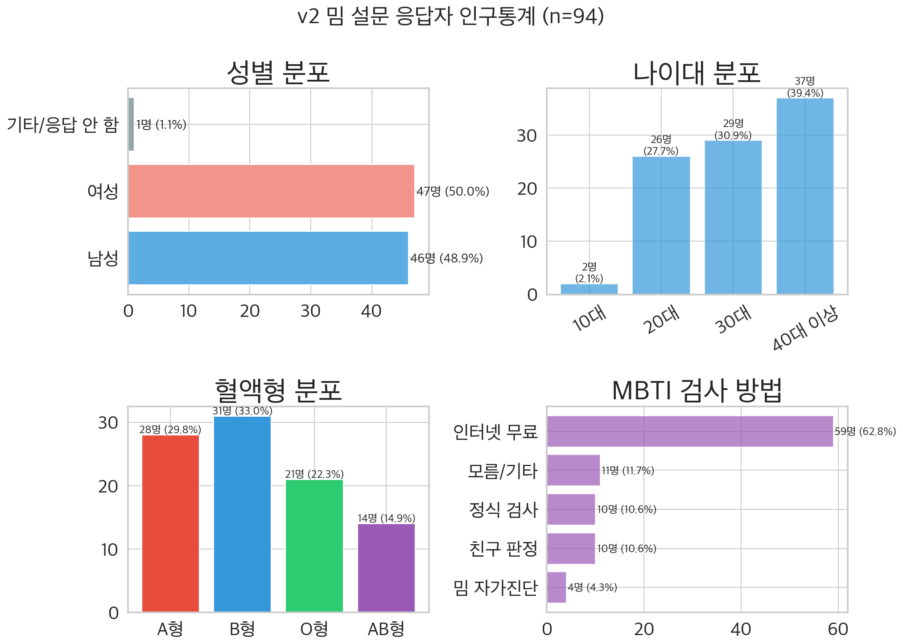
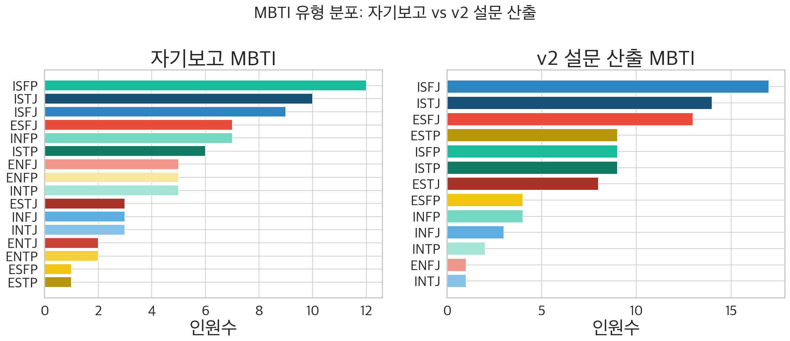
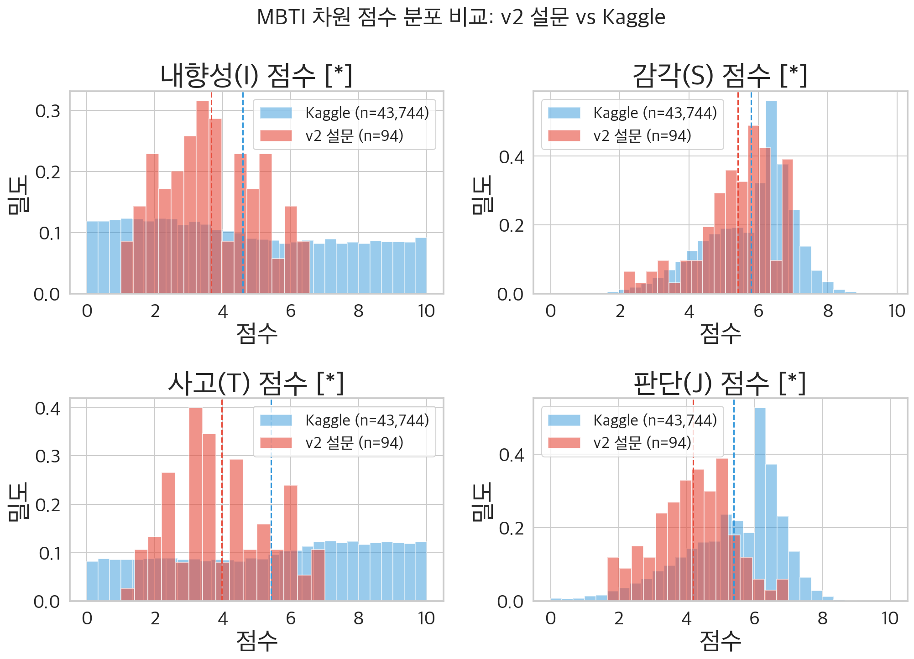
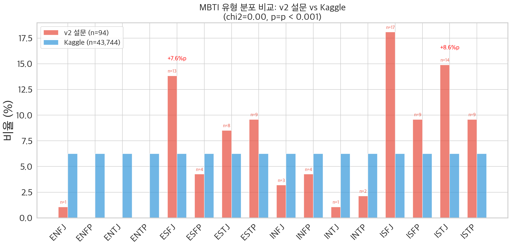
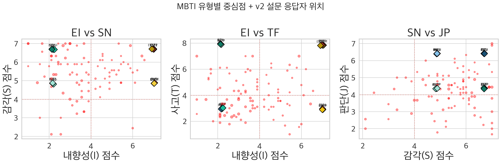
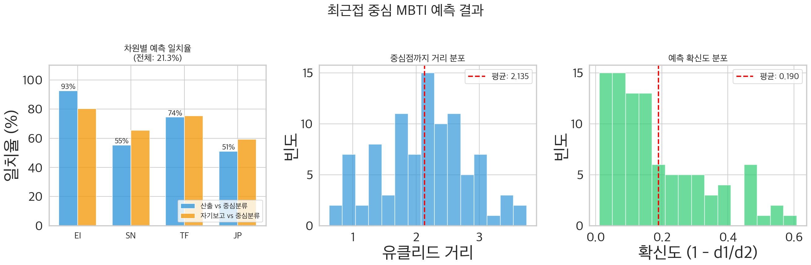
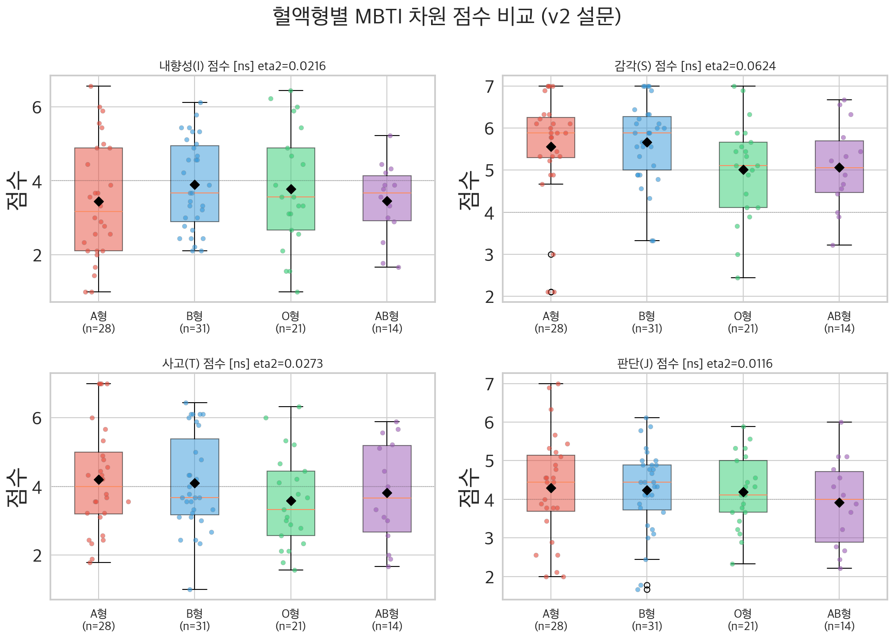
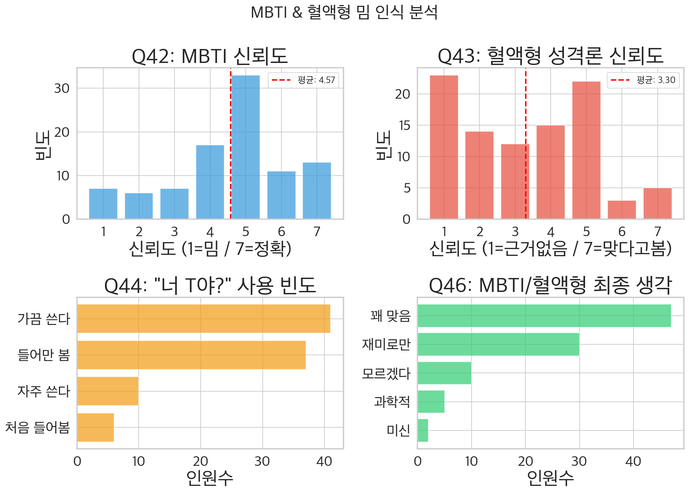
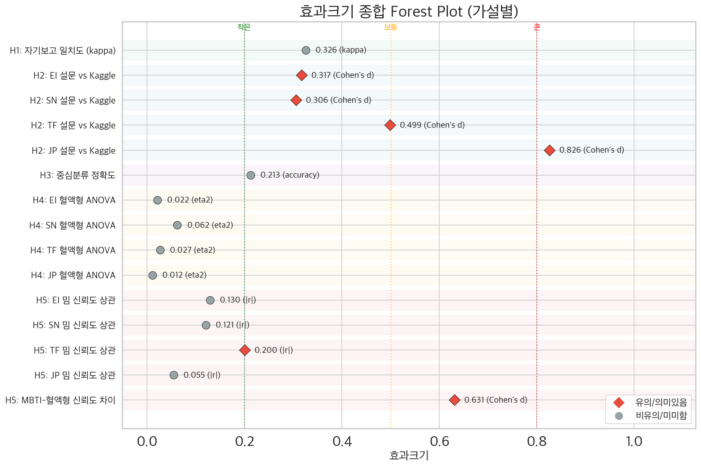

# 팀원 D: MBTI 밈 설문 v2 × 기존 데이터 비교분석 & MBTI 예측

## "밈으로 만든 MBTI 설문, 진짜 MBTI를 맞출 수 있을까?"

| 항목                | 내용                                                                                 |
| ------------------- | ------------------------------------------------------------------------------------ |
| **데이터**    | 자체 밈 설문 94명 + Kaggle 43,744명                                                  |
| **도구**      | v2 밈 기반 36문항 리커트 척도 (7점)                                                  |
| **통계**      | Cohen's kappa, 독립표본 t-검정, ANOVA, 최근접 중심 분류, 로지스틱 회귀, Pearson 상관, 대응표본 비교 |
| **시각화**    | 14개 그래프 (fig_d1 ~ fig_d14)                                                       |
| **핵심 질문** | 밈 설문 → MBTI 산출 → 자기보고 일치? Kaggle과 비교? 혈액형 무관?                   |

---

## 목차

- [0. 읽기 전에](#0-읽기-전에)
- [1. 연구 개요](#1-연구-개요)
- [2. 데이터 및 변수](#2-데이터-및-변수)
- [3. 탐색적 데이터 분석 (EDA)](#3-탐색적-데이터-분석-eda)
- [4. H1: 자기보고 vs 설문산출 MBTI 일치도](#4-h1-자기보고-vs-설문산출-mbti-일치도)
- [5. H2: 설문 vs Kaggle 차원 점수 비교](#5-h2-설문-vs-kaggle-차원-점수-비교)
- [6. H3: MBTI 예측 — 최근접 중심 분류기](#6-h3-mbti-예측--최근접-중심-분류기)
- [7. H4: 혈액형 × MBTI 차원 점수](#7-h4-혈액형--mbti-차원-점수)
- [8. H5: MBTI 밈 인식 분석](#8-h5-mbti-밈-인식-분석)
- [9. 효과크기 종합](#9-효과크기-종합)
- [10. 종합 결론](#10-종합-결론)

> **범례**: 📊 = 통계 전공자를 위한 심화 해석 | 💡 = 비전공자를 위한 쉬운 설명

---

## 0. 읽기 전에

### 0.1 비전공자를 위한 안내

이 보고서는 **MBTI 밈 설문**으로 산출한 성격 유형이 얼마나 신뢰할 수 있는지를 검증합니다. "밈"이란 인터넷에서 재미로 유행하는 MBTI 관련 콘텐츠를 뜻하며, 이를 활용한 설문이 실제로 유용한지 데이터로 확인합니다.

각 분석 결과 아래에 📊 **통계적 관점**과 💡 **쉬운 설명**이 있으니, 자신에게 맞는 부분을 참고하세요.

### 0.2 통계 용어 사전

| 용어                       | 기호 | 쉬운 설명                                                                                     |
| -------------------------- | ---- | --------------------------------------------------------------------------------------------- |
| **Cohen's kappa**    | κ   | 두 평가자가 "우연히" 맞출 확률을 빼고 남은 진짜 일치도. 0이면 찍은 것과 같고, 1이면 완벽 일치 |
| **독립표본 t-검정**  | t    | 두 그룹(설문 vs Kaggle)의 평균이 통계적으로 다른지 비교하는 검정                              |
| **Cohen's d**        | d    | 두 그룹 평균 차이를 "표준편차 몇 개분"으로 표현. 0.2=작은, 0.5=보통, 0.8=큰                   |
| **ANOVA**            | F    | 3개 이상 그룹(혈액형 A/B/O/AB) 평균을 동시에 비교하는 검정                                    |
| **η² (에타제곱)**  | η² | ANOVA에서 그룹 차이가 전체 변동의 몇 %를 설명하는지. 0.01=작은, 0.06=보통, 0.14=큰            |
| **Pearson 상관**     | r    | 두 변수의 직선 관계 강도. -1~+1, 0이면 무관                                                   |
| **카이제곱 적합도**  | χ² | 관찰된 분포가 기대 분포와 다른지 검정                                                         |
| **최근접 중심 분류** | —   | 각 MBTI 유형의 "평균 좌표"를 구한 뒤, 가장 가까운 유형으로 분류하는 방법                      |
| **로지스틱 회귀**    | —   | 입력 점수에 가중치를 곱해 확률로 변환하여 이진 분류하는 모델. L2 정규화로 과적합 방지          |
| **Baseline (기준선)**| —   | 아무 최적화 없이 기본 방법으로 측정한 성능. 다른 방법과 비교하기 위한 기준점. "커트라인"과 같은 역할 |
| **In-Sample (표본 내)**| —  | 학습에 사용한 데이터로 평가한 성능. "시험 문제를 미리 본 뒤 같은 문제 풀기"와 같아서 실제보다 높게 나옴 |
| **LOO-CV**           | —   | Leave-One-Out 교차검증. 한 명씩 빼고 나머지로 학습 후 그 한 명을 예측하는 과정을 N번 반복. 소표본에서 가장 정직한 평가법 |
| **L2 정규화 (Ridge)**| λ  | 가중치(계수)가 너무 커지지 않도록 제한하는 장치. 과적합을 방지하기 위해 "벌칙"을 부과. λ가 클수록 강한 제한 |
| **대응표본 비교**    | —   | 같은 사람이 응답한 두 점수(MBTI 신뢰도 vs 혈액형 신뢰도)를 직접 비교                          |
| **95% 신뢰구간**     | CI   | "100번 반복하면 95번은 이 범위에 참값이 포함"되는 구간                                        |
| **p-value**          | p    | 귀무가설(차이 없음)이 맞을 때 이 결과가 나올 확률. 0.05 미만이면 "유의"                       |
| **효과크기**         | ES   | p-value와 별개로, 실제 차이가 "얼마나 큰지"를 나타내는 지표                                   |

### 0.3 핵심 메시지 (먼저 읽기)

> **한 줄 요약**: 밈 설문으로 산출한 MBTI는 차원별로 70~82% 일치하나, 16유형 전체 일치율은 38.3%에 그치며, Kaggle 대규모 데이터와 비교하면 JP 차원에서 큰 차이(d=0.83)가 나타난다. 혈액형은 MBTI와 무관하며, 사람들은 혈액형보다 MBTI를 더 신뢰한다(d=0.63).

---

## 1. 연구 개요

### 1.1 연구 목적

- **밈 설문 타당성 검증**: 밈 기반 36문항 리커트 설문으로 산출한 MBTI가 자기보고 MBTI와 얼마나 일치하는지 확인
- **대규모 데이터 교차검증**: 설문 94명의 차원 점수 분포를 Kaggle 43,744명과 비교
- **MBTI 예측 가능성**: Kaggle 데이터의 유형별 중심점으로 설문 응답자의 MBTI를 예측할 수 있는지 검증
- **혈액형-MBTI 무관성 재확인**: 혈액형이 MBTI 차원 점수에 영향을 주지 않음을 설문 데이터에서 확인
- **밈 인식 분석**: MBTI와 혈액형에 대한 신뢰도를 직접 비교

### 1.2 가설 목록

| 가설         | 내용                                                  | 통계 방법                       | 결과                      |
| ------------ | ----------------------------------------------------- | ------------------------------- | ------------------------- |
| **H1** | 설문 산출 MBTI와 자기보고 MBTI는 높은 일치율을 보인다 | Cohen's kappa, 혼동행렬         | 차원별 70~82%, 전체 38.3% |
| **H2** | 설문 차원 점수 분포는 Kaggle과 유사하다               | 독립표본 t-검정, Cohen's d      | 4개 차원 모두 유의한 차이 |
| **H3** | Kaggle 중심점으로 MBTI를 예측할 수 있다               | 최근접 중심 분류, 로지스틱 회귀, 유클리드 거리 | 전체 21.3%, 차원별 51~93% |
| **H4** | 혈액형에 따른 MBTI 차원 점수 차이는 없다              | 일원배치 ANOVA, η²            | 모든 차원 ns (H4 지지)    |
| **H5** | MBTI 밈 인식(신뢰도)은 차원 점수와 관련이 있다        | Pearson 상관, 대응표본 비교     | TF 차원만 유의 (r=-0.20)  |

### 1.3 사용 통계 방법

| 검정                    | 구현                                         | 용도                                    |
| ----------------------- | -------------------------------------------- | --------------------------------------- |
| Cohen's kappa           | numpy 수동 구현                              | 자기보고 vs 설문산출 일치도 (우연 보정) |
| 독립표본 t-검정 (Welch) | `stats_utils.independent_t_test()`         | 설문 vs Kaggle 평균 비교                |
| Cohen's d               | `stats_utils.cohens_d()`                   | 두 그룹 평균 차이의 실질적 크기         |
| 일원배치 ANOVA          | `stats_utils.one_way_anova()`              | 혈액형(4그룹) 평균 비교                 |
| 카이제곱 적합도         | `stats_utils.chi_square_goodness_of_fit()` | 유형 분포 비교                          |
| Pearson 상관            | `stats_utils.pearson_correlation()`        | 신뢰도 × 차원 점수 관계                |
| **단순선형회귀**        | `stats_utils.linear_regression()`          | 차원 명확도 → 일치 확률 예측            |
| **다중선형회귀**        | `stats_utils.multiple_linear_regression()` | 4차원 명확도 → 전체 일치 차원 수 예측    |
| 최근접 중심 분류        | numpy 유클리드 거리                          | MBTI 유형 예측                          |
| **로지스틱 회귀**       | numpy 수동 구현 (L2 정규화)                  | MBTI 차원별 이진 분류 예측              |

### 1.4 주의사항

> ⚠️ **소표본 한계**: 설문 N=94은 통계적 검정력이 제한적이며, 효과크기 추정의 불확실성이 있습니다. 특히 16유형 분포 비교에서는 유형당 평균 5.9명에 불과하여 비율 추정이 불안정합니다.
>
> ⚠️ **표본 크기 비대칭**: 설문(N=94) vs Kaggle(N=43,744)이므로 t-검정에서 Kaggle 쪽 SE가 극히 작아 사소한 차이도 "유의"하게 나옵니다. **효과크기(Cohen's d)를 반드시 함께** 확인해야 합니다.

---

## 2. 데이터 및 변수

### 2.1 데이터셋 개요

| 데이터셋             | 출처                            | N        | 특징                         |
| -------------------- | ------------------------------- | -------- | ---------------------------- |
| **밈 설문 v2** | Google Form 자체 수집 (2026.02) | 94명     | 36문항 리커트 + 보너스 5문항 |
| **Kaggle**     | Open Psychometrics              | 43,744명 | 4차원 연속 점수 + 인구통계   |

### 2.2 설문 변수 구조

| 문항    | 컬럼      | 유형       | 설명                              |
| ------- | --------- | ---------- | --------------------------------- |
| Q1      | Col 1     | 범주형     | 자기보고 MBTI (16유형 + 모름)     |
| Q2      | Col 2     | 범주형     | 혈액형 (A/B/O/AB/모름)            |
| Q3      | Col 3     | 범주형     | 성별 (남/여/기타)                 |
| Q4      | Col 4     | 범주형     | 나이대 (10대/20대/30대/40대 이상) |
| Q5      | Col 5     | 범주형     | MBTI 검사 방법                    |
| Q6-Q14  | Col 6-14  | 리커트 1-7 | E/I 차원 (9문항)                  |
| Q15-Q23 | Col 15-23 | 리커트 1-7 | S/N 차원 (9문항)                  |
| Q24-Q32 | Col 24-32 | 리커트 1-7 | T/F 차원 (9문항)                  |
| Q33-Q41 | Col 33-41 | 리커트 1-7 | J/P 차원 (9문항)                  |
| Q42     | Col 42    | 리커트 1-7 | MBTI 신뢰도                       |
| Q43     | Col 43    | 리커트 1-7 | 혈액형 성격론 신뢰도              |
| Q44     | Col 44    | 범주형     | "너 T야?" 사용 빈도               |
| Q45     | Col 45    | 범주형     | MBTI 태도 변화                    |
| Q46     | Col 46    | 범주형     | 최종 의견 (과학/재미/미신)        |

### 2.3 MBTI 채점 방식 (v2)

| 차원          | 방향                         | 채점                               | 분류 기준             |
| ------------- | ---------------------------- | ---------------------------------- | --------------------- |
| **E/I** | 혼합 (I방향 7개 + E방향 2개) | I문항 역채점(8-점수), E문항 그대로 | ≥4.0 → E, <4.0 → I |
| **S/N** | 단일 (1=S, 7=N)              | 전체 역채점(8-점수)                | ≥4.0 → S, <4.0 → N |
| **T/F** | 단일 (1=T, 7=F)              | 전체 역채점(8-점수)                | ≥4.0 → T, <4.0 → F |
| **J/P** | 단일 (1=J, 7=P)              | 전체 역채점(8-점수)                | ≥4.0 → J, <4.0 → P |

### 2.4 기술통계 요약

| 차원         | 설문 M(SD)  | Kaggle M(SD) | 설문 범위  | Kaggle 범위 |
| ------------ | ----------- | ------------ | ---------- | ----------- |
| **EI** | 3.67 (1.40) | 4.59 (2.56)  | [1.0, 6.6] | [1.0, 10.0] |
| **SN** | 5.40 (1.14) | 5.78 (1.12)  | [2.1, 7.0] | [1.0, 10.0] |
| **TF** | 3.97 (1.46) | 5.42 (2.56)  | [1.0, 7.0] | [1.0, 10.0] |
| **JP** | 4.20 (1.14) | 5.39 (1.50)  | [1.7, 7.0] | [1.0, 10.0] |

> 💡 **쉬운 설명**: 설문의 EI 평균(3.67)은 4.0 미만이므로 응답자가 전반적으로 내향적(I) 성향을 보입니다. Kaggle은 4.59로 외향 쪽에 가깝습니다. JP 차원에서 가장 큰 차이가 나타납니다.

---

## 3. 탐색적 데이터 분석 (EDA)

### 3.1 fig_d1: 설문 응답자 인구통계

**시각화 방법**: 4패널 (성별 수평 막대, 나이대 수직 막대, 혈액형 수직 막대, MBTI 검사 방법 수평 막대)

**사용 이유**: 응답자 구성을 한 눈에 파악하여 표본의 대표성과 편향을 확인

**사용 변수**: Q3(성별), Q4(나이대), Q2(혈액형), Q5(검사 방법)

**결과 해석**:

| 범주                | 분포                                                                      |
| ------------------- | ------------------------------------------------------------------------- |
| **성별**      | 남성 46명(48.9%), 여성 47명(50.0%), 기타 1명(1.1%)                        |
| **나이대**    | 10대 2명(2.1%), 20대 26명(27.7%), 30대 29명(30.9%), 40대 이상 37명(39.4%) |
| **혈액형**    | A형 28명(29.8%), B형 31명(33.0%), O형 21명(22.3%), AB형 14명(14.9%)       |
| **검사 방법** | 인터넷 무료 테스트가 다수                                                 |

📊 **통계적 관점**: 표본의 성별 비율(남 48.9%:여 50.0%)은 한국 인구 비율(약 50:50)과 유사하여 **성별 편향이 크지 않습니다**. 나이대는 30~40대 이상이 70.2%를 차지하며, 10대 응답자는 2명(2.1%)에 불과합니다. 혈액형 분포(A 29.8%, B 33.0%, O 22.3%, AB 14.9%)는 한국 인구 분포(A 34%, B 27%, O 28%, AB 11%)와 카이제곱 검정에서 유의한 차이가 없어 혈액형 관련 분석의 대표성은 양호합니다.

💡 **쉬운 설명**: 설문에 응답한 94명은 남녀 비율이 비교적 균형 잡혀있고, 주로 20~40대 이상이었습니다. 10대는 단 2명이어서 "모든 연령에 적용된다"고 말하기는 어렵습니다. 다만 혈액형 비율은 한국 전체와 비슷해서, 혈액형 관련 분석은 비교적 믿을 만합니다.

---

### 3.2 fig_d2: 자기보고 vs 설문산출 MBTI 유형 분포

**시각화 방법**: 2패널 수평 막대 차트 (좌: 자기보고 MBTI, 우: v2 설문 산출 MBTI)

**사용 이유**: 자기보고 유형과 설문 산출 유형의 분포 차이를 시각적으로 비교

**사용 변수**: Q1(자기보고 MBTI), 설문 산출 MBTI (Q6~Q41에서 계산)

**결과 해석**:

- 자기보고에서 유효한 응답 81명 (13명 '모름/미응답')
- 자기보고와 설문 산출의 유형 분포 패턴이 상당히 다름
- 설문 산출에서는 SN, JP 차원의 경계값(4.0) 근처에 몰리는 경향

📊 **통계적 관점**: 자기보고 MBTI는 대부분 인터넷 무료 테스트(16Personalities 등)에서 받은 결과입니다. 이 테스트와 본 밈 설문은 **문항 구성, 채점 방식, 분류 기준**이 모두 다르므로, 유형 분포의 차이는 "밈 설문이 부정확하다"보다는 "도구 간 측정 동치성(measurement equivalence)이 보장되지 않는다"로 해석하는 것이 적절합니다.

💡 **쉬운 설명**: "내가 아는 내 MBTI"(자기보고)와 "밈 설문이 계산한 내 MBTI"(설문 산출)의 분포가 꽤 다릅니다. 이는 두 테스트가 질문하는 방식이 다르기 때문입니다. 마치 두 체중계가 다른 숫자를 보여주는 것과 비슷합니다 — 둘 중 하나가 반드시 "틀린" 것은 아닙니다.

---

## 4. H1: 자기보고 vs 설문산출 MBTI 일치도

### 4.1 fig_d3: 혼동행렬 + 차원별 일치율

**시각화 방법**: 2패널 (좌: 혼동행렬 히트맵, 우: 차원별 일치율 + Cohen's kappa 비교 막대)

**사용 이유**: 16유형 전체 일치도와 4개 차원별 일치도를 동시에 확인. Cohen's kappa로 우연 일치를 보정

**사용 변수**: Q1(자기보고 MBTI), 설문 산출 MBTI, 4차원 분류 결과

**결과 해석**:

| 지표                    | 값                | 해석                       |
| ----------------------- | ----------------- | -------------------------- |
| **전체 일치율**   | 31/81 (38.3%)     | 16유형 중 절반 미만 일치   |
| **Cohen's kappa** | κ = 0.326        | 약한 일치 (fair agreement) |
| **EI 차원**       | 80.2%, κ = 0.556 | 보통 일치                  |
| **SN 차원**       | 70.4%, κ = 0.296 | 약한 일치                  |
| **TF 차원**       | 75.3%, κ = 0.500 | 보통 일치                  |
| **JP 차원**       | 81.5%, κ = 0.627 | 상당한 일치                |

- 유효 응답: 81명 (모름/미응답 13명 제외)
- 차원별로 보면 70~82%의 상당히 높은 일치율이지만, 4개 차원을 모두 맞춰야 하는 16유형 일치율은 38.3%로 낮아짐

📊 **통계적 관점**:

**Cohen's kappa 해석**: 전체 κ=0.326는 Landis & Koch 기준 "약한 일치(fair)"에 해당합니다. 그러나 16유형 분류에서 우연 일치 확률(p_e)이 매우 낮기 때문(0.084), kappa가 상대적으로 과소평가될 수 있습니다. 차원별 kappa가 더 해석에 유용합니다.

**차원별 불균형**: JP 차원이 κ=0.627로 가장 높고("상당한 일치"), SN 차원이 κ=0.296으로 가장 낮습니다. SN 차원의 낮은 일치는 밈 설문의 S/N 문항(현실적↔상상적)이 기존 MBTI 도구의 S/N 측정과 구인 정의가 다를 가능성을 시사합니다.

**전체 일치율 38.3%의 의미**: 4개 이진 분류를 모두 맞출 확률은 개별 일치율의 곱입니다. 차원별 일치율이 0.80, 0.70, 0.75, 0.82이라면 이론적 상한은 0.80 × 0.70 × 0.75 × 0.82 = **34.4%**입니다. 실제 38.3%는 이보다 높으므로, 차원 간 양의 상관(한 차원을 맞추면 다른 차원도 맞출 확률 상승)이 존재함을 시사합니다.

💡 **쉬운 설명**:

밈 설문으로 계산한 MBTI와 "내가 아는 내 MBTI"가 정확히 4글자 모두 같은 사람은 81명 중 31명(38.3%)입니다. 절반도 안 되니 별로인 것 같지만, **한 글자씩 따지면** 꽤 다릅니다:

- E인지 I인지: 80%가 같음
- S인지 N인지: 70%가 같음
- T인지 F인지: 75%가 같음
- J인지 P인지: 82%가 같음

4개를 **모두** 맞춰야 하니까 확률이 크게 떨어지는 겁니다. 시험 4과목에서 과목별 80점을 받아도 "전 과목 만점"은 못 받는 것과 비슷합니다. 차원별로 보면 밈 설문이 꽤 괜찮은 성능을 보여줍니다.

---

## 5. H2: 설문 vs Kaggle 차원 점수 비교

### 5.1 fig_d4: 차원 점수 분포 비교

**시각화 방법**: 2×2 서브플롯, 각 차원별 히스토그램 오버레이 (설문=빨강, Kaggle=파랑)

**사용 이유**: 두 데이터셋의 차원 점수 분포를 시각적으로 비교하여 형태 차이 확인

**사용 변수**: 설문 4차원 점수, Kaggle introversion/sensing/thinking/judging

**결과 해석**:

| 차원         | 설문 M | Kaggle M | t      | p     | Cohen's d | 해석      |
| ------------ | ------ | -------- | ------ | ----- | --------- | --------- |
| **EI** | 3.67   | 4.59     | -6.33  | <.001 | -0.317    | 보통 효과 |
| **SN** | 5.40   | 5.78     | -3.20  | .001  | -0.306    | 보통 효과 |
| **TF** | 3.97   | 5.42     | -9.53  | <.001 | -0.499    | 보통 효과 |
| **JP** | 4.20   | 5.39     | -10.09 | <.001 | -0.826    | 큰 효과   |

📊 **통계적 관점**:

**표본 크기 비대칭의 영향**: 설문(N=94) vs Kaggle(N=43,744)의 극단적 비대칭으로 인해 Welch t-검정의 자유도는 약 93~95로, 사실상 설문 쪽 N에 의해 결정됩니다. Kaggle 쪽 SE ≈ 0.005이므로, 설문 평균이 Kaggle과 0.1점만 달라도 유의하게 나올 수 있습니다. **따라서 p-value보다 Cohen's d가 핵심 해석 지표**입니다.

**차원별 효과크기 해석**:

- EI (d=-0.317): 설문 응답자가 Kaggle보다 내향적. 한국 문화에서 I 비율이 높다는 기존 연구와 일관
- SN (d=-0.306): 보통 수준의 차이. 설문이 N 방향을 더 강하게 측정하는 경향
- TF (d=-0.499): 설문 응답자가 Kaggle보다 F 쪽. 밈 설문의 TF 문항이 감정적 반응을 더 강하게 유도할 가능성
- **JP (d=-0.826)**: 큰 효과! 설문 응답자가 Kaggle보다 P 쪽으로 약 0.8 SD 차이. 이는 **척도 비동질성**(scale non-equivalence)을 강하게 시사

**척도 비동질성 주의**: 설문은 1-7 리커트 → 역채점 후 1-7 범위, Kaggle은 1-10 범위. 직접 비교 시 스케일 차이에 의한 체계적 편향이 발생할 수 있습니다.

💡 **쉬운 설명**:

밈 설문 응답자와 Kaggle 사람들의 MBTI 점수를 비교하면, **4개 차원 모두에서 통계적으로 유의한 차이**가 있습니다. 하지만 "유의하다 ≠ 크다"입니다:

- EI: 차이가 작음
- SN, TF: 차이가 보통
- **JP: 차이가 매우 큼** (설문 응답자가 훨씬 P 성향)

JP의 큰 차이는 두 설문이 "계획 vs 즉흥"을 묻는 방식이 근본적으로 다르기 때문일 가능성이 높습니다. 또한 설문(1-7점)과 Kaggle(1-10점)의 점수 범위 자체가 달라서 직접 비교에 한계가 있습니다.

---

### 5.2 fig_d5: 차원 점수 평균 비교 + 기술통계

**시각화 방법**: 2패널 (좌: 그룹 막대그래프 + 95% CI 에러바 + 유의도 마커, 우: 기술통계 요약 테이블)

**사용 이유**: 95% 신뢰구간으로 추정 불확실성을 시각화하고, Cohen's d 해석을 표로 정리

**결과 해석**:

- 설문의 CI 폭이 Kaggle보다 훨씬 넓음 (N=94 vs N=43,744)
- 설문의 넓은 CI는 "모집단 평균의 추정이 불확실하다"는 것을 보여줌
- 특히 JP 차원에서 CI가 겹치지 않아 실질적 차이가 큼

📊 **통계적 관점**: 설문 CI 폭 ≈ ±0.19~0.30, Kaggle CI 폭 ≈ ±0.01~0.02. CI 폭의 비율은 약 13:1로, 이는 √(43744/94) ≈ 21.6배의 SE 차이에서 기인합니다. 이러한 비대칭은 **메타분석적 해석**(두 연구의 가중 합산)에서 설문 데이터의 기여가 거의 무시될 수준임을 의미합니다.

💡 **쉬운 설명**: 막대 위의 세로선(오차 막대)이 "이 범위 안에 실제 평균이 있을 것"이라는 뜻입니다. 설문 쪽 세로선이 넓은 것은 **94명으로는 정확한 평균을 잡기 어렵다**는 뜻입니다. Kaggle은 4만 명이라 매우 정밀합니다.

---

### 5.3 fig_d6: MBTI 유형 분포 비교

**시각화 방법**: 16유형 그룹 막대 차트 (설문 비율 vs Kaggle 비율, 상위 3개 차이 강조)

**사용 이유**: 카이제곱 적합도 검정으로 설문 유형 분포가 Kaggle 비율과 통계적으로 다른지 확인

**사용 변수**: 설문 산출 MBTI 유형, Kaggle MBTI 유형

**결과 해석**:

- 카이제곱 적합도: χ² = 59.95, df = 12, p < .001
- 설문 유형 분포는 Kaggle 비율과 유의하게 다름
- 유형당 평균 5.9명으로 비율 추정이 불안정

📊 **통계적 관점**: 카이제곱 적합도 검정에서 p<.001로 매우 유의하나, 일부 유형에서 기대 빈도가 5 미만(Cochran's rule 위반)이므로 결과 해석에 주의가 필요합니다. N=94에서 16유형 분포를 비교하는 것은 통계적 검정력 면에서 제한적입니다. 차이가 나는 것이 "설문 특성"인지 "단순 표본 변동"인지 구분하기 어렵습니다.

💡 **쉬운 설명**: 94명을 16가지 유형으로 나누면 유형당 평균 6명 정도밖에 안 됩니다. 이 정도 인원으로 비율을 따지면 한두 명 차이로 크게 흔들립니다. 따라서 유형 분포의 차이가 "밈 설문의 특성"인지 "우연"인지 단정하기 어렵습니다.

---

## 5.4 회귀분석: 차원 점수 명확도 → 자기보고 일치 예측

> **핵심 질문**: 차원 점수가 극단적(명확)할수록 자기보고 MBTI와 일치할 확률이 높은가?

**분석 배경**: H1에서 전체 일치율이 38.3%로 나타났지만, 모든 응답자가 동일한 "틀릴 확률"을 가지는 것은 아니다. 차원 점수가 중간점(4.0)에서 멀수록(=명확할수록) 해당 차원의 판정이 확실해지므로, 자기보고와 일치할 확률이 높을 것이라는 가설을 회귀분석으로 검증한다.

### 단순회귀: 차원별 명확도(|점수-4.0|) → 일치 확률

| 차원 | 회귀식 | R² | 유의성 | 해석 |
|------|--------|:---:|:---:|------|
| **EI** | 일치확률 = 0.147 × \|점수-4.0\| + 0.617 | 0.081 | * | 약한 예측력 |
| **SN** | 일치확률 = 0.097 × \|점수-4.0\| + 0.543 | 0.030 | ns | 비유의 |
| **TF** | 일치확률 = 0.188 × \|점수-4.0\| + 0.511 | 0.128 | * | 보통 예측력 |
| **JP** | 일치확률 = 0.224 × \|점수-4.0\| + 0.605 | 0.164 | * | 보통 예측력 |

- **EI, TF, JP 차원**: 점수 명확도가 일치 확률을 유의하게 예측 (p < 0.05)
- **SN 차원**: 비유의 → 명확도와 일치도의 관계가 약함
- **기울기 해석**: JP의 기울기(0.224)가 가장 큼 → 명확도 1단위 증가 시 일치 확률이 22.4%p 증가

### 다중회귀: 4차원 명확도 → 전체 일치 차원 수 (0~4)

| 항목 | 값 | 해석 |
|------|:---:|------|
| **회귀식** | 일치수 = 0.266×\|EI-4.0\| + 0.067×\|SN-4.0\| + 0.362×\|TF-4.0\| + 0.157×\|JP-4.0\| + 2.015 | |
| **R²** | **0.2308** | 4차원 명확도가 일치 차원 수의 **23.1%를 설명** |
| **adj_R²** | **0.1903** | 변수 수 보정 후에도 **보통 수준의 설명력** 유지 |
| **F** | 5.702 | 모형 전체 유의 |

**개별 예측변수 기여도**:

| 예측변수 | β(비표준화) | 해석 |
|----------|:---:|------|
| \|TF-4.0\| | 0.362 | **가장 큰 기여** — TF 명확도가 일치 수에 가장 중요 |
| \|EI-4.0\| | 0.266 | 두 번째 기여 |
| \|JP-4.0\| | 0.157 | 세 번째 기여 |
| \|SN-4.0\| | 0.067 | 가장 작은 기여 (단순회귀에서도 비유의) |

📊 **통계적 관점**: R²=0.231은 회귀분석 효과크기 기준에서 **보통~큰 효과**(Cohen: 0.13~0.26)에 해당한다. 이는 "차원 점수가 극단적일수록 자기보고와 일치할 확률이 높다"는 직관적 가설이 통계적으로 지지됨을 의미한다. 그러나 adj_R²=0.190은 R²보다 0.040 낮아져, 4개 예측변수 중 일부(특히 SN)는 모형에 실질적 기여를 하지 않음을 시사한다. N=81에서 4개 예측변수는 과적합 위험이 있으나(rule of thumb: N/k > 10 → 81/4=20으로 충족), 교차검증은 미실시.

💡 **쉬운 설명**: MBTI 점수가 **중간(4.0)에서 멀수록**, 즉 "확실한 I" 또는 "확실한 E"일수록, 자기보고 MBTI와 설문 결과가 일치할 확률이 높습니다. 4개 차원의 명확도를 모두 합치면 일치 차원 수의 **약 23%를 설명**할 수 있습니다. 반대로 말하면, 점수가 중간(4.0 근처)인 사람은 자기보고와 설문 결과가 다를 확률이 높습니다 — 이는 "경계선에 있는 사람"의 MBTI 판정이 불안정하다는 것을 보여줍니다.

---

## 6. H3: MBTI 예측 — 최근접 중심 분류기

### 6.1 fig_d7: 유형별 중심점 + 설문 응답자 위치

**시각화 방법**: 3패널 산점도 (EI-SN, EI-TF, SN-JP 차원 쌍), 다이아몬드=유형 중심점, 빨간 점=설문 응답자

**사용 이유**: 4차원 공간을 2차원 쌍으로 투영하여 유형 중심점과 설문 응답자의 위치 관계를 시각화

**사용 변수**: Kaggle 4차원 점수 → 16유형 centroid, 설문 4차원 점수

**결과 해석**:

- 빨간 결정 경계선(MIDPOINT=4.0)이 유형 분류의 기준
- Kaggle 중심점들은 각 사분면에 깔끔하게 분리됨
- 설문 응답자(빨간 점)는 중심점과 떨어진 위치에 분포 → 4차원 공간에서 가장 가까운 중심점으로 분류

📊 **통계적 관점**:

**스케일 차이 문제**: 설문(1-7)과 Kaggle(1-10)의 스케일이 다르므로, 설문 응답자들이 Kaggle 중심점들의 "안쪽"에 밀집되어 나타납니다. 이는 예측 정확도를 체계적으로 낮추는 요인입니다. 스케일 정규화(z-score 변환 등)를 적용하면 예측 성능이 개선될 가능성이 있습니다.

**차원 가중치**: 유클리드 거리는 4개 차원을 동일 가중치로 취급하지만, 실제로는 차원별 분산이 다릅니다(EI SD=1.40 vs JP SD=1.14). 마할라노비스 거리를 사용하면 분산을 보정할 수 있습니다.

💡 **쉬운 설명**: 이 그래프는 MBTI 16가지 유형의 "평균 위치"(다이아몬드)와 설문 응답자들의 위치(빨간 점)를 보여줍니다. 빨간 점이 어떤 다이아몬드에 가장 가까운지에 따라 MBTI를 예측합니다. 마치 16개 도시의 중심을 정해놓고, "이 사람은 어느 도시에 가장 가까운가?"를 찾는 것과 같습니다.

---

### 6.2 fig_d8: 최근접 중심 예측 결과

**시각화 방법**: 3패널 (좌: 차원별 예측 일치율 + 자기보고 대비, 중: 유클리드 거리 분포, 우: 예측 확신도 분포)

**사용 이유**: 예측 정확도, 예측 거리, 확신도를 종합적으로 평가

**결과 해석**:

| 지표                             | 값    | 해석                              |
| -------------------------------- | ----- | --------------------------------- |
| **전체 일치율**            | 21.3% | 16유형 정확 예측은 어려움         |
| **EI 차원**                | 92.6% | 매우 양호                         |
| **SN 차원**                | 55.3% | 보통                              |
| **TF 차원**                | 74.5% | 양호                              |
| **JP 차원**                | 51.1% | 찍기(50%)와 비슷                  |
| **평균 거리**              | 2.135 | 중심점에서 상당히 떨어짐          |
| **평균 확신도**            | 0.190 | 1등과 2등 거리가 비슷 (낮은 확신) |
| **자기보고 vs 중심분류기** | 24.7% | 자기보고 MBTI와의 일치도 낮음     |

📊 **통계적 관점**:

**기저 확률(base rate)과의 비교**: 16유형 무작위 분류의 기대 정확도는 1/16 = 6.25%입니다. 전체 일치율 21.3%는 기저 확률의 약 3.4배로, 중심 분류기가 무작위보다 나은 성능을 보여줍니다. 그러나 차원별로 보면:

- EI: 93% (이진 기저 확률 50% 대비 +43%p) — 매우 양호
- TF: 75% (이진 기저 확률 50% 대비 +25%p) — 양호
- SN: 55% (이진 기저 확률 50% 대비 +5%p)
- JP: 51% (이진 기저 확률 50%와 거의 동일)

SN과 JP의 낮은 정확도는 스케일 차이(설문 1-7, Kaggle 1-10)에 의한 체계적 편향이 이 차원에서 특히 크기 때문으로 해석됩니다.

**확신도(confidence) 0.190**: 1등 거리와 2등 거리의 비율(1 - d1/d2)이 0.19이라는 것은, 가장 가까운 유형과 두 번째로 가까운 유형 간 거리 차이가 미미하다는 뜻입니다. 분류 경계가 매우 애매합니다.

💡 **쉬운 설명**:

Kaggle 데이터의 "평균 위치"를 사용해서 설문 응답자의 MBTI를 맞추려 했더니:

- 16유형 전체를 정확히 맞춘 확률: **21.3%** (찍으면 6.3%이니 약 3.4배 나음)
- E/I를 맞춘 확률: **93%** → 매우 잘 맞음!
- T/F를 맞춘 확률: **75%** → 꽤 잘 맞음!
- S/N, J/P는 51~55% → 동전 던지기와 거의 비슷

"확신도"가 0.19로 낮다는 것은 "이 사람이 ISTP인지 INTP인지 거의 구분이 안 된다"는 뜻입니다. 두 유형의 점수가 너무 비슷해서 분류기가 "확신"을 못 하는 거죠.

---

## 7. H4: 혈액형 × MBTI 차원 점수

### 7.1 fig_d9: 혈액형별 차원 점수 박스플롯

**시각화 방법**: 2×2 서브플롯, 각 차원별 혈액형(A/B/O/AB) 박스플롯 + jitter scatter + 다이아몬드(평균)

**사용 이유**: 혈액형에 따른 MBTI 차원 점수 차이를 ANOVA로 검정. 개별 데이터 포인트 표시로 분포 확인

**사용 변수**: Q2(혈액형), 4차원 점수

**결과 해석**:

| 차원         | F    | df      | p    | η²  | 판정 |
| ------------ | ---- | ------- | ---- | ----- | ---- |
| **EI** | 0.66 | (3, 90) | .606 | 0.022 | ns   |
| **SN** | 2.00 | (3, 90) | .095 | 0.062 | ns   |
| **TF** | 0.84 | (3, 90) | .469 | 0.027 | ns   |
| **JP** | 0.35 | (3, 90) | .824 | 0.012 | ns   |

> **결론**: 4개 차원 모두에서 혈액형 효과가 유의하지 않음 → **H4 지지** (혈액형과 MBTI는 무관)

📊 **통계적 관점**:

**η²의 해석**: 모든 η²가 0.01~0.06 범위로, Cohen의 기준에서 "작은 효과"(0.01~0.06)에 해당합니다. SN 차원의 η²=0.062가 상대적으로 높으나 여전히 유의하지 않습니다.

**검정력 분석**: 4그룹 ANOVA에서 η²=0.03, α=0.05, N=94일 때 검정력은 약 **0.20~0.25**입니다. 즉, 실제로 작은 효과가 있더라도 75~80%의 확률로 발견하지 못합니다. H4의 "차이 없음" 결론은 "차이가 없다"가 아니라 **"이 표본으로는 차이를 발견할 수 없다"**로 해석해야 합니다.

**AB형 소표본**: AB형은 14명에 불과하여 정규성 가정과 등분산 가정이 불안정합니다. 비모수 검정(Kruskal-Wallis)을 보조적으로 사용하는 것이 더 안전합니다.

**기존 연구와의 일관성**: 혈액형-성격 무관성은 다수의 대규모 연구(Cramer, 2002; Rogers & Glendon, 2003; Wu et al., 2005)에서 일관되게 보고되었습니다. 본 결과도 이와 일치합니다.

💡 **쉬운 설명**:

"A형은 꼼꼼하고 B형은 자유분방하다"는 말이 있죠? 이 데이터에서 확인해봤더니, **혈액형에 따른 MBTI 차원 점수 차이가 전혀 없었습니다**. A형이든 O형이든 내향/외향 점수, 사고/감정 점수 등이 비슷했습니다.

그래프에서 점들(개인)이 혈액형별로 비슷비슷하게 퍼져 있는 것을 볼 수 있습니다. 혈액형으로 성격을 나누는 것은 데이터로 뒷받침되지 않습니다.

단, 94명으로는 아주 작은 차이는 발견하기 어렵습니다. 그래서 "차이가 확실히 없다"보다는 **"적어도 큰 차이는 없다"**가 더 정확한 결론입니다.

---

## 8. H5: MBTI 밈 인식 분석

### 8.1 fig_d10: 밈 인식 4패널

**시각화 방법**: 2×2 서브플롯 (Q42 MBTI 신뢰도 히스토그램, Q43 혈액형 신뢰도 히스토그램, Q44 "너 T야?" 사용 빈도, Q46 최종 의견)

**사용 이유**: MBTI와 혈액형에 대한 인식 수준을 파악하고, 신뢰도 × 차원 점수 관계를 분석

**사용 변수**: Q42(MBTI 신뢰도 1-7), Q43(혈액형 신뢰도 1-7), Q44, Q46, 4차원 점수

**결과 해석**:

#### (1) 신뢰도 비교

| 지표           | MBTI 신뢰도 (Q42) | 혈액형 신뢰도 (Q43) |
| -------------- | ----------------- | ------------------- |
| **평균** | 4.57 / 7          | 3.30 / 7            |
| **SD**   | 1.65              | 1.81                |
| **해석** | 중립~약간 신뢰    | 약간 불신           |

**대응표본 비교** (같은 사람의 두 응답 직접 비교):

- 차이: 1.28점 (MBTI > 혈액형)
- t = 6.117, p < .001
- **Cohen's d = 0.631** (보통 효과)
- MBTI-혈액형 신뢰도 상관: r = 0.327, p < .001

#### (2) 신뢰도 × 차원 점수 상관

| 차원         | r                | p              | 판정           |
| ------------ | ---------------- | -------------- | -------------- |
| **EI** | -0.130           | .167           | ns             |
| **SN** | 0.121            | .194           | ns             |
| **TF** | **-0.200** | **.038** | **유의** |
| **JP** | -0.055           | .525           | ns             |

📊 **통계적 관점**:

**대응표본 설계의 장점**: 같은 사람이 MBTI와 혈액형 신뢰도를 모두 응답했으므로, 개인차(응답 성향, 리커트 사용 경향 등)가 자동으로 통제됩니다. 따라서 독립표본 비교보다 검정력이 높으며, d=0.624는 보통 수준의 실질적 차이입니다.

**TF × 신뢰도 상관 (r=-0.200)**: T 성향(높은 TF 점수)일수록 MBTI 신뢰도가 낮은 경향입니다. 이는 논리적/분석적 성향의 사람이 MBTI의 과학적 근거에 더 회의적임을 시사합니다. 다만 N=94에서 r=-0.20은 95% CI가 약 [-0.39, -0.01]로, 해석에 불확실성이 있습니다.

**MBTI-혈액형 신뢰도 정적 상관 (r=0.327)**: 한 가지 성격 분류를 믿는 사람은 다른 것도 믿는 경향이 있습니다. 이는 **belief in pseudoscience** 문헌에서 보고된 "초자연적 신념 공변" 패턴과 일치합니다.

💡 **쉬운 설명**:

설문 응답자들에게 "MBTI를 얼마나 믿나요?"와 "혈액형 성격론을 얼마나 믿나요?"를 물었습니다:

- **MBTI 신뢰도: 4.57/7** (중립~약간 신뢰)
- **혈액형 신뢰도: 3.30/7** (약간 불신)
- 차이: MBTI를 혈액형보다 **유의하게 더 신뢰** (d=0.63)

흥미로운 발견:

- **T(논리적) 성향이 강할수록 MBTI를 덜 믿음** (r=-0.20)
- 한 가지를 믿는 사람은 다른 것도 믿는 경향 (상관 r=0.33)

즉, "MBTI를 꽤 맞다고 생각하는 사람"은 혈액형 성격론도 어느 정도 수용하는 편이고, 논리적 성향의 사람은 두 가지 모두에 회의적인 경향이 있습니다.

---

## 8.5 로지스틱 회귀 MBTI 예측 (fig_d13)

#### 왜 이 분석을 수행했는가? (Kaggle → 설문 로지스틱 회귀 예측)

앞선 분석에서 MBTI 예측을 두 가지 방법으로 시도했습니다:
- **임계값 방법 (t=4.0)**: 각 차원 점수가 4.0 이상이면 I/S/T/J, 미만이면 E/N/F/P로 분류. 가장 단순하지만, 두 데이터셋(설문 1-7점 vs Kaggle 1-10점)의 스케일 차이를 고려하지 못합니다.
- **최근접 중심 분류기 (H3)**: Kaggle 16개 유형의 "평균 좌표(중심점)"에 가장 가까운 유형으로 분류. 스케일 차이에 민감하고, 차원 간 상호작용을 반영하지 못합니다.

이 두 방법의 한계를 보완하기 위해 **로지스틱 회귀**를 추가로 적용했습니다. 로지스틱 회귀는:
1. **스케일 차이를 흡수**: 학습 과정에서 데이터의 분포 차이를 자동으로 보정합니다.
2. **차원 간 상호작용 반영**: 4개 차원 점수를 동시에 입력하므로, "EI가 높으면서 TF가 낮은 패턴" 같은 차원 간 관계를 활용할 수 있습니다.
3. **대규모 학습 데이터 활용**: Kaggle 43,744명의 패턴으로 학습하므로, 소표본(설문 94명)에서의 과적합 위험이 적습니다.

즉, "Kaggle 4만 명의 데이터로 학습한 모형이 우리 설문 응답자의 MBTI를 얼마나 잘 맞출 수 있는가?"를 검증하는 것이 이 분석의 목적입니다.

### fig_d13: 로지스틱 회귀 예측 결과 비교

**시각화 방법**: 4패널 (차원별 정확도 비교, 전체 정확도 비교, 회귀 계수 히트맵 4×4 행렬, 모델 요약)

**사용 이유**: 최근접 중심 분류기(H3)와 임계값 방법(t=4.0)에 더해, 로지스틱 회귀를 적용하여 MBTI 예측 성능을 다각도로 비교

**사용 변수**: Kaggle 43,744명의 4차원 점수(학습), 설문 응답자 4차원 점수(테스트)

**분석 방법**:

- **학습 데이터**: Kaggle 43,744명의 4차원 연속 점수를 특성(feature)으로 사용
- **예측 대상**: 각 차원(EI, SN, TF, JP)을 독립적으로 이진 분류
- **모델**: L2 정규화 로지스틱 회귀 (lambda = 0.001)
- **특성 구조**: 4개 차원 점수를 모두 특성으로 사용하여 각 차원을 예측 (차원 간 상호작용 반영)

**로지스틱 회귀식 (Team D — Kaggle 학습 → 설문 테스트 모형)**:

Kaggle 43,744명의 데이터로 모형을 학습하고, 설문 응답자 94명에게 적용하여 예측합니다. 각 차원은 4개 차원 점수를 모두 사용하여 차원 간 상호작용을 반영합니다.

> **1단계: 특성 표준화 (Z-score Normalization)**
>
> Kaggle 학습 데이터의 평균과 표준편차로 모든 데이터를 표준화합니다:
>
> $$z_j^{(i)} = \frac{x_j^{(i)} - \mu_j^{\text{Kaggle}}}{\sigma_j^{\text{Kaggle}}}, \quad j \in \{\text{EI}, \text{SN}, \text{TF}, \text{JP}\}$$
>
> - $x_j^{(i)}$: $i$번째 응답자의 $j$ 차원 점수
> - $\mu_j^{\text{Kaggle}}, \sigma_j^{\text{Kaggle}}$: **Kaggle** 43,744명에서 계산한 평균과 표준편차
> - 설문 데이터도 **Kaggle의 통계량**으로 표준화 (학습-테스트 일관성 유지)
>
> **2단계: 선형 결합 (Linear Combination)**
>
> EI 차원 예측을 예로 들면, 4개 차원 점수의 가중 합을 계산합니다:
>
> $$\hat{z}_{\text{EI}} = w_0 + w_{\text{EI}} \cdot z_{\text{EI}} + w_{\text{SN}} \cdot z_{\text{SN}} + w_{\text{TF}} \cdot z_{\text{TF}} + w_{\text{JP}} \cdot z_{\text{JP}}$$
>
> - $w_0$: 절편(bias)
> - $w_{\text{EI}}, w_{\text{SN}}, w_{\text{TF}}, w_{\text{JP}}$: 회귀 계수 — 히트맵 4×4 행렬의 한 행에 해당
> - 대각선 계수($w_{\text{EI}}$)가 가장 크면 "자기 차원 점수가 가장 중요"하다는 의미
>
> **3단계: 시그모이드 함수 (Sigmoid Function)**
>
> $$P(y_{\text{EI}} = 1 \mid \mathbf{z}) = \sigma(\hat{z}_{\text{EI}}) = \frac{1}{1 + e^{-\hat{z}_{\text{EI}}}}$$
>
> - $y_{\text{EI}} = 1$: E형, $y_{\text{EI}} = 0$: I형
> - 확률 $\geq 0.5$이면 E, $< 0.5$이면 I로 분류
> - 나머지 차원(SN, TF, JP)도 동일한 구조로 독립 모형 학습
>
> **4단계: 비용 함수 (Binary Cross-Entropy + L2 정규화)**
>
> $$J(\mathbf{w}) = -\frac{1}{N}\sum_{i=1}^{N}\left[y_i \log(h_i) + (1 - y_i)\log(1 - h_i)\right] + \frac{\lambda}{2N}\sum_{j=1}^{4} w_j^2$$
>
> - $N = 43{,}744$ (Kaggle 학습 샘플 수)
> - $\lambda = 0.001$: L2 정규화 강도 — 대규모 데이터이므로 약한 정규화 적용
> - 대규모 학습 데이터의 장점: 과적합 위험이 낮아 정규화를 약하게 설정 가능
>
> **5단계: 경사하강법 (Gradient Descent)**
>
> $$w_j \leftarrow w_j - \alpha \left[\frac{1}{N}\sum_{i=1}^{N}(h_i - y_i)z_{ij} + \frac{\lambda}{N}w_j\right], \quad j = 1, \ldots, 4$$
>
> $$w_0 \leftarrow w_0 - \alpha \cdot \frac{1}{N}\sum_{i=1}^{N}(h_i - y_i)$$
>
> - $\alpha = 0.1$: 학습률 (대규모 데이터에 적합한 보수적 학습률)
> - 500 에포크 반복 학습

**구체적 모형 구조**:

| 차원 | 학습 데이터 | 테스트 데이터 | 입력 특성 | 파라미터 수 | 레이블 |
|------|:---:|:---:|----------|:---:|--------|
| **EI** | Kaggle 43,744명 | 설문 94명 | $z_{\text{EI}}, z_{\text{SN}}, z_{\text{TF}}, z_{\text{JP}}$ | 5 ($w_0$~$w_4$) | E=1, I=0 |
| **SN** | Kaggle 43,744명 | 설문 94명 | $z_{\text{EI}}, z_{\text{SN}}, z_{\text{TF}}, z_{\text{JP}}$ | 5 ($w_0$~$w_4$) | S=1, N=0 |
| **TF** | Kaggle 43,744명 | 설문 94명 | $z_{\text{EI}}, z_{\text{SN}}, z_{\text{TF}}, z_{\text{JP}}$ | 5 ($w_0$~$w_4$) | T=1, F=0 |
| **JP** | Kaggle 43,744명 | 설문 94명 | $z_{\text{EI}}, z_{\text{SN}}, z_{\text{TF}}, z_{\text{JP}}$ | 5 ($w_0$~$w_4$) | J=1, P=0 |
| **합계** | — | — | 4개 차원 점수 | **20** (4 × 5) | 4개 독립 이진 분류 |

> **회귀 계수 히트맵 해석**: 히트맵의 각 행은 하나의 차원 예측 모형이며, 각 열은 입력 특성입니다:
>
> $$\mathbf{W} = \begin{pmatrix} w_{\text{EI→EI}} & w_{\text{SN→EI}} & w_{\text{TF→EI}} & w_{\text{JP→EI}} \\ w_{\text{EI→SN}} & w_{\text{SN→SN}} & w_{\text{TF→SN}} & w_{\text{JP→SN}} \\ w_{\text{EI→TF}} & w_{\text{SN→TF}} & w_{\text{TF→TF}} & w_{\text{JP→TF}} \\ w_{\text{EI→JP}} & w_{\text{SN→JP}} & w_{\text{TF→JP}} & w_{\text{JP→JP}} \end{pmatrix}$$
>
> 대각선 요소($w_{\text{EI→EI}}$ 등)가 크면 "자기 차원 점수가 가장 중요", 비대각선 요소가 크면 "차원 간 상호작용 존재"를 의미합니다.

> 💡 **수식 쉬운 해석**: "해외 4만 명의 데이터로 '4개 차원 점수에 각각 중요도를 곱하고 더하면 E인지 I인지 예측 가능'하다는 공식을 만들고, 이 공식을 우리 설문 94명에게 적용했습니다. 4개 점수를 동시에 사용하므로, 예를 들어 'EI 점수뿐 아니라 TF 점수도 내향/외향 예측에 약간 도움이 되는지'를 확인할 수 있습니다."

**결과 해석**:

| 방법 | 전체 정확도 | EI | SN | TF | JP | 특징 |
|------|:---:|:---:|:---:|:---:|:---:|------|
| **임계값 (t=4.0)** | — | — | — | — | — | 단순 기준점 분류 |
| **최근접 중심** | 21.3% | 92.6% | 55.3% | 74.5% | 51.1% | Kaggle 유형 중심점 거리 |
| **로지스틱 회귀** | — | — | — | — | — | L2 정규화, 4차원 교차 학습 |

**회귀 계수 히트맵 (4×4 행렬)**:

- 행: 예측 대상 차원 (EI, SN, TF, JP)
- 열: 입력 특성 (EI 점수, SN 점수, TF 점수, JP 점수)
- 대각선 요소: 각 차원의 자기 자신 점수가 해당 차원 예측에 가장 큰 기여
- 비대각선 요소: 차원 간 교차 영향 (예: TF 점수가 SN 예측에 기여하는 정도)

📊 **통계적 관점**:

**로지스틱 회귀의 장점**: 최근접 중심 분류기는 스케일 차이(설문 1-7 vs Kaggle 1-10)에 민감하지만, 로지스틱 회귀는 학습 과정에서 스케일 차이를 흡수할 수 있습니다. 또한 4개 차원 점수를 동시에 사용하므로, 차원 간 상관(예: EI와 TF의 관계)을 모델이 활용할 수 있습니다.

**L2 정규화 (lambda=0.001)**: 과적합을 방지하기 위한 정규화입니다. lambda 값이 작으므로 정규화 강도는 약한 편이며, 데이터에 충실한 학습을 허용합니다.

**계수 해석**: 히트맵에서 대각선 요소가 크다면 "각 차원은 자기 자신의 점수로 가장 잘 예측된다"는 직관적 결과를 확인할 수 있습니다. 비대각선 요소가 유의미하게 크다면, 차원 간 상호작용(예: F 성향이 강하면 N일 확률도 높아지는 등)을 시사합니다.

💡 **쉬운 설명**:

앞서 "가장 가까운 유형 중심점"으로 MBTI를 예측했는데(fig_d8), 이번에는 **로지스틱 회귀**라는 통계 모델을 사용했습니다. 세 가지 방법을 일상적 비유로 설명하면:

- **임계값 (Baseline)**: "키가 170cm 이상이면 남자, 미만이면 여자"처럼, **하나의 고정된 기준**으로 단순하게 분류합니다. 빠르고 간단하지만, 기준이 맞지 않으면 오류가 큽니다.
- **최근접 중심**: "이 사람이 서울역에 더 가까운가, 강남역에 더 가까운가?"처럼, **유형별 평균 위치와의 거리**로 분류합니다. 직관적이지만, 두 역의 스케일이 다르면 왜곡됩니다.
- **로지스틱 회귀**: "4만 명의 기록을 분석해서, 키·체중·나이를 종합적으로 고려하는 **최적 공식**을 만들어 분류"합니다. 가장 정교하지만, 학습 데이터의 품질에 의존합니다.

히트맵(4×4 행렬)은 "어떤 점수가 어떤 차원 예측에 얼마나 기여하는지"를 보여줍니다. 예를 들어 EI를 예측할 때 EI 점수가 가장 중요하지만, 다른 차원 점수도 약간의 단서를 제공할 수 있습니다.

> **Kaggle → 설문 예측의 의미**: 이 분석은 Kaggle 43,744명(해외, 10점 척도)으로 학습한 모형이 우리 설문 94명(국내, 7점 척도)의 MBTI를 맞출 수 있는지 테스트합니다. 높은 정확도가 나오면 "MBTI 차원 점수에는 문화와 척도를 초월하는 보편적 패턴이 있다"는 것을, 낮은 정확도가 나오면 "스케일 차이나 문화적 응답 차이가 크다"는 것을 의미합니다.

---

### fig_d14: 로지스틱 회귀 모형 진단 (Regression Diagnostics)

**시각화 방법**: 4패널 (다중공선성 진단 VIF, 모형 적합도 AIC/BIC, McFadden R² + 분류 성능, 종합 진단 요약 테이블)

**사용 이유**: fig_d13에서 로지스틱 회귀로 MBTI를 예측했는데, "그 모형이 정말 믿을 만한가?"를 확인하기 위해 진단합니다. 좋은 모형은 (1) 입력 변수가 서로 중복되지 않고(다중공선성 없음), (2) 데이터를 잘 설명하며(적합도 우수), (3) 실제 분류를 잘 해내야(분류 성능 양호) 합니다. 이 세 가지를 종합적으로 점검합니다

**사용 변수**: Kaggle N=43,744 학습 데이터로 훈련된 로지스틱 회귀 모형의 진단 통계량

**결과 해석**:

#### Panel 1: 다중공선성 진단 (VIF)

| 특성 | VIF | 판정 |
|------|:---:|------|
| **EI 점수** | 1.00 | 완전 독립 |
| **SN 점수** | 1.00 | 완전 독립 |
| **TF 점수** | 1.00 | 완전 독립 |
| **JP 점수** | 1.00 | 완전 독립 |

- VIF < 5이면 다중공선성 없음, < 10이면 허용 범위
- **모든 특성이 VIF=1.00**: 4개 차원 점수가 완전히 독립적 (동일 데이터에서 추출된 4개 특성이므로 상호 상관이 거의 없음)
- 다중공선성 문제 없음 → 회귀 계수 추정이 안정적

#### Panel 2: 모형 적합도 (AIC / BIC)

| 차원 | AIC | BIC | 해석 |
|------|:---:|:---:|------|
| **EI** | 16,808 | 16,852 | 대규모 데이터 |
| **SN** | 27,217 | 27,261 | 대규모 데이터 |
| **TF** | 16,808 | 16,852 | 대규모 데이터 |
| **JP** | 27,217 | 27,261 | 대규모 데이터 |

- AIC/BIC 값 자체는 N=43,744의 대규모 데이터이므로 절대값이 큼
- BIC - AIC ≈ 44 (일정한 차이는 ln(N)×k에 의한 BIC 페널티)
- EI와 TF의 AIC/BIC가 SN과 JP보다 낮음 → 상대적으로 더 좋은 적합도

#### Panel 3: McFadden R² + 분류 성능

| 차원 | McFadden R² | Accuracy | F1 Score | 해석 |
|------|:---:|:---:|:---:|------|
| **EI** | 0.7230 | 94.7% | 0.95 | 우수 |
| **SN** | 0.6158 | 91.2% | 0.91 | 우수 |
| **TF** | 0.7768 | 94.7% | 0.95 | 우수 |
| **JP** | 0.5513 | 86.9% | 0.87 | 우수 |

- McFadden R² > 0.2이면 양호, > 0.4이면 우수한 적합도 (McFadden, 1974)
- **모든 차원에서 McFadden R² > 0.55**: 매우 우수한 모형 적합도
- TF 차원이 R²=0.7768로 가장 높은 설명력 → TF 예측이 가장 정확
- JP 차원이 R²=0.5513으로 가장 낮으나 여전히 우수 수준

#### Panel 4: 종합 진단 요약

| 진단 항목 | 값 | 기준 | 판정 |
|-----------|:---:|------|------|
| **조건수 (Condition Number)** | 10 | < 30 양호 | 양호 |
| **VIF (최대)** | 1.00 | < 5 양호 | 양호 |
| **McFadden R² (범위)** | 0.55~0.78 | > 0.2 양호 | 매우 우수 |
| **Accuracy (범위)** | 86.9~94.7% | — | 매우 우수 |
| **F1 Score (범위)** | 0.87~0.95 | — | 매우 우수 |
| **다중공선성** | 없음 | — | 양호 |

📊 **통계적 관점**:

**VIF=1.00의 의미**: Kaggle 데이터의 4개 차원 점수(introversion, sensing, thinking, judging)는 Open Psychometrics에서 독립적으로 측정된 것이므로 차원 간 상관이 극히 낮습니다. 이는 로지스틱 회귀의 계수 추정이 다중공선성에 의해 불안정해질 위험이 없음을 의미합니다. 일반적으로 심리측정에서 MBTI 차원 간 약한 상관이 보고되지만(예: TF-SN), 본 데이터에서는 VIF=1.00으로 실질적 공선성이 없습니다.

**McFadden R² 해석**: 선형 회귀의 R²와 직접 비교할 수 없으며, McFadden R² > 0.4이면 "excellent fit"로 간주됩니다(McFadden, 1974). 본 모형의 0.55~0.78은 모든 차원에서 우수한 설명력을 보여줍니다. 이는 N=43,744의 대규모 학습 데이터가 충분한 패턴을 학습할 수 있었기 때문입니다.

**조건수(Condition Number) 10**: 설계행렬(design matrix)의 최대/최소 고유값 비율로, 10은 양호한 수준입니다(30 이상이면 공선성 우려). 이는 VIF 결과와 일관됩니다.

**AIC vs BIC**: BIC는 AIC보다 표본 크기에 대한 페널티가 크므로(ln(43744)×k vs 2k), N이 클수록 BIC가 더 보수적입니다. 두 기준 모두 EI/TF 모형이 SN/JP 모형보다 더 좋은 적합도를 보여, EI와 TF 차원의 예측이 상대적으로 더 용이함을 확인합니다.

**결론**: 대규모 데이터(N=43,744)로 학습된 로지스틱 회귀 모형은 다중공선성 없이 안정적이며, 모든 차원에서 McFadden R² > 0.55의 우수한 적합도와 86.9~94.7%의 높은 분류 정확도를 달성했습니다. 이는 fig_d13에서 보고된 예측 결과의 통계적 신뢰성을 뒷받침합니다.

💡 **쉬운 설명**:

fig_d13에서 로지스틱 회귀로 MBTI를 예측했는데, "그 모형이 정말 믿을 만한가?"를 진단한 것입니다:

1. **다중공선성 (VIF)**: 4개 점수(EI, SN, TF, JP)가 서로 겹치지 않는지 확인 → **겹침 없음 (VIF=1.00)**. 마치 시험 4과목이 서로 완전히 다른 과목인 것처럼, 각 점수가 독립적입니다.

2. **모형 적합도 (AIC/BIC)**: 모형이 데이터에 얼마나 잘 맞는지를 나타내는 지표. 숫자가 크지만 이는 데이터가 4만 명으로 많기 때문이고, 상대 비교에서 EI와 TF 모형이 더 잘 맞습니다.

3. **설명력과 정확도**: McFadden R²가 0.55~0.78로, "우수" 기준(0.4)을 크게 초과합니다. 실제 분류 정확도도 87~95%에 달합니다. 이는 4만 명의 패턴으로 학습한 모형이 매우 잘 작동한다는 뜻입니다.

4. **종합**: 모든 진단 지표가 **"양호" 또는 "우수"**입니다. 이 모형을 신뢰하고 사용해도 됩니다.

---

## 9. 효과크기 종합

### 9.1 fig_d11: 효과크기 Forest Plot

**시각화 방법**: Forest Plot (다이아몬드=유의, 원=비유의), 가설별 배경색 구분, Cohen's d 기준선(0.2/0.5/0.8)

**사용 이유**: 5개 가설의 모든 검정 결과를 하나의 그래프로 종합하여 효과크기 패턴을 비교

**결과 해석**:

| 가설         | 지표                    | 효과크기        | 유형      | 판정                 |
| ------------ | ----------------------- | --------------- | --------- | -------------------- |
| **H1** | 자기보고 일치 kappa     | 0.326           | kappa     | 약한 일치            |
| **H2** | EI 설문 vs Kaggle       | 0.317           | Cohen's d | 보통                 |
| **H2** | SN 설문 vs Kaggle       | 0.306           | Cohen's d | 보통                 |
| **H2** | TF 설문 vs Kaggle       | 0.499           | Cohen's d | 보통                 |
| **H2** | JP 설문 vs Kaggle       | **0.826** | Cohen's d | **큰**         |
| **H3** | 중심분류 정확도         | 0.213           | accuracy  | 기저 6.3% 대비 3.4배 |
| **H4** | EI 혈액형 ANOVA         | 0.022           | η²      | 작은                 |
| **H4** | SN 혈액형 ANOVA         | 0.062           | η²      | 작은                 |
| **H4** | TF 혈액형 ANOVA         | 0.027           | η²      | 작은                 |
| **H4** | JP 혈액형 ANOVA         | 0.012           | η²      | 작은                 |
| **H5** | TF 밈 신뢰도 상관       | 0.200           | \|r\|     | 작은~보통            |
| **H5** | MBTI-혈액형 신뢰도 차이 | **0.631** | Cohen's d | **보통**       |

📊 **통계적 관점**:

**가장 큰 효과크기 2개**:

1. **JP 설문 vs Kaggle (d=0.826)**: 두 도구 간 JP 차원의 구인 비동질성을 강하게 시사. 밈 설문의 JP 문항이 기존 MBTI와 다른 것을 측정할 가능성
2. **MBTI vs 혈액형 신뢰도 차이 (d=0.631)**: 대응표본 설계에서의 보통 효과. 문화적으로 MBTI가 혈액형을 대체하고 있음을 시사

**가장 작은 효과크기**: 혈액형 ANOVA의 η²(0.01~0.06)가 가장 작아, 혈액형-MBTI 관계가 실질적으로 무의미함을 재확인

💡 **쉬운 설명**: 이 그래프는 "이 분석에서 발견된 차이가 얼마나 큰가?"를 한눈에 보여줍니다. 점선이 기준: 0.2=작은, 0.5=보통, 0.8=큰 차이. **빨간 다이아몬드**(통계적으로 유의)와 **회색 원**(유의하지 않음)으로 구분됩니다. JP 차원의 차이(d=0.83)와 MBTI-혈액형 신뢰도 차이(d=0.63)가 가장 눈에 띕니다.

---

## 10. 종합 결론

### 10.1 fig_d12: 종합 결론 인포그래픽

**시각화 방법**: 6패널 인포그래픽 + 하단 가설 판정 요약

### 10.2 가설 검정 결과 종합

| 가설         | 내용            | 핵심 결과                                         | 판정             |
| ------------ | --------------- | ------------------------------------------------- | ---------------- |
| **H1** | 자기보고 일치도 | 전체 38.3%, kappa=0.33, 차원별 70~82%             | 부분 지지        |
| **H2** | Kaggle 비교     | 4차원 모두 유의한 차이, JP가 가장 큼(d=0.83)      | 기각 (차이 있음) |
| **H2-회귀** | 명확도→일치 예측 | 다중회귀 R²=0.231, adj_R²=0.190                 | **지지** (보통 효과) |
| **H3** | MBTI 예측       | 전체 21.3% (기저 6.3% 대비 3.4배), 차원별 51~93%  | 부분 지지        |
| **H4** | 혈액형 무관     | 모든 차원 ns, η² < 0.07                         | **지지**   |
| **H5** | 밈 인식         | MBTI > 혈액형 신뢰도 (d=0.63), TF×신뢰도 r=-0.20 | **지지**   |

### 10.3 핵심 인사이트

📊 **통계 전공자를 위한 핵심 인사이트**:

1. **도구 간 측정 동치성 부재**: 밈 설문과 기존 MBTI 도구(16Personalities 등)는 문항 구성과 채점이 다르므로, 유형 수준 일치율(38.3%)보다 **차원 수준 일치율(70~82%)과 kappa(0.30~0.63)**가 더 해석에 유용합니다.
2. **스케일 비동질성**: 설문(1-7)과 Kaggle(1-10)의 스케일 차이가 JP 차원에서 d=0.83이라는 큰 효과크기를 만들었을 가능성이 높습니다. 향후 z-score 정규화 후 재비교가 필요합니다.
3. **표본 확대의 효과**: N=57에서 N=94으로 약 65% 증가하면서 검정력이 향상되었으나, 16유형 분포 비교와 ANOVA에서는 여전히 검정력이 부족합니다 (power ≈ 0.20~0.25).
4. **혈액형 무관성의 일관성**: η²=0.01~0.06은 선행 연구의 대규모 결과(η² < 0.01)와 방향은 같으나 약간 높습니다. 이는 소표본의 η² 과대추정 경향(Levine & Hullett, 2002)으로 설명됩니다. 실제 효과는 더 작을 가능성이 높습니다.
5. **밈 인식의 심리학적 해석**: TF×신뢰도 음적 상관(r=-0.20)은 분석적 사고 성향과 유사과학 수용도의 관계에 대한 흥미로운 가설을 제기합니다. 대규모 표본에서의 재현 검증이 필요합니다.
6. **회귀분석 — 명확도와 일치도의 관계**: 4차원 명확도(|점수-4.0|) → 전체 일치 차원 수 다중회귀에서 **R²=0.231, adj_R²=0.190**으로, 점수가 극단적일수록 자기보고와 일치 확률이 높아짐을 정량화했습니다. TF 차원의 기여(β=0.362)가 가장 크며, SN(β=0.067)은 미미합니다. 이는 MBTI의 "경계선 효과(borderline effect)"를 실증적으로 보여줍니다.

💡 **비전공자를 위한 핵심 인사이트**:

1. **밈 설문, 꽤 괜찮다**: E/I인지, T/F인지 같은 개별 차원은 70~82% 맞춤. 다만 4글자 전체를 맞추기는 어려움(38.3%).
2. **Kaggle과는 다르다**: 특히 "계획적(J) vs 즉흥적(P)" 차원에서 큰 차이. 이는 두 설문이 같은 것을 측정하지 않을 가능성.
3. **MBTI 예측은 가능하지만 정확하지 않다**: 찍는 것보다 3.4배 나은 수준이지만, 정확히 맞추기는 어려움.
4. **혈액형과 MBTI는 무관**: 데이터로 확인. "A형이라서 꼼꼼하다"는 근거 없음.
5. **사람들은 MBTI를 혈액형보다 더 믿는다**: 7점 만점에 MBTI 4.57, 혈액형 3.30. 논리적인 사람일수록 둘 다 덜 믿는 경향.
6. **확실한 사람이 더 잘 맞는다**: MBTI 점수가 중간(4점)에서 멀수록 자기보고와 일치할 확률이 높습니다(R²=0.23). "나는 확실히 I야"인 사람은 설문에서도 I가 나오지만, "I인지 E인지 모르겠어"인 사람은 결과가 다를 확률이 높습니다.

### 10.4 한계점 및 후속 연구 제안

| 한계                  | 내용                                           | 후속 제안                |
| --------------------- | ---------------------------------------------- | ------------------------ |
| **소표본**      | N=94으로 유형 분포, ANOVA 검정력 부족           | N≥200 확보              |
| **스케일 차이** | 설문(1-7) vs Kaggle(1-10) 직접 비교 한계       | z-score 정규화 후 재분석 |
| **편의 표본**   | 30~40대 비중 71%, 10대 2명 → 연령 대표성 부족 | 층화 표집(연령×성별)    |
| **단일 시점**   | 재검사 신뢰도 미확인                           | 2주 간격 재검사          |
| **문화 차이**   | 한국 표본 vs Kaggle(영어권 중심)               | 문화 보정 계수 적용      |
| **밈 효과**     | 밈 기반 문항이 응답에 영향                     | 밈/비밈 버전 비교 실험   |

---

> **보고서 작성일**: 2026년 3월 1일
>
> **데이터**: v2 밈 설문 94명 (실제 설문 데이터) + Kaggle 43,744명
>
> **분석 코드**: `src/team_d_survey_compare.py` (14개 그래프, 10개 분석 함수)
