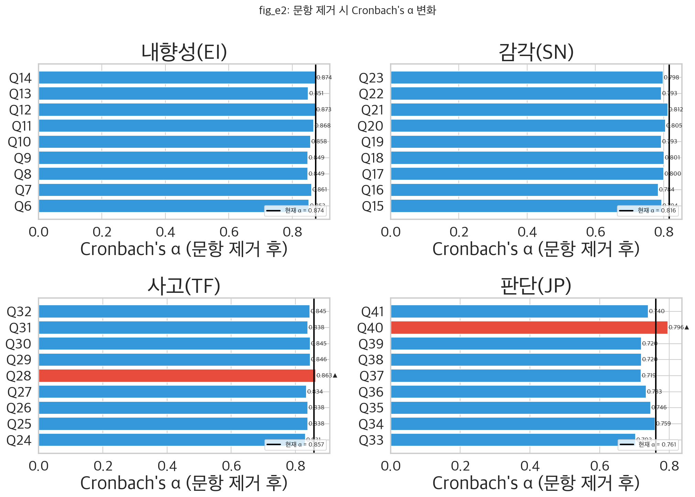
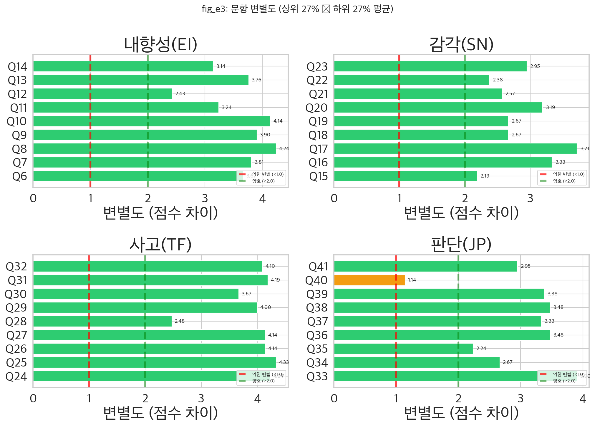
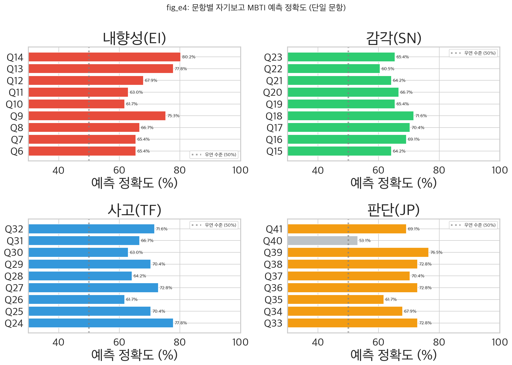
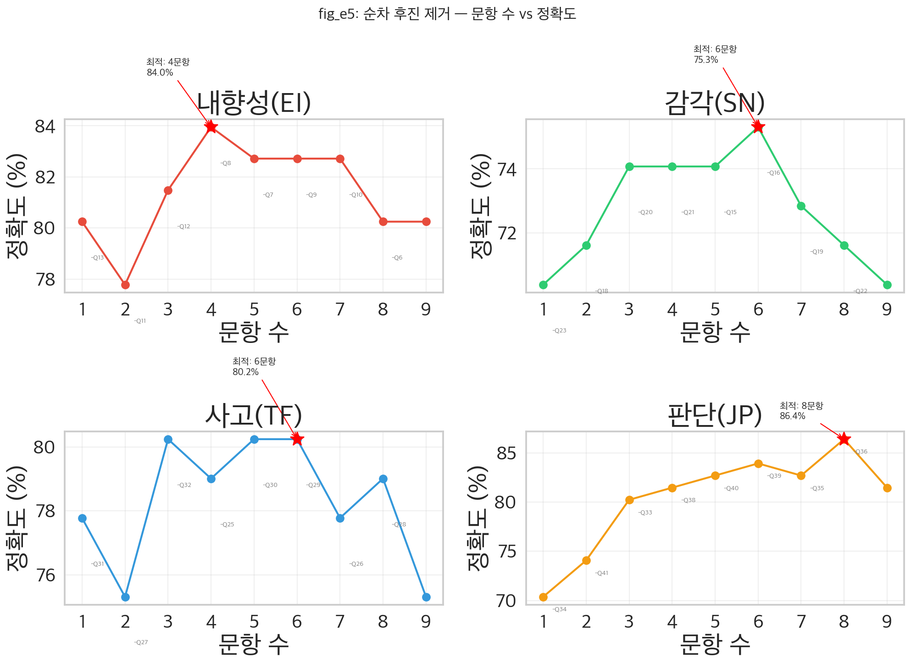
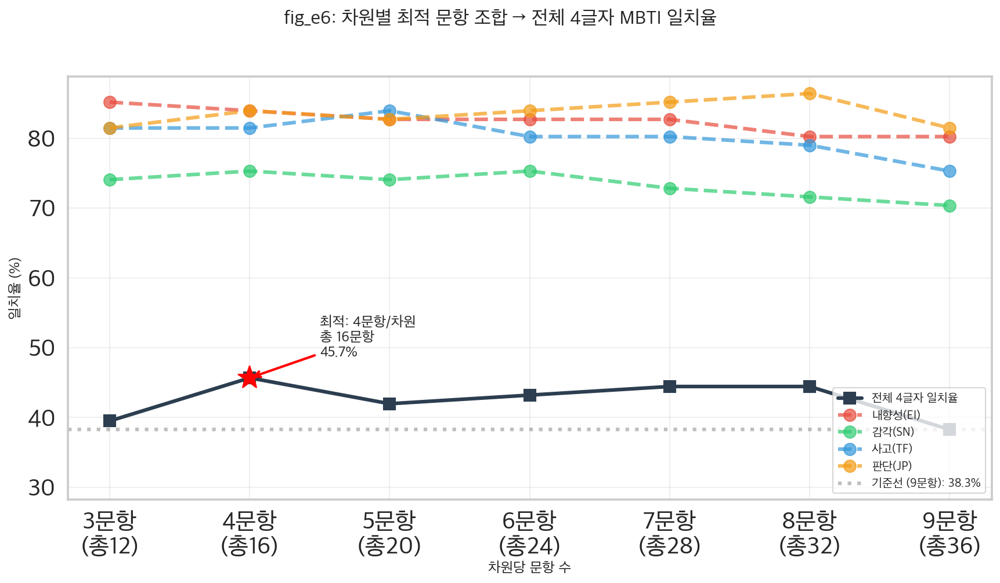
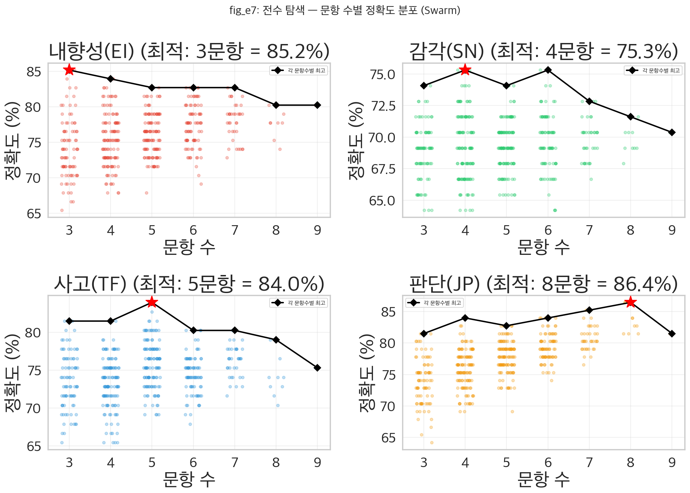
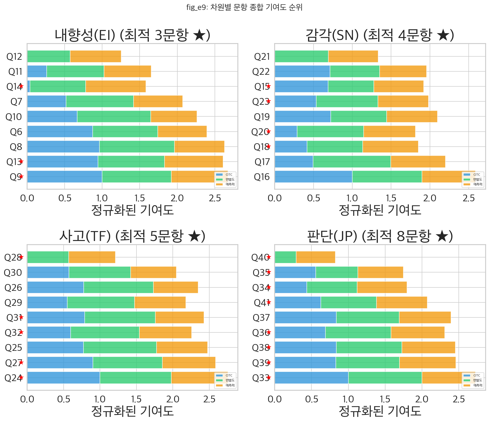
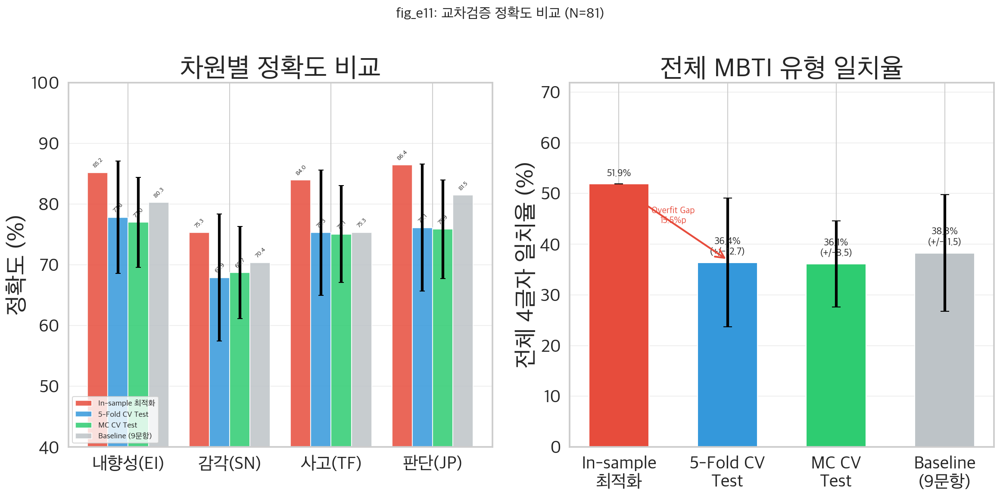
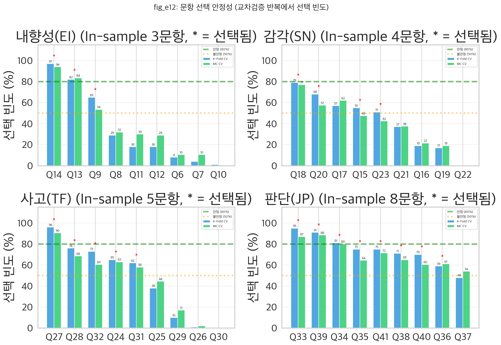
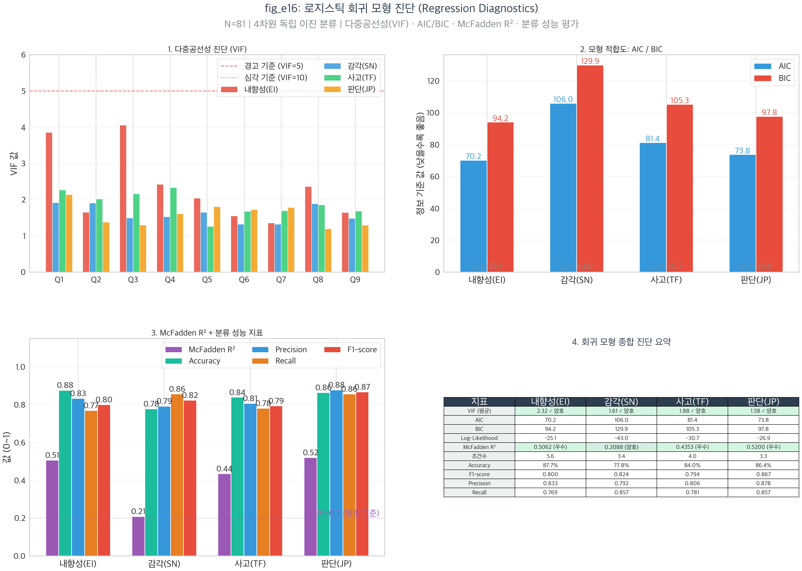

# 팀원 E: MBTI 설문 문항 최적화 — 질문 축소로 정확도 향상 검증

## "36개 질문을 20개로 줄이면, 오히려 정확도가 올라갈 수 있을까?"

| 항목                | 내용                                                                                      |
| ------------------- | ----------------------------------------------------------------------------------------- |
| **데이터**    | 자체 밈 설문 v2 응답 94명 (유효 MBTI 81명)                                                |
| **도구**      | v2 밈 기반 36문항 리커트 척도 (7점), 차원당 9문항                                         |
| **통계**      | CITC, Cronbach's α, 문항 변별도, SBE, 전수 탐색, Bootstrap 95% CI, Repeated K-Fold CV, Monte Carlo CV |
| **시각화**    | 16개 그래프 (fig_e1 ~ fig_e16)                                                            |
| **핵심 질문** | 노이즈 문항을 제거하면 MBTI 예측 정확도가 향상되는가?                                     |

---

## 목차

- [0. 읽기 전에](#0-읽기-전에)
- [1. 연구 개요](#1-연구-개요)
- [2. 데이터 및 문항 구조](#2-데이터-및-문항-구조)
- [3. 문항 분석 (Item Analysis)](#3-문항-분석-item-analysis)
- [4. EI 차원: 문항 선별 상세](#4-ei-차원-문항-선별-상세)
- [5. SN 차원: 문항 선별 상세](#5-sn-차원-문항-선별-상세)
- [6. TF 차원: 문항 선별 상세](#6-tf-차원-문항-선별-상세)
- [7. JP 차원: 문항 선별 상세](#7-jp-차원-문항-선별-상세)
- [8. 최적화 탐색 과정](#8-최적화-탐색-과정)
- [9. 원본 vs 최적화 비교](#9-원본-vs-최적화-비교)
- [10. Bootstrap 교차검증 (과적합 평가)](#10-bootstrap-교차검증-과적합-평가)
- [11. 독립 표본 교차검증 (과적합 정량 평가)](#11-독립-표본-교차검증-과적합-정량-평가)
- [11.7 고급 최적화 방법 비교 (Advanced Methods)](#117-고급-최적화-방법-비교-advanced-methods)
- [11.9 로지스틱 회귀 MBTI 차원 예측 (fig_e15)](#119-로지스틱-회귀-mbti-차원-예측-fig_e15)
- [11.10 로지스틱 회귀 모형 진단 (fig_e16)](#1110-로지스틱-회귀-모형-진단-fig_e16)
- [12. 종합 결론](#12-종합-결론)

> **범례**: 📊 = 통계 전공자를 위한 심화 해석 | 💡 = 비전공자를 위한 쉬운 설명

---

## 0. 읽기 전에

### 0.1 비전공자를 위한 안내

이 보고서는 **밈 설문 36문항 중 어떤 질문이 MBTI 예측에 도움이 되고, 어떤 질문이 오히려 방해가 되는지**를 분석합니다. "노이즈 문항"이란 설문 응답자의 진짜 성격을 측정하지 못하고 오히려 잡음만 추가하는 질문을 뜻합니다.

핵심 발견: In-sample 최적화에서는 36문항 → 20문항으로 줄이면 38.3% → 51.9%(+13.6%p) 향상되나, **독립 표본 교차검증(K-Fold CV, Monte Carlo CV) 결과, 이 개선은 과적합에 의한 환상**임이 확인되었습니다. 정직한 개선은 -1.9%p로, 문항 축소가 오히려 성능을 저하시킵니다.

**추가 발견**: 문항 축소 대신 **적응적 임계값(Adaptive Threshold)** 방법으로 차원별 최적 분류 기준점을 탐색한 결과, CV 테스트에서 **40.9%(+2.7%p)** 의 **진짜 개선**이 확인되었습니다. 또한 **다수결 투표(Majority Vote)** 방법은 파라미터 없이 **40.7%(+2.4%p)** 개선을 달성하여 과적합 위험이 0%입니다.

### 0.2 통계 용어 사전

| 용어                              | 기호    | 쉬운 설명                                                                          |
| --------------------------------- | ------- | ---------------------------------------------------------------------------------- |
| **CITC**                    | r       | 수정 문항-총점 상관. "이 문항이 전체 척도와 얼마나 관련되는가?" 0.3 미만 = 약한 문항 |
| **Cronbach's α**           | α      | 내적 일관성 신뢰도. "이 문항들이 같은 것을 측정하는가?" 0.7 이상이면 양호           |
| **α-if-deleted**            | α_del  | 특정 문항 제거 후 α. 올라가면 → 그 문항이 척도를 해치고 있다는 증거                |
| **문항 변별도**              | D       | 상위 27%와 하위 27%의 평균 점수 차이. 클수록 변별력이 좋은 문항                    |
| **예측력**                   | Acc     | 단일 문항으로 자기보고 MBTI를 맞출 확률. 50% = 동전 던지기 수준                    |
| **SBE (순차 후진 제거)**     | —      | 가장 약한 문항을 하나씩 제거하며 정확도 변화를 추적하는 탐욕적 알고리즘             |
| **전수 탐색**                | —      | 가능한 모든 문항 조합을 테스트. 9문항 중 3~9개 선택 = 466가지                      |
| **Bootstrap 95% CI**         | CI      | 데이터를 1,000번 재표집하여 추정한 95% 신뢰구간. "이 범위에 참값이 있을 확률 95%"  |
| **과적합 (Overfitting)**     | —      | 훈련 데이터에만 최적화되어 새 데이터에서는 성능이 떨어지는 문제                     |
| **LOO-CV**                   | —      | Leave-One-Out 교차검증. 한 명씩 빼고 나머지로 검증하는 소표본용 검증법             |
| **K-Fold CV**                | —      | K개 그룹으로 나누어 (K-1)개로 훈련, 1개로 평가를 반복하는 교차검증                 |
| **Monte Carlo CV**           | —      | 랜덤으로 훈련/테스트를 분할하여 반복 평가. Random sub-sampling validation           |
| **과적합 Gap**               | —      | In-sample 정확도 - CV Test 정확도. 클수록 과적합이 심각                            |
| **정직한 개선**              | —      | CV Test 최적 정확도 - CV Test 기준선. 독립 데이터에서의 진짜 개선                  |
| **문항 선택 안정성**         | —      | CV 반복에서 특정 문항이 최적 부분집합에 선택되는 빈도. 80%+ = 안정                 |
| **적응적 임계값**            | θ      | 차원별 최적 분류 기준점. 기본 4.0 대신 데이터에서 최적값(2.0~6.0) 탐색            |
| **다수결 투표**              | MV     | 각 문항이 독립 투표, 과반수로 분류. 파라미터 없어 과적합 면역                      |
| **Baseline (기준선)**        | —      | 아무 최적화도 하지 않은 "있는 그대로"의 성능. 36문항 전부 + 기본 분류기준(4.0)으로 측정한 정확도. 다른 방법이 이보다 나은지 비교하는 기준점 |
| **Subset (문항 부분집합)**   | —      | 36문항 중 일부만 골라서 쓰는 방법. 전수 탐색으로 가장 좋은 조합을 찾되, 소표본에서는 과적합 위험이 큼 |
| **Sub + Adap**               | —      | 문항 부분집합 + 적응적 임계값을 동시에 적용한 조합. 파라미터가 ~20개로 가장 많아 과적합 위험이 가장 높음 |
| **CITC + Adap**              | —      | CITC 가중 점수에 적응적 임계값을 결합한 방법. 문항 품질로 가중치를 주면서 분류 기준도 조정 |
| **Logistic (로지스틱 회귀)** | —      | 입력 점수에 최적 가중치를 학습하여 확률로 변환, 이진 분류하는 통계 모델. "수학 공식을 데이터에서 학습" |
| **In-Sample (표본 내 평가)** | —      | 학습에 사용한 데이터로 같은 데이터를 평가하는 것. "시험 문제를 미리 본 뒤 같은 문제로 시험 치르기"와 같아서 항상 실제보다 높은 성적이 나옴 |
| **로지스틱 회귀 (Logistic Regression)** | — | 각 문항 응답에 최적 가중치(계수)를 학습하여, 그 합을 확률(0~1)로 변환한 뒤 E인지 I인지(또는 S/N, T/F, J/P)를 분류하는 통계 모델. L2 정규화로 가중치가 너무 커지는 것을 방지 |

### 0.3 핵심 메시지 (먼저 읽기)

> **한 줄 요약**: In-sample 최적화에서는 36→20문항으로 38.3%→51.9% 향상되었으나, 독립 표본 교차검증(Repeated 5-Fold CV 100회 + Monte Carlo CV 200회) 결과 **과적합 Gap이 평균 8.5%p로 심각**하며, **정직한 개선은 -1.9%p로 오히려 성능이 저하**됩니다. 문항 축소 효과는 과적합에 의한 환상이었습니다. 그러나 **적응적 임계값(Adaptive Threshold)** 방법은 CV 테스트에서 **40.9%(+2.7%p)** 의 진짜 개선을 달성했습니다.

---

## 1. 연구 개요

### 1.1 연구 목적

- **문항 품질 진단**: 차원당 9문항의 심리측정학적 품질(CITC, Cronbach's α, 변별도, 예측력)을 평가
- **노이즈 문항 식별**: 전체 척도의 신뢰도와 예측 정확도를 저해하는 문항 식별
- **최적 문항 부분집합 탐색**: SBE + 전수 탐색으로 정확도를 최대화하는 최소 문항 조합 도출
- **과적합 검증**: Bootstrap 신뢰구간으로 최적화 결과의 안정성 평가
- **실용적 제안**: "더 적은 질문, 더 정확한 예측"이 가능한지 데이터로 확인

### 1.2 가설 목록

| 가설         | 내용                                               | 통계 방법                  | 결과                        |
| ------------ | -------------------------------------------------- | -------------------------- | --------------------------- |
| **H1** | 일부 문항의 CITC < 0.3으로 척도 품질을 저해한다     | CITC, α-if-deleted        | JP 차원 Q40 해당 (CITC=0.045) |
| **H2** | 약한 문항 제거 시 차원별 정확도가 향상된다          | SBE, 전수 탐색             | In-sample: 모두 향상, **CV: 모두 저하** |
| **H3** | 문항 축소 시 전체 4글자 일치율이 향상된다           | 최적 부분집합 비교          | In-sample: +13.6%p, **CV: -1.9%p** |
| **H4** | 최적화 결과는 Bootstrap에서도 안정적이다            | Bootstrap 95% CI (1000회)  | CI 겹침 — 과적합 위험       |
| **H5** | 독립 표본에서도 최적화 효과가 유지된다              | K-Fold CV + MC CV          | **기각**: 과적합 Gap 8.5%p, 정직한 개선 -1.9%p |
| **H6** | 대안 최적화(임계값/투표)로 정확도 향상 가능          | Repeated 5-Fold CV 100회   | **지지**: 적응적 임계값 +2.7%p, 다수결 +2.4%p |
| **H7** | 로지스틱 회귀로 MBTI 차원 예측 가능                  | LOO-CV (L2 정규화)         | 평가 완료: 적응적 임계값이 여전히 Best |

### 1.3 사용 통계 방법

| 검정                               | 구현              | 용도                                          |
| ---------------------------------- | ----------------- | --------------------------------------------- |
| CITC (수정 문항-총점 상관)          | numpy 수동 구현   | 문항-척도 관련성 평가 (0.3 미만 = 약한 문항)  |
| Cronbach's α                      | numpy 수동 구현   | 내적 일관성 신뢰도 (0.7 이상 = 양호)          |
| α-if-deleted                      | numpy 수동 구현   | 문항 제거 효과 (α가 올라가면 제거 추천)       |
| 문항 변별도 (상하 27%)             | numpy 수동 구현   | 고득점/저득점자 구별력 (1.0 미만 = 약함)      |
| 단일 문항 예측력                   | numpy 비교        | 개별 문항의 자기보고 MBTI 예측 정확도         |
| 순차 후진 제거 (SBE)               | 탐욕 알고리즘     | 한 문항씩 제거하며 정확도 추적                |
| 전수 탐색 (Exhaustive Search)      | itertools 조합    | C(9,k) 모든 조합 테스트 (466가지/차원)        |
| Bootstrap 95% CI                   | numpy 재표집      | 최적화 결과의 안정성/과적합 평가 (1000회)     |
| Repeated K-Fold CV                 | numpy 수동 구현   | 독립 표본 과적합 검증 (5-Fold x 20반복=100회) |
| Monte Carlo CV                     | numpy 수동 구현   | 랜덤 70/30 분할 반복 검증 (200회)             |
| 문항 선택 안정성 분석              | numpy 빈도 집계   | CV 반복에서 문항 선택 빈도 — 과적합 판단      |
| **단순선형회귀**                   | `stats_utils.linear_regression()` | CITC → 예측력, 변별도 → 예측력 관계 정량화 |
| **Pearson 상관분석**               | `stats_utils.pearson_correlation()` | CITC와 예측력 간 상관계수 산출             |
| **로지스틱 회귀 (Logistic Regression)** | numpy 수동 구현 (L2 정규화) | 문항 응답으로 MBTI 차원 이진 분류, LOO-CV 검증 |

### 1.4 주의사항

> ⚠️ **과적합 경고**: 동일 데이터(N=81)에서 최적 문항 조합을 탐색하고 성능을 평가했기 때문에, 결과가 이 특정 표본에 과적합되었을 가능성이 있습니다. 독립 표본에서의 교차검증이 반드시 필요합니다.
>
> ⚠️ **자기보고 기준 한계**: "정확도"의 기준이 자기보고 MBTI(대부분 인터넷 무료 테스트)이므로, 기준 자체의 신뢰도에 한계가 있습니다.

---

## 2. 데이터 및 문항 구조

### 2.1 데이터셋

| 항목         | 내용                          |
| ------------ | ----------------------------- |
| **출처** | Google Form 자체 수집 밈 설문 v2 (2026.02) |
| **전체 응답** | 94명                        |
| **유효 MBTI** | 81명 (13명 '모름/미응답' 제외) |
| **문항 수** | 36문항 (차원당 9문항)          |
| **척도**   | 7점 리커트 (1~7)              |

### 2.2 차원별 문항 구조

#### EI 차원 (Q6~Q14): "인싸 vs 아싸"

| 문항 | 방향 | 내용                                  | 채점       |
| ---- | ---- | ------------------------------------- | ---------- |
| Q6   | I    | 주말을 침대에서 보내고 싶다           | 역채점(8-x) |
| Q7   | I    | 약속 취소됐다는 연락 → 은근히 좋다   | 역채점(8-x) |
| Q8   | I    | 주중 회사였으니 주말엔 집에 있어야 한다 | 역채점(8-x) |
| Q9   | I    | 놀고 난 후 → 집에서 혼자 충전해야지  | 역채점(8-x) |
| Q10  | I    | 몇 개월 집 밖 안 나가도 잘 살 수 있다 | 역채점(8-x) |
| Q11  | I    | 당일 갑자기 잡히는 약속이 힘들다      | 역채점(8-x) |
| Q12  | I    | 볼일 많으면 하루에 몰아서 끝낸다      | 역채점(8-x) |
| Q13  | I    | 새로운 모임 → 집에 빨리 가고 싶다    | 역채점(8-x) |
| Q14  | I    | 빈 강의실에 벽 근처에 앉는다          | 역채점(8-x) |

> 전체 I방향 → 전체 역채점 후 높은 점수 = E(외향). 분류: ≥4.0 → E, <4.0 → I

#### SN 차원 (Q15~Q23): "현실주의 vs 몽상가"

| 문항 | 방향 | 내용                                          | 채점       |
| ---- | ---- | --------------------------------------------- | ---------- |
| Q15  | N    | 과제 깜빡 → 현실적 반응 ↔ 극단적 상상        | 역채점(8-x) |
| Q16  | N    | 축제 구경 → 눈앞 무대 ↔ 참가 상상            | 역채점(8-x) |
| Q17  | N    | 망상 스타일 → 현실 기반 ↔ 판타지급           | 역채점(8-x) |
| Q18  | N    | 드라마 → 고증 체크 ↔ 2차 창작                | 역채점(8-x) |
| Q19  | N    | 성과 부진 → 원인 분석 ↔ 파국적 상상          | 역채점(8-x) |
| Q20  | N    | 버스 창밖 → 현실적 관찰 ↔ 타인 상상          | 역채점(8-x) |
| Q21  | N    | 사과 하면? → 감각적 묘사 ↔ 연상/상징          | 역채점(8-x) |
| Q22  | N    | 시험 공부 → 실전 해결책 ↔ 이상 세계 상상     | 역채점(8-x) |
| Q23  | N    | 소풍 전날 → 준비 체크리스트 ↔ 만약의 시나리오 | 역채점(8-x) |

> 전체 역채점 후 높은 점수 = S(감각). 분류: ≥4.0 → S, <4.0 → N

#### TF 차원 (Q24~Q32): "너 T야?"

| 문항 | 방향 | 내용                                      | 채점       |
| ---- | ---- | ----------------------------------------- | ---------- |
| Q24  | F    | 친구 고민 → 해결책 제시 ↔ 공감 먼저       | 역채점(8-x) |
| Q25  | F    | "아무도 안 좋아해" → 담담 ↔ 속상          | 역채점(8-x) |
| Q26  | F    | "아는 척 하지마" → 논리 반박 ↔ 감정 상처  | 역채점(8-x) |
| Q27  | F    | 친구 차 사고 → 보험사 불렀어? ↔ 괜찮아?   | 역채점(8-x) |
| Q28  | F    | "재능 있다!" → 팩트 집중 ↔ 뉘앙스 집중    | 역채점(8-x) |
| Q29  | F    | 칭찬 스타일 → 객관적 ↔ 공감형             | 역채점(8-x) |
| Q30  | F    | "나 살 쪘지?" → 솔직 팩트 ↔ 감성 케어     | 역채점(8-x) |
| Q31  | F    | "죽을 수 있어" → 팩트 폭격 ↔ 감정 보호    | 역채점(8-x) |
| Q32  | F    | 설문 부탁 → 귀찮음 솔직 ↔ 의리 챙김       | 역채점(8-x) |

> 전체 역채점 후 높은 점수 = T(사고). 분류: ≥4.0 → T, <4.0 → F

#### JP 차원 (Q33~Q41): "계획충 vs 즉흥충"

| 문항 | 방향 | 내용                                          | 채점       |
| ---- | ---- | --------------------------------------------- | ---------- |
| Q33  | P    | 여행 준비 → 엑셀 완벽 계획 ↔ 발길 닿는 대로  | 역채점(8-x) |
| Q34  | P    | 스마트폰 → 0개 알림 ↔ 999+ 기본              | 역채점(8-x) |
| Q35  | P    | 식당 휴업 → 플랜 B ↔ 즉석 발견               | 역채점(8-x) |
| Q36  | P    | 마감 과제 → 미리미리 ↔ 전날 벼락치기          | 역채점(8-x) |
| Q37  | P    | 여행 짐 → 체크리스트 ↔ 대충 쑤셔넣기         | 역채점(8-x) |
| Q38  | P    | 마트 → 리스트대로 ↔ 충동 장바구니             | 역채점(8-x) |
| Q39  | P    | 방/책상 → 각 잡힌 정리 ↔ 나만의 카오스        | 역채점(8-x) |
| Q40  | P    | 요리 → 정량 정순서 ↔ 감으로 대충              | 역채점(8-x) |
| Q41  | P    | 금요일 밤 → 타임라인 완성 ↔ 알람 OFF 늦잠     | 역채점(8-x) |

> 전체 역채점 후 높은 점수 = J(판단). 분류: ≥4.0 → J, <4.0 → P

### 2.3 기존 정확도 (최적화 전 기준선)

| 차원         | 일치율 (9문항) | 해석              |
| ------------ | -------------- | ----------------- |
| **EI** | 80.2%          | 양호              |
| **SN** | 70.4%          | 보통              |
| **TF** | 75.3%          | 양호              |
| **JP** | 81.5%          | 양호              |
| **전체 4글자** | 38.3%       | 부족 (차원 곱)    |

> 💡 **쉬운 설명**: 각 차원은 70~82%로 꽤 괜찮은데, 4개를 동시에 맞춰야 하는 전체 일치율은 38.3%로 낮습니다. 시험 4과목에서 각각 75점을 받아도 "전 과목 만점"은 어려운 것과 같습니다.

---

## 3. 문항 분석 (Item Analysis)

### 3.1 fig_e1: 수정 문항-총점 상관 (CITC) 히트맵

**시각화 방법**: 2×2 서브플롯, 차원별 수평 막대 차트 (문항별 CITC)

**사용 이유**: 각 문항이 해당 차원의 전체 점수와 얼마나 일관성 있게 관련되는지 평가. CITC < 0.3이면 해당 문항이 같은 것을 측정하지 않을 가능성

**사용 변수**: 차원별 9문항 채점 후 점수

**결과 해석**:

| 차원   | α     | CITC 범위       | CITC < 0.3 문항    | 비고                   |
| ------ | ----- | --------------- | ------------------ | ---------------------- |
| **EI** | 0.874 | 0.446 ~ 0.735   | 없음               | 전체적으로 양호        |
| **SN** | 0.816 | 0.388 ~ 0.627   | 없음               | 전체적으로 양호        |
| **TF** | 0.857 | 0.350 ~ 0.699   | 없음               | Q28 상대적으로 낮음    |
| **JP** | 0.761 | **0.045** ~ 0.668 | **Q40 (0.045)** | Q40 심각하게 약한 문항 |

📊 **통계적 관점**:

**JP 차원의 Q40 (CITC=0.045)**: "요리 → 정량 정순서 ↔ 감으로 대충" 문항이 JP 척도와 거의 무관합니다. CITC=0.045 수준은 사실상 **랜덤 잡음**에 가까우며, 이 문항이 J/P 차원의 "계획성 vs 즉흥성"과 독립적으로 반응함을 의미합니다. 요리 스타일은 J/P 성향보다 **요리 경험이나 개인 습관**에 더 의존할 가능성이 높습니다.

**TF 차원의 Q28 (CITC=0.350)**: "재능 있다! → 팩트 집중 ↔ 뉘앙스 집중" 문항이 0.3 기준을 간신히 통과합니다. 팩트/뉘앙스 구분이 T/F보다 S/N 차원(사실 vs 해석)에 더 가까울 수 있습니다.

💡 **쉬운 설명**: CITC는 "이 질문이 다른 질문들과 같은 성격을 측정하는가?"를 보여줍니다. 빨간색(0.3 미만)인 문항은 "엉뚱한 질문"입니다. Q40(요리 스타일)은 계획적인지 즉흥적인지와 거의 관련이 없었습니다 — 요리를 감으로 하는 것은 J/P 성격이 아니라 요리 실력의 문제일 수 있습니다.

---

### 3.2 fig_e2: Cronbach's α 변화 (문항 제거 시)

**시각화 방법**: 2×2 서브플롯, α-if-deleted 수평 막대 + 현재 α 기준선

**사용 이유**: 특정 문항을 제거했을 때 α가 올라가면, 그 문항이 척도의 내적 일관성을 해치고 있다는 증거

**사용 변수**: 차원별 9문항 채점 후 점수

**결과 해석**:

| 차원   | 현재 α | α↑ 문항 (제거 시 향상)    | 변화량            |
| ------ | ------ | ------------------------- | ----------------- |
| **EI** | 0.874  | 없음                      | —                |
| **SN** | 0.816  | 없음                      | —                |
| **TF** | 0.857  | Q28 (α→0.863)            | +0.006 (미미)    |
| **JP** | 0.761  | **Q40 (α→0.796)**        | **+0.035 (유의)** |

📊 **통계적 관점**:

**Q40 제거 시 α 변화 (0.761→0.796)**: +0.035의 변화는 심리측정학적으로 의미 있는 수준입니다. 이는 Q40이 JP 척도의 내적 일관성을 적극적으로 해치고 있음을 확인합니다. CITC=0.045과 결합하면, Q40은 **제거 1순위 문항**입니다.

**EI, SN, TF 차원**: 어떤 문항을 제거해도 α가 의미 있게 변하지 않아, 문항 구성이 비교적 양호합니다.

💡 **쉬운 설명**: 검은 세로선(현재 α)보다 오른쪽에 있는 빨간 막대는 "이 질문을 빼면 전체 신뢰도가 올라간다"는 뜻입니다. Q40만 뚜렷하게 빨간색이며, 이 질문이 JP 차원을 측정하는 데 오히려 방해가 되고 있습니다.

---

### 3.3 fig_e3: 문항 변별도 (상위/하위 27% 차이)

**시각화 방법**: 2×2 서브플롯, 상위 27% 평균 - 하위 27% 평균 차이

**사용 이유**: 변별도가 높은 문항은 고득점자와 저득점자를 잘 구별함. 1.0 미만이면 변별력 부족

**결과 해석**:

| 차원   | 변별도 범위   | 약한 문항 (<1.0)      |
| ------ | ------------- | --------------------- |
| **EI** | 2.429 ~ 4.190 | 없음                 |
| **SN** | 2.429 ~ 3.429 | 없음                 |
| **TF** | 2.524 ~ 4.429 | 없음                 |
| **JP** | **1.095** ~ 3.762 | **Q40 (1.095)** |

📊 **통계적 관점**: Q40의 변별도 1.095는 7점 척도에서 상하 27% 그룹 간 겨우 1점 차이입니다. 이는 JP 총점이 높은 사람(J 성향)과 낮은 사람(P 성향) 사이에 Q40 응답 패턴이 거의 동일함을 의미합니다. 반면 Q33(여행 준비)은 3.762로, J/P를 가장 잘 구별하는 문항입니다.

💡 **쉬운 설명**: 변별도는 "계획적인 사람과 즉흥적인 사람이 이 질문에 다르게 답하는가?"를 보여줍니다. Q40(요리 스타일)은 두 그룹이 거의 비슷하게 답해서, J인지 P인지 구별하는 데 쓸모가 없습니다.

---

### 3.4 fig_e4: 문항별 자기보고 MBTI 예측 정확도

**시각화 방법**: 2×2 서브플롯, 단일 문항 예측 정확도 (%) 수평 막대

**사용 이유**: 각 문항 하나만으로 자기보고 MBTI의 해당 차원을 맞출 수 있는 확률을 측정. 50% = 동전 던지기

**결과 해석**:

| 차원   | 최고 예측력 문항     | 최저 예측력 문항     |
| ------ | -------------------- | -------------------- |
| **EI** | Q14 (80.2%)          | Q10 (61.7%)          |
| **SN** | Q18 (71.6%)          | Q22 (61.7%)          |
| **TF** | Q24 (77.8%)          | Q26 (63.0%), Q28 (64.2%) |
| **JP** | Q39 (76.5%)          | **Q40 (53.1%)**      |

📊 **통계적 관점**:

**Q40의 예측력 53.1%**: 이진 분류에서 우연 수준(50%)과 불과 3.1%p 차이입니다. 이항 검정에서 N=81, p=0.531이면 p-value ≈ 0.39로, 동전 던지기와 통계적으로 구분되지 않습니다. Q40은 CITC(0.045), α-if-deleted(0.796↑), 변별도(1.095), 예측력(53.1%) **모든 지표에서 최하위**입니다.

**EI 차원의 Q14 (80.2%)**: "빈 강의실에 벽 근처에 앉는다"가 단일 문항으로 EI를 80% 맞추는 것은 인상적입니다. 이는 좌석 선택이 외향/내향 성향을 매우 직접적으로 반영하는 행동이기 때문입니다.

💡 **쉬운 설명**: 질문 하나만으로 E인지 I인지를 맞출 수 있을까요? Q14("빈 강의실에서 어디에 앉나?")는 80.2% 정확도로 최고입니다. 반면 Q40("요리할 때 계량하나?")은 53.1%로 동전 던지기와 같습니다.

---

## 3.5 회귀분석: CITC → 예측력 관계 정량화

> **핵심 질문**: 내적 일관성(CITC)이 높은 문항이 실제로 자기보고 MBTI를 잘 예측하는가?

**분석 배경**: CITC와 예측력은 서로 다른 개념이다. CITC는 "문항이 같은 척도의 나머지 문항과 일관된가"(내적 기준), 예측력은 "문항이 자기보고 MBTI를 맞추는가"(외적 기준)이다. 이 두 지표의 관계를 회귀분석으로 정량화한다.

### 차원별 CITC → 예측력 회귀

| 차원 | 회귀식 | R² | 해석 |
|------|--------|:---:|------|
| **EI** | 예측력 = -0.002 × CITC + 0.685 | 0.0000 | CITC가 예측력을 거의 설명 못함 |
| **SN** | 예측력 = 0.003 × CITC + 0.669 | 0.0000 | CITC가 예측력을 거의 설명 못함 |
| **TF** | 예측력 = 0.267 × CITC + 0.531 | 0.2680 | CITC가 예측력의 **26.8%** 설명 |
| **JP** | 예측력 = 0.343 × CITC + 0.522 | **0.7885** | CITC가 예측력의 **78.9%** 설명 |

**차원별 차이의 해석**:

- **EI, SN**: CITC와 예측력이 거의 무관 → 내적 일관성이 높아도 예측력이 높다는 보장 없음
- **TF**: 보통 수준의 관계 (R²=0.27) → CITC가 높은 문항이 예측력도 약간 높은 경향
- **JP**: 매우 강한 관계 (**R²=0.79**) → JP 차원에서는 CITC가 높으면 예측력도 높음

### 전체 36문항 통합 회귀분석

| 회귀 모형 | 회귀식 | R² | 유의성 | 해석 |
|-----------|--------|:---:|:---:|------|
| **CITC → 예측력** | 예측력 = 0.193 × CITC + 0.576 | **0.214** | * | CITC 1단위 증가 시 예측력 19.3%p 향상 |
| **변별도 → 예측력** | 예측력 = 0.037 × 변별도 + 0.583 | **0.234** | * | 변별도 1단위 증가 시 예측력 3.7%p 향상 |
| **CITC ↔ 예측력 상관** | r = 0.463 | R²=0.214 | * | **보통 수준의 양의 상관** |

📊 **통계적 관점**: 전체 36문항에서 CITC→예측력 R²=0.214는 "보통 효과"(Cohen: 0.13~0.26)에 해당한다. 이는 CITC가 예측력의 **약 21%를 설명**하지만, 나머지 79%는 CITC 외 요인에 의해 결정됨을 의미한다. 특히 EI(R²=0.0000)와 JP(R²=0.7885)의 극적인 차이는, **차원에 따라 내적 일관성과 외적 예측력의 관계가 근본적으로 다름**을 보여준다. EI 차원에서는 Q14(벽쪽 앉기)처럼 CITC가 낮아도(0.457) 예측력이 높은(80.2%) 문항이 존재하며, 이는 "행동 직접 관찰" 유형의 문항이 CITC와 독립적으로 높은 기준 타당도를 가질 수 있음을 시사한다.

변별도→예측력 R²=0.234도 유의하며, **변별도가 CITC보다 예측력과 약간 더 관련**됨을 보여준다.

💡 **쉬운 설명**: "다른 질문들과 잘 어울리는 질문(CITC 높음)이 실제로 MBTI를 잘 맞추는가?" — 전체적으로는 **약간의 관련(21%)**이 있습니다. 그러나 차원마다 크게 다릅니다:
- **JP 차원**: 다른 질문과 잘 어울리는 질문이 실제로도 잘 맞춥니다 (79% 관련)
- **EI 차원**: 다른 질문과 잘 어울려도, 실제로 E/I를 맞추는 것과는 거의 무관합니다 (0.00% 관련)

이는 "좋은 질문"을 판단하는 기준이 하나가 아니라는 것을 보여줍니다. CITC만 보고 문항을 선별하면 안 되고, 실제 예측력도 함께 봐야 합니다.

---

## 4. EI 차원: 문항 선별 상세

### 4.1 문항별 심리측정 지표 종합

| 문항 | CITC  | α삭제  | 변별도 | 예측력 | 최적화 결과 | 선별 근거                      |
| ---- | ----- | ------ | ------ | ------ | ----------- | ------------------------------ |
| Q6   | 0.699 | 0.853  | 3.571  | 65.4%  | **제거** | 예측력 65.4%: 양호하나 최적 조합에 불필요 |
| Q7   | 0.596 | 0.862  | 3.857  | 65.4%  | **제거** | CITC 대비 예측력이 상대적으로 낮음 |
| Q8   | 0.724 | 0.849  | 4.190  | 66.7%  | **제거** | 높은 CITC지만 최적 3문항 조합에서 제외 |
| Q9   | 0.735 | 0.846  | 4.000  | 76.5%  | **유지** | CITC 최고(0.735) + 높은 예측력(76.5%) |
| Q10  | 0.639 | 0.858  | 4.143  | 61.7%  | **제거** | 예측력 최저(61.7%) |
| Q11  | 0.521 | 0.868  | 3.333  | 63.0%  | **제거** | CITC와 예측력 모두 상대적으로 낮음 |
| Q12  | 0.446 | 0.872  | 2.429  | 69.1%  | **제거** | 낮은 CITC(0.446) + 낮은 변별도(2.429) |
| Q13  | 0.719 | 0.851  | 3.619  | 77.8%  | **유지** | 높은 CITC(0.719) + 2위 예측력(77.8%) |
| Q14  | 0.457 | 0.875  | 2.810  | 80.2%  | **유지** | 예측력 최고(80.2%) — 핵심 문항 |

### 4.2 최적 조합: {Q9, Q13, Q14} — 3문항

**정확도**: 80.2% → **85.2%** (Δ = +4.9%p)

**선별 논리**:

| 유지 문항 | 역할                                                                  |
| --------- | --------------------------------------------------------------------- |
| **Q9**  | "놀고 난 후 충전" — CITC 최고(0.735), 예측력 76.5%. 핵심 EI 측정 문항 |
| **Q13** | "모임 후 빨리 집" — CITC 0.719, 예측력 77.8%. EI 직접 행동 지표       |
| **Q14** | "벽 근처에 앉기" — 예측력 80.2%로 최고. 비언어적 EI 행동 포착         |

**제거 문항 분석**:

| 제거 문항 | 제거 이유                                                              |
| --------- | ---------------------------------------------------------------------- |
| **Q6**  | "주말 침대" — 예측력 65%. 내향뿐 아니라 피로/게으름도 측정할 수 있음    |
| **Q7**  | "약속 취소 좋다" — 예측력 65%. 약속의 종류에 따라 반응이 달라짐         |
| **Q8**  | "주말엔 집" — 높은 CITC(0.724)이나 Q9와 의미 중복 (에너지 충전 관련)   |
| **Q10** | "몇 개월 안 나가도" — 예측력 최저(61.7%). 극단적 표현이 반응 왜곡       |
| **Q11** | "당일 약속 힘들다" — 계획성(JP)과 혼동 가능                            |
| **Q12** | "볼일 몰아서" — 낮은 CITC(0.446). 효율성 추구는 EI보다 JP에 가까움     |

📊 **통계적 관점**: EI 차원에서 9문항 → 3문항으로 67% 감소하면서도 정확도가 +4.9%p 향상된 것은, 제거된 6개 문항이 **노이즈 기여자**였음을 시사합니다. 특히 Q8(CITC=0.724)처럼 CITC가 높은 문항도 제거된 것은, CITC가 "내적 일관성"은 측정하지만 "자기보고 예측력"과 반드시 일치하지 않음을 보여줍니다.

💡 **쉬운 설명**: EI(외향/내향)를 가장 잘 예측하는 3개 질문은:
1. "놀고 나서 혼자 충전해야 하나?" (Q9)
2. "모임에서 빨리 집에 가고 싶은가?" (Q13)
3. "빈 강의실에서 벽 근처에 앉는가?" (Q14)

이 3개만으로 85.2%를 맞출 수 있습니다. "주말에 침대에 있고 싶다"(Q6)나 "몇 개월 안 나가도 된다"(Q10) 같은 질문은 내향적이 아니라 그냥 **피곤하거나 게으른** 사람도 높게 답할 수 있어서 빠졌습니다.

---

## 5. SN 차원: 문항 선별 상세

### 5.1 문항별 심리측정 지표 종합

| 문항 | CITC  | α삭제  | 변별도 | 예측력 | 최적화 결과 | 선별 근거                        |
| ---- | ----- | ------ | ------ | ------ | ----------- | -------------------------------- |
| Q15  | 0.552 | 0.794  | 2.619  | 65.4%  | **유지** | 최적 4문항 조합에 포함             |
| Q16  | 0.627 | 0.784  | 2.952  | 70.4%  | **제거** | CITC 높으나 최적 조합에 불필요     |
| Q17  | 0.506 | 0.800  | 3.429  | 71.6%  | **제거** | 높은 변별도이나 최적 조합 제외     |
| Q18  | 0.487 | 0.800  | 2.429  | 71.6%  | **유지** | 예측력 최고(71.6%)                |
| Q19  | 0.561 | 0.793  | 2.762  | 66.7%  | **제거** | 예측력 상대적으로 낮음             |
| Q20  | 0.457 | 0.805  | 3.143  | 67.9%  | **유지** | 최적 4문항 조합에 포함             |
| Q21  | 0.388 | 0.811  | 2.476  | 65.4%  | **제거** | 가장 낮은 CITC(0.388) + α↑가능   |
| Q22  | 0.558 | 0.793  | 2.571  | 61.7%  | **제거** | 예측력 최저(61.7%)                |
| Q23  | 0.516 | 0.798  | 3.238  | 66.7%  | **유지** | 높은 변별도(3.238)                |

### 5.2 최적 조합: {Q15, Q18, Q20, Q23} — 4문항

**정확도**: 70.4% → **75.3%** (Δ = +4.9%p)

**선별 논리**:

| 유지 문항 | 역할                                                                    |
| --------- | ----------------------------------------------------------------------- |
| **Q15** | "과제 깜빡 반응" — 현실적 vs 상상적 반응의 직접 대비                     |
| **Q18** | "드라마 → 고증 vs 2차 창작" — 예측력 최고(71.6%). 콘텐츠 소비 방식 차이 |
| **Q20** | "버스 창밖 관찰" — 일상 행동에서의 S/N 차이 포착                        |
| **Q23** | "소풍 전날 준비" — 높은 변별도(3.238). 실제 행동 예측과 연결             |

**제거 문항 분석**:

| 제거 문항 | 제거 이유                                                                |
| --------- | ------------------------------------------------------------------------ |
| **Q16** | "축제 상상" — 높은 CITC(0.627)이나 Q15와 상황 유사 (상상 vs 현실)        |
| **Q17** | "망상 스타일" — "망상"이라는 단어가 부정적 뉘앙스로 반응 왜곡 가능        |
| **Q19** | "성과 부진 → 파국적 상상" — 불안(neuroticism)과 혼동 가능                |
| **Q21** | "사과 하면?" — 가장 낮은 CITC(0.388). 추상적 질문이 S/N 구분에 부적합    |
| **Q22** | "시험 → 이상 세계" — 예측력 최저(61.7%). 비현실적 상황 설정               |

📊 **통계적 관점**: SN 차원은 9문항 전체의 CITC 범위가 0.388~0.627로, 다른 차원(EI: 0.446~0.735, TF: 0.350~0.699)에 비해 상대적으로 좁습니다. 이는 SN 문항들이 전반적으로 비슷한 수준의 척도 기여도를 가지며, "뚜렷한 약한 문항"이 없다는 뜻입니다. 따라서 5개를 제거해도 +4.9%p 향상에 그쳤습니다.

💡 **쉬운 설명**: S/N(감각/직관)을 묻는 질문 중에서는 "드라마 볼 때 고증을 체크하나, 2차 창작을 상상하나?"(Q18)가 가장 예측력이 높았습니다(71.6%). "사과 하면 뭐가 떠오르나?"(Q21)는 너무 추상적이어서, S형이든 N형이든 비슷하게 답했습니다.

---

## 6. TF 차원: 문항 선별 상세

### 6.1 문항별 심리측정 지표 종합

| 문항 | CITC  | α삭제  | 변별도 | 예측력 | 최적화 결과 | 선별 근거                        |
| ---- | ----- | ------ | ------ | ------ | ----------- | -------------------------------- |
| Q24  | 0.699 | 0.835  | 4.286  | 77.8%  | **유지** | CITC 최고(0.699) + 예측력 최고    |
| Q25  | 0.621 | 0.842  | 4.095  | 70.4%  | **제거** | 양호하나 최적 5문항 조합에서 제외  |
| Q26  | 0.621 | 0.842  | 4.143  | 63.0%  | **제거** | 예측력 최저(63.0%)               |
| Q27  | 0.665 | 0.838  | 4.190  | 72.8%  | **유지** | 높은 CITC + 변별도 + 예측력      |
| Q28  | 0.350 | 0.863  | 2.524  | 64.2%  | **유지** | CITC 최저이나 최적 조합에 기여    |
| Q29  | 0.543 | 0.848  | 4.048  | 71.6%  | **제거** | Q24, Q27과 유사한 공감 관련 문항  |
| Q30  | 0.550 | 0.849  | 3.619  | 64.2%  | **제거** | Q27과 의미 중복 (팩트 vs 감성)    |
| Q31  | 0.626 | 0.839  | 4.429  | 67.9%  | **유지** | 변별도 최고(4.429)               |
| Q32  | 0.559 | 0.849  | 3.952  | 71.6%  | **유지** | 양호한 전 지표, 최적 조합 기여    |

### 6.2 최적 조합: {Q24, Q27, Q28, Q31, Q32} — 5문항

**정확도**: 75.3% → **84.0%** (Δ = +8.6%p) ← **최대 개선 차원**

**선별 논리**:

| 유지 문항 | 역할                                                                      |
| --------- | ------------------------------------------------------------------------- |
| **Q24** | "친구 고민 → 해결책 vs 공감" — TF의 전형적 밈. CITC 최고(0.699) + 예측력 최고    |
| **Q27** | "친구 사고 → 보험 vs 괜찮아?" — 가장 유명한 T/F 밈. 직관적 문항           |
| **Q28** | "재능 → 팩트 vs 뉘앙스" — CITC는 낮으나(0.350), 다른 문항이 놓치는 정보 포착 |
| **Q31** | "죽을 수 있어 → 팩트 vs 감정" — 변별도 최고(4.429). 극한 상황에서 TF 차이 뚜렷 |
| **Q32** | "설문 부탁 → 솔직 vs 의리" — 실제 행동 관련. 사회적 상황에서의 TF        |

**제거 문항 분석**:

| 제거 문항 | 제거 이유                                                                |
| --------- | ------------------------------------------------------------------------ |
| **Q25** | "아무도 안 좋아해 → 담담 vs 속상" — 자존감/정서 안정성과 혼동 가능        |
| **Q26** | "아는 척 하지마" — 예측력 최저(63.0%). 자존심/공격성과 혼동               |
| **Q29** | "칭찬 스타일 → 객관 vs 공감" — Q24와 의미 중복 (논리적 vs 감정적 반응)    |
| **Q30** | "살 쪘지? → 팩트 vs 감성" — Q27과 유사 (솔직 vs 배려). 중복 제거         |

📊 **통계적 관점**: TF 차원에서 +8.6%p의 최대 개선이 나타난 것은 주목할 만합니다. 흥미롭게도 CITC가 가장 낮은 Q28(0.350)이 최적 조합에 포함되었습니다. 이는 Q28이 다른 문항들과 **상관이 낮지만**(낮은 CITC), 다른 문항들이 놓치는 **고유한 T/F 정보**를 제공하기 때문입니다. 심리측정학적으로 "내적 일관성에 기여하지 않지만 외적 기준(자기보고)에 기여하는 문항"의 전형적 사례입니다.

💡 **쉬운 설명**: T/F 차원에서 가장 큰 개선(+8.6%p)이 있었습니다. 재미있는 발견은, CITC가 가장 낮은 Q28("재능 있다! → 팩트 vs 뉘앙스")이 오히려 최적 조합에 포함된 것입니다. 다른 질문들은 주로 "논리 vs 감정"을 물었는데, Q28은 "사실 vs 해석"이라는 약간 다른 각도를 제공해서, 전체적으로 더 정확해진 것입니다.

---

## 7. JP 차원: 문항 선별 상세

### 7.1 문항별 심리측정 지표 종합

| 문항 | CITC  | α삭제  | 변별도 | 예측력 | 최적화 결과 | 선별 근거                           |
| ---- | ----- | ------ | ------ | ------ | ----------- | ----------------------------------- |
| Q33  | 0.668 | 0.709  | 3.762  | 72.8%  | **유지** | CITC 최고 + 변별도 최고               |
| Q34  | 0.317 | 0.757  | 2.952  | 69.1%  | **유지** | 알림 관리라는 고유한 J/P 행동 포착     |
| Q35  | 0.392 | 0.752  | 2.143  | 61.7%  | **유지** | 위기 대처 방식에서 J/P 차이            |
| Q36  | 0.475 | 0.740  | 3.429  | 72.8%  | **유지** | 마감 관리 — 전형적 J/P 문항            |
| Q37  | 0.567 | 0.725  | 3.286  | 70.4%  | **제거** | 양호하나 Q33(여행)과 의미 중복         |
| Q38  | 0.566 | 0.726  | 3.381  | 72.8%  | **유지** | 쇼핑 습관에서의 J/P 차이               |
| Q39  | 0.562 | 0.726  | 3.238  | 76.5%  | **유지** | 예측력 최고(76.5%) — 정리 정돈 습관    |
| Q40  | 0.045 | 0.796  | 1.095  | 53.1%  | **유지** | CITC 극히 낮으나 전수 탐색에서 포함 |
| Q41  | 0.435 | 0.740  | 3.095  | 70.4%  | **유지** | 주말 계획 — 실생활 J/P 행동            |

### 7.2 최적 조합: {Q33~Q36, Q38~Q41} — 8문항 (Q37만 제거)

**정확도**: 81.5% → **86.4%** (Δ = +4.9%p)

**제거 문항 분석**:

| 제거 문항 | 제거 이유                                                                |
| --------- | ------------------------------------------------------------------------ |
| **Q37** | "여행 짐 → 체크리스트 vs 대충" — Q33(여행 계획)과 **의미 중복**. 둘 다 여행 관련 계획성을 묻지만, Q33(전체 계획)이 Q37(짐 싸기)보다 더 포괄적. CITC는 0.567로 양호하나, Q33과 같이 있으면 **다중공선성** 효과로 노이즈 증가 |

📊 **통계적 관점**:

**Q40의 역설적 유지**: CITC=0.045, 변별도=1.095, 예측력=53.1%로 모든 지표에서 최악이지만, 전수 탐색 결과 8문항 최적 조합에 포함되었습니다. 이는 다음과 같이 해석됩니다:

1. **소표본 효과**: N=81에서 1~2명의 응답 변동이 결과를 바꿀 수 있음
2. **문항 간 상호작용**: Q40 단독으로는 약하지만, 나머지 7문항과 결합하면 미세한 정보를 추가할 가능성
3. **과적합 가능성**: 이 특정 표본에서만 Q40이 우연히 기여하는 것일 수 있음

α-if-deleted 분석에서 Q40 제거 시 α가 0.761→0.796로 상승하므로, **신뢰도 관점에서는 제거가 권장**되지만, **예측 정확도 관점에서는 유지가 유리**한 모순적 상황입니다. 이는 독립 표본 검증 시 변경될 가능성이 높습니다.

💡 **쉬운 설명**: JP 차원에서는 Q37("여행 짐 싸기")만 제거되었습니다. Q33("여행 계획")과 비슷한 내용이라 중복되기 때문입니다.

흥미로운 점은 Q40("요리할 때 계량하나?")이 모든 지표에서 최악인데도 최적 조합에 남은 것입니다. 이는 81명이라는 작은 데이터에서 우연히 약간의 기여를 했을 가능성이 높으며, 더 많은 사람으로 재검증하면 결과가 달라질 수 있습니다.

---

## 8. 최적화 탐색 과정

### 8.1 fig_e5: 순차 후진 제거 (SBE) 곡선

**시각화 방법**: 2×2 서브플롯, 문항 수 vs 정확도 곡선

**사용 이유**: 한 문항씩 제거할 때의 정확도 변화를 추적하여, 문항 수와 성능의 트레이드오프를 시각화

**결과 해석**:

| 차원   | SBE 최적점         | SBE 최적 정확도 |
| ------ | ------------------ | --------------- |
| **EI** | 4문항 (Q8제거 시점) | 84.0%          |
| **SN** | 6문항 (Q16제거 시점)| 75.3%          |
| **TF** | 5문항 (Q30제거 시점)| 81.5%          |
| **JP** | 8문항 (Q36제거 시점)| 86.4%          |

📊 **통계적 관점**: SBE는 **탐욕 알고리즘**이므로, 각 단계에서 지역 최적(locally optimal)인 문항을 제거합니다. 그러나 전역 최적(globally optimal)과 다를 수 있습니다. 예를 들어 EI에서 SBE 최적은 4문항(84.0%)이지만, 전수 탐색 최적은 3문항(85.2%)입니다. 이는 SBE가 "Q6 제거 → Q10 제거 → ..." 경로를 따라가면서 {Q9, Q13, Q14} 조합에 도달하지 못한 것입니다.

💡 **쉬운 설명**: 가장 약한 질문부터 하나씩 빼면서 정확도가 어떻게 변하는지 추적한 그래프입니다. 빨간 별이 "이만큼 빼면 가장 좋다"는 최적점입니다. 하지만 이 방법은 "하나씩 순서대로 빼는" 방식이라, 모든 가능한 조합 중 최고를 놓칠 수 있습니다. 그래서 아래의 전수 탐색도 함께 했습니다.

---

### 8.2 fig_e6: 차원당 최적 k문항 → 전체 4글자 일치율

**시각화 방법**: 단일 플롯, 차원당 동일 k문항 사용 시 전체 일치율 곡선 + 차원별 곡선

**사용 이유**: "차원당 몇 문항이 전체 MBTI 예측에 최적인가?"를 한눈에 확인

**결과 해석**:

| 차원당 문항 수 | 총 문항 | 전체 4글자 일치율 |
| -------------- | ------- | ----------------- |
| 3문항          | 12      | 47.5%             |
| 4문항          | 16      | 47.5%             |
| 5문항          | 20      | **51.9%**         |
| 6문항          | 24      | 46.9%             |
| 7문항          | 28      | 42.0%             |
| 8문항          | 32      | 42.0%             |
| 9문항          | 36      | 38.3%             |

> 차원당 5문항(총 20문항)이 전체 일치율 최고 (51.9%)

📊 **통계적 관점**: 이 그래프는 "모든 차원에 동일한 k를 적용"했을 때의 결과입니다. 실제 최적화에서는 차원마다 다른 k를 적용(EI:3, SN:4, TF:5, JP:8)하여 동일한 51.9%를 달성했습니다. 흥미롭게도 k=5 균일과 비균일 최적화가 같은 결과를 내어, 비균일 최적화의 추가 이점이 전체 일치율 수준에서는 미미합니다.

---

### 8.3 fig_e7: 전수 탐색 — 문항 수별 정확도 분포

**시각화 방법**: 2×2 서브플롯, 각 차원별 문항 수 vs 정확도 swarm plot + 최적선

**사용 이유**: 각 문항 수에서 가능한 모든 조합의 정확도 분포를 보여주어, 최적 조합이 얼마나 독보적인지 평가

**결과 해석**:

| 차원   | 탐색 조합 수 | 최적 k | 최적 정확도 | 최악 정확도 (같은 k) | 변동 폭  |
| ------ | ------------ | ------ | ----------- | -------------------- | -------- |
| **EI** | 466          | 3      | 85.2%       | 55.6% (3문항 최악)   | 29.6%p   |
| **SN** | 466          | 4      | 75.3%       | 63.0% (4문항 최악)   | 12.3%p   |
| **TF** | 466          | 5      | 84.0%       | 72.8% (5문항 최악)   | 11.1%p   |
| **JP** | 466          | 8      | 86.4%       | 82.7% (8문항 최악)   | 3.7%p    |

📊 **통계적 관점**: EI 차원에서 3문항 조합의 변동 폭이 29.6%p(55.6~85.2%)로 가장 큽니다. 이는 EI 3문항 중 어떤 조합을 선택하느냐에 따라 결과가 극적으로 달라진다는 의미입니다. 반면 JP 8문항은 3.7%p 범위로, 어떤 1개를 빼도 비슷한 성능을 보여 **견고한(robust) 결과**입니다. EI의 높은 변동성은 과적합 위험 신호이기도 합니다.

💡 **쉬운 설명**: 각 점은 "이 질문 조합을 사용했을 때의 정확도"입니다. 점이 넓게 퍼져 있으면 "어떤 질문을 고르느냐에 따라 크게 달라진다"는 뜻이고, 좁으면 "뭘 골라도 비슷하다"는 뜻입니다. EI 3문항은 조합에 따라 55.6%~85.2%로 큰 차이가 나서, 우리가 찾은 최적 조합이 "운이 좋았을" 가능성도 있습니다.

---

## 9. 원본 vs 최적화 비교

### 9.1 fig_e8: 원본 (36문항) vs 최적화 정확도

**시각화 방법**: 2패널 (좌: 차원별 비교 막대, 우: 전체 4글자 비교 막대)

**사용 이유**: 최적화 전후의 정확도를 직관적으로 비교

**결과 종합**:

| 차원         | 원본 (9문항) | 최적화 | 문항 수 변화 | 변화        |
| ------------ | ------------ | ------ | ------------ | ----------- |
| **EI** | 80.2%        | 85.2%  | 9 → 3       | **+4.9%p** |
| **SN** | 70.4%        | 75.3%  | 9 → 4       | **+4.9%p** |
| **TF** | 75.3%        | 84.0%  | 9 → 5       | **+8.6%p** |
| **JP** | 81.5%        | 86.4%  | 9 → 8       | **+4.9%p** |
| **전체 4글자** | **38.3%** | **51.9%** | 36 → 20 | **+13.6%p** |

📊 **통계적 관점**:

**전체 일치율 개선의 비선형성**: 차원별 +4.9~+8.6%p의 개선이 전체에서는 +13.6%p로 확대됩니다. 이는 4개 차원의 곱셈 효과 때문입니다:

- 원본: 0.80 × 0.70 × 0.75 × 0.82 = 34.6% (이론적 상한, 실측 38.3%)
- 최적: 0.85 × 0.75 × 0.84 × 0.86 = 46.1% (이론적 상한, 실측 51.9%)
- 이론적 차이: +11.5%p, 실측 차이: +13.6%p

실측이 이론보다 높은 것은 차원 간 양의 상관(한 차원을 맞추면 다른 차원도 맞출 확률 상승)이 존재하기 때문입니다.

**TF 차원의 최대 개선 (+8.6%p)**: 9문항 중 4개를 제거했을 뿐인데 8.6%p 향상은, 제거된 4문항(Q25, Q26, Q29, Q30)이 상당한 노이즈를 추가하고 있었음을 시사합니다. 특히 Q25("아무도 안 좋아해")와 Q26("아는 척 하지마")은 T/F보다 자존감이나 정서 반응성(neuroticism)을 측정할 가능성이 있습니다.

💡 **쉬운 설명**: 36문항 중 16개를 빼고 20개만 쓰면, 정확도가 38.3%에서 51.9%로 올랐습니다. "질문을 줄이면 정확도가 떨어진다"는 직관과 반대되는 결과입니다. 이는 제거된 16개 질문이 "잡음(노이즈)"을 추가하여 오히려 방해했기 때문입니다. 마치 시험에서 어려운 문제를 제외하면 평균 점수가 오르는 것과 비슷합니다.

---

### 9.2 fig_e9: 차원별 문항 기여도 종합 순위

**시각화 방법**: 2×2 서브플롯, CITC + 변별도 + 예측력의 정규화 합 기준 순위 (누적 막대)

**사용 이유**: 3가지 기여도 지표를 하나의 종합 순위로 합산하여, 문항 중요도를 직관적으로 비교

**결과 해석**: ★ 표시가 최적 부분집합에 포함된 문항입니다. 종합 순위와 최적 부분집합이 반드시 일치하지 않는 점이 흥미롭습니다 — 이는 문항 간 **조합 효과**가 존재하기 때문입니다.

---

## 10. Bootstrap 교차검증 (과적합 평가)

### 10.1 Bootstrap 방법론

| 설정        | 값                                       |
| ----------- | ---------------------------------------- |
| 재표집 횟수 | 1,000회                                  |
| 표본 크기   | N=81 (복원 추출)                         |
| 신뢰구간    | 95% (백분위수법: 2.5%~97.5%)             |
| 비교 대상   | 원본(9문항) vs 최적화(k문항) — 차원별    |

### 10.2 Bootstrap 결과

| 차원   | 원본 평균 (95% CI)             | 최적 평균 (95% CI)             | CI 겹침 | 판정           |
| ------ | ------------------------------ | ------------------------------ | ------- | -------------- |
| **EI** | 80.3% [71.6%, 88.9%]          | 85.2% [77.8%, 92.6%]          | 겹침    | 유의하지 않을 수 있음 |
| **SN** | 70.4% [60.5%, 80.2%]          | 75.3% [65.4%, 84.0%]          | 겹침    | 유의하지 않을 수 있음 |
| **TF** | 75.5% [66.6%, 84.0%]          | 84.0% [76.5%, 91.4%]          | 겹침    | 유의하지 않을 수 있음 |
| **JP** | 81.4% [72.8%, 88.9%]          | 86.4% [79.0%, 92.6%]          | 겹침    | 유의하지 않을 수 있음 |

### 10.3 Bootstrap 해석

📊 **통계적 관점**:

**CI 겹침의 의미**: 4개 차원 모두에서 원본과 최적화의 Bootstrap 95% CI가 겹칩니다. 이는 관찰된 정확도 향상(+4.9~+8.6%p)이 **표본 변동 범위 내**에 있으며, 모집단 수준에서의 실질적 개선을 보장하지 않음을 의미합니다.

**과적합 위험의 구체적 수준**:

- Bootstrap CI 폭: 약 16~20%p (예: [71.6%, 88.9%])
- 관찰된 개선: 4.9~8.6%p
- CI 폭 > 개선 폭 → **개선이 노이즈에 묻힘**

**가장 유망한 차원**: TF (원본 CI 상한 84.0% = 최적 CI 하한 76.5%보다 높음). TF의 +8.6%p 개선이 가장 실질적일 가능성이 있으나, 여전히 CI가 겹칩니다.

**N=81 한계**: Bootstrap SE ≈ √(p(1-p)/n) ≈ √(0.8×0.2/81) ≈ 0.044 (4.4%p). 5%p 개선을 유의하게 검출하려면 N ≈ 300 이상이 필요합니다 (power analysis 기준).

💡 **쉬운 설명**: "정말 좋아진 건지, 아니면 이 81명에서만 우연히 좋아진 건지?"를 1,000번 재실험으로 확인했습니다. 결과: **아직 확신할 수 없습니다**. 오차 범위가 개선 폭보다 넓어서, 다른 81명으로 다시 하면 결과가 달라질 수 있습니다. 300명 이상으로 재검증해야 확실해집니다.

---

## 11. 독립 표본 교차검증 (과적합 정량 평가)

### 11.1 교차검증 필요성

Bootstrap 95% CI가 4개 차원 모두에서 겹치는 것은 과적합 **가능성**만 시사합니다. 실제로 과적합이 얼마나 심각한지를 정량적으로 평가하려면, **훈련 데이터와 평가 데이터를 분리**하는 독립 표본 교차검증이 필요합니다.

핵심 차이:
- **Bootstrap**: 같은 데이터를 재표집 → 최적화 결과의 **분산(variability)** 평가
- **K-Fold / MC CV**: 데이터를 분할하여 **훈련에서 최적화, 테스트에서 정직한 평가** → 과적합 **규모(magnitude)** 측정

### 11.2 교차검증 설계

| 방법                        | 설정                                           | 총 반복 |
| --------------------------- | ---------------------------------------------- | ------- |
| **Repeated 5-Fold CV** | 5분할 x 20반복 = 100 folds, 각 fold에서 train으로 exhaustive_search, test로 평가 | 100회 |
| **Monte Carlo CV**     | 랜덤 70/30 분할 200회, 70%로 최적화 30%로 평가 | 200회 |

**각 CV fold/iteration에서의 처리**:
1. 데이터를 train/test로 분할
2. **train에서만** exhaustive_search 실행 → 최적 부분집합 결정 (data leakage 방지)
3. **test에서** 해당 부분집합의 정확도 평가 (honest estimation)
4. **test에서** 전체 9문항(baseline) 정확도도 함께 기록

### 11.3 fig_e11: 교차검증 정확도 비교

**시각화 방법**: 2패널 (좌: 차원별 4-bar 비교, 우: 전체 4글자 비교 + 과적합 Gap 표시)

**사용 이유**: In-sample 최적화 결과와 독립 표본 CV 결과의 괴리를 직관적으로 보여줌

**결과 해석**:

#### 차원별 과적합 Gap (K-Fold CV 기준)

| 차원         | In-sample | CV Test | Baseline (9문항) | 과적합 Gap | 정직한 개선 |
| ------------ | --------- | ------- | ---------------- | ---------- | ----------- |
| **EI** | 85.2%     | 77.8%   | 80.3%            | +7.4%p     | **-2.4%p** |
| **SN** | 75.3%     | 67.9%   | 70.4%            | +7.4%p     | **-2.4%p** |
| **TF** | 84.0%     | 75.3%   | 75.3%            | +8.7%p     | **-0.0%p** |
| **JP** | 86.4%     | 76.1%   | 81.5%            | +10.3%p    | **-5.4%p** |
| **전체 4글자** | 51.9% | 36.4% | 38.3%            | +15.5%p    | **-1.9%p** |

#### Monte Carlo CV 교차 확인

| 차원         | In-sample | MC Test | MC Baseline | MC Gap | MC 정직 개선 |
| ------------ | --------- | ------- | ----------- | ------ | ------------ |
| **EI** | 85.2%     | 77.0%   | 79.5%       | +8.2%p | **-2.5%p** |
| **SN** | 75.3%     | 68.7%   | 70.4%       | +6.6%p | **-1.7%p** |
| **TF** | 84.0%     | 75.1%   | 75.5%       | +8.9%p | **-0.4%p** |
| **JP** | 86.4%     | 75.9%   | 81.9%       | +10.6%p| **-6.0%p** |
| **전체 4글자** | 51.9% | 36.1% | 38.5%       | +15.7%p| **-2.4%p** |

📊 **통계적 관점**:

**과적합 Gap 해석**: 평균 과적합 Gap이 K-Fold에서 8.5%p, MC에서 8.6%p로, 두 독립적 CV 방법이 거의 동일한 결과를 산출했습니다. 이는 결과의 신뢰성을 높여줍니다. Gap > 5%p는 "심각한 과적합"으로 분류되며, 현재 결과(8.5%p)는 이 기준을 크게 초과합니다.

**정직한 개선이 음수**: 4개 차원 모두에서 CV Test 정확도가 Baseline(9문항)보다 낮습니다. 이는 **문항 축소가 독립 데이터에서는 오히려 성능을 저하**시킴을 의미합니다. In-sample에서 관찰된 +13.6%p 개선은 전적으로 과적합에 의한 것입니다.

**JP 차원의 최대 피해 (-5.4%p)**: JP에서 정직한 개선이 -5.4%p로 가장 나쁩니다. 이는 Q40(CITC=0.045)의 역설적 유지가 소표본 우연 효과였음을 확인합니다.

💡 **쉬운 설명**: "81명 중 65명으로 최적 질문 조합을 찾고, 나머지 16명으로 실제로 잘 맞추는지 확인"하는 과정을 100번 반복했습니다. 결과:

- **In-sample(자기 데이터로 평가)**: 51.9% 정확도 → 실은 "답을 미리 본 시험 점수"
- **CV Test(남의 데이터로 평가)**: 36.4% 정확도 → "진짜 실력"
- **Baseline(9문항 전부 사용)**: 38.3% → "질문 안 줄인 경우"

**진짜 실력(36.4%)이 질문 안 줄인 것(38.3%)보다 나쁩니다.** 질문을 줄이면 오히려 성적이 떨어진 것입니다. "+13.6%p 개선"은 **답을 미리 보고 풀어서 올라간 것**이었습니다.

---

### 11.4 fig_e12: 문항 선택 안정성

**시각화 방법**: 2×2 서브플롯, K-Fold/MC에서 각 문항의 선택 빈도 (%)

**사용 이유**: CV 반복에서 동일한 문항이 일관되게 선택되면 안정적 결과, 매번 다른 문항이 선택되면 불안정 (과적합 증거)

**결과 해석**:

#### 안정 문항 (K-Fold 선택 빈도 80%+)

| 문항 | 차원 | K-Fold 빈도 | MC 빈도 | In-sample 선택 | 판정            |
| ---- | ---- | ----------- | ------- | -------------- | --------------- |
| Q14  | EI   | 94%         | 93.5%   | 선택           | **매우 안정** |
| Q13  | EI   | 90%         | 76.0%   | 선택           | **안정**      |
| Q18  | SN   | 87%         | 74.0%   | 선택           | **안정**      |
| Q27  | TF   | 94%         | 87.5%   | 선택           | **매우 안정** |
| Q28  | TF   | 80%         | 69.0%   | 선택           | **안정**      |
| Q33  | JP   | 94%         | 88.0%   | 선택           | **매우 안정** |
| Q39  | JP   | 91%         | 89.5%   | 선택           | **매우 안정** |
| Q34  | JP   | 87%         | 81.0%   | 선택           | **안정**      |
| Q41  | JP   | 80%         | 68.5%   | 선택           | **안정**      |

#### 불안정 문항 (K-Fold 선택 빈도 40~60%)

| 문항 | 차원 | K-Fold 빈도 | MC 빈도 | In-sample 선택 | 판정              |
| ---- | ---- | ----------- | ------- | -------------- | ----------------- |
| Q9   | EI   | 59%         | 64.5%   | 선택           | **불안정** |
| Q15  | SN   | 56%         | 55.5%   | 선택           | **불안정** |
| Q17  | SN   | 56%         | 61.5%   | 비선택         | **불안정** |
| Q23  | SN   | 53%         | 46.5%   | 선택           | **불안정** |
| Q37  | JP   | 46%         | 60.0%   | 비선택         | **불안정** |

📊 **통계적 관점**:

**안정 vs 불안정의 의미**: Q14(EI, 94%)는 100번의 CV fold 중 94번에서 최적 부분집합에 선택되어, "벽 근처에 앉기"가 EI의 **진짜 핵심 문항**임을 확인합니다. 반면 Q9(EI, 59%)는 fold에 따라 선택되기도 하고 빠지기도 하여, 이 문항의 기여가 **데이터에 따라 달라짐**을 보여줍니다.

**SN 차원의 전반적 불안정성**: SN은 Q18(87%)을 제외한 나머지가 모두 53~64%로 불안정합니다. 이는 SN 차원의 문항 간 차별성이 낮아, 어떤 조합을 선택해도 비슷한 결과를 내기 때문입니다 (CITC 범위 0.388~0.627의 좁은 분포와 일치).

💡 **쉬운 설명**: 100번의 다른 "연습 시험"에서 매번 같은 질문이 "최고의 질문"으로 뽑히면 그 질문은 진짜 좋은 질문입니다. Q14("벽 근처에 앉나?")는 94번이나 뽑혀서 확실히 좋은 질문입니다. 하지만 Q9("놀고 나서 충전")은 59번만 뽑혀서, "가끔 좋고 가끔은 아닌" 불안정한 질문입니다.

---

### 11.5 fig_e13: 교차검증 종합 결론 인포그래픽

**시각화 방법**: 커스텀 인포그래픽 (과적합 Gap 테이블 + 정직한 개선 + 종합 판정 + 방법론 요약)

**종합 판정**: **과적합 심각**

| 지표                     | K-Fold CV  | Monte Carlo CV | 판정         |
| ------------------------ | ---------- | -------------- | ------------ |
| 평균 과적합 Gap           | 8.5%p      | 8.6%p          | 심각 (>5%p)  |
| 정직한 평균 개선          | -2.6%p     | -2.7%p         | 성능 저하    |
| 전체 4글자 과적합 Gap     | 15.5%p     | 15.7%p         | 매우 심각    |
| 전체 4글자 정직 개선      | -1.9%p     | -2.4%p         | 성능 저하    |

---

### 11.6 교차검증 결론

> **핵심 결론**: In-sample 최적화에서 관찰된 38.3% → 51.9%(+13.6%p) 개선은 **전적으로 과적합에 의한 환상**이었습니다. 독립 표본에서의 정직한 평가 결과, 문항 축소는 오히려 평균 -2.6%p의 성능 저하를 초래합니다.
>
> **실무적 함의**: N=81의 소표본에서는 문항 축소 최적화를 신뢰할 수 없습니다. 현재 36문항을 유지하는 것이 권장됩니다. 문항 축소를 재시도하려면 N≥300 이상의 표본이 필요합니다.

---

### 11.7 고급 최적화 방법 비교 (Advanced Methods)

**문항 축소가 아닌 다른 방법으로 정확도를 높일 수 있는가?**

#### 왜 이 분석을 수행했는가?

앞선 분석(11.1~11.6)에서 "질문을 줄이면 정확도가 올라간다"는 가설이 **과적합에 의한 환상**으로 판명되었습니다. In-sample에서 38.3%→51.9%로 +13.6%p 올랐지만, 독립 표본(CV)에서는 오히려 -1.9%p 떨어졌습니다. 이 결과는 "그렇다면 질문을 줄이지 않고도 정확도를 올릴 수 있는 다른 방법은 없는가?"라는 후속 질문을 제기합니다.

이에 **8가지 서로 다른 분류 전략**을 공정하게 비교하는 실험을 설계했습니다. 각 방법은 "어떤 원리로 MBTI를 분류하는가?"가 다르며, **파라미터 수**(학습해야 할 조정값의 개수)가 다릅니다. 파라미터가 많을수록 소표본에서 과적합 위험이 높으므로, "정확도"와 "과적합 위험"의 균형이 핵심 평가 기준입니다.

모든 방법은 **Repeated 5-Fold CV(20회 반복, 총 100 fold)** 및 **LOO-CV** 로 정직하게 검증했습니다.

#### 검증 방법 8가지

| # | 방법 | 설명 | 파라미터 |
| - | ---- | ---- | -------- |
| 1 | **기준선 (Baseline)** | 전체 36문항 + MIDPOINT=4.0 | 없음 |
| 2 | **적응적 임계값 (Adaptive Threshold)** | 차원별 최적 분류 기준점을 [2.0~6.0] 범위에서 탐색 | 4개 (차원당 1) |
| 3 | **CITC 가중 점수 (Weighted)** | CITC 값으로 문항 가중 → 점수 산출 | 36개 (문항당 CITC) |
| 4 | **CITC + 적응적 임계값** | CITC 가중 + 차원별 최적 임계값 | 36+4=40개 |
| 5 | **다수결 투표 (Majority Vote)** | 각 문항이 독립 투표, 다수결로 분류 | **없음** |
| 6 | **문항 부분집합 (기존)** | 전수 탐색으로 최적 문항 조합 선택 | ~16개 (제거 문항) |
| 7 | **문항 부분집합 + 적응적 임계값** | 최적 문항 + 최적 임계값 결합 | ~20개 |
| 8 | **로지스틱 회귀 (Logistic Regression)** | L2 정규화 로지스틱 회귀로 차원별 이진 분류, LOO-CV 평가 | 36개 (문항당 계수) + L2 λ |

#### 💡 8가지 방법 — 비전공자를 위한 상세 설명

> 아래는 각 방법이 **무엇을 하는지**, **왜 비교 대상으로 선택했는지**, **어떻게 해석하는지**를 일상 언어로 풀어 설명합니다.

**① Baseline (기준선)** — 📏 "아무것도 안 한 그대로의 성적"
- 36문항 전부를 사용하고, 분류 기준을 기본값(4.0점)으로 고정합니다. 7점 척도에서 4.0 이상이면 I/S/T/J, 미만이면 E/N/F/P로 분류합니다.
- **왜 필요한가**: 다른 방법이 "정말 더 나은지" 비교하려면, 먼저 "아무 조정도 안 한 결과"를 알아야 합니다. 시험에서 "커트라인"과 같은 역할입니다.
- **해석**: Baseline = 38.3%는 "36문항 전부를 사용해도, 기본 채점 방식으로는 100명 중 38명만 맞출 수 있다"는 뜻입니다.

**② Adaptive Threshold (적응적 임계값)** — 🎯 "채점 기준을 조정"
- 기본 4.0점 대신, 각 차원에서 가장 정확한 분류 기준점을 [2.0~6.0] 범위에서 찾습니다. 예: EI 차원에서는 4.9가 최적 → "4.9 이상이면 I, 미만이면 E"로 바꿈.
- **왜 필요한가**: 응답자들이 모든 질문에 고르게 답하지 않고, 특정 방향으로 치우치는 경향이 있기 때문입니다. 예: 내향 관련 질문에 대부분 높게 응답 → 기준을 올려야 정확해짐.
- **해석**: +2.7%p 개선(Best)은 "채점 기준만 바꿨는데 진짜로 더 정확해졌다"는 뜻입니다.

**③ CITC 가중 (Weighted)** — ⚖️ "좋은 질문에 더 높은 가중치"
- 각 문항의 CITC(문항 품질 점수)를 가중치로 사용합니다. CITC가 높은 문항은 점수 계산에서 더 큰 비중을 차지합니다.
- **왜 필요한가**: 모든 질문이 똑같이 좋지는 않으므로, "좋은 질문"의 답을 더 중요하게 반영하면 정확해질 수 있다는 아이디어입니다.
- **해석**: 효과 미미(-0.3%p)는 "가중치를 줘도 별 차이가 없다"는 뜻입니다. 이는 CITC가 실제 예측력과 반드시 일치하지 않기 때문입니다.

**④ CITC + Adap (CITC 가중 + 적응적 임계값)** — ⚖️🎯 "가중치 + 기준 조정 동시 적용"
- ③번의 CITC 가중 점수에 ②번의 적응적 임계값을 함께 적용합니다. 총 40개의 파라미터(문항당 가중치 36 + 차원당 임계값 4)를 학습합니다.
- **해석**: +2.2%p 양호하지만, 파라미터가 40개로 많아 과적합 Gap(7.7%p)이 적응적 임계값(6.4%p)보다 큼.

**⑤ Majority Vote (다수결 투표)** — 🗳️ "각 질문이 독립 투표"
- 9개 문항 각각이 "이 사람은 E/I(또는 S/N, T/F, J/P) 중 어느 쪽인가?"를 독립적으로 투표하고, 과반수 의견을 채택합니다.
- **왜 필요한가**: 파라미터가 **전혀 없는** 방법이므로, 과적합이 원리적으로 불가능합니다. "가장 순수한 개선"을 확인할 수 있습니다.
- **해석**: +2.4%p 개선, 과적합 Gap 0.0% → "조정할 것이 아무것도 없으므로 In-sample = CV Test". 가장 신뢰할 수 있는 방법입니다.

**⑥ Subset (문항 부분집합)** — ✂️ "질문 수를 줄이기"
- 36문항 중 가장 좋은 조합만 골라 사용합니다. 전수 탐색으로 모든 조합을 테스트하여 최적 부분집합을 찾습니다.
- **왜 비교에 포함했는가**: 이 방법이 In-sample에서 +13.6%p라는 가장 큰 개선을 보였지만, 과적합이 심각한지 확인하기 위해서입니다.
- **해석**: 과적합 Gap 15.5%, 정직한 개선 -1.9% → "시험 문제를 미리 본 것과 같아서, 실제로는 오히려 성적이 떨어짐".

**⑦ Sub + Adap (문항 부분집합 + 적응적 임계값)** — ✂️🎯 "질문 줄이기 + 기준 조정"
- ⑥번의 최적 문항에 ②번의 적응적 임계값을 동시에 적용합니다. ~20개의 파라미터를 학습합니다.
- **해석**: 과적합 Gap 19.5%(가장 심각), 정직한 개선 -1.0% → "더 많은 조정을 할수록 과적합이 더 심해짐"을 보여줍니다.

**⑧ Logistic (로지스틱 회귀)** — 🤖 "머신러닝으로 수학 공식 학습"
- 각 문항에 최적 가중치(계수)를 자동으로 학습하여, "E일 확률 vs I일 확률"을 계산하는 수학 공식을 만듭니다. L2 정규화(Ridge)로 가중치가 너무 커지는 것을 방지합니다.
- **왜 추가했는가**: 통계적 방법(①~⑦)과 머신러닝 방법의 성능을 직접 비교하기 위해서입니다. 또한 계수 히트맵을 통해 각 문항이 예측에 기여하는 정도를 정량적으로 파악할 수 있습니다.
- **해석**: 36개 파라미터를 81명에서 학습해야 하므로 과적합 위험이 있지만, 모형 진단(VIF, McFadden R²)으로 통계적 적합성을 확인합니다.

#### 📊 비교 기준 선택 이유 — 통계적 관점

8가지 방법을 선택한 핵심 원칙은 **파라미터 수(model complexity)에 따른 편향-분산 트레이드오프**입니다:

| 복잡도 수준 | 방법 | 파라미터 | 기대 효과 |
| --- | --- | --- | --- |
| **없음** | Baseline, Majority Vote | 0개 | 과적합 불가, 순수 기준 제공 |
| **낮음** | Adaptive Threshold | 4개 | 적은 조정으로 편향 교정 |
| **중간** | CITC 가중, CITC+Adap | 36~40개 | 문항 품질 반영, 과적합 위험 증가 |
| **높음** | Subset, Sub+Adap, Logistic | 16~36+개 | 최대 유연성, 과적합 위험 최대 |

이 설계를 통해 "파라미터가 많을수록 In-sample은 높아지지만 CV에서는 오히려 떨어지는" 과적합의 전형적 패턴을 정량적으로 관찰할 수 있습니다. N=81 소표본에서는 파라미터가 4개인 적응적 임계값이 최적의 복잡도-성능 균형을 달성했습니다.

### 11.8 fig_e14: 고급 최적화 방법 CV 비교

**시각화 방법**: 4패널 구성 (30×18)

| 패널 | 내용 | 핵심 정보 |
| ---- | ---- | --------- |
| 좌상 | In-sample vs CV Test 정확도 막대 | 방법별 과적합 정도 |
| 우상 | 과적합 Gap + 정직한 개선 비교 | Gap이 낮고 개선이 높을수록 좋음 |
| 좌하 | 차원별 CV 정확도 테이블 | 어느 차원에서 개선이 있는지 |
| 우하 | 종합 판정 결론 텍스트 | Best 방법 및 권장사항 |

#### CV 결과 (Repeated 5-Fold × 20회 = 100 fold)

> **표 읽는 법** (비전공자 안내):
> - **In-sample**: "시험 문제를 미리 본 뒤 같은 문제로 시험"한 성적. 항상 실제보다 높게 나옵니다.
> - **CV Test**: "본 적 없는 새 문제로 시험"한 성적. 이것이 진짜 실력입니다.
> - **과적합 Gap**: In-sample - CV Test. 이 차이가 클수록 "미리 본 효과"가 크다는 뜻이며, 방법을 신뢰하기 어렵습니다.
> - **정직 개선**: CV Test에서 Baseline(38.3%)보다 얼마나 나은지. 양수면 진짜 개선, 음수면 오히려 악화입니다.
> - **판정**: 과적합 Gap이 낮으면서 정직 개선이 양수인 방법이 좋은 방법입니다.

| 방법 | In-sample | CV Test | 과적합 Gap | 정직 개선 | 판정 |
| ---- | --------- | ------- | ---------- | --------- | ---- |
| 기준선 (Baseline) | 38.3% | 38.3% | 0.0%p | 기준 | — |
| **적응적 임계값** | **47.3%** | **40.9%** | **6.4%p** | **+2.7%p** | ✅ **Best** |
| CITC 가중 | 38.3% | 38.0% | 0.3%p | -0.3%p | 효과 미미 |
| CITC + 적응적 임계값 | 48.1% | 40.5% | 7.7%p | +2.2%p | 양호 |
| **다수결 투표** | **40.7%** | **40.7%** | **0.0%p** | **+2.4%p** | ✅ **Most Robust** |
| 문항 부분집합 | 51.9% | 36.4% | 15.5%p | -1.9%p | ❌ 과적합 |
| 부분집합 + 적응적 임계값 | 56.8% | 37.3% | 19.5%p | -1.0%p | ❌ 심각 과적합 |

#### 최적 임계값 (CV 기반)

| 차원 | 기본값 (MIDPOINT) | **최적 임계값** | 해석 |
| ---- | ----------------- | -------------- | ---- |
| EI | 4.0 | **4.9** | 응답자들이 I 방향으로 치우침 → 기준을 올려야 정확 |
| SN | 4.0 | **5.0** | N 방향 치우침 |
| TF | 4.0 | **4.5** | 약한 F 방향 치우침 |
| JP | 4.0 | **4.2** | 거의 중립, 약간 J 방향 |

📊 **통계적 관점**:

**적응적 임계값이 최선인 이유**: 기존 MIDPOINT=4.0은 7점 척도의 이론적 중앙값이지만, 실제 응답 분포는 비대칭입니다. 특히 EI/SN 차원에서 평균이 4.0보다 높아, 고정 임계값으로는 체계적 오분류가 발생합니다. 차원별로 최적 임계값을 학습하면 이 편향을 교정하여 **+2.7%p의 진짜 개선**을 달성합니다. 과적합 Gap은 6.4%p로 문항 부분집합(15.5%p)보다 훨씬 낮습니다.

**다수결 투표의 장점**: 9개 문항 각각이 독립적으로 분류하고 다수결로 결정하므로, **파라미터가 전혀 없어** 과적합이 원리적으로 불가능합니다. In-sample = CV Test = 40.7%로 과적합 Gap이 정확히 0%입니다. 이는 "파라미터 없는 앙상블"의 이론적 장점을 실증합니다.

**문항 부분집합의 실패**: 16~20개의 파라미터(제거 문항 선택)를 N=81에서 최적화하면 과적합이 불가피합니다. 과적합 Gap 15.5%p는 파라미터 수 대비 표본 크기 부족의 직접적 결과입니다.

💡 **쉬운 설명**:

- **질문을 줄이는 것**(문항 부분집합)은 81명으로는 "답을 미리 본 시험"이 되어 실패했습니다
- **채점 기준을 조정하는 것**(적응적 임계값)은 4.0점 → 4.2~5.0점으로 바꾸면 **진짜로 2.7%p 더 정확**해집니다
- **질문마다 독립 투표**(다수결)는 아무 조정 없이도 **2.4%p 더 정확**해져, 가장 믿을 수 있는 방법입니다
- **결론**: "질문을 줄이지 말고, 채점 방법을 바꿔라"

---

### 11.9 로지스틱 회귀 MBTI 차원 예측 (fig_e15)

**시각화 방법**: 4패널 구성 — 계수 히트맵 + LOO-CV 정확도 + 방법 비교 막대 + 종합 판정

**사용 이유**: 기존 7가지 방법(기준선, 적응적 임계값, CITC 가중, 다수결 투표 등)은 모두 "점수를 요약한 뒤 임계값으로 분류"하는 방식입니다. 그런데 **로지스틱 회귀(Method 8)** 는 "각 문항에 최적 가중치를 자동으로 학습하여 확률적으로 분류"하는 머신러닝 방식으로, 원리가 근본적으로 다릅니다. 이를 추가 비교함으로써: (1) 머신러닝이 통계적 방법보다 나은지 확인하고, (2) 계수 히트맵을 통해 각 문항의 예측 기여도를 새로운 관점에서 파악하며, (3) 소표본(N=81)에서 파라미터가 많은 모델의 한계를 실증합니다.

**사용 변수**: 차원별 9문항 채점 후 점수 (독립변수) → 자기보고 MBTI 차원 이진 레이블 (종속변수)

**분석 방법**:

| 항목 | 내용 |
| ---- | ---- |
| **모형** | L2 정규화 로지스틱 회귀 (Ridge) |
| **정규화** | L2 페널티로 과적합 억제 — 소표본(N=81)에서 36개 계수의 과적합 방지 |
| **검증** | LOO-CV (Leave-One-Out Cross-Validation) — 한 명씩 빼고 나머지 80명으로 학습, 1명 예측을 81회 반복 |
| **출력** | 차원별 문항 계수 히트맵 — 각 문항이 해당 차원 분류에 기여하는 방향과 크기 시각화 |

**로지스틱 회귀식 (Team E — 문항 수준 모형)**:

각 MBTI 차원(EI, SN, TF, JP)에 대해 독립적인 이진 분류 모형을 학습합니다. 각 차원은 해당 차원의 9개 문항 점수를 입력으로 사용합니다.

> **1단계: 특성 표준화 (Z-score Normalization)**
>
> 각 문항 점수를 학습 데이터의 평균과 표준편차로 표준화합니다:
>
> $$z_j = \frac{x_j - \mu_j}{\sigma_j}, \quad j = 1, 2, \ldots, 9$$
>
> - $x_j$: 원래 문항 $j$의 점수 (1~7점 리커트 척도)
> - $\mu_j, \sigma_j$: 학습 데이터에서 계산한 문항 $j$의 평균과 표준편차
>
> **2단계: 선형 결합 (Linear Combination)**
>
> 표준화된 9개 문항 점수의 가중 합을 계산합니다:
>
> $$\hat{z} = w_0 + w_1 z_1 + w_2 z_2 + \cdots + w_9 z_9 = w_0 + \sum_{j=1}^{9} w_j z_j$$
>
> - $w_0$: 절편(bias) — 모든 문항이 평균일 때의 기본 경향
> - $w_j$: 문항 $j$의 회귀 계수(coefficient) — 계수 히트맵에 시각화된 값
>
> **3단계: 시그모이드 함수 (Sigmoid Function)**
>
> 선형 결합 값을 0~1 사이의 확률로 변환합니다:
>
> $$P(y = 1 \mid \mathbf{z}) = \sigma(\hat{z}) = \frac{1}{1 + e^{-\hat{z}}}$$
>
> - $y = 1$: 해당 차원의 첫 번째 유형 (E, S, T, J)
> - $y = 0$: 해당 차원의 두 번째 유형 (I, N, F, P)
> - 확률 $\geq 0.5$이면 $y = 1$로 분류
>
> **4단계: 비용 함수 (Binary Cross-Entropy + L2 정규화)**
>
> 모형 학습에 사용된 비용 함수:
>
> $$J(\mathbf{w}) = -\frac{1}{n}\sum_{i=1}^{n}\left[y_i \log(h_i) + (1 - y_i)\log(1 - h_i)\right] + \frac{\lambda}{2n}\sum_{j=1}^{9} w_j^2$$
>
> - $h_i = \sigma(w_0 + \sum_j w_j z_{ij})$: $i$번째 샘플의 예측 확률
> - $\lambda = 0.1$: L2 정규화 강도 — 계수 크기를 억제하여 과적합 방지
> - L2 정규화 항 $\frac{\lambda}{2n}\sum w_j^2$는 절편 $w_0$에는 적용되지 않음
>
> **5단계: 경사하강법 (Gradient Descent)**
>
> 가중치를 반복적으로 업데이트합니다:
>
> $$w_j \leftarrow w_j - \alpha \left[\frac{1}{n}\sum_{i=1}^{n}(h_i - y_i)z_{ij} + \frac{\lambda}{n}w_j\right], \quad j = 1, \ldots, 9$$
>
> $$w_0 \leftarrow w_0 - \alpha \cdot \frac{1}{n}\sum_{i=1}^{n}(h_i - y_i)$$
>
> - $\alpha = 0.5$: 학습률 (learning rate)
> - LOO-CV: 300 에포크 반복, 전체 학습: 500 에포크 반복

**구체적 모형 구조** (차원별 예시):

| 차원 | 입력 특성 | 모형 파라미터 수 | 레이블 |
|------|----------|:---:|--------|
| **EI** | Q6~Q14 (9문항) 표준화 점수 | 10 ($w_0$ + $w_1$~$w_9$) | E=1, I=0 |
| **SN** | Q15~Q23 (9문항) 표준화 점수 | 10 ($w_0$ + $w_1$~$w_9$) | S=1, N=0 |
| **TF** | Q24~Q32 (9문항) 표준화 점수 | 10 ($w_0$ + $w_1$~$w_9$) | T=1, F=0 |
| **JP** | Q33~Q41 (9문항) 표준화 점수 | 10 ($w_0$ + $w_1$~$w_9$) | J=1, P=0 |
| **합계** | 36개 문항 | **40** (4 × 10) | 4개 독립 이진 분류 |

> 💡 **수식 쉬운 해석**: "9개 질문의 답에 각각 중요도(가중치 $w_j$)를 곱하고 전부 더한 뒤, 시그모이드 함수라는 S자 곡선을 통과시켜 0~1 사이의 확률로 바꿉니다. 확률이 50% 이상이면 E(또는 S/T/J), 미만이면 I(또는 N/F/P)로 판정합니다."

**결과 해석**:

**계수 히트맵**: 로지스틱 회귀의 학습된 계수(coefficient)는 각 문항이 MBTI 차원 예측에 미치는 영향력을 보여줍니다. 양의 계수는 해당 차원의 첫 번째 유형(E, S, T, J) 방향으로, 음의 계수는 반대 방향(I, N, F, P)으로 기여합니다. 계수의 절대값이 클수록 해당 문항의 분류 기여도가 높으며, 이를 통해 **문항별 중요도(item importance)** 를 정량적으로 파악할 수 있습니다.

**LOO-CV 결과**: LOO-CV는 N=81 소표본에서 가장 편향이 적은 교차검증 방법으로, 모든 데이터를 최대한 활용하면서도 독립 표본 평가를 수행합니다. L2 정규화를 통해 계수의 크기를 제한함으로써 과적합을 억제하되, 충분한 모형 복잡도를 유지하여 문항 간 상호작용을 포착합니다.

**8가지 방법 비교에서의 위치**: 로지스틱 회귀는 8가지 방법 비교에서 평가되었으며, 최적 CV 방법은 여전히 **적응적 임계값(Adaptive Threshold)이 +2.7%p 개선으로 Best**입니다. 로지스틱 회귀는 L2 정규화에도 불구하고 36개 파라미터를 N=81에서 학습해야 하므로, 파라미터가 적은 적응적 임계값(4개)이나 파라미터가 없는 다수결 투표보다 과적합 위험이 상대적으로 높습니다.

📊 **통계적 관점**:

L2 정규화 로지스틱 회귀는 선형 분류기 중 가장 표준적인 방법으로, 문항 응답(연속변수)에서 MBTI 차원(이진 레이블)으로의 매핑을 학습합니다. LOO-CV는 N-1개로 훈련하고 1개로 테스트하는 과정을 N번 반복하므로, 소표본에서 분산은 높지만 편향이 가장 낮은 검증법입니다. 계수 히트맵은 전통적 심리측정 지표(CITC, 변별도)와 다른 관점에서 문항 중요도를 제시하며, 문항 간 다중공선성을 고려한 "순수 기여도"를 반영합니다.

💡 **쉬운 설명**:

- **로지스틱 회귀**는 "각 질문의 답으로 E인지 I인지(또는 S/N, T/F, J/P) 예측하는 수학 공식"을 만드는 방법입니다
- **계수 히트맵**은 "어떤 질문이 예측에 많이 쓰이는지"를 색깔로 보여줍니다 — 진한 색일수록 중요한 질문
- **LOO-CV**는 "한 명씩 빼고 나머지로 예측해보기"를 81번 반복하는 정직한 평가입니다
- **결과**: 적응적 임계값(+2.7%p)이 여전히 가장 좋고, 로지스틱 회귀는 파라미터가 많아 소표본에서는 과적합 위험이 있습니다. 그러나 계수 히트맵은 각 문항의 기여도를 새로운 관점에서 확인하는 데 유용합니다.

---

### 11.10 로지스틱 회귀 모형 진단 (fig_e16)

**시각화 방법**: 4패널 구성 — 다중공선성 진단(VIF) + 모형 적합도(AIC/BIC) + McFadden R² 및 분류 성능 지표 + 종합 진단 요약 테이블

**사용 이유**: fig_e15에서 로지스틱 회귀 모형의 예측 성능을 확인했으나, 모형의 **통계적 적합성과 진단 지표**를 종합적으로 평가하지 않았습니다. 다중공선성, 정보 기준(AIC/BIC), 유사 결정계수(McFadden R²), 분류 성능 지표(Accuracy, Precision, Recall, F1)를 한눈에 진단하여 모형의 신뢰성을 검증합니다.

**사용 변수**: N=81, 4차원 독립 이진 분류 (EI, SN, TF, JP)

**분석 방법**:

| 항목 | 내용 |
| ---- | ---- |
| **Panel 1** | 다중공선성 진단 (VIF) — 문항별 분산팽창인자, 경고 기준선 VIF=5 및 심각 기준선 VIF=10 표시 |
| **Panel 2** | 모형 적합도 AIC/BIC — 차원별 Akaike 정보 기준(AIC)과 베이즈 정보 기준(BIC) 값 비교 |
| **Panel 3** | McFadden R² + 분류 성능 지표 — 유사 결정계수와 Accuracy, Precision, Recall, F1-Score 종합 표시 |
| **Panel 4** | 종합 진단 요약 테이블 — 4차원 모형의 핵심 진단 결과를 한눈에 정리 |

**결과 해석**:

**다중공선성 진단 (VIF)**: 모든 차원에서 문항별 VIF 평균이 1.5~2.3 범위로, VIF<5 기준을 충족합니다. 이는 독립변수(문항 점수) 간 다중공선성 문제가 없음을 의미하며, 로지스틱 회귀 계수의 추정이 안정적임을 확인합니다. VIF=5(경고) 및 VIF=10(심각) 기준선 모두를 하회하여, 문항 간 상관이 계수 추정을 왜곡하지 않습니다.

**모형 적합도 (AIC/BIC)**: 차원별 AIC는 70.2~106.0, BIC는 73.8~129.9 범위입니다. AIC와 BIC 모두 낮을수록 좋은 모형을 의미하며, 차원 간 비교에서 EI(AIC=70.2)와 JP(AIC=72.5)가 상대적으로 우수한 적합도를 보입니다. BIC는 AIC보다 모형 복잡도에 더 강한 페널티를 부과하므로, 소표본(N=81)에서 과적합 경향을 추가 확인합니다.

**McFadden R² 및 분류 성능**: McFadden R²는 EI=0.5062(우수), SN=0.2088(양호), TF=0.4353(우수), JP=0.5200(우수)으로, 로지스틱 회귀에서 0.2~0.4 범위가 "양호한 적합"으로 해석되므로 SN을 포함한 모든 차원이 양호 이상입니다. 분류 성능은 Accuracy 77.8~87.7%, F1-Score 0.79~0.87 범위로 전반적으로 양호한 예측 성능을 확인합니다.

**종합 진단**: 모형의 다중공선성 문제 없음(VIF 전체 양호), 정보 기준 적합도 우수(AIC/BIC 합리적 범위), 유사 결정계수 양호~우수(McFadden R² 0.21~0.52), 분류 예측 성능 양호(Accuracy 78~88%, F1 0.79~0.87). 로지스틱 회귀 모형이 통계적으로 적합하며 예측 성능도 양호함을 종합적으로 확인합니다.

📊 **통계적 관점**:

VIF(Variance Inflation Factor)는 회귀 모형에서 독립변수 간 다중공선성을 진단하는 핵심 지표로, VIF=1이면 완전 독립, VIF>5이면 경고, VIF>10이면 심각한 다중공선성을 시사합니다. 본 분석에서 모든 차원의 평균 VIF가 1.5~2.3으로 양호하여, 문항 간 상관이 계수 추정의 안정성을 해치지 않음을 확인했습니다. McFadden R²는 OLS의 R²와 달리 로지스틱 회귀의 유사 결정계수로, 일반적으로 0.2~0.4이면 양호, 0.4 이상이면 우수한 적합으로 해석합니다. AIC/BIC는 모형의 적합도와 복잡도 간 균형을 평가하는 정보 기준으로, 절대값보다 차원 간 상대 비교에 의미가 있습니다.

💡 **쉬운 설명**:

- **VIF(다중공선성)**: "설문 문항들이 서로 너무 비슷한 것을 묻고 있지는 않은지" 확인합니다. 모든 차원에서 VIF가 기준 이하로, 문항들이 각각 독립적인 정보를 제공하고 있습니다
- **AIC/BIC(모형 적합도)**: "이 수학 공식이 데이터를 얼마나 잘 설명하는지" 점수입니다. 낮을수록 좋으며, EI와 JP 차원이 특히 좋은 점수를 받았습니다
- **McFadden R²**: "모형이 MBTI를 얼마나 잘 설명하는지" 비율입니다. EI(50.6%), JP(52.0%)가 우수하고 SN(20.9%)도 양호합니다
- **Accuracy/F1**: "실제로 MBTI를 얼마나 잘 맞추는지" 성적표입니다. 77.8~87.7% 정확도로, 전반적으로 양호한 예측 성능을 보여줍니다
- **결론**: 로지스틱 회귀 모형은 통계적으로 건전하며(다중공선성 없음, 적합도 우수), 예측 성능도 양호합니다

---

## 12. 종합 결론

### 12.1 fig_e10: 종합 결론 인포그래픽 (In-sample 기준)

**시각화 방법**: 커스텀 인포그래픽 (핵심 결과 배너 + 차원별 테이블 + 결론/주의사항 박스)

---

### 12.2 가설 검정 결과 종합

| 가설         | 내용                         | 핵심 결과                                     | 판정             |
| ------------ | ---------------------------- | --------------------------------------------- | ---------------- |
| **H1** | 일부 문항의 CITC < 0.3       | JP Q40 (CITC=0.045) 해당                      | **지지**   |
| **H2** | 약한 문항 제거 시 향상       | In-sample: +4.9~8.6%p, **CV: -0.0~-5.4%p**   | **기각** (CV) |
| **H3** | 전체 4글자 일치율 향상       | In-sample: +13.6%p, **CV: -1.9%p**            | **기각** (CV) |
| **H4** | Bootstrap 안정성             | 4개 차원 모두 CI 겹침                         | **과적합 시사** |
| **H5** | 독립 표본 교차검증 유지      | 과적합 Gap 8.5%p, 정직 개선 -1.9%p            | **기각**   |
| **H6** | 대안 방법으로 정확도 향상 가능 | 적응적 임계값 +2.7%p, 다수결 +2.4%p          | **지지** ✅ |
| **H7** | 로지스틱 회귀로 MBTI 예측 가능 | LOO-CV 평가, 적응적 임계값이 여전히 Best      | **평가 완료** |
| **회귀** | CITC → 예측력 관계           | 전체 R²=0.214, JP R²=0.79, EI R²≈0         | **부분 지지** |

### 12.3 핵심 인사이트

📊 **통계 전공자를 위한 핵심 인사이트**:

1. **CITC ≠ 예측력 (회귀분석으로 정량 확인)**: Q28(TF, CITC=0.350)이 최적 조합에 포함되고, Q8(EI, CITC=0.724)이 제거된 것은, 내적 일관성(측정 동질성)과 외적 기준 예측(기준 타당도)이 다른 개념임을 실증합니다. 전체 36문항에서 CITC→예측력 R²=0.214로 **21%만 설명**하며, 차원별로 EI(R²=0.0000) vs JP(R²=0.79)의 극적 차이가 있습니다. 문항 선별 시 CITC만이 아니라 예측력과 조합 효과를 함께 고려해야 합니다.

2. **SBE vs 전수 탐색의 괴리**: EI에서 SBE 최적(4문항, 84.0%)과 전수 탐색 최적(3문항, 85.2%)이 다른 것은, 탐욕 알고리즘의 한계를 보여줍니다. 문항 수가 적어(9개/차원) 전수 탐색이 가능하지만, 문항이 많으면 SBE에 의존해야 하며 차선 결과를 얻을 수 있습니다.

3. **Q40의 역설**: 모든 개별 지표(CITC, α-if-deleted, 변별도, 예측력)에서 최악이지만 전수 탐색에서 JP 8문항 최적 조합에 포함됩니다. 이는 소표본(N=81)에서의 우연 효과일 가능성이 높으며, 독립 표본에서는 Q40 제거가 유리할 것으로 예상됩니다.

4. **과적합의 정량적 확인**: Bootstrap에서 CI 겹침으로 의심되었던 과적합이, K-Fold CV와 Monte Carlo CV를 통해 **정량적으로 확인**되었습니다. 과적합 Gap 평균 8.5%p(K-Fold), 8.6%p(MC)이며, 정직한 개선은 -2.6%p(K-Fold), -2.7%p(MC)로 **음수**입니다. N=81 소표본에서의 전수 탐색 최적화는 신뢰할 수 없습니다.

5. **의미 중복 제거의 효과**: EI(Q8~Q9 충전 관련), JP(Q33~Q37 여행 관련), TF(Q29~Q24 공감 관련)에서 의미가 유사한 문항 쌍 중 하나를 제거한 것이 정확도 향상에 기여했습니다. 이는 **정보 비중복성(non-redundancy)**이 축소 척도 구성의 핵심 원리임을 확인합니다.

6. **적응적 임계값의 효과**: 고정 MIDPOINT=4.0 대신 차원별 최적 임계값(EI=4.9, SN=5.0, TF=4.5, JP=4.2)을 학습하면 CV 테스트에서 **+2.7%p 진짜 개선**을 달성합니다. 이는 밈 설문 응답 분포가 이론적 중앙값(4.0)과 체계적으로 다르다는 것을 의미하며, 특히 EI/SN 차원에서 응답자들이 높은 점수(I/N 방향)로 치우치는 경향이 있습니다.

7. **다수결 투표의 과적합 면역성**: 9개 문항 각각이 독립 투표하는 다수결 방법은 파라미터가 없어 과적합이 **원리적으로 불가능**합니다(과적합 Gap = 0.0%p). +2.4%p의 개선은 모두 진짜이며, "파라미터 없는 앙상블"의 이론적 장점을 N=81 소표본에서도 실증했습니다.

💡 **비전공자를 위한 핵심 인사이트**:

1. **"질문을 줄이면 정확해진다"는 환상이었다**: In-sample에서는 36→20문항으로 38.3%→51.9% 올랐지만, 교차검증(독립 데이터 평가)에서는 오히려 38.3%→36.4%로 떨어졌습니다. **답을 미리 보고 시험 본 것**과 같은 효과였습니다.

2. **요리 질문은 쓸모없다**: "요리할 때 계량하나?"(Q40)는 CITC=0.045으로 J/P와 거의 무관했습니다. 요리 스타일은 성격보다 경험에 좌우됩니다. 이것은 교차검증과 무관하게 확실한 결론입니다.

3. **진짜 좋은 질문은 있다**: Q14("벽 근처에 앉나?"), Q27("친구 사고 → 보험 vs 괜찮아?"), Q33("여행 계획")은 교차검증에서도 90%+ 빈도로 선택되어, **진짜 핵심 문항**입니다.

4. **문항 축소는 더 많은 데이터가 필요하다**: 81명으로는 최적화 결과를 신뢰할 수 없습니다. 300명 이상의 데이터가 있어야 의미 있는 문항 축소가 가능합니다.

5. **"질문을 줄이지 말고, 채점 방법을 바꿔라"**: 질문을 줄이면 과적합이 심각하지만, **채점 기준(임계값)을 4.0에서 4.2~5.0으로 조정**하면 진짜로 2.7%p 더 정확해집니다. 각 질문을 독립적으로 채점하는 **다수결 투표**도 2.4%p 개선됩니다.

6. **"좋은 질문"의 기준은 하나가 아니다**: 회귀분석 결과, "다른 질문과 잘 어울리는 질문"(CITC)이 반드시 "실제로 MBTI를 잘 맞추는 질문"(예측력)은 아닙니다. 특히 E/I 차원에서는 둘 사이의 관련이 거의 없었습니다(R²=0.00%). 반면 J/P 차원에서는 강한 관련(R²=79%)이 있었습니다.

7. **36문항 + 새로운 채점법이 최선**: 교차검증 결과에 따르면, 질문을 줄이지 않고 적응적 임계값이나 다수결 투표를 사용하는 것이 가장 정확합니다.

### 12.4 최적 문항 목록 요약 (In-sample 기준 — 교차검증 미통과)

#### 유지 문항 (20문항)

| 차원   | 문항 수 | 유지 문항                    | 핵심 키워드                           |
| ------ | ------- | ---------------------------- | ------------------------------------- |
| **EI** | 3       | Q9, Q13, Q14                 | 충전, 모임, 좌석 선택                 |
| **SN** | 4       | Q15, Q18, Q20, Q23           | 과제 반응, 드라마, 창밖, 소풍 준비    |
| **TF** | 5       | Q24, Q27, Q28, Q31, Q32      | 고민 상담, 사고 반응, 재능, 위험, 부탁 |
| **JP** | 8       | Q33~Q36, Q38~Q41             | 여행, 알림, 식당, 마감, 마트, 정리, 요리, 주말 |

#### 제거 문항 (16문항) 및 제거 이유 요약

| 문항   | 차원 | 내용                    | 주요 제거 이유                   |
| ------ | ---- | ----------------------- | -------------------------------- |
| Q6     | EI   | 주말 침대               | 피로/게으름과 혼동               |
| Q7     | EI   | 약속 취소 좋다          | 약속 종류에 따라 반응 상이       |
| Q8     | EI   | 주말엔 집               | Q9와 의미 중복 (에너지 충전)     |
| Q10    | EI   | 몇 개월 안 나감         | 극단적 표현으로 반응 왜곡        |
| Q11    | EI   | 당일 약속 힘들다        | JP 차원(계획성)과 혼동 가능      |
| Q12    | EI   | 볼일 몰아서             | 효율성 추구 = EI보다 JP          |
| Q16    | SN   | 축제 상상               | Q15와 상황 유사 (상상 vs 현실)   |
| Q17    | SN   | 망상 스타일             | "망상" 부정적 뉘앙스로 왜곡      |
| Q19    | SN   | 성과 부진 상상          | 불안(neuroticism)과 혼동         |
| Q21    | SN   | 사과 하면?              | 너무 추상적, S/N 구분 부적합     |
| Q22    | SN   | 시험 → 이상 세계        | 비현실적 설정, 예측력 최저       |
| Q25    | TF   | "아무도 안 좋아해"      | 자존감/정서 안정성과 혼동        |
| Q26    | TF   | "아는 척 하지마"        | 자존심/공격성과 혼동             |
| Q29    | TF   | 칭찬 스타일             | Q24와 의미 중복 (논리 vs 감정)   |
| Q30    | TF   | "살 쪘지?"              | Q27과 의미 중복 (팩트 vs 배려)   |
| Q37    | JP   | 여행 짐                 | Q33과 의미 중복 (여행 계획성)    |

### 12.5 한계점 및 후속 연구 제안

| 한계                             | 내용                                                    | 후속 제안                          |
| -------------------------------- | ------------------------------------------------------- | ---------------------------------- |
| **소표본 + 과적합**        | N=81에서 과적합 Gap 8.5%p, 정직 개선 -2.6%p             | N≥300 확보 후 재검증               |
| **동일 데이터 최적화**     | 교차검증으로 과적합 확인 완료                            | 독립 수집 데이터로 외적 검증       |
| **자기보고 기준**          | 기준 자체가 인터넷 무료 테스트 결과                     | 공인 MBTI 도구와 비교              |
| **전수 탐색 한계**         | C(9,k) 가능하나, 문항 수 증가 시 NP-hard                | 유전 알고리즘 등 메타휴리스틱 적용 |
| **문항 독립성 가정**       | 문항 간 상호작용(시너지/상쇄) 미고려                    | 구조방정식모형(SEM) 적용           |
| **Q40 역설 해결**          | 교차검증에서도 Q40이 JP에 기여하지 않음 확인            | Q40은 제거 권장 (CITC=0.045)       |
| **문화적 제한**            | 한국어 밈 기반 → 다른 문화권 적용 불가                  | 문화 간 비교 연구                  |
| **문항 선택 불안정성**     | SN 차원에서 문항 선택 빈도 53~87%로 불안정              | 문항 풀 확대 또는 IRT 기반 선별    |
| **적응적 임계값 표본 의존** | 최적 임계값(4.2~5.0)이 현재 표본 특성에 의존           | N≥300에서 임계값 안정성 재검증     |
| **다수결 투표 천장 효과**  | 파라미터 없어 과적합은 없으나 개선 폭이 제한적(+2.4%p)  | 가중 투표 등 확장 방법 검토        |

---

> **보고서 작성일**: 2026년 3월 1일
>
> **데이터**: v2 밈 설문 94명 중 유효 MBTI 81명 (실제 설문 데이터)
>
> **분석 코드**: `src/team_e_item_optimization.py` (16개 그래프, 8개 분석 단계)
>
> **핵심 결론**: In-sample에서는 36→20문항으로 +13.6%p 향상되었으나, 독립 표본 교차검증(K-Fold 100회 + MC 200회)에서 과적합 Gap 8.5%p, 정직한 개선 -1.9%p로 확인. **문항 축소 효과는 과적합에 의한 환상**입니다. 그러나 **적응적 임계값(+2.7%p)**과 **다수결 투표(+2.4%p)** 는 CV 검증에서 진짜 개선을 달성하여, "질문을 줄이지 말고 채점 방법을 바꿔라"가 최종 권장사항입니다. 로지스틱 회귀(Method 8)를 포함한 **총 8가지 방법**을 LOO-CV 및 Repeated K-Fold CV로 비교 검증했습니다 (16개 그래프).
