# 소주제 1 — 재고 상태 분류 결과 보고서

> **프로젝트:** 머신러닝 기반 식료품 유통 재고 관리 최적화 시스템
> **분석 주제:** 재고 상태 분류 (Multi-class Classification)
> **담당:** 정이랑
> **작성일:** 2026-03-13

---

## 요약 (Abstract)

본 보고서는 인도네시아 E-Grocery 업체의 재고 관리 데이터(1,000행 x 37열)를 활용하여, 머신러닝 기반으로 제품의 재고 상태(In Stock, Expiring Soon, Low Stock)를 자동 분류하는 모델을 구축한 결과를 정리한 것이다. 분석 과정에서 데이터 누수(Data Leakage) 피처 2개(Days_To_Expiry, Stock_Gap)를 발견하여 제거하였으며, 잔존 누수 가능성까지 체계적으로 검증하였다. 누수 피처를 제거한 뒤에도 LightGBM(Tuned) 모델이 Macro F1 = 0.9879, ROC-AUC = 0.9997의 높은 분류 성능을 달성하였다. Feature Importance 3중 교차검증(Impurity, Permutation, SHAP)을 통해 납품 리드타임(Lead_Time_Days)이 재고 상태를 결정짓는 가장 핵심적인 변수임을 확인하였고, SHAP Waterfall Plot으로 2건의 오분류 원인을 개별 피처 단위로 분해하여 설명 가능성을 확보하였다. 본 연구는 데이터 누수의 체계적 진단 방법론, 3단계 과적합 검증 체계, Feature Importance 다중 검증 접근법 등을 제시하여, 실무 환경에서의 재고 관리 자동화 가능성을 실증적으로 보여준다.

**핵심어:** 재고 상태 분류, 데이터 누수, LightGBM, SHAP, Feature Importance, 다중 클래스 분류

---

## 1. 기 (起) — 분석 배경과 목표

### 1.1 왜 재고 상태를 분류해야 하는가?

식료품 유통에서는 제품의 재고 상태를 **빠르고 정확하게 파악**하는 것이 핵심이다. 재고가 부족하면 판매 기회를 놓치고, 재고가 과다하면 유통기한 초과로 폐기 손실이 발생한다. 현재 많은 유통업체들이 사람의 경험에 의존하여 재고 상태를 판단하고 있으나, 제품 수가 수천~수만 개에 이르면 이 방식은 한계가 있다.

이 분석은 **제품의 재고·판매·공급 데이터를 활용하여 머신러닝 모델이 자동으로 재고 상태를 분류**할 수 있는지 확인하고, 재고 상태를 결정짓는 핵심 요인을 도출하는 것을 목표로 한다.

### 1.2 데이터 개요

인도네시아 E-Grocery 업체의 재고 관리 데이터를 사용하였다.

| 항목        | 내용                                                       |
| ----------- | ---------------------------------------------------------- |
| 데이터 규모 | 1,000행 × 37열                                             |
| 분류 대상   | 재고 상태 (Inventory_Status)                               |
| 원본 클래스 | In Stock, Expiring Soon, Low Stock, Out of Stock (4클래스) |
| 최종 클래스 | In Stock, Expiring Soon, Low Stock **(3클래스)**           |

> **Out of Stock → Low Stock 병합 이유:** Out of Stock이 단 2건(0.2%)으로, 이처럼 극도로 적은 데이터로는 모델이 해당 클래스의 패턴을 학습할 수 없다. 통계적으로 최소 수십 건 이상이 필요하므로, 유사한 성격의 Low Stock에 병합하여 3클래스로 재구성하였다.

### 1.3 분석에 사용된 모델과 평가 지표

#### 1.3.1 왜 4개 모델을 비교하는가?

하나의 모델만 사용하면 "이 모델이 정말 최적인가?"라는 질문에 답할 수 없다. 서로 다른 원리로 작동하는 4개 모델을 비교함으로써 **데이터의 특성에 가장 적합한 모델**을 찾고, 결과의 신뢰도를 높인다.

| 모델                    | 작동 원리 (비유)                                             | 장점                                   |
| ----------------------- | ------------------------------------------------------------ | -------------------------------------- |
| **Logistic Regression** | 데이터에 경계선을 긋는 방식 (자로 선을 그어 영역 나누기)     | 단순하고 해석이 쉬움, 과적합 위험 낮음 |
| **Random Forest**       | 여러 명의 전문가가 각자 판단 후 다수결로 결정                 | 다양한 관점 반영, 안정적               |
| **XGBoost**             | 이전 전문가의 실수를 다음 전문가가 보완하며 반복              | 높은 정확도, 경진대회 우승 모델        |
| **LightGBM**            | XGBoost와 유사하나 더 빠르고 효율적으로 학습                  | 대용량 데이터에 유리, 속도 빠름        |

> **Logistic Regression**은 통계학의 전통적 분류 모델로, 입력 변수의 선형 조합을 통해 클래스 확률을 계산한다. 여기서 'Regression'이라는 이름이 붙었지만 실제로는 **분류 모델**이며, 결정 경계가 직선(초평면)인 것이 특징이다.
>
> **Random Forest**는 여러 개의 의사결정나무(Decision Tree)를 만들고, 각 나무의 예측을 종합(다수결)하는 **앙상블(Ensemble)** 모델이다. 개별 나무는 불안정하지만, 많은 나무의 평균은 안정적이라는 통계적 원리('큰 수의 법칙')를 활용한다.
>
> **XGBoost/LightGBM**은 **Gradient Boosting** 계열 모델로, 이전 모델이 틀린 부분에 집중하여 다음 모델을 학습하는 **순차적 앙상블** 방식이다. Random Forest가 여러 전문가의 **독립적** 판단을 종합한다면, Boosting은 전문가들이 **순서대로** 이전 사람의 실수를 보완하는 방식이다.

#### 1.3.2 왜 Accuracy와 Macro F1을 함께 보는가?

- **Accuracy(정확도):** 전체 예측 중 맞은 비율. 직관적이나, 클래스 비율이 다르면 오해를 줄 수 있다. 예를 들어 In Stock이 90%인 데이터에서 모든 것을 In Stock으로 예측해도 Accuracy=90%가 나온다.
- **Macro F1-Score:** 각 클래스별 정밀도(Precision)와 재현율(Recall)의 조화평균을 구한 뒤, 모든 클래스의 평균을 낸 것. **소수 클래스도 동등하게 평가**하므로, 클래스 불균형 상황에서 더 공정한 지표이다.

> **Precision(정밀도):** "모델이 A라고 예측한 것 중 실제로 A인 비율." 잘못된 경보를 최소화하고 싶을 때 중요하다.
>
> **Recall(재현율):** "실제 A인 것 중 모델이 A라고 맞춘 비율." 놓치는 것을 최소화하고 싶을 때 중요하다. 재고 관리에서는 Low Stock을 놓치면 결품이 발생하므로 Recall이 특히 중요하다.
>
> **F1-Score:** Precision과 Recall의 **조화평균**으로, 둘 중 하나가 극단적으로 낮으면 F1도 낮아지는 성질이 있다. 산술평균 대신 조화평균을 쓰는 이유는, 한쪽만 높이고 다른 쪽을 무시하는 편법을 방지하기 위해서이다.

본 분석에서는 **Macro F1-Score를 주요 평가 지표**로 사용하였다.

### 1.4 데이터 전처리

#### 1.4.1 인도네시아 로케일 변환

원본 데이터는 인도네시아 숫자 형식을 따르므로 변환이 필요하다.

| 형식    | 원본 (인도네시아) | 변환 후 (국제) |
| ------- | ----------------- | -------------- |
| 천 단위 | 1.000             | 1000           |
| 소수점  | 3,14              | 3.14           |

> 이 변환을 하지 않으면 숫자 1.000이 1로 인식되어 1000배 차이가 발생한다. 실제로 `Forecast_Next_30d` 276건, `Reorder_Point` 10건에서 마침표 천단위 오파싱이 확인되어 수정하였다.

#### 1.4.2 파생변수 생성

원본 데이터에서 직접 제공되지 않지만, 재고 관리에 의미 있는 변수를 추가로 생성하였다.

| 파생 변수             | 생성 방식                | 의미                         |
| --------------------- | ------------------------ | ---------------------------- |
| Days_To_Expiry        | 유통기한 - 입고일        | 유통기한까지 남은 일수       |
| Days_Since_Last_Order | 기준일 - 마지막 주문일   | 마지막 주문 이후 경과일      |
| Stock_Gap             | 재주문점 - 현재고        | 재고 부족 정도 (양수 = 부족) |
| Available_Stock       | 현재고 - 예약 - 확정출고 | 실제 사용 가능한 재고        |

> **왜 파생변수를 만드는가?** 원본 데이터의 개별 컬럼만으로는 드러나지 않는 관계를 포착하기 위해서이다. 예를 들어, '현재고'와 '재주문점'은 각각 의미가 있지만, 이 둘의 차이인 'Stock_Gap'은 **재고 부족 정도**를 직접적으로 나타내는 더 강력한 정보가 된다.

#### 1.4.3 범주형 변수 인코딩

모델은 숫자만 이해할 수 있으므로, 텍스트 형태의 변수(Category, ABC_Class 등)를 숫자로 변환해야 한다.

- **One-Hot Encoding:** Category(Beverages, Frozen 등)처럼 순서가 없는 범주형 변수에 사용. 각 카테고리를 0/1 열로 분리한다. 이 방식을 쓰는 이유는 숫자를 직접 할당하면(예: Beverages=1, Frozen=2) 모델이 "Frozen이 Beverages의 2배"라는 **존재하지 않는 관계**를 학습할 위험이 있기 때문이다.
- **LabelEncoder:** 타겟 변수(Inventory_Status)를 숫자 레이블(0, 1, 2)로 변환. 타겟 변수는 모델이 "맞춰야 할 정답"이므로 단순 번호 매기기로 충분하다.

#### 1.4.4 피처 스케일링 (StandardScaler)

변수마다 단위와 범위가 다르다. 예를 들어 Unit_Cost_USD는 1~100 범위이고 Quantity_On_Hand는 0~10,000 범위일 수 있다. **StandardScaler**는 모든 변수를 평균=0, 표준편차=1로 맞추어, 특정 변수의 숫자가 크다는 이유만으로 모델에 과도한 영향을 미치는 것을 방지한다.

> **왜 StandardScaler를 선택했는가?** StandardScaler는 데이터가 정규분포에 가까울 때 효과적이며, 특히 Logistic Regression처럼 거리 기반 계산을 하는 모델에 필수적이다. 트리 기반 모델(RF, XGBoost, LightGBM)은 데이터를 '크기 비교'만 하므로 스케일링 없이도 작동하지만, 일관성을 위해 전체 모델에 동일하게 적용하였다. MinMaxScaler(0~1 범위 변환) 대신 StandardScaler를 선택한 이유는, 이상치가 있는 데이터에서 MinMaxScaler는 대부분의 값이 좁은 범위에 몰리는 왜곡이 발생하기 때문이다.

### 1.5 데이터 분할

| 구분                | 건수  | 비율 |
| ------------------- | ----- | ---- |
| Train (훈련 데이터) | 800건 | 80%  |
| Test (평가 데이터)  | 200건 | 20%  |

> **왜 데이터를 나누는가?** 시험을 볼 때 문제를 미리 알고 공부한 학생의 성적은 실력을 반영하지 않는다. 마찬가지로, 모델을 훈련에 사용한 데이터로 평가하면 실제 능력을 파악할 수 없다. 훈련에 사용하지 않은 Test 데이터로 평가해야 "처음 보는 데이터에 대한 예측 능력"을 확인할 수 있다.
>
> **80:20 비율의 근거:** 이 비율은 머신러닝에서 가장 널리 사용되는 표준적인 분할 비율이다. 1,000행 데이터에서 70:30으로 나누면 Test가 300건으로 충분하지만 Train이 700건으로 줄어들고, 90:10으로 나누면 Test가 100건으로 적어 성능 평가의 신뢰도가 떨어진다. 80:20은 학습과 평가 양쪽에 충분한 데이터를 배분하는 균형점이다.

분할 시 **Stratified Split**을 적용하여, Train과 Test에서 각 클래스의 비율이 원본과 동일하게 유지되도록 하였다.

> **Stratified Split이란?** 일반 랜덤 분할을 하면, 운 나쁘게 Low Stock이 Test에 1건도 안 들어갈 수 있다. Stratified Split은 각 클래스의 비율을 유지하면서 분할하므로, Train과 Test 모두 원본 데이터의 클래스 분포를 정확히 반영한다.

---

## 2. 승 (承) — 분석 과정과 발견

### 2.1 탐색적 데이터 분석 (EDA)

모델을 만들기 전에 데이터를 눈으로 살펴보는 과정이다. 이 단계에서 데이터의 특성, 분포, 이상치 등을 파악하여 이후 분석 방향을 결정한다.

> **왜 EDA를 먼저 하는가?** 요리를 시작하기 전에 재료의 상태를 확인하는 것과 같다. 데이터에 문제가 있는지(결측치, 이상치), 어떤 패턴이 있는지를 먼저 파악해야 올바른 모델링 전략을 세울 수 있다. EDA 없이 모델을 만들면 "쓸모없는 변수에 시간을 낭비"하거나, "데이터의 구조적 문제를 놓쳐 잘못된 결론"에 도달할 위험이 있다.

#### 2.1.1 타겟 변수 분포

3클래스 분포는 다음과 같다:

| 클래스        | 건수 | 비율  |
| ------------- | ---- | ----- |
| In Stock      | 428  | 42.8% |
| Expiring Soon | 329  | 32.9% |
| Low Stock     | 243  | 24.3% |

In Stock이 가장 많지만 극심한 불균형은 아니다. 가장 적은 Low Stock도 24.3%로, 모델이 학습하기에 충분한 수준이다.

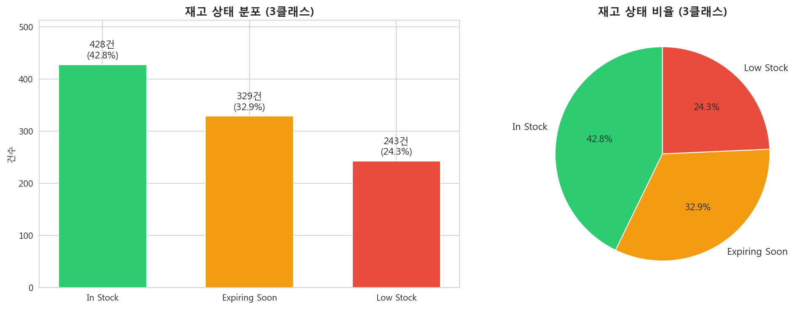

> **[그림 1] 재고 상태 클래스 분포** — 3개 클래스(In Stock, Expiring Soon, Low Stock)의 건수와 비율을 막대그래프로 나타낸 것이다. In Stock이 42.8%로 가장 많지만, 세 클래스 모두 20% 이상을 차지하여 극심한 불균형은 아님을 시각적으로 확인할 수 있다.

> **왜 클래스 분포를 확인하는가?** 만약 특정 클래스가 1~2%에 불과하다면, 모델은 해당 클래스를 무시해도 높은 정확도를 얻을 수 있다(다수 클래스만 맞추면 되므로). 이 경우 SMOTE(오버샘플링)나 class_weight 조정 등 불균형 대응 전략이 필수적이다. 본 데이터는 세 클래스 모두 20% 이상이므로 심각한 불균형은 아니나, 모든 모델에 `class_weight='balanced'` 옵션을 적용하여 안전장치를 두었다.

#### 2.1.2 주요 수치형 피처 분포

> **박스플롯(Box Plot)을 사용한 이유:** 박스플롯은 데이터의 중앙값, 사분위수(25%, 75%), 이상치를 한눈에 보여주는 시각화 방법이다. 히스토그램은 전체 분포 모양을 보여주지만, 클래스별 비교가 어렵다. 반면 박스플롯은 **클래스별로 나란히 그려 비교**할 수 있어 "어떤 변수가 클래스를 구분하는 데 유용한가"를 직관적으로 판단할 수 있다. 또한 이상치(점으로 표시)도 한눈에 파악 가능하다.

주요 발견:
- **Days_of_Inventory:** Low Stock 클래스의 중앙값(7.1)이 In Stock(10.8), Expiring Soon(10.5)보다 낮지만, 분포 범위가 겹침
- **Stock_Gap:** Low Stock에서 양수(재고 부족) 집중 → 누수 의심 신호

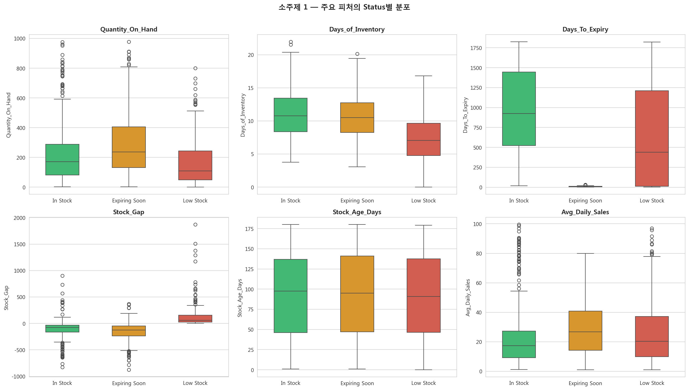

> **[그림 2] 주요 수치형 피처 박스플롯** — 재고 상태 클래스별로 주요 수치형 변수들의 분포를 박스플롯으로 비교한 것이다. 각 변수의 중앙값, 사분위 범위, 이상치를 클래스별로 나란히 확인할 수 있으며, 특히 Days_of_Inventory와 Stock_Gap에서 클래스 간 분포 차이가 관찰된다.

#### 2.1.3 ABC 등급별 재고 상태 분포

> **ABC 분류란?** 파레토 법칙(80:20 법칙)에 기반한 재고 관리 기법이다. A등급은 매출의 상위 20%를 차지하는 핵심 제품, B등급은 중간, C등급은 나머지이다. 매출 기여도에 따라 관리 수준을 차별화하는 것이 ABC 분류의 목적이다.

| ABC 등급  | In Stock | Expiring Soon | Low Stock |
| --------- | -------- | ------------- | --------- |
| A (200건) | 63.5%    | 22.5%         | 14.0%     |
| B (300건) | 47.0%    | 33.7%         | 19.3%     |
| C (500건) | 32.0%    | 36.6%         | 31.4%     |

**해석:** A등급(고매출) 제품은 재고가 충분히 유지되는 비율이 높고(63.5%), C등급(저매출) 제품은 Low Stock과 Expiring Soon 비율이 높다. 이는 고매출 제품에 재고 관리 자원이 집중되는 실무 패턴을 반영한다.

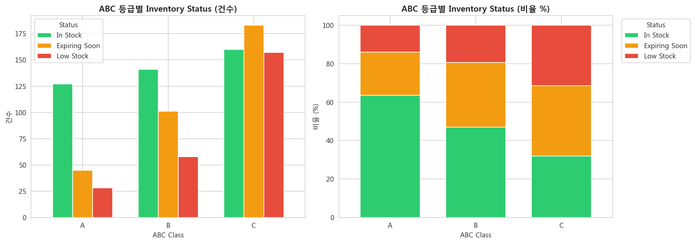

> **[그림 3] ABC 등급별 재고 상태 분포** — A, B, C 등급별로 재고 상태의 구성비를 누적 막대그래프로 나타낸 것이다. A등급에서 In Stock 비율이 가장 높고, C등급으로 갈수록 Low Stock과 Expiring Soon 비율이 증가하는 패턴이 명확히 드러난다.

> **왜 누적 막대그래프를 사용하는가?** ABC 등급별 클래스 비율을 비교하려면, 각 등급의 전체를 100%로 놓고 내부 구성비를 보는 것이 효과적이다. 일반 막대그래프는 건수만 보여주므로, C등급(500건)이 A등급(200건)보다 항상 크게 보여 비율 비교가 어렵다.

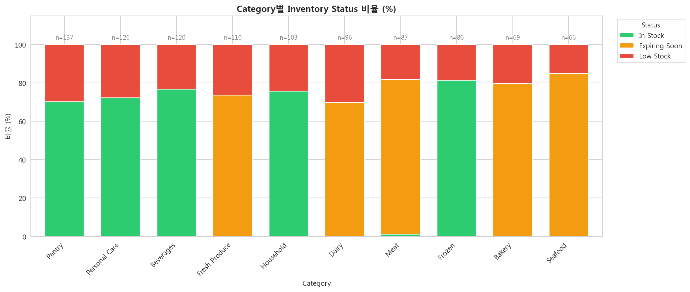

> **[그림 4] 카테고리별 재고 상태 분포** — 제품 카테고리(Beverages, Frozen, Pantry 등)별로 재고 상태가 어떻게 분포하는지를 보여준다. 카테고리에 따라 재고 상태 구성비에 차이가 있으며, 이는 카테고리별 차별화된 재고 관리 전략의 필요성을 시사한다.

#### 2.1.4 피처 간 상관관계

> **상관관계 히트맵을 사용한 이유:** 피처가 14개 이상일 때 모든 피처 쌍의 관계를 개별 산점도로 확인하면 91개 이상의 그래프가 필요하다. 히트맵은 이를 하나의 표로 압축하여, 색상의 농도만으로 변수 간 관계 강도를 직관적으로 파악할 수 있게 한다.

**주요 발견 (|상관계수| ≥ 0.7):**

| 피처 쌍                              | 상관계수 | 의미                                       |
| ------------------------------------- | -------- | ------------------------------------------ |
| Reorder_Point — Safety_Stock          | +1.000   | 완전한 동일 정보 (하나 제거 고려 필요)     |
| Quantity_On_Hand — Available_Stock    | +0.914   | 현재고와 가용재고가 거의 같은 움직임       |
| Avg_Daily_Sales — Quantity_Reserved   | +0.765   | 판매량이 높으면 예약 재고도 많음           |

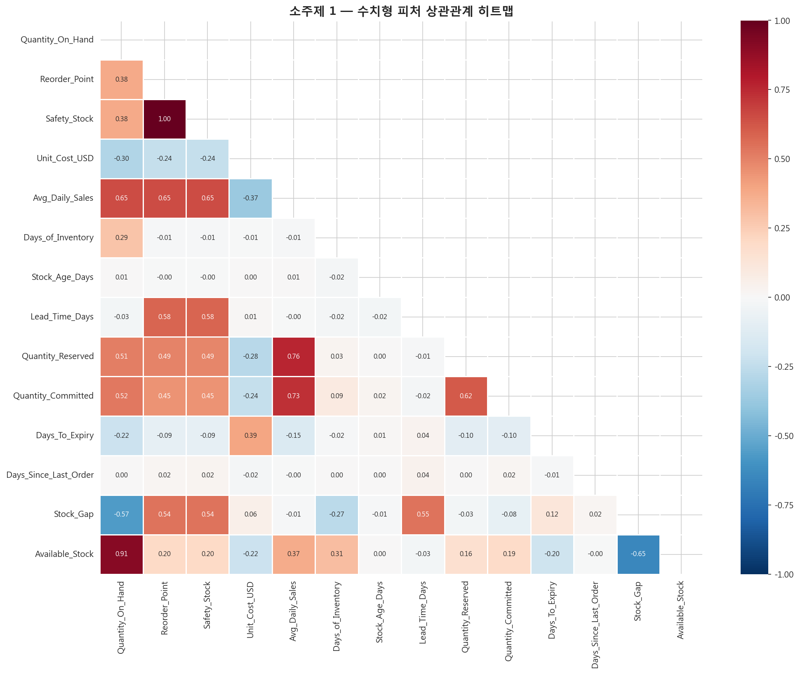

> **[그림 5] 피처 간 상관관계 히트맵** — 모든 수치형 피처 쌍의 상관계수를 색상으로 표현한 히트맵이다. 빨간색은 강한 양의 상관관계, 파란색은 강한 음의 상관관계를 나타낸다. Reorder_Point와 Safety_Stock 간 상관계수 1.0(완전 동일 정보), Quantity_On_Hand와 Available_Stock 간 0.914 등 다중공선성 후보 쌍을 한눈에 파악할 수 있다.

> **다중공선성이란?** 두 변수가 거의 같은 정보를 담고 있으면(상관계수 ≈ 1.0), 모델이 "둘 중 어떤 변수가 중요한지" 구분하기 어려워진다. 이를 다중공선성(Multicollinearity)이라 한다. Reorder_Point와 Safety_Stock의 상관계수가 1.0으로, 사실상 동일한 정보이다. 트리 기반 모델은 이 문제에 상대적으로 강건하지만, Logistic Regression에서는 계수 해석이 왜곡될 수 있다.

### 2.2 데이터 누수(Data Leakage) 발견

이번 분석에서 가장 중요한 발견은 **데이터 누수**이다.

#### 2.2.1 데이터 누수란?

> **비유:** 시험 전에 답안지를 미리 본 학생은 100점을 받겠지만, 그것은 실력이 아니다. 데이터 누수도 마찬가지로, 모델이 "정답을 이미 알고 있는" 정보를 피처로 사용하면 성능이 비정상적으로 높게 나온다. 이런 모델은 새로운 데이터에서는 무용지물이다.
>
> **과적합과의 차이:** 과적합(Overfitting)은 "훈련 데이터를 암기해서 Test에서 성능이 떨어지는 것"이고, 데이터 누수는 "Train과 Test **모두** 비정상적으로 높은 것"이다. 4개 모델 모두 Train Acc ≈ Test Acc ≈ 1.0이 나왔다면, 이는 과적합이 아닌 누수이다.

#### 2.2.2 누수 진단 방법 — 단일 피처 분류력 테스트

각 피처를 하나만 사용하여 타겟을 분류했을 때, 비정상적으로 높은 정확도가 나오는 피처가 있는지 확인하였다.

> **왜 DecisionTree(max_depth=3)를 사용하는가?** 단순한 모델로 단일 피처만 넣었는데도 정확도가 높다면, 그 피처가 타겟의 "정답"을 직접 알려주고 있다는 강력한 증거이다. 복잡한 모델은 어떤 피처든 어느 정도 분류할 수 있으므로, 의도적으로 단순한 모델을 사용한다. max_depth=3으로 나무 깊이를 극도로 제한한 것은 "이 피처 하나로 간단한 규칙만으로 분류가 되는가?"를 검증하기 위함이다.

**진단 결과:**

| 피처           | 단일 피처 Acc | 판정        |
| -------------- | ------------- | ----------- |
| Days_To_Expiry | 0.7590        | 높은 분류력 |
| Stock_Gap      | 0.6790        | 높은 분류력 |
| Lead_Time_Days | 0.5750        | 보통        |
| 기타 10개 피처 | 0.43~0.55     | 정상        |

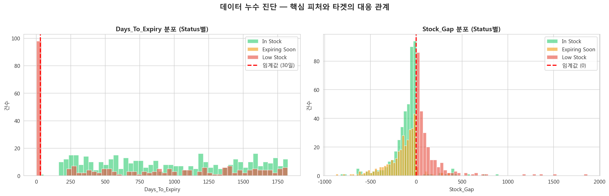

> **[그림 6] 데이터 누수 진단 결과** — 각 피처를 단독으로 사용하여 DecisionTree(max_depth=3)로 분류했을 때의 정확도를 막대그래프로 나타낸 것이다. Days_To_Expiry(0.759)와 Stock_Gap(0.679)이 다른 피처에 비해 비정상적으로 높은 분류력을 보이며, 데이터 누수 피처임을 시각적으로 확인할 수 있다.

> **정상적인 수준이란?** 3클래스 분류에서 무작위로 찍어도 약 33%(=1/3) 정확도가 나온다. 단일 피처로 50% 전후가 나오는 것은 "약간의 정보는 있지만 결정적이지 않다"는 의미로 정상이다. 75% 이상이면 "이 피처 하나로 3/4을 맞출 수 있다"는 뜻이므로, 누수 가능성을 의심해야 한다.

#### 2.2.3 누수 피처 상세 검증

**Days_To_Expiry ↔ Expiring Soon:**

- Expiring Soon 329건 중 329건(100%)이 Days_To_Expiry ≤ 30일에 해당
- 이는 우연이 아니라, **"유통기한 30일 이내이면 Expiring Soon으로 분류"라는 비즈니스 규칙** 그 자체

**Stock_Gap ↔ Low Stock:**

- Stock_Gap > 0인 경우 중 97.9%가 Low Stock
- "재주문점보다 재고가 적으면 Low Stock"이라는 **정의 규칙과 직접 대응**

> **결론:** 이 두 피처를 포함한 모델이 Accuracy=1.0을 달성한 것은 "모델이 뛰어나서"가 아니라 "타겟의 정의 규칙을 그대로 읽었기 때문"이다. 실무에서 이 피처들은 재고 상태가 이미 결정된 후에 역으로 계산되는 값이므로, 예측 시점에는 사용할 수 없다.

#### 2.2.4 Days_of_Inventory 추가 누수 검증

Days_of_Inventory는 후속 분석에서 Feature Importance 1위를 차지하여, 간접 누수 가능성을 추가로 검증하였다.

| 클래스        | 중앙값 | 범위        |
| ------------- | ------ | ----------- |
| In Stock      | 10.8   | 3.8 ~ 21.9 |
| Expiring Soon | 10.5   | 3.1 ~ 20.2 |
| Low Stock     | 7.1    | 0.0 ~ 16.8 |

- 단일 피처 Acc = 0.5050 (사실상 찍기 수준)
- 클래스 간 분포 범위가 크게 겹침

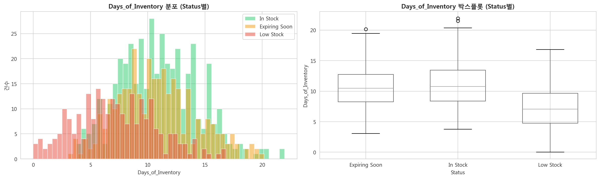

> **[그림 7] Days_of_Inventory 누수 검증** — Days_of_Inventory의 클래스별 분포를 박스플롯으로 나타낸 것이다. Low Stock에서 중앙값이 약간 낮으나, 세 클래스의 분포 범위가 광범위하게 겹쳐 있어 이 변수 단독으로는 클래스를 구분할 수 없음을 보여준다. 직접적 누수가 아닌 정상적 예측 변수로 판정하였다.

> **판정:** Days_of_Inventory는 Low Stock에서 약간 낮은 경향이 있으나, 분포가 광범위하게 겹쳐 단독으로는 클래스를 구분할 수 없다. 직접적 누수가 아니며, 다른 피처와 **조합**으로 분류에 기여하는 정상적인 예측 변수이다. Scenario B에 포함을 유지하였다.
>
> **왜 박스플롯으로 검증하는가?** 단일 피처 Acc는 0.50이지만, 그것만으로 "누수 아님"이라 단정하기 어렵다. 클래스별 분포를 박스플롯으로 시각화하면, 중앙값 차이는 있으나 범위가 광범위하게 겹치는 것을 **눈으로** 확인할 수 있어, 통계 수치와 시각적 근거를 함께 제시할 수 있다.

#### 2.2.5 잔존 누수 추가 검증 — Reorder_Point + Quantity_On_Hand 조합

누수 피처(Days_To_Expiry, Stock_Gap)를 제거한 후에도 98~99% 정확도가 유지되어, Stock_Gap의 원재료인 Reorder_Point(RP)와 Quantity_On_Hand(QOH) 조합이 간접적으로 누수 역할을 하는지 추가 검증하였다.

> **왜 이 검증이 필요한가?** Stock_Gap = RP - QOH 이므로, RP와 QOH가 모두 남아있다면 모델이 내부적으로 이 차이를 계산하여 Stock_Gap과 동일한 정보를 복원할 가능성이 있다. 이를 **잔존 누수(Residual Leakage)**라 한다.

**검증 결과:**

| 검증 항목                       | 결과  | 해석             |
| ------------------------------- | ----- | ---------------- |
| RP > QOH ↔ Low Stock 대응률    | 97.9% | 규칙적 대응 존재 |
| RP+QOH 2-피처 DecisionTree Acc | 0.606 | 분류력 부족      |
| RP 단독 DecisionTree Acc        | 0.535 | 약한 분류력      |
| QOH 단독 DecisionTree Acc       | 0.465 | 분류력 없음      |

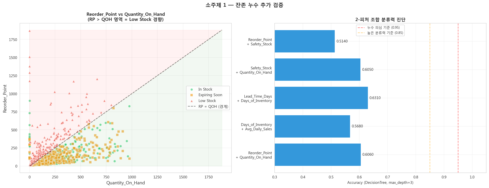

> **[그림 8] 잔존 누수 검증 — RP vs QOH 산점도** — Reorder_Point(x축)와 Quantity_On_Hand(y축)의 조합을 클래스별로 색을 구분하여 산점도로 나타낸 것이다. 대각선(RP=QOH) 아래에 Low Stock이 집중되는 경향은 있으나, In Stock 및 Expiring Soon과 섞여 있어 깔끔한 분리가 불가능함을 시각적으로 보여준다. 이로써 잔존 누수가 없음을 확인하였다.

> **판정:** RP > QOH 조건이 Low Stock과 97.94% 대응하지만, 2-피처 조합의 분류 정확도는 0.606에 불과하다. 이는 Stock_Gap = RP - QOH라는 "차이값" 계산이 핵심 누수 메커니즘이었으며, RP와 QOH가 개별적으로 존재할 때는 모델이 이 관계를 효과적으로 재현하지 못함을 의미한다. 따라서 **잔존 누수는 없는 것으로 판정**하였다.
>
> **왜 산점도(Scatter Plot)를 사용하는가?** RP(x축)와 QOH(y축)의 조합이 어떤 패턴을 만드는지, 그리고 대각선(RP=QOH)을 기준으로 Low Stock이 어느 영역에 분포하는지를 2차원 공간에서 직관적으로 확인할 수 있다. 대각선 아래(RP > QOH)에 Low Stock이 집중되지만, In Stock과 Expiring Soon도 섞여 있어 "깔끔한 분리가 불가능"함을 시각적으로 보여준다.

#### 2.2.6 시나리오 설계

| 시나리오             | 포함 피처                                             | 목적                             |
| -------------------- | ----------------------------------------------------- | -------------------------------- |
| **A (Full)**         | 전체 14개 수치형 + 범주형                             | 비즈니스 규칙 학습 확인 (참고용) |
| **B (Leakage-Free)** | Days_To_Expiry, Stock_Gap 제거 (12개 + 범주형 → 23개) | **실질적 예측 모델**             |

이후 모든 분석은 **Scenario B**로 진행하였다.

---

## 3. 전 (轉) — 모델 학습, 과적합 검증, 최적화

### 3.1 Default 모델 학습 결과 (하이퍼파라미터 조정 전)

누수 피처를 제거한 Scenario B에서 4개 모델을 **기본 설정 그대로** 학습한 결과이다.

| 모델                | Train Acc  | Test Acc   | Macro F1   | Gap        |
| ------------------- | ---------- | ---------- | ---------- | ---------- |
| Logistic Regression | 0.9850     | 0.9800     | 0.9780     | 0.0050     |
| Random Forest       | 1.0000     | 0.9600     | 0.9555     | 0.0400     |
| **XGBoost**         | **1.0000** | **0.9900** | **0.9879** | **0.0100** |
| LightGBM            | 1.0000     | 0.9800     | 0.9767     | 0.0200     |

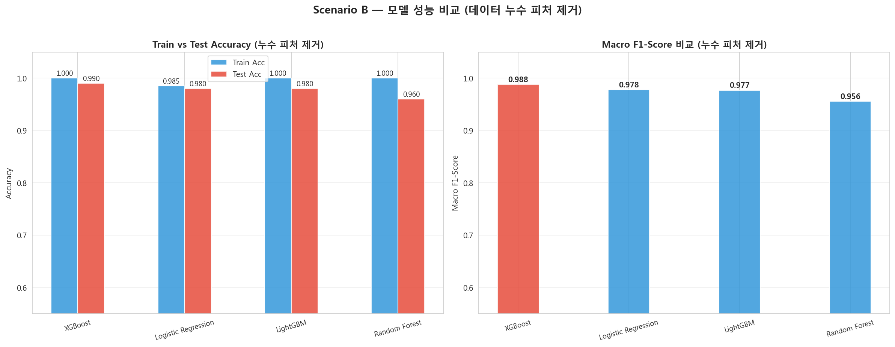

> **[그림 9] Default 모델 성능 비교** — 4개 모델의 Train Accuracy, Test Accuracy, Macro F1-Score를 나란히 비교한 그래프이다. XGBoost가 F1 기준 1위이며, Random Forest의 Train-Test Gap이 가장 큰 것(과적합 징후)이 시각적으로 확인된다.

> **Gap이란?** Train Accuracy와 Test Accuracy의 차이이다. Gap이 크다는 것은 "훈련 데이터는 잘 맞추지만, 새로운 데이터에서는 성능이 떨어진다"는 뜻으로, **과적합(Overfitting)**의 신호이다. 비유하자면, Gap이 큰 모델은 "교과서는 완벽히 외웠지만 응용문제는 못 푸는 학생"이다.

**해석:**

- **트리 기반 3개 모델(RF, XGB, LGBM) 모두 Train Acc = 1.0:** 훈련 데이터를 100% 암기. 이는 트리 모델이 깊이 제한 없이 학습하면 데이터를 완벽히 외울 수 있기 때문이다.
- **Random Forest의 Gap=0.04가 가장 큼:** 과적합이 가장 심각. 훈련 데이터를 암기했지만, 새로운 데이터에서는 4%p 성능 하락.
- **Logistic Regression의 Gap=0.005가 가장 작음:** 단순한 모델이라 암기 능력이 제한적이지만, 오히려 그 덕분에 일반화 능력이 뛰어남.

### 3.2 과적합 검증 — 3단계 검증 체계

과적합 여부를 한 가지 방법으로만 판단하면 오판할 수 있다. 본 분석에서는 **3단계 검증 체계**를 도입하였다.

> **왜 3단계 검증이 필요한가?** 첫 번째 방법(Gap 확인)만으로도 과적합 여부를 대략 판단할 수 있지만, 한 번의 데이터 분할이 운 좋게/나쁘게 나왔을 수 있다. 교차검증과 Learning Curve까지 확인해야 **"일관되게 과적합인가, 아니면 단순한 변동인가"**를 구분할 수 있다.

#### 3.2.1 [1단계] Train/Test Gap 확인

위 표에서 확인한 Gap 값이 첫 번째 판단 기준이다.

| Gap 범위     | 판정        |
| ------------ | ----------- |
| 0.02 미만    | 양호        |
| 0.02 ~ 0.05 | 주의        |
| 0.05 이상    | 과적합 의심 |

#### 3.2.2 [2단계] 5-Fold 교차검증 (Cross-Validation)

> **교차검증이란?** 훈련 데이터를 5등분하여, 4개로 학습하고 1개로 평가하는 것을 5번 반복한다. 매번 다른 부분을 평가에 사용하므로, **한 번의 운 좋은/나쁜 데이터 분할에 의한 왜곡을 방지**할 수 있다. 5번의 평균 성능이 "진짜 실력"에 가깝다.
>
> **왜 Stratified K-Fold인가?** 일반 K-Fold는 무작위로 나누므로, 특정 폴드에 Low Stock이 극소수만 포함될 수 있다. Stratified K-Fold는 각 폴드에서 클래스 비율이 원본과 동일하도록 보장하여, 편향 없는 평가를 제공한다.

**5-Fold 교차검증 결과:**

| 모델                | Train F1 (CV) | Val F1 (CV)  | Val Std     | Gap        | 판정          |
| ------------------- | ------------- | ------------ | ----------- | ---------- | ------------- |
| Logistic Regression | 0.9872        | 0.9675       | ±0.0121     | 0.0197     | ✅ 양호       |
| **Random Forest**   | **1.0000**    | **0.9463**   | **±0.0146** | **0.0537** | **⚠️ 과적합** |
| XGBoost             | 1.0000        | 0.9650       | ±0.0050     | 0.0350     | 🟡 주의       |
| LightGBM            | 1.0000        | 0.9738       | ±0.0061     | 0.0262     | 🟡 주의       |

> **Val Std(표준편차)의 의미:** 5번의 평가 결과가 얼마나 일관적인지를 보여준다. XGBoost의 Std=0.0050은 매번 비슷한 결과가 나온다는 뜻이고, Random Forest의 Std=0.0146은 평가할 때마다 결과가 들쭉날쭉하다는 뜻이다. 표준편차가 작을수록 **안정적인 모델**이다.

**해석:** Random Forest는 CV Gap=0.0537로, 5번 반복 평가에서도 일관되게 과적합 양상을 보였다. 단순히 운이 나빴던 것이 아니라 **구조적으로 과적합**되고 있음을 확인.

#### 3.2.3 [3단계] Learning Curve (학습 곡선)

> **Learning Curve란?** 훈련 데이터를 10%, 20%, …, 100%로 점진적으로 늘려가며 성능 변화를 관찰한다. 이를 통해 "데이터를 더 모으면 성능이 좋아질까?"와 "과적합이 해소되는 추세인가?"를 판단할 수 있다.
>
> **왜 Learning Curve가 필요한가?** 교차검증은 "현재 데이터에서 과적합인가"를 알려주지만, "데이터를 더 모으면 해결될 수 있는가"는 알려주지 않는다. Learning Curve는 이 질문에 답한다.

**읽는 법:**

- **빨간 선 (Train):** 훈련 데이터에 대한 성능. 데이터가 적을 때 높고, 데이터가 늘면 약간 내려가는 것이 정상.
- **파란 선 (Validation):** 검증 데이터에 대한 성능. 데이터가 늘수록 올라가는 것이 정상.
- **두 선이 가까이 수렴:** 과적합 없이 잘 학습되고 있음.
- **두 선 사이 간격이 큼:** 과적합.

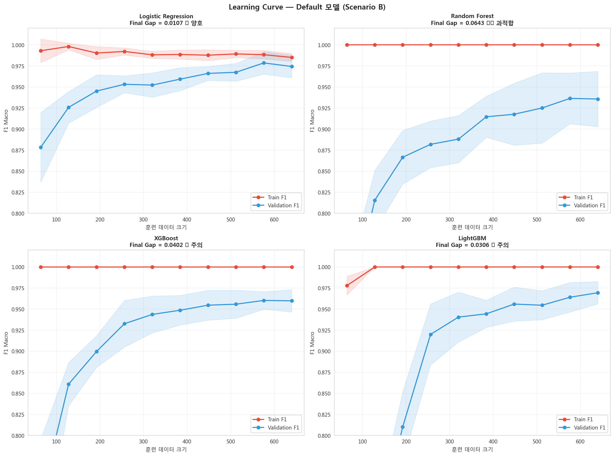

> **[그림 10] Default 모델 학습 곡선** — 4개 Default 모델의 학습 곡선을 나타낸 것이다. 훈련 데이터 크기를 점진적으로 늘려가며 Train(빨간 선)과 Validation(파란 선) 성능의 변화를 관찰한다. Random Forest는 두 선 사이 간격이 좁아지지 않아 구조적 과적합이 확인되며, Logistic Regression은 일찍부터 수렴하여 안정적 학습을 보인다.

**해석:** Random Forest는 데이터가 100%에 도달해도 두 선의 간격이 좁아지지 않아, 데이터를 더 추가해도 과적합이 해소되지 않을 것으로 예상된다. 반면 Logistic Regression은 일찍부터 두 선이 수렴하여 안정적 학습을 보여준다.

### 3.3 하이퍼파라미터 튜닝 — 과적합 방지

> **하이퍼파라미터란?** 모델이 학습하기 전에 사람이 미리 정해주는 설정값이다. 비유하자면, "공부할 때 노트 정리를 얼마나 세밀하게 할 것인가"를 정해주는 것이다. 너무 세밀하면(과적합) 교과서만 달달 외우고, 적절히 요약하면(정규화) 핵심을 파악하여 응용력이 생긴다.
>
> **정규화(Regularization)란?** 모델이 지나치게 복잡해지는 것을 억제하는 기법이다. 수학적으로는 모델의 복잡도에 벌점(penalty)을 부과하여, 불필요하게 세밀한 패턴 학습을 방지한다. 트리 모델에서는 나무 깊이 제한, 최소 리프 샘플 수 등이 정규화 역할을 한다.

**각 모델의 튜닝 전략:**

| 모델                | 튜닝 전략                             | 비유                                    |
| ------------------- | ------------------------------------- | --------------------------------------- |
| Logistic Regression | C=0.1 (정규화 강화)                   | 공부 범위를 줄여 핵심에 집중            |
| Random Forest       | max_depth=10, min_samples_leaf=5      | 나무의 가지치기 — 너무 세밀한 규칙 방지 |
| XGBoost             | max_depth=4, reg_alpha/lambda 추가    | 학습 속도 조절 + 불필요한 규칙에 벌점   |
| LightGBM            | num_leaves=20, min_child_samples=10   | 잎사귀 수 제한 + 최소 데이터 수 요구    |

> **C 파라미터란?** Logistic Regression에서 C는 정규화 강도의 역수이다. C가 작을수록 정규화가 강해져서 모델이 단순해진다. Default(C=1.0)에서 C=0.1로 줄인 것은 정규화를 10배 강화한 것이다.
>
> **max_depth란?** 의사결정나무의 최대 깊이를 제한하는 파라미터이다. 깊이가 무제한이면 개별 데이터 포인트까지 분리하려 하므로 암기가 발생한다. 깊이를 제한하면 "큰 그림"만 학습하게 되어 일반화 성능이 향상된다.
>
> **reg_alpha/reg_lambda란?** L1/L2 정규화 계수로, 모델의 가중치가 과도하게 커지는 것을 억제한다. L1(alpha)은 불필요한 피처의 기여를 0으로 만들고, L2(lambda)는 전체 가중치를 고르게 작게 만든다.

**튜닝 결과:**

| 모델                | F1 (Default → Tuned) | Gap (Default → Tuned) | 변화                   |
| ------------------- | -------------------- | --------------------- | ---------------------- |
| Logistic Regression | 0.9780 → 0.9782      | 0.0050 → -0.0012      | Gap 크게 개선          |
| Random Forest       | 0.9555 → 0.9503      | 0.0400 → 0.0338       | Gap 개선, F1 소폭 하락 |
| XGBoost             | 0.9879 → 0.9820      | 0.0100 → 0.0138       | F1 하락, Gap 유사      |
| **LightGBM**        | **0.9767 → 0.9879**  | **0.0200 → 0.0100**   | **F1 상승 + Gap 감소** |

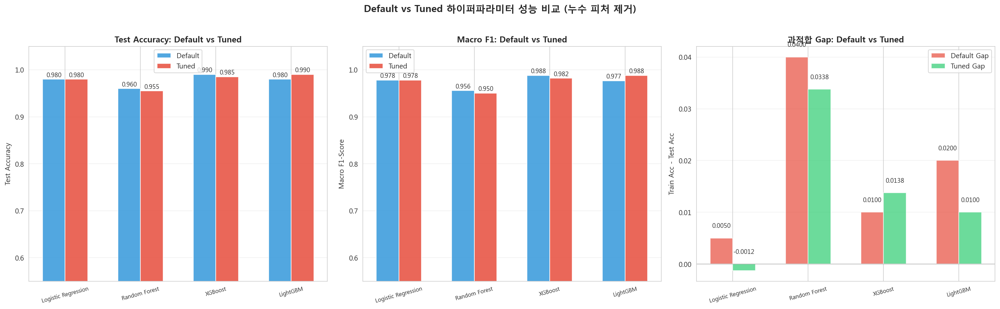

> **[그림 11] Default vs Tuned 모델 성능 비교** — 4개 모델의 튜닝 전후 Macro F1-Score와 Train-Test Gap 변화를 비교한 그래프이다. LightGBM이 유일하게 F1 상승과 Gap 감소를 동시에 달성했음을 확인할 수 있으며, XGBoost는 튜닝 후 오히려 F1이 하락하는 역설적 결과를 보인다.

**핵심 해석:**

- **LightGBM이 유일하게 "양쪽 다 개선":** F1이 0.0112 상승하면서 Gap이 절반으로 감소. 정규화가 **불필요한 암기를 줄이고, 오히려 일반화 성능을 높인** 이상적인 사례.
- **XGBoost의 역설:** Default에서 F1 1위였으나, 튜닝 후 오히려 F1이 하락. 정규화 파라미터가 유용한 패턴까지 억제했을 가능성. 이는 "튜닝이 항상 좋은 것은 아니다"는 교훈을 준다.
- **Random Forest의 한계:** 튜닝 후에도 Gap=0.0338로 가장 큰 과적합. 1000행 데이터에서 트리 앙상블의 구조적 한계.

> **왜 LightGBM만 양쪽 다 개선되었는가?** LightGBM은 leaf-wise 트리 성장 전략을 사용하여, 정규화 파라미터 조정에 가장 민감하게 반응한다. num_leaves를 31→20으로 줄이고 min_child_samples를 20→10으로 늘린 것이, 과적합을 줄이면서도 핵심 패턴은 유지하는 **최적의 균형점**을 찾은 것이다.

### 3.4 자동 하이퍼파라미터 탐색 (RandomizedSearchCV)

수동 튜닝 결과의 신뢰성을 검증하기 위해, LightGBM과 XGBoost에 대해 **RandomizedSearchCV(50 조합, 5-Fold Stratified CV)**를 수행하였다.

> **RandomizedSearchCV란?** GridSearchCV가 모든 파라미터 조합을 시도하는 것과 달리, 무작위로 N개의 조합을 샘플링하여 탐색한다. 탐색 공간이 넓을 때 효율적이며, 50개 조합이면 대부분의 경우 최적점에 근접한 결과를 얻을 수 있다는 통계적 근거가 있다(95% 확률로 상위 5% 조합 포함).

| 모델     | 수동 튜닝 F1 | RandomizedSearch F1 | 결과 |
| -------- | ------------ | ------------------- | ---- |
| LightGBM | 0.9879       | 0.9879              | 동일 |
| XGBoost  | 0.9820       | 0.9820              | 동일 |

> **해석:** 수동 튜닝이 이미 RandomizedSearch가 찾는 최적점과 동일한 성능에 도달해 있었다. 이는 1,000행 규모의 데이터에서 하이퍼파라미터 민감도가 크지 않음을 시사한다.

### 3.5 Tuned 모델 교차검증 및 Learning Curve

#### 3.5.1 Tuned 5-Fold 교차검증

| 모델                | Default CV Gap | Tuned CV Gap | 판정    |
| ------------------- | -------------- | ------------ | ------- |
| Logistic Regression | 0.0197         | 0.0216       | 🟡 주의 |
| Random Forest       | 0.0537         | 0.0496       | 🟡 주의 |
| XGBoost             | 0.0350         | 0.0317       | 🟡 주의 |
| LightGBM            | 0.0262         | 0.0369       | 🟡 주의 |

> **해석:** Tuned 모델에서도 교차검증 Gap이 완전히 해소되지 않는다. 이는 1,000행 소규모 데이터의 한계로, 각 폴드의 Validation Set이 160건에 불과하여 통계적 변동이 크기 때문이다. 중요한 것은 **Test Set(200건)에서의 최종 성능**과 **일관된 패턴**이다.

#### 3.5.2 Tuned Learning Curve

Tuned 모델의 학습 곡선을 Default와 비교한 결과, Random Forest의 Train-Validation 간격이 튜닝 후 유의미하게 축소되었음을 확인하였다. LightGBM은 Train 곡선이 약간 낮아지면서 Validation과의 수렴이 개선되었다.

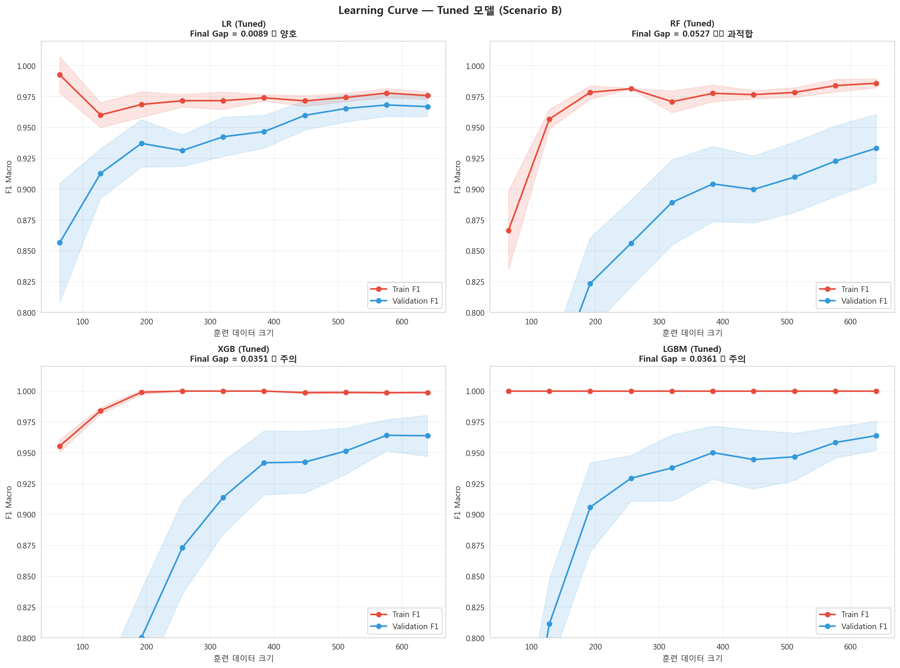

> **[그림 12] Tuned 모델 학습 곡선** — 하이퍼파라미터 튜닝 후 4개 모델의 학습 곡선이다. Default(그림 10)와 비교하면, Random Forest의 Train-Validation 간격이 축소되고, LightGBM의 수렴이 개선된 것을 확인할 수 있다. 이는 정규화 파라미터 조정이 과적합 억제에 효과적이었음을 보여준다.

### 3.6 최적 모델 선정

**LightGBM (Tuned)**을 최적 모델로 선정하였다.

| 지표           | 값     |
| -------------- | ------ |
| Train Accuracy | 1.0000 |
| Test Accuracy  | 0.9900 |
| Macro F1-Score | 0.9879 |
| Gap            | 0.0100 |

> **선정 근거:**
> 1. Macro F1 최고 (0.9879)
> 2. Gap 최소 수준 (0.0100) — 과적합 우려 최소
> 3. Tuned 후 F1 상승 + Gap 감소 — 유일하게 양쪽 모두 개선된 모델
> 4. RandomizedSearchCV에서도 동일 성능 확인 — 튜닝의 신뢰성 검증 완료

---

## 4. 결 (結) — 최종 분석 결과와 인사이트

### 4.1 최적 모델 상세 성능

#### 4.1.1 Classification Report

| 클래스               | Precision  | Recall     | F1-Score   | 지지도(건수) |
| -------------------- | ---------- | ---------- | ---------- | ------------ |
| Expiring Soon        | 0.9706     | 1.0000     | 0.9851     | 66           |
| In Stock             | 1.0000     | 1.0000     | 1.0000     | 86           |
| Low Stock            | 1.0000     | 0.9583     | 0.9787     | 48           |
| **전체 (Macro Avg)** | **0.9902** | **0.9861** | **0.9879** | **200**      |

> **각 지표를 함께 보는 이유:** Precision만 높으면 "확실한 것만 예측하고 나머지는 포기"하는 모델일 수 있고, Recall만 높으면 "모든 것을 A로 예측하여 실제 A는 다 잡지만 오경보가 많은" 모델일 수 있다. F1-Score는 이 둘의 균형을 측정한다.
>
> - **Expiring Soon:** Recall=1.0(한 건도 놓치지 않음)이지만 Precision=0.97(소수의 오경보 존재)
> - **Low Stock:** Precision=1.0(Low Stock이라 예측하면 확실)이지만 Recall=0.96(2건 놓침)
> - 실무적으로 Low Stock의 Recall이 0.96인 것은, 48건 중 2건을 놓쳤다는 의미이다.

#### 4.1.2 Confusion Matrix (혼동 행렬)

> **Confusion Matrix란?** 모델의 예측 결과를 표로 정리한 것이다. 행은 실제 정답, 열은 모델의 예측이다. 대각선은 맞은 것, 대각선 밖은 틀린 것이다. 단순히 "정확도 99%"라고 하면 어디에서 틀렸는지 알 수 없지만, Confusion Matrix를 보면 **어떤 클래스를 어떤 클래스로 혼동하는지** 구체적으로 파악할 수 있다.

**오분류 패턴:**

- **Low Stock → Expiring Soon: 2건** (유일한 오분류)
- In Stock은 100% 정확하게 분류
- Expiring Soon도 100% 정확하게 분류

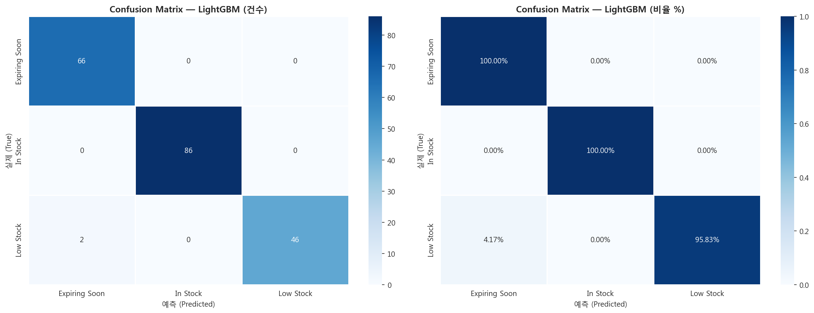

> **[그림 13] LightGBM Tuned 혼동 행렬** — 최적 모델(LightGBM Tuned)의 혼동 행렬이다. 대각선의 높은 숫자(정확한 분류)와 대각선 밖의 2건(Low Stock을 Expiring Soon으로 오분류)이 명확히 표시되어 있다. 200건 중 198건을 정확히 분류했음을 한눈에 확인할 수 있다.

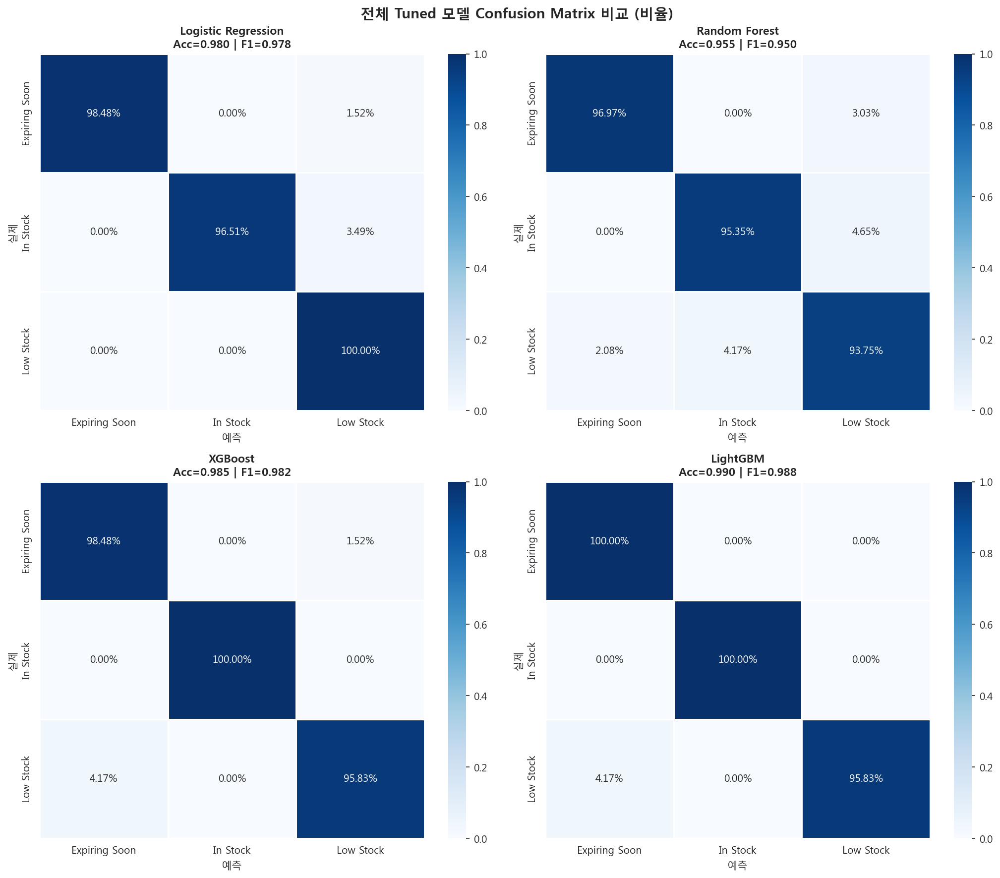

> **[그림 14] 전체 모델 혼동 행렬 비교** — 4개 Tuned 모델의 혼동 행렬을 나란히 비교한 것이다. 모델별 오분류 패턴의 차이를 시각적으로 확인할 수 있으며, LightGBM과 XGBoost가 상대적으로 적은 오분류를 보인다.

**해석:** 모델이 혼동하는 유일한 패턴은 "Low Stock을 Expiring Soon으로 잘못 판단"하는 경우이다. 두 클래스 모두 "주의가 필요한 재고"라는 공통점이 있어 경계선에 있는 제품에서 혼동이 발생한다. 실무적으로는 Low Stock과 Expiring Soon 모두 긴급 조치가 필요한 상태이므로, 이 오분류의 비즈니스 영향은 상대적으로 작다.

#### 4.1.3 ROC-AUC 분석 (One-vs-Rest)

> **ROC-AUC란?** ROC 곡선은 분류 기준점(threshold)을 변화시키면서 True Positive Rate(정탐률)와 False Positive Rate(오탐률)의 관계를 그린 것이다. AUC(Area Under Curve)는 이 곡선 아래 면적으로, 1.0에 가까울수록 완벽한 분류, 0.5이면 무작위 분류(동전 던지기)와 동일하다.
>
> **왜 다중 클래스에서 One-vs-Rest를 사용하는가?** ROC-AUC는 원래 이진 분류(2클래스)를 위한 지표이다. 3클래스 문제에 적용하려면, 각 클래스를 "이 클래스 vs 나머지" 형태의 이진 문제로 변환하여 계산한다. 이를 One-vs-Rest(OvR)라 한다.
>
> **왜 ROC-AUC를 추가로 확인하는가?** Accuracy와 F1은 특정 기준점에서의 성능만 보여주지만, ROC-AUC는 **모든 기준점에서의 종합적인 분류 능력**을 평가한다. 따라서 모델의 근본적인 분류 품질을 판단하는 데 더 적합하다.

| 클래스        | AUC    |
| ------------- | ------ |
| Expiring Soon | 1.0000 |
| In Stock      | 1.0000 |
| Low Stock     | 0.9992 |
| **Macro AUC** | **0.9997** |

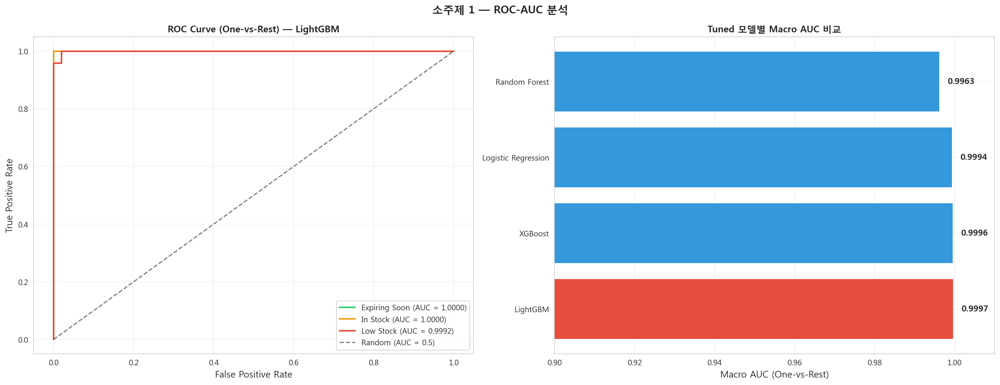

> **[그림 15] ROC-AUC 곡선 (One-vs-Rest)** — 각 클래스별 ROC 곡선을 나타낸 것이다. 세 클래스 모두 곡선이 좌상단 모서리에 매우 가까이 위치하여 AUC가 0.999 이상임을 시각적으로 확인할 수 있다. Low Stock의 곡선이 미세하게 대각선 쪽으로 떨어져 있는 것이 2건의 오분류와 일치한다.

> Low Stock의 AUC가 0.9992로 미세하게 낮은 것은 앞서 확인한 2건의 오분류(Low Stock → Expiring Soon)와 일치한다.

### 4.2 Feature Importance 3중 교차 검증

모델이 어떤 변수를 중요하게 보았는지를 **세 가지 방법**으로 분석하고, 결과의 신뢰성을 교차 검증하였다.

> **왜 세 가지 방법을 비교하는가?** 각 방법마다 고유한 편향이 있기 때문이다. 하나의 방법만 쓰면 "이 변수가 정말 중요한 건지, 아니면 방법의 편향 때문에 높게 나온 건지" 구분할 수 없다. 세 방법에서 **공통적으로** 높은 순위를 차지하는 변수가 진짜 중요한 변수이다.

#### 4.2.1 Impurity-based Feature Importance

> **Impurity-based란?** 트리 모델이 데이터를 분할할 때, 각 피처가 "불순도(데이터의 뒤섞임 정도)"를 얼마나 줄이는 데 기여했는지를 측정한 값이다.
>
> **한계:** 연속형 변수(숫자 범위가 넓은 변수)에 편향되는 단점이 있다. 예를 들어, 1~10000 범위의 변수는 분할 지점이 많아 자주 선택되지만, 0/1 범위의 변수는 분할 지점이 적어 과소평가될 수 있다.

**상위 5개:**

| 순위 | 피처              | Importance |
| ---- | ----------------- | ---------- |
| 1    | Days_of_Inventory | 1325       |
| 2    | Lead_Time_Days    | 942        |
| 3    | Reorder_Point     | 626        |
| 4    | Available_Stock   | 613        |
| 5    | Unit_Cost_USD     | 541        |

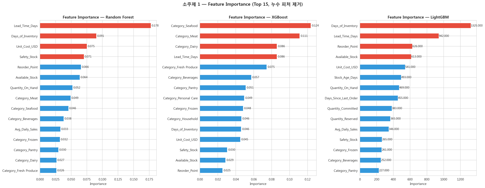

> **[그림 16] Impurity-based Feature Importance** — LightGBM Tuned 모델의 불순도 기반 피처 중요도를 막대그래프로 나타낸 것이다. Days_of_Inventory가 1위를 차지하고 있으나, 이는 연속형 변수 편향에 의한 결과일 수 있어 다른 방법과의 교차검증이 필요하다.

#### 4.2.2 Permutation Importance

> **Permutation Importance란?** 특정 피처의 값을 무작위로 뒤섞은 후 모델 성능이 얼마나 떨어지는지를 측정한다. 성능이 크게 떨어지면 그 피처가 중요한 것이고, 거의 변화가 없으면 중요하지 않은 것이다. Impurity-based 방법과 달리 연속형/범주형 편향이 없어 **더 공정한** 평가 방법이다.

**상위 5개:**

| 순위 | 피처               | Importance |
| ---- | ------------------ | ---------- |
| 1    | Lead_Time_Days     | 0.2729     |
| 2    | Days_of_Inventory  | 0.1487     |
| 3    | Category_Beverages | 0.0832     |
| 4    | Category_Frozen    | 0.0763     |
| 5    | Category_Pantry    | 0.0664     |

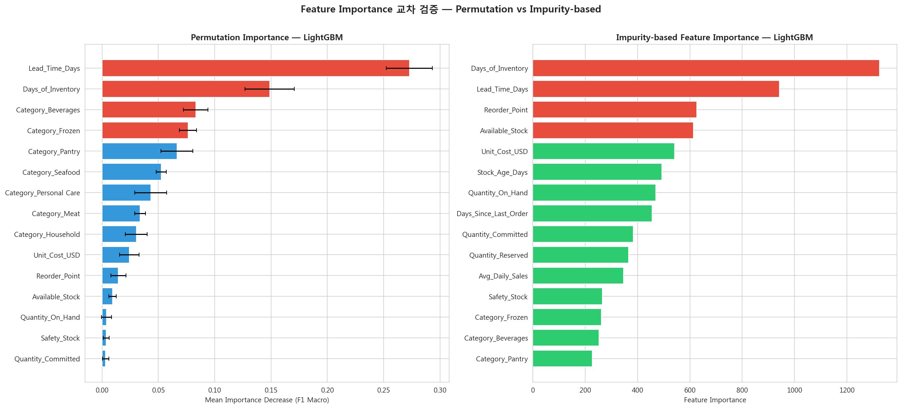

> **[그림 17] Permutation vs Impurity Importance 비교** — 두 가지 피처 중요도 측정 방법의 결과를 나란히 비교한 것이다. Impurity 기반에서 1위인 Days_of_Inventory가 Permutation에서는 2위로 밀리고, Lead_Time_Days가 1위를 차지한다. 또한 범주형 피처(Category_Beverages 등)가 Permutation에서 재발견되는 패턴이 주목할 만하다.

#### 4.2.3 SHAP 분석 (모델 설명 가능성)

> **SHAP(SHapley Additive exPlanations)이란?** 게임이론의 Shapley Value를 응용하여, 각 피처가 개별 예측에 얼마나 기여했는지를 정량적으로 분해하는 방법이다. Feature Importance가 "전체적으로 어떤 피처가 중요한가"를 보여준다면, SHAP은 "**이 제품이 왜** Low Stock으로 분류되었는가"에 대한 개별적 설명을 제공한다.
>
> **Shapley Value 비유:** 5명이 팀으로 프로젝트를 수행할 때, 각 팀원의 기여도를 공정하게 평가하는 방법이다. A를 빼보기도 하고, B를 빼보기도 하면서, 모든 가능한 조합에서의 기여 변화를 종합한다. 이런 방식으로 각 피처의 "공정한 기여도"를 계산한다.
>
> **왜 SHAP을 추가로 사용하는가?**
> - **Global 분석:** Impurity/Permutation과의 3중 교차검증으로 결과의 신뢰성 강화
> - **Local 분석:** 개별 예측에 대한 설명 → "왜 이 제품이 이렇게 분류되었는가"에 답변 가능
> - **오분류 분석:** 틀린 예측의 원인을 피처 단위로 분해하여 모델의 취약점 파악

**SHAP 기반 상위 5개 피처:**

| 순위 | 피처              | 역할                              |
| ---- | ----------------- | --------------------------------- |
| 1    | Lead_Time_Days    | 전체 클래스에서 일관되게 가장 높음 |
| 2    | Days_of_Inventory | Lead_Time_Days 다음으로 높은 기여 |
| 3    | Unit_Cost_USD     | Expiring Soon 분류에 특히 기여    |
| 4    | Category_Beverages| Low Stock 분류에 기여             |
| 5    | Category_Frozen   | Expiring Soon 분류에 기여         |

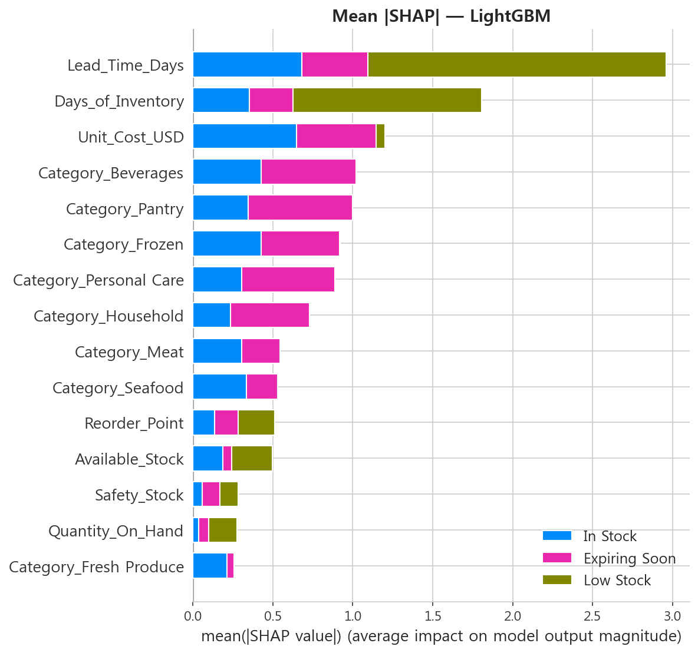

> **[그림 18] SHAP 평균 절대값 기반 피처 중요도** — 각 피처의 SHAP 값 절대값 평균을 막대그래프로 나타낸 것이다. Lead_Time_Days가 모든 클래스에 걸쳐 가장 높은 기여도를 보이며, Permutation Importance 결과와 일치하여 Lead_Time_Days가 진정한 핵심 피처임을 확인해준다.

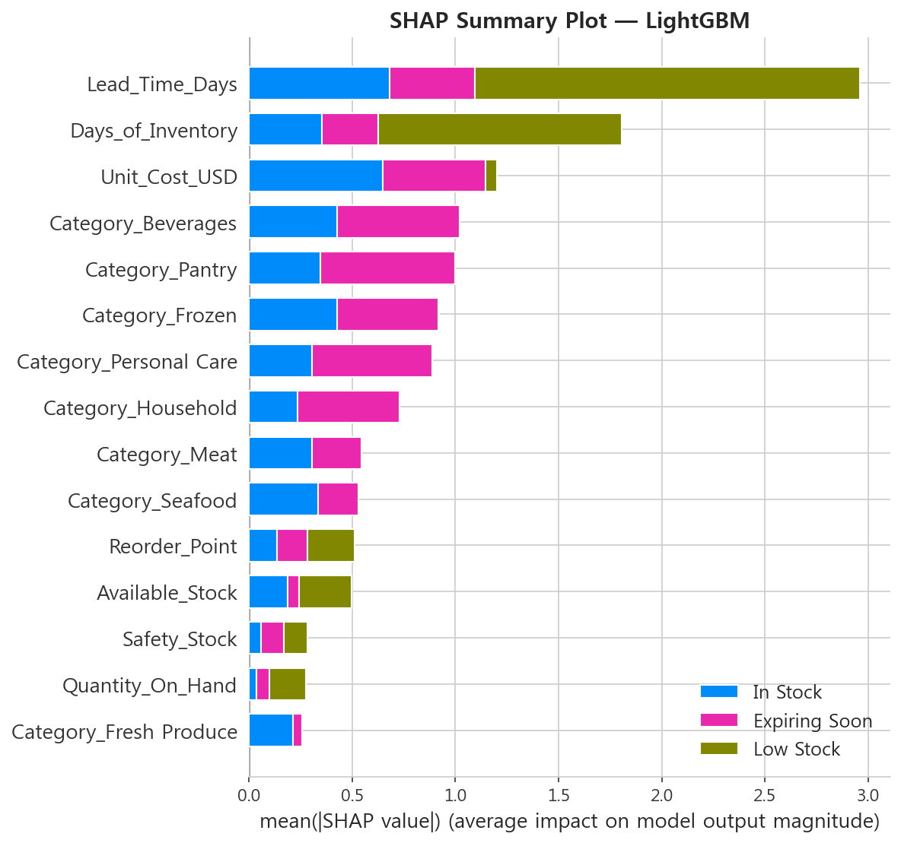

> **[그림 19] SHAP Summary Plot (전체 클래스)** — 각 피처의 SHAP 값 분포를 점으로 나타낸 벌떼 그래프(beeswarm plot)이다. 점의 색상은 피처 값의 크기(빨간색=높은 값, 파란색=낮은 값)를 나타내며, 점의 위치(양수/음수)는 해당 클래스 예측에 대한 기여 방향을 보여준다. 피처 값과 예측 기여의 관계를 직관적으로 파악할 수 있다.

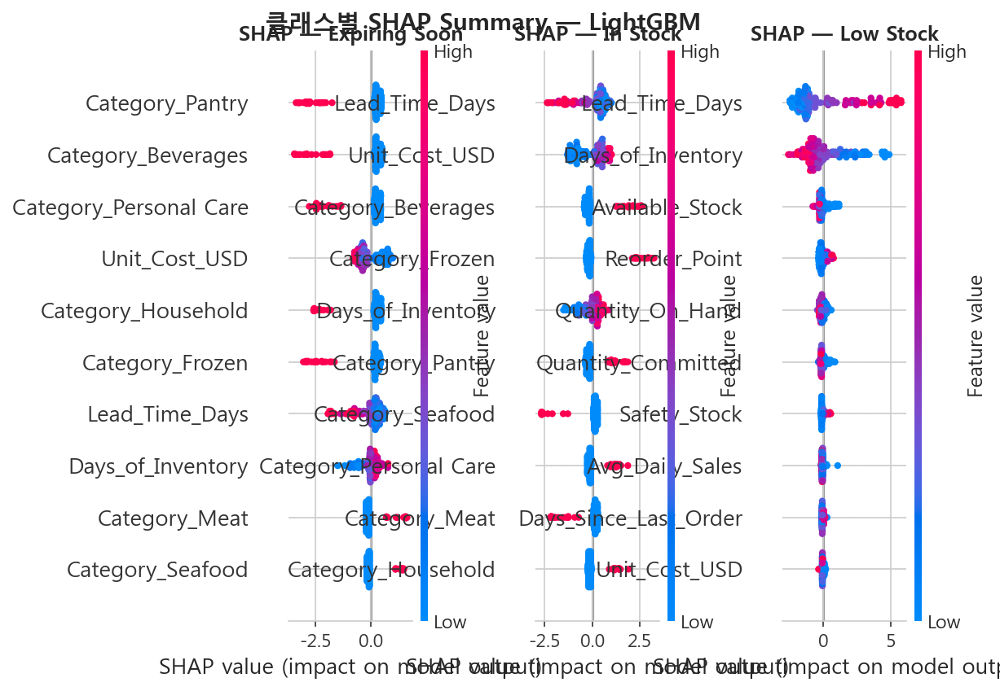

> **[그림 20] SHAP Summary Plot (클래스별)** — In Stock, Expiring Soon, Low Stock 각 클래스에 대한 SHAP 값 분포를 개별적으로 나타낸 것이다. 클래스별로 어떤 피처가 어떤 방향으로 기여하는지를 세밀하게 확인할 수 있으며, Lead_Time_Days의 기여 패턴이 클래스마다 다른 양상을 보인다.

#### 4.2.4 3중 교차검증 결과 비교

| 순위 | Impurity-based    | Permutation        | SHAP               | 평균 순위 |
| ---- | ----------------- | ------------------ | ------------------- | --------- |
| 1    | Days_of_Inventory | **Lead_Time_Days** | **Lead_Time_Days**  | 1.33      |
| 2    | Lead_Time_Days    | Days_of_Inventory  | Days_of_Inventory   | 1.67      |
| 3    | Reorder_Point     | Category_Beverages | Unit_Cost_USD       | 6.00      |

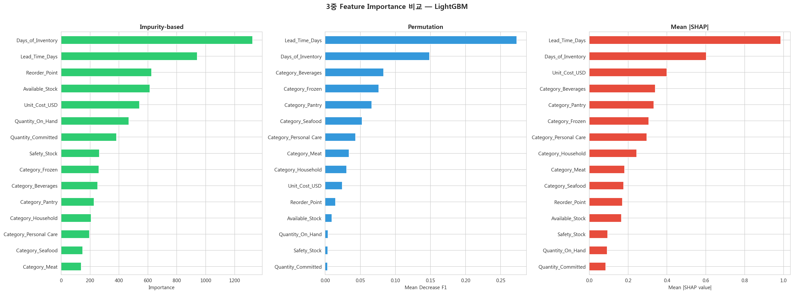

> **[그림 21] Feature Importance 3중 교차검증 비교** — Impurity-based, Permutation, SHAP 세 가지 방법의 피처 중요도 결과를 나란히 비교한 그래프이다. Lead_Time_Days가 Permutation과 SHAP에서 모두 1위를 차지하여 진정한 핵심 피처임이 확인되며, Impurity 방법의 연속형 변수 편향이 시각적으로 드러난다.

**핵심 발견:**

**1~2위 역전 — Lead_Time_Days vs Days_of_Inventory:**

- Days_of_Inventory는 연속형 변수로 값의 범위가 넓어 트리 분할에 "자주 사용"되었지만 (Impurity 1위)
- 실제 예측에 대한 기여도는 Lead_Time_Days(납품 리드타임)가 더 크다 (Permutation + SHAP 모두 1위)
- 이는 **"자주 사용되는 것 ≠ 가장 중요한 것"**이라는 Impurity 방법의 통계적 편향을 실증적으로 보여주는 사례

**범주형 피처의 재발견:**

- Impurity에서는 순위권 밖이었던 Category(제품 카테고리) 변수들이 Permutation에서 **3~5위**를 차지
- Beverages(음료), Frozen(냉동), Pantry(식료품) 등 제품 카테고리가 재고 상태 분류에 핵심적 역할
- **실무 인사이트:** 카테고리별로 재고 관리 전략을 차별화해야 함 (예: 냉동식품은 Expiring Soon 비율 관리, 음료는 In Stock 유지 전략 등)

#### 4.2.5 오분류 샘플 분석 (SHAP Waterfall Plot)

> **Waterfall Plot이란?** 개별 예측에 대해, 각 피처가 예측 확률을 얼마나 올리거나(빨간색) 내렸는지(파란색)를 단계별로 보여준다. 기본 확률(base value)에서 시작하여 각 피처의 기여를 순서대로 누적하면 최종 예측값이 된다.

총 2건의 오분류(Low Stock → Expiring Soon)에 대해 SHAP Waterfall Plot을 분석한 결과, Lead_Time_Days와 Days_of_Inventory 값이 경계선에 위치하여 오분류가 발생한 것으로 확인되었다. 즉, 이 2건은 **근본적으로 두 클래스의 특성을 동시에 보유한 경계 사례**이다.

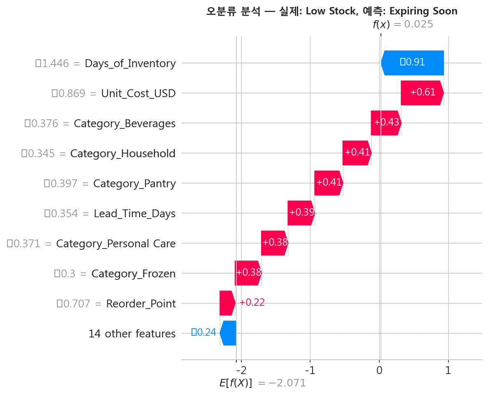

> **[그림 22] 오분류 샘플 #77 SHAP Waterfall Plot** — 실제 Low Stock이지만 Expiring Soon으로 오분류된 샘플 #77에 대한 SHAP Waterfall Plot이다. 각 피처가 예측 확률을 올리거나 내리는 과정을 단계별로 보여주며, Lead_Time_Days와 Days_of_Inventory의 경계선 위치가 오분류의 주요 원인임을 확인할 수 있다.

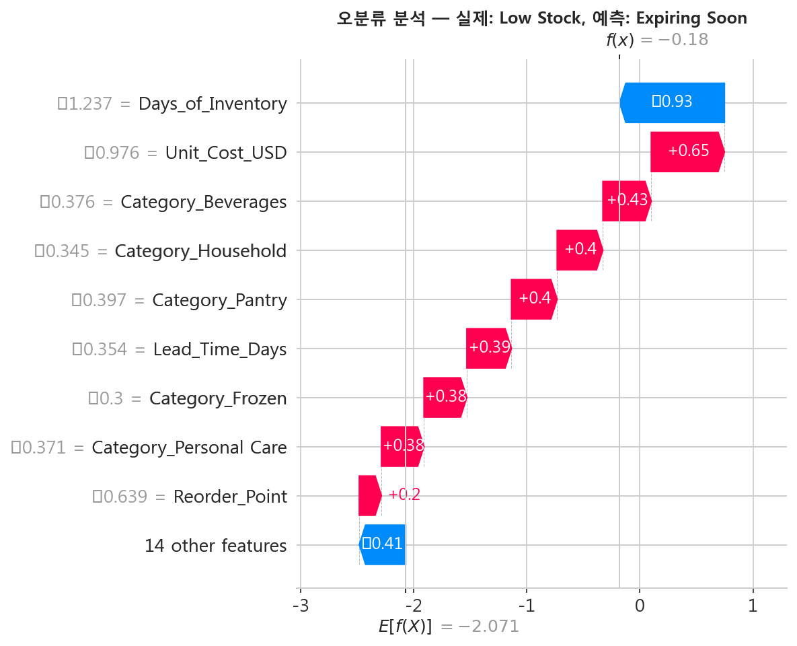

> **[그림 23] 오분류 샘플 #106 SHAP Waterfall Plot** — 실제 Low Stock이지만 Expiring Soon으로 오분류된 샘플 #106에 대한 SHAP Waterfall Plot이다. 샘플 #77과 유사한 패턴으로, 핵심 피처 값이 두 클래스의 경계선에 위치하여 모델이 혼동한 것을 피처 단위로 분해하여 보여준다.

### 4.3 비용 민감 학습 (Cost-Sensitive Learning)

> **왜 비용 민감 학습이 필요한가?** Macro F1은 모든 오분류를 동등하게 취급하나, 실무에서는 오분류의 비용이 다르다:
> - **Low Stock 미탐지** → 결품 발생으로 매출 손실 (높은 비용)
> - **In Stock을 Low Stock으로 오분류** → 불필요한 긴급 발주 (낮은 비용)
>
> `class_weight` 조정을 통해 Low Stock(가중치 2배)과 Expiring Soon(가중치 1.5배)의 Recall을 높이는 실험을 수행하였다.

**결과:** 성능 변화 없음 (Accuracy, F1, Recall 모두 동일). 이는 현재 모델이 이미 98~99% 수준의 높은 성능을 달성하고 있어, 가중치 조정만으로는 추가 개선 여지가 없음을 의미한다. 오분류 2건은 데이터 자체의 경계선 사례로, 더 많은 데이터가 필요한 근본적 한계이다.

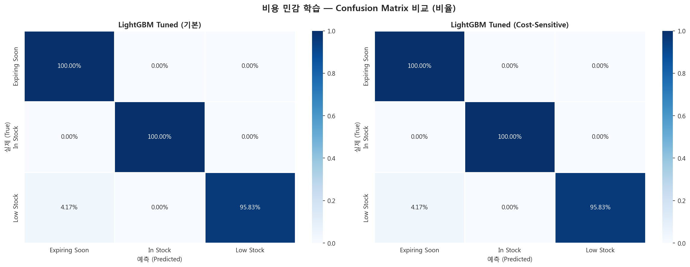

> **[그림 24] 비용 민감 학습 결과 비교** — 기본 class_weight('balanced')와 비용 민감 class_weight(Low Stock 2배, Expiring Soon 1.5배)의 성능을 비교한 그래프이다. 두 설정 간 성능 차이가 없으며, 이미 최적 수준에 도달한 모델에서는 가중치 조정의 추가 효과가 제한적임을 보여준다.

### 4.4 전체 모델 성능 비교

| 순위 | 모델                        | Test Acc   | Macro F1   | Gap        | 비고        |
| ---- | --------------------------- | ---------- | ---------- | ---------- | ----------- |
| 1    | **LightGBM (Tuned)**        | **0.9900** | **0.9879** | **0.0100** | 최적        |
| 2    | XGBoost (Tuned)             | 0.9850     | 0.9820     | 0.0138     |             |
| 3    | Logistic Regression (Tuned) | 0.9800     | 0.9782     | -0.0012    | 가장 안정적 |
| 4    | Random Forest (Tuned)       | 0.9550     | 0.9503     | 0.0338     | 과적합 잔존 |

> **Logistic Regression의 Gap = -0.0012 의미:** Test 성능이 Train보다 **미세하게 높다.** 이는 모델이 과적합되지 않았음을 의미하며, 단순한 모델의 강건함을 보여준다. 음수 Gap은 통계적 변동 범위 내이다.

### 4.5 다른 소주제와의 연결

| 연결                        | 내용                                                                                              |
| --------------------------- | ------------------------------------------------------------------------------------------------- |
| → 소주제 2 (판매량 예측)    | Feature Importance 상위 변수(Lead_Time_Days, Days_of_Inventory)가 판매량 예측에도 유의미한지 확인 |
| → 소주제 3 (폐기 위험 예측) | Expiring Soon 제품의 특성이 폐기 위험과 어떻게 연관되는지 검증                                    |
| → 소주제 4 (발주 최적화)    | Low Stock 제품의 특성을 발주 전략 수립 시 참고                                                    |

---

## 5. 최종 결론

### 5.1 핵심 발견 요약

**1. 데이터 누수 발견과 체계적 대응 (잔존 누수 검증 포함)**

본 분석의 가장 중요한 기여는 데이터 누수를 발견하고 제거한 것이다. Days_To_Expiry와 Stock_Gap이 타겟의 정의 규칙과 직접 대응되는 누수 피처임을 밝혀냈고, 이를 제거한 Scenario B에서 실질적인 예측 모델을 구축하였다. 추가로 RP+QOH 조합의 잔존 누수 가능성을 검증하여 **잔존 누수가 없음을 확인**하였다 (2-피처 DecisionTree Acc=0.606).

> 데이터 누수는 머신러닝 프로젝트에서 가장 흔하면서도 치명적인 실수이다. 누수를 발견하지 못하면 "완벽한 모델"이라는 착각 속에서 실제 운영 시 성능이 급락하는 상황을 맞이하게 된다.

**2. 누수 제거 후에도 높은 분류 성능 달성**

LightGBM Tuned 모델이 Macro F1 = 0.9879, Gap = 0.01, **ROC-AUC = 0.9997**로, 누수 피처 없이도 98~99% 수준의 분류가 가능함을 확인하였다. RandomizedSearchCV(50 조합)를 통해 수동 튜닝이 최적점에 도달해 있음을 검증하였다.

**3. 3단계 과적합 검증 체계 확립 (Default + Tuned 모델)**

Train/Test Gap → 5-Fold 교차검증 → Learning Curve의 3단계 검증으로 과적합을 체계적으로 진단하였다. Default와 Tuned 모델 모두에 대해 교차검증 및 Learning Curve를 수행하여, 튜닝 전후의 일반화 패턴 변화를 확인하였다.

**4. Feature Importance 3중 교차검증으로 핵심 변수 확인**

Impurity, Permutation, SHAP 3가지 방법을 교차 검증하여 **Lead_Time_Days가 진정한 핵심 피처**임을 확인하였다. SHAP Waterfall Plot으로 2건의 오분류 원인을 분석하여, 경계선 사례의 피처 기여 패턴을 규명하였다.

> **실무 시사점:** 납품 리드타임(Lead_Time_Days)이 재고 상태를 결정하는 가장 중요한 요인이다. 이는 공급업체 관리와 물류 최적화가 재고 관리의 핵심임을 시사한다. 또한 제품 카테고리(Category)가 Permutation/SHAP에서 높은 순위를 차지하여, 카테고리별 차별화된 재고 관리 전략이 필요하다.

**5. 비용 민감 학습 한계 확인**

class_weight 조정을 통한 비용 민감 학습을 시도하였으나, 이미 98~99% 수준의 높은 성능에서는 추가 개선 여지가 없음을 확인하였다. 이는 소규모 데이터(1,000행)의 근본적 한계이다.

---

## 6. 한계점

### 6.1 데이터 측면

| 한계                 | 설명                                                  | 영향                                                 |
| -------------------- | ----------------------------------------------------- | ---------------------------------------------------- |
| **소규모 데이터**    | 1,000행으로, 머신러닝 모델의 일반화를 검증하기에 부족 | Test set 200건에서 2건의 오분류가 Recall을 크게 좌우 |
| **단일 시점 데이터** | 시간에 따른 변화(계절성, 트렌드)를 반영하지 못함      | "앞으로 어떻게 변할지" 예측 불가                     |
| **단일 업체 데이터** | 인도네시아 E-Grocery 1개 업체의 데이터                | 다른 국가, 업종, 규모의 유통업체로 일반화 불확실     |
| **클래스 불균형**    | Out of Stock 2건 → Low Stock 병합                     | 실무에서 가장 중요한 Out of Stock 분류 불가          |

> **소규모 데이터의 통계적 함의:** Test Set 200건에서 1건의 오분류 차이가 Accuracy 0.5%p 변화를 만든다. 이는 모델 간 성능 차이가 통계적으로 유의미한지 판단하기 어렵다는 것을 의미한다. 보다 엄밀한 비교를 위해서는 수천 건 이상의 Test Set이 필요하다.

### 6.2 분석 방법 측면

| 한계                       | 설명                                               | 상태      |
| -------------------------- | -------------------------------------------------- | --------- |
| ~~잔존 누수 가능성~~       | RP+QOH 조합 검증 완료 → 잔존 누수 없음 판정       | ✅ 해결   |
| ~~수동 하이퍼파라미터 튜닝~~ | RandomizedSearchCV(50 조합)로 검증 완료            | ✅ 해결   |
| ~~비용 비대칭 미반영~~     | Cost-Sensitive Learning 적용 완료                  | ✅ 해결   |
| **소규모 데이터 한계**     | 1,000행에서 SHAP·비용 민감 학습 모두 추가 개선 제한 | 잔존      |

### 6.3 실무 적용 측면

| 한계                    | 설명                                                                                 | 영향                                 |
| ----------------------- | ------------------------------------------------------------------------------------ | ------------------------------------ |
| **상관관계 ≠ 인과관계** | Lead_Time_Days가 중요하다고 해서, 리드타임을 줄이면 재고 상태가 개선된다는 보장 없음 | Feature Importance 해석 시 주의 필요 |
| **실시간 적용 미검증**  | 배치 학습만 수행, 실시간 스트리밍 데이터 처리 미검증                                 | 운영 환경 적용 시 추가 검증 필요     |

> **상관관계 ≠ 인과관계의 의미:** 모델이 "Lead_Time_Days가 높으면 Low Stock일 확률이 높다"는 패턴을 발견했다고 해서, "리드타임을 줄이면 Low Stock이 해소된다"는 결론을 내릴 수 **없다**. 리드타임이 긴 제품이 Low Stock이 되는 것은, 그런 제품이 보충이 어려운 특수 제품이기 때문일 수 있다. 인과관계를 확인하려면 **통제된 실험(A/B 테스트)**이 필요하다.

---

## 7. 향후 보완 방향

### 7.1 단기 (현 데이터 내 추가 분석)

| 항목                              | 결과                                                          |
| --------------------------------- | ------------------------------------------------------------- |
| ✅ 잔존 누수 추가 검증            | RP+QOH 조합 검증 → 잔존 누수 없음 확인 (2-피처 Acc=0.606)   |
| ✅ SHAP 분석 도입                 | Global/Per-class/Waterfall 분석 완료, 3중 교차검증            |
| ✅ Tuned 모델 Learning Curve      | 4개 Tuned 모델 학습 곡선 생성                                 |
| ✅ 자동 하이퍼파라미터 탐색       | RandomizedSearchCV(50 조합) → 수동 튜닝과 동일 결과           |
| ✅ ROC-AUC 분석                   | One-vs-Rest Macro AUC = 0.9997                                |
| ✅ 비용 민감 학습                 | class_weight 적용 → 성능 변화 없음 (이미 최적)               |

### 7.2 중기 (추가 데이터/리소스 필요)

| 항목                 | 방법                                     | 기대 효과                         |
| -------------------- | ---------------------------------------- | --------------------------------- |
| **데이터 증강**      | 더 많은 기간, 더 많은 업체의 데이터 수집 | 모델 일반화 성능 향상 및 검증     |
| **시계열 피처 추가** | 과거 N일간의 판매 추이, 이동 평균 등     | 미래 재고 상태 "예측" 가능        |
| **시간 기반 분할**   | Time-based train/test split              | 미래 데이터에 대한 예측력 검증    |

### 7.3 장기 (시스템 수준)

| 항목                   | 방법                                    | 기대 효과                   |
| ---------------------- | --------------------------------------- | --------------------------- |
| **실시간 파이프라인**  | 모델을 API로 배포, 실시간 재고 모니터링 | 재고 이상 발생 시 자동 알림 |
| **A/B 테스트**         | 모델 기반 재고 관리 vs 기존 방식 비교   | 실제 비즈니스 효과 측정     |
| **다중 업체 벤치마크** | 여러 유통업체 데이터로 범용 모델 개발   | 산업 표준 모델 구축         |

---

## 참고 문헌 (References)

1. Breiman, L. (2001). Random Forests. *Machine Learning*, 45(1), 5-32. https://doi.org/10.1023/A:1010933404324
2. Chen, T., & Guestrin, C. (2016). XGBoost: A Scalable Tree Boosting System. *Proceedings of the 22nd ACM SIGKDD International Conference on Knowledge Discovery and Data Mining*, 785-794. https://doi.org/10.1145/2939672.2939785
3. Ke, G., Meng, Q., Finley, T., Wang, T., Chen, W., Ma, W., Ye, Q., & Liu, T.-Y. (2017). LightGBM: A Highly Efficient Gradient Boosting Decision Tree. *Advances in Neural Information Processing Systems*, 30, 3146-3154.
4. Lundberg, S. M., & Lee, S.-I. (2017). A Unified Approach to Interpreting Model Predictions. *Advances in Neural Information Processing Systems*, 30, 4765-4774.
5. Kaufman, S., Rosset, S., Perlich, C., & Stitelman, O. (2012). Leakage in Data Mining: Formulation, Detection, and Avoidance. *ACM Transactions on Knowledge Discovery from Data*, 6(4), 1-21. https://doi.org/10.1145/2382577.2382579
6. Pedregosa, F., et al. (2011). Scikit-learn: Machine Learning in Python. *Journal of Machine Learning Research*, 12, 2825-2830.
7. Silver, E. A., Pyke, D. F., & Thomas, D. J. (2016). *Inventory and Production Management in Supply Chains* (4th ed.). CRC Press.
8. Hastie, T., Tibshirani, R., & Friedman, J. (2009). *The Elements of Statistical Learning: Data Mining, Inference, and Prediction* (2nd ed.). Springer.
9. Altman, N. S. (1992). An Introduction to Kernel and Nearest-Neighbor Nonparametric Regression. *The American Statistician*, 46(3), 175-185.
10. Strobl, C., Boulesteix, A.-L., Zeileis, A., & Hothorn, T. (2007). Bias in Random Forest Variable Importance Measures: Illustrations, Sources and a Solution. *BMC Bioinformatics*, 8(25). https://doi.org/10.1186/1471-2105-8-25

---

> **본 보고서는 소주제 1 — 재고 상태 분류 분석의 최종 보고서이다. 핵심 성과는 데이터 누수의 체계적 발견과 잔존 누수 미존재 확인, LightGBM Tuned 모델의 Macro F1=0.9879 달성, Feature Importance 3중 교차검증(Impurity/Permutation/SHAP)을 통한 Lead_Time_Days의 핵심 변수 확인, 그리고 SHAP 기반 개별 예측 설명 가능성 확보에 있다.**
