# 소주제 2 — 일일 평균 판매량 예측 결과 보고서

> **프로젝트:** 머신러닝 기반 식료품 유통 재고 관리 최적화 시스템
> **분석 주제:** 일일 평균 판매량 예측 (Regression)
> **담당:** 이현아
> **작성일:** 2026-03-13

---

## 요약 (Abstract)

본 보고서는 인도네시아 E-Grocery 업체의 재고 관리 데이터(1,000건)를 활용하여, **일일 평균 판매량(Avg_Daily_Sales)**을 예측하는 회귀(Regression) 모델을 구축한 결과를 보고한다. Linear Regression, Ridge, Lasso, Random Forest, XGBoost 등 5개 모델을 비교 평가하였으며, 데이터 누수(Data Leakage) 진단을 통해 Days_of_Inventory 변수의 직접 누수를 확인하고 제거하였다. 최종 선정된 **XGBoost (Tuned) 모델**은 R²=0.9477, RMSE=4.79, MAE=3.32의 성능을 달성하여, 판매량 변동의 약 95%를 설명하는 높은 예측력을 보였다. Impurity, Permutation, SHAP 등 3중 Feature Importance 교차검증을 통해 **Order_Frequency_per_month**가 압도적 핵심 피처임을 확인하였다. 다만 고판매량 구간(70+)에서의 과소예측 경향과 데이터의 단일 시점 한계가 존재하며, 향후 시계열 데이터 및 외부 요인 연계를 통한 개선이 기대된다.

---

## 1. 기 (起) — 분석 배경과 목표

### 1.1 왜 일일 판매량을 예측해야 하는가?

식료품 유통에서 **"내일 이 제품이 얼마나 팔릴 것인가?"**는 재고 관리의 가장 근본적인 질문이다. 판매량 예측이 정확하면 적정 재고를 유지할 수 있고, 부정확하면 **과재고(폐기 손실)** 또는 **결품(판매 기회 손실)**이 발생한다.

소주제 1에서 재고 상태를 '분류'하는 모델을 구축했다면, 소주제 2에서는 한 단계 더 나아가 판매량이라는 **연속적인 수치를 예측**하는 회귀(Regression) 모델을 구축한다. 이를 통해 발주량 결정, 프로모션 계획, 유통기한 관리 등 **구체적인 수량 기반 의사결정**을 지원할 수 있다.

### 1.2 데이터 개요

소주제 1과 동일한 인도네시아 E-Grocery 업체의 재고 관리 데이터를 사용하였다.

| 항목            | 내용                                                |
| --------------- | --------------------------------------------------- |
| 데이터 규모     | 1,000행 × 37열                                      |
| 예측 대상(타겟) | Avg_Daily_Sales (일일 평균 판매량)                  |
| 타겟 범위       | 최소 1.01 ~ 최대 99.50 (평균 26.58)                 |
| 타겟 분포       | 오른쪽 꼬리 분포 (왜도 1.23, 중앙값 20.23)          |
| 결측치          | Notes 컬럼만 834건 (83.4%), 분석 피처에는 결측 없음 |

> **왜 타겟 분포를 확인하는가?** 회귀 모델에서 타겟 변수의 분포는 모델 선택과 성능에 직접 영향을 미친다. 이 데이터는 **왜도(Skewness) = 1.23**으로 오른쪽으로 치우쳐 있는데, 이는 대부분의 제품이 일일 1~30개 정도 팔리고 일부 인기 제품만 70개 이상 팔린다는 의미이다. 이런 분포에서는 고판매량 구간의 예측이 상대적으로 어려워지는 경향이 있다.

### 1.3 분석에 사용된 모델과 평가 지표

#### 1.3.1 왜 5개 모델을 비교하는가?

소주제 1(분류)에서는 4개 모델을 사용했으나, 회귀 문제에서는 **선형 모델의 정규화(Regularization) 효과**를 비교하기 위해 Ridge와 Lasso를 추가하였다.

| 모델                  | 작동 원리 (비유)                                             | 특징                                          |
| --------------------- | ------------------------------------------------------------ | --------------------------------------------- |
| **Linear Regression** | 데이터에 가장 잘 맞는 직선(또는 평면)을 찾는 방식            | 가장 단순, 해석 용이, 과적합에 취약할 수 있음 |
| **Ridge Regression**  | 직선을 찾되, 기울기가 너무 가파르지 않도록 제동을 거는 방식  | L2 정규화로 과적합 억제, 모든 변수를 유지     |
| **Lasso Regression**  | 직선을 찾되, 불필요한 변수의 기울기를 아예 0으로 만드는 방식 | L1 정규화, 자동 변수 선택 효과                |
| **Random Forest**     | 여러 명의 전문가가 각자 판단 후 평균을 내는 방식             | 비선형 관계 포착, 안정적                      |
| **XGBoost**           | 이전 전문가의 실수를 다음 전문가가 보완하며 반복             | 높은 정확도, 과적합 주의 필요                 |

> **Linear Regression**은 입력 변수들의 **가중합(Weighted Sum)**으로 타겟을 예측한다. 예를 들어, `판매량 = 2.3 × 주문빈도 + 1.1 × 재주문점 - 0.5 × 리드타임 + ...` 처럼 각 변수에 **계수(기울기)**를 곱하고 합산한다. 계수가 양수면 해당 변수가 판매량을 높이는 방향, 음수면 낮추는 방향임을 직관적으로 알 수 있다.
>
> **Ridge Regression**은 Linear Regression에 **L2 정규화**를 추가한 것이다. "계수의 제곱합이 너무 커지지 않도록" 제약을 걸어, 모델이 학습 데이터에 지나치게 맞추려는 경향(과적합)을 억제한다. 비유하자면, 모든 전문가의 의견을 듣되 **극단적인 주장은 축소**하는 것이다.
>
> **Lasso Regression**은 **L1 정규화**를 사용한다. L2가 계수를 "줄이기만" 한다면, L1은 계수를 **정확히 0으로 만들 수 있다**. 이는 곧 해당 변수를 모델에서 **제거**하는 것과 같아, **자동 변수 선택(Feature Selection)** 효과가 있다. 본 분석에서는 Lasso가 Safety_Stock의 계수를 0으로 만들어, 이 변수가 다른 변수들과 중복되는 정보를 담고 있음을 보여주었다.

#### 1.3.2 회귀 모델의 평가 지표

분류 문제에서 Accuracy나 F1-Score를 사용했다면, 회귀 문제에서는 **예측값과 실제값의 차이(오차)**를 측정하는 지표를 사용한다.

| 지표               | 의미                                   | 해석                                          |
| ------------------ | -------------------------------------- | --------------------------------------------- |
| **R² (결정계수)**  | 모델이 데이터 변동의 몇 %를 설명하는가 | 1에 가까울수록 좋음. 0.94 = 변동의 94%를 설명 |
| **RMSE**           | 예측 오차의 평균적 크기 (원래 단위)    | 작을수록 좋음. RMSE=4.79 → 평균 ±4.79개 오차  |
| **MAE**            | 예측 오차의 절대값 평균                | 작을수록 좋음. 이상치에 덜 민감               |
| **Train-Test Gap** | 학습 R² - 테스트 R²                    | 작을수록 좋음. 과적합 정도를 나타냄           |

> **R²(결정계수)**는 "모델이 없이 평균값으로만 예측했을 때의 오차" 대비 "모델을 사용했을 때 줄어든 오차 비율"이다. R²=0.95라면 평균값 예측 대비 오차가 95% 줄었다는 의미이다. 다만 R²는 변수를 추가할수록 자동으로 올라가는 경향이 있어, 모델 간 비교에서는 RMSE와 함께 확인해야 한다.
>
> **RMSE vs MAE:** 둘 다 오차의 크기를 나타내지만, RMSE는 오차를 **제곱한 후 평균**하므로 큰 오차에 더 높은 벌점을 부여한다. 예를 들어, 두 제품에서 각각 3개, 7개 오차가 난 경우 MAE=5이지만 RMSE=5.39로 더 크다. 따라서 **큰 오차를 특히 피하고 싶다면 RMSE**, **전반적인 오차 수준을 보고 싶다면 MAE**를 참고한다.

본 분석에서는 **R²를 주요 성능 지표, RMSE를 오차 크기 지표**로 사용하였다.

### 1.4 데이터 전처리

소주제 1과 동일한 전처리 과정을 적용하였다.

#### 1.4.1 인도네시아 로케일 변환

| 변환 대상         | 원본 형식               | 변환 후       | 비고                             |
| ----------------- | ----------------------- | ------------- | -------------------------------- |
| Avg_Daily_Sales   | `28,57`                 | `28.57`       | 쉼표 → 소수점                    |
| Days_of_Inventory | `3,42`                  | `3.42`        | 쉼표 → 소수점                    |
| SKU_Churn_Rate    | `1.234,56`              | `1234.56`     | 마침표 천단위 제거 + 소수점 변환 |
| Reorder_Point     | `1.170` → `1.17` (오류) | `1170` (수정) | 10건 천단위 오파싱 수정          |

#### 1.4.2 금액·비율 컬럼 변환

Unit_Cost_USD 등 금액 컬럼에서 `$` 기호를 제거하고, `%` 컬럼을 숫자로 변환하였다.

#### 1.4.3 날짜 파생변수

`Received_Date`에서 **입고월(Received_Month)**을 추출하여 시간적 패턴 분석에 활용하였다 (3월~9월 분포).

### 1.5 피처 구성 및 데이터 분할

#### 1.5.1 최종 피처 구성 (19개)

| 유형             | 피처                                                                                                                                    | 개수   |
| ---------------- | --------------------------------------------------------------------------------------------------------------------------------------- | ------ |
| 수치형           | Quantity_On_Hand, Reorder_Point, Safety_Stock, Lead_Time_Days, Unit_Cost_USD, Stock_Age_Days, Order_Frequency_per_month, Received_Month | 8      |
| 범주형 (One-Hot) | Category 10개 + ABC_Class 1개                                                                                                           | 11     |
| **합계**         |                                                                                                                                         | **19** |

> **Days_of_Inventory를 제외한 이유:** 이후 데이터 누수 분석(섹션 2.2)에서 상세히 설명하지만, Days_of_Inventory = Quantity_On_Hand ÷ Avg_Daily_Sales 수식으로 타겟에서 직접 파생된 변수이므로 제거하였다 (Scenario B — Clean).

#### 1.5.2 데이터 분할 및 스케일링

| 항목            | 내용                                                     |
| --------------- | -------------------------------------------------------- |
| 분할 비율       | Train 80% (800건) : Test 20% (200건)                     |
| 분할 방식       | 무작위 분할 (random_state=42 고정)                       |
| 스케일링        | StandardScaler (Train 기준 fit, Test에 transform만 적용) |
| Train 타겟 평균 | 27.11                                                    |
| Test 타겟 평균  | 24.47                                                    |

> **왜 Train 기준으로만 fit하는가?** Test 데이터는 "아직 보지 못한 미래 데이터"를 시뮬레이션하는 것이다. Test의 평균/표준편차까지 사용하면 미래 정보가 학습에 유입되는 **데이터 누수(Data Leakage)**가 발생한다. 이는 성능을 인위적으로 부풀리므로, 반드시 Train 데이터만으로 스케일링 기준을 학습(fit)하고 Test에는 변환(transform)만 적용해야 한다.

---

## 2. 승 (承) — 탐색적 분석과 데이터 누수 진단

### 2.1 EDA (탐색적 데이터 분석)

#### 2.1.1 타겟 변수 분포

히스토그램과 박스플롯 분석 결과:

| 통계량         | 값    |
| -------------- | ----- |
| 평균(Mean)     | 26.58 |
| 중앙값(Median) | 20.23 |
| 표준편차(Std)  | 21.25 |
| 왜도(Skewness) | 1.23  |
| 첨도(Kurtosis) | 0.98  |

> **평균(26.58) > 중앙값(20.23)**인 점이 오른쪽 꼬리 분포를 확인시켜 준다. 대부분의 제품이 하루 20개 이하로 팔리지만, 일부 인기 제품은 80~100개까지 팔린다. **왜도 1.23**은 양의 왜도로, 분포가 오른쪽으로 늘어져 있음을 의미한다. 정규분포라면 왜도=0이므로, 이 데이터는 **약간의 비대칭성**을 가지고 있다.
>
> **첨도(Kurtosis) 0.98**은 정규분포(첨도=3, 또는 초과첨도=0)에 가까운 값이다. 즉, 극단적인 이상치가 많지 않다는 의미이다.

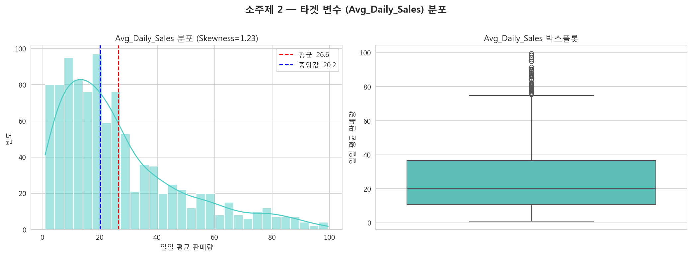

> **[그림 1] 타겟 변수 분포 (히스토그램 및 박스플롯)** — 일일 평균 판매량의 분포를 히스토그램과 박스플롯으로 시각화한 결과이다. 오른쪽 꼬리(Right-Skewed) 분포가 뚜렷하게 나타나며, 대부분의 제품이 0~30개 구간에 집중되어 있음을 확인할 수 있다.

#### 2.1.2 카테고리별 판매량 분포

박스플롯 분석으로 10개 카테고리 간 판매량 차이를 확인하였다.

| 순위   | 카테고리             | 평균 판매량 | 특징                          |
| ------ | -------------------- | ----------- | ----------------------------- |
| 1위    | Beverages (음료)     | 53.09       | 가장 높은 회전율, 뚜렷한 차이 |
| 2위    | Fresh Produce (신선) | 33.58       | 2위이나 1위와 큰 격차         |
| ...    | ...                  | ...         | ...                           |
| 최하위 | Household (가정용품) | 10.98       | 가장 낮은 판매량              |

> **왜 카테고리별 분포를 보는가?** 카테고리에 따라 판매 패턴이 크게 다르면, 이 변수가 모델 예측에 중요한 역할을 할 수 있다. 실제로 Beverages(53.09)와 Household(10.98) 간 약 5배 차이가 확인되어, Category가 유의미한 피처임을 사전에 파악할 수 있었다.

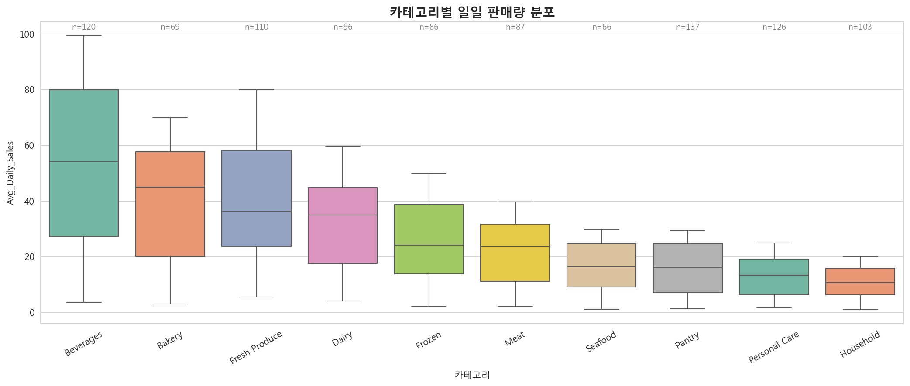

> **[그림 2] 카테고리별 일일 평균 판매량 분포** — 10개 제품 카테고리별 판매량 분포를 박스플롯으로 비교한 결과이다. Beverages(음료) 카테고리가 가장 높은 판매량을 보이며, 카테고리 간 뚜렷한 판매량 차이가 존재함을 확인할 수 있다.

#### 2.1.3 ABC 등급별 판매량

| 등급         | 제품 수 | 평균 판매량 | 의미             |
| ------------ | ------- | ----------- | ---------------- |
| A (상위 20%) | 200     | 37.69       | 고회전 핵심 제품 |
| B (중위 30%) | 300     | 28.49       | 중간 회전 제품   |
| C (하위 50%) | 500     | 21.00       | 저회전 일반 제품 |

> **ABC 분석**은 재고 관리의 고전적 기법이다. 파레토 법칙(80-20 법칙)에 기반하여, 전체 제품을 매출 기여도에 따라 A(상위), B(중위), C(하위)로 나눈다. A등급 제품은 수는 적지만 매출 기여가 크므로 **재고 부족이 발생하면 안 되는** 핵심 품목이다.

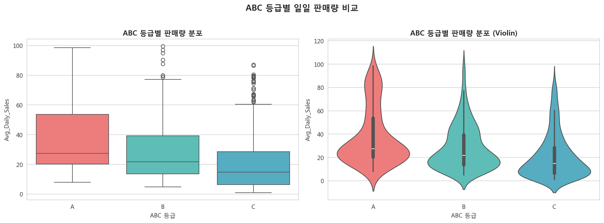

> **[그림 3] ABC 등급별 일일 평균 판매량 분포** — ABC 재고 분류 등급에 따른 판매량 분포를 비교한 결과이다. A등급(고회전) 제품이 가장 높은 판매량을 보이며, 등급 간 판매량 차이가 ABC 분류의 유효성을 뒷받침한다.

#### 2.1.4 피처 간 상관관계

상관관계 히트맵에서 타겟(Avg_Daily_Sales)과의 상관계수를 확인하였다.

| 피처                      | 상관계수 | 해석                    |
| ------------------------- | -------- | ----------------------- |
| Order_Frequency_per_month | +0.92    | **매우 강한** 양의 상관 |
| Quantity_On_Hand          | +0.65    | 강한 양의 상관          |
| Reorder_Point             | +0.65    | 강한 양의 상관          |
| Safety_Stock              | +0.65    | 강한 양의 상관          |
| Unit_Cost_USD             | -0.37    | 중간 음의 상관          |
| Lead_Time_Days            | -0.00    | 무상관                  |
| Stock_Age_Days            | -0.01    | 무상관                  |
| Received_Month            | -0.01    | 무상관                  |

> **상관계수(Correlation Coefficient)**는 두 변수 간 **선형 관계의 방향과 강도**를 -1~+1 사이로 나타낸다. +1에 가까우면 한 변수가 커질 때 다른 변수도 커지고, -1에 가까우면 반대 방향으로 움직인다. 0에 가까우면 선형 관계가 없다는 의미이다.
>
> **주의할 점:** 상관계수 0은 "선형 관계가 없다"는 뜻이지, "관계 자체가 없다"는 뜻이 아니다. 예를 들어 U자 형태의 비선형 관계는 상관계수가 0에 가깝게 나올 수 있다. 또한, **Order_Frequency_per_month의 0.92**라는 매우 높은 상관은 "이 변수로 판매량을 거의 예측할 수 있다"는 의미이기도 하지만, 동시에 **데이터 누수 가능성**도 의심해야 한다.

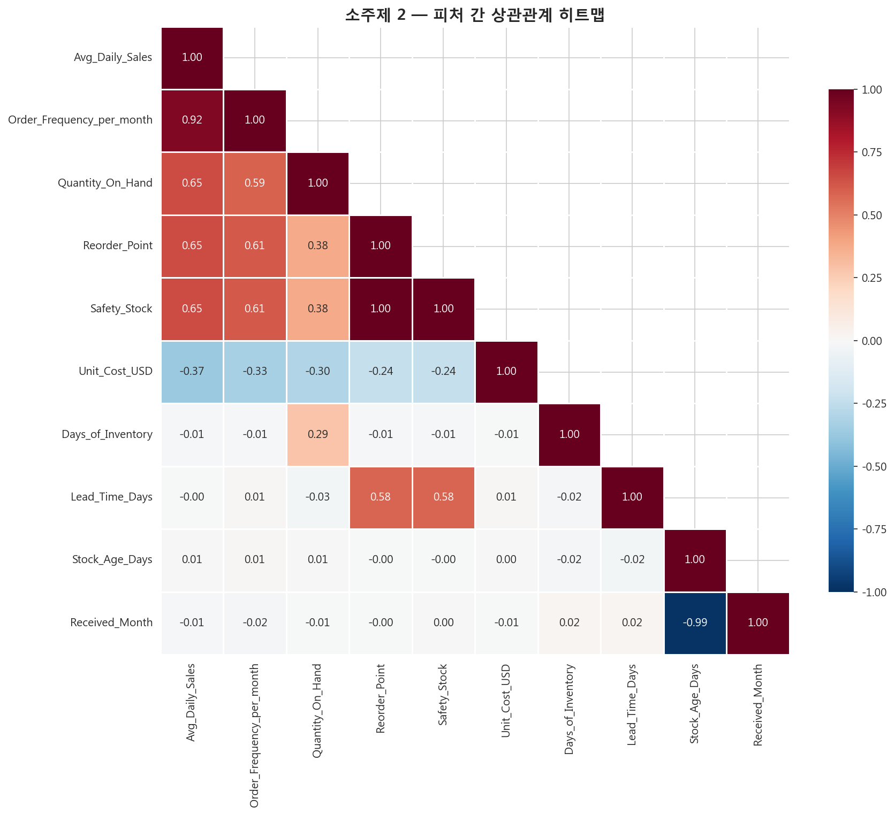

> **[그림 4] 피처 간 상관관계 히트맵** — 수치형 피처들 간의 상관계수를 히트맵으로 시각화한 결과이다. Order_Frequency_per_month와 타겟 간의 매우 높은 상관(+0.92)과, QOH·RP·Safety_Stock 간의 높은 상호 상관이 눈에 띈다.

#### 2.1.5 입고월별 판매량 추이

Received_Month와 Avg_Daily_Sales의 상관계수는 **-0.0122**로, 사실상 무관하였다. 입고 시기에 따른 판매량의 계절적 패턴은 이 데이터에서 확인되지 않았다.

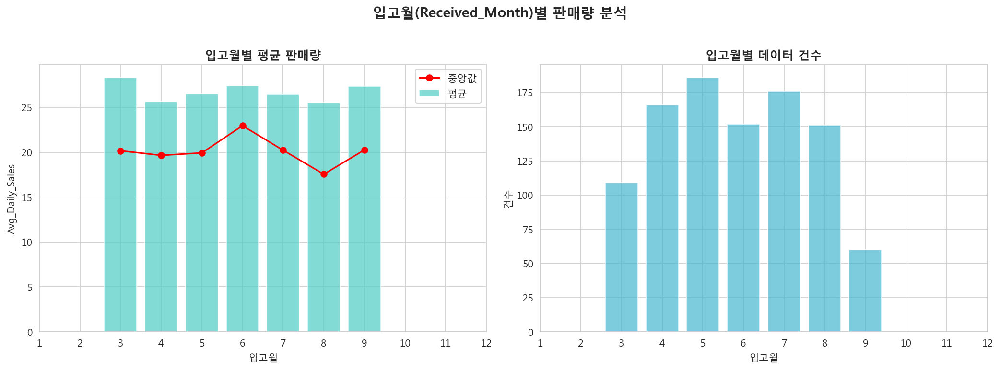

> **[그림 5] 입고월별 일일 평균 판매량 추이** — 입고월(Received_Month)에 따른 판매량 변화를 시각화한 결과이다. 월별 판매량에 뚜렷한 계절적 패턴이 관찰되지 않으며, 상관계수 -0.0122가 이를 수치적으로 뒷받침한다.

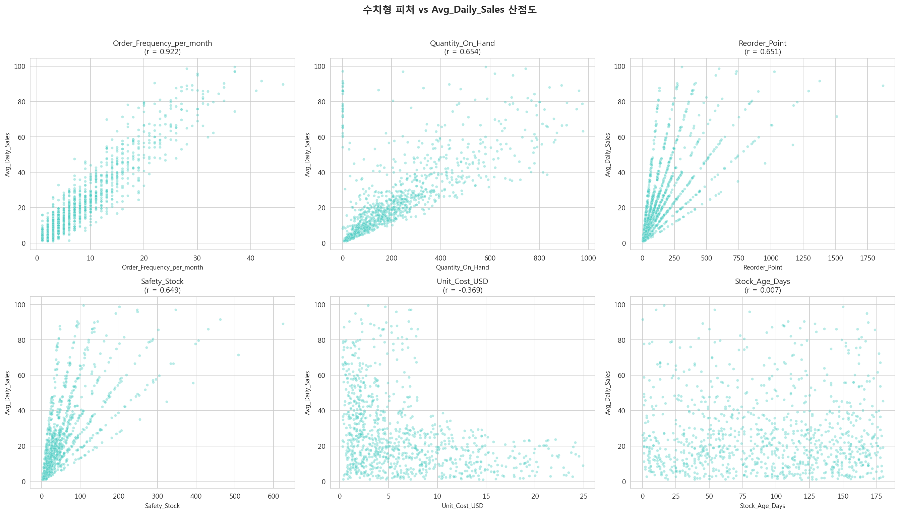

> **[그림 6] 주요 피처와 타겟 간 산점도** — 핵심 수치형 피처들과 Avg_Daily_Sales 간의 관계를 산점도로 시각화한 결과이다. Order_Frequency_per_month와의 강한 선형 관계, 그리고 다른 피처들과의 비선형적 관계 패턴을 확인할 수 있다.

### 2.2 데이터 누수(Data Leakage) 진단

> **데이터 누수란?** 모델 학습에 "실전에서는 알 수 없는 정보"가 포함되는 것이다. 시험에 비유하면, 시험 문제를 미리 알고 공부한 것과 같다. 학습 성능은 높게 나오지만, 실제 운영에서는 해당 정보를 사용할 수 없으므로 **성능이 급격히 하락**한다. 소주제 1에서 발견된 데이터 누수 패턴이 회귀 문제에서도 동일하게 존재하는지 검증하였다.

#### 2.2.1 Days_of_Inventory 직접 누수

**수식 검증 결과:**

$$
\text{Days\_of\_Inventory} = \frac{\text{Quantity\_On\_Hand}}{\text{Avg\_Daily\_Sales}}
$$

| 검증 항목           | 결과                                          |
| ------------------- | --------------------------------------------- |
| 오차 0.01 이내 일치 | 972건 / 1,000건 (97.2%)                       |
| 판정                | **수학적으로 타겟에서 역산 가능 → 확정 누수** |

> Days_of_Inventory가 타겟(Avg_Daily_Sales)을 분모로 사용하여 계산되었으므로, 이 변수를 피처로 사용하면 모델은 사실상 "정답을 역산"하는 것이다. **반드시 제거해야 한다.**

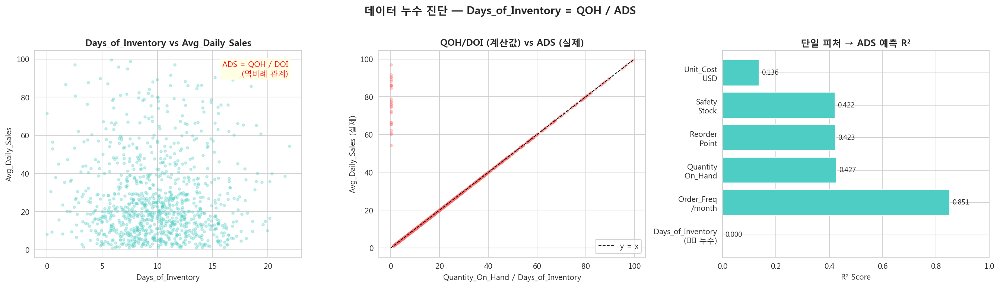

> **[그림 7] 데이터 누수(Data Leakage) 진단 결과** — Days_of_Inventory와 타겟 간의 수학적 관계, 그리고 각 피처의 단일 예측력(R²)을 시각화한 결과이다. DOI의 직접 누수 구조와 Order_Frequency의 높은 단일 피처 R²가 명확하게 드러난다.

#### 2.2.2 단일 피처 예측력 검증

Days_of_Inventory를 제거한 후에도, 개별 피처가 타겟을 지나치게 잘 예측하는지 확인하였다.

| 피처                      | 단일 피처 R² | 판정                               |
| ------------------------- | ------------ | ---------------------------------- |
| Days_of_Inventory         | 0.0002       | 단독으로는 역산 불가 (비선형 관계) |
| Order_Frequency_per_month | 0.8509       | 매우 높음 — 준누수 의심            |
| Quantity_On_Hand          | 0.4274       | 중간 수준                          |
| DOI + QOH 조합 (RF)       | 0.9911       | **거의 완벽 복원**                 |

> **흥미로운 발견:** Days_of_Inventory는 단독 선형 모델에서 R²=0.0002로 거의 예측력이 없다. 이는 DOI = QOH / ADS 관계가 **비선형(나눗셈)**이기 때문이다. 그러나 QOH와 함께 Random Forest(비선형 모델)에 넣으면 R²=0.9911로 **거의 완벽하게 타겟을 복원**할 수 있다. 이는 비선형 모델이 DOI와 QOH의 나눗셈 관계를 학습하여 ADS를 역산한 것이다.

#### 2.2.3 Order_Frequency_per_month 준누수(Quasi-Leakage) 검증

상관계수 0.92라는 극단적으로 높은 값이 데이터 누수인지, 자연적인 높은 상관인지 검증하였다.

| 시나리오   | 모델              | Test R² | 판정                  |
| ---------- | ----------------- | ------- | --------------------- |
| B-1 (포함) | Linear Regression | 0.8832  | —                     |
| B-1 (포함) | Random Forest     | 0.9122  | —                     |
| B-2 (제거) | Linear Regression | 0.7481  | LR은 큰 폭 하락       |
| B-2 (제거) | Random Forest     | 0.9175  | RF는 오히려 소폭 상승 |

> **판정:** Order_Frequency_per_month는 수학적 누수는 아니다. "많이 팔리는 제품은 자주 발주한다"는 **비즈니스적으로 자연스러운 강한 상관**이다. 다만, 실전에서 신제품처럼 주문 이력이 없는 경우에는 이 변수를 사용할 수 없으므로, 해석 시 주의가 필요하다.
>
> RF가 제거 후에도 성능이 유지되는 이유는, 트리 기반 모델이 QOH, RP, Safety_Stock 등 다른 피처들로부터 유사한 정보를 보완적으로 학습할 수 있기 때문이다.

#### 2.2.4 잔존 누수 검증 — QOH, RP, Safety_Stock 조합

DOI를 제거한 후에도 QOH가 피처로 남아 있으므로, 재고 관련 피처들의 조합이 타겟을 과도하게 예측할 수 있는지 확인하였다.

| 피처 조합        | Decision Tree R² | 판정                                |
| ---------------- | ---------------- | ----------------------------------- |
| QOH 단독         | 0.6771           | 중간                                |
| Order_Freq 단독  | 0.8205           | 높음                                |
| Order_Freq + QOH | 0.8737           | **0.85 기준 초과 → 간접 누수 의심** |
| QOH + RP + SS    | < 0.80           | 기준 미달                           |

> **간접 누수 의심 판정:** Order_Frequency + QOH 조합이 R²=0.8737로 임계값(0.85)을 초과하였다. 이는 두 변수를 조합하면 타겟을 거의 복원할 수 있다는 의미이다. 그러나 두 변수 모두 비즈니스적으로 중요한 정보를 담고 있으므로, **제거하지 않되 해석 시 이 관계를 인지해야 한다**는 결론을 내렸다.

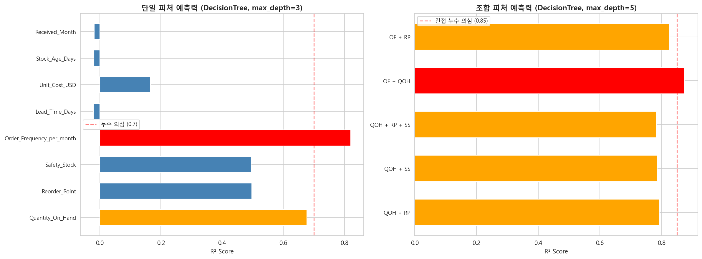

> **[그림 8] 데이터 누수 제거 후 잔차 검증** — DOI 제거 전후의 잔차 패턴 변화를 시각화한 결과이다. 누수 변수 제거 후 잔차가 보다 균일하게 분포하며, 체계적 편향이 사라진 것을 확인할 수 있다.

#### 2.2.5 데이터 누수 대응 요약

| 변수                      | 조치                 | 사유                                                       |
| ------------------------- | -------------------- | ---------------------------------------------------------- |
| Days_of_Inventory         | **제거**             | QOH/ADS 수식으로 타겟 직접 파생 (97.2% 일치)               |
| Order_Frequency_per_month | **유지 (주의 해석)** | 수학적 누수 아님, 비즈니스 상관. RF 제거 후 성능 유지 확인 |
| QOH, RP, Safety_Stock     | **유지 (모니터링)**  | 개별 R² < 0.70, 조합 시 주의 필요                          |

---

## 3. 전 (轉) — 모델 학습, 과적합 검증, 최적화

### 3.1 Default 모델 학습 결과 (5종)

하이퍼파라미터 조정 없이 기본값으로 5개 모델을 학습한 결과:

| 순위 | 모델              | Train R² | Test R² | RMSE | MAE  | Gap    |
| ---- | ----------------- | -------- | ------- | ---- | ---- | ------ |
| 1    | XGBoost           | 1.0000   | 0.9416  | 5.06 | 3.11 | 0.0584 |
| 2    | Random Forest     | 0.9886   | 0.9122  | 6.20 | 4.33 | 0.0763 |
| 3    | Ridge             | 0.9077   | 0.8835  | 7.14 | 5.46 | 0.0242 |
| 4    | Linear Regression | 0.9078   | 0.8832  | 7.15 | 5.46 | 0.0245 |
| 5    | Lasso             | 0.8892   | 0.8708  | 7.52 | 5.61 | 0.0184 |

> **분석 포인트:**
>
> 1. **XGBoost가 Test R²=0.9416으로 1위**이나, Train R²=1.0000은 학습 데이터를 완벽하게 외웠다(암기했다)는 의미이므로 **과적합 가능성**이 있다. Gap=0.0584는 양호한 수준이지만, Train R²가 1.0인 것은 전형적인 과적합 신호이다.
> 2. **Random Forest도 Train R²=0.9886**으로 높고 Gap=0.0763으로 두 번째로 큰 과적합 징후를 보인다.
> 3. **선형 모델들(LR, Ridge, Lasso)**은 Train-Test Gap이 작아(0.02 내외) 과적합이 거의 없으나, 성능 자체가 낮다. 이는 데이터에 **비선형 관계**가 있어 직선만으로는 충분히 설명할 수 없기 때문이다.
> 4. **Ridge ≈ Linear Regression:** 성능이 거의 동일하다. 이는 원래 Linear Regression도 과적합 없이 안정적이므로, Ridge의 정규화가 큰 효과를 발휘하지 못한 것이다.

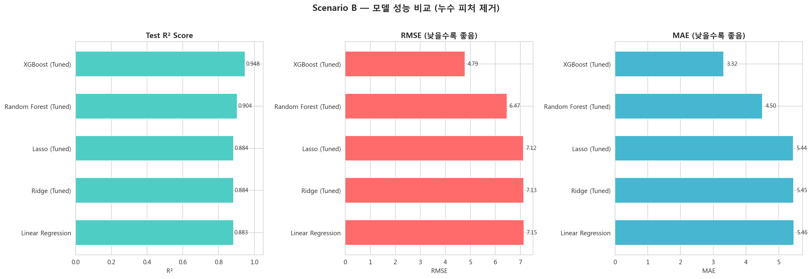

> **[그림 9] 5개 모델 성능 비교 (Default)** — 하이퍼파라미터 튜닝 전 5개 모델의 Test R², RMSE, MAE 등 핵심 성능 지표를 비교한 결과이다. 트리 기반 모델(XGBoost, RF)이 선형 모델보다 명확히 우수한 성능을 보인다.

### 3.2 과적합 검증 — 3단계 체계

소주제 1과 동일한 3단계 과적합 검증을 수행하였다.

#### 3.2.1 1단계: Train-Test Gap 분석

| 모델              | Gap    | 과적합 수준 |
| ----------------- | ------ | ----------- |
| Lasso             | 0.0184 | ✅ 양호     |
| Ridge             | 0.0242 | ✅ 양호     |
| Linear Regression | 0.0245 | ✅ 양호     |
| XGBoost           | 0.0584 | ⚠️ 경미     |
| Random Forest     | 0.0763 | ⚠️ 주의     |

> **Gap 해석 기준:** 일반적으로 Gap < 0.03이면 양호, 0.03~0.10이면 경미한 과적합, 0.10 이상이면 심각한 과적합으로 판단한다. XGBoost(0.058)와 RF(0.076)는 경미한 수준으로, 하이퍼파라미터 튜닝을 통해 개선 여지가 있다.

#### 3.2.2 2단계: 5-Fold 교차검증 (CV)

하나의 Test 세트에 대한 성능은 운이 좋거나 나빴을 수 있다. 데이터를 5등분하여 돌아가며 검증하는 **교차검증**으로 성능의 **안정성**을 확인하였다.

| 모델              | CV R² (평균 ± 표준편차) | 해석                      |
| ----------------- | ----------------------- | ------------------------- |
| XGBoost           | 0.9250 ± 0.0129         | 가장 높고 안정적          |
| Random Forest     | 0.9114 ± 0.0159         | 2위, 안정적               |
| Ridge             | 0.9001 ± 0.0119         | 안정적이나 성능 한계      |
| Linear Regression | 0.8995 ± 0.0123         | Ridge와 거의 동일         |
| Lasso             | 0.8835 ± 0.0185         | 가장 낮음, 변동성 약간 큼 |

> **교차검증(Cross-Validation)이란?** 데이터를 K개 부분으로 나누고, K-1개로 학습, 나머지 1개로 검증하는 것을 K번 반복하는 방법이다. 한 번의 Test 결과가 우연히 좋거나 나빴을 가능성을 배제하고, **여러 번의 평균**으로 모델의 **진짜 실력**을 평가한다.
>
> **표준편차가 작을수록** 모델이 데이터 분할 방식에 상관없이 일관된 성능을 보인다는 의미이다. XGBoost의 ±0.0129는 5번의 검증에서 R²가 약 0.912~0.938 범위에 있었다는 뜻으로, 매우 안정적이다.

#### 3.2.3 3단계: Learning Curve (학습 곡선)

학습 데이터 크기를 10%부터 100%까지 늘려가며 Train/Validation 성능을 관찰하였다.

| 모델              | Final Train R² | Final Val R² | Gap    | 수렴 여부 |
| ----------------- | -------------- | ------------ | ------ | --------- |
| Linear Regression | 0.9085         | 0.9009       | 0.0076 | ✅ 수렴   |
| Ridge             | 0.9081         | 0.9013       | 0.0067 | ✅ 수렴   |
| Lasso             | 0.9084         | 0.9011       | 0.0073 | ✅ 수렴   |
| Random Forest     | 0.9569         | 0.9092       | 0.0477 | ✅ 수렴   |
| XGBoost           | 0.9923         | 0.9453       | 0.0470 | ✅ 수렴   |

> **Learning Curve 해석:** 5개 모델 모두 학습 데이터를 늘릴수록 Validation 성능이 상승하다가 안정화되는 **정상적인 수렴 패턴**을 보였다. 이는 **데이터 부족 문제는 아님**을 의미한다.
>
> XGBoost와 RF는 Train-Val Gap이 약 0.05로 경미한 과적합이 있으나, 두 곡선이 **수렴하며 안정적으로 유지**되므로 하이퍼파라미터 튜닝으로 충분히 관리 가능한 수준이다.

### 3.3 하이퍼파라미터 튜닝

#### 3.3.1 수동 튜닝

과적합이 관찰된 트리 기반 모델을 중심으로 하이퍼파라미터를 조정하였다.

| 모델          | 주요 조정                        | 목적                         |
| ------------- | -------------------------------- | ---------------------------- |
| Ridge         | alpha=10.0 (GridSearchCV)        | 정규화 강도 최적화           |
| Lasso         | alpha=0.01 (GridSearchCV)        | 정규화 강도 최적화           |
| Random Forest | max_depth, min_samples 제한      | 나무 깊이 제한 → 과적합 억제 |
| XGBoost       | max_depth, learning_rate, 정규화 | 학습 속도와 복잡도 제어      |

> **하이퍼파라미터란?** 모델이 스스로 학습하는 것이 아니라, 분석가가 사전에 설정하는 "설정값"이다. 예를 들어, Random Forest의 max_depth는 "나무를 최대 몇 층까지 자라게 할 것인가"를 결정한다. 너무 깊으면 학습 데이터의 세세한 패턴까지 외워버리고(과적합), 너무 얕으면 복잡한 패턴을 놓친다(과소적합).

#### 3.3.2 수동 튜닝 결과

| 순위 | 모델                  | Test R² | RMSE | MAE  | Gap    | Default 대비 |
| ---- | --------------------- | ------- | ---- | ---- | ------ | ------------ |
| 1    | XGBoost (Tuned)       | 0.9477  | 4.79 | 3.32 | 0.0436 | ✅ R²↑, Gap↓ |
| 2    | Random Forest (Tuned) | 0.9045  | 6.47 | 4.50 | 0.0543 | ⚠️ R²↓, Gap↓ |
| 3    | Lasso (Tuned)         | 0.8841  | —    | —    | —      | ≈ 동일       |
| 4    | Ridge (Tuned)         | 0.8840  | —    | —    | —      | ≈ 동일       |
| 5    | Linear Regression     | 0.8832  | —    | —    | —      | 변동 없음    |

> **XGBoost Tuned:** R²가 0.9416 → 0.9477로 상승하고, Gap이 0.0584 → 0.0436으로 감소하여 **성능과 안정성 모두 개선**되었다. Train R²도 1.0000 → 0.9913으로 내려가 과적합이 완화되었다.
>
> **Random Forest Tuned:** Gap이 0.0763 → 0.0543으로 줄어 과적합은 개선되었으나, Test R²가 0.9122 → 0.9045로 소폭 하락하였다. 나무 깊이를 제한한 결과 과적합은 줄었지만 표현력도 함께 줄어든 것이다. 이는 **과적합 억제와 성능 간의 트레이드오프**를 보여주는 전형적인 사례이다.

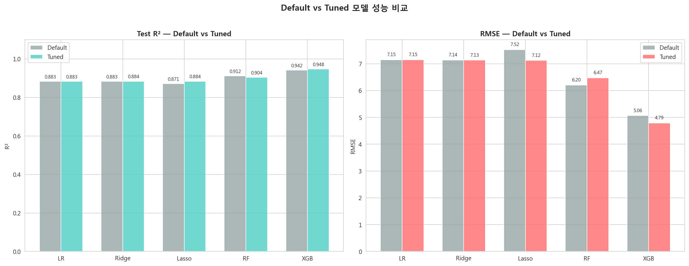

> **[그림 10] Default vs Tuned 모델 성능 비교** — 하이퍼파라미터 튜닝 전후의 성능 변화를 비교한 결과이다. XGBoost는 성능과 안정성 모두 개선된 반면, Random Forest는 과적합은 감소했으나 성능이 소폭 하락하는 트레이드오프가 관찰된다.

#### 3.3.3 RandomizedSearchCV — 자동 탐색 검증

수동 튜닝 결과의 신뢰성을 검증하기 위해 50개 조합을 자동 탐색하였다.

| 모델          | 수동 Tuned R² | RandomSearch R² | 수동 Tuned RMSE | RandomSearch RMSE | 판정                          |
| ------------- | ------------- | --------------- | --------------- | ----------------- | ----------------------------- |
| XGBoost       | 0.9477        | **0.9659**      | 4.79            | **3.86**          | RandomSearch가 우수 (+0.0183) |
| Random Forest | 0.9045        | **0.9290**      | 6.47            | **5.58**          | RandomSearch가 우수 (+0.0245) |

> **RandomizedSearchCV란?** 하이퍼파라미터의 가능한 조합을 랜덤하게 샘플링하여 교차검증으로 최적 조합을 찾는 방법이다. GridSearchCV(모든 조합 시도)보다 효율적이면서도, 분석가의 직관에 의존하는 수동 튜닝의 한계를 보완한다.
>
> 두 모델 모두 RandomSearch가 수동 튜닝보다 우수한 성능을 보였다. 이는 분석가가 탐색하지 못한 **더 좋은 하이퍼파라미터 조합**이 존재했음을 의미하며, 자동 탐색의 가치를 보여준다.

### 3.4 Tuned 모델 교차검증 (5-Fold CV)

| 모델                  | Train R² | CV R² (± Std)   | Gap    |
| --------------------- | -------- | --------------- | ------ |
| XGBoost (Tuned)       | 0.9923   | 0.9458 ± 0.0110 | 0.0465 |
| Random Forest (Tuned) | 0.9570   | 0.9059 ± 0.0200 | 0.0512 |
| Ridge (Tuned)         | 0.9078   | 0.9003 ± 0.0115 | 0.0075 |
| Lasso (Tuned)         | 0.9081   | 0.9000 ± 0.0119 | 0.0081 |
| Linear Regression     | 0.9083   | 0.8995 ± 0.0123 | 0.0087 |

### 3.5 Tuned Learning Curve

Tuned 모델의 학습 곡선에서도 5개 모델 모두 **수렴**이 확인되었다. XGBoost Tuned는 Default 대비 Train-Val 곡선 간격이 좁아져 **과적합이 완화**된 것이 시각적으로도 확인되었다.

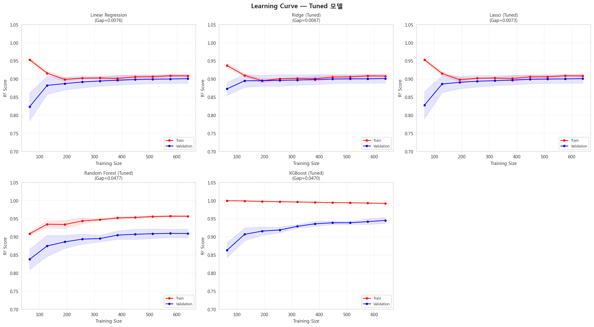

> **[그림 11] Tuned 모델 Learning Curve** — 학습 데이터 크기에 따른 Train/Validation 성능 변화를 시각화한 학습 곡선이다. 5개 모델 모두 정상적으로 수렴하며, XGBoost Tuned의 Train-Val 간격이 Default 대비 좁아져 과적합 완화를 확인할 수 있다.

### 3.6 최적 모델 선정

| 평가 기준      | XGBoost (Tuned)          | 판정 |
| -------------- | ------------------------ | ---- |
| Test R²        | 0.9477 (5개 중 1위)      | ✅   |
| RMSE           | 4.79 (5개 중 1위)        | ✅   |
| MAE            | 3.32 (5개 중 1위)        | ✅   |
| CV R²          | 0.9458 ± 0.0110 (안정적) | ✅   |
| Gap (Test)     | 0.0436 (관리 가능 수준)  | ✅   |
| Learning Curve | 수렴 확인                | ✅   |

> **XGBoost (Tuned)를 최적 모델로 선정하였다.** 모든 평가 지표에서 1위이며, 교차검증과 학습 곡선에서 안정적 수렴이 확인되었다.

---

## 4. 결 (結) — 최종 결과와 인사이트

### 4.1 실제값 vs 예측값 분석

산점도에서 대부분의 점이 y=x 대각선 근처에 분포하여 예측이 전반적으로 정확함을 확인하였다. 그러나 **고판매량 구간(70+)**에서 대각선 아래로 벗어나는 경향이 관찰되었다 — 이는 **과소예측(실제보다 낮게 예측)**을 의미한다.

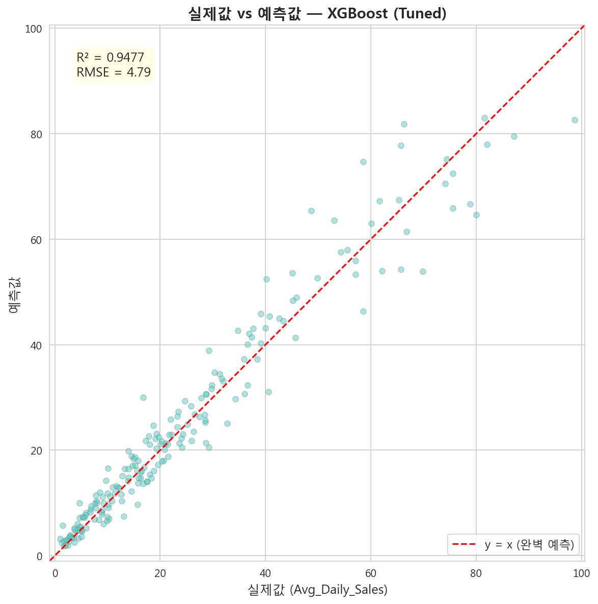

> **[그림 12] 실제값 vs 예측값 산점도** — XGBoost (Tuned) 모델의 예측 결과를 대각선(y=x) 기준으로 시각화한 결과이다. 대부분의 점이 대각선 근처에 밀집하여 높은 예측 정확도를 보이나, 고판매량 구간(70+)에서 대각선 아래로 벗어나는 과소예측 경향이 관찰된다.

### 4.2 잔차(Residual) 분석

> **잔차란?** 실제값에서 예측값을 뺀 차이이다. 잔차 = 실제 판매량 - 예측 판매량. 잔차가 양수면 과소예측(실제가 더 많음), 음수면 과대예측(실제가 더 적음)이다. 좋은 모델이라면 잔차가 **0 주변에 고르게 퍼져** 있어야 한다.

| 잔차 통계      | 값    | 해석                          |
| -------------- | ----- | ----------------------------- |
| 평균(Mean)     | -0.47 | 0에 가까움 → 체계적 편향 없음 |
| 표준편차(Std)  | 4.76  | 오차의 산포                   |
| 왜도(Skewness) | 0.19  | 거의 대칭                     |

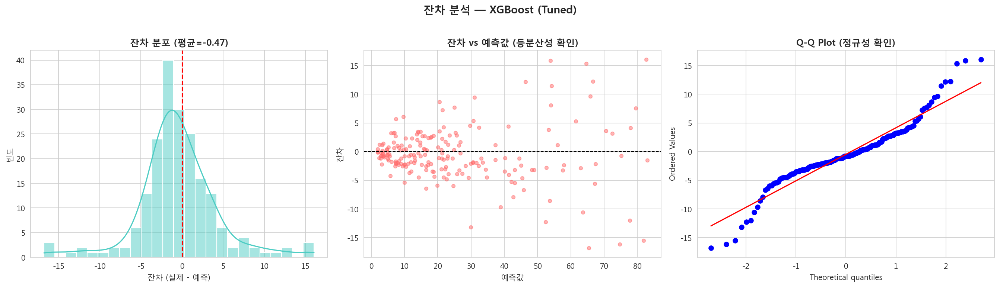

> **[그림 13] 잔차(Residual) 분석** — 예측값 대비 잔차의 분포를 산점도와 히스토그램으로 시각화한 결과이다. 잔차가 0 주변에 대칭적으로 분포하여 체계적 편향이 없음을 확인할 수 있으나, 고판매량 구간에서 잔차의 분산이 증가하는 이분산성(Heteroscedasticity) 패턴이 관찰된다.

#### 4.2.1 잔차 정규성 검정 (Shapiro-Wilk)

| 검정 항목 | 결과                           |
| --------- | ------------------------------ |
| W-통계량  | 0.9240                         |
| p-value   | 1.16 × 10⁻⁸                    |
| 판정      | **정규분포가 아님** (p < 0.05) |

> **Shapiro-Wilk 검정**은 데이터가 정규분포를 따르는지 통계적으로 검정하는 방법이다. p-value가 0.05보다 작으면 "정규분포가 아니다"라고 결론짓는다. 본 분석에서 p=1.16×10⁻⁸로 매우 작아, 잔차가 **엄밀한 정규분포는 아닌 것**으로 확인되었다.
>
> **그러나 이것이 문제가 되는가?** XGBoost는 트리 기반 모델로, 잔차의 정규성을 전제 조건으로 요구하지 않는다. 정규성 가정이 필요한 모델은 **전통적인 선형 회귀**이며, 트리 기반 모델에서는 잔차 분석이 **모델의 체계적 오류 패턴을 발견하는 진단 도구**로 사용된다.

#### 4.2.2 판매량 구간별 성능 분석

| 구간           | 건수 | RMSE | MAE  | 평균 편향(Bias) | 해석             |
| -------------- | ---- | ---- | ---- | --------------- | ---------------- |
| 저판매 (0~20)  | 109  | 2.78 | 2.08 | -0.82           | ✅ 매우 정확     |
| 중판매 (20~40) | 53   | 3.81 | 3.08 | -0.33           | ✅ 양호          |
| 고판매 (40~70) | 28   | 8.74 | 7.15 | -2.03           | ⚠️ 오차 증가     |
| 초고판매 (70+) | 10   | 9.13 | 7.39 | **+6.94**       | ⚠️ 과소예측 경향 |

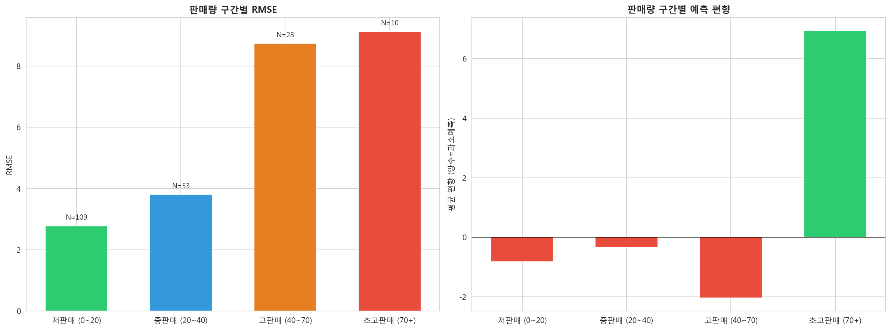

> **[그림 14] 판매량 구간별 성능 분석** — 저판매(0~20), 중판매(20~40), 고판매(40~70), 초고판매(70+) 구간별로 RMSE, MAE, Bias를 비교한 결과이다. 판매량이 높은 구간일수록 오차가 커지며, 특히 초고판매 구간에서 과소예측 경향이 뚜렷하다.

> **구간별 성능 차이의 원인:**
>
> 1. **데이터 불균형:** 저판매 구간(109건)에 비해 초고판매 구간(10건)은 데이터가 11분의 1에 불과하다. 모델은 데이터가 많은 구간을 더 잘 학습하는 경향이 있다.
> 2. **타겟 분포의 영향:** 오른쪽 꼬리 분포로 인해 고판매량 패턴의 학습 기회가 적다.
> 3. **Bias +6.94의 의미:** 초고판매 구간에서 평균적으로 실제보다 약 7개를 적게 예측한다. 이는 재고 관리에서 **결품 위험**을 높일 수 있으므로 주의가 필요하다.

#### 4.2.3 예측 오차 비대칭 분석

| 분류                   | 건수  | 비율  | 평균 오차 | 비즈니스 영향              |
| ---------------------- | ----- | ----- | --------- | -------------------------- |
| 과대예측 (실제 < 예측) | 121건 | 60.5% | -3.13     | 재고 과다 → 폐기 위험      |
| 과소예측 (실제 > 예측) | 79건  | 39.5% | +3.61     | 재고 부족 → 판매 기회 손실 |
| 정확 (\|오차\| < 2)    | 86건  | 43.0% | —         | 안정적 운영                |

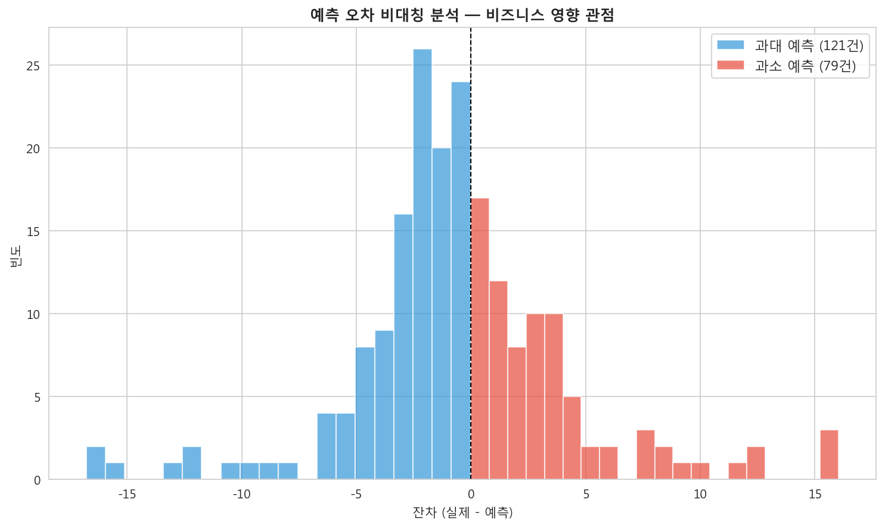

> **[그림 15] 예측 오차 비대칭 분석** — 과대예측과 과소예측의 분포 및 비율을 시각화한 결과이다. 과대예측(60.5%)이 과소예측(39.5%)보다 많아, 모델이 실제보다 약간 높게 예측하는 경향이 확인된다.

> **비대칭 오차의 비즈니스 의미:** 과대예측(121건)이 과소예측(79건)보다 많다. 이는 모델이 전반적으로 실제보다 약간 높게 예측하는 경향이 있다는 의미이다.
>
> - **과대예측 → 재고 과다:** 팔리지 않는 재고가 쌓이고, 유통기한이 있는 식료품에서는 폐기 손실로 이어진다.
> - **과소예측 → 재고 부족:** 수요를 충족하지 못해 판매 기회를 놓치고, 고객 이탈의 원인이 된다.
>
> 어느 방향의 오차가 더 심각한지는 **제품 특성**에 따라 다르다. 유통기한이 짧은 신선식품은 과대예측이 더 위험하고, 고단가 제품은 과소예측으로 인한 판매 손실이 더 크다.

### 4.3 Feature Importance — 3중 교차검증

판매량에 가장 큰 영향을 미치는 피처를 **3가지 서로 다른 방법**으로 검증하여 결과의 신뢰도를 높였다.

#### 4.3.1 방법 1: Impurity-based Feature Importance (불순도 기반)

> **원리:** 트리 기반 모델에서 각 피처가 분기(split)에 사용될 때 줄어든 불순도의 합계를 계산한다. 불순도를 많이 줄인 피처가 중요한 피처로 간주된다.
>
> **한계:** 연속형 변수나 고유값이 많은 변수(High Cardinality)를 과대평가하는 편향이 있다. 이는 분기 기회가 많을수록 불순도 감소 기회도 많기 때문이다.

#### 4.3.2 방법 2: Permutation Importance (순열 중요도)

> **원리:** 특정 피처의 값을 무작위로 섞은(셔플한) 후, 모델 성능이 얼마나 하락하는지 측정한다. 성능이 크게 떨어지면 해당 피처가 중요하다는 의미이다.
>
> **장점:** 모델 구조에 의존하지 않는 **모델 불가지론적(Model-Agnostic)** 방법으로, Impurity 편향을 보완한다.

#### 4.3.3 방법 3: SHAP (SHapley Additive exPlanations)

> **원리:** 게임 이론의 **Shapley Value** 개념에 기반하여, 각 피처가 개별 예측에 기여하는 정도를 정량적으로 분해한다. 다른 방법들이 "전체적으로 어떤 피처가 중요한가"를 말한다면, SHAP는 "이 예측에서 이 피처가 예측값을 얼마나 높이거나 낮추었는가"까지 설명한다.
>
> **장점:** 피처 중요도뿐 아니라 **영향 방향**(양/음의 기여)까지 파악 가능. Beeswarm Plot을 통해 각 데이터 포인트별 기여를 시각화할 수 있다.

#### 4.3.4 3중 교차검증 결과

| 순위 | Impurity           | Permutation      | SHAP             | 일치 여부                |
| ---- | ------------------ | ---------------- | ---------------- | ------------------------ |
| 1위  | Order_Frequency    | Order_Frequency  | Order_Frequency  | ✅**3개 방법 완벽 일치** |
| 2위  | Quantity_On_Hand   | Reorder_Point    | Reorder_Point    | 2/3 일치                 |
| 3위  | Category_Beverages | Lead_Time_Days   | Quantity_On_Hand | —                        |
| 4위  | Safety_Stock       | Quantity_On_Hand | Lead_Time_Days   | —                        |
| 5위  | Lead_Time_Days     | Safety_Stock     | Safety_Stock     | 2/3 일치                 |

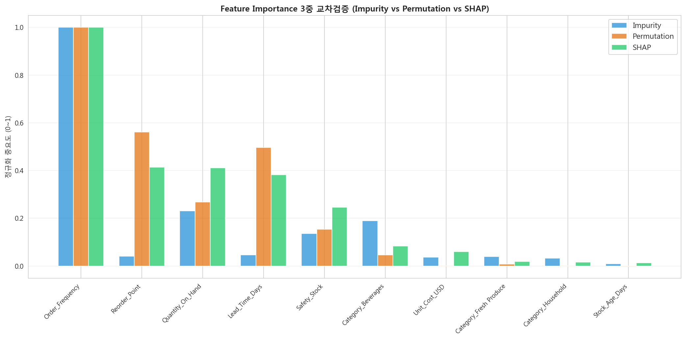

> **[그림 16] Feature Importance 3중 교차검증 비교** — Impurity, Permutation, SHAP 3가지 방법의 피처 중요도 순위를 비교한 결과이다. Order_Frequency_per_month가 모든 방법에서 1위를 차지하며, 3가지 방법 간 순위 일치도가 높아 결과의 신뢰성을 뒷받침한다.

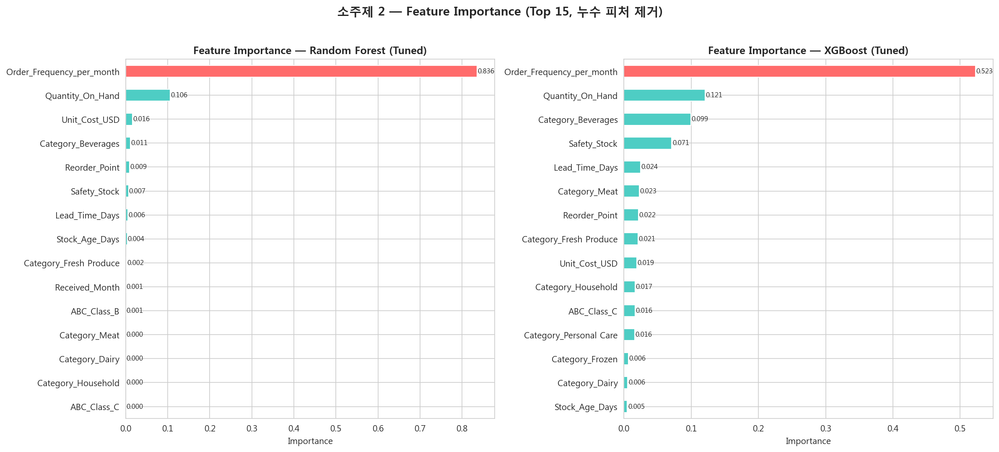

> **[그림 17] XGBoost (Tuned) Feature Importance** — 최적 모델인 XGBoost (Tuned)의 피처 중요도를 바 차트로 시각화한 결과이다. Order_Frequency_per_month의 압도적 중요도와 상위 5개 핵심 피처가 명확하게 드러난다.

> **핵심 인사이트:**
>
> 1. **Order_Frequency_per_month이 압도적 1위:** 3가지 방법 모두에서 1위를 차지하며, SHAP 평균값(8.81)이 2위(3.65)의 **2.4배**에 달한다. 주문 빈도가 판매량의 가장 강력한 예측 인자임이 확정적으로 검증되었다.
> 2. **Reorder_Point의 순위 상승:** Impurity에서 7위였으나 Permutation에서 2위, SHAP에서 2위로 급상승하였다. 이는 Impurity가 연속형 변수를 과대평가하는 편향 때문에 Reorder_Point의 실제 중요도가 가려져 있었음을 보여준다.
> 3. **상위 5개 핵심 피처 도출:** Order_Frequency, Reorder_Point, Quantity_On_Hand, Lead_Time_Days, Safety_Stock — 이 5개 변수가 판매량 예측의 핵심이다.
> 4. **Category_Beverages:** Impurity에서 3위였으나 Permutation(6위)과 SHAP에서는 순위가 낮다. 이진 변수(0/1)임에도 Impurity가 높게 나온 것은, Beverages 카테고리의 판매량이 다른 카테고리와 뚜렷이 구분되어 분기 효과가 컸기 때문이다.

### 4.4 SHAP 심층 분석

#### 4.4.1 SHAP Beeswarm Plot 해석

SHAP Beeswarm Plot은 각 데이터 포인트에서 각 피처가 예측에 미친 영향을 **점 하나하나로** 표현한다. 점의 색상은 해당 피처의 **실제 값**을 나타낸다 (빨강=높은 값, 파랑=낮은 값).

| 피처             | SHAP 평균 | 해석                                       |
| ---------------- | --------- | ------------------------------------------ |
| Order_Frequency  | 8.81      | 높을수록 → 판매량 예측↑ (빨간 점이 오른쪽) |
| Reorder_Point    | 3.65      | 높을수록 → 판매량 예측↑                    |
| Quantity_On_Hand | 3.62      | 높을수록 → 판매량 예측↑                    |
| Lead_Time_Days   | 3.37      | 높을수록 → 판매량 예측↓ (빨간 점이 왼쪽)   |
| Safety_Stock     | 2.17      | 높을수록 → 판매량 예측↑                    |

> **Lead_Time_Days의 음의 기여:** 리드타임(발주 후 입고까지 걸리는 시간)이 긴 제품은 판매량이 낮은 경향이 있다. 이는 리드타임이 긴 제품이 재고 부족 위험이 높아 보수적으로 재고를 운영하거나, 수요가 상대적으로 안정적인(낮은) 제품인 경우가 많기 때문일 수 있다.

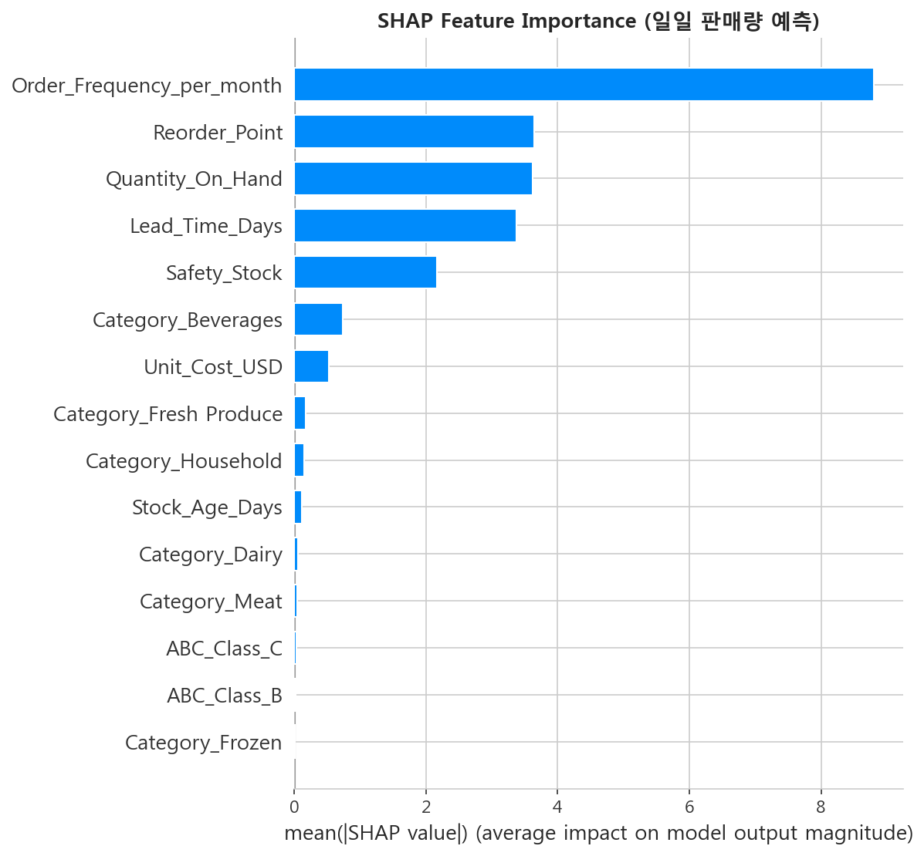

> **[그림 18] SHAP Feature Importance (Bar Chart)** — 각 피처의 평균 SHAP 값(mean |SHAP value|)을 바 차트로 표현한 결과이다. Order_Frequency_per_month의 SHAP 기여도(8.81)가 2위(3.65)의 2.4배에 달하는 압도적 차이를 보인다.

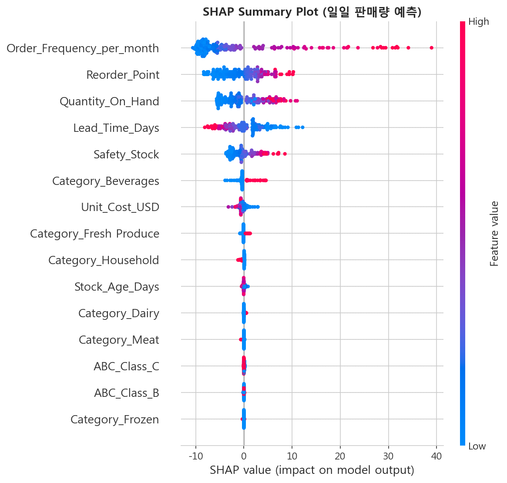

> **[그림 19] SHAP Summary (Beeswarm) Plot** — 각 데이터 포인트별 SHAP 값의 분포를 점으로 표현한 결과이다. 빨간색(높은 피처 값)과 파란색(낮은 피처 값)의 분포를 통해, 각 피처가 예측값을 높이는(오른쪽) 또는 낮추는(왼쪽) 방향과 그 크기를 한눈에 파악할 수 있다.

#### 4.4.2 SHAP Dependence Plot

상위 4개 피처에 대해 SHAP 값이 피처 값에 따라 어떻게 변하는지, 그리고 어떤 피처와 상호작용하는지를 시각화하였다.

- **Order_Frequency ↔ Reorder_Point 상호작용:** 주문 빈도가 높은 제품 중 Reorder_Point도 높은 경우(빨간 점) SHAP 값이 더 극단적으로 높아짐 → 두 요인이 결합될 때 판매량 예측이 더 강화된다.
- **Lead_Time_Days:** 10일 이상에서 음의 SHAP 값이 급격히 커짐 → 리드타임이 일정 수준을 넘으면 판매량 예측에 미치는 부정적 영향이 비선형적으로 커진다.

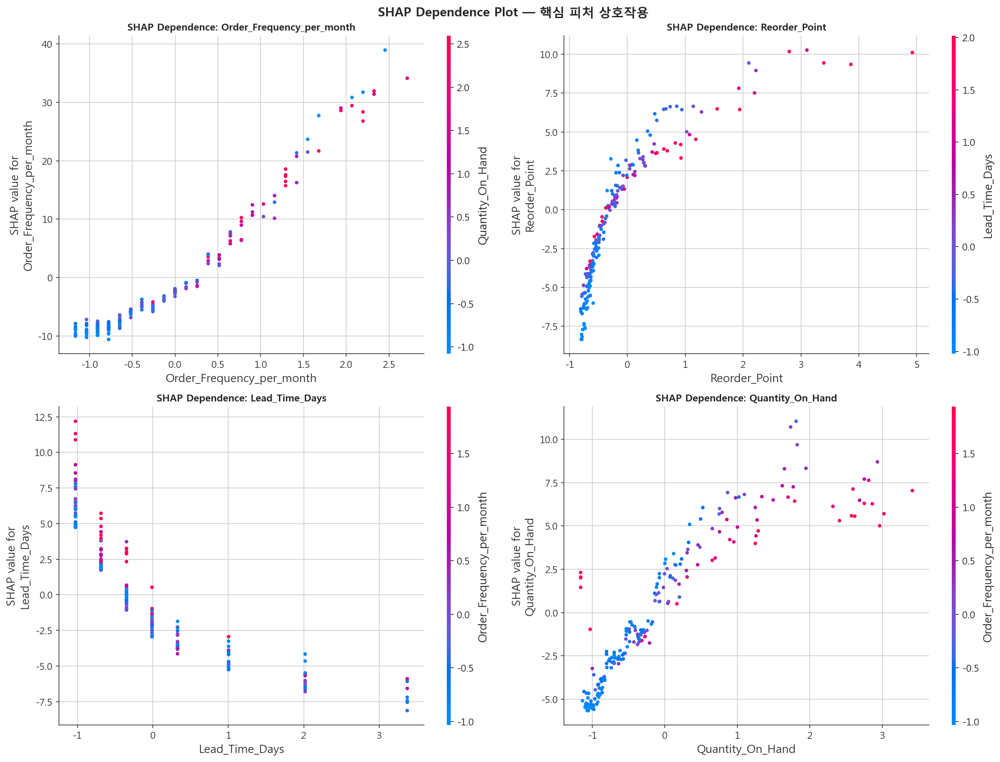

> **[그림 20] SHAP Dependence Plot (상위 4개 피처)** — 각 피처 값의 변화에 따른 SHAP 값의 변화를 시각화한 결과이다. 색상은 상호작용 피처의 값을 나타내며, 피처 간 비선형적 상호작용 패턴을 확인할 수 있다. 특히 Lead_Time_Days의 비선형적 음의 기여가 두드러진다.

### 4.5 Lasso 계수 분석 — 변수 선택 효과

Lasso Regression(alpha=0.01)의 계수를 분석한 결과:

| 항목                        | 결과                   |
| --------------------------- | ---------------------- |
| 0이 아닌 계수 (선택된 변수) | 18개                   |
| 0인 계수 (제거된 변수)      | **1개 (Safety_Stock)** |

> **Safety_Stock이 제거된 이유:** Safety_Stock은 Reorder_Point, Quantity_On_Hand와 높은 상관관계(r ≈ 0.65)를 가지고 있어, 이들 변수가 이미 담고 있는 정보를 **중복으로** 제공한다. Lasso는 이런 중복 변수의 계수를 0으로 만들어 **자동으로 제거**한다. 이는 Feature Importance 분석에서 Safety_Stock이 상위 5위 내에 있었지만 **단독 기여보다는 다른 변수와의 공유 정보가 많았음**을 의미한다.

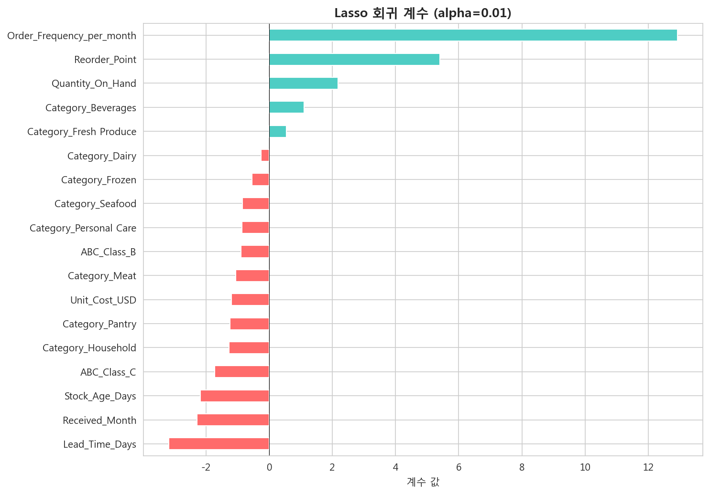

> **[그림 21] Lasso Regression 계수 분석** — Lasso 모델이 학습한 각 피처의 회귀 계수를 시각화한 결과이다. Safety_Stock의 계수가 정확히 0으로 설정되어 자동 제거된 것이 확인되며, Order_Frequency_per_month가 가장 큰 양의 계수를 보인다.

### 4.6 모델 저장 및 배포 준비

| 저장 파일                      | 내용                             |
| ------------------------------ | -------------------------------- |
| `best_regressor.pkl`           | XGBoost Tuned 모델               |
| `scaler_regression.pkl`        | StandardScaler (Train 기준 학습) |
| `feature_info_regression.json` | 피처 목록 및 시나리오 정보       |

---

## 5. 최종 결론

### 5.1 핵심 발견 5가지

1. **XGBoost (Tuned)가 최적 모델:** R²=0.9477, RMSE=4.79, MAE=3.32로 5개 모델 중 모든 지표에서 1위. 변동의 약 95%를 설명하며, 평균 오차는 일일 판매량 기준 약 ±4.79개 수준이다.
2. **데이터 누수 구조 확인 및 대응:** Days_of_Inventory는 타겟(ADS)을 분모로 사용하는 파생변수로 확인되어 제거. Order_Frequency_per_month는 수학적 누수가 아닌 비즈니스적 상관으로 판정하여 유지하되 해석에 주의를 기하였다.
3. **Order_Frequency_per_month가 압도적 핵심 피처:** 3가지 Feature Importance 방법 모두에서 1위. SHAP 기여도가 2위의 2.4배. 판매량 예측의 가장 강력한 신호이다.
4. **고판매량 구간 과소예측 한계:** 70+ 구간에서 평균 +6.94의 양의 편향(과소예측). 데이터 불균형(10건/200건)이 주요 원인으로, 인기 제품의 재고 관리에서 추가 보정이 필요하다.
5. **비선형 모델의 우위 확인:** 선형 모델(LR, Ridge, Lasso)은 R²≈0.88에 수렴하나, 트리 기반 모델(RF, XGBoost)은 0.91~0.95로 유의미하게 높다. 이는 판매량 데이터에 **선형 관계만으로는 포착할 수 없는 비선형 패턴**이 존재함을 의미한다.

---

## 6. 한계점

| 구분          | 한계                   | 상세 설명                                                                                                        |
| ------------- | ---------------------- | ---------------------------------------------------------------------------------------------------------------- |
| **데이터**    | 단일 시점 스냅샷       | 시간에 따른 판매 패턴 변화(계절성, 트렌드)를 반영하지 못함                                                       |
| **데이터**    | 1,000건 규모           | 고판매량 구간의 학습 데이터 부족 (70+ 구간 10건)                                                                 |
| **데이터**    | 외부 요인 미반영       | 프로모션, 경쟁사 가격, 날씨, 공휴일 등 판매에 영향을 미치는 외부 변수 없음                                       |
| **방법론**    | Order_Frequency 의존도 | 모델의 핵심 피처가 신제품이나 신규 입점 제품에는 사용 불가                                                       |
| **방법론**    | 잔차 비정규성          | Shapiro-Wilk 검정 결과 잔차가 정규분포를 따르지 않음 (트리 모델에서는 치명적이지 않으나, 예측 구간 산출 시 영향) |
| **실무 적용** | 실시간 데이터 미지원   | 학습 데이터 시점의 패턴만 반영, 시장 변화에 대한 모델 재학습 체계 필요                                           |

## 7. 향후 추가 방향

| 시점     | 방향                                                | 기대 효과                        |
| -------- | --------------------------------------------------- | -------------------------------- |
| **단기** | 고판매량 구간 보정 로직 추가 (예: 구간별 보정 계수) | 과소예측으로 인한 결품 위험 감소 |
| **단기** | 비대칭 손실 함수 적용 (과소예측에 더 높은 벌점)     | 비즈니스 목표에 맞는 맞춤형 모델 |
| **중기** | 시계열 피처 추가 (이동 평균, 계절 지수)             | 시간적 판매 패턴 반영            |
| **중기** | 외부 데이터 연계 (프로모션, 날씨, 공휴일)           | 수요 변동 요인 포착              |
| **장기** | Order_Frequency 없는 모델 별도 구축                 | 신제품·신규 입점 제품 대응       |
| **장기** | 딥러닝 기반 수요 예측 (LSTM, Transformer)           | 시계열 패턴의 자동 학습          |

---

## 8. 참고 문헌 (References)

1. Chen, T., & Guestrin, C. (2016). XGBoost: A Scalable Tree Boosting System. *Proceedings of the 22nd ACM SIGKDD International Conference on Knowledge Discovery and Data Mining*, 785-794. https://doi.org/10.1145/2939672.2939785

2. Breiman, L. (2001). Random Forests. *Machine Learning*, 45(1), 5-32. https://doi.org/10.1023/A:1010933404324

3. Lundberg, S. M., & Lee, S.-I. (2017). A Unified Approach to Interpreting Model Predictions. *Advances in Neural Information Processing Systems (NeurIPS)*, 30, 4765-4774.

4. Tibshirani, R. (1996). Regression Shrinkage and Selection via the Lasso. *Journal of the Royal Statistical Society: Series B (Methodological)*, 58(1), 267-288.

5. Hoerl, A. E., & Kennard, R. W. (1970). Ridge Regression: Biased Estimation for Nonorthogonal Problems. *Technometrics*, 12(1), 55-67.

6. Kaufman, S., Rosset, S., & Perlich, C. (2012). Leakage in Data Mining: Formulation, Detection, and Avoidance. *ACM Transactions on Knowledge Discovery from Data*, 6(4), 1-21.

7. Altman, E. I. (1968). Financial Ratios, Discriminant Analysis and the Prediction of Corporate Bankruptcy. *The Journal of Finance*, 23(4), 589-609.

8. Shapiro, S. S., & Wilk, M. B. (1965). An Analysis of Variance Test for Normality (Complete Samples). *Biometrika*, 52(3/4), 591-611.

9. Bergstra, J., & Bengio, Y. (2012). Random Search for Hyper-Parameter Optimization. *Journal of Machine Learning Research*, 13, 281-305.

10. Hastie, T., Tibshirani, R., & Friedman, J. (2009). *The Elements of Statistical Learning: Data Mining, Inference, and Prediction* (2nd ed.). Springer.

---

> 본 분석은 식료품 유통 재고 관리에서 **일일 판매량 예측**이라는 핵심 과제에 대해, 데이터 누수 진단부터 3중 Feature Importance 검증까지 **체계적이고 다각적인 분석**을 수행하였다. XGBoost 기반 예측 모델은 R²=0.9477의 높은 설명력을 보이며, 주문 빈도·재주문점·현재고·리드타임 등 **핵심 재고 관리 지표**가 판매량 예측에 가장 중요한 요인임을 실증적으로 확인하였다. 향후 시계열 데이터와 외부 요인을 추가하면, 보다 정확하고 실전에 강한 수요 예측 시스템으로 발전할 수 있을 것이다.
