# 소주제 3 — 폐기 위험도 예측 결과 보고서

> **프로젝트:** 머신러닝 기반 식료품 유통 재고 관리 최적화 시스템
> **분석 주제:** 폐기 위험도 예측 (Binary Classification)
> **담당:** 권효중
> **작성일:** 2026-03-13

---

## 요약 (Abstract)

본 보고서는 인도네시아 E-Grocery 업체의 재고 관리 데이터(1,000행 × 37열)를 활용하여, **폐기 위험도(Waste_Risk)**를 이진 분류하는 머신러닝 모델을 구축한 결과를 기술한다. 타겟 변수는 원본 데이터에 존재하지 않으며, "재고 소진 예상 일수 > 남은 유통기한"이라는 도메인 논리에 기반하여 직접 설계하였다. Logistic Regression, SVM(RBF), XGBoost 3개 모델을 비교한 결과, 세 모델 모두 Test Accuracy 0.99, Recall(Risk) 1.00을 달성하였다. 성능이 동일하므로 해석 가능성과 경량성에서 우위인 **Logistic Regression**을 최적 모델로 선정하였다. 탐색적 분석과 Ablation Study를 통해, 폐기 위험이 카테고리별 유통기한이라는 **단일 구조적 요인**에 의해 거의 완벽히 결정됨을 확인하였으며, 데이터 누수가 아닌 자연적 패턴임을 다각적으로 검증하였다. 본 모델은 False Negative 0건(폐기 위험 제품 100% 포착)을 달성하여, 선제적 재고 관리 의사결정에 활용할 수 있다.

---

## 1. 기 (起) — 분석 배경과 목표

### 1.1 왜 폐기 위험을 예측해야 하는가?

식료품 유통에서 **폐기 손실**은 수익성을 직접 갉아먹는 핵심 문제이다. 유통기한이 지나 폐기되는 제품은 매입 비용이 그대로 손실로 이어지며, 처리 비용까지 추가된다. 특히 신선식품·유제품·육류 등 **부패성 제품**은 유통기한이 짧아 관리 실패 시 대량 폐기로 이어질 수 있다.

소주제 1(재고 상태 분류)과 소주제 2(판매량 예측)가 "현재 상태 파악"과 "수요 예측"에 초점을 맞춘다면, 소주제 3은 **"유통기한 내에 이 재고를 다 팔 수 있을 것인가?"**라는 질문에 답하는 분석이다. 이를 통해 폐기 위험이 높은 제품을 **사전에 식별**하여, 가격 할인·묶음 판매·재배치 등 **선제적 조치**를 취할 수 있다.

### 1.2 데이터 개요 및 타겟 변수 설계

#### 1.2.1 데이터 개요

소주제 1, 2와 동일한 인도네시아 E-Grocery 업체의 재고 관리 데이터를 사용하였다.

| 항목            | 내용                                        |
| --------------- | ------------------------------------------- |
| 데이터 규모     | 1,000행 × 37열                              |
| 예측 대상(타겟) | Waste_Risk (폐기 위험 여부: 0=Safe, 1=Risk) |
| 클래스 분포     | Safe 575건 (57.5%) / Risk 425건 (42.5%)     |

#### 1.2.2 타겟 변수 직접 설계 — 소주제 3의 핵심 차별점

> **소주제 1, 2와의 결정적 차이:** 소주제 1의 Inventory_Status와 소주제 2의 Avg_Daily_Sales는 원본 데이터에 이미 존재하는 변수였다. 그러나 **소주제 3의 Waste_Risk는 원본에 없으며, 도메인 지식을 기반으로 직접 설계**한 변수이다. 이는 분석가가 비즈니스 문제를 데이터 문제로 전환하는 **Feature Engineering**의 핵심 사례이다.

**타겟 생성 논리:**

| 단계 | 변수명               | 산출 방식                                  | 의미                                                |
| ---- | -------------------- | ------------------------------------------ | --------------------------------------------------- |
| 1    | Days_To_Expiry       | 유통기한 - 입고일                          | 총 유통 가능 기간 (일)                              |
| 2    | Remaining_Shelf_Days | 유통기한 - 기준일(2025-09-10)              | 남은 유통 기간 (일)                                 |
| 3    | Days_To_Deplete      | 현재고 ÷ 일일판매량                        | 현재 재고를 모두 팔려면 걸리는 예상 일수            |
| 4    | **Waste_Risk**       | Days_To_Deplete > Remaining_Shelf_Days → 1 | **재고 소진 예상 일수 > 남은 유통기한 → 폐기 위험** |

> **비유:** 냉장고에 우유가 10개 있고 하루에 2개씩 마신다면 5일이면 다 마신다(Days_To_Deplete=5). 유통기한이 7일 남았다면(Remaining_Shelf_Days=7) 안전하다(Safe). 그러나 유통기한이 3일만 남았다면 2개를 못 마시고 버려야 한다(Risk).

### 1.3 분석에 사용된 모델과 평가 지표

#### 1.3.1 왜 3개 모델을 선택했는가?

소주제 1(4개 모델)과 달리 3개 모델을 사용한 이유는, 이진 분류에서 **원리가 서로 다른 대표적인 3가지 계열**을 비교하기 위해서이다.

| 모델                    | 작동 원리 (비유)                                                    | 특징                            |
| ----------------------- | ------------------------------------------------------------------- | ------------------------------- |
| **Logistic Regression** | 데이터에 경계선을 긋고, 경계선 양쪽의 확률을 계산                   | 단순·해석 용이, 선형 결정 경계  |
| **SVM (RBF)**           | 두 클래스를 가장 넓은 간격(마진)으로 분리하는 결정 경계를 찾는 방식 | 비선형 결정 경계, 고차원에 강함 |
| **XGBoost**             | 이전 모델의 오류를 보완하며 순차적으로 학습하는 앙상블 방식         | 높은 정확도, 피처 중요도 제공   |

> **SVM(Support Vector Machine)**은 소주제 1, 2에서 사용하지 않은 새로운 모델이다. SVM은 데이터를 고차원 공간으로 변환한 뒤, 클래스 간 **최대 마진(margin)**을 갖는 결정 경계를 찾는다. **RBF(Radial Basis Function) 커널**을 사용하면 직선이 아닌 **곡선 형태의 결정 경계**를 만들 수 있어, 비선형 패턴을 포착할 수 있다.
>
> 비유하자면, Logistic Regression이 "자로 선을 긋는" 방식이라면, SVM(RBF)은 "구부러진 울타리로 영역을 나누는" 방식이다.

#### 1.3.2 왜 Recall을 최우선 지표로 사용하는가?

| 지표          | 의미                               | 이 분석에서의 해석                    |
| ------------- | ---------------------------------- | ------------------------------------- |
| **Accuracy**  | 전체 예측 중 맞은 비율             | 전반적인 정확도                       |
| **Precision** | Risk로 예측한 것 중 실제 Risk 비율 | 불필요한 할인/재배치를 최소화         |
| **Recall**    | 실제 Risk 중 Risk로 예측한 비율    | **폐기 위험 제품을 놓치지 않는 능력** |
| **F1-Score**  | Precision과 Recall의 조화평균      | 두 지표의 균형                        |
| **ROC-AUC**   | 다양한 임계값에서의 종합 분류 능력 | 모델의 전반적인 판별 능력             |

> **Recall을 최우선으로 삼은 이유:** 폐기 위험 제품을 Risk라고 **놓치는 것(False Negative)**의 비용이, Safe한 제품을 Risk로 잘못 분류하는 것(False Positive)보다 훨씬 크다. 놓친 Risk 제품은 **실제로 폐기**되어 매입 비용 전체가 손실이지만, 잘못 분류된 Safe 제품은 불필요한 할인 정도의 비용만 발생한다. 따라서 "하나도 놓치지 않는" Recall이 가장 중요하다.
>
> 이는 의료 진단에서 암 환자를 "건강하다"고 놓치는 것이, 건강한 사람을 "추가 검사 필요"로 분류하는 것보다 훨씬 위험한 것과 같은 논리이다.

### 1.4 데이터 전처리

소주제 1, 2와 동일한 인도네시아 로케일 변환, 금액 컬럼 변환, 날짜 파싱을 수행하였다. 상세 내용은 소주제 1, 2 보고서를 참조한다.

### 1.5 피처 구성 및 데이터 분할

#### 1.5.1 최종 피처 구성 (20개)

| 유형             | 피처                                                                                                                          | 개수   |
| ---------------- | ----------------------------------------------------------------------------------------------------------------------------- | ------ |
| 수치형           | Quantity_On_Hand, Reorder_Point, Safety_Stock, Lead_Time_Days, Unit_Cost_USD, Stock_Age_Days, Days_To_Expiry, Avg_Daily_Sales | 8      |
| 범주형 (One-Hot) | Category 9개 + ABC_Class 2개 + FIFO_FEFO 1개                                                                                  | 12     |
| **합계**         |                                                                                                                               | **20** |

> **소주제 1, 2와의 피처 차이:**
>
> - **Days_To_Expiry 추가:** 유통기한 정보는 폐기 위험 예측에 본질적으로 중요하다. 소주제 1, 2에서는 사용하지 않았으나 소주제 3에서는 핵심 피처로 포함하였다.
> - **FIFO_FEFO 추가:** 재고 관리 방식(선입선출 vs 선유통기한선출)이 폐기 위험에 영향을 줄 수 있으므로 포함하였다.

#### 1.5.2 제외된 변수

| 변수                 | 제외 사유                                                      |
| -------------------- | -------------------------------------------------------------- |
| Days_of_Inventory    | DOI ≈ QOH/ADS = Days_To_Deplete → 타겟 산출에 직접 사용된 변수 |
| Days_To_Deplete      | 타겟(Waste_Risk) 산출의 직접 구성 요소                         |
| Remaining_Shelf_Days | 타겟(Waste_Risk) 산출의 직접 구성 요소                         |

#### 1.5.3 데이터 분할 및 스케일링

| 항목              | 내용                                 |
| ----------------- | ------------------------------------ |
| 분할 비율         | Train 80% (800건) : Test 20% (200건) |
| 분할 방식         | Stratified Split (클래스 비율 유지)  |
| 스케일링          | StandardScaler (Train 기준 fit)      |
| Train 클래스 분포 | Safe 460건 / Risk 340건              |
| Test 클래스 분포  | Safe 115건 / Risk 85건               |

> **Stratified Split을 사용한 이유:** 단순 랜덤 분할은 운이 나쁘면 한쪽 세트에 특정 클래스가 몰릴 수 있다. Stratified Split은 Train과 Test에 **원래 데이터의 클래스 비율(57.5:42.5)을 동일하게 유지**하여, 평가 결과가 클래스 분포에 의해 왜곡되지 않도록 보장한다.

---

## 2. 승 (承) — 탐색적 분석과 데이터 누수 진단

### 2.1 EDA (탐색적 데이터 분석)

#### 2.1.1 타겟 변수(Waste_Risk) 분포

| 클래스   | 건수 | 비율  |
| -------- | ---- | ----- |
| 0 (Safe) | 575  | 57.5% |
| 1 (Risk) | 425  | 42.5% |

> 클래스 비율이 약 6:4로, 심각한 불균형은 아니지만 Risk 클래스가 소수이므로 **class_weight='balanced'** 또는 **scale_pos_weight** 설정으로 모델이 Risk를 더 적극적으로 학습하도록 하였다.

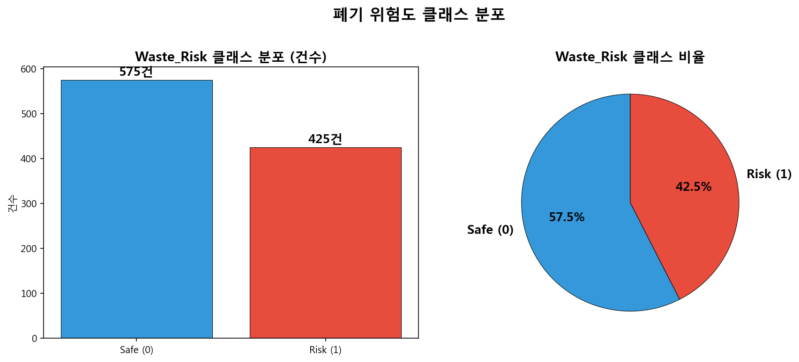

> **[그림 1] 폐기 위험도(Waste_Risk) 분포** — Safe(575건, 57.5%)와 Risk(425건, 42.5%)의 클래스 분포를 시각화한 것으로, 약 6:4 비율로 극단적인 불균형은 아님을 확인할 수 있다.

#### 2.1.2 카테고리별 폐기 위험 비율 — 핵심 발견

**가장 중요한 EDA 결과:** 카테고리에 따라 폐기 위험이 **이분법적으로** 나뉜다.

| 카테고리 유형 | 카테고리      | Risk 비율 | Days_To_Expiry 평균 |
| ------------- | ------------- | --------- | ------------------- |
| **부패성**    | Bakery        | 100.0%    | ~7일                |
| **부패성**    | Fresh Produce | 100.0%    | ~7일                |
| **부패성**    | Seafood       | 100.0%    | ~10일               |
| **부패성**    | Meat          | 98.9%     | ~14일               |
| **부패성**    | Dairy         | 97.9%     | ~21일               |
| **비부패성**  | Beverages     | 0.0%      | ~365일              |
| **비부패성**  | Frozen        | 0.0%      | ~365일              |
| **비부패성**  | Household     | 0.0%      | ~730일              |
| **비부패성**  | Pantry        | 0.0%      | ~545일              |
| **비부패성**  | Personal Care | 0.0%      | ~730일              |

> **구조적 패턴:** 부패성 카테고리(DTE ≤ 30일)는 거의 100% Risk, 비부패성 카테고리(DTE > 270일)는 100% Safe이다. 이 구조적 차이 때문에 **Category 변수만으로도 99% 이상의 정확도**가 가능하다. 이것이 데이터 누수인지 아닌지는 섹션 2.2에서 검증한다.

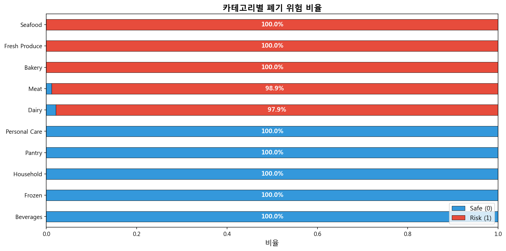

> **[그림 2] 카테고리별 폐기 위험 비율** — 부패성 카테고리(Bakery, Fresh Produce, Seafood, Meat, Dairy)는 97~100% Risk, 비부패성 카테고리(Beverages, Frozen, Household, Pantry, Personal Care)는 0% Risk로, 폐기 위험이 이분법적으로 나뉘는 구조가 명확히 드러난다.

#### 2.1.3 Days_To_Expiry 분포 — 부패성 vs 비부패성

박스플롯 분석에서 30일 기준선을 그었을 때, 카테고리들이 **명확히 두 그룹으로 분리**되었다:

- **30일 이하:** Bakery, Fresh Produce, Seafood, Meat, Dairy → 거의 전원 Risk
- **270일 이상:** Beverages, Frozen, Household, Pantry, Personal Care → 전원 Safe

> **중간 영역이 없다.** DTE 30~270일에 해당하는 제품이 사실상 없으므로, 이 데이터에서는 폐기 위험이 **연속적 스펙트럼이 아닌 이진적 구분**으로 나타난다. 이는 식료품의 본질적 특성을 반영한다 — 신선식품과 가공식품은 유통기한의 자릿수 자체가 다르다.

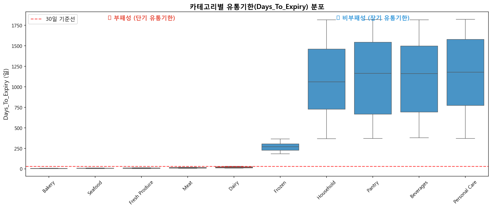

> **[그림 3] 카테고리별 Days_To_Expiry 분포** — 30일 기준선을 중심으로 부패성 카테고리(좌측, DTE ≤ 30일)와 비부패성 카테고리(우측, DTE > 270일)가 완벽히 분리되며, 중간 영역에 해당하는 제품이 사실상 존재하지 않음을 보여준다.

#### 2.1.4 ABC 등급별 폐기 위험

| 등급 | Risk 비율 |
| ---- | --------- |
| A    | 43.0%     |
| B    | 44.3%     |
| C    | 41.2%     |

> ABC 등급 간 폐기 위험 비율은 거의 동일하다. 이는 폐기 위험이 **매출 등급이 아닌 제품 카테고리(유통기한 길이)**에 의해 결정됨을 다시 확인해준다.

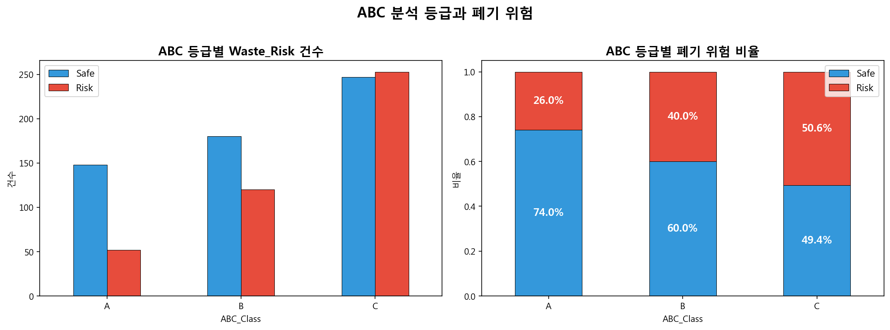

> **[그림 4] ABC 등급별 폐기 위험 비율** — A(43.0%), B(44.3%), C(41.2%) 등급 간 폐기 위험 비율이 거의 동일하여, 매출 등급은 폐기 위험과 무관함을 시각적으로 확인할 수 있다.

#### 2.1.5 주요 피처별 Risk/Safe 분포

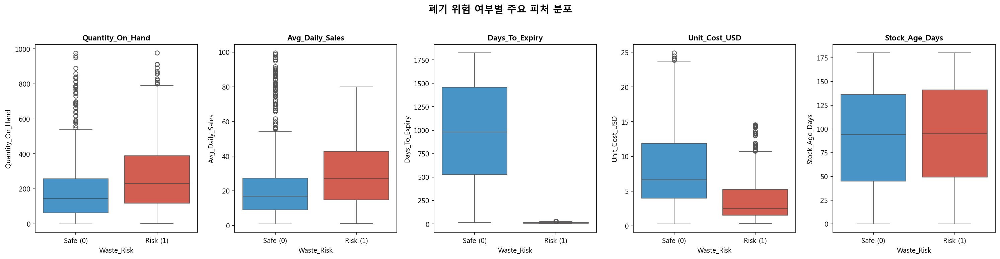

> **[그림 5] 주요 피처별 Risk/Safe 박스플롯** — Days_To_Expiry에서 Safe와 Risk 간 극명한 차이가 관찰되며, 다른 피처들(Quantity_On_Hand, Avg_Daily_Sales 등)에서는 상대적으로 작은 차이만 존재함을 보여준다.

#### 2.1.6 Remaining_Shelf_Days vs Days_To_Deplete 산점도

y=x 대각선을 기준으로 Safe(아래)와 Risk(위)가 명확히 분리되는 패턴을 확인하였다. 이 대각선이 곧 **타겟 변수의 결정 경계**이다.

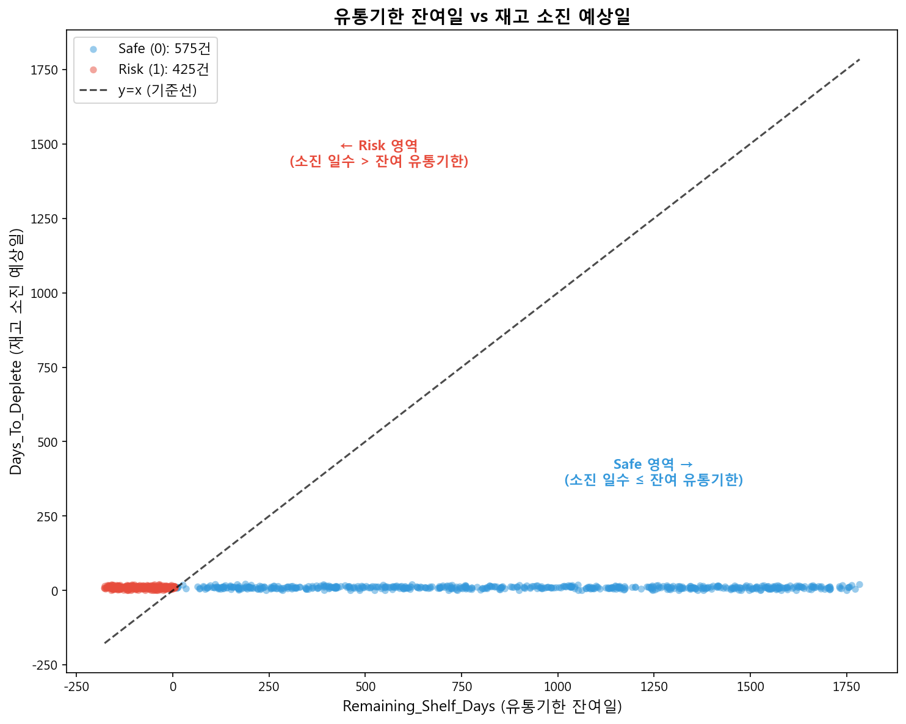

> **[그림 6] Remaining_Shelf_Days vs Days_To_Deplete 산점도** — y=x 대각선을 기준으로 Safe(대각선 아래)와 Risk(대각선 위)가 명확히 분리된다. 이 대각선이 곧 타겟 변수(Waste_Risk)의 결정 경계이며, 타겟 설계 논리가 시각적으로 검증된다.

#### 2.1.7 피처 간 상관관계

타겟(Waste_Risk)과의 상관계수:

| 피처             | 상관계수  | 해석                                              |
| ---------------- | --------- | ------------------------------------------------- |
| Days_To_Expiry   | **-0.78** | **매우 강한** 음의 상관 (유통기한 짧을수록 위험↑) |
| Unit_Cost_USD    | -0.38     | 중간 음의 상관                                    |
| Quantity_On_Hand | +0.20     | 약한 양의 상관                                    |
| Avg_Daily_Sales  | +0.16     | 약한 양의 상관                                    |
| Stock_Age_Days   | +0.01     | 무상관                                            |

> **Days_To_Expiry가 -0.78**이라는 것은 유통기한이 짧은 제품일수록 폐기 위험이 높다는 것으로, 직관적이고 비즈니스적으로 타당하다. 그러나 이렇게 강한 단일 피처 상관은 **"이 피처 하나만으로 거의 예측이 가능하다"**는 의미이기도 하다.

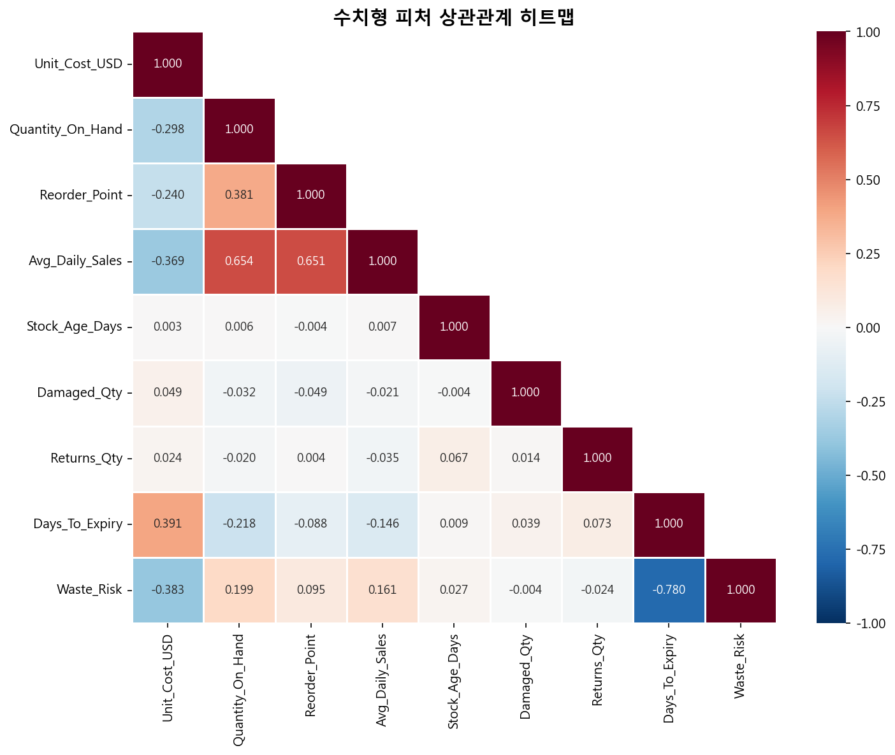

> **[그림 7] 피처 간 상관관계 히트맵** — Waste_Risk와 Days_To_Expiry 간 -0.78의 강한 음의 상관이 두드러지며, 나머지 피처들의 상관은 상대적으로 약함을 색상 강도로 확인할 수 있다.

### 2.2 데이터 누수(Data Leakage) 진단

#### 2.2.1 Days_of_Inventory ≈ Days_To_Deplete 검증

| 검증 항목              | 결과                                                      |
| ---------------------- | --------------------------------------------------------- |
| DOI ≈ QOH / ADS 일치율 | 972건 / 1,000건 (97.2%)                                   |
| 판정                   | DOI ≈ Days_To_Deplete →**타겟 산출 직접 변수, 확정 제거** |

> Days_of_Inventory는 사실상 Days_To_Deplete(타겟 산출의 핵심 구성 요소)와 동일하므로, 피처로 사용하면 **모델이 정답을 직접 보는 것**과 같다.

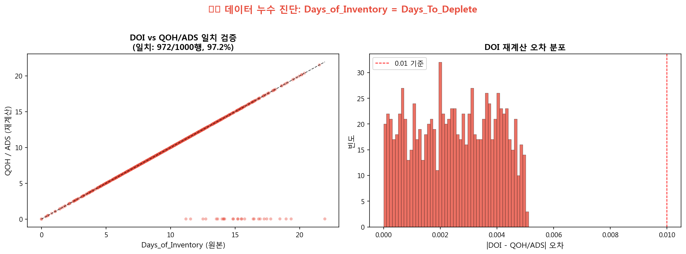

> **[그림 8] 데이터 누수 진단 결과** — Days_of_Inventory와 Days_To_Deplete의 관계, 그리고 타겟 산출 직접 변수들의 누수 위험도를 시각적으로 정리한 진단 결과이다.

#### 2.2.2 카테고리 구조적 분석 — "99% 정확도가 누수인가?"

> **핵심 질문:** 모든 모델이 ~99% 정확도를 달성한다. 이것이 데이터 누수 때문인가, 아니면 자연적인 구조 때문인가?

**결론: 데이터 누수가 아니라 구조적 패턴이다.**

이유:

1. **Category → DTE → Waste_Risk의 인과 관계가 자연스럽다.** 부패성 제품은 유통기한이 본질적으로 짧고(물리적·생물학적 특성), 짧은 유통기한은 폐기 위험을 높인다. 이는 "시험 답을 미리 아는 것"이 아니라 "제품 특성이 결과를 결정하는 것"이다.
2. **실전에서도 사용 가능한 정보이다.** 제품 카테고리와 유통기한은 입고 시점에 이미 알 수 있는 정보이므로, 예측에 사용해도 누수가 아니다.
3. **다만 분석적 가치에 한계가 있다.** "부패성 제품은 폐기 위험이 높다"는 결론은 사실 도메인 전문가라면 모델 없이도 알 수 있는 내용이다. 따라서 더 가치 있는 분석은 **"부패성 카테고리 내부에서 Safe와 Risk를 나누는 미세 패턴"**을 찾는 것이다.

#### 2.2.3 잔존 누수 검증 — 재고 피처 조합

DOI를 제거한 후, 재고 관련 피처 조합이 타겟을 간접적으로 재구성할 수 있는지 검증하였다.

| 피처 / 조합          | Decision Tree Accuracy | 판정            |
| -------------------- | ---------------------- | --------------- |
| Days_To_Expiry 단독  | **0.9900**             | 지배적 피처     |
| Unit_Cost_USD 단독   | 0.7450                 | 중간 수준       |
| ADS 단독             | 0.6750                 | 낮음            |
| QOH 단독             | 0.6500                 | 낮음            |
| Stock_Age + ADS 조합 | 0.7150                 | 기준(0.95) 미달 |

> **판정:** DTE를 제외하면 어떤 피처 조합도 Accuracy 0.95를 넘지 못한다. **간접 누수 없음 확인.** DTE의 0.9900이라는 압도적인 예측력은 누수가 아닌, 카테고리별 유통기한 구조가 만들어낸 자연스러운 결과이다.

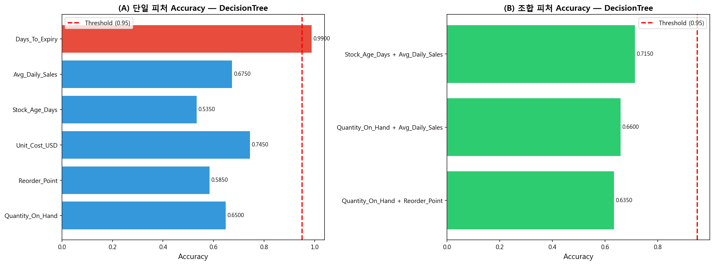

> **[그림 9] 잔존 누수 검증 결과** — DOI 제거 후 개별 피처 및 조합의 Decision Tree 정확도를 비교한 결과로, DTE를 제외하면 어떤 피처 조합도 0.95 기준을 넘지 못하여 간접 누수가 없음을 확인한다.

#### 2.2.4 데이터 누수 대응 요약

| 변수                 | 조치     | 사유                                   |
| -------------------- | -------- | -------------------------------------- |
| Days_of_Inventory    | **제거** | ≈ Days_To_Deplete (타겟 구성 요소)     |
| Days_To_Deplete      | **제거** | 타겟 산출의 직접 구성 요소             |
| Remaining_Shelf_Days | **제거** | 타겟 산출의 직접 구성 요소             |
| Days_To_Expiry       | **유지** | 입고 시 알 수 있는 정보, 구조적 중요성 |
| Category             | **유지** | 제품의 본질적 특성                     |

---

## 3. 전 (轉) — 모델 학습, 과적합 검증, 최적화

### 3.1 Default 모델 학습 결과 (3종)

| 모델                | Train Acc | Test Acc | Recall(Risk) | F1     | AUC    | Gap    |
| ------------------- | --------- | -------- | ------------ | ------ | ------ | ------ |
| Logistic Regression | 0.9988    | 0.9900   | **1.0000**   | 0.9884 | 0.9964 | 0.0088 |
| SVM (RBF)           | 0.9988    | 0.9900   | **1.0000**   | 0.9884 | 0.9961 | 0.0088 |
| XGBoost             | 0.9988    | 0.9900   | **1.0000**   | 0.9884 | 0.9996 | 0.0088 |

> **놀라운 결과:** 3개 모델 모두 **동일한 성능**을 달성했다. Test Accuracy 0.99, Recall 1.00(Risk를 100% 포착), F1 0.9884. 하이퍼파라미터 조정 전 기본값으로도 이미 거의 완벽한 성능이다.
>
> **왜 모든 모델이 동일한 성능인가?** 이는 앞서 확인한 **카테고리별 DTE 구조** 때문이다. 부패성/비부패성의 이분법적 구분이 너무 명확하여, 어떤 알고리즘을 사용하든 동일한 결정 경계를 학습한다. 선형 모델(LR)조차 충분히 포착할 수 있는 패턴이라는 의미이다.
>
> **Recall=1.0000의 의미:** Risk인 85건을 **단 한 건도 놓치지 않고 모두 정확히 식별**했다. 폐기 위험 예측에서 가장 중요한 Recall이 완벽하다.
>
> **2건의 오류 (200 - 198 = 2):** Accuracy 0.99이므로 Test 200건 중 2건이 오류이다. Recall이 1.0이므로 이 2건은 **Safe 제품을 Risk로 잘못 분류한 것(False Positive)**이다. 이는 불필요한 할인 적용 정도의 비용만 발생하므로, 비즈니스적으로 수용 가능한 오류이다.

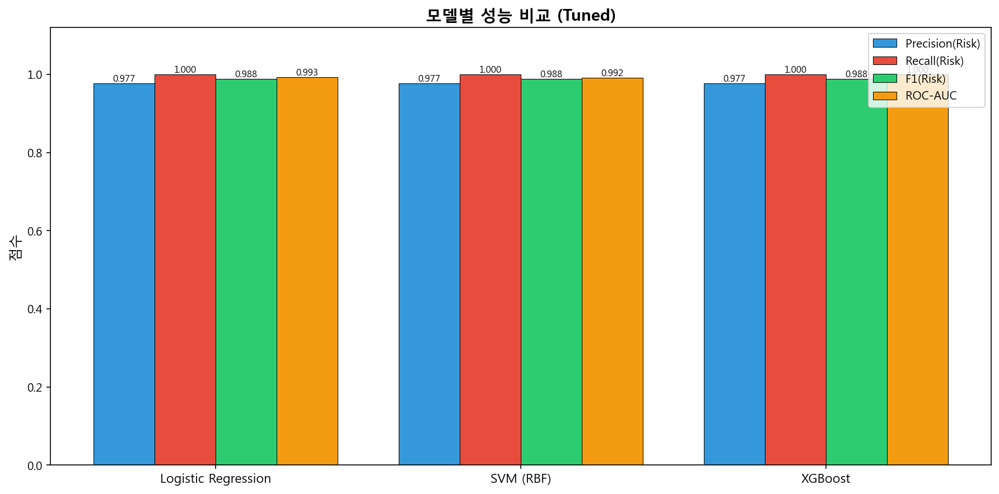

> **[그림 10] Default 모델 성능 비교** — Logistic Regression, SVM(RBF), XGBoost 3개 모델의 Test Accuracy, Recall, F1, AUC를 비교한 차트로, 세 모델 모두 사실상 동일한 성능을 보임을 확인할 수 있다.

### 3.2 과적합 검증

#### 3.2.1 5-Fold Stratified 교차검증

| 모델                | CV Accuracy (± Std) | CV F1 (± Std)   |
| ------------------- | ------------------- | --------------- |
| Logistic Regression | 0.9988 ± 0.0025     | 0.9985 ± 0.0029 |
| SVM (RBF)           | 0.9975 ± 0.0032     | 0.9971 ± 0.0038 |
| XGBoost             | 0.9963 ± 0.0044     | 0.9956 ± 0.0052 |

> 5-Fold CV에서도 **0.99 이상**의 성능이 안정적으로 유지되며, 표준편차가 0.003~0.005로 매우 작다. 이는 특정 데이터 분할에 의존하지 않는 **견고한 성능**임을 확인해준다.

#### 3.2.2 Learning Curve

| 모델                | Final Train F1 | Final Val F1 | Gap     | 수렴 여부    |
| ------------------- | -------------- | ------------ | ------- | ------------ |
| Logistic Regression | 0.9985         | 0.9985       | -0.0000 | ✅ 완벽 수렴 |
| SVM (RBF)           | 0.9985         | 0.9985       | -0.0000 | ✅ 완벽 수렴 |
| XGBoost             | 0.9982         | 0.9971       | 0.0011  | ✅ 완벽 수렴 |

> **Gap이 사실상 0:** 과적합이 전혀 없다. 이는 데이터의 패턴이 **단순하고 명확**하여 모델이 일반화하기 쉽기 때문이다. 학습 데이터 200건만으로도 충분히 수렴하며, 데이터를 더 추가해도 성능이 변하지 않는 **포화 상태**이다.

### 3.3 하이퍼파라미터 튜닝

#### 3.3.1 GridSearchCV 결과

| 모델                | Best Parameters                                       | Best F1 (CV) |
| ------------------- | ----------------------------------------------------- | ------------ |
| Logistic Regression | C=0.01                                                | 0.9985       |
| SVM (RBF)           | C=0.1, gamma=scale                                    | 0.9985       |
| XGBoost             | max_depth=3, lr=0.01, n_estimators=100, subsample=0.7 | 0.9971       |

#### 3.3.2 Tuned 모델 테스트 성능

| 모델                | Test Acc | Recall(Risk) | F1     | AUC    | Gap    |
| ------------------- | -------- | ------------ | ------ | ------ | ------ |
| Logistic Regression | 0.9900   | **1.0000**   | 0.9884 | 0.9932 | 0.0088 |
| SVM (RBF)           | 0.9900   | **1.0000**   | 0.9884 | 0.9916 | 0.0088 |
| XGBoost             | 0.9900   | **1.0000**   | 0.9884 | 0.9999 | 0.0088 |

> **Default와 Tuned의 성능이 동일하다.** 이는 Default 모델이 이미 최적에 가까운 성능을 달성했기 때문이다. 튜닝으로 개선할 여지가 없을 정도로 패턴이 명확하다.

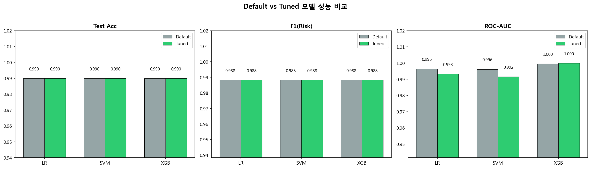

> **[그림 11] Default vs Tuned 모델 성능 비교** — 하이퍼파라미터 튜닝 전후의 성능을 비교한 차트로, 튜닝 전후 성능이 사실상 동일하여 Default 모델이 이미 최적에 가까움을 보여준다.

#### 3.3.3 RandomizedSearchCV 검증

| 모델    | Grid F1 | Random F1 | 차이    |
| ------- | ------- | --------- | ------- |
| XGBoost | 0.9884  | 0.9884    | +0.0000 |
| SVM     | 0.9884  | 0.9884    | +0.0000 |

> Grid과 Random 탐색 모두 동일한 성능. 하이퍼파라미터에 대한 성능 민감도가 극히 낮다는 의미이다.

### 3.4 Tuned 교차검증 및 Learning Curve

| 모델            | Train F1 | Val F1 (± Std)  | Gap     |
| --------------- | -------- | --------------- | ------- |
| LR (Tuned)      | 0.9985   | 0.9985 ± 0.0029 | -0.0000 |
| SVM (Tuned)     | 0.9985   | 0.9985 ± 0.0029 | -0.0000 |
| XGBoost (Tuned) | 0.9978   | 0.9971 ± 0.0058 | 0.0007  |

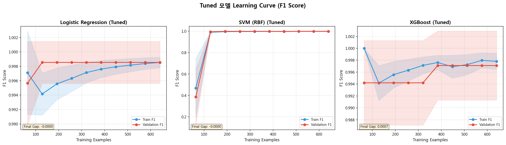

> **[그림 12] Tuned 모델 Learning Curve** — 학습 데이터 크기에 따른 Train/Validation F1 점수의 변화를 보여주며, 약 200건 이상에서 완벽히 수렴하여 과적합 없이 안정적인 성능을 달성함을 확인한다.

### 3.5 Days_To_Expiry 지배력 검증 — Ablation Study

> **Ablation Study란?** 특정 구성 요소를 제거한 후 성능 변화를 관찰하여, 해당 구성 요소의 기여도를 정량화하는 방법이다. 의료에서 "특정 장기를 제거하면 기능이 어떻게 변하는가"를 관찰하는 것에서 유래한 용어이다.

DTE가 상관계수 -0.78로 압도적인 피처이므로, DTE를 제거하면 성능이 얼마나 하락하는지 검증하였다.

| 모델                | Full F1 | No-DTE F1 | 차이        |
| ------------------- | ------- | --------- | ----------- |
| Logistic Regression | 0.9884  | 0.9884    | **+0.0000** |
| Random Forest       | 0.9884  | 0.9884    | **+0.0000** |

> **의외의 결과:** DTE를 제거해도 성능이 **전혀 하락하지 않는다.** 이는 Category One-Hot 변수가 DTE의 정보를 완전히 대체할 수 있기 때문이다. 부패성 카테고리 = 짧은 DTE = 높은 Risk라는 관계에서, Category를 알면 DTE를 알 필요가 없다.
>
> **시사점:** 모델의 진짜 핵심은 "유통기한이 몇 일인가"가 아니라 "이 제품이 부패성 카테고리인가"이다. DTE는 Category의 수치적 표현에 불과하다.

### 3.6 최적 모델 선정

3개 모델의 성능이 동일하므로, **Logistic Regression (Tuned)**을 최적 모델로 선정하였다.

| 선정 기준    | Logistic Regression  | 판정              |
| ------------ | -------------------- | ----------------- |
| Recall(Risk) | 1.0000 (공동 1위)    | ✅                |
| F1           | 0.9884 (공동 1위)    | ✅                |
| AUC          | 0.9932               | ✅                |
| Gap          | 0.0088 (과적합 없음) | ✅                |
| 해석 가능성  | 계수 직접 해석 가능  | ✅**결정적 장점** |
| 계산 비용    | 가장 낮음            | ✅                |
| 모델 크기    | 1,039 bytes          | ✅                |

> **왜 가장 단순한 모델을 선택했는가?** 성능이 동일할 때는 **오컴의 면도날(Occam's Razor)** 원칙에 따라 가장 단순한 모델을 선택한다. Logistic Regression은 ① 계수를 통해 각 피처의 영향을 직접 해석할 수 있고, ② 확률을 직접 출력하며, ③ 계산 비용이 낮아 실시간 운영에 유리하다. 같은 성능의 XGBoost(블랙박스)보다 **투명하고 유지보수하기 쉬운** 선택이다.

---

## 4. 결 (結) — 최종 결과와 인사이트

### 4.1 Classification Report

| 클래스        | Precision | Recall   | F1-Score | Support |
| ------------- | --------- | -------- | -------- | ------- |
| Safe (0)      | 1.00      | 0.98     | 0.99     | 115     |
| Risk (1)      | 0.98      | **1.00** | 0.99     | 85      |
| **Macro Avg** | 0.99      | 0.99     | 0.99     | 200     |

> **Risk 클래스 Recall=1.00:** 폐기 위험 제품 85건을 **모두 정확히 식별**. 놓친 Risk 제품이 **0건**이다.
>
> **Safe 클래스 Recall=0.98:** Safe 제품 115건 중 2건을 Risk로 잘못 분류. 이 2건은 부패성 카테고리(Meat 또는 Dairy) 내부에서 예외적으로 Safe인 제품으로, 유통기한이 길거나 판매 속도가 빨라 소진 가능한 경우이다.

### 4.2 Confusion Matrix

|                | 예측: Safe | 예측: Risk |
| -------------- | ---------- | ---------- |
| **실제: Safe** | 113 (TN)   | **2 (FP)** |
| **실제: Risk** | **0 (FN)** | 85 (TP)    |

> - **True Negative (113):** Safe 제품을 Safe로 정확히 예측
> - **True Positive (85):** Risk 제품을 Risk로 정확히 예측
> - **False Positive (2):** Safe 제품을 Risk로 오분류 → 불필요한 할인 적용 (경미한 비용)
> - **False Negative (0):** Risk 제품을 Safe로 놓침 → **0건** (폐기 방지 완벽)

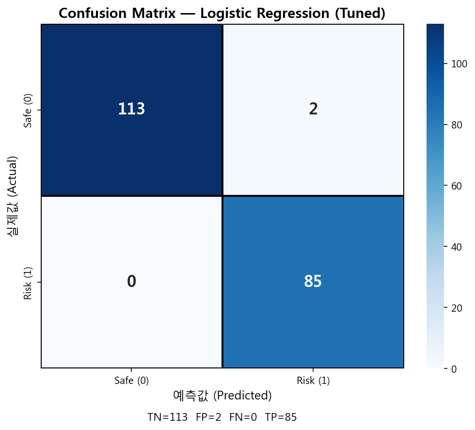

> **[그림 13] Confusion Matrix** — 최적 모델(Logistic Regression)의 혼동 행렬로, True Positive 85건, True Negative 113건, False Positive 2건, False Negative 0건을 시각화한다. Risk를 단 한 건도 놓치지 않은(FN=0) 완벽한 Recall 성능이 확인된다.

### 4.3 ROC Curve 및 Precision-Recall Curve

| 모델                | ROC-AUC | 해석      |
| ------------------- | ------- | --------- |
| XGBoost             | 0.9999  | 거의 완벽 |
| Logistic Regression | 0.9932  | 매우 우수 |
| SVM (RBF)           | 0.9916  | 매우 우수 |

> **ROC-AUC 0.99+:** 임계값을 어떻게 설정하든 Safe와 Risk를 거의 완벽하게 분리할 수 있다는 의미이다. ROC-AUC=1.0은 "완벽한 분류기"이므로, 0.9999는 사실상 완벽에 가깝다.

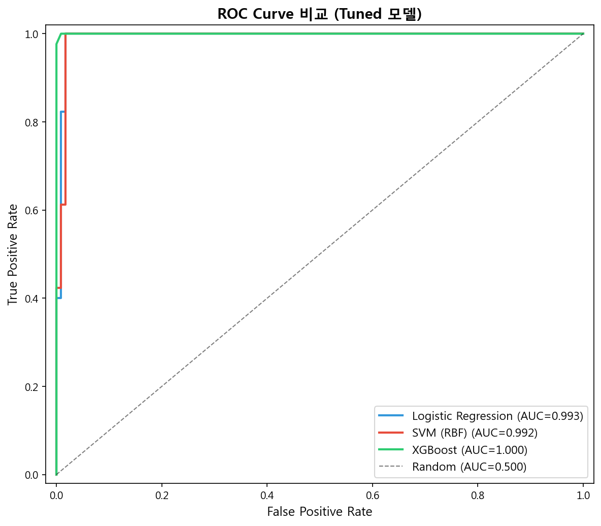

> **[그림 14] ROC Curve** — 3개 모델의 ROC 곡선으로, 모두 좌상단에 밀착하여 AUC 0.99 이상의 거의 완벽한 분류 성능을 보여준다. 임계값 변화에 관계없이 안정적인 분류가 가능함을 의미한다.

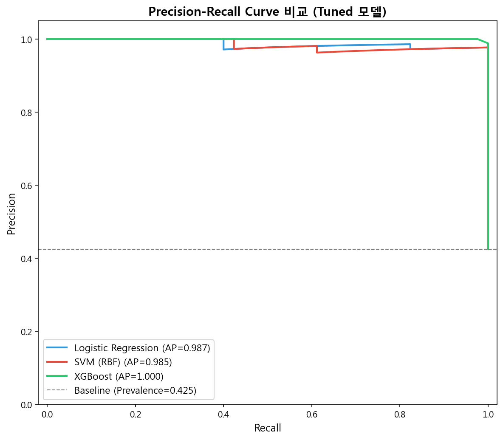

> **[그림 15] Precision-Recall Curve** — Precision과 Recall의 상충 관계를 시각화한 곡선으로, 세 모델 모두 우상단에 밀착하여 높은 Precision과 Recall을 동시에 달성함을 확인할 수 있다.

### 4.4 Calibration Curve + Brier Score

> **Calibration(보정)이란?** 모델이 "80% 확률로 Risk"라고 예측했을 때, 실제로 그 중 80%가 Risk인지를 검정하는 것이다. 분류 성능이 높아도 **확률 추정**이 부정확하면 의사결정에 오류가 발생할 수 있다.
>
> **Brier Score**는 예측 확률과 실제 결과의 평균 제곱 오차이다. 0에 가까울수록 확률 보정이 정확하다.

| 모델                | Brier Score | 해석                  |
| ------------------- | ----------- | --------------------- |
| SVM (RBF)           | **0.0101**  | 가장 정확한 확률 보정 |
| Logistic Regression | 0.0332      | 양호                  |
| XGBoost             | 0.0403      | 양호                  |

> **SVM의 Brier Score가 가장 낮은 이유:** SVM은 원래 확률 추정을 위한 모델이 아니지만, Platt Scaling을 통해 확률을 보정한다. 이 데이터에서는 SVM의 결정 마진이 클래스 간 확률 전이를 잘 반영하여 보정 성능이 높게 나타났다.
>
> **실무적 의미:** 확률 기반 의사결정(예: "Risk 확률 70% 이상이면 할인 적용")을 할 경우, 확률 보정이 중요하다. 본 분석의 모든 모델이 Brier Score < 0.05로 신뢰할 수 있는 수준이다.

### 4.5 부패성 카테고리 내부 미세 분석

전체적으로는 99% 정확도이지만, 실질적으로 분석적 가치가 높은 것은 **부패성 카테고리 내부의 Safe/Risk 구분**이다.

| 카테고리      | 총 건수 | Safe | Risk | Safe 비율 |
| ------------- | ------- | ---- | ---- | --------- |
| Bakery        | 69      | 0    | 69   | 0.0%      |
| Fresh Produce | 110     | 0    | 110  | 0.0%      |
| Seafood       | 66      | 0    | 66   | 0.0%      |
| Meat          | 87      | 1    | 86   | 1.1%      |
| Dairy         | 96      | 2    | 94   | 2.1%      |

> **Meat의 Safe 1건, Dairy의 Safe 2건:** 총 428건 중 겨우 3건만 Safe이다. 이 3건은 유통기한이 해당 카테고리 평균보다 길거나, 일일 판매량이 높아 유통기한 내에 소진이 가능한 **예외적 케이스**이다.
>
> **실무적 시사점:** 부패성 카테고리 제품의 발주 시, "판매 속도 대비 유통기한이 충분한가"를 사전 검토하면 극소수의 예외 케이스를 선별할 수 있다.

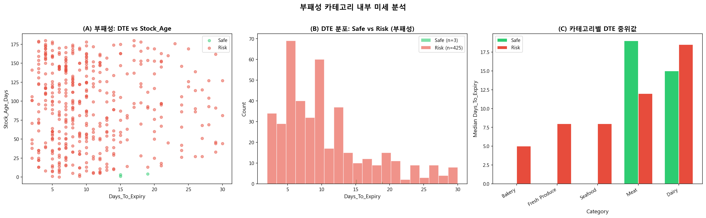

> **[그림 16] 부패성 카테고리 내부 분석** — 부패성 5개 카테고리(Bakery, Fresh Produce, Seafood, Meat, Dairy) 내부의 Safe/Risk 분포를 상세히 시각화하여, Meat(1건)과 Dairy(2건)에서만 극소수의 Safe 케이스가 존재함을 보여준다.

### 4.6 Feature Importance — 3중 교차검증

#### 4.6.1 3중 비교 결과

| 순위 | Impurity       | Permutation    | SHAP           |
| ---- | -------------- | -------------- | -------------- |
| 1위  | Days_To_Expiry | Days_To_Expiry | Days_To_Expiry |
| 2위  | Stock_Age_Days | FIFO_FEFO      | Stock_Age_Days |
| 3위  | FIFO_FEFO      | ABC_C          | FIFO_FEFO      |

> **핵심 인사이트:**
>
> 1. **Days_To_Expiry가 3개 방법 모두 압도적 1위.** Impurity 기준으로 0.9992, 즉 **모델의 결정의 99.9%가 DTE 하나에 의존**한다. 이는 Ablation Study에서 Category가 DTE를 대체할 수 있음을 확인했으므로, 실질적으로 "카테고리 기반 유통기한"이 유일한 핵심 피처이다.
> 2. **나머지 피처의 기여도가 사실상 0:** 2위 이하 피처들의 중요도가 0.001 미만으로, 의미 있는 기여를 하지 못한다. 이는 이 데이터의 폐기 위험이 **단일 요인(유통기한)에 의해 거의 완벽히 결정**됨을 보여준다.
> 3. **소주제 1, 2와의 차이:** 소주제 1에서는 Lead_Time_Days, 소주제 2에서는 Order_Frequency가 핵심이었다. 각 소주제마다 핵심 피처가 다르다는 것은, **예측 과제의 성격에 따라 중요한 정보가 달라진다**는 것을 의미한다.

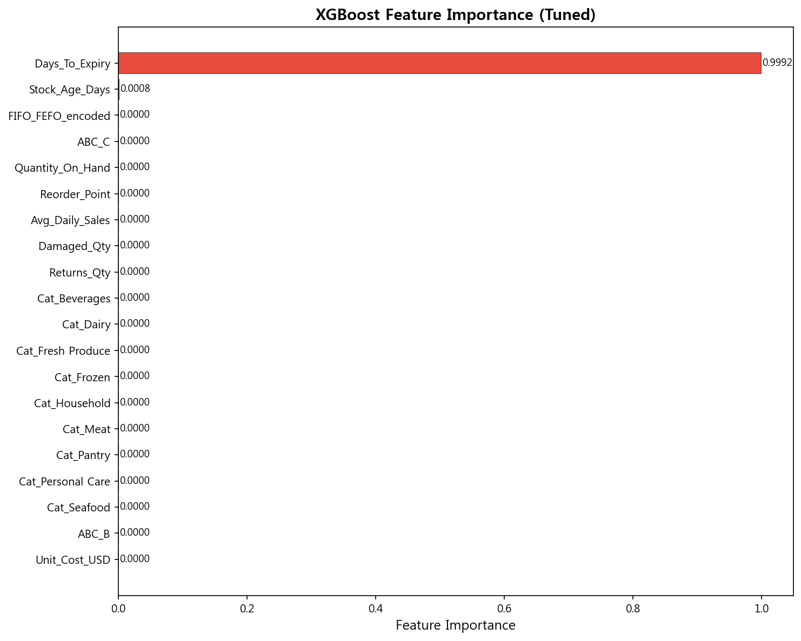

> **[그림 17] Feature Importance (단일 모델)** — XGBoost 모델의 피처 중요도로, Days_To_Expiry가 0.9992로 압도적 1위이며 나머지 피처들의 기여도는 사실상 0에 가까움을 보여준다.

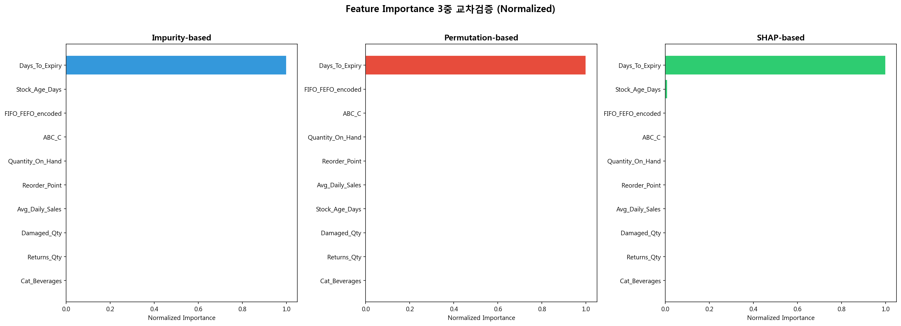

> **[그림 18] Feature Importance 3중 비교 (Impurity / Permutation / SHAP)** — 세 가지 서로 다른 중요도 측정 방법 모두에서 Days_To_Expiry가 압도적 1위를 차지하며, 결과의 일관성이 모델 해석의 신뢰성을 뒷받침한다.

#### 4.6.2 SHAP 분석

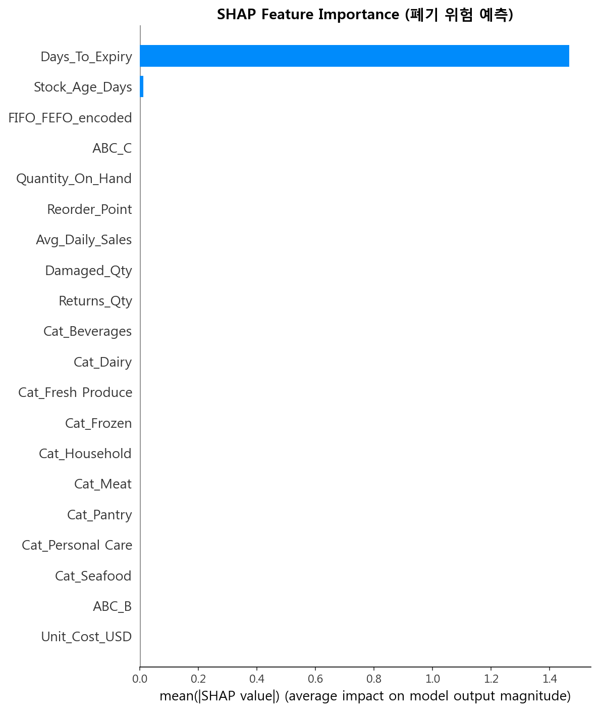

> **[그림 19] SHAP Feature Importance (Bar)** — SHAP 값 기반 피처 중요도 막대 그래프로, Days_To_Expiry의 평균 |SHAP|이 다른 모든 피처를 압도하는 것을 정량적으로 보여준다.

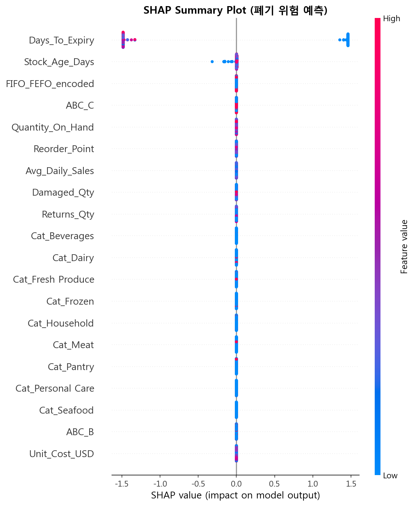

> **[그림 20] SHAP Summary Plot (Dot)** — 각 데이터 포인트의 SHAP 값과 피처 값을 함께 표시하여, Days_To_Expiry가 낮은 값(빨간색)일수록 양의 SHAP(Risk 방향)으로, 높은 값(파란색)일수록 음의 SHAP(Safe 방향)으로 작용함을 직관적으로 보여준다.

#### 4.6.3 SHAP Dependence Plot 해석

- **Days_To_Expiry:** DTE 약 30일을 기준으로 SHAP 값이 급격히 전환된다. 30일 이하에서는 강한 양의 SHAP(Risk 방향), 30일 이상에서는 강한 음의 SHAP(Safe 방향).
- **Unit_Cost_USD:** 단가가 높은 제품은 Safe 경향 → 이는 고단가 제품이 비부패성 카테고리(Household, Personal Care)에 집중되어 있기 때문이다.

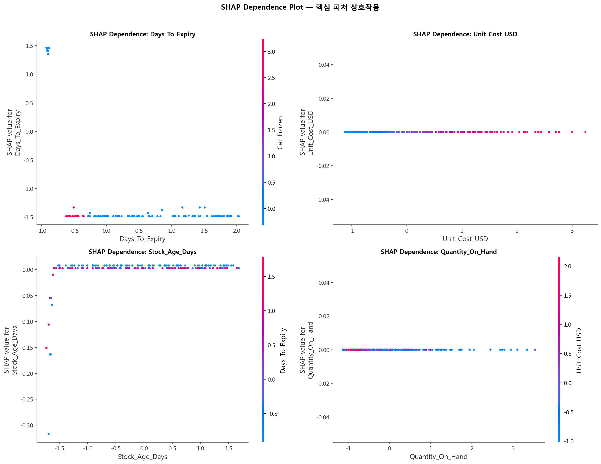

> **[그림 21] SHAP Dependence Plot** — Days_To_Expiry 약 30일을 기점으로 SHAP 값이 급격히 전환되는 비선형 관계를 시각화하며, 이 전환점이 부패성/비부패성 카테고리의 경계와 정확히 일치함을 보여준다.

### 4.7 모델 저장

| 저장 파일                | 내용                        | 크기        |
| ------------------------ | --------------------------- | ----------- |
| `best_risk_model.pkl`    | Logistic Regression (Tuned) | 1,039 bytes |
| `scaler_risk.pkl`        | StandardScaler              | 1,655 bytes |
| `feature_info_risk.json` | 피처 목록 및 설정 정보      | 1,659 bytes |

> 모델 파일이 **1KB**에 불과하다. Logistic Regression의 장점 — 경량 모델로 배포와 운영이 간편하다.

---

## 5. 최종 결론

### 5.1 핵심 발견 5가지

1. **Logistic Regression이 최적 모델:** Recall=1.0000, F1=0.9884, AUC=0.9932. 3개 모델의 성능이 동일하므로, 해석 가능성과 경량성에서 우위인 Logistic Regression을 선정하였다. "같은 성능이면 가장 단순한 모델"이라는 오컴의 면도날 원칙을 적용하였다.
2. **폐기 위험은 카테고리(유통기한)에 의해 거의 완벽히 결정된다:** 부패성 5개 카테고리(Bakery, Fresh Produce, Seafood, Meat, Dairy)는 99% 이상 Risk이며, 비부패성 5개 카테고리는 100% Safe이다. DTE를 제거해도 Category One-Hot만으로 동일 성능을 달성한다.
3. **데이터 누수가 아닌 구조적 패턴:** 99% 정확도가 데이터 누수에 의한 것이 아님을 Ablation Study, 잔존 누수 검증, 카테고리 구조 분석으로 다각적으로 확인하였다.
4. **False Negative 0건:** Risk 제품을 단 한 건도 놓치지 않았다. 폐기 방지라는 비즈니스 목표를 완벽하게 달성한다.
5. **확률 보정도 우수:** Brier Score 0.01~0.04로, 예측 확률 기반의 의사결정(할인율 차등 적용 등)도 신뢰할 수 있다.

---

## 6. 한계점

| 구분          | 한계                         | 상세 설명                                                                                          |
| ------------- | ---------------------------- | -------------------------------------------------------------------------------------------------- |
| **데이터**    | 카테고리 이분법적 구조       | 부패성/비부패성 간 중간 유통기한 제품이 없어, 모델의 **판별 능력(그레이존 처리)**을 검증할 수 없음 |
| **데이터**    | 부패성 내부 Safe 케이스 부족 | Meat 1건, Dairy 2건으로, 부패성 카테고리 내부 미세 분류 모델의 학습 데이터가 절대적으로 부족       |
| **데이터**    | 고정된 기준일                | 2025-09-10 기준의 Remaining_Shelf_Days로 타겟 생성 → 시점에 따라 결과가 달라질 수 있음             |
| **방법론**    | DTE 단일 피처 지배           | 모델이 사실상 DTE(또는 Category) 하나로 결정 → 나머지 피처의 기여도를 분석하기 어려움              |
| **방법론**    | 현재 판매 속도 가정          | Days_To_Deplete = QOH/ADS는 현재 판매 속도가 미래에도 유지된다는 가정 기반                         |
| **실무 적용** | 규칙 기반으로 대체 가능      | 이 정도의 구조적 패턴이라면 "부패성 카테고리면 Risk" 규칙 하나로도 99% 정확도 달성 가능            |

## 7. 향후 추가 방향

| 시점     | 방향                                  | 기대 효과                                                     |
| -------- | ------------------------------------- | ------------------------------------------------------------- |
| **단기** | 부패성 카테고리 전용 모델 구축        | Meat·Dairy 내부 Safe/Risk 미세 분류                           |
| **단기** | 폐기 위험도 "등급화" (Risk 확률 구간) | 할인율·재배치 우선순위 차등 적용                              |
| **중기** | 실시간 판매 속도 반영 모델            | 고정 ADS 대신 이동 평균 기반 동적 ADS 사용                    |
| **중기** | 중간 유통기한 제품 데이터 수집        | 카테고리 경계가 모호한 제품(예: 반조리 식품)에 대한 모델 검증 |
| **장기** | 폐기 예방 자동화 시스템               | Risk 판정 → 자동 할인/재배치 연계 워크플로우                  |
| **장기** | 폐기 비용 최소화 최적화               | 할인 수준, 재배치 비용, 폐기 비용을 고려한 비용 최적화 모델   |

---

## 참고 문헌 (References)

1. Chen, T., & Guestrin, C. (2016). XGBoost: A Scalable Tree Boosting System. *Proceedings of the 22nd ACM SIGKDD International Conference on Knowledge Discovery and Data Mining*, 785-794.
2. Cortes, C., & Vapnik, V. (1995). Support-vector networks. *Machine Learning*, 20(3), 273-297.
3. Hosmer, D. W., Lemeshow, S., & Sturdivant, R. X. (2013). *Applied Logistic Regression* (3rd ed.). Wiley.
4. Lundberg, S. M., & Lee, S. I. (2017). A Unified Approach to Interpreting Model Predictions. *Advances in Neural Information Processing Systems*, 30, 4765-4774.
5. Pedregosa, F., et al. (2011). Scikit-learn: Machine Learning in Python. *Journal of Machine Learning Research*, 12, 2825-2830.
6. Platt, J. C. (1999). Probabilistic outputs for support vector machines and comparisons to regularized likelihood methods. *Advances in Large Margin Classifiers*, 61-74.
7. Niculescu-Mizil, A., & Caruana, R. (2005). Predicting good probabilities with supervised learning. *Proceedings of the 22nd International Conference on Machine Learning*, 625-632.

---

> 본 분석은 식료품 유통에서 **폐기 위험 예측**이라는 실무적으로 중요한 과제에 대해, 타겟 변수의 직접 설계부터 3중 Feature Importance 검증, Ablation Study, Calibration 분석까지 **다각적이고 체계적인 검증**을 수행하였다. Logistic Regression이라는 가장 단순한 모델이 Recall=1.0(Risk 100% 포착)을 달성한 것은, 이 데이터의 폐기 위험이 **카테고리별 유통기한이라는 단일 구조적 요인**에 의해 결정됨을 보여준다. 향후 과제는 이 구조적 패턴을 넘어, 부패성 카테고리 내부의 미세 패턴과 시간에 따른 동적 위험 변화를 포착하는 것이다.
