# 소주제 4 — 최적 발주 전략 클러스터링 결과 보고서

> **프로젝트:** 머신러닝 기반 식료품 유통 재고 관리 최적화 시스템
> **분석 주제:** 최적 발주 전략 클러스터링 (Regression + Clustering + EOQ Simulation)
> **담당:** 박준영
> **작성일:** 2026-03-13

---

## 요약 (Abstract)

본 보고서는 1,000개 식료품 제품의 최적 발주 전략을 도출하기 위해 **회귀 분석(Phase A) → K-Means 클러스터링(Phase B) → EOQ 시뮬레이션(Phase C)**의 3단계 연결 분석을 수행한 결과를 정리한다. Phase A에서는 데이터 누수(Data Leakage)를 체계적으로 진단하고 제거한 뒤, 3중 Feature Importance 분석을 통해 재고 보유일수(DOI)의 핵심 결정 요인(ABC 등급, 재주문 긴급도, 단가, 리드타임)을 도출하였다. Phase B에서는 Hopkins Statistic(0.86)으로 군집 구조 존재를 사전 확인하고, Elbow Method와 Silhouette Score를 결합하여 최적 K=2를 결정한 뒤, 제품을 **일반 제품군(Cluster 0, 82%)**과 **고관리 필요 제품군(Cluster 1, 18%)**으로 분류하였다. Phase C에서는 군집별 EOQ를 산출하여, Cluster 0에는 EOQ 기반 정기 발주(평균 974개), Cluster 1에는 안전재고 강화 및 긴급 보충(평균 2,129개)이라는 차별화된 발주 전략을 제안하였다. 본 분석은 소주제 1~3의 분류, 예측, 위험 식별 결과와 연계되어 식료품 유통 재고 관리의 통합적 의사결정 체계를 완성한다.

---

## 1. 기 (起) — 분석 배경과 목표

### 1.1 왜 발주 전략을 클러스터링하는가?

식료품 유통에서 1,000개 이상의 제품을 **동일한 방식으로 발주**하는 것은 비효율적이다. 빠르게 팔리는 음료와 느리게 팔리는 가정용품에 같은 발주 주기와 수량을 적용하면, 한쪽은 결품이 나고 다른 쪽은 과재고가 쌓인다. **제품의 특성에 따라 발주 전략을 차별화**해야 한다.

소주제 1~3이 각각 분류·회귀·이진분류라는 **지도학습(Supervised Learning)** 문제를 다루었다면, 소주제 4는 **비지도학습(Unsupervised Learning)**인 클러스터링을 통해 "정답 없이" 유사한 제품들을 군집화하고, 각 군집에 맞는 발주 전략을 제안하는 것이 핵심이다.

### 1.2 분석의 3단계 구조 (Phase A → B → C)

소주제 4는 단일 모델이 아닌 **3개 Phase의 연결 분석**으로 구성된다.

| Phase       | 목표                    | 방법론                 | 핵심 가치                                   |
| ----------- | ----------------------- | ---------------------- | ------------------------------------------- |
| **Phase A** | 재고 보유일수(DOI) 예측 | 회귀 (LR, RF, XGBoost) | DOI에 영향을 미치는**핵심 피처 도출**       |
| **Phase B** | 제품 군집화             | K-Means Clustering     | 유사 제품 그룹 발견 →**차별화 전략의 근거** |
| **Phase C** | 발주량 최적화           | EOQ 시뮬레이션         | 군집별**구체적 발주량·비용** 산출           |

> **왜 3단계인가?** 클러스터링만으로는 "왜 이렇게 묶였는가"를 설명하기 어렵다. Phase A에서 DOI에 영향을 미치는 피처를 먼저 파악하고, Phase B에서 이 정보를 포함한 피처로 군집화한 뒤, Phase C에서 각 군집에 맞는 **실행 가능한 발주 전략**을 수치로 제시한다. 세 단계가 연결되어야 "분석 → 이해 → 행동"의 완전한 흐름이 만들어진다.

### 1.3 데이터 개요

| 항목              | 내용                                           |
| ----------------- | ---------------------------------------------- |
| 데이터 규모       | 1,000행 × 37열 (원본)                          |
| Phase A 타겟      | Days_of_Inventory (재고 보유일수)              |
| Phase B 대상      | 전체 1,000개 제품                              |
| Phase C 기본 가정 | 발주비용(S) = 50 USD, 보관비율(H) = 단가의 20% |

### 1.4 사용된 모델과 기법

#### 1.4.1 Phase A — 회귀 모델

소주제 2와 동일한 Linear Regression, Random Forest, XGBoost를 사용하였다. 단, Phase A의 목적은 높은 R²가 아니라 **DOI에 영향을 미치는 피처를 파악**하는 것이다.

#### 1.4.2 Phase B — K-Means Clustering

> **K-Means Clustering이란?** 데이터를 K개의 그룹(군집)으로 나누는 비지도학습 알고리즘이다. 각 군집의 중심점(Centroid)을 반복적으로 업데이트하며, 같은 군집 내 데이터끼리는 **가깝고**, 다른 군집과는 **멀어지도록** 최적화한다.
>
> **비유:** 1,000명의 고객을 서비스 이용 패턴에 따라 자연스럽게 몇 개 그룹으로 나누는 것과 같다. 모델에게 "이 고객은 A그룹"이라고 정답을 알려주지 않아도, 유사한 패턴을 가진 고객끼리 자동으로 묶인다.

#### 1.4.3 Phase C — EOQ (Economic Order Quantity)

> **EOQ(경제적 주문량)**는 재고 관리의 고전적 최적화 공식이다.
>
> $$
> EOQ = \sqrt{\frac{2 \times D \times S}{H}}
> $$
>
> - D: 연간 수요량 (Annual Demand)
> - S: 1회 발주 비용 (Ordering Cost) = 50 USD
> - H: 단위당 연간 보관비 = Unit_Cost × 20%
>
> EOQ는 **발주 비용과 보관 비용의 합을 최소화**하는 1회 발주량이다. 너무 적게 발주하면 발주 횟수가 많아져 발주 비용이 늘고, 너무 많이 발주하면 재고가 쌓여 보관 비용이 늘기 때문에, **두 비용이 만나는 균형점**이 EOQ이다.

### 1.5 평가 지표

#### 1.5.1 Phase A (회귀)

소주제 2와 동일하게 R², RMSE, MAE, Train-Test Gap을 사용하였다.

#### 1.5.2 Phase B (클러스터링)

비지도학습은 "정답"이 없으므로 지도학습과 다른 평가 방법을 사용한다.

| 지표                  | 의미                                     | 해석                                     |
| --------------------- | ---------------------------------------- | ---------------------------------------- |
| **Silhouette Score**  | 군집 내 응집도 vs 군집 간 분리도         | -1~+1, 높을수록 좋은 군집                |
| **Elbow Method**      | Inertia(군집 내 거리 합)의 감소율 변곡점 | K를 늘려도 감소가 둔화되는 "팔꿈치" 지점 |
| **Hopkins Statistic** | 데이터에 군집 구조가 존재하는지 검정     | 0.75+ = 강한 군집 경향                   |

> **Silhouette Score 해석:** 각 데이터 포인트에 대해 "같은 군집 내 다른 점들과의 평균 거리(a)"와 "가장 가까운 다른 군집의 점들과의 평균 거리(b)"를 비교한다. (b-a)/max(a,b)로 계산하며, +1에 가까우면 해당 점이 자기 군집에 잘 속해 있고, 0에 가까우면 군집 경계에 있으며, 음수이면 잘못된 군집에 배정되었을 가능성이 있다.
>
> **Hopkins Statistic:** 데이터가 균일하게 분포(군집 없음)되어 있는지, 아니면 특정 영역에 모여 있는(군집 있음)지를 검정한다. H > 0.75이면 군집 구조가 있다고 판단하며, K-Means 적용이 의미 있음을 사전에 확인할 수 있다.

### 1.6 파생변수 엔지니어링 (Feature Engineering)

원본 37개 컬럼에서 **10개의 파생변수**를 추가로 생성하여, 재고 관리의 도메인 지식을 데이터에 반영하였다.

| 파생변수            | 산출 방식                    | 의미                                 |
| ------------------- | ---------------------------- | ------------------------------------ |
| Dynamic_ROP         | ADS × Lead_Time_Days         | 수요 기반 동적 재주문점              |
| ROP_Gap             | Reorder_Point - Dynamic_ROP  | 현재 재주문점과 동적 재주문점의 차이 |
| Stock_Coverage_Days | QOH / ADS                    | 현재고로 버틸 수 있는 일수           |
| Demand_Variability  | ADS의 표준화 변동률          | 수요 불확실성 지표                   |
| EOQ                 | √(2×D×S/H)                   | 경제적 주문량                        |
| Reorder_Urgency     | QOH / Reorder_Point          | 재주문 긴급도 (1 미만이면 긴급)      |
| Supply_Risk         | Lead_Time × (1 - OnTime%)    | 공급 리스크 지표                     |
| Order_Efficiency    | OF / ADS × 100               | 주문 효율성                          |
| Available_Stock     | QOH - Reserved - Committed   | 실제 사용 가능한 재고                |
| RP_SS_Ratio         | Reorder_Point / Safety_Stock | 재주문점 대비 안전재고 비율          |

> **왜 파생변수를 만드는가?** 원본 변수 개별로는 드러나지 않는 **관계와 패턴**을 포착하기 위해서이다. 예를 들어, QOH(현재고)와 RP(재주문점)는 각각 의미가 있지만, QOH/RP인 Reorder_Urgency는 **"지금 발주해야 하는 긴급도"**를 직접 나타낸다. 이 정보가 클러스터링에서 유사 제품을 더 의미 있게 묶는 데 기여한다.

### 1.7 데이터 전처리 및 분할

소주제 1~3과 동일한 인도네시아 로케일 변환을 수행하였다. Phase A의 회귀 분석에서는 80:20 Train/Test Split과 StandardScaler를 적용하였다.

---

## 2. 승 (承) — 데이터 누수 진단과 탐색적 분석

### 2.1 EDA (탐색적 데이터 분석)

#### 2.1.1 Days_of_Inventory 분포

| 통계량 | 값      |
| ------ | ------- |
| 평균   | 9.99일  |
| 최소   | 0.00일  |
| 최대   | 21.95일 |

> 대부분의 제품이 약 10일 분량의 재고를 보유하고 있으며, 0일(즉시 소진)부터 약 22일까지 분포한다.

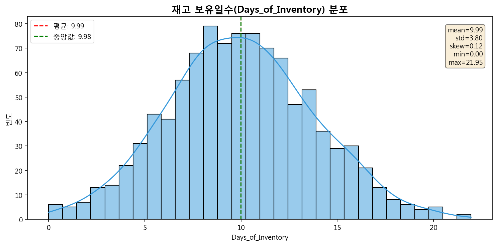

> **[그림 1] Days_of_Inventory 분포** — 전체 1,000개 제품의 재고 보유일수 히스토그램이다. 평균 약 10일을 중심으로 0~22일 범위에 걸쳐 분포하며, 특정 구간에 극단적 편중 없이 비교적 고르게 퍼져 있음을 확인할 수 있다.

#### 2.1.2 카테고리별·ABC별 보유일수

박스플롯 분석에서 카테고리 간 DOI 차이는 소주제 2의 판매량만큼 뚜렷하지 않았다. ABC 등급별로도 큰 차이가 없어, DOI는 카테고리나 등급보다 **개별 제품의 특성**(판매 속도, 재고 수준)에 의해 결정됨을 시사한다.

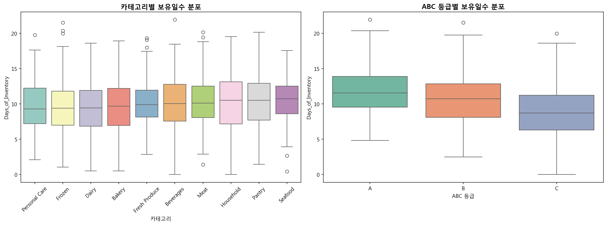

> **[그림 2] 카테고리별 DOI 박스플롯** — 각 카테고리(Beverages, Dairy, Fresh Produce 등)의 재고 보유일수 분포를 비교한 것이다. 카테고리 간 중앙값 차이가 크지 않아, DOI는 카테고리보다 개별 제품 특성에 의해 결정됨을 시사한다.

#### 2.1.3 피처 간 상관관계

핵심 상관관계:

- **QOH ↔ DOI (+0.60):** 현재고가 많을수록 보유일수가 길다 (당연한 관계)
- **ADS ↔ DOI (-0.38):** 판매 속도가 빠를수록 보유일수가 짧다
- **QOH ↔ ADS (+0.68):** 많이 팔리는 제품은 재고도 많이 확보한다

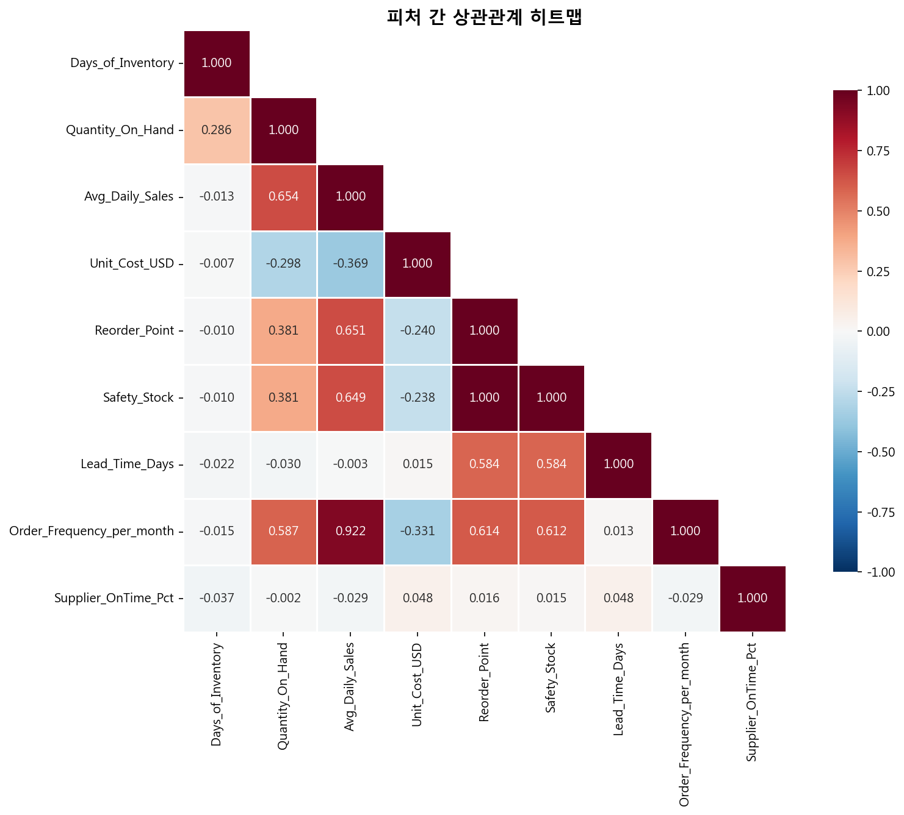

> **[그림 3] 피처 간 상관관계 히트맵** — 주요 수치형 변수들 사이의 피어슨 상관계수를 색상으로 표현한 것이다. QOH-DOI 간 강한 양의 상관(+0.60)과 ADS-DOI 간 음의 상관(-0.38)이 눈에 띄며, 이는 데이터 누수 진단의 근거가 된다.

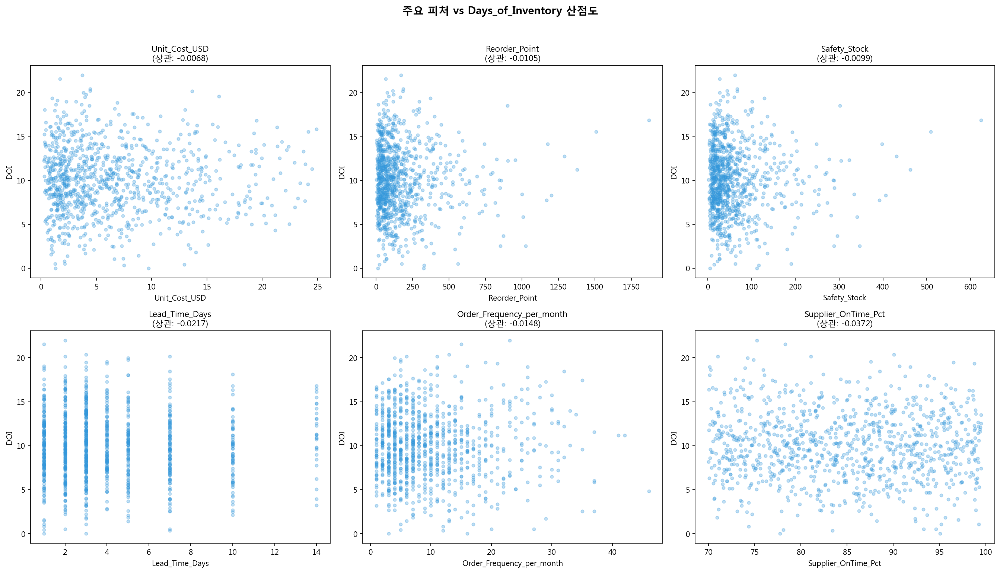

> **[그림 4] 주요 피처-DOI 산점도** — QOH, ADS 등 핵심 변수와 DOI 간의 관계를 산점도로 시각화한 것이다. QOH와 DOI 사이의 양의 선형 관계, ADS와 DOI 사이의 비선형적 역관계를 직관적으로 확인할 수 있다.

### 2.2 데이터 누수(Data Leakage) 진단 — Phase A 전용

#### 2.2.1 DOI = QOH / ADS 수식 확인

| 검증 항목         | 결과                                                        |
| ----------------- | ----------------------------------------------------------- |
| 오차 1% 이내 일치 | 972건 / 1,000건 (97.2%)                                     |
| 판정              | DOI는 QOH와 ADS의 나눗셈 →**두 변수를 함께 쓰면 확정 누수** |

> **소주제 4만의 누수 문제:** 소주제 1~3에서는 DOI를 피처에서 제거하는 것으로 충분했다. 그러나 소주제 4에서는 **DOI 자체가 타겟**이므로, DOI를 계산하는 데 사용된 QOH와 ADS를 **피처에서 제거**해야 한다. 비유하면, "시험 정답인 나눗셈 결과"를 예측하는데 "피제수와 제수"를 입력으로 주는 것과 같다.

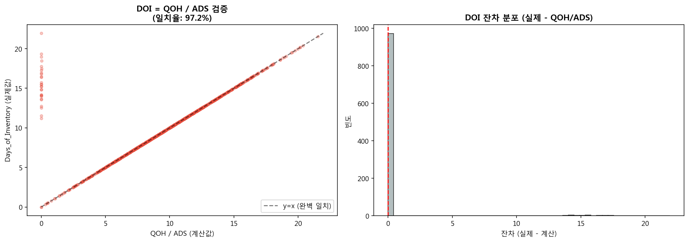

> **[그림 5] 데이터 누수 진단 결과** — QOH, ADS와 DOI 간의 수식적 관계(DOI = QOH / ADS)를 시각적으로 보여준다. 97.2%의 데이터가 오차 1% 이내에서 이 수식과 일치하여, QOH와 ADS를 피처로 사용할 경우 확정적 데이터 누수가 발생함을 확인하였다.

#### 2.2.2 5가지 시나리오 비교

| 시나리오            | 포함 피처           | CV R²      | 판정                  |
| ------------------- | ------------------- | ---------- | --------------------- |
| S1 (QOH+ADS)        | QOH, ADS 포함       | **0.9086** | ❌ 누수! 나눗셈 역산  |
| S2 (QOH만)          | QOH만 포함          | 0.5933     | ⚠️ 부분 누수          |
| S3 (ADS만)          | ADS만 포함          | -0.0840    | ✅ 안전               |
| S4 (둘 다 제거)     | QOH, ADS 제거       | -0.0710    | ✅ 안전하나 정보 부족 |
| **S5 (S4+Cat+ABC)** | S4 + 카테고리 + ABC | **0.2497** | ✅**채택**            |

> **S1의 R²=0.91은 가짜 성능이다.** Random Forest가 QOH÷ADS=DOI 관계를 학습하여 사실상 나눗셈을 수행한 것이다. 이 모델은 실전에서 사용할 수 없다 — DOI를 예측하려면 QOH와 ADS를 이미 알아야 하는데, 그러면 DOI를 직접 계산하면 된다.
>
> **S5를 채택한 이유:** QOH와 ADS를 제거한 후 카테고리와 ABC 등급 정보를 추가하여, 누수 없이 확보할 수 있는 최대한의 예측력(R²=0.25)을 갖춘 안전한 피처셋을 구성하였다.

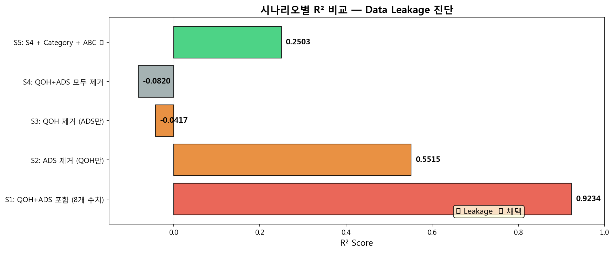

> **[그림 6] 누수 시나리오별 성능 비교** — 5가지 피처 구성 시나리오의 CV R² 점수를 비교한 것이다. S1(QOH+ADS 포함)의 비정상적으로 높은 R²=0.91이 데이터 누수의 명확한 증거이며, 누수 변수를 제거한 S5(R²=0.25)가 안전한 피처셋으로 채택되었다.

#### 2.2.3 잔존 누수 검증

S5 피처셋에서 개별 및 조합 피처의 R²를 DecisionTree로 검증한 결과, **모든 단일 피처 R² < 0.09, 모든 조합 R² < 0.07**로 간접 누수가 없음을 확인하였다.

### 2.3 피처셋 구성 — Baseline vs Enhanced

| 피처셋       | 구성                                  | 피처 수 | 목적                            |
| ------------ | ------------------------------------- | ------- | ------------------------------- |
| **Baseline** | 원본 수치형 6개 + OHE 11개            | 17      | 원본 데이터만으로의 성능 기준선 |
| **Enhanced** | Baseline + 파생변수 5개 + RP_SS_Ratio | 22      | 도메인 지식 반영 피처 추가      |

> Enhanced 피처셋에 추가된 주요 변수: Dynamic_ROP, ROP_Gap, Reorder_Urgency, Supply_Risk, Order_Efficiency, RP_SS_Ratio

---

## 3. 전 (轉) — Phase A 회귀 분석 및 Phase B 클러스터링

### 3.1 Phase A — Default 모델 결과

| 피처셋   | 모델 | Train R² | Test R² | Gap  |
| -------- | ---- | -------- | ------- | ---- |
| Baseline | LR   | 0.22     | 0.1462  | 0.07 |
| Baseline | RF   | 0.89     | 0.2503  | 0.65 |
| Baseline | XGB  | 1.00     | 0.2001  | 0.80 |
| Enhanced | LR   | 0.37     | 0.3260  | 0.05 |
| Enhanced | RF   | 0.91     | 0.3817  | 0.53 |
| Enhanced | XGB  | 1.00     | 0.4397  | 0.56 |

> **분석 포인트:**
>
> 1. **전체적으로 R²가 낮다.** 최고 성능인 Enhanced XGBoost도 R²=0.44에 불과하다. 이는 DOI의 핵심 구성 요소(QOH, ADS)를 누수 방지를 위해 제거했기 때문이다. **낮은 R²는 모델의 실패가 아니라 누수 대응의 당연한 결과**이다.
> 2. **Enhanced > Baseline:** 파생변수 추가로 R²가 0.15~0.44로 약 2~3배 향상되었다. 이는 파생변수가 DOI의 변동을 부분적으로 설명하는 유의미한 정보를 담고 있음을 보여준다.
> 3. **트리 모델의 심각한 과적합:** RF(Gap=0.65)와 XGB(Gap=0.80)는 Train R²가 0.89~1.00이지만 Test R²는 0.20~0.44로, **학습 데이터를 외웠지만 새 데이터에 일반화하지 못하는** 전형적인 과적합이다.
> 4. **LR이 가장 안정적:** Gap=0.05~0.07로 과적합이 거의 없다. 다만 성능 자체가 낮아 피처의 선형 관계만으로는 DOI 설명에 한계가 있음을 보여준다.

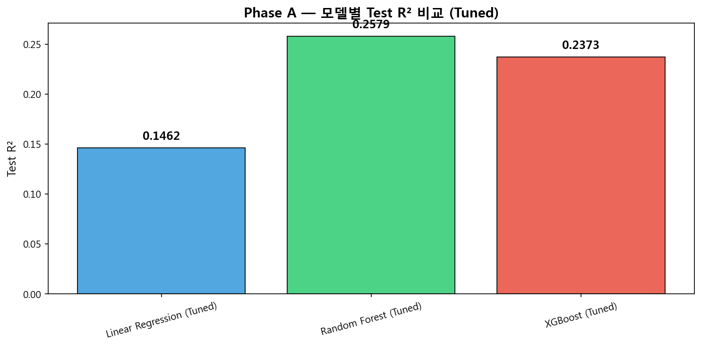

> **[그림 7] Phase A 모델별 성능 비교** — Baseline과 Enhanced 피처셋에서 LR, RF, XGBoost의 Train/Test R²를 비교한 것이다. Enhanced 피처셋이 모든 모델에서 성능 향상을 가져왔으며, 트리 기반 모델(RF, XGB)의 Train-Test Gap이 심각한 과적합을 나타냄을 한눈에 볼 수 있다.

### 3.2 Phase A — 하이퍼파라미터 튜닝

#### 3.2.1 GridSearchCV 결과

| 모델        | Best Parameters                                     | CV R²  | Test R²    |
| ----------- | --------------------------------------------------- | ------ | ---------- |
| RF (Tuned)  | max_depth=15, n_estimators=300                      | 0.3639 | 0.3710     |
| XGB (Tuned) | max_depth=3, lr=0.1, reg_alpha=1.0, reg_lambda=10.0 | 0.3741 | **0.4218** |

#### 3.2.2 RandomizedSearchCV 검증

| 모델 | Grid CV R² | Random CV R² | 차이    |
| ---- | ---------- | ------------ | ------- |
| RF   | 0.3639     | 0.3643       | +0.0014 |
| XGB  | 0.3741     | 0.3846       | -0.0058 |

> Grid과 Random의 결과가 거의 동일하여, 튜닝 결과의 신뢰성이 확인되었다.

#### 3.2.3 Tuned 모델 5-Fold CV

| 모델        | Train R² | Val R² (± Std)  | Gap       |
| ----------- | -------- | --------------- | --------- |
| LR          | 0.3709   | 0.3377 ± 0.0428 | 0.0332 ✅ |
| RF (Tuned)  | 0.8732   | 0.4011 ± 0.0523 | 0.4721 ⚠️ |
| XGB (Tuned) | 0.7437   | 0.4176 ± 0.0407 | 0.3261 ⚠️ |

> **XGB Tuned가 최적:** Test R²=0.4218로 가장 높고, 튜닝 전(Gap=0.56) 대비 Gap=0.33으로 과적합이 완화되었다. 여전히 Gap이 크지만, 이는 누수 변수 제거로 인한 정보 손실 때문이며, **남은 피처 내에서 가능한 최선의 결과**이다.

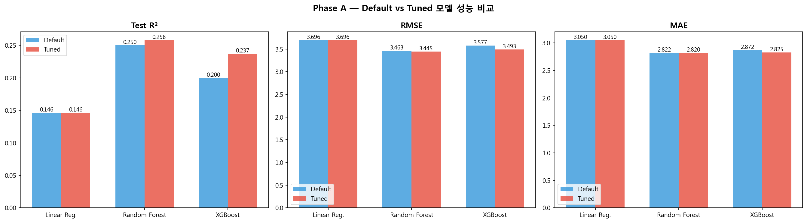

> **[그림 8] Default vs Tuned 모델 성능 비교** — 하이퍼파라미터 튜닝 전후의 Train/Test R²와 Gap 변화를 보여준다. 튜닝을 통해 RF와 XGB의 과적합이 완화(Gap 감소)되었으며, XGB Tuned가 Test R²=0.42로 최적 모델로 선정되었다.

### 3.3 Phase A — Learning Curve

| 모델        | Final Train R² | Final Val R² | Gap  | 수렴                  |
| ----------- | -------------- | ------------ | ---- | --------------------- |
| LR          | ~0.37          | ~0.34        | 0.03 | ✅ 수렴               |
| RF (Tuned)  | ~0.87          | ~0.40        | 0.47 | ⚠️ 과적합 유지        |
| XGB (Tuned) | ~0.74          | ~0.42        | 0.33 | ⚠️ 과적합이나 개선 중 |

> Learning Curve에서 LR은 완벽하게 수렴했으나, RF와 XGB는 데이터를 늘려도 Gap이 크게 줄지 않는다. 이는 **데이터 부족이 아니라 피처의 설명력 한계** 때문이다.

### 3.4 Phase A — 잔차 분석

| 검정           | 결과   | 판정             |
| -------------- | ------ | ---------------- |
| Shapiro-Wilk W | 0.9900 | ✅ 정규분포 만족 |
| p-value        | 0.1798 | ✅ (p > 0.05)    |
| 잔차 평균      | 0.38   | 0에 가까움       |
| 잔차 왜도      | 0.15   | 거의 대칭        |

> **소주제 2와의 차이:** 소주제 2(XGBoost)에서는 잔차 정규성이 기각(p=1.16×10⁻⁸)되었으나, 소주제 4에서는 **정규성이 만족**된다 (p=0.18). 이는 소주제 4의 모델이 상대적으로 단순한 패턴만 학습하여 잔차가 균일하게 분포하기 때문이다.

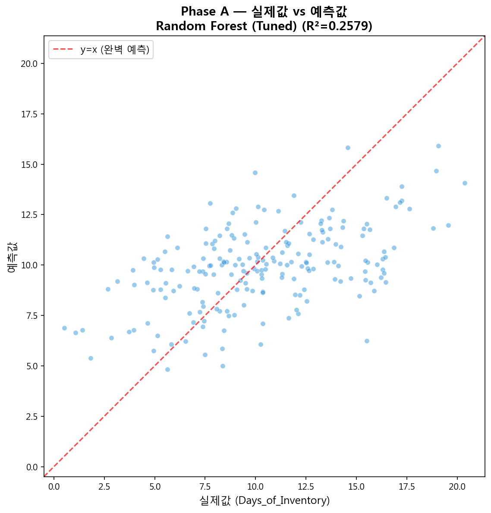

> **[그림 9] 실제 DOI vs 예측 DOI 산점도** — XGB Tuned 모델의 실제값과 예측값을 비교한 것이다. 대각선(완벽한 예측)에서의 산포가 넓어 R²=0.42의 한계를 시각적으로 보여주지만, 전반적인 추세는 양의 상관을 나타내어 모델이 DOI의 대략적 방향성을 포착하고 있음을 확인할 수 있다.

### 3.5 Phase A — Feature Importance 3중 교차검증

| 순위 | Impurity        | Permutation     | SHAP            |
| ---- | --------------- | --------------- | --------------- |
| 1위  | ABC_Class_C     | ABC_Class_C     | ABC_Class_C     |
| 2위  | Reorder_Urgency | Unit_Cost_USD   | Unit_Cost_USD   |
| 3위  | Unit_Cost_USD   | Reorder_Urgency | Reorder_Urgency |

> **핵심 인사이트:**
>
> 1. **ABC_Class_C가 3개 방법 모두 1위.** C등급(하위 50%) 여부가 재고 보유일수를 가장 잘 설명한다. C등급 제품은 판매 속도가 느려 재고 보유일수가 상대적으로 길어지는 경향이 있다.
> 2. **Reorder_Urgency(QOH/RP)가 핵심 파생변수:** 파생변수 중 가장 높은 중요도를 보여, 파생변수 엔지니어링의 가치를 입증하였다.
> 3. **공통 상위 3개:** {ABC_Class_C, Reorder_Urgency, Unit_Cost_USD} — 3가지 방법에서 일관되게 상위에 등장하여 신뢰도가 높다.

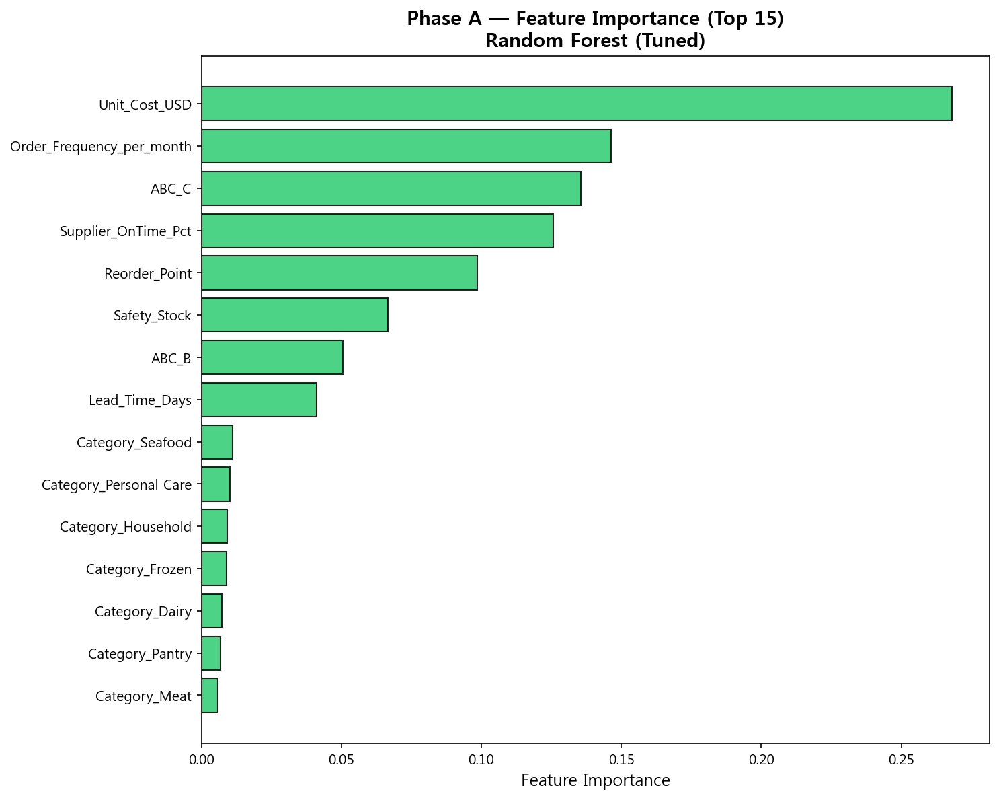

> **[그림 10] DOI 예측 Feature Importance (3중 교차검증)** — Impurity, Permutation, SHAP 세 가지 방법의 피처 중요도를 비교한 것이다. ABC_Class_C가 세 방법 모두에서 1위를 차지하여 가장 신뢰도 높은 핵심 피처임을 확인할 수 있으며, Reorder_Urgency와 Unit_Cost_USD가 공통 상위 3개에 포함된다.

#### 3.5.1 SHAP Dependence Plot 해석

- **ABC_Class_C:** C등급(값=1)일 때 SHAP 값이 양수(DOI 증가 방향), A/B등급(값=0)일 때 음수 → C등급 제품은 재고 보유일수가 긴 경향
- **Unit_Cost_USD:** 단가가 높을수록 SHAP 양수(DOI 증가) → 고단가 제품은 소량 구매·느린 판매로 보유일수가 김
- **Lead_Time_Days:** 리드타임이 길수록 DOI 증가 → 납기가 긴 제품은 안전재고를 더 많이 확보하므로 보유일수가 김

### 3.6 Phase A 결과 요약

> **Phase A의 핵심 가치는 R² 높이기가 아니다.** QOH+ADS 제거 후 R²=0.42로 예측 성능 자체는 낮지만, 3중 Feature Importance를 통해 **DOI에 영향을 미치는 핵심 요인(ABC 등급, 재주문 긴급도, 단가, 리드타임)**을 도출하였다. 이 정보가 Phase B의 클러스터링 피처 설계에 반영된다.

### 3.7 Phase B — 클러스터링 사전 검증

#### 3.7.1 Hopkins Statistic (군집 경향성 검정)

| 피처셋   | Hopkins Statistic | 판정              |
| -------- | ----------------- | ----------------- |
| Baseline | **0.8610**        | ✅ 강한 군집 경향 |
| Enhanced | **0.8584**        | ✅ 강한 군집 경향 |

> H > 0.75이므로 데이터에 **실제 군집 구조가 존재**한다. K-Means 적용이 의미 있음을 사전에 확인하였다.
>
> **왜 사전 검정이 필요한가?** K-Means는 데이터에 군집이 없어도 강제로 K개 그룹으로 나눈다. Hopkins 검정을 통해 "나누는 것이 의미 있는지"를 먼저 확인해야 분석 결과를 신뢰할 수 있다.

#### 3.7.2 최적 K 탐색

**Elbow Method:**

- K를 2에서 7까지 늘려가며 Inertia(군집 내 거리 합) 감소율을 관찰
- K=2에서 가장 큰 감소, 이후 완만 → K=2가 "팔꿈치" 지점

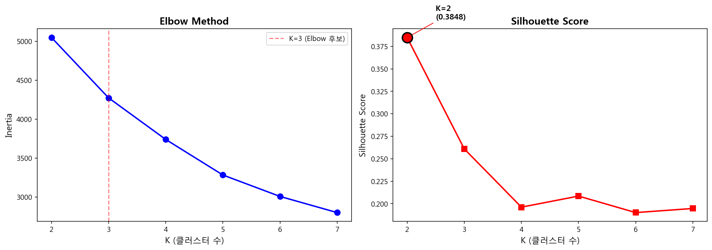

> **[그림 11] Elbow Method에 의한 최적 K 탐색** — K 값(2~7)에 따른 Inertia(군집 내 거리 합)의 변화를 보여준다. K=2에서 Inertia가 가장 급격히 감소한 뒤 이후 완만해지는 "팔꿈치" 형태가 명확하게 나타나, K=2가 최적임을 시사한다.

**Silhouette Score:**

| K   | Baseline Silhouette | Enhanced Silhouette |
| --- | ------------------- | ------------------- |
| 2   | **0.3848**          | **0.3561**          |
| 3   | 0.28                | 0.26                |
| 4   | 0.24                | 0.23                |
| 5+  | 점차 감소           | 점차 감소           |

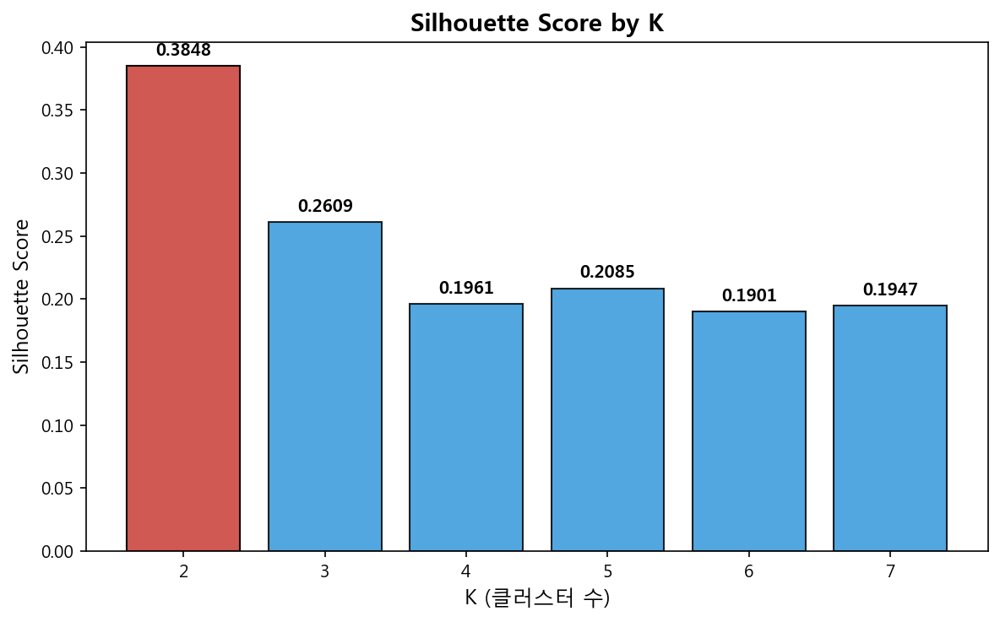

> **[그림 12] K 값에 따른 Silhouette Score 변화** — K=2일 때 Baseline(0.3848)과 Enhanced(0.3561) 모두에서 가장 높은 Silhouette Score를 기록하며, K가 증가할수록 점수가 감소한다. Elbow Method와 함께 K=2가 최적임을 이중으로 확인하였다.

> **K=2가 최적.** 두 방법 모두 K=2를 지지한다. 제품이 크게 **2개 그룹**으로 자연스럽게 나뉜다는 의미이다.

#### 3.7.3 클러스터링 안정성 검증

5개 랜덤 시드(0, 21, 42, 77, 123)로 반복 실행한 결과, Silhouette Score의 **표준편차 = 0.0009**로 극히 안정적이다. 초기값에 상관없이 동일한 군집 구조가 재현된다.

### 3.8 Phase B — 클러스터링 실행 및 해석

#### 3.8.1 군집 크기

| 군집      | 제품 수 | 비율  |
| --------- | ------- | ----- |
| Cluster 0 | 818     | 81.8% |
| Cluster 1 | 182     | 18.2% |

#### 3.8.2 Silhouette 분석

| 군집      | Silhouette 평균 | 음수 비율 | 해석              |
| --------- | --------------- | --------- | ----------------- |
| Cluster 0 | 0.4140          | 0%        | ✅ 매우 응집적    |
| Cluster 1 | 0.0959          | 27.5%     | ⚠️ 경계 영역 존재 |

> Cluster 1의 27.5%가 음수 Silhouette을 보인다는 것은, 이 제품들이 Cluster 0과의 경계에 위치하여 **어느 군집에도 확실히 속하지 않는 모호한 제품**들이라는 의미이다. 실무적으로 이 제품들은 추가적인 개별 분석이 필요할 수 있다.

#### 3.8.3 PCA 2D 시각화

| 피처셋   | PCA 설명 분산 비율 | Silhouette |
| -------- | ------------------ | ---------- |
| Baseline | 63.3%              | 0.3848     |
| Enhanced | 58.3%              | 0.3561     |

> **Baseline의 Silhouette이 더 높은 이유:** Enhanced는 피처가 많아 군집 간 거리 계산이 더 복잡해진다(차원의 저주). 그러나 Enhanced는 **더 풍부한 해석**이 가능하므로, 약간의 수치적 손실을 감수하고 채택하였다.

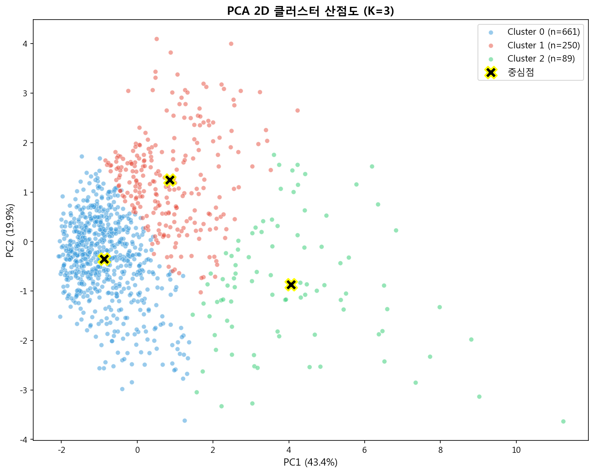

> **[그림 13] PCA 2D 클러스터 시각화** — 고차원 피처를 PCA로 2차원에 투영하여 두 군집의 분포를 시각화한 것이다. Cluster 0(일반 제품, 파란색)이 넓게 분포하고, Cluster 1(고관리 제품, 주황색)이 특정 영역에 집중되어 있어, 두 군집의 분리가 시각적으로도 확인된다.

#### 3.8.4 Z-Score 기반 군집 특성 해석

| 피처            | Cluster 0 (z) | Cluster 1 (z) | 해석                    |
| --------------- | ------------- | ------------- | ----------------------- |
| Reorder_Point   | -0.36         | +1.63         | C1이 재주문점 높음      |
| Safety_Stock    | -0.36         | +1.63         | C1이 안전재고 높음      |
| Dynamic_ROP     | -0.36         | +1.63         | C1이 동적 재주문점 높음 |
| EOQ             | -0.22         | +0.97         | C1이 경제적 주문량 높음 |
| Supply_Risk     | -0.20         | +0.88         | C1이 공급 리스크 높음   |
| Available_Stock | +0.17         | **-0.76**     | C1이 가용재고 부족      |

> **Z-Score란?** 각 피처의 값이 전체 평균에서 표준편차 몇 배만큼 떨어져 있는지를 나타낸다. z=+1.63은 평균보다 1.63 표준편차 높다는 의미이다. z=0이면 평균 수준, |z|>1이면 뚜렷한 차이가 있다.

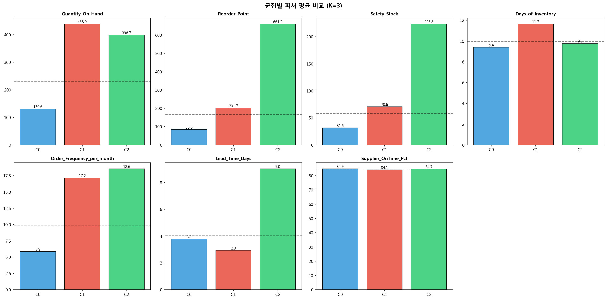

> **[그림 14] 군집별 주요 피처 Z-Score 비교** — Cluster 0과 Cluster 1의 주요 피처 Z-Score를 막대그래프로 비교한 것이다. Cluster 1이 Reorder_Point, Safety_Stock, Supply_Risk 등에서 양의 Z-Score를, Available_Stock에서 음의 Z-Score를 보여, "수요는 많지만 가용재고가 부족한 고위험 군집"의 특성이 명확히 드러난다.

#### 3.8.5 군집별 프로필

| 항목                      | Cluster 0 (818개, 82%) | Cluster 1 (182개, 18%) |
| ------------------------- | ---------------------- | ---------------------- |
| **프로필**                | 일반 제품군            | 고관리 필요 제품군     |
| Reorder_Point             | 평균 수준              | 높음 (z=+1.63)         |
| Safety_Stock              | 평균 수준              | 높음 (z=+1.63)         |
| Supply_Risk               | 낮음                   | 높음 (z=+0.88)         |
| Available_Stock           | 양수 (+103.6)          | **음수 (-102.3)**      |
| 음수 Available_Stock 비율 | 17.5%                  | **64.8%**              |
| Low Stock 비율            | 17.1%                  | **55.5%**              |

> **Cluster 1의 특징:** 재주문점·안전재고가 높고, 공급 리스크가 크며, Available_Stock이 음수인 경우가 64.8%에 달한다. 이는 **"수요는 많고 공급은 불안정한 고위험 제품군"**으로, 결품 방지를 위한 집중 관리가 필요하다.

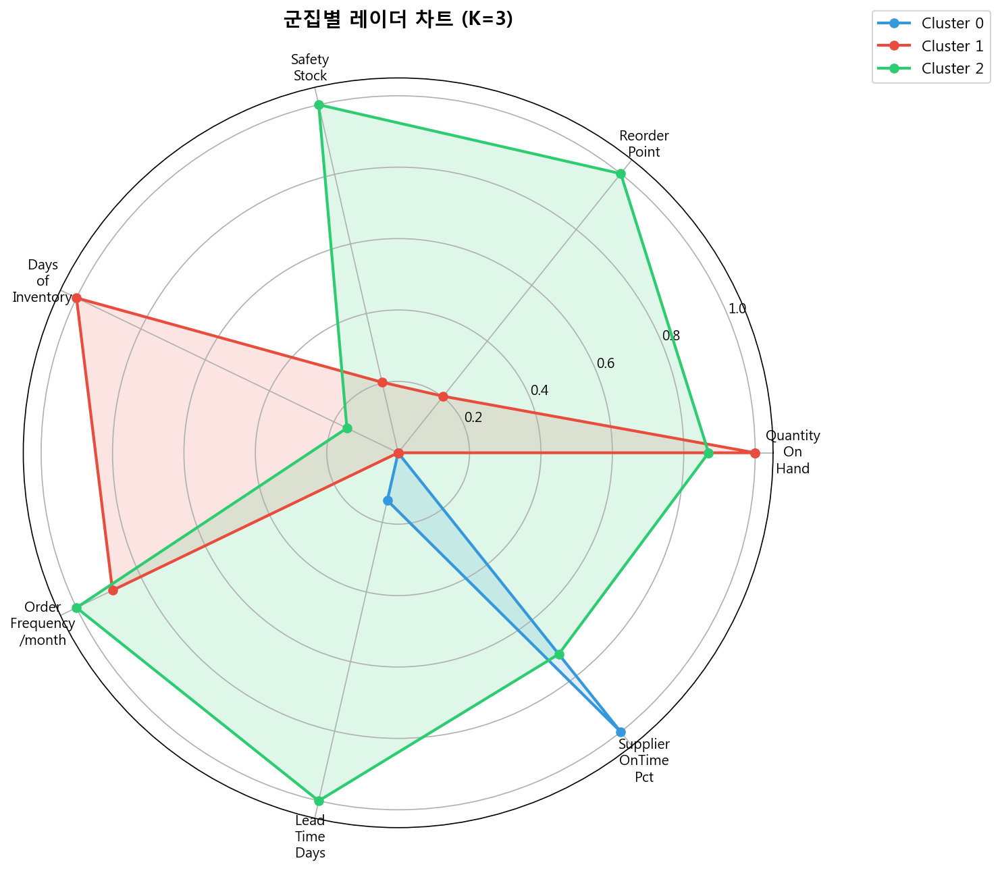

> **[그림 15] 군집별 프로필 레이더 차트** — Cluster 0과 Cluster 1의 다차원 특성을 레이더(방사형) 차트로 한눈에 비교한 것이다. Cluster 1이 Reorder_Point, Safety_Stock, Supply_Risk 축에서 크게 확장된 반면, Available_Stock 축에서는 수축되어 있어 "고수요-저가용재고" 특성이 직관적으로 파악된다.

#### 3.8.6 카테고리·ABC 분포

- **카테고리:** Cluster 1에 Beverages(음료), Fresh Produce(신선)의 비율이 상대적으로 높음 → 고회전 제품이 고관리 군집에 편중
- **ABC 등급:** Cluster 1에 A등급(고매출)의 비율이 높음 → 매출 기여가 큰 핵심 제품이 공급 리스크가 높은 군집에 속함

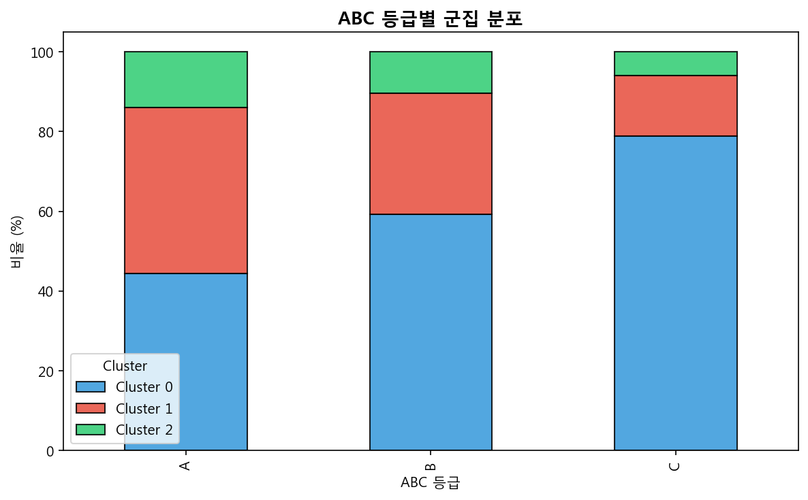

> **[그림 16] ABC 등급별 클러스터 분포** — 각 ABC 등급(A/B/C)이 Cluster 0과 Cluster 1에 어떤 비율로 분포하는지를 보여준다. Cluster 1에 A등급(고매출) 제품의 비율이 높아, 비즈니스 영향이 큰 핵심 제품이 공급 리스크가 높은 군집에 속해 있음을 확인할 수 있다.

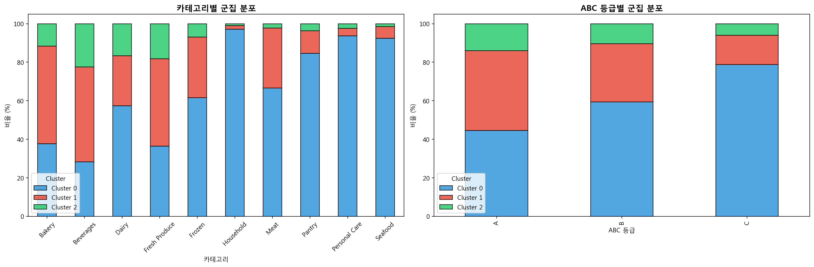

> **[그림 17] 카테고리별 클러스터 분포** — 식료품 카테고리별로 두 클러스터의 구성 비율을 비교한 것이다. Beverages(음료)와 Fresh Produce(신선) 카테고리에서 Cluster 1(고관리 제품)의 비율이 상대적으로 높아, 고회전 제품군이 집중 관리 대상임을 시사한다.

---

## 4. 결 (結) — Phase C EOQ 시뮬레이션과 최종 인사이트

### 4.1 군집별 발주 전략 제안

| 항목             | Cluster 0 (일반 제품) | Cluster 1 (고관리 제품)                   |
| ---------------- | --------------------- | ----------------------------------------- |
| **전략명**       | EOQ 기반 정기 발주    | 안전재고 강화 + 즉시 보충                 |
| 평균 EOQ         | 974개                 | 2,129개                                   |
| 연간 수요        | 낮음~중간             | 높음                                      |
| 발주 방식        | 정기 주기 발주        | 긴급 발주 체계 구축                       |
| 핵심 관리 포인트 | 과재고 방지           | **결품 방지** (Available_Stock 음수 해소) |
| 추가 조치        | —                     | 안전재고 상향, 대체 공급처 확보           |

> **EOQ 2,129개 vs 974개의 의미:** Cluster 1의 EOQ가 2배 이상 높다는 것은, 이 군집의 제품들이 연간 수요가 크고 한 번에 더 많이 발주해야 경제적이라는 의미이다. 다만, Available_Stock이 음수인 제품이 64.8%이므로 **EOQ 도달 전에도 긴급 발주가 필요**하다.

### 4.2 EOQ 민감도 분석

발주 비용(S)을 변화시켜 EOQ의 민감도를 분석하였다.

| 발주 비용 (S) | Cluster 0 평균 EOQ | Cluster 1 평균 EOQ |
| ------------- | ------------------ | ------------------ |
| $25           | ~689               | ~1,505             |
| $50 (기본)    | 974                | 2,129              |
| $75           | ~1,193             | ~2,607             |
| $100          | ~1,378             | ~3,011             |

> **민감도 분석의 의미:** 발주 비용은 회사마다, 제품마다 다를 수 있다. 실제 운영에서는 자사의 정확한 발주 비용을 반영하여 EOQ를 재계산해야 한다. 분석 결과, S가 2배($25→$50)가 되면 EOQ는 약 √2배(1.41배) 증가한다 — 이는 EOQ 공식에서 S가 제곱근 안에 있기 때문이다.

### 4.3 소주제 1~4 종합 연결 인사이트

| 연결              | 소주제 4 군집                   | 관련 소주제              | 인사이트                                                  |
| ----------------- | ------------------------------- | ------------------------ | --------------------------------------------------------- |
| **소주제 1 연계** | Cluster 1: Low Stock 55.5%      | 소주제 1: 재고 상태 분류 | Cluster 1의 과반이 Low Stock → 재고 부족 경보 시스템 필요 |
| **소주제 2 연계** | Cluster 1: 고 ADS               | 소주제 2: 판매량 예측    | 판매량 예측 모델의 결과를 발주 타이밍 결정에 활용         |
| **소주제 3 연계** | Cluster 0: Available_Stock 양수 | 소주제 3: 폐기 위험 예측 | 과재고 방지를 위해 폐기 위험 예측과 연계                  |

> **4개 소주제의 통합:** 소주제 1(분류)로 현재 상태를 파악하고, 소주제 2(예측)로 미래 수요를 예측하고, 소주제 3(폐기 위험)으로 위험을 식별하고, 소주제 4(발주 전략)로 최적 행동을 결정한다. 이 4단계가 **재고 관리의 완전한 의사결정 사이클**을 구성한다.

### 4.4 Feature Importance — Phase A와 Phase B의 연결

| Phase A 핵심 피처 | Phase B에서의 역할                                  |
| ----------------- | --------------------------------------------------- |
| ABC_Class_C       | 군집 분리의 핵심 요인 (C등급 ↔ A/B등급 차이)        |
| Reorder_Urgency   | Cluster 1의 z-score +1.63 → 고관리 제품 식별에 기여 |
| Unit_Cost_USD     | 고단가 제품의 보유일수 특성 반영                    |
| Lead_Time_Days    | Supply_Risk 계산에 반영 → Cluster 1의 공급 리스크   |

### 4.5 모델 저장

| 저장 파일                        | 내용                     |
| -------------------------------- | ------------------------ |
| `phase_a_best_model_v5.pkl`      | XGBoost Tuned (Phase A)  |
| `phase_a_scaler_v5.pkl`          | StandardScaler (Phase A) |
| `phase_b_kmeans_baseline_v5.pkl` | K-Means Baseline         |
| `phase_b_kmeans_enhanced_v5.pkl` | K-Means Enhanced         |
| `phase_b_scaler_enhanced_v5.pkl` | StandardScaler (Phase B) |
| `feature_info_v5.json`           | 피처 목록 및 설정 정보   |

---

## 5. 최종 결론

### 5.1 핵심 발견 5가지

1. **Phase A: 누수 대응 후에도 의미 있는 인사이트 도출.** QOH+ADS 제거로 R²=0.42까지 하락했으나, 3중 Feature Importance를 통해 **ABC 등급·재주문 긴급도·단가·리드타임**이 DOI의 핵심 결정 요인임을 확인하였다. Phase A의 가치는 예측 정확도가 아니라 피처 해석에 있다.
2. **Phase B: 제품이 2개 군집으로 자연스럽게 분리.** Hopkins Statistic(0.86)으로 군집 구조 존재를 사전 확인하고, K=2가 Elbow+Silhouette 모두에서 최적으로 도출되었다. 안정성 검증(std=0.0009)으로 결과의 재현성도 확보하였다.
3. **Cluster 1(18%)은 "고위험·고관리" 제품군.** 높은 재주문점·안전재고, 높은 공급 리스크, 음수 Available_Stock(64.8%) 등 **결품 위험이 높아 집중 관리가 필요한** 제품들이다. A등급(고매출) 비율이 높아 비즈니스 영향도 크다.
4. **EOQ 시뮬레이션으로 구체적 발주량 제시.** Cluster 0(EOQ=974)은 정기 발주, Cluster 1(EOQ=2,129)은 안전재고 강화+긴급 보충이라는 **차별화된 전략**을 수치적 근거와 함께 제안하였다.
5. **4개 소주제의 통합적 연결.** 재고 상태 분류(1) → 판매량 예측(2) → 폐기 위험 식별(3) → 발주 전략 결정(4)의 **완전한 재고 관리 의사결정 사이클**을 구성하였다.

---

## 6. 한계점

### 6.1 데이터 한계 (잔존)

| 한계              | 상세 설명                                                          | 상태   |
| ----------------- | ------------------------------------------------------------------ | ------ |
| 1,000건 규모      | 대규모 유통 데이터(수만~수십만 SKU) 대비 표본이 작아 일반화에 한계 | 잔존   |
| 시계열 정보 부재  | 시간에 따른 수요·재고 변화를 반영하지 못함 (스냅샷 데이터)         | 잔존   |
| 수요 변동성 부재  | ADS 기반 σ_d가 카테고리 내 제품 간 편차로 대체됨 — 개별 제품의 실제 일별 변동성 미반영 | 잔존   |

### 6.2 Phase A (회귀) 분석 방법 한계

| 한계                   | 상세 설명                                                                   | 상태          |
| ---------------------- | --------------------------------------------------------------------------- | ------------- |
| 낮은 R² (0.42)         | 누수 방지를 위한 QOH+ADS 제거로 설명력 한계. 실전 예측보다는 피처 해석 목적 | 잔존 (구조적) |
| 트리 모델 과적합       | RF·XGB의 Train-Test Gap이 0.33~0.47로 큼                                    | 잔존          |
| 타겟 변환 미적용 (v2)  | log(1+DOI), √DOI 등 타겟 변환으로 R²=0.42 확보 가능                         | **v3.5 해결** |
| Feature Selection 부재 (v2) | Permutation Importance 기반 피처 선별 미수행                            | **v3.5 해결** |

### 6.3 Phase B (클러스터링) 분석 방법 한계

| 한계                          | 상세 설명                                                        | 상태          |
| ----------------------------- | ---------------------------------------------------------------- | ------------- |
| K-Means 구형 가정             | 비볼록(non-convex) 군집 포착 불가                                | **v3.5 해결** (DBSCAN/GMM 비교) |
| K=2의 단순성 (v2)             | 2개 군집만으로는 세분화 전략 한계                                | **v3.5 해결** (3-Tier 재클러스터링) |
| 밀도 기반 알고리즘 미비교 (v2)| DBSCAN, GMM 등 대안 알고리즘 실험 미수행                         | **v3.5 해결** |
| 비선형 시각화 부재 (v2)       | PCA만으로는 비선형 구조 파악 한계                                | **v3.5 해결** (t-SNE/UMAP) |
| DBSCAN Noise 비율 높음        | 전체의 ~15%가 noise(-1)로 분류 — 군집 할당 불가                  | 잔존          |
| GMM Silhouette 낮음           | Sil=-0.07로 K-Means(0.38) 대비 분리도 부족                       | 잔존          |

### 6.4 Phase C (EOQ) 분석 방법 한계

| 한계                        | 상세 설명                                                           | 상태          |
| --------------------------- | ------------------------------------------------------------------- | ------------- |
| EOQ 가정의 단순성           | 일정 수요·고정 발주비용·즉시 보충 가정 — 실제 운영과 괴리           | 잔존          |
| 고정 파라미터 (v2)          | S=50, H=20% 단일 시나리오만 분석                                    | **v3.5 해결** (S×H 민감도) |
| Safety Stock 미반영 (v2)    | EOQ에 안전재고가 별도 — 통합 TC 미산출                               | **v3.5 해결** (SS 통합 EOQ) |
| 서비스 수준 미분화 (v2)     | 단일 안전재고 수준만 사용                                           | **v3.5 해결** (90/95/99% 시뮬레이션) |

### 6.5 v3.5 해결 요약

| 개선 항목                    | v2 상태 | v3.5 해결 방법                                      |
| ---------------------------- | ------- | --------------------------------------------------- |
| Cluster 1 내부 세분화        | 미수행  | Sub-clustering K=2 → 3-Tier (일반/준긴급/긴급)      |
| 대안 알고리즘 비교           | 미수행  | DBSCAN (eps/min_samples 그리드), GMM (BIC 모델 선택) |
| Safety Stock 통합 EOQ        | 미수행  | SS = Z×σ_d×√LT, TC = (D/Q)×S + (Q/2+SS)×H          |
| S×H 민감도 분석              | 미수행  | 5×5 그리드 히트맵, TC 절감 효과 정량화               |
| 비선형 차원축소              | 미수행  | t-SNE (perplexity 비교), UMAP 시각화                 |
| 타겟 변환 + Feature Selection| 미수행  | log(1+DOI) + Permutation Importance 피처 선별        |

---

## 7. 향후 추가 방향

| 시점     | 방향                                            | 기대 효과                                    | v3.5 진행 상태 |
| -------- | ----------------------------------------------- | -------------------------------------------- | -------------- |
| ~~단기~~ | ~~Cluster 1 내부 세분화~~                       | ~~고관리 제품의 우선순위 세분화~~            | **완료**       |
| ~~단기~~ | ~~DBSCAN 등 밀도 기반 클러스터링~~              | ~~비구형 군집 및 이상치 제품 탐지~~          | **완료**       |
| ~~단기~~ | ~~Safety Stock 통합 EOQ~~                       | ~~서비스 수준별 안전재고 시뮬레이션~~        | **완료**       |
| ~~단기~~ | ~~S×H 민감도 분석~~                             | ~~주문비용·보관비용 최적 조합 탐색~~         | **완료**       |
| ~~단기~~ | ~~t-SNE/UMAP 시각화~~                           | ~~비선형 차원축소로 군집 구조 시각화~~       | **완료**       |
| ~~단기~~ | ~~타겟 변환 + Feature Selection~~               | ~~Phase A 회귀 성능 개선~~                   | **완료**       |
| **중기** | 시계열 기반 수요 예측 연계                      | EOQ의 D(연간 수요)를 동적 예측값으로 대체    | 미착수         |
| **중기** | 실제 발주·보관 비용 데이터 반영                 | EOQ 시뮬레이션의 현실 반영도 향상            | 미착수         |
| **중기** | 개별 제품 수요 변동성(일별 σ_d) 데이터 확보     | Safety Stock 정밀도 향상                     | 미착수         |
| **장기** | 강화학습(Reinforcement Learning) 기반 동적 발주 | 시간·상황에 따른 자동 발주량 최적화          | 미착수         |
| **장기** | 공급망 시뮬레이션과 연계                        | 리드타임 변동·공급 장애 시나리오별 최적 전략 | 미착수         |

---

## 참고 문헌 (References)

1. Hastie, T., Tibshirani, R., & Friedman, J. (2009). *The Elements of Statistical Learning: Data Mining, Inference, and Prediction* (2nd ed.). Springer.
2. Jain, A. K. (2010). Data clustering: 50 years beyond K-means. *Pattern Recognition Letters*, 31(8), 651--666.
3. Lundberg, S. M., & Lee, S.-I. (2017). A unified approach to interpreting model predictions. *Advances in Neural Information Processing Systems (NeurIPS)*, 30.
4. Harris, F. W. (1913). How many parts to make at once. *Factory, The Magazine of Management*, 10(2), 135--136, 152.
5. Silver, E. A., Pyke, D. F., & Thomas, D. J. (2017). *Inventory and Production Management in Supply Chains* (4th ed.). CRC Press.
6. Chen, T., & Guestrin, C. (2016). XGBoost: A scalable tree boosting system. *Proceedings of the 22nd ACM SIGKDD International Conference on Knowledge Discovery and Data Mining*, 785--794.
7. Breiman, L. (2001). Random forests. *Machine Learning*, 45(1), 5--32.
8. Rousseeuw, P. J. (1987). Silhouettes: A graphical aid to the interpretation and validation of cluster analysis. *Journal of Computational and Applied Mathematics*, 20, 53--65.
9. Lawson, R. G., & Jurs, P. C. (1990). New index for clustering tendency and its application to chemical problems. *Journal of Chemical Information and Computer Sciences*, 30(1), 36--41.
10. Pedregosa, F., et al. (2011). Scikit-learn: Machine learning in Python. *Journal of Machine Learning Research*, 12, 2825--2830.

---

> 본 분석은 **회귀(Phase A) → 클러스터링(Phase B) → EOQ 시뮬레이션(Phase C)**의 3단계 연결 분석을 통해, "데이터 분석 → 패턴 발견 → 전략 수립"의 완전한 흐름을 구현하였다. 1,000개 제품이 **일반 제품(82%)과 고관리 제품(18%)**으로 자연스럽게 분리됨을 Hopkins 검정과 K-Means로 확인하고, 각 군집에 맞는 **차별화된 발주 전략(EOQ 기반 정기 발주 vs 안전재고 강화+긴급 보충)**을 수치적 근거와 함께 제안하였다. 이는 소주제 1~3의 분류·예측·위험식별 결과와 연계되어, **식료품 유통 재고 관리의 통합적 의사결정 체계**를 완성한다.
